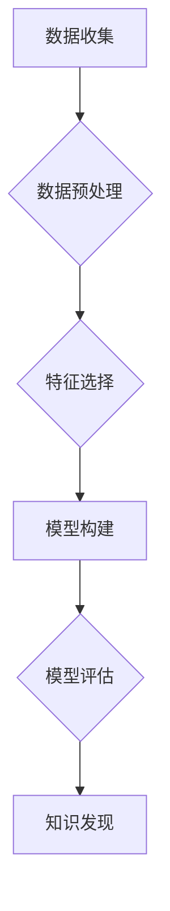

## AI人工智能核心算法原理与代码实例讲解：数据挖掘

> 关键词：数据挖掘，机器学习，分类算法，回归算法，聚类算法，关联规则，预测模型

## 1. 背景介绍

数据挖掘作为人工智能领域的重要分支，致力于从海量数据中发现隐藏的模式、规律和知识。随着数据量的爆炸式增长，数据挖掘技术在各个领域都得到了广泛应用，例如商业分析、金融预测、医疗诊断、科学研究等。

数据挖掘的核心是利用各种算法对数据进行分析和处理，从而提取有价值的信息。常见的算法包括分类算法、回归算法、聚类算法、关联规则挖掘算法等。这些算法各有特点，适用于不同的应用场景。

本篇文章将深入讲解数据挖掘中的核心算法原理，并结合代码实例，帮助读者理解算法的实现过程和应用场景。

## 2. 核心概念与联系

数据挖掘的核心概念包括：

* **数据预处理:**  对原始数据进行清洗、转换、整合等操作，使其适合算法处理。
* **特征选择:**  从原始数据中选择最具代表性的特征，提高算法的效率和准确性。
* **模型构建:**  根据数据特点选择合适的算法，构建预测模型或知识发现模型。
* **模型评估:**  使用测试数据对模型进行评估，衡量模型的性能。
* **知识发现:**  从挖掘出的模式和规律中提取有价值的知识，并将其应用于实际问题。

这些概念相互关联，共同构成了数据挖掘的完整流程。

**数据挖掘流程图:**



## 3. 核心算法原理 & 具体操作步骤

### 3.1  算法原理概述

本节将介绍三种常见的算法：分类算法、回归算法和聚类算法。

* **分类算法:**  用于将数据点分类到预定义的类别中。例如，判断邮件是否为垃圾邮件、识别图像中的物体等。
* **回归算法:**  用于预测连续数值输出。例如，预测房价、股票价格等。
* **聚类算法:**  用于将数据点根据相似性聚类到不同的组中。例如，客户群分析、图像分割等。

### 3.2  算法步骤详解

**分类算法:**

1. **数据预处理:**  对数据进行清洗、转换、编码等操作。
2. **特征选择:**  选择最具区分性的特征。
3. **模型训练:**  使用训练数据训练分类模型，例如决策树、支持向量机、神经网络等。
4. **模型评估:**  使用测试数据评估模型的准确率、召回率、F1-score等指标。
5. **模型部署:**  将训练好的模型部署到实际应用场景中。

**回归算法:**

1. **数据预处理:**  对数据进行清洗、转换、归一化等操作。
2. **特征选择:**  选择与目标变量相关的特征。
3. **模型训练:**  使用训练数据训练回归模型，例如线性回归、逻辑回归、支持向量回归等。
4. **模型评估:**  使用测试数据评估模型的均方误差、R-squared等指标。
5. **模型部署:**  将训练好的模型部署到实际应用场景中。

**聚类算法:**

1. **数据预处理:**  对数据进行清洗、转换、归一化等操作。
2. **特征选择:**  选择最具代表性的特征。
3. **模型训练:**  使用聚类算法，例如K-means、层次聚类、DBSCAN等，将数据点聚类到不同的组中。
4. **模型评估:**  使用聚类指标，例如Silhouette score、Dunn index等，评估聚类的质量。
5. **模型部署:**  将训练好的聚类结果应用于实际问题中。

### 3.3  算法优缺点

**分类算法:**

* **优点:**  能够准确地将数据点分类到预定义的类别中。
* **缺点:**  对数据分布的假设比较敏感，如果数据分布不符合假设，模型性能可能会下降。

**回归算法:**

* **优点:**  能够预测连续数值输出，适用于预测问题。
* **缺点:**  对异常值比较敏感，需要进行数据清洗和异常值处理。

**聚类算法:**

* **优点:**  能够发现数据中的潜在结构，适用于无监督学习问题。
* **缺点:**  聚类结果的解释性较弱，需要结合业务知识进行分析。

### 3.4  算法应用领域

* **分类算法:**  垃圾邮件过滤、图像识别、文本分类、欺诈检测等。
* **回归算法:**  房价预测、股票价格预测、销售预测、客户流失预测等。
* **聚类算法:**  客户群分析、市场细分、异常检测、图像分割等。

## 4. 数学模型和公式 & 详细讲解 & 举例说明

### 4.1  数学模型构建

**分类算法:**  常用的分类算法模型包括逻辑回归、支持向量机、决策树等。这些模型都建立在概率论和统计学的基础上，利用数学公式来描述数据之间的关系。

**回归算法:**  常用的回归算法模型包括线性回归、逻辑回归、支持向量回归等。这些模型都建立在最小二乘法和概率论的基础上，利用数学公式来描述目标变量与特征变量之间的关系。

**聚类算法:**  常用的聚类算法模型包括K-means、层次聚类、DBSCAN等。这些模型都建立在距离度量和相似性分析的基础上，利用数学公式来计算数据点之间的距离或相似性。

### 4.2  公式推导过程

**逻辑回归:**  逻辑回归模型使用sigmoid函数将线性模型的输出映射到0到1之间，表示数据点属于某个类别的概率。

$$
P(y=1|x) = \frac{1}{1 + e^{-(w^T x + b)}}
$$

其中，$P(y=1|x)$表示数据点$x$属于类别1的概率，$w$是权重向量，$b$是偏置项，$e$是自然对数的底数。

**线性回归:**  线性回归模型使用最小二乘法来估计模型参数，使得模型输出与真实值之间的误差最小。

$$
\hat{y} = w^T x + b
$$

其中，$\hat{y}$是模型输出，$w$是权重向量，$b$是偏置项，$x$是输入特征向量。

### 4.3  案例分析与讲解

**逻辑回归案例:**  假设我们想要预测一个客户是否会购买某个产品。我们可以使用逻辑回归模型，将客户的年龄、收入、购买历史等特征作为输入，预测客户购买该产品的概率。

**线性回归案例:**  假设我们想要预测房价。我们可以使用线性回归模型，将房屋面积、位置、房间数量等特征作为输入，预测房屋的价格。

## 5. 项目实践：代码实例和详细解释说明

### 5.1  开发环境搭建

本项目使用Python语言进行开发，需要安装以下软件包：

* **NumPy:**  用于数值计算。
* **Pandas:**  用于数据处理和分析。
* **Scikit-learn:**  用于机器学习算法实现。
* **Matplotlib:**  用于数据可视化。

### 5.2  源代码详细实现

**分类算法代码示例 (逻辑回归):**

```python
import numpy as np
from sklearn.linear_model import LogisticRegression
from sklearn.model_selection import train_test_split
from sklearn.metrics import accuracy_score

# 加载数据
data = np.loadtxt('data.csv', delimiter=',')
X = data[:, :-1]
y = data[:, -1]

# 将数据分成训练集和测试集
X_train, X_test, y_train, y_test = train_test_split(X, y, test_size=0.2, random_state=42)

# 创建逻辑回归模型
model = LogisticRegression()

# 训练模型
model.fit(X_train, y_train)

# 预测测试集结果
y_pred = model.predict(X_test)

# 计算模型准确率
accuracy = accuracy_score(y_test, y_pred)
print('模型准确率:', accuracy)
```

**回归算法代码示例 (线性回归):**

```python
import numpy as np
from sklearn.linear_model import LinearRegression
from sklearn.model_selection import train_test_split
from sklearn.metrics import mean_squared_error

# 加载数据
data = np.loadtxt('data.csv', delimiter=',')
X = data[:, :-1]
y = data[:, -1]

# 将数据分成训练集和测试集
X_train, X_test, y_train, y_test = train_test_split(X, y, test_size=0.2, random_state=42)

# 创建线性回归模型
model = LinearRegression()

# 训练模型
model.fit(X_train, y_train)

# 预测测试集结果
y_pred = model.predict(X_test)

# 计算模型均方误差
mse = mean_squared_error(y_test, y_pred)
print('模型均方误差:', mse)
```

**聚类算法代码示例 (K-means):**

```python
import numpy as np
from sklearn.cluster import KMeans
from sklearn.datasets import make_blobs

# 生成示例数据
X, y_true = make_blobs(n_samples=300, centers=4, cluster_std=0.60, random_state=0)

# 创建K-means模型
kmeans = KMeans(n_clusters=4, random_state=0)

# 训练模型
kmeans.fit(X)

# 获取聚类结果
labels = kmeans.labels_

# 可视化聚类结果
import matplotlib.pyplot as plt
plt.scatter(X[:, 0], X[:, 1], c=labels)
plt.show()
```

### 5.3  代码解读与分析

以上代码示例展示了三种常见算法的简单实现过程。

* **逻辑回归:**  使用Scikit-learn库中的LogisticRegression类实现逻辑回归模型，并使用训练集和测试集进行模型训练和评估。
* **线性回归:**  使用Scikit-learn库中的LinearRegression类实现线性回归模型，并使用训练集和测试集进行模型训练和评估。
* **K-means:**  使用Scikit-learn库中的KMeans类实现K-means聚类模型，并使用示例数据进行模型训练和聚类结果可视化。

### 5.4  运行结果展示

运行以上代码示例，可以得到模型的训练结果和评估指标，例如准确率、均方误差等。

## 6. 实际应用场景

### 6.1  电商推荐系统

数据挖掘技术可以用于构建电商推荐系统，根据用户的购买历史、浏览记录等数据，推荐用户可能感兴趣的商品。

### 6.2  金融风险控制

数据挖掘技术可以用于金融风险控制，例如信用卡欺诈检测、贷款风险评估等。

### 6.3  医疗诊断辅助

数据挖掘技术可以用于医疗诊断辅助，例如根据患者的症状、病史等数据，辅助医生诊断疾病。

### 6.4  未来应用展望

随着数据量的不断增长和算法的不断发展，数据挖掘技术将在更多领域得到应用，例如智能制造、自动驾驶、个性化教育等。

## 7. 工具和资源推荐

### 7.1  学习资源推荐

* **书籍:**
    * 《数据挖掘：概念与技术》
    * 《机器学习》
    * 《Python数据科学手册》
* **在线课程:**
    * Coursera上的数据挖掘课程
    * edX上的机器学习课程
    * Kaggle上的数据科学竞赛

### 7.2  开发工具推荐

