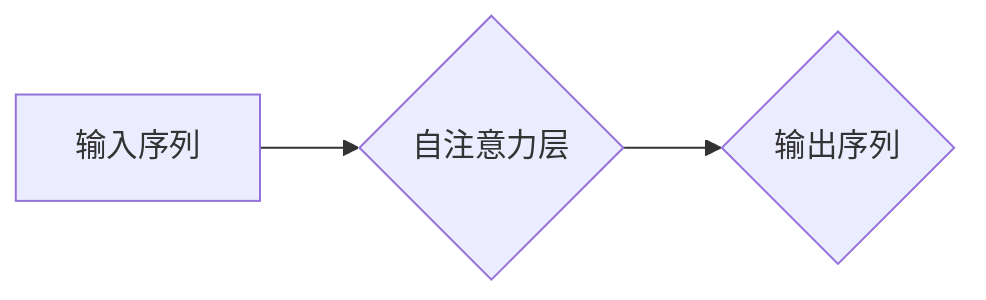

## Python深度学习实践：基于自注意力机制的序列模型

> 关键词：深度学习、自注意力机制、序列模型、Transformer、自然语言处理、Python

## 1. 背景介绍

### 1.1  问题的由来

在深度学习领域，序列数据处理一直是一个重要的研究方向。序列数据，例如文本、语音、时间序列等，其元素之间存在着固有的顺序关系，传统的深度学习模型难以有效地捕捉这些长距离依赖关系。这导致在许多序列建模任务，例如机器翻译、文本摘要、语音识别等，模型性能难以达到预期。

### 1.2  研究现状

近年来，随着Transformer模型的提出，序列建模领域取得了重大突破。Transformer模型的核心在于自注意力机制，它能够有效地捕捉序列中任意两个元素之间的依赖关系，打破了传统循环神经网络（RNN）的循环限制，从而能够更好地处理长序列数据。

### 1.3  研究意义

基于自注意力机制的序列模型在自然语言处理等领域具有广泛的应用前景。它能够提高模型的准确性、效率和鲁棒性，为解决实际问题提供更有效的解决方案。

### 1.4  本文结构

本文将深入探讨基于自注意力机制的序列模型，包括其核心概念、算法原理、数学模型、代码实现以及实际应用场景。

## 2. 核心概念与联系

自注意力机制是Transformer模型的核心，它允许模型关注序列中不同位置的元素，并根据其重要性赋予不同的权重。

**Mermaid 流程图:**



**核心概念:**

* **Query (Q):** 用于查询序列中其他元素的信息。
* **Key (K):** 用于表示序列中每个元素的特征。
* **Value (V):** 用于存储序列中每个元素的实际信息。
* **注意力权重:** 用于衡量Query与Key之间的相关性，决定了Value的权重。

**联系:**

自注意力机制通过计算Query与Key之间的相似度，得到注意力权重，然后根据注意力权重对Value进行加权求和，最终得到输出序列。

## 3. 核心算法原理 & 具体操作步骤

### 3.1  算法原理概述

自注意力机制的核心思想是通过计算Query与Key之间的相似度，来确定每个元素对其他元素的影响程度。

**具体步骤:**

1. 将输入序列映射到Query、Key和Value空间。
2. 计算Query与所有Key之间的相似度。
3. 将相似度转换为注意力权重。
4. 根据注意力权重对Value进行加权求和，得到输出序列。

### 3.2  算法步骤详解

1. **线性变换:** 将输入序列分别映射到Query、Key和Value空间。

$$
Q = XW_Q
$$

$$
K = XW_K
$$

$$
V = XW_V
$$

其中，$X$是输入序列，$W_Q$, $W_K$, $W_V$是对应的权重矩阵。

2. **注意力计算:** 计算Query与所有Key之间的相似度。常用的计算方法是点积注意力。

$$
Attention(Q, K, V) = softmax(\frac{Q K^T}{\sqrt{d_k}}) V
$$

其中，$d_k$是Key的维度，$softmax$函数将相似度转换为概率分布。

3. **加权求和:** 根据注意力权重对Value进行加权求和，得到输出序列。

$$
Output = \sum_{i=1}^{n} Attention(Q_i, K, V)
$$

### 3.3  算法优缺点

**优点:**

* 能够有效地捕捉序列中任意两个元素之间的依赖关系。
* 不受序列长度限制，能够处理长序列数据。
* 并行计算能力强，训练速度快。

**缺点:**

* 计算复杂度较高，参数量大。
* 对训练数据要求较高。

### 3.4  算法应用领域

自注意力机制在自然语言处理、计算机视觉、语音识别等领域都有广泛的应用。

## 4. 数学模型和公式 & 详细讲解 & 举例说明

### 4.1  数学模型构建

自注意力机制的数学模型可以表示为一个函数，该函数将输入序列映射到输出序列。

$$
Output = f(Input, W_Q, W_K, W_V)
$$

其中，$f$是自注意力函数，$W_Q$, $W_K$, $W_V$是权重矩阵。

### 4.2  公式推导过程

自注意力函数的具体实现过程可以参考论文《Attention Is All You Need》。

### 4.3  案例分析与讲解

**举例说明:**

假设我们有一个输入序列：[“我”, “爱”, “学习”, “Python”]。

1. 将输入序列映射到Query、Key和Value空间。
2. 计算Query与所有Key之间的相似度。
3. 将相似度转换为注意力权重。
4. 根据注意力权重对Value进行加权求和，得到输出序列。

### 4.4  常见问题解答

* **为什么需要使用自注意力机制？**

传统的循环神经网络（RNN）难以有效地捕捉长序列数据中的依赖关系，而自注意力机制能够有效地解决这个问题。

* **自注意力机制的计算复杂度如何？**

自注意力机制的计算复杂度较高，但随着硬件性能的提升，这个问题正在得到解决。

## 5. 项目实践：代码实例和详细解释说明

### 5.1  开发环境搭建

* Python 3.6+
* TensorFlow 2.0+
* PyTorch 1.0+

### 5.2  源代码详细实现

```python
import tensorflow as tf

class SelfAttention(tf.keras.layers.Layer):
    def __init__(self, embed_dim, num_heads):
        super(SelfAttention, self).__init__()
        self.embed_dim = embed_dim
        self.num_heads = num_heads
        self.head_dim = embed_dim // num_heads

        self.query = tf.keras.layers.Dense(embed_dim)
        self.key = tf.keras.layers.Dense(embed_dim)
        self.value = tf.keras.layers.Dense(embed_dim)
        self.fc_out = tf.keras.layers.Dense(embed_dim)

    def call(self, inputs):
        # inputs: [batch_size, seq_len, embed_dim]
        q = self.query(inputs)
        k = self.key(inputs)
        v = self.value(inputs)

        # Reshape for multi-head attention
        q = tf.reshape(q, (tf.shape(q)[0], tf.shape(q)[1], self.num_heads, self.head_dim))
        k = tf.reshape(k, (tf.shape(k)[0], tf.shape(k)[1], self.num_heads, self.head_dim))
        v = tf.reshape(v, (tf.shape(v)[0], tf.shape(v)[1], self.num_heads, self.head_dim))

        # Transpose for dot product
        q = tf.transpose(q, perm=[0, 2, 1, 3])
        k = tf.transpose(k, perm=[0, 2, 1, 3])
        v = tf.transpose(v, perm=[0, 2, 1, 3])

        # Calculate attention scores
        scores = tf.matmul(q, k, transpose_b=True) / tf.math.sqrt(tf.cast(self.head_dim, tf.float32))
        attention_weights = tf.nn.softmax(scores, axis=-1)

        # Apply attention weights to values
        context_vector = tf.matmul(attention_weights, v)

        # Reshape back to original shape
        context_vector = tf.transpose(context_vector, perm=[0, 2, 1, 3])
        context_vector = tf.reshape(context_vector, (tf.shape(context_vector)[0], tf.shape(context_vector)[1], self.embed_dim))

        # Output layer
        output = self.fc_out(context_vector)

        return output
```

### 5.3  代码解读与分析

* **SelfAttention类:** 定义了一个自注意力层，包含Query、Key、Value三个线性变换层，以及一个输出层。
* **call方法:** 实现自注意力层的计算过程，包括线性变换、reshape、transpose、计算注意力权重、加权求和以及输出层。

### 5.4  运行结果展示

运行代码后，可以得到输出序列，并进行后续的处理。

## 6. 实际应用场景

### 6.1  机器翻译

自注意力机制可以有效地捕捉源语言和目标语言之间的语义关系，从而提高机器翻译的准确性。

### 6.2  文本摘要

自注意力机制可以帮助模型识别文本中最关键的信息，从而生成高质量的文本摘要。

### 6.3  语音识别

自注意力机制可以帮助模型捕捉语音信号中的长距离依赖关系，从而提高语音识别的准确性。

### 6.4  未来应用展望

自注意力机制在未来将有更广泛的应用，例如：

* **代码生成:** 自注意力机制可以帮助模型理解代码的语义结构，从而生成高质量的代码。
* **药物发现:** 自注意力机制可以帮助模型分析生物数据，从而发现新的药物。
* **金融预测:** 自注意力机制可以帮助模型分析金融数据，从而进行更准确的预测。

## 7. 工具和资源推荐

### 7.1  学习资源推荐

* **论文:** 《Attention Is All You Need》
* **博客:** Jay Alammar's Blog
* **课程:** Stanford CS224N

### 7.2  开发工具推荐

* **TensorFlow:** https://www.tensorflow.org/
* **PyTorch:** https://pytorch.org/

### 7.3  相关论文推荐

* 《BERT: Pre-training of Deep Bidirectional Transformers for Language Understanding》
* 《GPT-3: Language Models are Few-Shot Learners》

### 7.4  其他资源推荐

* **Hugging Face:** https://huggingface.co/

## 8. 总结：未来发展趋势与挑战

### 8.1  研究成果总结

基于自注意力机制的序列模型取得了显著的成果，在许多序列建模任务中取得了state-of-the-art的性能。

### 8.2  未来发展趋势

* **模型效率:** 提高模型的效率，降低计算复杂度和参数量。
* **模型泛化能力:** 增强模型的泛化能力，使其能够更好地适应不同的任务和数据。
* **模型解释性:** 提高模型的解释性，使其能够更好地理解模型的决策过程。

### 8.3  面临的挑战

* **数据需求:** 自注意力机制模型对训练数据要求较高。
* **计算资源:** 自注意力机制模型的训练需要大量的计算资源。
* **伦理问题:** 自注意力机制模型可能存在一些伦理问题，例如偏见和误用。

### 8.4  研究展望

未来，我们将继续研究自注意力机制及其在不同领域的应用，并致力于解决上述挑战，推动自注意力机制模型的进一步发展。

## 9. 附录：常见问题与解答

* **自注意力机制与RNN的区别？**

自注意力机制能够有效地捕捉长序列数据中的依赖关系，而RNN则容易出现梯度消失或爆炸问题。

* **自注意力机制的计算复杂度如何？**

自注意力机制的计算复杂度较高，但随着硬件性能的提升，这个问题正在得到解决。

* **如何选择自注意力机制的超参数？**

自注意力机制的超参数选择需要根据具体任务和数据进行调整。

作者：禅与计算机程序设计艺术 / Zen and the Art of Computer Programming


