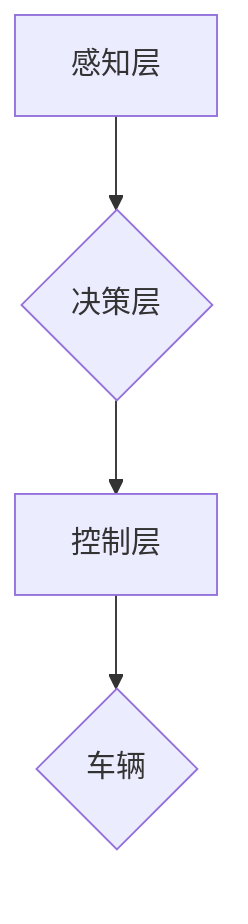

## Python深度学习实践：建立端到端的自动驾驶系统

> 关键词：深度学习、自动驾驶、计算机视觉、强化学习、Python、TensorFlow、PyTorch

### 1. 背景介绍

自动驾驶技术作为人工智能领域最具前沿性和应用价值的研究方向之一，近年来取得了显著进展。从早期基于规则的控制系统到如今的深度学习驱动的智能驾驶，自动驾驶技术正在逐步走向现实。

深度学习算法凭借其强大的数据处理能力和模式识别能力，在自动驾驶系统中扮演着至关重要的角色。它能够从图像、传感器数据等复杂信息中提取关键特征，实现车辆感知、决策和控制等关键功能。

本篇文章将以Python为编程语言，结合深度学习框架TensorFlow和PyTorch，带领读者一步步构建一个端到端的自动驾驶系统。我们将从核心概念和算法原理的讲解，到代码实例的实现和实际应用场景的探讨，全面深入地探索自动驾驶系统的构建过程。

### 2. 核心概念与联系

自动驾驶系统是一个复杂的智能系统，它需要融合多个领域的技术，包括计算机视觉、传感器融合、路径规划、控制理论等。

**2.1 核心概念**

* **感知:** 自动驾驶系统首先需要感知周围环境，包括道路、车辆、行人、交通信号灯等。这通常依赖于多种传感器，例如摄像头、雷达、激光雷达等。
* **决策:** 基于感知到的环境信息，自动驾驶系统需要做出决策，例如转向、加速、减速等。
* **控制:** 自动驾驶系统将决策转化为实际的车辆控制指令，控制车辆的运动。

**2.2 架构图**



### 3. 核心算法原理 & 具体操作步骤

**3.1 算法原理概述**

深度学习算法在自动驾驶系统中扮演着至关重要的角色，它能够从图像、传感器数据等复杂信息中提取关键特征，实现车辆感知、决策和控制等关键功能。

* **计算机视觉:** 用于识别道路、车辆、行人等目标，并进行跟踪和预测。常用的算法包括卷积神经网络（CNN）、循环神经网络（RNN）等。
* **传感器融合:** 将来自不同传感器的数据进行融合，提高感知的准确性和鲁棒性。常用的算法包括卡尔曼滤波、粒子滤波等。
* **路径规划:** 根据感知到的环境信息，规划车辆行驶的路径。常用的算法包括A*算法、Dijkstra算法等。
* **控制理论:** 将决策转化为实际的车辆控制指令，控制车辆的运动。常用的算法包括PID控制、模型预测控制等。

**3.2 算法步骤详解**

1. **数据采集:** 收集大量的图像、传感器数据等，用于训练深度学习模型。
2. **数据预处理:** 对采集到的数据进行清洗、格式化、增强等处理，提高模型训练的效率和效果。
3. **模型构建:** 选择合适的深度学习模型架构，并根据任务需求进行调整。
4. **模型训练:** 使用训练数据训练深度学习模型，并通过评估指标（例如准确率、召回率等）评估模型性能。
5. **模型部署:** 将训练好的模型部署到自动驾驶系统中，用于实时感知、决策和控制。

**3.3 算法优缺点**

* **优点:** 深度学习算法能够自动学习数据中的特征，具有强大的泛化能力和鲁棒性。
* **缺点:** 深度学习算法需要大量的训练数据，训练时间长，且模型解释性较差。

**3.4 算法应用领域**

深度学习算法在自动驾驶系统中应用广泛，包括：

* **目标检测:** 识别道路、车辆、行人等目标。
* **图像分类:** 分辨图像中的场景类型，例如十字路口、停车场等。
* **路径规划:** 根据感知到的环境信息，规划车辆行驶的路径。
* **控制策略优化:** 通过深度强化学习，优化车辆的控制策略，提高驾驶安全性。

### 4. 数学模型和公式 & 详细讲解 & 举例说明

**4.1 数学模型构建**

深度学习模型通常由多个神经网络层组成，每一层都包含多个神经元。每个神经元接收来自上一层的输入信号，并通过激活函数进行处理，输出到下一层。

**4.2 公式推导过程**

深度学习模型的训练过程是通过优化模型参数来最小化损失函数的过程。损失函数衡量模型预测结果与真实结果之间的差异。常用的优化算法包括梯度下降法、Adam算法等。

**4.3 案例分析与讲解**

以目标检测为例，常用的深度学习模型架构是YOLO（You Only Look Once）。YOLO模型将图像划分为多个网格单元，每个网格单元负责预测该区域内目标的类别和位置。

**损失函数:**

$$
L = \lambda_{coord} \cdot L_{coord} + \lambda_{conf} \cdot L_{conf} + \lambda_{cls} \cdot L_{cls}
$$

其中：

* $L_{coord}$: 位置损失
* $L_{conf}$: 置信度损失
* $L_{cls}$: 类别损失
* $\lambda_{coord}$, $\lambda_{conf}$, $\lambda_{cls}$: 权重参数

**4.3.1 位置损失:**

$$
L_{coord} = \frac{1}{S^2} \sum_{i=0}^{S^2-1} \sum_{j=0}^{B-1} \left[ \left( \hat{x}_i - x_i \right)^2 + \left( \hat{y}_i - y_i \right)^2 \right]
$$

其中：

* $S$: 网格单元的大小
* $B$: 每个网格单元预测的目标数量
* $\hat{x}_i$, $\hat{y}_i$: 模型预测的目标中心点坐标
* $x_i$, $y_i$: 真实目标的中心点坐标

**4.3.2 置信度损失:**

$$
L_{conf} = \sum_{i=0}^{S^2-1} \sum_{j=0}^{B-1} \left[ \left( \hat{c}_i - c_i \right)^2 \right]
$$

其中：

* $\hat{c}_i$: 模型预测的目标置信度
* $c_i$: 真实目标的置信度

**4.3.3 类别损失:**

$$
L_{cls} = \sum_{i=0}^{S^2-1} \sum_{j=0}^{B-1} \left[ \hat{p}_i - p_i \right]^2
$$

其中：

* $\hat{p}_i$: 模型预测的目标类别概率
* $p_i$: 真实目标的类别概率

### 5. 项目实践：代码实例和详细解释说明

**5.1 开发环境搭建**

* 安装Python3.x
* 安装深度学习框架TensorFlow或PyTorch
* 安装必要的库，例如NumPy、OpenCV等

**5.2 源代码详细实现**

以下是一个简单的目标检测代码示例，使用TensorFlow框架实现YOLO模型的训练：

```python
import tensorflow as tf

# 定义模型架构
model = tf.keras.models.Sequential([
    #...
])

# 定义损失函数
loss_fn = tf.keras.losses.CategoricalCrossentropy()

# 定义优化器
optimizer = tf.keras.optimizers.Adam()

# 训练模型
model.compile(optimizer=optimizer, loss=loss_fn)
model.fit(train_data, train_labels, epochs=10)

# 保存模型
model.save('yolo_model.h5')
```

**5.3 代码解读与分析**

* 代码首先定义了模型架构，包括卷积层、池化层、全连接层等。
* 然后定义了损失函数和优化器。
* 接着使用`model.fit()`方法训练模型，传入训练数据和标签。
* 最后使用`model.save()`方法保存训练好的模型。

**5.4 运行结果展示**

训练完成后，可以使用保存的模型对新的图像进行目标检测。

### 6. 实际应用场景

自动驾驶系统已经开始在一些领域得到应用，例如：

* **无人驾驶汽车:** 自动驾驶汽车能够自动驾驶，无需人工干预。
* **无人配送车:** 无人配送车能够自动配送货物，提高效率和安全性。
* **自动驾驶叉车:** 自动驾驶叉车能够自动搬运货物，提高仓库效率。

**6.4 未来应用展望**

随着自动驾驶技术的不断发展，未来将有更多应用场景出现，例如：

* **智能交通系统:** 自动驾驶车辆能够与交通信号灯、其他车辆进行通信，提高交通效率和安全性。
* **城市规划:** 自动驾驶车辆能够提供城市交通数据，帮助城市规划者优化城市交通系统。
* **医疗救护:** 自动驾驶救护车能够快速到达事故现场，提高医疗救助效率。

### 7. 工具和资源推荐

**7.1 学习资源推荐**

* **书籍:**
    * 《深度学习》
    * 《Python深度学习》
    * 《自动驾驶汽车》
* **在线课程:**
    * Coursera: 深度学习
    * Udacity: 自动驾驶工程师
    * edX: 自动驾驶技术

**7.2 开发工具推荐**

* **深度学习框架:** TensorFlow, PyTorch
* **计算机视觉库:** OpenCV
* **仿真平台:** CARLA, Gazebo

**7.3 相关论文推荐**

* **YOLO目标检测论文:** https://arxiv.org/abs/1506.02640
* **自动驾驶论文:** https://arxiv.org/abs/1707.07993

### 8. 总结：未来发展趋势与挑战

**8.1 研究成果总结**

近年来，自动驾驶技术取得了显著进展，深度学习算法在自动驾驶系统中发挥着越来越重要的作用。

**8.2 未来发展趋势**

* **更强大的深度学习模型:** 研究更强大的深度学习模型，提高自动驾驶系统的感知能力和决策能力。
* **更安全的自动驾驶系统:** 研究更安全的自动驾驶系统，确保自动驾驶车辆在复杂环境下也能安全行驶。
* **更智能的自动驾驶系统:** 研究更智能的自动驾驶系统，能够理解道路规则，并做出更合理的决策。

**8.3 面临的挑战**

* **数据获取和标注:** 自动驾驶系统需要大量的训练数据，获取和标注这些数据是一个巨大的挑战。
* **模型解释性:** 深度学习模型的解释性较差，难以理解模型的决策过程，这对于自动驾驶系统的安全性是一个挑战。
* **伦理问题:** 自动驾驶系统可能会面临一些伦理问题，例如在紧急情况下如何做出决策。

**8.4 研究展望**

未来，自动驾驶技术将继续发展，并应用到更多领域。研究人员将继续探索更强大的深度学习模型、更安全的自动驾驶系统和更智能的自动驾驶系统，以解决自动驾驶技术面临的挑战，推动自动驾驶技术的普及和应用。

### 9. 附录：常见问题与解答

* **Q1: 自动驾驶系统需要哪些传感器？**

A1: 自动驾驶系统通常需要多种传感器，例如摄像头、雷达、激光雷达、GPS等。

* **Q2: 深度学习算法在自动驾驶系统中的应用有哪些？**

A2: 深度学习算法在自动驾驶系统中应用广泛，包括目标检测、图像分类、路径规划、控制策略优化等。

* **Q3: 自动驾驶系统的安全性如何保证？**

A3: 自动驾驶系统的安全性是一个重要的研究方向，研究人员正在探索多种方法来提高自动驾驶系统的安全性，例如冗余系统、安全验证、伦理算法等。


作者：禅与计算机程序设计艺术 / Zen and the Art of Computer Programming 
