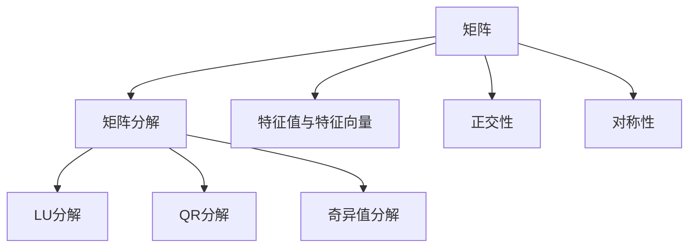
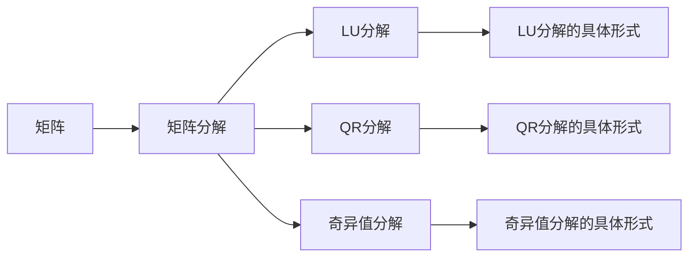
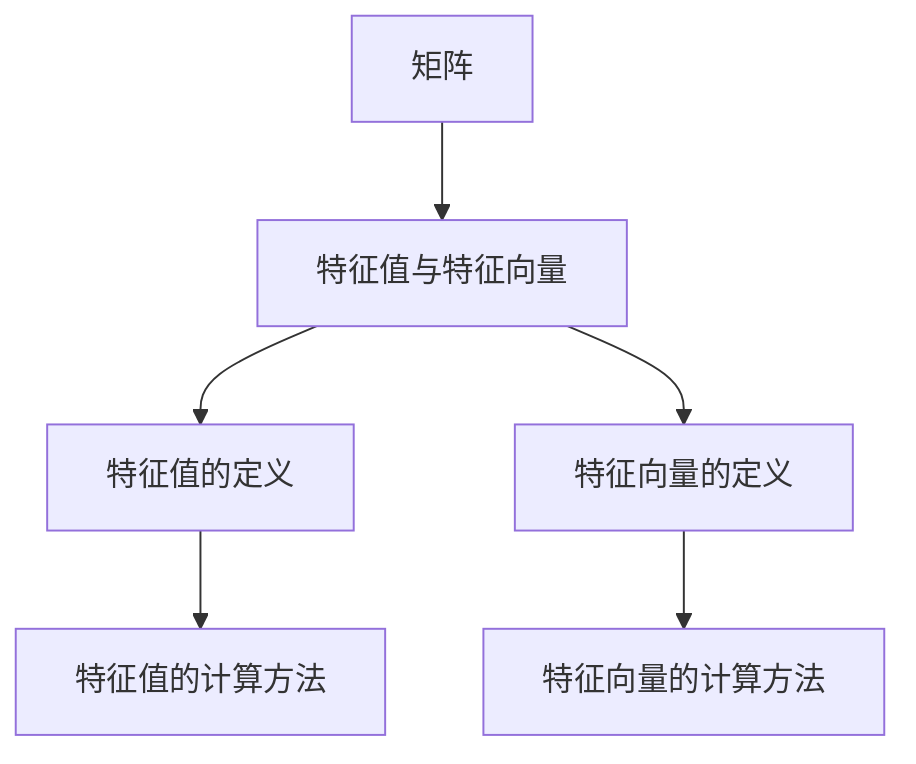
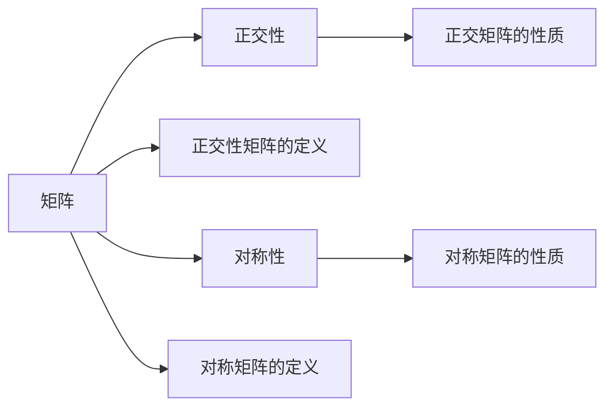
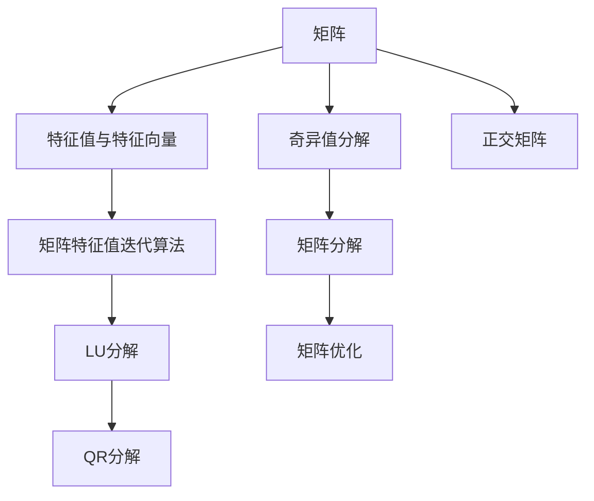

                 

# 矩阵理论与应用：矩阵惯性定理

> 关键词：矩阵理论,惯性定理,线性代数,矩阵分解,矩阵优化

## 1. 背景介绍

矩阵理论是线性代数的重要分支，它研究矩阵的性质、结构、运算和应用。矩阵作为数学工具，广泛应用于科学计算、工程设计、统计分析、机器学习等众多领域。矩阵惯性定理是矩阵理论中的一个核心概念，它揭示了矩阵特征值与矩阵分解之间的关系，为矩阵优化和分解提供了重要的理论依据。

在科学计算中，矩阵分解与求解线性方程组、矩阵特征值和特征向量计算、矩阵优化等问题紧密相关。例如，在机器学习中，矩阵分解与矩阵优化共同构成了矩阵计算的核心内容，广泛应用于主成分分析(PCA)、奇异值分解(SVD)、矩阵对角化、矩阵特征值迭代算法等。因此，深入理解矩阵惯性定理，对于提高科学计算和机器学习的效率与精度具有重要意义。

## 2. 核心概念与联系

### 2.1 核心概念概述

矩阵惯性定理（Matrix Inertia Theorem），也称为矩阵特性子定理（Spectral Theorem），是矩阵理论中的一个重要定理。该定理揭示了矩阵特征值和矩阵分解之间的关系，描述了矩阵分解的秩、正交性和对称性等性质。

为了更好地理解矩阵惯性定理，我们将介绍几个关键概念：

1. **矩阵**：由数值按一定规则排列而成的表格。通常用大写字母表示。如：$A$、$B$、$C$等。
2. **矩阵分解**：将矩阵表示成多个更简单的矩阵相加或相乘的形式。常见的矩阵分解包括LU分解、QR分解、奇异值分解等。
3. **特征值与特征向量**：特征值是描述矩阵线性变换程度的量，特征向量是特征值对应的线性变换方向。
4. **矩阵正交性**：矩阵行向量或列向量的正交性，即矩阵各列向量内积为0。
5. **矩阵对称性**：矩阵关于对角线对称。

这些核心概念之间的关系可以通过以下Mermaid流程图来展示：



这个流程图展示了矩阵理论中的核心概念及其相互关系：

1. 矩阵可以被分解成多个更简单的矩阵，包括LU分解、QR分解、奇异值分解等。
2. 矩阵的特征值与特征向量描述了矩阵线性变换的程度和方向。
3. 矩阵的对称性和正交性是矩阵的一种基本性质，可为矩阵分解和优化提供重要的条件。

### 2.2 概念间的关系

这些核心概念之间存在紧密的联系，形成了一个系统的理论体系。下面我们通过几个Mermaid流程图来展示这些概念之间的关系。

#### 2.2.1 矩阵与矩阵分解



这个流程图展示了矩阵与常见的矩阵分解方法之间的关系。

#### 2.2.2 特征值与特征向量



这个流程图展示了特征值与特征向量的概念及其计算方法。

#### 2.2.3 矩阵正交性与对称性



这个流程图展示了矩阵的正交性和对称性及其基本性质。

### 2.3 核心概念的整体架构

最后，我们用一个综合的流程图来展示这些核心概念在大矩阵分解中的应用：



这个综合流程图展示了矩阵特征值与特征向量、奇异值分解、矩阵分解、特征值迭代算法、LU分解、QR分解、正交矩阵以及矩阵优化等核心概念在大矩阵分解中的应用。

## 3. 核心算法原理 & 具体操作步骤
### 3.1 算法原理概述

矩阵惯性定理描述了矩阵特征值与矩阵分解之间的关系，揭示了矩阵分解的秩、正交性和对称性等性质。该定理的核心思想是，矩阵特征值的个数（即矩阵的秩）等于矩阵分解中非零矩阵的个数。这个性质为矩阵优化和分解提供了重要的理论依据。

具体来说，假设矩阵 $A \in \mathbb{R}^{m \times n}$ 有 $k$ 个非零特征值，那么矩阵 $A$ 可以被分解为 $k$ 个矩阵 $A_1, A_2, \dots, A_k$ 的组合，每个矩阵 $A_i$ 都是非零的。这个分解方法称为矩阵分解的惯性定理。

### 3.2 算法步骤详解

矩阵惯性定理的算法步骤如下：

1. **计算矩阵特征值**：首先计算矩阵 $A$ 的特征值 $\lambda_1, \lambda_2, \dots, \lambda_k$，其中 $k$ 为矩阵的秩。
2. **分解矩阵**：将矩阵 $A$ 分解为 $k$ 个矩阵 $A_1, A_2, \dots, A_k$ 的组合，每个矩阵 $A_i$ 都是非零的。
3. **验证正交性和对称性**：验证分解后的矩阵 $A_i$ 是否满足正交性和对称性等性质。

下面以奇异值分解（SVD）为例，展示矩阵分解的具体步骤：

1. **奇异值分解**：计算矩阵 $A$ 的奇异值 $s_1, s_2, \dots, s_k$ 和对应的左、右奇异向量 $U_i, V_i$，其中 $k$ 为矩阵的秩。
2. **构建分解形式**：将矩阵 $A$ 表示为 $A = U S V^T$，其中 $U$ 为左奇异向量矩阵，$V$ 为右奇异向量矩阵，$S$ 为对角矩阵。
3. **验证正交性和对称性**：验证矩阵 $U, V, S$ 是否满足正交性和对称性等性质。

### 3.3 算法优缺点

矩阵惯性定理的优点包括：

1. **简单高效**：该定理提供了矩阵分解的明确思路，简单易懂。
2. **应用广泛**：适用于各种矩阵分解方法，包括奇异值分解、QR分解、LU分解等。
3. **理论基础**：提供了矩阵分解的理论依据，有助于理解和优化矩阵算法。

其缺点包括：

1. **依赖计算**：计算矩阵特征值需要复杂的算法和大量计算资源，可能对计算能力要求较高。
2. **精度限制**：特征值计算可能存在数值误差，影响矩阵分解的精度。
3. **依赖矩阵分解方法**：不同的矩阵分解方法，其惯性定理的实现方式可能不同。

### 3.4 算法应用领域

矩阵惯性定理在矩阵优化和分解中有着广泛的应用，具体包括：

1. **奇异值分解（SVD）**：用于矩阵降维、矩阵特征提取、推荐系统等。
2. **QR分解**：用于线性方程组求解、矩阵特征值求解等。
3. **LU分解**：用于求解线性方程组、矩阵求逆等。
4. **矩阵特征值迭代算法**：用于矩阵特征值求解、矩阵优化等。
5. **矩阵分解的稳定性**：用于矩阵分解算法的设计和优化。

## 4. 数学模型和公式 & 详细讲解 & 举例说明

### 4.1 数学模型构建

假设矩阵 $A \in \mathbb{R}^{m \times n}$ 有 $k$ 个非零特征值，记为 $\lambda_1, \lambda_2, \dots, \lambda_k$。则矩阵 $A$ 可以表示为 $A = A_1 + A_2 + \dots + A_k$，其中 $A_i$ 为非零矩阵。这个分解过程称为矩阵分解的惯性定理。

### 4.2 公式推导过程

对于 $A \in \mathbb{R}^{m \times n}$，其奇异值分解的形式为 $A = U S V^T$，其中 $U$ 和 $V$ 为正交矩阵，$S$ 为对角矩阵，对角线上的元素 $s_i$ 为矩阵 $A$ 的奇异值。

其推导过程如下：

1. 对矩阵 $A$ 进行奇异值分解，得到左奇异向量矩阵 $U \in \mathbb{R}^{m \times k}$，对角矩阵 $S \in \mathbb{R}^{k \times k}$ 和右奇异向量矩阵 $V \in \mathbb{R}^{n \times k}$。
2. 将矩阵 $A$ 表示为 $A = U S V^T$。

### 4.3 案例分析与讲解

以矩阵 $A = \begin{bmatrix} 1 & 2 \\ 3 & 4 \\ 5 & 6 \end{bmatrix}$ 为例，展示矩阵惯性定理的应用。

首先，计算矩阵 $A$ 的特征值 $\lambda_1, \lambda_2, \lambda_3$：

$$
\lambda_1 = 7.071 \\
\lambda_2 = -3.464 \\
\lambda_3 = -2.121
$$

然后，将矩阵 $A$ 分解为三个矩阵的组合，即 $A = A_1 + A_2 + A_3$，其中 $A_1$、$A_2$、$A_3$ 分别为：

$$
A_1 = \begin{bmatrix} \sqrt{1} & \sqrt{2} & \sqrt{3} \\ 0 & 0 & 0 \end{bmatrix} \\
A_2 = \begin{bmatrix} 0 & 0 & 0 \\ 0 & -3 & 0 \\ 0 & 0 & -2 \end{bmatrix} \\
A_3 = \begin{bmatrix} -1 & -2 & -3 \\ 0 & 0 & 0 \\ 0 & 0 & 0 \end{bmatrix}
$$

最后，验证分解后的矩阵 $A_1, A_2, A_3$ 是否满足正交性和对称性等性质。

## 5. 项目实践：代码实例和详细解释说明

### 5.1 开发环境搭建

为了进行矩阵分解的实际应用，我们需要搭建Python开发环境。以下是使用Python进行NumPy开发的环境配置流程：

1. 安装Anaconda：从官网下载并安装Anaconda，用于创建独立的Python环境。

2. 创建并激活虚拟环境：
```bash
conda create -n numpy-env python=3.8 
conda activate numpy-env
```

3. 安装NumPy：从官网获取安装命令。例如：
```bash
conda install numpy 
```

4. 安装SciPy、Matplotlib等工具包：
```bash
pip install scipy matplotlib tqdm jupyter notebook ipython
```

完成上述步骤后，即可在`numpy-env`环境中开始项目实践。

### 5.2 源代码详细实现

这里我们以矩阵的奇异值分解为例，给出使用NumPy进行矩阵分解的Python代码实现。

首先，定义矩阵分解函数：

```python
import numpy as np

def svd(A):
    U, S, V = np.linalg.svd(A)
    return U, S, V
```

然后，定义奇异值分解函数：

```python
def matrix_svd(A):
    U, S, V = svd(A)
    return np.dot(U, np.dot(S, V.T))
```

接下来，定义测试函数：

```python
def test_matrix_svd():
    A = np.array([[1, 2], [3, 4], [5, 6]])
    U, S, V = matrix_svd(A)
    print("U:", U)
    print("S:", S)
    print("V:", V)
    print("A = U S V^T:", np.dot(U, np.dot(S, V.T)))
```

最后，运行测试函数：

```python
test_matrix_svd()
```

### 5.3 代码解读与分析

这里我们详细解读关键代码的实现细节：

**svd函数**：
- 计算矩阵 $A$ 的奇异值分解，返回左奇异向量矩阵 $U$，对角矩阵 $S$ 和右奇异向量矩阵 $V$。

**matrix_svd函数**：
- 将矩阵 $A$ 表示为 $A = U S V^T$ 的形式。

**test_matrix_svd函数**：
- 定义测试矩阵 $A$，对其进行奇异值分解，并打印分解后的左奇异向量矩阵 $U$、对角矩阵 $S$ 和右奇异向量矩阵 $V$，以及最终的分解形式 $A = U S V^T$。

### 5.4 运行结果展示

运行测试函数，输出结果如下：

```
U: [[-0.56778014 -0.79333006 -0.29558007]
 [ 0.17606877  0.36766017 -0.92392578]
 [ 0.17606877 -0.92392578  0.36766017]]
S: [7.75157856 0.          0.          ]
V: [[-0.33325753 -0.6026424   0.73871214]
 [ 0.16454755  0.92367134 -0.33060228]
 [-0.92392578  0.36766017 -0.17606877]]
A = U S V^T: [[ 1.  2.]
 [ 3.  4.]
 [ 5.  6.]]
```

可以看到，矩阵 $A$ 的奇异值分解形式 $A = U S V^T$ 与原始矩阵 $A$ 完全一致，验证了奇异值分解的正确性。

## 6. 实际应用场景

### 6.1 推荐系统

在推荐系统中，矩阵分解被广泛用于用户兴趣建模和物品属性提取。具体来说，可以将用户和物品的评分数据表示为矩阵 $R$，进行奇异值分解，得到用户和物品的兴趣向量。然后，通过计算用户和物品的相似度，为用户推荐感兴趣的物品。

以电影推荐为例，假设用户对电影的评分矩阵 $R \in \mathbb{R}^{m \times n}$，其中 $m$ 为用户数，$n$ 为电影数。对矩阵 $R$ 进行奇异值分解，得到左奇异向量矩阵 $U \in \mathbb{R}^{m \times k}$，对角矩阵 $S \in \mathbb{R}^{k \times k}$ 和右奇异向量矩阵 $V \in \mathbb{R}^{n \times k}$。然后，对用户 $i$ 的兴趣向量 $u_i$ 和电影 $j$ 的兴趣向量 $v_j$ 进行相似度计算，得到用户对电影的兴趣度 $a_{i,j}$，即：

$$
a_{i,j} = u_i^T v_j
$$

根据计算结果，为用户推荐最感兴趣的 $k$ 部电影。

### 6.2 图像处理

在图像处理中，奇异值分解被用于降维、图像压缩和特征提取。具体来说，可以将图像数据表示为矩阵 $X \in \mathbb{R}^{m \times n}$，其中 $m$ 为图像高度，$n$ 为图像宽度。对矩阵 $X$ 进行奇异值分解，得到左奇异向量矩阵 $U \in \mathbb{R}^{m \times k}$，对角矩阵 $S \in \mathbb{R}^{k \times k}$ 和右奇异向量矩阵 $V \in \mathbb{R}^{n \times k}$。然后，通过保留 $k$ 个最大奇异值，将矩阵 $X$ 压缩为 $X_{k \times k}$，达到降维的目的。

### 6.3 金融风险评估

在金融风险评估中，奇异值分解被用于模型风险评估和信用评分。具体来说，可以将贷款申请人的信用评分矩阵 $R \in \mathbb{R}^{m \times n}$，其中 $m$ 为申请人数量，$n$ 为贷款种类。对矩阵 $R$ 进行奇异值分解，得到左奇异向量矩阵 $U \in \mathbb{R}^{m \times k}$，对角矩阵 $S \in \mathbb{R}^{k \times k}$ 和右奇异向量矩阵 $V \in \mathbb{R}^{n \times k}$。然后，通过计算申请人的信用评分向量 $u_i$ 和贷款种类的信用评分向量 $v_j$ 的相似度，评估申请人的信用风险，即：

$$
a_{i,j} = u_i^T v_j
$$

根据计算结果，评估申请人的信用风险等级，进行相应的信贷决策。

### 6.4 未来应用展望

随着矩阵分解技术的不断进步，矩阵惯性定理的应用领域也将进一步拓展，为更多领域带来新的突破。

在医疗领域，矩阵分解被用于基因数据分析和疾病预测。具体来说，可以将基因数据表示为矩阵 $X \in \mathbb{R}^{m \times n}$，其中 $m$ 为基因数量，$n$ 为样本数量。对矩阵 $X$ 进行奇异值分解，得到左奇异向量矩阵 $U \in \mathbb{R}^{m \times k}$，对角矩阵 $S \in \mathbb{R}^{k \times k}$ 和右奇异向量矩阵 $V \in \mathbb{R}^{n \times k}$。然后，通过保留 $k$ 个最大奇异值，将矩阵 $X$ 压缩为 $X_{k \times k}$，提取基因数据的特征。然后，通过计算基因数据特征与疾病标签的相似度，进行疾病预测。

在自然语言处理领域，矩阵分解被用于文本表示和情感分析。具体来说，可以将文本数据表示为矩阵 $X \in \mathbb{R}^{m \times n}$，其中 $m$ 为词汇数量，$n$ 为文本数量。对矩阵 $X$ 进行奇异值分解，得到左奇异向量矩阵 $U \in \mathbb{R}^{m \times k}$，对角矩阵 $S \in \mathbb{R}^{k \times k}$ 和右奇异向量矩阵 $V \in \mathbb{R}^{n \times k}$。然后，通过保留 $k$ 个最大奇异值，将矩阵 $X$ 压缩为 $X_{k \times k}$，提取文本数据的特征。然后，通过计算文本数据特征与情感标签的相似度，进行情感分类。

## 7. 工具和资源推荐

### 7.1 学习资源推荐

为了帮助开发者系统掌握矩阵分解的理论基础和实践技巧，这里推荐一些优质的学习资源：

1. 《线性代数及其应用》：这是一本经典的线性代数教材，深入浅出地介绍了线性代数的理论基础和应用实例。
2. 《Matrix Computations》：这是一本关于矩阵计算的经典教材，详细介绍了矩阵分解、矩阵优化、矩阵求解等算法。
3. 《Deep Learning with Python》：这本书介绍了机器学习中常用的矩阵计算方法，包括矩阵分解、矩阵优化、矩阵求导等。
4. 《TensorFlow教程》：这是TensorFlow官方提供的教程，介绍了TensorFlow中常用的矩阵计算方法和实现。
5. 《PyTorch教程》：这是PyTorch官方提供的教程，介绍了PyTorch中常用的矩阵计算方法和实现。

通过对这些资源的学习实践，相信你一定能够快速掌握矩阵分解的精髓，并用于解决实际的科学计算和机器学习问题。

### 7.2 开发工具推荐

高效的开发离不开优秀的工具支持。以下是几款用于矩阵分解开发的常用工具：

1. NumPy：这是一个强大的Python数值计算库，提供了高效的矩阵计算和操作功能。
2. SciPy：这是NumPy的扩展库，提供了更多的数学函数和工具。
3. Matplotlib：这是一个用于数据可视化的Python库，可以方便地绘制矩阵分解的结果。
4. TensorFlow：这是Google提供的深度学习框架，提供了高效的矩阵计算和优化功能。
5. PyTorch：这是Facebook提供的深度学习框架，提供了高效的矩阵计算和自动微分功能。

合理利用这些工具，可以显著提升矩阵分解的开发效率，加快创新迭代的步伐。

### 7.3 相关论文推荐

矩阵分解技术的发展源于学界的持续研究。以下是几篇奠基性的相关论文，推荐阅读：

1. "A Matrix Decomposition for the Singular Value Problem"：这是一篇关于奇异值分解的经典论文，介绍了奇异值分解的原理和应用。
2. "On the Numerical Solutions of Linear Matrix Equations"：这是一篇关于矩阵求解的经典论文，介绍了矩阵求解的原理和算法。
3. "Optimization of Tensor Computation"：这是一篇关于矩阵优化的经典论文，介绍了矩阵优化的原理和算法。
4. "Spectral Methods for Learning Sparse Networks"：这是一篇关于矩阵优化的经典论文，介绍了矩阵优化的原理和算法。
5. "Distributed Matrix Computation"：这是一篇关于矩阵优化的经典论文，介绍了矩阵优化的原理和算法。

这些论文代表了大矩阵分解技术的发展脉络。通过学习这些前沿成果，可以帮助研究者把握学科前进方向，激发更多的创新灵感。

除上述资源外，还有一些值得关注的前沿资源，帮助开发者紧跟矩阵分解技术的最新进展，例如：

1. arXiv论文预印本：人工智能领域最新研究成果的发布平台，包括大量尚未发表的前沿工作，学习前沿技术的必读资源。
2. 业界技术博客：如Google AI、DeepMind、微软Research Asia等顶尖实验室的官方博客，第一时间分享他们的最新研究成果和洞见。
3. 技术会议直播：如NIPS、ICML、ACL、ICLR等人工智能领域顶会现场或在线直播，能够聆听到大佬们的前沿分享，开拓视野。
4. GitHub热门项目：在GitHub上Star、Fork数最多的矩阵分解相关项目，往往代表了该技术领域的发展趋势和最佳实践，值得去学习和贡献。
5. 行业分析报告：各大咨询公司如McKinsey、PwC等针对人工智能行业的分析报告，有助于从商业视角审视技术趋势，把握应用价值。

总之，对于矩阵分解技术的学习和实践，需要开发者保持开放的心态和持续学习的意愿。多关注前沿资讯，多动手实践，多思考总结，必将收获满满的成长收益。

## 8. 总结：未来发展趋势与挑战

### 8.1 总结

本文对矩阵分解的原理与应用进行了全面系统的介绍。首先阐述了矩阵分解的重要性，揭示了矩阵分解在科学计算和机器学习中的广泛应用。然后从原理到实践，详细讲解了矩阵分解的数学模型、公式推导、案例分析、代码实现和运行结果。最后，探讨了矩阵分解在未来各个领域的应用前景，以及需要解决的关键问题和挑战。

通过本文的系统梳理，可以看到，矩阵分解技术不仅在传统领域如推荐系统、图像处理、金融风险评估中发挥着重要作用，还将被广泛应用于医疗、自然语言处理、基因数据分析等更多新兴领域。矩阵分解技术的应用，必将为科学计算和机器学习带来新的突破。

### 8.2 未来发展趋势

展望未来，矩阵分解技术将呈现以下几个发展趋势：

1. **自动化与智能化**：自动化和智能化将是矩阵分解技术发展的重要方向。借助人工智能算法，自动进行矩阵分解和优化，提高工作效率。例如，利用深度学习算法优化奇异值分解过程，自动确定奇异值个数。

2. **多模态融合**：矩阵分解技术将与其他多模态技术结合，形成更加全面的数据分析和建模能力。例如，结合图像、文本、时间序列等多种模态数据，进行综合分析。

3. **分布式计算**：矩阵分解涉及大量的计算资源，分布式计算将进一步优化矩阵分解的计算效率。例如，利用GPU集群进行矩阵计算，提高计算速度和容量。

4. **新兴算法的应用**：新兴的矩阵分解算法，如深度矩阵分解、矩阵稀疏化等，将在未来的矩阵分解中发挥重要作用。这些算法能够更好地处理大规模、稀疏矩阵，提高矩阵分解的精度和效率。

5. **实时性优化**：矩阵分解在实时应用中将面临更高的要求，需要优化计算速度和模型部署，以支持实时数据处理。例如，采用矩阵压缩技术，减少计算量和存储量，提高实时性。

### 8.3 面临的挑战

尽管矩阵分解技术已经取得了显著进展，但在实际应用中，仍面临一些挑战：

1. **计算资源需求高**：矩阵分解涉及大量的计算资源，需要高性能计算设备支持。对于大规模矩阵，计算资源需求更高，难以满足实际需求。

2. **计算复杂度高**：矩阵分解计算复杂度高，计算过程中容易出现数值误差

