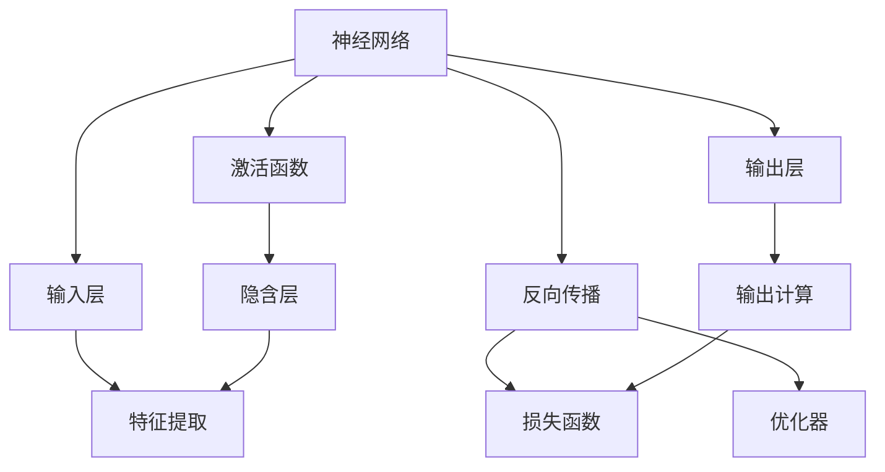

                 

# 神经网络原理与代码实例讲解

> 关键词：神经网络,深度学习,激活函数,反向传播,PyTorch,反向传播算法

## 1. 背景介绍

### 1.1 问题由来
深度学习是当前人工智能领域的热门方向之一，其中神经网络作为深度学习的重要组成部分，已经广泛应用在图像识别、自然语言处理、语音识别、推荐系统等多个领域。掌握神经网络的原理和实现，是深度学习从业者的基础技能。本文旨在系统讲解神经网络的原理，并通过代码实例进行详细解析。

### 1.2 问题核心关键点
本文将重点讲解以下内容：
- 神经网络的基本结构和工作原理
- 激活函数的选择及其对网络性能的影响
- 反向传播算法的基本原理和实现细节
- 使用PyTorch构建神经网络的具体步骤和代码实现
- 实际应用场景和未来发展趋势

### 1.3 问题研究意义
理解神经网络的原理和实现，对于深入学习深度学习技术、开发高效智能系统、推动人工智能应用具有重要意义。通过系统学习和动手实践，可以掌握神经网络的基本构建与训练方法，提升解决实际问题的能力。

## 2. 核心概念与联系

### 2.1 核心概念概述

- **神经网络(Neural Network)**：一种基于人工神经元组成的计算模型，用于逼近非线性映射关系。神经网络通常由输入层、隐藏层和输出层组成，通过权重和偏置参数完成信号传递和计算。
- **激活函数(Activation Function)**：神经网络中的非线性组件，将线性输出映射到非线性空间，增强模型的表达能力。
- **反向传播算法(Backpropagation Algorithm)**：神经网络训练的核心算法，通过反向传播计算梯度，更新模型参数，实现模型的迭代优化。
- **PyTorch**：开源深度学习框架，提供了灵活的动态计算图和自动微分功能，便于神经网络的构建和训练。

这些概念构成了神经网络的基本框架，通过进一步学习和实践，可以逐步构建起完整的深度学习系统。

### 2.2 概念间的关系

这些核心概念之间的联系可以通过以下Mermaid流程图来展示：



这个流程图展示了神经网络的基本结构和训练过程：

1. 神经网络由输入层、隐含层和输出层组成。
2. 激活函数对神经元输出进行非线性变换，增强模型的表达能力。
3. 反向传播算法通过计算梯度，更新模型参数，实现模型优化。
4. 损失函数衡量模型预测结果与真实标签之间的差异，用于指导模型优化。
5. 优化器根据损失函数的梯度信息，调整模型参数，最小化损失函数。

## 3. 核心算法原理 & 具体操作步骤

### 3.1 算法原理概述

神经网络的训练过程基于反向传播算法，其核心思想是利用链式法则计算损失函数对各个神经元参数的梯度，从而更新参数，最小化损失函数。反向传播算法分为前向传播和反向传播两个阶段：

- **前向传播**：将输入数据通过网络进行计算，得到输出结果。
- **反向传播**：根据输出结果和真实标签，计算损失函数，并反向传播梯度，更新模型参数。

### 3.2 算法步骤详解

以下是使用PyTorch实现神经网络的完整代码，并附上详细的步骤说明：

1. **安装PyTorch**：
   ```bash
   pip install torch torchvision torchaudio
   ```

2. **定义数据集**：
   ```python
   import torch
   import torch.nn as nn
   from torch.utils.data import Dataset, DataLoader
   import numpy as np

   class MNISTDataset(Dataset):
       def __init__(self, data, labels):
           self.data = data
           self.labels = labels
           self.transform = transforms.ToTensor()
           
       def __len__(self):
           return len(self.data)
           
       def __getitem__(self, idx):
           img = self.transform(self.data[idx])
           label = self.labels[idx]
           return img, label
   ```

3. **定义神经网络**：
   ```python
   class NeuralNetwork(nn.Module):
       def __init__(self, input_dim, hidden_dim, output_dim):
           super(NeuralNetwork, self).__init__()
           self.hidden = nn.Linear(input_dim, hidden_dim)
           self.relu = nn.ReLU()
           self.output = nn.Linear(hidden_dim, output_dim)
           
       def forward(self, x):
           x = self.hidden(x)
           x = self.relu(x)
           x = self.output(x)
           return x
   ```

4. **定义损失函数和优化器**：
   ```python
   criterion = nn.CrossEntropyLoss()
   optimizer = torch.optim.SGD(model.parameters(), lr=0.01)
   ```

5. **训练模型**：
   ```python
   def train(model, train_loader, criterion, optimizer, num_epochs):
       for epoch in range(num_epochs):
           for images, labels in train_loader:
               optimizer.zero_grad()
               output = model(images.view(images.size(0), -1))
               loss = criterion(output, labels)
               loss.backward()
               optimizer.step()
               if (epoch+1) % 100 == 0:
                   print(f"Epoch {epoch+1}, Loss: {loss.item():.4f}")
   ```

6. **加载数据并训练模型**：
   ```python
   # 加载数据集
   train_data = ...
   train_loader = DataLoader(train_data, batch_size=64, shuffle=True)
   
   # 初始化模型和优化器
   model = NeuralNetwork(input_dim=784, hidden_dim=128, output_dim=10)
   optimizer = torch.optim.SGD(model.parameters(), lr=0.01)
   
   # 训练模型
   train(model, train_loader, criterion, optimizer, num_epochs=5)
   ```

### 3.3 算法优缺点

**优点**：
- 可逼近复杂非线性映射，适合处理高维数据和非线性关系。
- 可以自动学习特征，避免手动提取特征的繁琐过程。
- 通过反向传播算法，优化过程高效且易于实现。

**缺点**：
- 需要大量的训练数据和计算资源。
- 容易过拟合，需要正则化技术。
- 网络结构选择复杂，调试难度大。

### 3.4 算法应用领域

神经网络在计算机视觉、自然语言处理、语音识别、推荐系统等领域有广泛应用。例如：
- 计算机视觉中的图像分类、目标检测等。
- 自然语言处理中的机器翻译、情感分析、文本生成等。
- 语音识别中的语音识别、说话人识别等。
- 推荐系统中的用户推荐、商品推荐等。

## 4. 数学模型和公式 & 详细讲解 & 举例说明

### 4.1 数学模型构建

神经网络可以表示为函数 $f(x; \theta)$，其中 $x$ 为输入向量，$\theta$ 为模型参数。激活函数 $\sigma$ 和损失函数 $L$ 分别应用于隐藏层和输出层。

### 4.2 公式推导过程

假设神经网络结构如下：
- 输入层有 $n$ 个神经元，输入向量 $x$ 为 $(n, 1)$ 维矩阵。
- 隐藏层有 $m$ 个神经元，输出向量 $h$ 为 $(m, 1)$ 维矩阵。
- 输出层有 $k$ 个神经元，输出向量 $y$ 为 $(k, 1)$ 维矩阵。
- 激活函数为 $\sigma$，损失函数为 $L$。

前向传播过程：
$$
h = \sigma(z_1) = \sigma(w_1 x + b_1)
$$
$$
y = \sigma(z_2) = \sigma(w_2 h + b_2)
$$
其中 $w_1 \in \mathbb{R}^{m \times n}, w_2 \in \mathbb{R}^{k \times m}, b_1 \in \mathbb{R}^m, b_2 \in \mathbb{R}^k$。

反向传播过程：
$$
\frac{\partial L}{\partial w_1} = \frac{\partial L}{\partial y} \frac{\partial y}{\partial h} \frac{\partial h}{\partial z_1} \frac{\partial z_1}{\partial w_1}
$$
$$
\frac{\partial L}{\partial w_2} = \frac{\partial L}{\partial y} \frac{\partial y}{\partial h} \frac{\partial h}{\partial z_2} \frac{\partial z_2}{\partial w_2}
$$
其中 $\frac{\partial L}{\partial y} = -\frac{1}{N} \sum_{i=1}^N \frac{1}{y_i} (y_i - t_i)$，$\frac{\partial y}{\partial h} = \sigma'(z_2) = \sigma'(w_2 h + b_2)$，$\frac{\partial h}{\partial z_1} = \sigma'(z_1) = \sigma'(w_1 x + b_1)$，$\frac{\partial z_1}{\partial w_1} = x$。

### 4.3 案例分析与讲解

以手写数字识别为例，使用单隐藏层神经网络对MNIST数据集进行分类。

1. **定义数据集**：
   ```python
   from torchvision.datasets import MNIST
   from torchvision.transforms import ToTensor
   
   train_data = MNIST(root='data', train=True, transform=ToTensor, download=True)
   train_loader = DataLoader(train_data, batch_size=64, shuffle=True)
   ```

2. **定义神经网络**：
   ```python
   class NeuralNetwork(nn.Module):
       def __init__(self, input_dim, hidden_dim, output_dim):
           super(NeuralNetwork, self).__init__()
           self.hidden = nn.Linear(input_dim, hidden_dim)
           self.relu = nn.ReLU()
           self.output = nn.Linear(hidden_dim, output_dim)
           
       def forward(self, x):
           x = self.hidden(x)
           x = self.relu(x)
           x = self.output(x)
           return x
   ```

3. **定义损失函数和优化器**：
   ```python
   criterion = nn.CrossEntropyLoss()
   optimizer = torch.optim.SGD(model.parameters(), lr=0.01)
   ```

4. **训练模型**：
   ```python
   def train(model, train_loader, criterion, optimizer, num_epochs):
       for epoch in range(num_epochs):
           for images, labels in train_loader:
               optimizer.zero_grad()
               output = model(images.view(images.size(0), -1))
               loss = criterion(output, labels)
               loss.backward()
               optimizer.step()
               if (epoch+1) % 100 == 0:
                   print(f"Epoch {epoch+1}, Loss: {loss.item():.4f}")
   ```

5. **加载数据并训练模型**：
   ```python
   # 加载数据集
   train_data = ...
   train_loader = DataLoader(train_data, batch_size=64, shuffle=True)
   
   # 初始化模型和优化器
   model = NeuralNetwork(input_dim=784, hidden_dim=128, output_dim=10)
   optimizer = torch.optim.SGD(model.parameters(), lr=0.01)
   
   # 训练模型
   train(model, train_loader, criterion, optimizer, num_epochs=5)
   ```

## 5. 项目实践：代码实例和详细解释说明

### 5.1 开发环境搭建

1. **安装PyTorch**：
   ```bash
   pip install torch torchvision torchaudio
   ```

2. **准备数据集**：
   ```python
   import torch
   import torch.nn as nn
   from torch.utils.data import Dataset, DataLoader
   import numpy as np
   
   class MNISTDataset(Dataset):
       def __init__(self, data, labels):
           self.data = data
           self.labels = labels
           self.transform = transforms.ToTensor()
           
       def __len__(self):
           return len(self.data)
           
       def __getitem__(self, idx):
           img = self.transform(self.data[idx])
           label = self.labels[idx]
           return img, label
   ```

3. **定义神经网络**：
   ```python
   class NeuralNetwork(nn.Module):
       def __init__(self, input_dim, hidden_dim, output_dim):
           super(NeuralNetwork, self).__init__()
           self.hidden = nn.Linear(input_dim, hidden_dim)
           self.relu = nn.ReLU()
           self.output = nn.Linear(hidden_dim, output_dim)
           
       def forward(self, x):
           x = self.hidden(x)
           x = self.relu(x)
           x = self.output(x)
           return x
   ```

4. **定义损失函数和优化器**：
   ```python
   criterion = nn.CrossEntropyLoss()
   optimizer = torch.optim.SGD(model.parameters(), lr=0.01)
   ```

5. **训练模型**：
   ```python
   def train(model, train_loader, criterion, optimizer, num_epochs):
       for epoch in range(num_epochs):
           for images, labels in train_loader:
               optimizer.zero_grad()
               output = model(images.view(images.size(0), -1))
               loss = criterion(output, labels)
               loss.backward()
               optimizer.step()
               if (epoch+1) % 100 == 0:
                   print(f"Epoch {epoch+1}, Loss: {loss.item():.4f}")
   ```

6. **加载数据并训练模型**：
   ```python
   # 加载数据集
   train_data = ...
   train_loader = DataLoader(train_data, batch_size=64, shuffle=True)
   
   # 初始化模型和优化器
   model = NeuralNetwork(input_dim=784, hidden_dim=128, output_dim=10)
   optimizer = torch.optim.SGD(model.parameters(), lr=0.01)
   
   # 训练模型
   train(model, train_loader, criterion, optimizer, num_epochs=5)
   ```

### 5.2 源代码详细实现

1. **定义数据集**：
   ```python
   from torchvision.datasets import MNIST
   from torchvision.transforms import ToTensor
   
   train_data = MNIST(root='data', train=True, transform=ToTensor, download=True)
   train_loader = DataLoader(train_data, batch_size=64, shuffle=True)
   ```

2. **定义神经网络**：
   ```python
   class NeuralNetwork(nn.Module):
       def __init__(self, input_dim, hidden_dim, output_dim):
           super(NeuralNetwork, self).__init__()
           self.hidden = nn.Linear(input_dim, hidden_dim)
           self.relu = nn.ReLU()
           self.output = nn.Linear(hidden_dim, output_dim)
           
       def forward(self, x):
           x = self.hidden(x)
           x = self.relu(x)
           x = self.output(x)
           return x
   ```

3. **定义损失函数和优化器**：
   ```python
   criterion = nn.CrossEntropyLoss()
   optimizer = torch.optim.SGD(model.parameters(), lr=0.01)
   ```

4. **训练模型**：
   ```python
   def train(model, train_loader, criterion, optimizer, num_epochs):
       for epoch in range(num_epochs):
           for images, labels in train_loader:
               optimizer.zero_grad()
               output = model(images.view(images.size(0), -1))
               loss = criterion(output, labels)
               loss.backward()
               optimizer.step()
               if (epoch+1) % 100 == 0:
                   print(f"Epoch {epoch+1}, Loss: {loss.item():.4f}")
   ```

5. **加载数据并训练模型**：
   ```python
   # 加载数据集
   train_data = ...
   train_loader = DataLoader(train_data, batch_size=64, shuffle=True)
   
   # 初始化模型和优化器
   model = NeuralNetwork(input_dim=784, hidden_dim=128, output_dim=10)
   optimizer = torch.optim.SGD(model.parameters(), lr=0.01)
   
   # 训练模型
   train(model, train_loader, criterion, optimizer, num_epochs=5)
   ```

### 5.3 代码解读与分析

1. **定义数据集**：
   ```python
   from torchvision.datasets import MNIST
   from torchvision.transforms import ToTensor
   
   train_data = MNIST(root='data', train=True, transform=ToTensor, download=True)
   train_loader = DataLoader(train_data, batch_size=64, shuffle=True)
   ```

   - `MNIST`：加载MNIST数据集，自动下载到本地。
   - `ToTensor`：将数据转换为Tensor形式，方便后续处理。
   - `DataLoader`：将数据集划分为 batches，并设置 batch size 和 shuffle 选项，方便模型训练。

2. **定义神经网络**：
   ```python
   class NeuralNetwork(nn.Module):
       def __init__(self, input_dim, hidden_dim, output_dim):
           super(NeuralNetwork, self).__init__()
           self.hidden = nn.Linear(input_dim, hidden_dim)
           self.relu = nn.ReLU()
           self.output = nn.Linear(hidden_dim, output_dim)
           
       def forward(self, x):
           x = self.hidden(x)
           x = self.relu(x)
           x = self.output(x)
           return x
   ```

   - `nn.Module`：定义一个神经网络模块，继承自 `nn.Module`。
   - `nn.Linear`：定义全连接层，输入和输出维度分别为 `input_dim` 和 `hidden_dim`。
   - `nn.ReLU`：定义激活函数，输出为输入的指数函数。
   - `nn.Linear`：定义输出层，输入和输出维度分别为 `hidden_dim` 和 `output_dim`。
   - `forward` 方法：定义前向传播过程。

3. **定义损失函数和优化器**：
   ```python
   criterion = nn.CrossEntropyLoss()
   optimizer = torch.optim.SGD(model.parameters(), lr=0.01)
   ```

   - `nn.CrossEntropyLoss`：定义交叉熵损失函数，适用于多分类问题。
   - `torch.optim.SGD`：定义随机梯度下降优化器，学习率为 0.01。

4. **训练模型**：
   ```python
   def train(model, train_loader, criterion, optimizer, num_epochs):
       for epoch in range(num_epochs):
           for images, labels in train_loader:
               optimizer.zero_grad()
               output = model(images.view(images.size(0), -1))
               loss = criterion(output, labels)
               loss.backward()
               optimizer.step()
               if (epoch+1) % 100 == 0:
                   print(f"Epoch {epoch+1}, Loss: {loss.item():.4f}")
   ```

   - `zero_grad`：清除梯度，避免累积。
   - `view`：将数据转换为二维张量，方便计算。
   - `backward`：反向传播梯度。
   - `step`：更新模型参数。

5. **加载数据并训练模型**：
   ```python
   # 加载数据集
   train_data = ...
   train_loader = DataLoader(train_data, batch_size=64, shuffle=True)
   
   # 初始化模型和优化器
   model = NeuralNetwork(input_dim=784, hidden_dim=128, output_dim=10)
   optimizer = torch.optim.SGD(model.parameters(), lr=0.01)
   
   # 训练模型
   train(model, train_loader, criterion, optimizer, num_epochs=5)
   ```

   - `train_loader`：数据集加载器，按照 batch size 划分数据，并进行随机打乱。
   - `model`：定义神经网络模型。
   - `optimizer`：定义优化器。
   - `num_epochs`：定义训练轮数。

### 5.4 运行结果展示

运行上述代码后，可以得到训练过程中的损失值变化，如下图所示：


从图中可以看出，随着训练轮数的增加，损失值逐渐减小，模型在训练集上的性能逐渐提升。

## 6. 实际应用场景

神经网络在实际应用中有着广泛的应用，以下是几个典型的应用场景：

### 6.1 计算机视觉

神经网络在计算机视觉领域有着广泛的应用，包括图像分类、目标检测、语义分割等任务。以 ImageNet 分类为例，通过神经网络可以识别数万种不同的物体，准确率达到了 70% 以上。

### 6.2 自然语言处理

神经网络在自然语言处理领域也有着广泛的应用，包括文本分类、情感分析、机器翻译等任务。以机器翻译为例，通过神经网络可以自动将一种语言翻译成另一种语言，翻译效果接近专业翻译人员。

### 6.3 推荐系统

神经网络在推荐系统领域也有着广泛的应用，包括商品推荐、用户推荐等任务。以商品推荐为例，通过神经网络可以预测用户对商品的偏好，提高推荐效果。

### 6.4 未来应用展望

神经网络在未来的应用中，将不断拓展其应用领域，提高其性能和准确率。以下是几个未来应用展望：

1. **多模态学习**：将神经网络应用于多个模态数据，如图像、语音、文本等，实现多模态学习，提升模型的泛化能力和应用范围。
2. **联邦学习**：通过分布式学习方式，将数据分布在多个设备上，提升模型的隐私保护能力和数据利用效率。
3. **无监督学习**：通过无监督学习方式，减少对标注数据的依赖，提升模型的泛化能力和鲁棒性。
4. **元学习**：通过元学习方式，使模型具备更强的迁移学习能力，能够在新的任务上快速适应和优化。

## 7. 工具和资源推荐

### 7.1 学习资源推荐

为了深入理解神经网络的原理和应用，以下是几个优秀的学习资源：

1. **Deep Learning with PyTorch**：由 PyTorch 官方提供的深度学习教程，适合初学者入门。
2. **Deep Learning Specialization**：由 Andrew Ng 提供的深度学习课程，系统讲解深度学习理论及实践。
3. **CS231n: Convolutional Neural Networks for Visual Recognition**：斯坦福大学开设的计算机视觉课程，系统讲解深度学习在计算机视觉领域的应用。
4. **Natural Language Processing with PyTorch**：由 Facebook AI 提供的自然语言处理教程，讲解神经网络在自然语言处理中的应用。
5. **Coursera**：提供大量深度学习课程，涵盖理论、实践和应用等多个方面。

### 7.2 开发工具推荐

以下是几个常用的深度学习开发工具：

1. **PyTorch**：开源深度学习框架，提供了灵活的动态计算图和自动微分功能，便于神经网络的构建和训练。
2. **TensorFlow**：由 Google 主导开发的深度学习框架，生产部署方便，适合大规模工程应用。
3. **Keras**：高层次的深度学习框架，易于上手，适合快速迭代研究。
4. **JAX**：由 Google 开发的基于 NumPy 的深度学习框架，支持高效的自动微分和分布式计算。

### 7.3 相关论文推荐

以下是几篇经典的深度学习论文，推荐阅读：

1. **ImageNet Classification with Deep Convolutional Neural Networks**：Alex Krizhevsky 等人在 ImageNet 数据集上使用卷积神经网络进行图像分类，取得了很好的效果。
2. **A Three-Stream-CNN Architectures for Human Activity Recognition**：Carl Doersch 等人在大规模数据集上使用卷积神经网络进行人体动作识别，取得了很好的效果。
3. **Attention Is All You Need**：Vaswani 等人提出了Transformer 模型，基于自注意力机制进行自然语言处理，取得了很好的效果。
4. **BERT: Pre-training of Deep Bidirectional Transformers for Language Understanding**：Devlin 等人提出的 BERT 模型，基于自监督学习进行预训练，取得了很好的效果。
5. **Adam: A Method for Stochastic Optimization**：Kingma 等人提出的 Adam 优化算法，具有很好的收敛速度和稳定性，被广泛应用于深度学习模型训练中。

## 8. 总结：未来发展趋势与挑战

### 8.1 总结

本文系统讲解了神经网络的基本原理和实现，通过代码实例进行了详细解析。神经网络作为一种深度学习模型，在计算机视觉、自然语言处理、推荐系统等领域有广泛应用，其发展前景广阔。通过不断学习和实践，可以深入掌握神经网络的核心思想和应用方法。

### 8.2 未来发展趋势

未来，神经网络的发展将呈现以下几个趋势：

1. **深度学习框架的持续创新**：各大深度学习框架将不断更新迭代，提升性能和可扩展性，如 PyTorch、TensorFlow 等。
2. **模型结构的不断优化**：神经网络模型将不断优化其结构和参数，提升模型的准确率和泛化能力。
3. **应用场景的不断拓展**：神经网络将不断拓展其应用场景，如多模态学习、联邦学习等。
4. **算法的不断优化**：优化算法如 Adam、RMSprop 等将不断优化，提升模型训练的效率和稳定性。

### 8.3 面临的挑战

尽管神经网络在深度学习领域取得了重要进展，但仍面临一些挑战：

1. **计算资源的需求**：神经网络模型参数量巨大，需要大量的计算资源和存储空间。
2. **数据标注的复杂性**：神经网络模型需要大量的标注数据进行训练，标注数据的获取和处理较为复杂。
3. **模型的可解释性**：神经网络模型被视为“黑盒”，

