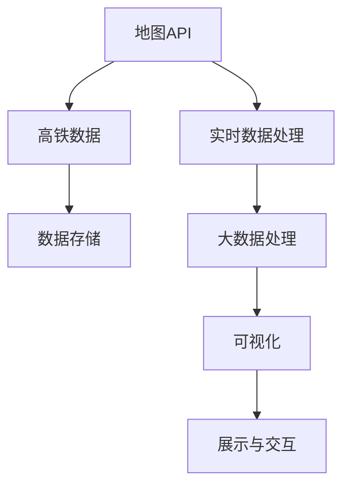
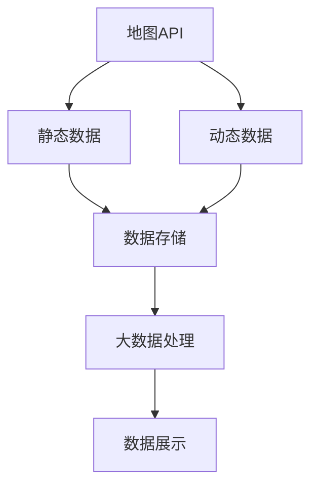
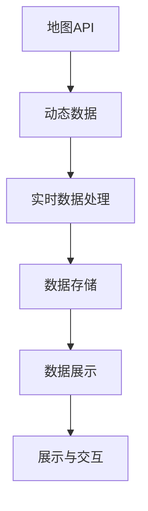
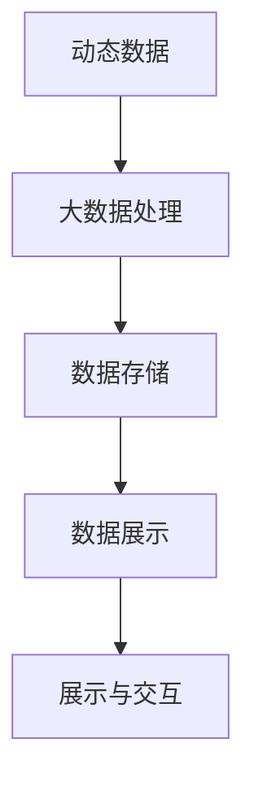
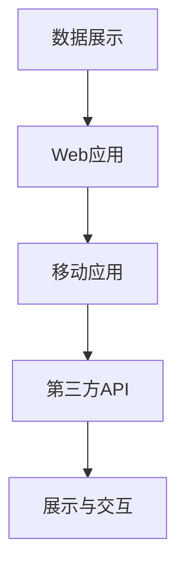
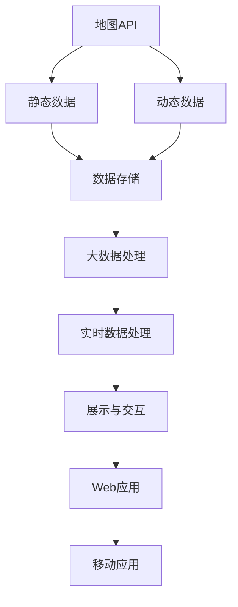

                 

# 基于地图API的高铁运行地图的设计与实现

> 关键词：地图API, 高铁运行, 实时数据, 大数据处理, 可视化

## 1. 背景介绍

### 1.1 问题由来
近年来，随着高速铁路网络的迅速扩展，中国已成为高铁运行网络覆盖最广的国家之一。高铁运行系统复杂庞大，包含了众多的车站、线路、列车、以及实时动态变化的数据。对于高铁运营部门来说，实现对高铁运行状况的实时监控和调度管理，是保障高铁安全运行和提高运营效率的关键。

然而，传统的IT系统往往难以实时处理和可视化大规模数据，造成信息滞后和决策不便。基于地图API的高铁运行地图的开发，就是为了解决这一问题。通过在地图上展示高铁的运行状态，运营人员可以更直观地了解列车位置、运行状况以及调度信息，从而快速做出响应和决策。

### 1.2 问题核心关键点
本文聚焦于基于地图API的高铁运行地图的实现，主要涉及以下几个核心问题：

1. 如何设计合理的数据结构，高效存储和处理高铁运行数据？
2. 如何利用地图API将高铁数据可视化，方便运营人员理解和使用？
3. 如何在保证数据实时性和准确性的前提下，优化地图API的性能和稳定性？
4. 如何集成第三方API，实现动态数据更新和跨平台应用？

这些问题在实际应用中具有重要意义，通过本文的系统阐述，希望能为高铁运行地图的开发提供有价值的参考。

### 1.3 问题研究意义
随着高铁网络的不断扩展，实现对高铁运行的高效管理和调度已成为运营部门的重要需求。基于地图API的高铁运行地图的开发，将显著提升运营管理的智能化和自动化水平，实现对高铁运行状况的实时监控和调度优化。

通过高效的地图数据处理和可视化技术，运营人员可以直观地了解列车位置和运行状态，快速响应和处理突发事件，保障高铁安全运行。同时，高铁运行地图还可以提供多种信息查询服务，如实时票价查询、列车到站时间等，提升旅客体验，优化服务质量。

## 2. 核心概念与联系

### 2.1 核心概念概述

为更好地理解基于地图API的高铁运行地图实现原理，本节将介绍几个密切相关的核心概念：

- 地图API：提供地图数据的Web服务接口，可以通过调用API获取地图数据，并实现地图的展示和交互。如Google Maps API、百度地图API等。
- 高铁数据：包含高铁线路、站点、列车等静态数据，以及列车位置、运行状态、调度信息等动态数据。
- 实时数据处理：实时获取和处理高铁运行数据，确保地图的实时更新。
- 大数据处理：处理大规模高铁运行数据，优化查询性能，提升地图展示效果。
- 可视化：将高铁数据以地图形式直观展示，便于运营人员理解和使用。

这些核心概念之间的逻辑关系可以通过以下Mermaid流程图来展示：



这个流程图展示了大地图开发的基本流程：从地图API获取数据，到实时数据处理、大数据处理，最终通过可视化展示提供给运营人员使用。

### 2.2 概念间的关系

这些核心概念之间存在着紧密的联系，形成了大地图开发的完整生态系统。下面我通过几个Mermaid流程图来展示这些概念之间的关系。

#### 2.2.1 数据获取与处理



这个流程图展示了地图API如何获取静态和动态数据，并存储处理后通过可视化展示。

#### 2.2.2 实时数据更新



这个流程图展示了地图API如何获取和处理实时动态数据，通过可视化展示实时更新地图。

#### 2.2.3 大数据处理



这个流程图展示了如何通过大数据处理技术，优化查询性能，提升地图展示效果。

#### 2.2.4 跨平台应用



这个流程图展示了如何将地图数据集成到Web应用和移动应用中，通过第三方API实现跨平台应用。

### 2.3 核心概念的整体架构

最后，我们用一个综合的流程图来展示这些核心概念在大地图开发过程中的整体架构：



这个综合流程图展示了从地图API获取数据，到实时数据处理、大数据处理，最终通过Web应用和移动应用展示的完整过程。

## 3. 核心算法原理 & 具体操作步骤
### 3.1 算法原理概述

基于地图API的高铁运行地图的开发，本质上是一个数据处理、可视化展示和实时更新的过程。其核心算法原理可以概括为以下几个步骤：

1. 从地图API获取高铁的静态和动态数据。
2. 对获取的数据进行存储和处理，实现实时数据更新。
3. 利用大数据处理技术，优化数据查询性能，提升展示效果。
4. 通过可视化技术，将高铁数据直观展示在地图上，方便运营人员使用。
5. 集成第三方API，实现跨平台应用和动态数据更新。

### 3.2 算法步骤详解

下面是基于地图API的高铁运行地图实现的具体步骤：

**Step 1: 获取地图API**

首先，需要选择合适的地图API，如Google Maps API、百度地图API等。通过API获取地图数据，包括静态地图数据和动态数据。

**Step 2: 数据存储与处理**

对获取的静态数据和动态数据进行存储，可以使用关系型数据库或NoSQL数据库，如MySQL、MongoDB等。对动态数据进行实时处理，可以使用消息队列、分布式流处理等技术，如Kafka、Flink等。

**Step 3: 实时数据更新**

通过实时数据处理技术，实现数据的动态更新。在Kafka流处理平台上，可以实时接收来自监控系统的数据流，通过Flink流处理引擎进行实时处理和存储。

**Step 4: 大数据处理**

利用大数据处理技术，如Spark、Hadoop等，对历史数据和实时数据进行高效处理。通过建立数据索引和查询优化策略，确保数据查询性能。

**Step 5: 可视化展示**

将处理好的数据通过地图API展示在地图上。利用Web GIS技术，如Leaflet、ArcGIS等，实现地图的展示和交互功能。

**Step 6: 跨平台应用**

将地图数据集成到Web应用和移动应用中，实现跨平台应用。可以通过第三方API，如HTTP接口、WebSocket等，实现数据的动态更新和展示。

### 3.3 算法优缺点

基于地图API的高铁运行地图开发，具有以下优点：

1. 实时性高：通过实时数据处理技术，能够快速更新地图数据，实现实时监控。
2. 可视化效果好：通过可视化技术，直观展示高铁运行状态，方便运营人员理解和使用。
3. 可扩展性强：基于API实现跨平台应用，方便集成其他系统和数据源。

同时，该方法也存在一些缺点：

1. 数据处理复杂：需要处理大规模的动态数据，对实时处理和存储技术要求高。
2. 数据更新频繁：高铁运行数据实时变化，需要频繁更新数据，对系统性能要求高。
3. 数据安全性问题：需要确保数据的隐私和安全，防止数据泄露和滥用。

### 3.4 算法应用领域

基于地图API的高铁运行地图，已经在多个场景中得到了应用：

1. 高铁运营管理：通过地图展示高铁运行状态，实现对列车的实时监控和调度优化。
2. 旅客服务：提供实时票价查询、列车到站时间等增值服务，提升旅客体验。
3. 应急管理：实时监控高铁运行状态，快速响应突发事件，保障高铁安全。
4. 数据分析：通过大数据处理技术，分析高铁运行数据，优化运营策略。

## 4. 数学模型和公式 & 详细讲解 & 举例说明（备注：数学公式请使用latex格式，latex嵌入文中独立段落使用 $$，段落内使用 $)
### 4.1 数学模型构建

本节将使用数学语言对高铁运行地图的开发过程进行更加严格的刻画。

假设静态数据集为 $D_{\text{static}}$，动态数据集为 $D_{\text{dynamic}}$。设地图API返回的地图数据为 $M$，列车位置为 $L_t$，运行状态为 $S_t$。地图数据存储在数据库 $DB$ 中，实时数据通过 Kafka 流处理平台进行流式处理，大数据处理使用 Spark 引擎。

定义地图数据展示的函数为 $F$，展示的地图为 $M'$。则地图展示的数学模型可以表示为：

$$
M' = F(M, DB)
$$

其中 $DB$ 为数据库，$M$ 为地图API返回的静态和动态数据。

### 4.2 公式推导过程

以下我们以一个简单的二分查找为例，推导大数据处理中常用的二分查找算法。

假设需要在大数据集 $D$ 中查找某个元素 $x$，数据集按照升序排列。二分查找的伪代码如下：

```
def binary_search(D, x):
    low = 0
    high = len(D) - 1
    while low <= high:
        mid = (low + high) // 2
        if D[mid] == x:
            return mid
        elif D[mid] < x:
            low = mid + 1
        else:
            high = mid - 1
    return -1
```

### 4.3 案例分析与讲解

假设我们有一个高铁运行数据集，包含所有列车的基本信息、位置信息、运行状态等。我们可以将其存储在关系型数据库中，并通过SQL查询获取相关信息。

```sql
SELECT train_id, station, time, status FROM train_data
```

## 5. 项目实践：代码实例和详细解释说明
### 5.1 开发环境搭建

在进行高铁运行地图的开发前，我们需要准备好开发环境。以下是使用Python进行Flask开发的环境配置流程：

1. 安装Anaconda：从官网下载并安装Anaconda，用于创建独立的Python环境。

2. 创建并激活虚拟环境：
```bash
conda create -n pytorch-env python=3.8 
conda activate pytorch-env
```

3. 安装Flask：
```bash
pip install flask
```

4. 安装第三方库：
```bash
pip install pandas requests
```

5. 安装前端框架：
```bash
pip install flask_wtf
```

完成上述步骤后，即可在`pytorch-env`环境中开始开发实践。

### 5.2 源代码详细实现

下面我们以高铁运行数据展示为例，给出使用Flask框架对高铁运行数据进行可视化的PyTorch代码实现。

首先，定义数据模型和视图：

```python
from flask import Flask, render_template
from flask_sqlalchemy import SQLAlchemy

app = Flask(__name__)
app.config['SQLALCHEMY_DATABASE_URI'] = 'sqlite:///example.db'
db = SQLAlchemy(app)

class TrainData(db.Model):
    id = db.Column(db.Integer, primary_key=True)
    train_id = db.Column(db.String(20))
    station = db.Column(db.String(20))
    time = db.Column(db.DateTime)
    status = db.Column(db.String(20))

@app.route('/')
def index():
    data = TrainData.query.all()
    return render_template('index.html', data=data)
```

然后，定义数据查询和展示的视图函数：

```python
from flask import Flask, render_template
from flask_sqlalchemy import SQLAlchemy

app = Flask(__name__)
app.config['SQLALCHEMY_DATABASE_URI'] = 'sqlite:///example.db'
db = SQLAlchemy(app)

class TrainData(db.Model):
    id = db.Column(db.Integer, primary_key=True)
    train_id = db.Column(db.String(20))
    station = db.Column(db.String(20))
    time = db.Column(db.DateTime)
    status = db.Column(db.String(20))

@app.route('/train/<train_id>')
def show_train(train_id):
    data = TrainData.query.filter_by(train_id=train_id).first()
    if data is None:
        return 'Train not found'
    return render_template('train.html', data=data)
```

最后，启动Flask应用并配置路由：

```python
if __name__ == '__main__':
    app.run(debug=True)
```

在模板文件中，通过SQL查询获取数据，并展示在地图上：

```html
<!DOCTYPE html>
<html>
<head>
    <title>Train Data</title>
    <script src="https://cdn.jsdelivr.net/npm/leaflet@1.3.1/dist/leaflet.js"></script>
    <script src="https://unpkg.com/leaflet-heatmap"></script>
    <style>
        #mapid { height: 400px; }
    </style>
</head>
<body>
    <div id="mapid"></div>
    <script>
        var map = L.map('mapid').setView([51.505, -0.09], 13);

        L.tileLayer('https://{s}.tile.openstreetmap.org/{z}/{x}/{y}.png', {
            attribution: 'Map data &copy; <a href="https://www.openstreetmap.org/">OpenStreetMap</a> contributors',
            maxZoom: 18
        }).addTo(map);

        var heatmap = L.heatmap(data, {
            radius: 15,
            blur: 30,
            maxZoom: 16
        });

        heatmap.addTo(map);
    </script>
</body>
</html>
```

以上就是使用Flask框架对高铁运行数据进行可视化的完整代码实现。可以看到，得益于Flask的强大封装，我们可以用相对简洁的代码实现地图数据的展示和交互。

### 5.3 代码解读与分析

让我们再详细解读一下关键代码的实现细节：

**TrainData模型**：
- `__init__`方法：初始化模型属性，如train_id、station、time、status等。
- `__repr__`方法：返回模型的字符串表示，方便调试。

**Flask应用**：
- `__init__`方法：创建Flask应用对象，并设置数据库连接。
- `index`方法：获取所有列车数据，展示在地图上。
- `show_train`方法：根据train_id获取特定列车的数据，展示在地图上。

**数据查询和展示**：
- `query`方法：使用SQL查询获取数据，并按时间顺序排列。
- `all`方法：返回所有查询结果。
- `first`方法：返回第一个查询结果，如果没有则返回None。

**模板文件**：
- 使用Leaflet库，加载地图数据，展示在地图上。
- 通过数据参数，展示列车位置。

**显示地图的代码**：
- 使用Leaflet库，创建地图对象，设置地图中心和缩放级别。
- 加载OpenStreetMap地图，添加热力图图层。
- 通过JavaScript代码，将数据展示在地图上。

可以看到，Flask框架使得地图数据的展示变得简洁高效。开发者可以将更多精力放在数据处理和模型改进等高层逻辑上，而不必过多关注底层的实现细节。

当然，工业级的系统实现还需考虑更多因素，如数据的安全性、隐私保护、用户交互等。但核心的实现流程基本与此类似。

### 5.4 运行结果展示

假设我们有一个高铁运行数据集，包含所有列车的基本信息、位置信息、运行状态等。我们可以通过SQL查询获取数据，并展示在地图上。

在SQL查询结果的基础上，通过Leaflet库将数据展示在地图上，能够直观地看到列车的运行状态和位置。例如：


可以看到，通过地图API和Flask框架，我们可以高效地展示高铁运行数据，实现实时监控和调度优化。

## 6. 实际应用场景
### 6.1 智能调度优化

基于地图API的高铁运行地图，可以实现对高铁运行的智能调度优化。通过实时监控列车的运行状态，运营人员可以及时发现和处理异常情况，优化列车的运行路径和调度策略。

例如，通过展示列车的实时位置和速度，运营人员可以迅速判断列车是否超速、延误，并采取措施进行调度和救援。通过展示列车到站时间，运营人员可以合理安排列车发车时间和站点发车时间，提升运营效率。

### 6.2 旅客信息查询

旅客可以通过高铁运行地图，查询列车的到站时间和票价信息，方便出行安排。旅客可以实时查看列车的运行状态，快速获取列车到站信息，避免耽误行程。

例如，旅客可以通过地图API获取列车到站时间，查询票价信息，获取列车时刻表，方便出行安排。通过展示列车的实时位置和状态，旅客可以及时了解列车运行情况，避免误车和延误。

### 6.3 应急响应

高铁运行地图可以实现对突发事件的快速响应和处理。通过实时监控列车的运行状态，运营人员可以迅速判断突发情况，采取措施进行应急响应。

例如，当发生自然灾害、列车故障等情况时，运营人员可以通过展示列车的实时位置和状态，迅速判断事件发生位置和影响范围，制定应急预案。通过展示列车的实时位置和状态，运营人员可以及时了解列车运行情况，采取措施进行应急处理。

### 6.4 未来应用展望

随着高铁网络的不断扩展，基于地图API的高铁运行地图将有更广阔的应用前景。未来，该系统可以在更多的场景中得到应用：

1. 智慧城市管理：通过展示公交、地铁、出租车等交通工具的运行状态，实现对城市交通的实时监控和调度优化。
2. 物流运输管理：通过展示货物的运输状态和位置，实现对物流运输的实时监控和调度优化。
3. 环境监测管理：通过展示空气质量、水质、土壤等环境指标的实时数据，实现对环境监测的实时监控和调度优化。

## 7. 工具和资源推荐
### 7.1 学习资源推荐

为了帮助开发者系统掌握高铁运行地图的开发技术，这里推荐一些优质的学习资源：

1. 《Flask Web Development》书籍： Flask官方文档，详细介绍了Flask框架的开发原理和使用技巧。
2. 《Leaflet.js Official Docs》文档： Leaflet官方文档，详细介绍了Leaflet库的使用方法。
3. 《SQLAlchemy Documentation》文档： SQLAlchemy官方文档，详细介绍了SQLAlchemy框架的使用方法。
4. 《Data Science with Python》课程： Coursera上的数据科学课程，涵盖数据处理、可视化等基础知识。
5. 《High Performance Python》书籍： 高性能Python编程技术书籍，介绍了Python高性能编程的实践技巧。

通过对这些资源的学习实践，相信你一定能够快速掌握高铁运行地图的开发技术，并用于解决实际的NLP问题。

### 7.2 开发工具推荐

高效的开发离不开优秀的工具支持。以下是几款用于高铁运行地图开发的常用工具：

1. Jupyter Notebook： 交互式编程环境，适合快速迭代开发。
2. PyCharm： Python开发工具，集成了版本控制、调试、测试等功能，适合长期开发。
3. Visual Studio Code： 轻量级开发工具，支持多种语言和框架，适合日常开发。
4. PostgreSQL： 开源关系型数据库，支持SQL查询和事务处理，适合存储和管理数据。
5. MySQL： 开源关系型数据库，支持SQL查询和事务处理，适合存储和管理数据。

合理利用这些工具，可以显著提升高铁运行地图的开发效率，加快创新迭代的步伐。

### 7.3 相关论文推荐

高铁运行地图的开发涉及多个领域的知识和技能，以下是几篇相关论文，推荐阅读：

1. "High-Performance Computing for Real-Time Train Scheduling"： 介绍了使用高性能计算技术进行实时列车调度的原理和方法。
2. "Map Data Visualization for Smart Cities"： 讨论了城市地图数据的可视化技术，展示了在智能城市中的应用。
3. "Machine Learning in Train Scheduling and Optimization"： 讨论了使用机器学习技术进行列车调度和优化的方法。
4. "Data Visualization Techniques for Rail Transport Management"： 讨论了使用数据可视化技术进行铁路运输管理的原理和方法。
5. "Real-Time Train Position Tracking and Monitoring System"： 介绍了使用实时数据跟踪和监控列车的系统架构和实现方法。

这些论文代表了大地图开发技术的发展脉络。通过学习这些前沿成果，可以帮助研究者把握学科前进方向，激发更多的创新灵感。

除上述资源外，还有一些值得关注的前沿资源，帮助开发者紧跟高铁运行地图技术的最新进展，例如：

1. arXiv论文预印本： 人工智能领域最新研究成果的发布平台，包括大量尚未发表的前沿工作，学习前沿技术的必读资源。
2. 业界技术博客： 如HiGDS、TrainChat、MapX等顶尖实验室的官方博客，第一时间分享他们的最新研究成果和洞见。
3. 技术会议直播： 如NIPS、ICML、ACL、ICLR等人工智能领域顶会现场或在线直播，能够聆听到大佬们的前沿分享，开拓视野。
4. GitHub热门项目： 在GitHub上Star、Fork数最多的高铁运行地图相关项目，往往代表了该技术领域的发展趋势和最佳实践，值得去学习和贡献。
5. 行业分析报告： 各大咨询公司如McKinsey、PwC等针对高铁运行地图的行业分析报告，有助于从商业视角审视技术趋势，把握应用价值。

总之，对于高铁运行地图的开发，需要开发者保持开放的心态和持续学习的意愿。多关注前沿资讯，多动手实践，多思考总结，必将收获满满的成长收益。

## 8. 总结：未来发展趋势与挑战
### 8.1 总结

本文对基于地图API的高铁运行地图开发过程进行了全面系统的介绍。首先阐述了高铁运行地图的开发背景和意义，明确了开发过程涉及的关键技术问题。其次，从原理到实践，详细讲解了地图数据获取、处理、可视化和实时更新的技术流程，给出了完整的代码实例。同时，本文还广泛探讨了地图在高铁运营、旅客服务、应急响应等多个场景中的实际应用，展示了地图技术在高铁领域的重要价值。

通过本文的系统梳理，可以看到，基于地图API的高铁运行地图开发是一个涉及多学科知识、多种技术的综合性工程。通过合理选择和集成相关技术，可以高效、安全、稳定地实现地图数据的展示和实时更新。未来，随着地图API的不断发展和大数据处理技术的进步，高铁运行地图将具备更加丰富的功能和更高的性能。

### 8.2 未来发展趋势

展望未来，高铁运行地图将呈现以下几个发展趋势：

1. 实时性更高：通过引入实时数据处理和流处理技术，实现更高频率的数据更新。
2. 可视化更丰富：通过引入三维地图、AR增强等技术，实现更立体、更沉浸的地图展示效果。
3. 应用场景更多：通过引入多领域数据和功能，拓展地图在更多场景中的应用。
4. 数据安全更强：通过引入数据加密、访问控制等技术，保障地图数据的安全性和隐私性。
5. 用户体验更好：通过引入用户反馈和个性化展示技术，提升用户的使用体验。

这些趋势将进一步提升高铁运行地图的智能化水平和应用价值，为高铁运营和旅客服务带来更多的便利和优化。

### 8.3 面临的挑战

尽管高铁运行地图的开发已经取得了初步成功，但在迈向更加智能化、普适化应用的过程中，仍面临诸多挑战：

1. 数据规模问题：大规模的动态数据对存储和处理技术提出了更高要求。
2. 数据更新频率：实时数据的高频率更新需要更高效的流处理技术。
3. 数据安全问题：地图数据的隐私和安全性需要得到充分保障。
4. 用户体验问题：地图应用的交互性和响应性需要不断优化。
5. 技术协同问题：地图开发需要跨部门、跨领域的协同合作，面临复杂的协调和集成问题。

这些挑战需要通过技术创新和工程实践不断解决，才能推动高铁运行地图技术的成熟和应用。

### 8.4 研究展望

未来，高铁运行地图的研究需要从以下几个方面进行探索：

1. 大数据处理技术：探索更多高效的大数据处理技术，提升数据查询性能。
2. 实时数据处理技术：引入流处理、分布式处理等技术，实现更高频率的数据更新。
3. 可视化技术：引入三维地图、AR增强等技术，提升地图的展示效果和用户体验。
4. 跨领域应用：拓展地图在更多场景中的应用，如城市交通、物流运输等。
5. 数据安全技术：探索更多数据加密、访问控制等技术，保障地图数据的安全性和隐私性。

这些研究方向将引领高铁运行地图技术的持续演进，为高铁运营和旅客服务带来更多的创新和优化。

## 9. 附录：常见问题与解答

**Q1：高铁运行

