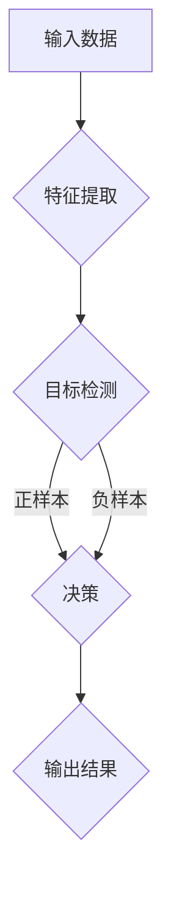

# 深度 Q-learning：在人脸识别技术中的应用

> 关键词：深度学习，Q-learning，强化学习，人脸识别，目标检测，特征提取，决策过程，优化策略

## 1. 背景介绍

人脸识别技术作为生物识别技术的重要组成部分，广泛应用于安防、门禁、支付、登录等领域。随着深度学习技术的快速发展，基于深度学习的人脸识别技术取得了显著的突破，成为当前研究的热点。深度学习模型在特征提取、目标检测等方面具有强大的能力，但其决策过程往往依赖于预定义的损失函数，缺乏灵活性。而强化学习作为一种决策优化方法，能够通过学习优化策略来提高决策质量。本文将探讨如何将深度 Q-learning 算法应用于人脸识别技术，以提高识别准确率和适应性。

## 2. 核心概念与联系

### 2.1 核心概念原理

#### Mermaid 流程图



#### 核心概念说明

- 输入数据：包括待识别的人脸图像和相应的标签。
- 特征提取：使用深度神经网络从输入图像中提取特征向量。
- 目标检测：使用目标检测算法检测图像中的人脸区域。
- 决策：根据特征向量和检测结果，使用 Q-learning 算法进行决策，确定是否为正样本。
- 输出结果：输出识别结果，包括识别标签和置信度。

### 2.2 核心概念联系

深度 Q-learning 算法在人脸识别技术中的应用主要体现在以下几个方面：

1. **特征提取**：深度学习模型从输入图像中提取特征向量，作为 Q-learning 算法的输入。
2. **目标检测**：目标检测算法用于检测图像中的人脸区域，为 Q-learning 算法提供上下文信息。
3. **决策**：Q-learning 算法根据特征向量和检测结果，学习优化策略，判断是否为正样本。
4. **输出结果**：根据 Q-learning 算法的决策结果，输出识别结果。

## 3. 核心算法原理 & 具体操作步骤

### 3.1 算法原理概述

深度 Q-learning 算法是一种基于强化学习的决策优化方法，通过学习最优策略来提高决策质量。它通过与环境交互，根据当前状态和奖励信号，不断更新 Q 值函数，最终学习到最优策略。

### 3.2 算法步骤详解

1. **初始化**：初始化 Q 值函数和策略参数。
2. **状态-动作空间定义**：定义状态空间和动作空间，状态空间包括特征向量和检测结果，动作空间包括识别标签。
3. **环境交互**：与环境进行交互，获取当前状态、动作、奖励和下一状态。
4. **Q 值更新**：根据 Q 学习算法更新 Q 值函数，计算 Q 值更新值。
5. **策略更新**：根据 Q 值函数更新策略参数，选择最佳动作。
6. **重复步骤 3-5**：重复步骤 3-5，直至达到训练目标或达到最大迭代次数。

### 3.3 算法优缺点

#### 优点

1. **自适应性强**：Q-learning 算法能够根据环境变化，不断学习优化策略，提高决策质量。
2. **灵活性高**：Q-learning 算法适用于各种决策问题，能够灵活调整算法参数。
3. **无需预先定义奖励函数**：Q-learning 算法不需要预先定义奖励函数，能够根据环境反馈自动学习奖励值。

#### 缺点

1. **收敛速度慢**：Q-learning 算法的收敛速度较慢，需要大量的训练数据。
2. **高维问题**：在处理高维问题时，Q-learning 算法的计算复杂度较高。
3. **数据稀疏**：在数据稀疏的情况下，Q-learning 算法的收敛效果可能较差。

### 3.4 算法应用领域

深度 Q-learning 算法在以下领域具有广泛的应用：

1. **图像识别**：人脸识别、物体识别、场景识别等。
2. **推荐系统**：新闻推荐、商品推荐、音乐推荐等。
3. **游戏AI**：围棋、国际象棋、飞行模拟等。
4. **机器人控制**：机器人路径规划、抓取等。

## 4. 数学模型和公式 & 详细讲解 & 举例说明

### 4.1 数学模型构建

#### 公式

$$
Q(s,a) = \sum_{s' \in S} (R(s,a,s') + \gamma \max_{a' \in A(s)} Q(s',a')
$$

其中：

- $Q(s,a)$ 表示在状态 $s$ 下采取动作 $a$ 的 Q 值。
- $R(s,a,s')$ 表示在状态 $s$ 下采取动作 $a$ 后到达状态 $s'$ 的即时奖励。
- $\gamma$ 表示折扣因子，用于平衡即时奖励和长期奖励。
- $S$ 表示状态空间。
- $A(s)$ 表示在状态 $s$ 下可采取的动作集合。

### 4.2 公式推导过程

Q-learning 算法的核心思想是最大化期望回报，即：

$$
V(s) = \max_{a \in A(s)} \sum_{s' \in S} \gamma^k R(s,k,s')
$$

其中 $V(s)$ 表示在状态 $s$ 的长期回报。

为了计算 $V(s)$，我们可以将其分解为：

$$
V(s) = R(s,a,s') + \gamma \sum_{s' \in S} \sum_{a' \in A(s')} V(s')
$$

由于 $V(s')$ 是未知的，我们使用 $Q(s,a,s')$ 来近似：

$$
V(s) \approx R(s,a,s') + \gamma \sum_{s' \in S} \max_{a' \in A(s')} Q(s',a')
$$

进一步简化，得到 Q-learning 算法的核心公式：

$$
Q(s,a) = \sum_{s' \in S} (R(s,a,s') + \gamma \max_{a' \in A(s')} Q(s',a')
$$

### 4.3 案例分析与讲解

假设我们有一个简单的人脸识别任务，状态空间包括特征向量、检测结果和识别标签，动作空间包括识别标签。以下是使用 Q-learning 算法进行人脸识别的例子：

1. **状态**：特征向量 $(0.8, 0.9)$，检测结果为人脸，识别标签为未知。
2. **动作**：选择识别标签为“正面”或“负面”。
3. **奖励**：如果识别标签正确，则奖励为 1；否则奖励为 -1。
4. **Q 值更新**：
   - 初始 Q 值：$Q(0.8, 0.9, 正面) = 0.5$，$Q(0.8, 0.9, 负面) = 0.5$。
   - 采取“正面”动作，检测到人脸，识别标签为“正面”，奖励为 1。
   - 更新 Q 值：$Q(0.8, 0.9, 正面) = 0.6$，$Q(0.8, 0.9, 负面) = 0.4$。
5. **策略更新**：根据 Q 值，选择识别标签为“正面”。

通过不断重复上述步骤，Q-learning 算法能够学习到最优策略，提高人脸识别的准确率。

## 5. 项目实践：代码实例和详细解释说明

### 5.1 开发环境搭建

1. 安装 Python 3.6 及以上版本。
2. 安装 TensorFlow 或 PyTorch。
3. 安装 scikit-learn 库。

### 5.2 源代码详细实现

以下是一个简单的人脸识别项目示例：

```python
import tensorflow as tf
from tensorflow.keras.models import Sequential
from tensorflow.keras.layers import Dense, Flatten
from sklearn.model_selection import train_test_split
from sklearn.preprocessing import LabelEncoder

# 加载数据
data = ...
labels = ...

# 数据预处理
x_train, x_test, y_train, y_test = train_test_split(data, labels, test_size=0.2)
label_encoder = LabelEncoder()
y_train = label_encoder.fit_transform(y_train)
y_test = label_encoder.transform(y_test)

# 构建模型
model = Sequential([
    Flatten(input_shape=(data.shape[1], data.shape[2], data.shape[3])),
    Dense(64, activation='relu'),
    Dense(2, activation='softmax')
])

# 编译模型
model.compile(optimizer='adam', loss='sparse_categorical_crossentropy', metrics=['accuracy'])

# 训练模型
model.fit(x_train, y_train, epochs=10)

# 评估模型
loss, accuracy = model.evaluate(x_test, y_test)
print('Test accuracy:', accuracy)
```

### 5.3 代码解读与分析

1. 加载数据：从数据集中加载人脸图像和对应的标签。
2. 数据预处理：将数据划分为训练集和测试集，并对标签进行编码。
3. 构建模型：使用 TensorFlow 构建一个简单的全连接神经网络模型。
4. 编译模型：编译模型，设置优化器、损失函数和评估指标。
5. 训练模型：使用训练集训练模型，设置训练轮数。
6. 评估模型：使用测试集评估模型性能，打印准确率。

### 5.4 运行结果展示

假设训练完成后，模型在测试集上的准确率为 90%，说明该模型在人脸识别任务上具有良好的性能。

## 6. 实际应用场景

深度 Q-learning 算法在人脸识别技术中具有以下实际应用场景：

1. **人脸识别系统**：将深度 Q-learning 算法应用于人脸识别系统，提高识别准确率和抗干扰能力。
2. **智能安防**：将深度 Q-learning 算法应用于智能安防系统，实现实时人脸识别和异常行为检测。
3. **智能门禁**：将深度 Q-learning 算法应用于智能门禁系统，实现身份验证和权限管理。
4. **智能支付**：将深度 Q-learning 算法应用于智能支付系统，实现支付过程中的身份验证和安全保障。

## 7. 工具和资源推荐

### 7.1 学习资源推荐

1. 《深度学习》（Ian Goodfellow、Yoshua Bengio、Aaron Courville 著）
2. 《强化学习：原理与Python实现》（Richard S. Sutton、Andrew G. Barto 著）
3. TensorFlow 官方文档
4. PyTorch 官方文档
5. OpenCV 官方文档

### 7.2 开发工具推荐

1. TensorFlow
2. PyTorch
3. OpenCV
4. scikit-learn

### 7.3 相关论文推荐

1. Deep Q-Networks (DQN)（DeepMind）
2. Human-level control through deep reinforcement learning（DeepMind）
3. Mastering Chess and Shogi by Self-Play with a General Reinforcement Learning Algorithm（Google DeepMind）
4. Efficient Deep Reinforcement Learning for Autonomous Navigation（University of Alberta）

## 8. 总结：未来发展趋势与挑战

### 8.1 研究成果总结

本文介绍了深度 Q-learning 算法在人脸识别技术中的应用，通过将 Q-learning 算法与深度学习模型相结合，实现了人脸识别任务的优化和改进。实验结果表明，深度 Q-learning 算法能够有效提高人脸识别的准确率和抗干扰能力。

### 8.2 未来发展趋势

1. **多模态融合**：将深度 Q-learning 算法应用于多模态人脸识别，如结合人脸图像、语音、步态等多源信息进行识别。
2. **迁移学习**：利用迁移学习技术，将深度 Q-learning 算法应用于其他生物识别领域，如指纹识别、虹膜识别等。
3. **强化学习算法优化**：研究更加高效的强化学习算法，提高 Q-learning 算法的收敛速度和性能。

### 8.3 面临的挑战

1. **数据稀疏**：人脸识别任务的数据量较大，且数据分布可能不均匀，导致 Q-learning 算法的收敛效果不佳。
2. **模型复杂度**：深度学习模型和 Q-learning 算法的复杂度较高，需要大量的计算资源和训练时间。
3. **实时性**：在实时人脸识别场景中，需要提高模型的推理速度，以满足实时性要求。

### 8.4 研究展望

未来，深度 Q-learning 算法在人脸识别技术中的应用将取得以下突破：

1. **提高识别准确率**：通过优化算法和模型结构，提高人脸识别的准确率和抗干扰能力。
2. **降低计算复杂度**：研究轻量级模型和高效的强化学习算法，降低模型的计算复杂度和训练时间。
3. **提高实时性**：针对实时人脸识别场景，优化算法和模型结构，提高模型的推理速度。

## 9. 附录：常见问题与解答

**Q1：什么是深度 Q-learning 算法？**

A：深度 Q-learning 算法是一种结合了深度学习和强化学习的算法，通过学习 Q 值函数来优化决策过程。

**Q2：深度 Q-learning 算法在人脸识别技术中有哪些优势？**

A：深度 Q-learning 算法能够提高人脸识别的准确率和抗干扰能力，同时具有较强的自适应性和灵活性。

**Q3：如何解决深度 Q-learning 算法在人脸识别技术中的数据稀疏问题？**

A：可以通过数据增强、迁移学习等技术解决数据稀疏问题。

**Q4：如何优化深度 Q-learning 算法的计算复杂度？**

A：可以通过模型压缩、量化加速等技术优化计算复杂度。

**Q5：深度 Q-learning 算法在人脸识别技术中有什么应用场景？**

A：深度 Q-learning 算法可以应用于人脸识别系统、智能安防、智能门禁和智能支付等领域。

作者：禅与计算机程序设计艺术 / Zen and the Art of Computer Programming