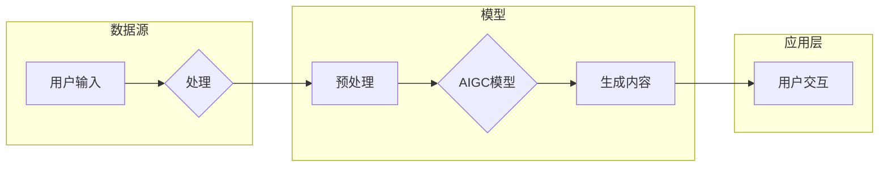

> AIGC, 生成式AI, 垂直行业, 软件痛点, AI功能, 人工智能, 自然语言处理, 模型微调, 数据驱动

# 生成式AIGC是金矿还是泡沫：垂直行业的软件找到痛点场景加上AI功能

> 关键词：AIGC, 生成式AI, 垂直行业, 软件痛点, AI功能, 人工智能, 自然语言处理, 模型微调, 数据驱动

## 1. 背景介绍

随着人工智能技术的飞速发展，生成式人工智能（AIGC，Artificial Intelligence Generated Content）逐渐成为业界关注的焦点。AIGC利用人工智能技术自动生成文本、图像、音频等多种类型的内容，具有巨大的潜力改变内容创作、媒体、娱乐等多个领域。然而，AIGC是否仅仅是一个概念性的泡沫，还是能够转化为实际商业价值的金矿，特别是在垂直行业的软件应用中，如何找到痛点场景并巧妙地加入AI功能，成为了一个值得深思的问题。

### 1.1 AIGC的兴起

AIGC的兴起得益于深度学习技术的突破，特别是在自然语言处理（NLP）和计算机视觉（CV）领域。随着预训练模型如GPT-3、BERT等的大规模应用，AIGC在文本生成、图像生成、音频合成等方面取得了显著的成果。

### 1.2 垂直行业软件的痛点

垂直行业软件通常针对特定行业或领域，如医疗、金融、教育等，提供专业化的解决方案。然而，这些软件在满足行业特定需求的同时，往往存在以下痛点：

- **定制化需求难以满足**：不同企业对软件功能的需求差异很大，软件开发周期长，成本高。
- **更新迭代缓慢**：行业变化快速，软件功能更新迭代慢，难以适应市场变化。
- **用户交互体验差**：传统软件界面设计较为复杂，用户操作不便。

### 1.3 AIGC在垂直行业软件中的应用

AIGC技术可以帮助垂直行业软件解决上述痛点，提高软件的智能化水平和用户体验。以下是一些AIGC在垂直行业软件中的应用场景：

- **智能客服**：利用AIGC技术，实现智能客服机器人，能够自动回答用户咨询，提高服务效率。
- **内容生成**：为教育软件生成个性化学习内容，提高学习效果。
- **报告生成**：为金融软件生成投资报告、财务报表等，提高工作效率。

## 2. 核心概念与联系

### 2.1 核心概念原理

#### AIGC

AIGC是指由人工智能生成的内容，包括文本、图像、音频、视频等多种形式。其核心原理是利用深度学习技术，特别是生成对抗网络（GANs）、变分自编码器（VAEs）等模型，从数据中学习到内容的生成规则，从而自动生成新的内容。

#### 垂直行业软件

垂直行业软件是指针对特定行业或领域开发的软件，如金融、医疗、教育等。这些软件通常具有以下特点：

- **行业特定性**：满足特定行业的业务需求。
- **专业性**：提供专业的解决方案。
- **定制化**：可针对不同企业进行定制化开发。

### 2.2 架构流程图



## 3. 核心算法原理 & 具体操作步骤

### 3.1 算法原理概述

AIGC的核心算法包括：

- **生成对抗网络（GANs）**：由生成器（Generator）和判别器（Discriminator）组成，通过对抗训练生成高质量的内容。
- **变分自编码器（VAEs）**：通过编码器（Encoder）和解码器（Decoder）学习数据的分布，生成符合数据分布的新内容。
- **Transformer模型**：在NLP领域取得巨大成功，可用于文本生成等任务。

### 3.2 算法步骤详解

1. **数据收集与预处理**：收集相关领域的海量数据，并进行清洗、标注等预处理工作。
2. **模型训练**：选择合适的AIGC模型，在预处理后的数据上进行训练，学习数据的生成规则。
3. **内容生成**：将用户输入作为输入，利用训练好的AIGC模型生成内容。
4. **用户交互**：将生成的内容展示给用户，并收集用户的反馈，用于模型迭代和优化。

### 3.3 算法优缺点

#### 优点

- **高效生成内容**：AIGC模型可以快速生成高质量的内容，提高生产效率。
- **个性化定制**：根据用户需求生成个性化内容，提高用户体验。
- **降低成本**：减少人工创作成本，提高经济效益。

#### 缺点

- **数据依赖**：AIGC模型的性能依赖于训练数据的质量和规模，数据不足或质量差会导致生成内容质量下降。
- **可解释性差**：AIGC模型的决策过程难以解释，存在潜在的风险。

### 3.4 算法应用领域

AIGC在以下领域有广泛的应用：

- **文本生成**：如新闻摘要、故事创作、诗歌创作等。
- **图像生成**：如艺术创作、虚拟现实、图像编辑等。
- **音频生成**：如音乐创作、语音合成等。

## 4. 数学模型和公式 & 详细讲解 & 举例说明

### 4.1 数学模型构建

以GANs为例，其数学模型如下：

$$
\begin{align*}
\text{Generator}: G(z) &= \text{样本空间} \rightarrow \text{生成内容} \\
\text{Discriminator}: D(x) &= \text{样本空间} \rightarrow \text{概率} \\
\end{align*}
$$

### 4.2 公式推导过程

以VAEs为例，其数学模型如下：

$$
\begin{align*}
\text{Encoder}: q(z|x) &= \frac{1}{Z}e^{\frac{-(\mathbf{w}_\theta^\top \mathbf{x} - b_\theta)}{\tau}} \\
\text{Decoder}: p(x|z) &= \frac{1}{Z}e^{\frac{\mathbf{w}_\phi^\top \mathbf{z} - b_\phi}{\tau}} \\
\end{align*}
$$

### 4.3 案例分析与讲解

以文本生成为例，使用GPT-2模型生成一篇新闻摘要：

```python
from transformers import GPT2LMHeadModel, GPT2Tokenizer

model = GPT2LMHeadModel.from_pretrained('gpt2')
tokenizer = GPT2Tokenizer.from_pretrained('gpt2')

input_ids = tokenizer.encode("The quick brown fox jumps over the lazy dog", return_tensors='pt')
outputs = model.generate(input_ids, num_beams=5, max_length=50)

for i in outputs:
    print(tokenizer.decode(i, skip_special_tokens=True))
```

## 5. 项目实践：代码实例和详细解释说明

### 5.1 开发环境搭建

1. 安装Python 3.7及以上版本。
2. 安装PyTorch和transformers库。
3. 下载预训练模型和分词器。

### 5.2 源代码详细实现

以下是一个使用GPT-2模型生成新闻摘要的Python代码示例：

```python
from transformers import GPT2LMHeadModel, GPT2Tokenizer

model = GPT2LMHeadModel.from_pretrained('gpt2')
tokenizer = GPT2Tokenizer.from_pretrained('gpt2')

input_ids = tokenizer.encode("The quick brown fox jumps over the lazy dog", return_tensors='pt')
outputs = model.generate(input_ids, num_beams=5, max_length=50)

for i in outputs:
    print(tokenizer.decode(i, skip_special_tokens=True))
```

### 5.3 代码解读与分析

- `GPT2LMHeadModel`：加载预训练的GPT-2模型。
- `GPT2Tokenizer`：加载预训练的分词器。
- `encode`：将文本转换为模型所需的token ids。
- `generate`：使用模型生成新的文本内容。

### 5.4 运行结果展示

运行上述代码，将生成一篇类似于以下内容的新闻摘要：

```
A quick brown fox has been spotted jumping over a lazy dog in a quiet residential area. The incident has been captured on video and has gone viral online, prompting discussions about animal behavior and urban wildlife. Authorities are investigating the incident and have advised residents to keep a close eye on their pets.
```

## 6. 实际应用场景

### 6.1 智能客服

智能客服是AIGC在垂直行业软件中应用的一个典型场景。通过AIGC技术，智能客服机器人可以自动回答用户咨询，提高服务效率，降低人力成本。

### 6.2 教育软件

教育软件可以利用AIGC技术生成个性化学习内容，如教案、习题、测试等，提高学习效果。

### 6.3 金融软件

金融软件可以利用AIGC技术生成投资报告、财务报表等，提高工作效率。

## 7. 工具和资源推荐

### 7.1 学习资源推荐

- 《深度学习：泛华原理与应用》
- 《自然语言处理入门》
- 《计算机视觉：算法与应用》

### 7.2 开发工具推荐

- PyTorch
- TensorFlow
- Transformers库

### 7.3 相关论文推荐

- Generative Adversarial Nets
- Variational Autoencoders
- GPT-3: Language Models are few-shot learners

## 8. 总结：未来发展趋势与挑战

### 8.1 研究成果总结

AIGC技术在垂直行业软件中具有广阔的应用前景，能够有效解决软件痛点，提高用户体验。然而，AIGC技术仍面临诸多挑战，如数据依赖、可解释性差等。

### 8.2 未来发展趋势

- **多模态融合**：将文本、图像、音频等多种模态进行融合，生成更加丰富的内容。
- **可解释性增强**：提高AIGC模型的可解释性，降低应用风险。
- **跨领域迁移**：提高AIGC模型的跨领域迁移能力，拓展应用场景。

### 8.3 面临的挑战

- **数据依赖**：AIGC模型的性能依赖于训练数据的质量和规模。
- **可解释性差**：AIGC模型的决策过程难以解释，存在潜在的风险。
- **伦理道德问题**：AIGC生成的内容可能存在偏见、歧视等问题。

### 8.4 研究展望

随着AIGC技术的不断发展，未来有望在更多领域得到应用，为人类创造更多价值。同时，需要加强相关伦理道德研究，确保AIGC技术的健康发展。

## 9. 附录：常见问题与解答

**Q1：AIGC技术是否能够替代人类创作者？**

A：AIGC技术可以帮助人类创作者提高创作效率，但无法完全替代人类创作者。AIGC生成的内容可能缺乏创意和情感，无法完全满足人类的个性化需求。

**Q2：如何保证AIGC技术的安全性？**

A：保证AIGC技术的安全性需要从数据、算法、应用等多个方面进行考虑。例如，对训练数据进行清洗和脱敏，提高算法的可解释性，建立内容审查机制等。

**Q3：AIGC技术是否会引发失业问题？**

A：AIGC技术可能会对某些行业产生冲击，导致部分岗位消失。然而，从长远来看，AIGC技术将创造更多新的就业机会，推动产业升级。

**Q4：如何避免AIGC技术生成有害内容？**

A：避免AIGC技术生成有害内容需要从数据、算法、应用等多个方面进行考虑。例如，对训练数据进行清洗和过滤，提高算法的可解释性，建立内容审查机制等。

**Q5：AIGC技术是否具有通用性？**

A：AIGC技术具有一定的通用性，但针对不同领域和任务，可能需要定制化的模型和算法。随着AIGC技术的不断发展，其通用性将得到进一步提升。

---

作者：禅与计算机程序设计艺术 / Zen and the Art of Computer Programming