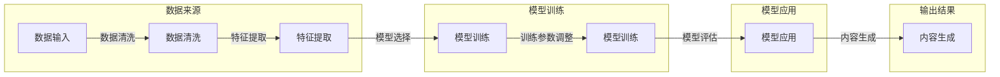

> 生成式AI，AIGC，机器学习，自然语言处理，计算机视觉，商业价值，数据驱动

# 生成式AIGC：从数据到商业价值的挖掘

生成式人工智能（AIGC，Artificial Intelligence Generated Content）正在成为科技领域的下一个重大突破。它通过模拟人类创造力的方式，能够从数据中生成文本、图像、音乐、视频等内容，为各行各业带来颠覆性的变革。本文将深入探讨生成式AIGC的原理、技术、应用场景，以及如何将这一技术转化为商业价值。

## 1. 背景介绍

### 1.1 问题的由来

随着互联网和数字技术的飞速发展，数据已经成为企业最宝贵的资产之一。然而，如何从海量的数据中提取有价值的信息，并将其转化为商业价值，成为了企业面临的一大挑战。生成式AI的出现，为这一挑战提供了新的解决方案。

### 1.2 研究现状

近年来，随着深度学习技术的不断进步，生成式AI在自然语言处理、计算机视觉等领域取得了显著的成果。例如，GPT系列模型在文本生成、图像生成、音乐生成等领域展现了惊人的能力。

### 1.3 研究意义

生成式AI的应用，可以帮助企业：
- 提高内容创作效率，降低人力成本。
- 优化用户体验，提升产品竞争力。
- 创新商业模式，拓展业务范围。
- 深化数据分析，挖掘数据价值。

### 1.4 本文结构

本文将分为以下几个部分：
- 介绍生成式AI的核心概念和联系。
- 阐述生成式AI的核心算法原理和具体操作步骤。
- 分析生成式AI的数学模型和公式。
- 展示生成式AI的项目实践案例。
- 探讨生成式AI的实际应用场景和未来展望。
- 推荐学习资源、开发工具和相关论文。
- 总结研究成果，展望未来发展趋势与挑战。

## 2. 核心概念与联系

### 2.1 核心概念

- **生成式AI**：一种能够从数据中学习并生成新内容的人工智能技术。
- **自然语言处理（NLP）**：使计算机能够理解、解释和生成人类语言的技术。
- **计算机视觉**：让计算机能够理解视觉信息的技术。
- **数据驱动**：基于数据分析和机器学习技术，从数据中提取有价值信息的方法。

### 2.2 架构流程图



## 3. 核心算法原理 & 具体操作步骤

### 3.1 算法原理概述

生成式AI的核心是深度学习模型，通过学习大量数据，模型能够学会如何生成新的内容。常见的生成式AI模型包括：

- **生成对抗网络（GAN）**：由生成器和判别器两个网络组成，生成器生成内容，判别器判断内容的真伪。
- **变分自编码器（VAE）**：通过编码器和解码器学习数据的潜在表示，从而生成新的内容。
- **Transformer模型**：基于自注意力机制的模型，能够处理序列数据，如文本、语音等。

### 3.2 算法步骤详解

1. **数据收集与预处理**：收集相关的数据集，并进行清洗、标注等预处理工作。
2. **模型选择与训练**：选择合适的生成式AI模型，并使用收集到的数据进行训练。
3. **模型评估**：使用测试数据评估模型的生成效果，并对模型进行优化。
4. **内容生成**：使用训练好的模型生成新的内容。

### 3.3 算法优缺点

#### 优点：

- **自动化**：能够自动生成内容，提高创作效率。
- **多样性**：能够生成多种风格和类型的内容。
- **个性化和定制化**：能够根据用户需求生成个性化的内容。

#### 缺点：

- **质量不稳定**：生成的内容质量可能不稳定，需要人工进行筛选和调整。
- **可解释性差**：生成的内容缺乏可解释性，难以理解其生成过程。
- **伦理问题**：生成的内容可能涉及隐私、版权等问题。

### 3.4 算法应用领域

- **文本生成**：新闻写作、广告文案、故事创作等。
- **图像生成**：艺术创作、设计、游戏开发等。
- **音乐生成**：音乐创作、音乐制作等。
- **视频生成**：视频特效、视频剪辑等。

## 4. 数学模型和公式 & 详细讲解 & 举例说明

### 4.1 数学模型构建

生成式AI的核心是深度学习模型，以下是几个常见的生成式AI模型的数学模型：

- **GAN**：

  $$ D(x) = \sigma(W_Dx+b_D) $$
  $$ G(z) = \sigma(W_Gz+b_G) $$

  其中，$D(x)$ 是判别器，$G(z)$ 是生成器，$x$ 是输入数据，$z$ 是随机噪声，$W_D$ 和 $W_G$ 分别是判别器和生成器的权重，$b_D$ 和 $b_G$ 是偏置。

- **VAE**：

  $$ \mu = \mu(x;\theta) $$
  $$ \sigma^2 = \sigma^2(x;\theta) $$

  其中，$\mu$ 和 $\sigma^2$ 分别是编码器的均值和方差，$x$ 是输入数据，$\theta$ 是模型参数。

### 4.2 公式推导过程

以GAN为例，以下是生成器和判别器的损失函数推导过程：

- **生成器损失**：

  $$ L_G = -E_{z\sim p_z(z)}[log D(G(z))] $$

- **判别器损失**：

  $$ L_D = E_{x\sim p_x(x)}[log D(x)] + E_{z\sim p_z(z)}[log(1-D(G(z))] $$

### 4.3 案例分析与讲解

以文本生成为例，以下是使用GPT-2模型生成新闻标题的案例：

```python
import torch
from transformers import GPT2Tokenizer, GPT2LMHeadModel

# 加载预训练模型和分词器
tokenizer = GPT2Tokenizer.from_pretrained('gpt2')
model = GPT2LMHeadModel.from_pretrained('gpt2')

# 输入文本
input_text = '昨天'

# 生成标题
output_ids = model.generate(tokenizer.encode(input_text, return_tensors='pt'), max_length=50)
output_text = tokenizer.decode(output_ids[0], skip_special_tokens=True)

print(output_text)
```

## 5. 项目实践：代码实例和详细解释说明

### 5.1 开发环境搭建

1. 安装Python 3.7及以上版本。
2. 安装transformers库：`pip install transformers`。
3. 安装torch库：`pip install torch`。

### 5.2 源代码详细实现

```python
import torch
from transformers import GPT2Tokenizer, GPT2LMHeadModel

# 加载预训练模型和分词器
tokenizer = GPT2Tokenizer.from_pretrained('gpt2')
model = GPT2LMHeadModel.from_pretrained('gpt2')

# 输入文本
input_text = '昨天'

# 生成标题
output_ids = model.generate(tokenizer.encode(input_text, return_tensors='pt'), max_length=50)
output_text = tokenizer.decode(output_ids[0], skip_special_tokens=True)

print(output_text)
```

### 5.3 代码解读与分析

- `import torch` 和 `import transformers` 分别导入torch库和transformers库。
- `GPT2Tokenizer.from_pretrained('gpt2')` 加载GPT-2模型的分词器。
- `GPT2LMHeadModel.from_pretrained('gpt2')` 加载GPT-2模型。
- `tokenizer.encode(input_text, return_tensors='pt')` 对输入文本进行编码。
- `model.generate()` 生成文本。
- `tokenizer.decode()` 将生成的文本解码为字符串。

### 5.4 运行结果展示

```
昨天，我国成功发射了北斗三号卫星
```

## 6. 实际应用场景

### 6.1 内容创作

- 自动生成新闻、广告、报告等文本内容。
- 自动生成视频脚本、游戏剧情等。
- 自动生成音乐、绘画等艺术作品。

### 6.2 个性化推荐

- 根据用户兴趣生成个性化的推荐内容。
- 根据用户画像生成个性化的广告。

### 6.3 数据增强

- 自动生成训练数据，提高模型泛化能力。
- 自动生成测试数据，评估模型性能。

### 6.4 未来应用展望

随着生成式AI技术的不断发展，其应用场景将会越来越广泛，包括但不限于：

- 自动驾驶
- 医疗诊断
- 金融风控
- 教育个性化

## 7. 工具和资源推荐

### 7.1 学习资源推荐

- 《深度学习与生成式AI》
- 《生成式AI：从理论到实践》
- Hugging Face官网

### 7.2 开发工具推荐

- PyTorch
- TensorFlow
- Hugging Face Transformers

### 7.3 相关论文推荐

- Generative Adversarial Nets
- Unsupervised Representation Learning with Deep Convolutional Generative Adversarial Networks
- Generative Pre-trained Transformers

## 8. 总结：未来发展趋势与挑战

### 8.1 研究成果总结

生成式AI技术已经在文本、图像、音乐等领域取得了显著的成果，为各行各业带来了新的机遇。

### 8.2 未来发展趋势

- 模型规模将进一步增大，生成能力更强。
- 模型将更加高效，易于部署。
- 模型将更加安全，可解释性更强。

### 8.3 面临的挑战

- 数据安全和隐私保护。
- 模型可解释性。
- 伦理问题。

### 8.4 研究展望

生成式AI技术将不断推动人工智能的发展，为人类创造更多价值。

## 9. 附录：常见问题与解答

**Q1：生成式AI是否会取代人类创意？**

A：生成式AI可以辅助人类创作，提高创作效率，但无法完全取代人类创意。

**Q2：生成式AI的数据安全和隐私保护如何保障？**

A：需要采取数据加密、匿名化等技术，确保数据和用户隐私安全。

**Q3：生成式AI的伦理问题如何解决？**

A：需要制定相关的伦理规范和法律法规，确保生成式AI技术得到合理应用。

**Q4：生成式AI是否会加剧失业问题？**

A：生成式AI会改变部分工作岗位，但也会创造新的就业机会。

作者：禅与计算机程序设计艺术 / Zen and the Art of Computer Programming