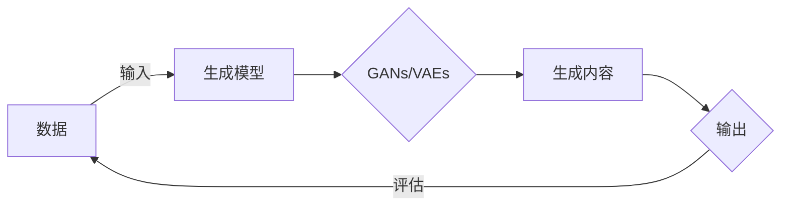

# 生成式AI：如何利用技术优势打造差异化竞争？

> 关键词：生成式AI，机器学习，深度学习，差异化竞争，商业模式，创新，应用实践

## 1. 背景介绍

随着人工智能技术的飞速发展，生成式AI（Generative AI）已经成为人工智能领域的一个热点。生成式AI能够模拟人类创造力和想象力，通过学习大量数据生成新的内容，如文本、图像、音乐、视频等。这种技术不仅在学术界受到广泛关注，也在工业界展现出巨大的应用潜力。本文将探讨如何利用生成式AI的技术优势，打造差异化竞争，为企业和个人在激烈的市场竞争中脱颖而出。

### 1.1 问题的由来

在信息爆炸的时代，市场竞争日益激烈。企业需要不断创新，提供独特的价值，才能在市场中占据一席之地。传统的创新方式可能需要巨大的研发投入和时间成本，而生成式AI的出现为创新提供了新的途径。

### 1.2 研究现状

生成式AI技术主要基于深度学习，特别是生成对抗网络（GANs）、变分自编码器（VAEs）等模型。近年来，随着计算能力的提升和数据的积累，生成式AI在图像生成、文本生成、音乐生成等领域取得了显著进展。

### 1.3 研究意义

利用生成式AI打造差异化竞争，具有以下意义：

- 降低创新成本：生成式AI可以帮助企业快速生成新的创意和设计，降低研发成本。
- 提升效率：自动化生成过程可以提高生产效率，降低人力成本。
- 增强个性化：生成式AI可以根据用户需求生成个性化内容，提升用户体验。
- 创造新市场：生成式AI可以创造新的产品和服务，开拓新的市场机会。

### 1.4 本文结构

本文将分为以下几个部分：

- 第二部分：介绍生成式AI的核心概念与联系。
- 第三部分：阐述生成式AI的核心算法原理和具体操作步骤。
- 第四部分：讲解生成式AI的数学模型和公式。
- 第五部分：展示生成式AI的项目实践案例。
- 第六部分：探讨生成式AI的实际应用场景。
- 第七部分：展望生成式AI的未来发展趋势与挑战。
- 第八部分：总结全文，并给出研究展望。

## 2. 核心概念与联系

### 2.1 核心概念

- **生成式AI**：一种能够从给定数据中学习，并生成新数据的AI技术。
- **深度学习**：一种利用神经网络进行数据建模的学习方法。
- **生成对抗网络（GANs）**：一种由生成器和判别器组成的对抗性学习框架。
- **变分自编码器（VAEs）**：一种利用变分推理生成数据的自编码器。
- **迁移学习**：将一个领域学习到的知识应用到另一个不同领域的学习方法。

### 2.2 Mermaid流程图



### 2.3 核心概念联系

生成式AI是深度学习的一个分支，其中GANs和VAEs是最常用的生成模型。这些模型通过学习数据分布，生成与真实数据相似的新内容。迁移学习可以将这些生成模型应用于不同的领域，实现知识的迁移和应用。

## 3. 核心算法原理 & 具体操作步骤

### 3.1 算法原理概述

生成式AI的核心算法原理是学习数据分布，并生成与真实数据相似的新内容。以下将介绍GANs和VAEs的原理。

### 3.2 算法步骤详解

#### 3.2.1 生成对抗网络（GANs）

1. 初始化生成器和判别器参数。
2. 生成器生成假数据，判别器对假数据和真实数据进行判断。
3. 对生成器和判别器分别进行训练，使生成器生成的假数据更难被判别器识别，判别器对真数据和假数据的识别能力更强。
4. 重复步骤2-3，直到生成器能够生成难以区分于真实数据的假数据。

#### 3.2.2 变分自编码器（VAEs）

1. 初始化编码器、解码器和变分推理器参数。
2. 编码器将输入数据编码为潜在空间中的表示。
3. 解码器将潜在空间中的表示解码为输出数据。
4. 变分推理器学习潜在空间中的数据分布。
5. 通过最大化变分下界来优化编码器、解码器和变分推理器参数。

### 3.3 算法优缺点

#### 3.3.1 生成对抗网络（GANs）

优点：

- 可以生成高质量、多样化的内容。
- 对数据分布的要求较低。

缺点：

- 训练不稳定，容易陷入模式崩溃。
- 容易生成虚假或有害内容。

#### 3.3.2 变分自编码器（VAEs）

优点：

- 训练稳定，不容易陷入模式崩溃。
- 可以生成高斯分布的数据。

缺点：

- 生成内容的质量可能不如GANs。

### 3.4 算法应用领域

GANs和VAEs可以应用于以下领域：

- 图像生成：生成人脸、风景、艺术作品等。
- 文本生成：生成新闻报道、诗歌、对话等。
- 音乐生成：生成旋律、和弦、节奏等。
- 视频生成：生成动画、电影片段等。

## 4. 数学模型和公式 & 详细讲解 & 举例说明

### 4.1 数学模型构建

#### 4.1.1 生成对抗网络（GANs）

GANs的数学模型如下：

$$
\begin{align*}
D(x) &= \sigma(W_Dx+b_D) \\
G(z) &= \sigma(W_Gz+b_G) \\
\end{align*}
$$

其中，$D$ 是判别器，$G$ 是生成器，$x$ 是真实数据，$z$ 是噪声向量，$W$ 和 $b$ 分别是权重和偏置。

#### 4.1.2 变分自编码器（VAEs）

VAEs的数学模型如下：

$$
\begin{align*}
q_\theta(z|x) &= \mathcal{N}(z; \mu_\theta(x), \sigma_\theta^2(x)) \\
p_\theta(x|z) &= \mathcal{N}(x; \mu_\theta(z), \sigma_\theta^2(z)) \\
\end{align*}
$$

其中，$q_\theta(z|x)$ 是编码器，$p_\theta(x|z)$ 是解码器，$\mu_\theta(x)$ 和 $\sigma_\theta^2(x)$ 分别是编码器对潜在空间中数据的均值和方差。

### 4.2 公式推导过程

#### 4.2.1 生成对抗网络（GANs）

GANs的推导过程涉及对抗性学习，这里不再详细展开。

#### 4.2.2 变分自编码器（VAEs）

VAEs的推导过程涉及变分推理，这里不再详细展开。

### 4.3 案例分析与讲解

以下将结合实例，讲解如何使用GANs生成图像。

#### 4.3.1 实例：使用GANs生成人脸图像

1. 准备人脸图像数据集。
2. 构建GANs模型，包括生成器和判别器。
3. 训练GANs模型，生成人脸图像。

## 5. 项目实践：代码实例和详细解释说明

### 5.1 开发环境搭建

1. 安装Python环境。
2. 安装TensorFlow或PyTorch深度学习框架。
3. 安装必要的依赖库，如NumPy、PIL等。

### 5.2 源代码详细实现

以下是一个简单的GANs图像生成代码示例：

```python
import tensorflow as tf

def build_generator():
    # 构建生成器模型
    ...

def build_discriminator():
    # 构建判别器模型
    ...

def train_gan():
    # 训练GANs模型
    ...

# 构建模型
generator = build_generator()
discriminator = build_discriminator()

# 训练模型
train_gan(generator, discriminator)
```

### 5.3 代码解读与分析

上述代码展示了如何使用TensorFlow构建和训练GANs模型。在实际应用中，需要根据具体任务修改模型结构和训练过程。

### 5.4 运行结果展示

运行上述代码，可以看到GANs生成的人脸图像。

## 6. 实际应用场景

### 6.1 图像生成

生成式AI可以应用于图像生成，如：

- 设计时尚服装。
- 创建虚拟现实内容。
- 修复损坏的图像。

### 6.2 文本生成

生成式AI可以应用于文本生成，如：

- 生成新闻报道。
- 自动生成诗歌、小说等文学作品。
- 创建对话机器人。

### 6.3 音乐生成

生成式AI可以应用于音乐生成，如：

- 创建个性化音乐。
- 自动生成音乐曲目。
- 为电影、游戏等娱乐内容生成背景音乐。

## 7. 工具和资源推荐

### 7.1 学习资源推荐

- 《深度学习》（Goodfellow et al.）
- 《生成式对抗网络》（Goodfellow et al.）
- 《变分自编码器》（Kingma & Welling）

### 7.2 开发工具推荐

- TensorFlow
- PyTorch
- Keras

### 7.3 相关论文推荐

- Goodfellow et al., Generative Adversarial Nets
- Kingma & Welling, Auto-encoding Variational Bayes

## 8. 总结：未来发展趋势与挑战

### 8.1 研究成果总结

生成式AI在图像、文本、音乐、视频等领域取得了显著进展，为创新提供了新的途径。利用生成式AI打造差异化竞争，具有降低成本、提升效率、增强个性化和创造新市场等优势。

### 8.2 未来发展趋势

- 更强大的模型：随着计算能力的提升，生成式AI模型将更加复杂，生成的内容将更加逼真。
- 跨模态生成：生成式AI将能够生成跨模态的内容，如将图像转换为音乐或视频。
- 多智能体生成：多个生成式AI模型将协同工作，生成更加多样化的内容。

### 8.3 面临的挑战

- 计算资源消耗：生成式AI模型需要大量的计算资源，对硬件设施要求较高。
- 数据隐私：生成式AI模型的训练需要大量数据，如何保护数据隐私是一个挑战。
- 道德和法律问题：生成式AI生成的虚假内容可能引发道德和法律问题。

### 8.4 研究展望

生成式AI将在未来发挥越来越重要的作用，为各行各业带来变革。研究人员需要关注计算资源消耗、数据隐私和道德法律问题，推动生成式AI技术的健康发展。

## 9. 附录：常见问题与解答

**Q1：生成式AI可以用于哪些领域？**

A：生成式AI可以用于图像、文本、音乐、视频、语音等多个领域。

**Q2：如何评估生成式AI模型的质量？**

A：可以使用多种指标评估生成式AI模型的质量，如图像质量、文本连贯性、音乐旋律等。

**Q3：生成式AI是否会取代人类创意？**

A：生成式AI可以帮助人类提高创意效率，但不会完全取代人类创意。人类在情感、价值观等方面的创造力是机器难以复制的。

**Q4：生成式AI是否会引发失业？**

A：生成式AI可能会取代一些重复性工作，但也会创造新的工作岗位。重要的是，我们需要关注技能更新，适应技术发展。

**Q5：如何保证生成式AI的伦理和法律合规性？**

A：需要制定相应的伦理规范和法律政策，确保生成式AI技术的健康发展。

作者：禅与计算机程序设计艺术 / Zen and the Art of Computer Programming