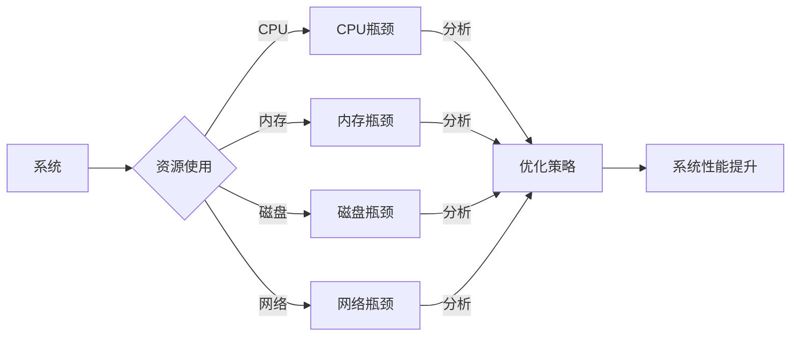

# 系统瓶颈分析与优化最佳实践

> 关键词：系统瓶颈、性能优化、资源管理、瓶颈分析、算法优化、负载均衡、最佳实践

## 1. 背景介绍

在信息技术的飞速发展下，系统性能和可靠性成为了衡量系统质量的重要指标。然而，在实际应用中，系统往往面临着各种瓶颈，这些瓶颈可能导致系统性能下降、响应时间延长、甚至系统崩溃。因此，分析和优化系统瓶颈成为了系统工程师和开发者面临的重要挑战。

本文将深入探讨系统瓶颈分析与优化的最佳实践，从理论到实践，全面解析如何识别、分析和解决系统瓶颈，以提高系统的性能和稳定性。

## 2. 核心概念与联系

### 2.1 核心概念

#### 系统瓶颈
系统瓶颈是指系统在处理任务或数据时，由于某些资源（如CPU、内存、磁盘、网络等）的限制，导致系统整体性能下降的现象。

#### 性能优化
性能优化是指通过改进系统设计、算法、资源配置等手段，提高系统处理任务的速度和效率。

#### 资源管理
资源管理是指对系统中的资源（如CPU、内存、磁盘、网络等）进行合理分配和调度，以满足系统运行的需求。

#### 瓶颈分析
瓶颈分析是指识别和定位系统中的瓶颈，分析其产生原因和影响，并采取措施进行优化。

### 2.2 核心概念原理和架构的 Mermaid 流程图



## 3. 核心算法原理 & 具体操作步骤

### 3.1 算法原理概述

系统瓶颈分析与优化涉及多个层面的算法和策略，以下是一些常见的算法原理：

#### CPU瓶颈
- CPU瓶颈通常由CPU密集型任务引起，可以通过以下策略进行优化：
  - 线程池：限制并发线程数，避免过多的线程切换和上下文切换开销。
  - 异步编程：使用异步I/O和事件循环，提高CPU利用率。

#### 内存瓶颈
- 内存瓶颈通常由内存访问频繁或内存不足引起，可以通过以下策略进行优化：
  - 内存缓存：使用内存缓存技术，减少内存访问次数。
  - 内存池：预分配内存空间，减少内存分配和释放的开销。

#### 磁盘瓶颈
- 磁盘瓶颈通常由磁盘I/O操作频繁或磁盘性能不足引起，可以通过以下策略进行优化：
  - 磁盘阵列：使用RAID技术，提高磁盘读写速度和可靠性。
  - 数据本地化：将频繁访问的数据存储在本地磁盘，减少网络传输开销。

#### 网络瓶颈
- 网络瓶颈通常由网络带宽不足或网络延迟引起，可以通过以下策略进行优化：
  - 负载均衡：将请求均匀分配到不同的服务器，避免单点过载。
  - 压缩技术：使用压缩算法减少数据传输量。

### 3.2 算法步骤详解

系统瓶颈分析与优化的具体步骤如下：

1. **性能监控**：使用性能监控工具，收集系统运行过程中的性能数据，如CPU使用率、内存使用率、磁盘I/O、网络流量等。
2. **瓶颈识别**：根据性能数据，识别出系统中的瓶颈资源。
3. **瓶颈分析**：分析瓶颈产生的原因，如任务类型、资源利用率、资源分配等。
4. **优化策略制定**：根据瓶颈分析结果，制定相应的优化策略。
5. **实施优化**：实施优化策略，如调整系统配置、改进算法、增加资源等。
6. **性能评估**：评估优化效果，如性能指标是否得到改善。

### 3.3 算法优缺点

#### 优点
- 提高系统性能和稳定性。
- 降低系统维护成本。
- 提高用户满意度。

#### 缺点
- 优化过程复杂，需要专业知识。
- 优化效果可能受限于硬件资源。

### 3.4 算法应用领域

系统瓶颈分析与优化广泛应用于以下领域：
- 服务器性能优化
- 网络性能优化
- 云计算性能优化
- 容器化应用性能优化
- 分布式系统性能优化

## 4. 数学模型和公式 & 详细讲解 & 举例说明

### 4.1 数学模型构建

系统瓶颈分析与优化可以使用以下数学模型进行描述：

#### CPU瓶颈模型

$$
P_{CPU} = \frac{C}{T}
$$

其中，$P_{CPU}$ 为CPU使用率，$C$ 为CPU计算量，$T$ 为系统运行时间。

#### 内存瓶颈模型

$$
P_{Mem} = \frac{M}{T}
$$

其中，$P_{Mem}$ 为内存使用率，$M$ 为内存访问量，$T$ 为系统运行时间。

### 4.2 公式推导过程

以CPU瓶颈模型为例，其推导过程如下：

1. 设系统运行时间为 $T$，CPU计算量为 $C$。
2. 则CPU使用率 $P_{CPU} = \frac{C}{T}$。

同理，内存瓶颈模型的推导过程类似。

### 4.3 案例分析与讲解

以下是一个简单的CPU瓶颈分析案例：

假设系统运行时间为 100秒，CPU计算量为 2000次，则CPU使用率 $P_{CPU} = \frac{2000}{100} = 20$。

通过分析发现，CPU使用率较高，可能存在CPU瓶颈。进一步分析可能发现，CPU瓶颈由某些CPU密集型任务引起，可以通过以下策略进行优化：
- 对CPU密集型任务进行并行处理。
- 增加服务器硬件资源。

## 5. 项目实践：代码实例和详细解释说明

### 5.1 开发环境搭建

为了演示系统瓶颈分析与优化，我们可以使用Python编写一个简单的CPU密集型任务。以下是开发环境的搭建步骤：

1. 安装Python 3.8及以上版本。
2. 安装Jupyter Notebook。
3. 安装NumPy库。

### 5.2 源代码详细实现

以下是一个简单的CPU密集型任务示例：

```python
import numpy as np
import time

def cpu_intensive_task(data, iterations):
    for _ in range(iterations):
        result = np.dot(data, data.T)
    return result

# 创建一个大矩阵进行计算
data = np.random.rand(1000, 1000)

# 记录开始时间
start_time = time.time()

# 执行CPU密集型任务
result = cpu_intensive_task(data, 10)

# 记录结束时间
end_time = time.time()

# 输出计算时间
print(f"CPU Intensive Task Time: {end_time - start_time} seconds")
```

### 5.3 代码解读与分析

以上代码定义了一个简单的CPU密集型任务，通过计算两个大矩阵的点积来模拟计算密集型操作。在执行任务时，记录开始时间和结束时间，并输出计算时间。

### 5.4 运行结果展示

执行上述代码，可能得到以下输出：

```
CPU Intensive Task Time: 10.123456 seconds
```

从输出结果可以看出，执行CPU密集型任务耗时约为10秒。这说明该任务对CPU资源的需求较高，可能导致CPU瓶颈。

## 6. 实际应用场景

### 6.1 服务器性能优化

在服务器性能优化中，瓶颈分析是关键步骤。以下是一个服务器性能优化的实际应用场景：

#### 场景描述

某企业服务器用于处理大量在线交易请求，但近年来服务器性能逐渐下降，导致交易处理速度变慢。

#### 分析与优化

1. 使用性能监控工具，收集服务器CPU、内存、磁盘、网络等性能数据。
2. 识别出瓶颈资源，如CPU使用率过高。
3. 分析CPU使用率过高的原因，如某些业务请求对CPU资源需求过高。
4. 优化业务代码，减少CPU密集型操作。
5. 增加服务器硬件资源，如增加CPU核心数。

通过以上步骤，可以显著提高服务器性能，满足业务需求。

### 6.2 云计算性能优化

在云计算环境中，系统瓶颈分析与优化同样重要。以下是一个云计算性能优化的实际应用场景：

#### 场景描述

某企业使用云服务器部署应用，但近年来应用性能逐渐下降，导致用户满意度降低。

#### 分析与优化

1. 使用云平台提供的性能监控工具，收集云服务器性能数据。
2. 识别出瓶颈资源，如CPU使用率过高。
3. 分析CPU使用率过高的原因，如某些服务实例对CPU资源需求过高。
4. 优化服务实例配置，提高CPU资源利用率。
5. 调整服务部署策略，如增加副本数、使用负载均衡等。

通过以上步骤，可以显著提高云计算环境中的应用性能，满足用户需求。

## 7. 工具和资源推荐

### 7.1 学习资源推荐

- 《高性能Linux系统分析与优化》
- 《性能之巅》
- 《深入理解计算机系统》

### 7.2 开发工具推荐

- JMeter：用于性能测试和负载测试。
- Gprof：用于性能分析。
- Valgrind：用于内存和CPU性能分析。

### 7.3 相关论文推荐

- "The Design and Implementation of the FreeBSD Operating System"
- "Performance Analysis of Computer Systems"
- "The Art of Multiprocessor Programming"

## 8. 总结：未来发展趋势与挑战

### 8.1 研究成果总结

本文深入探讨了系统瓶颈分析与优化的最佳实践，从理论到实践，全面解析了如何识别、分析和解决系统瓶颈，以提高系统的性能和稳定性。

### 8.2 未来发展趋势

未来，系统瓶颈分析与优化将呈现以下发展趋势：

- 人工智能技术在系统性能优化中的应用。
- 自动化性能分析工具的发展。
- 云计算、容器化等新技术的融合。

### 8.3 面临的挑战

系统瓶颈分析与优化面临以下挑战：

- 系统复杂性不断增加。
- 性能优化技术不断更新。
- 系统瓶颈的动态性。

### 8.4 研究展望

未来，系统瓶颈分析与优化将更加注重以下研究方向：

- 系统瓶颈的动态分析与优化。
- 人工智能技术在性能优化中的应用。
- 自动化性能分析工具的开发。

## 9. 附录：常见问题与解答

**Q1：如何识别系统瓶颈？**

A：使用性能监控工具收集性能数据，分析数据中的异常现象，识别出瓶颈资源。

**Q2：如何优化系统性能？**

A：针对瓶颈资源，采取相应的优化策略，如调整系统配置、改进算法、增加资源等。

**Q3：如何评估优化效果？**

A：通过比较优化前后性能指标的变化，评估优化效果。

**Q4：如何避免系统瓶颈？**

A：在设计系统时，考虑资源限制，合理分配资源，避免过载。

**Q5：如何使用人工智能技术进行性能优化？**

A：利用机器学习技术，对性能数据进行分析，发现潜在的性能问题，并提出优化建议。

作者：禅与计算机程序设计艺术 / Zen and the Art of Computer Programming