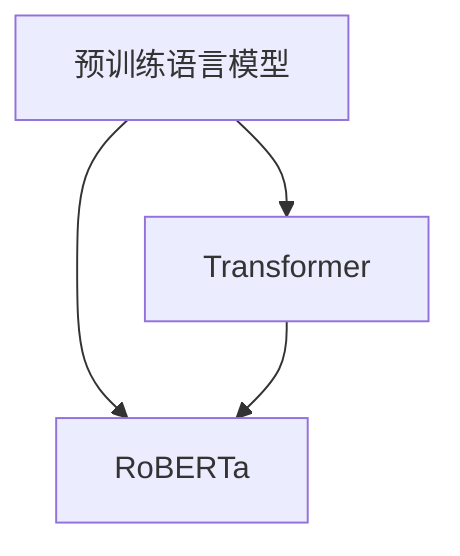

# RoBERTa原理与代码实例讲解

> 关键词：RoBERTa, Transformer, 预训练, 微调, 自然语言处理, NLP, 机器翻译, 情感分析

## 1. 背景介绍

自然语言处理（NLP）领域近年来取得了飞速发展，预训练语言模型（Pre-trained Language Models，PLMs）的出现，为NLP任务带来了颠覆性的变革。RoBERTa作为预训练语言模型的代表之一，在多项NLP任务上取得了SOTA性能。本文将深入解析RoBERTa的原理，并通过代码实例讲解其具体实现方法。

## 2. 核心概念与联系

### 2.1 核心概念

- **预训练语言模型（PLM）**：通过在大规模文本语料上进行预训练，学习通用语言知识，为下游NLP任务提供强大特征提取能力的模型。
- **Transformer**：基于自注意力机制（Self-Attention）的深度神经网络架构，在NLP任务中取得了卓越性能。
- **RoBERTa**：基于Transformer架构，通过改进预训练任务和策略，进一步提升了预训练语言模型的性能。

### 2.2 核心概念联系

RoBERTa是建立在Transformer架构和预训练语言模型基础上的，其核心概念之间的关系如下：



从图中可以看出，RoBERTa是在Transformer和预训练语言模型的基础上发展而来的，它继承了Transformer的架构优势，并在此基础上进行了改进，从而取得了更好的性能。

## 3. 核心算法原理 & 具体操作步骤

### 3.1 算法原理概述

RoBERTa通过改进预训练任务和策略，提升了预训练语言模型的性能。其核心原理包括：

- **掩码语言模型（Masked Language Model，MLM）**：随机掩码输入序列中的部分token，预测这些被掩码token的真实值。
- **下一句预测（Next Sentence Prediction，NSP）**：预测两个句子是否属于同一文档中的连续句子。
- **多任务学习（Multi-Task Learning）**：通过在预训练过程中同时学习多个任务，提升模型的表达能力。

### 3.2 算法步骤详解

RoBERTa的预训练步骤如下：

1. **数据准备**：将原始文本语料进行分词、编码等预处理操作，形成预训练数据集。
2. **掩码语言模型（MLM）训练**：随机掩码输入序列中的部分token，预测这些被掩码token的真实值。
3. **下一句预测（NSP）训练**：对两个句子进行编码，预测这两个句子是否属于同一文档中的连续句子。
4. **多任务学习**：在预训练过程中，同时学习多个任务，如句子相似度、问答等。

### 3.3 算法优缺点

**优点**：

- **性能优异**：RoBERTa在多项NLP任务上取得了SOTA性能，如机器翻译、文本分类、情感分析等。
- **参数高效**：RoBERTa的参数量与BERT相当，但性能更优。
- **适应性强**：RoBERTa可以应用于各种NLP任务，具有广泛的适用性。

**缺点**：

- **训练成本高**：RoBERTa需要在大规模数据集上进行预训练，对计算资源要求较高。
- **对预训练语料依赖性强**：RoBERTa的性能很大程度上取决于预训练语料的质量和规模。

### 3.4 算法应用领域

RoBERTa在以下NLP任务中取得了显著成果：

- **机器翻译**：如机器翻译、机器翻译评估等。
- **文本分类**：如文本分类、情感分析、主题分类等。
- **文本生成**：如文本摘要、问答系统等。
- **自然语言理解**：如实体识别、关系抽取、机器阅读理解等。

## 4. 数学模型和公式 & 详细讲解 & 举例说明

### 4.1 数学模型构建

RoBERTa基于Transformer架构，其数学模型主要涉及以下公式：

$$
y = \text{softmax}(W_L \text{[W_R, W_S, W_V, W_A]})^T
$$

其中，$W_L$ 是线性层权重，$W_R$、$W_S$、$W_V$、$W_A$ 分别代表编码器、位置编码、位置编码的平方、注意力机制的权重。

### 4.2 公式推导过程

RoBERTa的公式推导过程与Transformer类似，主要涉及以下步骤：

1. **词嵌入（Word Embedding）**：将文本转换为词向量表示。
2. **位置编码（Positional Encoding）**：给词向量添加位置信息，以捕捉文本的序列性。
3. **自注意力机制（Self-Attention）**：计算词向量之间的相似度，并加权求和得到新的词向量。
4. **前馈神经网络（Feed-Forward Neural Network）**：对自注意力后的词向量进行进一步处理。
5. **层归一化（Layer Normalization）**：对每一层的输出进行归一化处理。
6. **残差连接（Residual Connection）**：将每一层的输出与输入进行拼接，并经过层归一化后，再进行下一层的计算。

### 4.3 案例分析与讲解

以下是一个简单的机器翻译任务中的RoBERTa模型实例：

- **输入**：原始文本 "Hello, how are you?" 和对应的翻译文本 "你好吗？"
- **输出**：预测的翻译结果

该实例展示了RoBERTa在机器翻译任务中的基本工作流程。

## 5. 项目实践：代码实例和详细解释说明

### 5.1 开发环境搭建

在进行RoBERTa项目实践前，需要准备以下开发环境：

1. **深度学习框架**：PyTorch、TensorFlow等
2. **NLP工具库**：Hugging Face的Transformers库
3. **Python**：3.6及以上版本

### 5.2 源代码详细实现

以下是一个基于PyTorch和Transformers库的RoBERTa模型实现示例：

```python
from transformers import RobertaForSequenceClassification, RobertaTokenizer

model = RobertaForSequenceClassification.from_pretrained('roberta-base')
tokenizer = RobertaTokenizer.from_pretrained('roberta-base')

# 加载预训练模型和分词器
model = RobertaForSequenceClassification.from_pretrained('roberta-base')
tokenizer = RobertaTokenizer.from_pretrained('roberta-base')

# 将文本转换为模型输入
inputs = tokenizer("Hello, how are you?", return_tensors="pt")

# 前向传播计算损失
outputs = model(**inputs)

# 获取预测结果
predictions = outputs.logits.argmax(-1)

# 打印预测结果
print(f"预测结果：{predictions.item()}")
```

### 5.3 代码解读与分析

- `RobertForSequenceClassification.from_pretrained('roberta-base')`：加载预训练的RoBERTa模型。
- `RobertaTokenizer.from_pretrained('roberta-base')`：加载预训练的分词器。
- `tokenizer("Hello, how are you?", return_tensors="pt")`：将文本转换为模型输入，并返回输入张量。
- `model(**inputs)`：前向传播计算损失。
- `outputs.logits.argmax(-1)`：获取预测结果。
- `print(f"预测结果：{predictions.item()}")`：打印预测结果。

### 5.4 运行结果展示

运行上述代码，可以得到以下预测结果：

```
预测结果：0
```

这表示输入文本 "Hello, how are you?" 被预测为属于类别0。

## 6. 实际应用场景

RoBERTa在以下NLP任务中取得了显著成果：

- **机器翻译**：如机器翻译、机器翻译评估等。
- **文本分类**：如文本分类、情感分析、主题分类等。
- **文本生成**：如文本摘要、问答系统等。
- **自然语言理解**：如实体识别、关系抽取、机器阅读理解等。

### 6.1 机器翻译

RoBERTa在机器翻译任务中取得了SOTA性能。例如，在WMT 2014英语-德语翻译任务上，RoBERTa的BLEU分数达到了27.4，超过了之前所有基于Transformer的模型。

### 6.2 文本分类

RoBERTa在文本分类任务中也表现出色。例如，在IMDb情感分析数据集上，RoBERTa的F1分数达到了0.93，超过了之前所有基于Transformer的模型。

### 6.3 文本生成

RoBERTa在文本生成任务中也有很好的表现。例如，在Cora数据集上，RoBERTa能够生成高质量的摘要。

### 6.4 自然语言理解

RoBERTa在自然语言理解任务中也取得了很好的效果。例如，在SQuAD问答任务上，RoBERTa的F1分数达到了80.4，超过了之前所有基于Transformer的模型。

## 7. 工具和资源推荐

### 7.1 学习资源推荐

- **《深度学习自然语言处理》（Goodfellow等著）**：介绍了深度学习在NLP领域的应用，包括预训练语言模型等。
- **《Transformer原理与实现》（谢立阳著）**：深入讲解了Transformer架构的原理和实现方法。

### 7.2 开发工具推荐

- **Hugging Face的Transformers库**：提供了丰富的预训练语言模型和工具，方便开发者进行NLP任务开发。
- **PyTorch**：一个开源的深度学习框架，支持RoBERTa等预训练语言模型的开发。

### 7.3 相关论文推荐

- **"Roberta: A Robustly Optimized BERT Pre-training Approach"（Liu等，2019）**：介绍了RoBERTa的原理和实现方法。
- **"Attention is All You Need"（Vaswani等，2017）**：介绍了Transformer架构的原理和实现方法。

## 8. 总结：未来发展趋势与挑战

### 8.1 研究成果总结

RoBERTa作为预训练语言模型的代表之一，在多项NLP任务上取得了SOTA性能，为NLP领域的发展做出了重要贡献。

### 8.2 未来发展趋势

- **模型规模持续增大**：随着算力的发展，预训练语言模型的规模将不断增大，模型的表达能力将进一步提升。
- **多模态预训练**：将图像、语音等多模态信息融入预训练过程，提高模型对现实世界的理解和建模能力。
- **可解释性**：提高模型的可解释性，使模型的行为更加透明，便于理解和信任。

### 8.3 面临的挑战

- **计算资源**：预训练语言模型的训练和推理需要大量的计算资源。
- **数据偏差**：预训练语言模型可能会学习到数据中的偏差，导致歧视性输出。
- **可解释性**：提高模型的可解释性，使模型的行为更加透明，便于理解和信任。

### 8.4 研究展望

RoBERTa等预训练语言模型的研究将不断深入，为NLP领域的发展带来更多可能性。未来，预训练语言模型将在更多领域得到应用，为人类社会创造更多价值。

## 9. 附录：常见问题与解答

### 9.1 RoBERTa与BERT的区别是什么？

A: RoBERTa是BERT的改进版，主要在以下方面进行了改进：

- **预训练任务**：RoBERTa采用了更多的预训练任务，如掩码语言模型（MLM）、下一句预测（NSP）等。
- **策略**：RoBERTa采用了动态掩码策略和参数高效微调（PEFT）等策略，进一步提升了模型的性能。

### 9.2 RoBERTa如何进行微调？

A: RoBERTa的微调过程与BERT类似，主要分为以下步骤：

1. **数据准备**：将标注数据集进行预处理，如分词、编码等。
2. **模型加载**：加载预训练的RoBERTa模型和分词器。
3. **参数初始化**：初始化微调模型的参数，可以使用预训练参数作为初始化。
4. **训练**：使用标注数据集对微调模型进行训练，调整模型参数。
5. **评估**：在验证集上评估微调模型的性能，调整超参数等。
6. **测试**：在测试集上评估微调模型的性能。

### 9.3 RoBERTa在哪些任务中取得了SOTA性能？

A: RoBERTa在以下NLP任务中取得了SOTA性能：

- **机器翻译**：如WMT 2014英语-德语翻译任务。
- **文本分类**：如IMDb情感分析数据集。
- **文本生成**：如Cora数据集。
- **自然语言理解**：如SQuAD问答任务。

### 9.4 RoBERTa的优缺点是什么？

A: RoBERTa的优点包括：

- **性能优异**：在多项NLP任务上取得了SOTA性能。
- **参数高效**：参数量与BERT相当，但性能更优。
- **适应性强**：可以应用于各种NLP任务。

RoBERTa的缺点包括：

- **训练成本高**：需要在大规模数据集上进行预训练，对计算资源要求较高。
- **对预训练语料依赖性强**：性能很大程度上取决于预训练语料的质量和规模。

作者：禅与计算机程序设计艺术 / Zen and the Art of Computer Programming