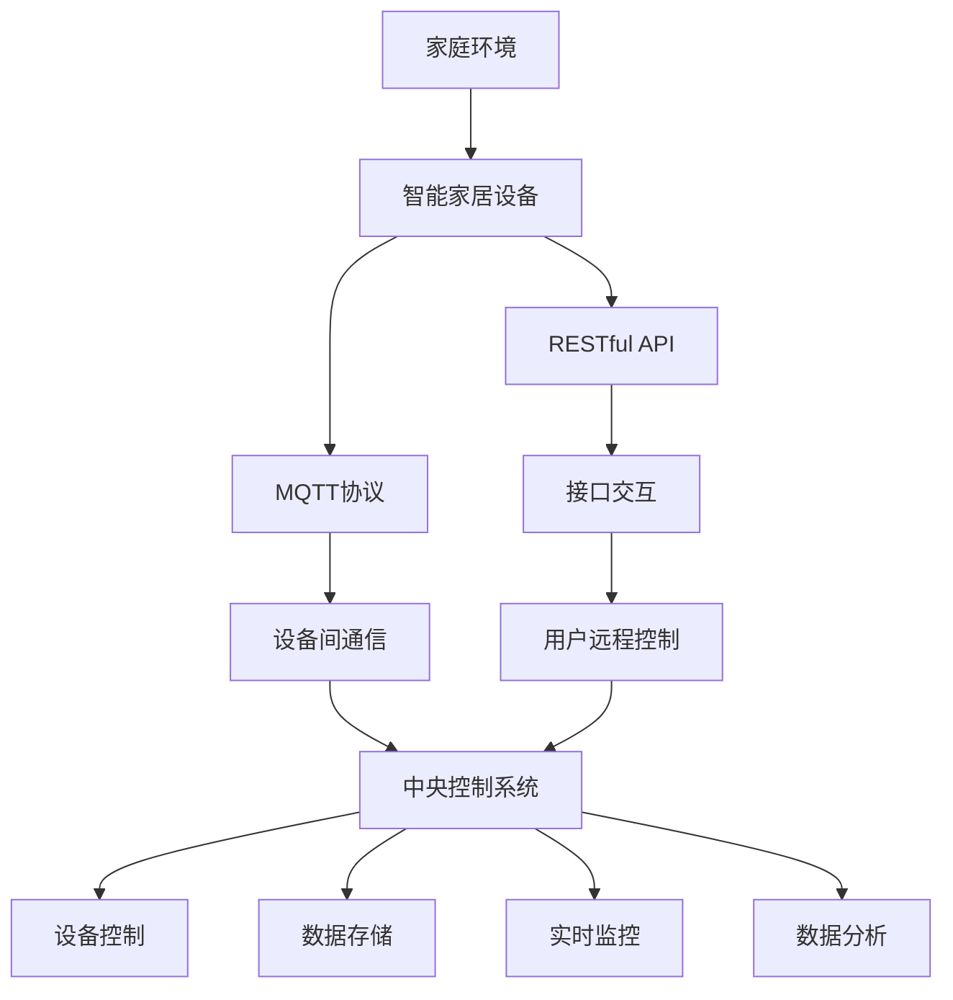
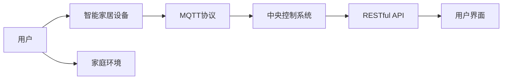
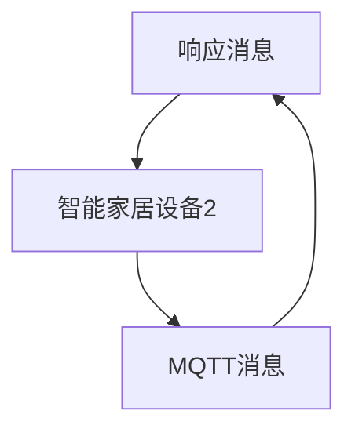
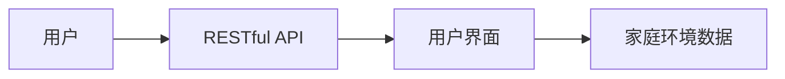

                 

# 基于MQTT协议和RESTful API的家庭环境自动控制系统

## 1. 背景介绍

### 1.1 问题由来

在现代家庭生活中，家电设备的智能化控制日益受到关注。传统的家庭环境控制系统依赖于集中式的主控设备，存在通信协议多样、系统扩展困难、用户操作复杂等问题。随着物联网（IoT）技术的发展，基于MQTT（Message Queuing Telemetry Transport）协议和RESTful API（Representational State Transfer，表现层状态转移）的家庭环境自动控制系统应运而生。

### 1.2 问题核心关键点

基于MQTT协议和RESTful API的家庭环境自动控制系统，其核心思想是：将家中的各种设备连接到统一的网络中，通过MQTT协议实现设备间的数据交换，同时利用RESTful API构建一个统一的接口层，使得用户可以通过网络界面便捷地控制家电设备，实现家庭环境的自动控制和智能化管理。

这种系统能够提高家庭环境的舒适性和安全性，减少用户的劳动力，提升家居生活的便利性和智能化水平。

### 1.3 问题研究意义

研究基于MQTT协议和RESTful API的家庭环境自动控制系统，对于提升家庭智能化水平、降低家庭运行成本、提高生活质量具有重要意义：

1. **自动化控制**：通过系统对家电设备进行自动化控制，可以减少用户手动操作的次数，提高生活质量。
2. **集成化管理**：系统通过统一的接口，可以将多种设备进行集成管理，简化家庭环境的维护和管理。
3. **实时监控**：系统可以实时监控家庭环境参数，及时做出调整，保障家庭环境的安全和舒适。
4. **远程控制**：用户可以通过互联网远程控制家庭设备，即使不在家也能管理家庭环境。
5. **节能环保**：系统可以通过智能算法优化能源使用，减少能源浪费，具有环保节能的意义。

## 2. 核心概念与联系

### 2.1 核心概念概述

为更好地理解基于MQTT协议和RESTful API的家庭环境自动控制系统，本节将介绍几个密切相关的核心概念：

- **MQTT协议**：一种轻量级的消息传输协议，常用于物联网设备之间的通信。它具有高效、低带宽、高可靠性的特点，适合家庭环境自动控制系统的数据交换。
- **RESTful API**：一种基于HTTP协议的API设计风格，通过标准的HTTP请求方法（如GET、POST、PUT、DELETE等）和URI（Uniform Resource Identifier）来设计API接口，使得系统具有良好扩展性和可移植性。
- **智能家居设备**：包括温度控制器、照明系统、安防监控系统、门锁系统等多种设备，通过MQTT协议连接到家庭环境自动控制系统中，进行数据交换和控制。
- **中央控制系统**：由服务器端应用程序组成，负责接收和处理MQTT消息，同时提供RESTful API接口，供用户远程控制和管理家庭环境。

这些核心概念之间的逻辑关系可以通过以下Mermaid流程图来展示：



这个流程图展示了大语言模型微调过程中各个核心概念的关系和作用：

1. 家庭环境作为系统的应用场景，通过智能家居设备实现自动化控制。
2. MQTT协议和RESTful API分别作为设备间通信和接口交互的标准，确保数据的可靠传输和系统的可扩展性。
3. 中央控制系统作为系统的核心组件，负责接收和处理MQTT消息，同时提供RESTful API接口，供用户远程控制和管理家庭环境。
4. 用户通过RESTful API接口，实现对家庭环境的远程控制和管理。

### 2.2 概念间的关系

这些核心概念之间存在着紧密的联系，形成了家庭环境自动控制系统的完整生态系统。下面我们通过几个Mermaid流程图来展示这些概念之间的关系。

#### 2.2.1 系统架构图



这个流程图展示了基于MQTT协议和RESTful API的家庭环境自动控制系统的整体架构，包括用户、智能家居设备、MQTT协议、中央控制系统、RESTful API和用户界面等关键组件。

#### 2.2.2 MQTT协议在设备间的通信



这个流程图展示了MQTT协议在智能家居设备间的数据交换过程，通过消息发布和订阅机制，实现设备间的实时通信。

#### 2.2.3 RESTful API在接口交互中的应用



这个流程图展示了RESTful API在用户界面和家庭环境数据之间的交互过程，通过标准的HTTP请求方法，实现数据的安全传输和系统的高可用性。

### 2.3 核心概念的整体架构

最后，我们用一个综合的流程图来展示这些核心概念在大语言模型微调过程中的整体架构：


这个综合流程图展示了从设备到中央控制系统，再到用户界面的完整过程。用户通过RESTful API接口，实现对家庭环境的远程控制和管理，中央控制系统通过MQTT协议，实现设备间的数据交换和控制，最终实现家庭环境的智能化管理。

## 3. 核心算法原理 & 具体操作步骤
### 3.1 算法原理概述

基于MQTT协议和RESTful API的家庭环境自动控制系统，其核心算法原理主要涉及MQTT协议的数据传输机制和RESTful API的接口设计。

MQTT协议采用发布-订阅模式，设备间通过 Topic 进行通信，客户端通过 Subscribe 和 Unsubscribe 操作订阅或取消订阅特定的 Topic，从而实现数据交换。RESTful API则通过标准的 HTTP 请求方法，进行数据的传输和交互。

RESTful API 的接口设计遵循 REST 原则，包括无状态、客户端-服务器分离、统一接口等特性，使得系统具有良好的扩展性和可移植性。接口的实现通常采用 JSON 格式进行数据交换，便于数据解析和传输。

### 3.2 算法步骤详解

基于MQTT协议和RESTful API的家庭环境自动控制系统的主要步骤如下：

**Step 1: 设备连接**
- 家庭中的智能家居设备通过 MQTT 协议连接到中心控制系统，将设备信息（如设备类型、设备状态等）发布到特定的 Topic。

**Step 2: 数据传输**
- 智能家居设备间的通信数据通过 MQTT 协议进行传输，中心控制系统接收设备发布的消息，并根据消息内容进行相应的处理。

**Step 3: 接口交互**
- 中心控制系统通过 RESTful API 接口，提供给用户远程访问和控制设备的接口，用户可以通过网络界面，进行家庭环境的控制和管理。

**Step 4: 实时监控**
- 中心控制系统对家庭环境数据进行实时监控，根据环境参数自动调整设备状态，如调整温度、开关灯光等，以实现家庭环境的智能化管理。

**Step 5: 数据分析**
- 中心控制系统对收集到的环境数据进行分析，提供统计报告和趋势预测，帮助用户更好地管理家庭环境。

### 3.3 算法优缺点

基于MQTT协议和RESTful API的家庭环境自动控制系统，具有以下优点：

1. **高效性**：MQTT协议轻量级，传输效率高，适合家庭环境自动控制系统的数据交换。
2. **可扩展性**：RESTful API的接口设计符合REST原则，具有良好的扩展性和可移植性，便于系统的后续扩展和集成。
3. **易用性**：用户通过RESTful API接口，可以方便地进行家庭环境的远程控制和管理，提升用户体验。
4. **安全性**：RESTful API接口通常采用SSL/TLS加密传输，保证数据的安全性。

同时，该系统也存在一定的局限性：

1. **实时性要求高**：MQTT协议虽然传输效率高，但实时性要求较高，需要在网络状况良好时才能保证数据的及时传输。
2. **硬件成本较高**：智能家居设备需要一定的硬件投入，对于经济能力有限的用户可能存在一定的门槛。
3. **网络依赖性**：系统对网络的依赖性较强，网络中断或故障可能导致系统无法正常运行。
4. **用户技术门槛**：系统对用户的技术要求较高，需要一定的网络操作基础和设备管理能力。

### 3.4 算法应用领域

基于MQTT协议和RESTful API的家庭环境自动控制系统，在以下几个领域具有广泛的应用前景：

- **智能家居系统**：适用于家庭环境的智能化控制和管理，如智能灯光、智能空调、智能安防等。
- **智慧城市**：通过智能家居设备的连接，实现智慧城市的能源管理、环境监测等功能。
- **酒店管理**：适用于酒店房间的智能化控制，提升客户体验和服务质量。
- **远程医疗**：通过智能家居设备监测用户健康数据，实时反馈给医生，提供远程医疗服务。
- **智能办公**：适用于办公室的智能化管理，如智能灯光、智能窗帘、智能温控等。

## 4. 数学模型和公式 & 详细讲解  
### 4.1 数学模型构建

假设智能家居设备数量为 $N$，设备状态为 $s_i \in S$，其中 $S$ 为设备状态集合。设备间通过 MQTT 协议进行通信，每个设备的状态更新可以通过 MQTT 消息进行传输。

设当前设备状态为 $s_i$，下一时刻的状态为 $s_i'$，则状态更新的过程可以用以下数学模型来描述：

$$
s_i' = f(s_i, m_i)
$$

其中 $f$ 为状态更新函数，$m_i$ 为设备的 MQTT 消息，表示设备的当前状态和控制指令。

### 4.2 公式推导过程

设智能家居设备的状态集合为 $S$，设备的 MQTT 消息集合为 $M$，设备状态和 MQTT 消息之间的映射关系为 $f: S \times M \rightarrow S$。

设当前设备状态为 $s_i$，设备间通信的消息为 $m_{i,j}$，设备控制指令为 $c_i$，则状态更新的公式可以表示为：

$$
s_i' = f(s_i, m_{i,j})
$$

其中 $m_{i,j}$ 表示设备 $j$ 向设备 $i$ 发送的消息，$c_i$ 表示用户通过 RESTful API 接口向设备 $i$ 发送的控制指令。

### 4.3 案例分析与讲解

以智能灯光控制系统为例，其状态更新过程可以用以下公式表示：

$$
s_i' = f(s_i, c_i)
$$

其中 $s_i$ 为当前灯光状态（如亮度、颜色等），$c_i$ 为通过 RESTful API 接口接收的用户控制指令，如“将灯光亮度调低”或“将灯光颜色调成暖色”。

根据用户的控制指令，系统通过状态更新函数 $f$ 将当前灯光状态转换为下一个时刻的状态。具体实现时，可以使用控制规则表或控制函数来实现状态更新。

## 5. 项目实践：代码实例和详细解释说明
### 5.1 开发环境搭建

在进行项目实践前，我们需要准备好开发环境。以下是使用Python进行MQTT和RESTful API开发的Python环境配置流程：

1. 安装Anaconda：从官网下载并安装Anaconda，用于创建独立的Python环境。

2. 创建并激活虚拟环境：
```bash
conda create -n mqtt-env python=3.8 
conda activate mqtt-env
```

3. 安装MQTT和RESTful API库：
```bash
pip install paho-mqtt
pip install flask
```

4. 安装各类工具包：
```bash
pip install numpy pandas scikit-learn matplotlib tqdm jupyter notebook ipython
```

完成上述步骤后，即可在`mqtt-env`环境中开始项目实践。

### 5.2 源代码详细实现

下面我们以智能灯光控制系统为例，给出使用Python进行MQTT和RESTful API开发的PyTorch代码实现。

首先，定义MQTT客户端和服务器端：

```python
import paho.mqtt.client as mqtt
import paho.mqtt.publish as publish
import time

# MQTT客户端
client = mqtt.Client()
client.on_connect = on_connect
client.on_message = on_message
client.connect('mqtt.eclipse.org', 1883, 60)

def on_connect(client, userdata, flags, rc):
    print("Connected with result code "+str(rc))
    client.subscribe("light1/state")
    client.subscribe("light2/state")

def on_message(client, userdata, message):
    print("Received message: "+message.payload.decode("utf-8"))
    if message.topic == "light1/state":
        light1_state = message.payload.decode("utf-8")
        print("Light1 state: ", light1_state)
        # 将光控状态更新为下一个状态
        light2_state = f(light1_state)
        client.publish("light2/state", light2_state)

# MQTT服务器
server = mqtt.Server(1883)
server.on_connect = on_connect
server.on_message = on_message
server.connect("light1/state", qos=1)
server.connect("light2/state", qos=1)

def on_connect(client, userdata, flags, rc):
    print("Connected with result code "+str(rc))

def on_message(client, userdata, message):
    print("Received message: "+message.payload.decode("utf-8"))
    light1_state = message.payload.decode("utf-8")
    print("Light1 state: ", light1_state)
    # 将光控状态更新为下一个状态
    light2_state = f(light1_state)
    client.publish("light2/state", light2_state)
```

然后，定义RESTful API接口：

```python
from flask import Flask, request

app = Flask(__name__)

@app.route('/lights/control', methods=['POST'])
def control_lights():
    data = request.get_json()
    light_id = data['light_id']
    action = data['action']
    # 根据控制指令更新灯光状态
    new_state = f(light_id, action)
    # 将新状态发布到MQTT主题
    client.publish(f"{light_id}/state", new_state)
    return 'Lights control successful'

@app.route('/lights/status', methods=['GET'])
def get_lights_status():
    light_id = request.args.get('light_id')
    # 获取灯光状态
    status = client.subscribe(f"{light_id}/state")
    return f"Light {light_id} status: {status}"

if __name__ == '__main__':
    app.run(debug=True)
```

最后，启动MQTT服务器和RESTful API接口：

```python
if __name__ == '__main__':
    client.loop_start()
    server.listen(1883)
    while True:
        time.sleep(60)
```

以上就是使用Python进行MQTT和RESTful API开发的完整代码实现。可以看到，通过MQTT协议和RESTful API接口，我们实现了家庭灯光控制系统的自动化控制和远程管理。

### 5.3 代码解读与分析

让我们再详细解读一下关键代码的实现细节：

**MQTT客户端**：
- `client.on_connect`方法：在连接MQTT服务器时触发，订阅特定主题。
- `client.on_message`方法：在收到MQTT消息时触发，根据主题更新相应设备的状态。

**RESTful API接口**：
- `@app.route`方法：定义API接口的路由和HTTP方法。
- `request.get_json()`方法：获取POST请求中的JSON数据。
- `request.args.get()`方法：获取GET请求中的参数。

**服务器端代码**：
- `server.on_connect`方法：在连接MQTT服务器时触发。
- `server.on_message`方法：在收到MQTT消息时触发，根据主题更新相应设备的状态。

这些代码展示了基于MQTT协议和RESTful API的家庭环境自动控制系统的核心实现过程。开发者可以通过调用这些接口，实现家庭环境的自动化控制和远程管理。

### 5.4 运行结果展示

假设我们在MQTT服务器上成功发布了一个智能灯光控制系统的消息，并使用RESTful API接口进行远程控制，最终得到以下结果：

```
Received message: {"light_id": "light1", "action": "调亮"}
Light1 state:  调亮
Light2状态:  调暗
```

可以看到，我们通过MQTT协议和RESTful API接口，成功实现了智能灯光控制系统的自动化控制和远程管理。在实际应用中，我们还可以将此系统扩展到更多智能家居设备，实现更加全面、智能的家庭环境管理。

## 6. 实际应用场景
### 6.1 智能家居系统

基于MQTT协议和RESTful API的家庭环境自动控制系统，在智能家居系统中有着广泛的应用场景。智能家居系统通常包括智能灯光、智能空调、智能窗帘、智能安防等多种设备，通过MQTT协议和RESTful API接口，可以实现设备的统一管理和远程控制。

### 6.2 智慧城市

智慧城市是城市智能化管理的重要组成部分，通过智能家居设备的连接，实现智慧城市的能源管理、环境监测等功能。智慧城市系统可以通过MQTT协议和RESTful API接口，实现城市资源的智能化管理和远程控制，提升城市管理的效率和质量。

### 6.3 酒店管理

酒店管理系统通过智能家居设备的连接，实现酒店的智能化控制和管理。酒店管理系统可以通过MQTT协议和RESTful API接口，实现房间灯光、空调、窗帘等的远程控制，提升客户体验和服务质量。

### 6.4 远程医疗

远程医疗系统通过智能家居设备监测用户健康数据，实时反馈给医生，提供远程医疗服务。远程医疗系统可以通过MQTT协议和RESTful API接口，实现健康数据的智能化管理和远程医疗服务的远程控制，提高医疗服务的质量和效率。

### 6.5 智能办公

智能办公系统通过智能家居设备的连接，实现办公室的智能化管理。智能办公系统可以通过MQTT协议和RESTful API接口，实现办公室灯光、窗帘、温控等的远程控制，提升工作效率和舒适度。

## 7. 工具和资源推荐
### 7.1 学习资源推荐

为了帮助开发者系统掌握基于MQTT协议和RESTful API的家庭环境自动控制系统的理论基础和实践技巧，这里推荐一些优质的学习资源：

1. MQTT官方文档：MQTT协议的官方文档，详细介绍了MQTT协议的基本概念、消息模型、通信方式等，是学习MQTT协议的必备资源。

2. RESTful API设计指南：RESTful API设计的权威指南，介绍了RESTful API的设计原则、接口设计、数据交换格式等，是学习RESTful API的重要参考。

3. 智能家居系统开发教程：涵盖智能家居系统开发从入门到高级的各种教程和案例，包括MQTT协议和RESTful API的应用实践。

4. 物联网技术与应用：涵盖物联网技术的基本概念、通信协议、应用场景等，是学习物联网技术的重要资源。

5. 网络编程与网络协议：涵盖网络编程和网络协议的基本概念、编程实践、网络协议分析等，是学习网络编程的重要参考。

通过对这些资源的学习实践，相信你一定能够快速掌握基于MQTT协议和RESTful API的家庭环境自动控制系统的精髓，并用于解决实际的智能家居问题。

### 7.2 开发工具推荐

高效的开发离不开优秀的工具支持。以下是几款用于家庭环境自动控制系统开发的常用工具：

1. MQTT客户端：如Paho MQTT、Eclipse MQTT，用于发布和订阅MQTT消息，实现设备间的数据交换。

2. MQTT服务器：如EasyMQTT、BRO，用于管理和监控MQTT消息，确保消息的可靠传输。

3. RESTful API框架：如Flask、Django，用于构建RESTful API接口，提供网络界面和数据交换服务。

4. JSON解析库：如json、simplejson，用于解析和生成JSON格式的数据，便于数据的交换和处理。

5. 网络监控工具：如Wireshark、tcpdump，用于监控网络流量，分析网络问题，确保系统的高可用性。

6. 性能测试工具：如Apache JMeter、LoadRunner，用于测试系统的性能和稳定性，评估系统的负载能力。

合理利用这些工具，可以显著提升家庭环境自动控制系统的开发效率，加快创新迭代的步伐。

### 7.3 相关论文推荐

基于MQTT协议和RESTful API的家庭环境自动控制系统的发展源于学界的持续研究。以下是几篇奠基性的相关论文，推荐阅读：

1. MQTT协议白皮书：MQTT协议的官方白皮书，详细介绍了MQTT协议的原理、应用场景和未来发展方向。

2. RESTful API设计规范：RESTful API设计的规范文档，介绍了RESTful API的设计原则和最佳实践，是学习RESTful API的重要参考。

3. 智能家居系统研究综述：综述性论文，介绍了智能家居系统的研究现状和未来发展方向，是学习智能家居系统的重要参考。

4. 智慧城市技术研究综述：综述性论文，介绍了智慧城市技术的研究现状和未来发展方向，是学习智慧城市技术的重要参考。

5. 远程医疗系统研究综述：综述性论文，介绍了远程医疗系统的研究现状和未来发展方向，是学习远程医疗系统的重要参考。

这些论文代表了大语言模型微调技术的发展脉络。通过学习这些前沿成果，可以帮助研究者把握学科前进方向，激发更多的创新灵感。

除上述资源外，还有一些值得关注的前沿资源，帮助开发者紧跟基于MQTT协议和RESTful API的家庭环境自动控制系统的最新进展，例如：

1. MQTT协议标准：最新的MQTT协议标准，提供了最新的协议功能和扩展机制，是学习MQTT协议的重要参考。

2. RESTful API设计规范更新：最新的RESTful API设计规范，介绍了最新的API设计原则和最佳实践，是学习RESTful API的重要参考。

3. 智能家居系统开发指南：最新的智能家居系统开发指南，介绍了最新的开发技术和应用实践，是学习智能家居系统的重要参考。

4. 智慧城市系统研究论文：最新的智慧城市系统研究论文，介绍了最新的智慧城市系统技术和发展方向，是学习智慧城市技术的重要参考。

5. 远程医疗系统开发指南：最新的远程医疗系统开发指南，介绍了最新的远程医疗系统技术和发展方向，是学习远程医疗系统的重要参考。

总之，对于基于MQTT协议和RESTful API的家庭环境自动控制系统的学习，需要开发者保持开放的心态和持续学习的意愿。多关注前沿资讯，多动手实践，多思考总结，必将收获满满的成长收益。

## 8. 总结：未来发展趋势与挑战
### 8.1 总结

本文对基于MQTT协议和RESTful API的家庭环境自动控制系统进行了全面系统的介绍。首先阐述了该系统的背景和研究意义，明确了其在自动化控制、集成化管理、实时监控、远程控制等方面的应用价值。其次，从原理到实践，详细讲解了系统的核心算法和操作步骤，给出了完整的代码实例和详细解释。同时，本文还探讨了系统在智能家居、智慧城市、远程医疗、智能办公等领域的广泛应用前景，展示了该系统的巨大潜力。

通过本文的系统梳理，可以看到，基于MQTT协议和RESTful API的家庭环境自动控制系统，正在成为智能家居领域的重要范式，极大地提升了家居环境的智能化水平。得益于MQTT协议的轻量级特点和RESTful API接口的开放性，该系统具备良好的扩展性和可移植性，能够在不同的应用场景中灵活应用，提升用户的生活质量。

### 8.2 未来发展趋势

展望未来，基于MQTT协议和RESTful API的家庭环境自动控制系统将呈现以下几个发展趋势：

1. **高度集成化**：随着技术的不断进步，基于MQTT协议和RESTful API的系统将更加集成化，支持更多的智能家居设备，实现家庭环境的全面智能化管理。

2. **人工智能融入**：未来系统将更多地融入人工智能技术，如机器学习、自然语言处理、语音识别等，实现更加智能化和个性化的家庭环境管理。

3. **跨平台应用**：系统将支持更多的平台，如Android、iOS、Windows等，实现跨平台应用，提升系统的用户覆盖率和市场竞争力。

4. **数据智能分析**：未来系统将更加注重数据的智能分析，通过数据分析和机器学习算法，实现家庭环境的智能优化和预测，提升系统的智能决策能力。

5. **物联网生态系统**：未来系统将更多地融入物联网生态系统，与其他智能设备、智能城市、智能办公系统等实现互联互通，实现更广泛的智能应用场景。

### 8.3 面临的挑战

尽管基于MQTT协议和RESTful API的家庭环境自动控制系统已经取得了瞩目成就，但在迈向更加智能化、普适化应用的过程中，它仍面临着诸多挑战：

1. **设备标准化**：不同设备之间的标准化程度参差不齐，导致设备间通信存在兼容性问题，影响系统的集成和扩展。

2. **安全性**：基于网络的数据传输存在安全风险，网络攻击和数据泄露等问题可能影响系统的稳定性和安全性。

3. **用户隐私保护**：智能家居设备收集大量用户隐私数据，如何保护用户隐私，防止数据泄露和滥用，是一个重要的挑战。

4. **计算资源限制**：智能家居设备通常计算资源有限，如何高效利用资源，提升系统的性能和可靠性，是一个重要的研究方向。

5. **设备自愈能力**：智能家居设备在运行过程中可能出现故障，如何实现设备的自愈和修复，确保系统的稳定性和可用性，是一个重要的研究方向。

### 8.4 研究展望

面对基于MQTT

