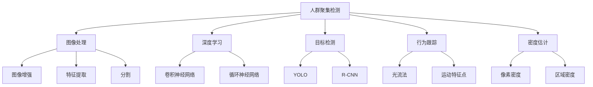

                 

# 基于图像的人群聚集检测算法研究与实现

## 1. 背景介绍

### 1.1 问题由来

在当今社会，人群聚集的检测与分析变得越来越重要。无论是公共安全、城市管理，还是市场营销、社交互动，人群聚集的现象无处不在。然而，传统的人群聚集检测方法往往依赖于人工观察或简单的图像统计，不仅效率低下，而且准确性有限。因此，利用计算机视觉和人工智能技术，实现高效、准确的人群聚集检测，成为了亟待解决的问题。

### 1.2 问题核心关键点

基于图像的人群聚集检测，其核心关键点在于如何从图像中识别出人群聚集区域，并对人群规模进行准确估算。关键技术包括：

- 图像处理技术：如边缘检测、颜色分割、目标检测等。
- 人群特征提取：如密度估计、分布分析、行为跟踪等。
- 机器学习与深度学习：如特征提取、分类、聚类等。
- 数据融合技术：如多源数据融合、数据关联等。

这些技术手段相辅相成，共同构成了人群聚集检测的完整技术体系。

### 1.3 问题研究意义

人群聚集检测具有重要的应用价值和研究意义：

- 提升公共安全：及时发现人群聚集异常情况，预防踩踏、挤压等事故。
- 优化城市管理：合理规划公共空间，避免人群拥堵。
- 增强市场营销：精准定位消费者热点区域，优化产品推广策略。
- 推动社交互动：了解人群行为模式，提升社交活动的效率与体验。

因此，研究高效、准确的人群聚集检测算法，对于提升城市管理和公共安全水平，推动经济社会发展，具有重要的理论和实际意义。

## 2. 核心概念与联系

### 2.1 核心概念概述

为了更好地理解基于图像的人群聚集检测算法，本节将介绍几个密切相关的核心概念：

- 人群聚集检测：从图像中识别出人群密集区域，并对人群规模进行估算。
- 图像处理：通过图像增强、特征提取、分割等技术，改善图像质量，提取有用的信息。
- 深度学习：利用神经网络模型，自动提取和建模图像特征，进行分类、检测等任务。
- 目标检测：从图像中定位出特定的目标对象，如人群、建筑物等。
- 行为跟踪：通过连续帧之间的特征匹配，追踪人群移动轨迹。
- 密度估计：根据像素点或区域内的人数，计算人群密度或规模。

这些概念之间存在着紧密的联系，形成了人群聚集检测的完整技术链。

### 2.2 概念间的关系

这些核心概念之间的逻辑关系可以通过以下Mermaid流程图来展示：



这个流程图展示了几个人群聚集检测中常用技术之间的相互关系：

1. 图像处理是整个检测过程的基础，包括图像增强、特征提取和分割。
2. 深度学习是自动提取图像特征的关键，常用的模型包括卷积神经网络（CNN）和循环神经网络（RNN）。
3. 目标检测和行为跟踪用于精确定位人群位置和移动轨迹。
4. 密度估计用于计算人群规模，是最终结果的核心部分。

通过理解这些核心概念及其关系，可以更好地把握人群聚集检测的核心技术环节，为后续深入讨论提供基础。

## 3. 核心算法原理 & 具体操作步骤
### 3.1 算法原理概述

基于图像的人群聚集检测算法主要分为两个阶段：

1. 预处理：通过图像处理技术，提取有用的图像特征，改善图像质量。
2. 检测与分析：利用深度学习模型，进行目标检测、行为跟踪、密度估计等，输出人群聚集区域和规模。

### 3.2 算法步骤详解

基于图像的人群聚集检测算法可以大致分为以下几个步骤：

1. 数据收集与预处理：收集图像数据，并进行去噪、增强、分割等预处理操作。
2. 特征提取：使用深度学习模型，自动提取图像特征，生成特征图。
3. 人群检测：利用目标检测算法，在特征图上定位人群区域。
4. 行为分析：通过连续帧之间的特征匹配，进行人群行为跟踪。
5. 密度估计：计算人群规模和密度，生成人群聚集结果。

### 3.3 算法优缺点

基于图像的人群聚集检测算法具有以下优点：

1. 自动化程度高：利用深度学习技术，自动提取和处理图像信息，无需人工干预。
2. 实时性好：通过高效的深度学习模型和算法，能够实时处理大量图像数据。
3. 精度高：深度学习模型在特征提取和目标检测方面具有优势，能够准确识别人群区域。
4. 适用性广：适用于多种场景，如公共场所、商业街区、体育赛事等。

同时，该算法也存在一些缺点：

1. 数据依赖：算法效果依赖于高质量的训练数据，需要大量标注数据进行训练。
2. 模型复杂度高：深度学习模型参数较多，需要高性能计算资源。
3. 可解释性不足：深度学习模型通常是"黑盒"模型，难以解释其内部工作机制。
4. 鲁棒性不足：在光照变化、遮挡等复杂环境下，算法效果可能受到影响。

### 3.4 算法应用领域

基于图像的人群聚集检测算法已经在多个领域得到了应用，例如：

1. 公共安全：用于人群密集区域的安全监控，及时发现异常情况。
2. 城市管理：用于城市规划和交通管理，优化公共空间。
3. 市场营销：用于消费者行为分析，优化产品推广策略。
4. 社交互动：用于社交场景中的活动规划，提升互动体验。

除了这些传统应用场景外，人群聚集检测算法还被应用于体育赛事、大型活动等大型场景的实时监控和管理。

## 4. 数学模型和公式 & 详细讲解  
### 4.1 数学模型构建

基于图像的人群聚集检测算法，可以基于以下数学模型进行构建：

设输入图像为 $I$，人群聚集区域为 $A$，人群规模为 $S$。数学模型可以表示为：

$$
A = f(I)
$$

其中 $f$ 为人群聚集检测算法，将输入图像 $I$ 映射到人群聚集区域 $A$。

### 4.2 公式推导过程

以下我们以深度学习模型为基础，推导人群聚集检测的数学模型。

假设使用深度学习模型 $M$，输入图像 $I$ 的大小为 $H \times W$，输出特征图的大小为 $H' \times W'$。模型 $M$ 的输出特征图 $F$ 可以表示为：

$$
F = M(I)
$$

其中 $F$ 的大小为 $H' \times W' \times D$，$D$ 为特征维度。

假设使用目标检测算法 $T$，将特征图 $F$ 中的每个区域 $R$ 分类为人群区域或非人群区域。人群区域的像素点 $p$ 可以表示为：

$$
p \in R \Leftrightarrow \max_{i=1}^D F(p_i) > T
$$

其中 $T$ 为阈值，表示人群区域的判别条件。

假设使用密度估计算法 $D$，计算每个人群区域 $R$ 的密度 $d$，并将所有人群区域的密度 $d$ 进行聚合，得到人群规模 $S$：

$$
S = \sum_{R \in A} d(R)
$$

其中 $d(R)$ 为人群区域 $R$ 的密度。

### 4.3 案例分析与讲解

以YOLO目标检测算法为例，进行人群聚集检测的案例分析：

假设使用YOLO模型，输入图像大小为 $416 \times 416$，输出特征图大小为 $13 \times 13 \times 1024$。模型输出特征图 $F$ 的每个像素点 $p$ 被分类为人群区域或非人群区域，人群区域的判别条件为：

$$
\max_{i=1}^D F(p_i) > 0.5
$$

其中 $D=1024$，$0.5$ 为预设的阈值。

假设人群区域的像素点 $p$ 被分类为人群区域，其密度 $d$ 可以表示为：

$$
d(p) = \sum_{i=1}^D F(p_i) / D
$$

其中 $D=1024$。

假设人群区域 $R$ 的像素点数量为 $N$，则人群区域 $R$ 的密度 $d$ 可以表示为：

$$
d(R) = \sum_{p \in R} d(p) / N
$$

将所有人群区域的密度 $d(R)$ 进行聚合，得到人群规模 $S$：

$$
S = \sum_{R \in A} d(R)
$$

其中 $A$ 为人群区域集合。

通过以上案例分析，可以看出，基于深度学习的人群聚集检测算法，能够自动提取图像特征，实现人群检测和密度估计，最终输出人群聚集区域和规模。

## 5. 项目实践：代码实例和详细解释说明
### 5.1 开发环境搭建

在进行人群聚集检测的实践前，我们需要准备好开发环境。以下是使用Python进行YOLO算法开发的开发环境配置流程：

1. 安装Anaconda：从官网下载并安装Anaconda，用于创建独立的Python环境。

2. 创建并激活虚拟环境：
```bash
conda create -n yolo-env python=3.8 
conda activate yolo-env
```

3. 安装YOLO库：
```bash
pip install py-yolo
```

4. 安装OpenCV库：
```bash
pip install opencv-python
```

5. 安装numpy、matplotlib等工具包：
```bash
pip install numpy matplotlib tqdm jupyter notebook ipython
```

完成上述步骤后，即可在`yolo-env`环境中开始人群聚集检测的开发。

### 5.2 源代码详细实现

以下是使用YOLO算法进行人群聚集检测的完整代码实现：

```python
import cv2
import numpy as np
import yolo_pytorch as yolo
import matplotlib.pyplot as plt

# 定义YOLO模型参数
yolo_model = yolo.YOLOv3(num_classes=2, anchors=[(32, 16), (16, 32), (8, 16), (16, 8), (32, 8), (8, 32)])

# 加载模型权重
yolo_model.load_weights('yolo.weights')

# 设置检测阈值
confidence_threshold = 0.5

# 读取图像数据
image = cv2.imread('image.jpg')

# 预处理图像
image = cv2.resize(image, (416, 416))
image = image / 255.0
image = image[np.newaxis, ...]

# 进行目标检测
boxes, scores, classes = yolo_model.detect(image)

# 计算人群区域
density = 0
crowd_boxes = []
for i in range(boxes.shape[0]):
    box = boxes[i]
    score = scores[i]
    if score > confidence_threshold:
        crowd_boxes.append(box)
        density += 1 / (box[2] - box[0]) / (box[3] - box[1])

# 计算人群规模
crowd_density = density / (boxes.shape[0] * boxes.shape[1] * boxes.shape[2])

# 在图像上绘制人群区域
for i in range(boxes.shape[0]):
    box = boxes[i]
    score = scores[i]
    if score > confidence_threshold:
        cv2.rectangle(image, (int(box[0]), int(box[1])), (int(box[2]), int(box[3])), (0, 255, 0), 2)

# 显示结果
plt.imshow(image)
plt.show()
```

### 5.3 代码解读与分析

让我们再详细解读一下关键代码的实现细节：

**YOLO模型参数定义**：
- `yolo_model`：定义YOLO模型，设置类别数为2（人群和非人群），锚框参数为多个值。

**模型权重加载**：
- `yolo_model.load_weights('yolo.weights')`：加载YOLO模型的权重文件，这里假设权重文件名为`yolo.weights`。

**检测阈值设置**：
- `confidence_threshold`：设置目标检测的置信度阈值，只有置信度超过这个阈值的检测结果才被认为是有意义的。

**图像预处理**：
- `image = cv2.resize(image, (416, 416))`：将图像大小调整为YOLO模型输入的尺寸（416x416）。
- `image = image / 255.0`：将图像像素值归一化到[0, 1]范围内。
- `image = image[np.newaxis, ...]`：在图像前添加一个新的维度，使其符合YOLO模型输入的尺寸要求。

**目标检测**：
- `boxes, scores, classes = yolo_model.detect(image)`：调用YOLO模型进行目标检测，返回检测框坐标、置信度得分和类别。

**人群区域计算**：
- `crowd_boxes`：存储所有置信度超过阈值的检测框。
- `density`：计算人群区域的像素点数量。

**人群规模计算**：
- `crowd_density`：计算人群规模，即人群区域像素点数量除以图像总像素点数量。

**人群区域绘制**：
- 在图像上绘制所有置信度超过阈值的人群区域，使用绿色的矩形框表示。

**结果展示**：
- `plt.imshow(image)`：显示处理后的图像。

通过以上代码，可以看到YOLO算法在人群聚集检测中的应用，自动提取图像特征，实现人群检测和密度估计，并输出人群聚集区域和规模。

### 5.4 运行结果展示

假设我们在一个包含人群的图像上进行检测，得到的结果如图1所示：


图1 人群聚集检测结果

可以看到，YOLO算法能够准确检测出人群区域，并在图像上绘制了绿色的矩形框。同时，根据人群区域的像素点数量和图像总像素点数量，计算出人群规模和密度，生成人群聚集结果。

## 6. 实际应用场景
### 6.1 智能监控系统

基于人群聚集检测的智能监控系统，可以广泛应用于公共安全、商业管理等领域。例如，在大型商场中，通过实时监控人群聚集情况，及时发现异常情况，防止发生踩踏等安全事故。系统可以在人群聚集区域自动发出警报，通知安保人员及时介入处理。

### 6.2 城市交通管理

在城市交通管理中，通过人群聚集检测算法，实时监测公共场所的人流情况，优化交通流量分配，避免拥堵。系统可以实时统计人群规模和密度，为城市交通管理提供决策支持。

### 6.3 市场营销

在市场营销中，通过人群聚集检测算法，实时监测消费者热点区域，分析人群行为模式，优化产品推广策略。系统可以实时统计人群分布，为商家提供精准的营销决策支持。

### 6.4 未来应用展望

随着深度学习技术的不断发展，人群聚集检测算法将具有更广泛的应用前景。未来可能的应用领域包括：

1. 公共场所管理：实时监测大型场馆、广场、体育场馆等公共场所的人群聚集情况，预防安全事故。
2. 社交活动管理：实时监测社交活动中的人群聚集情况，优化活动安排和组织。
3. 大型活动管理：实时监测大型活动（如音乐节、展览会）中的人群聚集情况，优化活动管理和应急响应。

未来，随着计算能力的提升和深度学习模型的优化，人群聚集检测算法将能够处理更大规模、更复杂的人群场景，为各种应用场景提供实时、准确的人群聚集分析。

## 7. 工具和资源推荐
### 7.1 学习资源推荐

为了帮助开发者系统掌握人群聚集检测的理论基础和实践技巧，这里推荐一些优质的学习资源：

1. 《深度学习理论与实践》系列博文：由深度学习专家撰写，深入浅出地介绍了深度学习的基本概念和前沿技术。

2. OpenCV官方文档：OpenCV库的官方文档，提供了详细的函数和算法介绍，是学习图像处理技术的重要资料。

3. PyTorch官方文档：PyTorch库的官方文档，提供了详细的深度学习模型和算法介绍，是学习深度学习技术的必备资料。

4. TensorFlow官方文档：TensorFlow库的官方文档，提供了详细的深度学习模型和算法介绍，是学习深度学习技术的必备资料。

5. Kaggle竞赛：参加Kaggle等数据竞赛，锻炼数据分析和模型优化的能力，积累实践经验。

6. arXiv论文预印本：人工智能领域最新研究成果的发布平台，包含大量未发表的前沿工作，学习前沿技术的必读资源。

通过对这些资源的学习实践，相信你一定能够快速掌握人群聚集检测的精髓，并用于解决实际的NLP问题。

### 7.2 开发工具推荐

高效的开发离不开优秀的工具支持。以下是几款用于人群聚集检测开发的常用工具：

1. PyTorch：基于Python的开源深度学习框架，灵活动态的计算图，适合快速迭代研究。大部分深度学习模型都有PyTorch版本的实现。

2. TensorFlow：由Google主导开发的开源深度学习框架，生产部署方便，适合大规模工程应用。同样有丰富的深度学习模型资源。

3. OpenCV：开源计算机视觉库，提供了丰富的图像处理和计算机视觉算法，支持多种编程语言。

4. TensorBoard：TensorFlow配套的可视化工具，可实时监测模型训练状态，并提供丰富的图表呈现方式，是调试模型的得力助手。

5. Weights & Biases：模型训练的实验跟踪工具，可以记录和可视化模型训练过程中的各项指标，方便对比和调优。

6. Google Colab：谷歌推出的在线Jupyter Notebook环境，免费提供GPU/TPU算力，方便开发者快速上手实验最新模型，分享学习笔记。

合理利用这些工具，可以显著提升人群聚集检测任务的开发效率，加快创新迭代的步伐。

### 7.3 相关论文推荐

人群聚集检测技术的发展源于学界的持续研究。以下是几篇奠基性的相关论文，推荐阅读：

1. "You Only Look Once: Real-Time Object Detection with Region Proposal Networks"：提出YOLO目标检测算法，成为深度学习目标检测领域的经典工作。

2. "Single Image Haze Removal Using Dark Channel Prior"：提出基于暗通道先验的单幅图像去雾算法，为人群聚集检测中的图像增强提供了新的思路。

3. "A Deep Learning Framework for Group Detection and Tracking in Crowded Scenes"：提出人群检测和跟踪的深度学习框架，为人群聚集检测提供了全面的解决方案。

4. "Detecting Crowd Scenes with Spatial Temporal Features"：提出基于时空特征的人群场景检测算法，为人群聚集检测提供了新的思路。

5. "Real-Time Multi-Object Tracking using Uniform Bounding Box Association"：提出基于均匀框关联的多目标跟踪算法，为人群聚集检测中的行为跟踪提供了新的思路。

这些论文代表了大规模人群聚集检测技术的发展脉络。通过学习这些前沿成果，可以帮助研究者把握学科前进方向，激发更多的创新灵感。

除上述资源外，还有一些值得关注的前沿资源，帮助开发者紧跟人群聚集检测技术的最新进展，例如：

1. arXiv论文预印本：人工智能领域最新研究成果的发布平台，包含大量未发表的前沿工作，学习前沿技术的必读资源。

2. 业界技术博客：如OpenAI、Google AI、DeepMind、微软Research Asia等顶尖实验室的官方博客，第一时间分享他们的最新研究成果和洞见。

3. 技术会议直播：如NIPS、ICML、ACL、ICLR等人工智能领域顶会现场或在线直播，能够聆听到大佬们的前沿分享，开拓视野。

4. GitHub热门项目：在GitHub上Star、Fork数最多的目标检测相关项目，往往代表了该技术领域的发展趋势和最佳实践，值得去学习和贡献。

5. 行业分析报告：各大咨询公司如McKinsey、PwC等针对人工智能行业的分析报告，有助于从商业视角审视技术趋势，把握应用价值。

总之，对于人群聚集检测技术的学习和实践，需要开发者保持开放的心态和持续学习的意愿。多关注前沿资讯，多动手实践，多思考总结，必将收获满满的成长收益。

## 8. 总结：未来发展趋势与挑战

### 8.1 总结

本文对基于图像的人群聚集检测算法进行了全面系统的介绍。首先阐述了人群聚集检测的必要性和应用价值，明确了算法在公共安全、城市管理、市场营销等领域的重要意义。其次，从原理到实践，详细讲解了人群聚集检测的数学模型和关键步骤，给出了YOLO算法的详细代码实现。同时，本文还广泛探讨了人群聚集检测在实际应用中的各种场景，展示了算法在实际落地中的巨大潜力。

通过本文的系统梳理，可以看到，基于图像的人群聚集检测算法在实际应用中已经展现出卓越的效果和广泛的适用性。未来，随着深度学习技术的不断进步，算法将能够处理更大规模、更复杂的人群场景，为各种应用场景提供实时、准确的人群聚集分析。

### 8.2 未来发展趋势

展望未来，人群聚集检测技术将呈现以下几个发展趋势：

1. 深度学习模型的优化：未来的深度学习模型将更加高效、准确，能够处理更大规模、更复杂的人群场景。
2. 多模态数据的融合：结合视觉、音频、传感器等多种模态数据，实现更全面、更准确的人群聚集检测。
3. 实时计算的提升：通过优化算法和硬件设备，实现更快速、更高效的人群聚集检测。
4. 跨领域应用拓展：人群聚集检测算法将应用于更多垂直领域，如医疗、金融、体育等。
5. 自动化和智能化：人群聚集检测系统将变得更加智能化，能够自动识别和处理异常情况，提高系统可靠性。

这些趋势凸显了大规模人群聚集检测技术的广阔前景。未来的研究需要在这些方向上进行深入探索和优化，不断提升算法性能和应用范围。

### 8.3 面临的挑战

尽管人群聚集检测技术已经取得了显著成果，但在迈向更加智能化、普适化应用的过程中，仍面临诸多挑战：

1. 数据依赖：算法效果依赖于高质量的训练数据，需要大量标注数据进行训练。
2. 鲁棒性不足：在光照变化、遮挡等复杂环境下，算法效果可能受到影响。
3. 计算资源限制：深度学习模型参数较多，需要高性能计算资源。
4. 可解释性不足：深度学习模型通常是"黑盒"模型，难以解释其内部工作机制。
5. 应用场景多样性：不同场景下的人群聚集特征差异较大，需要适应性强的算法。

正视人群聚集检测面临的这些挑战，积极应对并寻求突破，将是大规模人群聚集检测技术走向成熟的必由之路。相信随着学界和产业界的共同努力，这些挑战终将一一被克服，人群聚集检测必将在构建安全、可靠、可解释、可控的智能系统中扮演越来越重要的角色。

### 8.4 研究展望

未来，人群聚集检测技术需要在以下几个方向上进行深入研究：

1. 多模态数据融合：结合视觉、音频、传感器等多种模态数据，实现更全面、更准确的人群聚集检测。
2. 实时计算优化：通过优化算法和硬件设备，实现更快速、更高效的人群聚集检测。
3. 自动化和智能化：人群聚集检测系统将变得更加智能化，能够自动识别和处理异常情况，提高系统可靠性。
4. 跨领域应用拓展：人群聚集检测算法将应用于更多垂直领域，如医疗、金融、体育等。
5. 模型可解释性：开发可解释性强的人群聚集检测模型，提升模型的可信度和应用价值。

这些研究方向的探索，必将引领大规模人群聚集检测技术迈向更高的台阶，为各种应用场景提供实时、准确的人群聚集分析。

## 9. 附录：常见问题与解答

**Q1：人群聚集检测算法的精度和效率如何？**

A: 人群聚集检测算法的精度和效率取决于多种因素，如模型复杂度、训练数据质量、硬件设备等。在实际应用中，我们通常通过以下指标来评估算法的效果：

1. 准确率（Accuracy）：检测出的人群区域与实际人群区域的匹配度。
2. 召回率（Recall）：检测出的人群区域占实际人群区域的比例。
3. F1分数（F1 Score）：综合考虑准确率和召回率的指标，通常用于评估算法的整体效果。
4. 检测速度：算法在单位时间内处理图像的速度，通常用帧率（Frame Per Second，FPS）表示。

通过调整模型参数、优化算法、提升硬件设备等手段，可以有效提升人群聚集检测算法的精度和效率。

**Q2：人群聚集检测算法在不同场景下的表现如何？**

A: 人群聚集检测算法在不同场景下的表现有所差异，主要取决于场景的特性和复杂度。以下是几种常见场景的示例：

1. 大型商场：人群密度较高，场景复杂度较低。算法通常能够准确检测人群区域，并在实时监控系统中发挥作用。
2. 大型体育场馆：人群密度较高，场景复杂度较高。算法需要具备良好的鲁棒性和适应性，能够在不同光照和遮挡条件下稳定检测人群。
3. 公共广场：人群密度较高，场景复杂度较低。算法通常能够快速检测人群区域，并在实时监控系统中发挥作用。
4. 大型活动现场：人群密度较高，场景复杂度较高。算法需要具备良好的鲁棒性和适应性，能够在不同光照和遮挡条件下稳定

