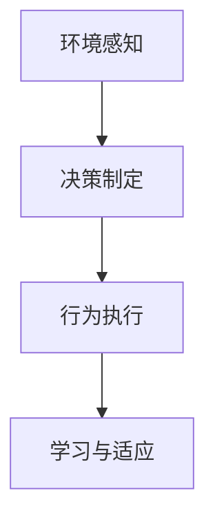
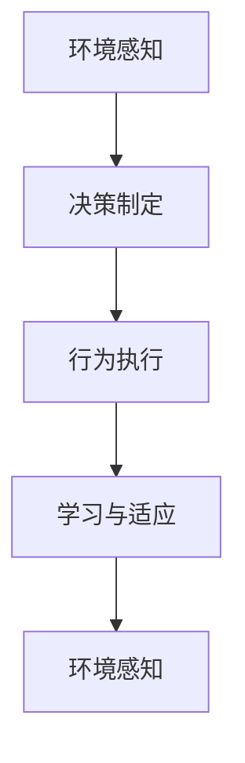

                 

## 1. 背景介绍

随着人工智能技术的不断发展，AI Agent在游戏领域的应用越来越广泛。AI Agent，即人工智能代理，是一种自主运行的智能体，能够在游戏环境中进行决策和交互，从而完成特定任务或实现某些目标。在游戏场景中，AI Agent不仅能够提高游戏的可玩性和趣味性，还能增强游戏的竞争性和挑战性。

### 1.1 问题由来

在过去的游戏开发中，开发者主要依赖程序员手动编写代码，实现角色的动作和决策。这种开发方式不仅耗时耗力，而且容易出错，难以维护。随着AI技术的进步，AI Agent成为了一种更高效、更灵活的游戏开发方式。通过AI Agent，开发者可以自动生成游戏角色的行为和决策，提升游戏开发的效率和质量。

### 1.2 问题核心关键点

AI Agent的核心关键点包括：

- 自主决策：AI Agent能够在没有外界干预的情况下，自主地进行决策和行动。
- 交互能力：AI Agent能够在游戏中与其他角色或环境进行交互，完成特定任务。
- 泛化能力：AI Agent能够适应不同的游戏环境和任务，具有较强的泛化能力。
- 可扩展性：AI Agent可以很容易地扩展到不同的游戏类型和任务中。

### 1.3 问题研究意义

研究AI Agent在游戏中的应用，对于提升游戏开发效率、增强游戏趣味性和提高游戏竞争性具有重要意义：

- 提升开发效率：AI Agent能够自动生成游戏角色的行为和决策，大幅降低开发时间和成本。
- 增强游戏趣味性：AI Agent可以自主地进行决策和行动，增加游戏的随机性和趣味性。
- 提高游戏竞争性：AI Agent能够在游戏中与其他角色或环境进行交互，增加游戏的竞争性和挑战性。
- 促进游戏创新：AI Agent的应用可以激发游戏开发者新的创意和思路，推动游戏技术的不断创新。

## 2. 核心概念与联系

### 2.1 核心概念概述

为更好地理解AI Agent在游戏中的应用，本节将介绍几个密切相关的核心概念：

- AI Agent：人工智能代理，指能够在特定环境中自主进行决策和交互的智能体。
- 环境感知：AI Agent通过传感器或输入设备获取环境信息，感知游戏世界的变化。
- 决策制定：AI Agent根据环境信息和任务目标，制定合理的决策方案。
- 行为执行：AI Agent根据决策方案，执行相应的行为动作，与环境进行交互。
- 学习与适应：AI Agent通过经验积累和学习，不断提升自身的决策能力和行为效率。

### 2.2 概念间的关系

这些核心概念之间的逻辑关系可以通过以下Mermaid流程图来展示：



这个流程图展示了大语言模型的核心概念及其之间的关系：

1. AI Agent通过环境感知获取游戏环境信息。
2. 根据感知到的环境信息，AI Agent制定相应的决策方案。
3. 执行决策方案，与环境进行交互。
4. 通过学习与适应，不断提升决策和执行能力。

### 2.3 核心概念的整体架构

最后，我们用一个综合的流程图来展示这些核心概念在大语言模型微调过程中的整体架构：



这个综合流程图展示了从环境感知到决策制定的完整过程。环境感知、决策制定、行为执行和学习与适应是AI Agent的核心组成部分，它们共同构成了AI Agent的完整工作流程。

## 3. 核心算法原理 & 具体操作步骤

### 3.1 算法原理概述

AI Agent在游戏中的应用，本质上是基于强化学习(Reinforcement Learning, RL)和深度学习(Deep Learning)技术的。其核心思想是：通过不断与环境交互，AI Agent在奖励和惩罚的驱动下，逐步优化决策和行为策略，实现自主决策和交互。

在强化学习中，AI Agent通过与环境交互，不断调整自身的策略，以最大化累计奖励。深度学习则是用于构建复杂的决策模型，提高决策的准确性和效率。

### 3.2 算法步骤详解

AI Agent在游戏中的应用主要包括以下几个关键步骤：

**Step 1: 环境建模**

首先，需要对游戏环境进行建模，将游戏世界抽象为AI Agent能够理解和处理的状态空间。例如，可以将游戏地图划分为不同的区域，每个区域的状态包括玩家的位置、敌人的位置、物品的位置等信息。

**Step 2: 设计奖励函数**

为了引导AI Agent进行决策，需要设计合理的奖励函数，用于评估AI Agent的行为。例如，当AI Agent击败敌人时，给予高奖励；当AI Agent被击败时，给予低奖励。奖励函数的目的是激励AI Agent采取有利于游戏胜利的行为。

**Step 3: 选择算法框架**

选择合适的算法框架，用于训练AI Agent。常用的算法框架包括Q-Learning、Deep Q-Network (DQN)、Actor-Critic等。这些算法框架可以根据具体的任务需求和环境特点，进行灵活选择和调整。

**Step 4: 训练与优化**

使用选择的算法框架，对AI Agent进行训练和优化。在训练过程中，通过不断与环境交互，AI Agent不断调整自身的策略，逐步优化决策和行为。优化过程中，可以使用正则化、Dropout等技术，防止过拟合。

**Step 5: 测试与部署**

在训练完成后，对AI Agent进行测试，评估其性能和稳定性。测试过程中，可以在不同的游戏场景中进行验证，确保AI Agent能够适应不同的环境和任务。测试合格后，将AI Agent部署到实际的游戏环境中，实现游戏任务的自动化处理。

### 3.3 算法优缺点

AI Agent在游戏中的应用具有以下优点：

- 自动化处理：AI Agent能够自动完成游戏中的决策和行动，减少人为干预，提高游戏开发效率。
- 增强趣味性：AI Agent的自主决策和行为，增加了游戏的随机性和趣味性。
- 提高竞争性：AI Agent能够在游戏中与其他角色或环境进行交互，增加游戏的竞争性和挑战性。

同时，AI Agent也存在一些局限性：

- 复杂性高：AI Agent的设计和训练需要较高的技术门槛，需要丰富的经验和专业知识。
- 泛化能力有限：AI Agent的决策和行为策略依赖于具体的游戏环境和任务，泛化能力有限。
- 可解释性不足：AI Agent的决策过程缺乏可解释性，难以对其推理逻辑进行分析和调试。

尽管存在这些局限性，但AI Agent在游戏中的应用前景广阔，未来仍有很大的发展空间。

### 3.4 算法应用领域

AI Agent在游戏中的应用，主要集中在以下几个领域：

- 角色控制：AI Agent能够自动控制游戏角色，完成游戏中的动作和决策。例如，AI Agent可以自动控制游戏中的NPC角色，与玩家进行交互。
- 敌对角色：AI Agent可以作为敌对角色，与玩家进行对抗。例如，AI Agent可以扮演游戏中的敌人，挑战玩家的生存和探险。
- 辅助决策：AI Agent可以提供决策辅助，帮助玩家做出更好的游戏决策。例如，AI Agent可以提供游戏的指南和提示，帮助玩家克服游戏难关。

除了上述这些常见应用，AI Agent在游戏中的应用还有待进一步探索和挖掘。

## 4. 数学模型和公式 & 详细讲解 & 举例说明

### 4.1 数学模型构建

本节将使用数学语言对AI Agent在游戏中的应用进行更加严格的刻画。

记游戏环境的状态空间为 $\mathcal{S}$，动作空间为 $\mathcal{A}$，AI Agent的策略为 $\pi$。在每个状态下，AI Agent根据策略 $\pi$ 选择动作 $a$，然后与环境进行交互，获取新的状态 $s'$ 和奖励 $r$。因此，AI Agent的决策过程可以表示为：

$$
s' \sim P(s'|s,a) \\
r \sim R(s,a) \\
$$

其中 $P(s'|s,a)$ 表示状态转移概率，$R(s,a)$ 表示奖励函数。

AI Agent的目标是最大化累计奖励 $J(\pi)$，即：

$$
J(\pi) = \mathbb{E}_{s_0 \sim P(s_0)} \left[ \sum_{t=0}^{\infty} \gamma^t R(s_t, a_t) \right]
$$

其中 $s_0$ 表示初始状态，$R(s_t, a_t)$ 表示在状态 $s_t$ 下执行动作 $a_t$ 的奖励，$\gamma$ 表示折现因子。

### 4.2 公式推导过程

以下我们以DQN算法为例，推导其训练过程。

在DQN算法中，AI Agent通过神经网络 $Q(s,a)$ 来估计每个状态动作对奖励的期望值。在每个状态下，AI Agent选择动作 $a_t$，执行动作后，更新状态 $s_{t+1}$ 和奖励 $r_t$，并根据新的状态计算新的价值 $Q(s_{t+1},a_{t+1})$。因此，DQN算法的目标是最小化预测的Q值和实际Q值之间的误差，即：

$$
\min_{\theta} \mathbb{E}_{(s,a,r,s') \sim D} \left[ (Q_{\theta}(s,a) - (r + \gamma \max_{a'} Q_{\theta}(s',a')) \right]
$$

其中 $\theta$ 表示神经网络的参数，$D$ 表示游戏环境的遍历数据分布。

在训练过程中，AI Agent通过神经网络 $Q(s,a)$ 来预测每个状态动作对的价值，使用随机梯度下降法最小化预测误差。具体的训练步骤包括：

1. 从环境中采样一批状态和动作对 $(s_t,a_t,r_t,s_{t+1})$。
2. 使用神经网络 $Q(s,a)$ 预测每个状态动作对 $(s_t,a_t)$ 的价值 $Q(s_t,a_t)$。
3. 使用Q值更新规则，更新神经网络的参数 $\theta$：
$$
\theta \leftarrow \theta - \alpha \nabla_{\theta} \mathbb{E}_{(s,a,r,s') \sim D} \left[ (Q_{\theta}(s,a) - (r + \gamma \max_{a'} Q_{\theta}(s',a')) \right]
$$
其中 $\alpha$ 表示学习率。

### 4.3 案例分析与讲解

假设我们构建一个简单的游戏环境，玩家需要在迷宫中找到出口，避免被敌人击败。在这个环境中，玩家的状态表示当前位置，动作表示向上、下、左、右移动，奖励表示找到出口的奖励和被敌人击败的惩罚。我们使用DQN算法训练AI Agent，训练过程如下：

1. 初始化神经网络 $Q(s,a)$，并随机选择初始状态 $s_0$。
2. 在每个状态下，随机选择动作 $a_t$，并执行动作。
3. 根据执行的动作和环境反馈，计算新的状态 $s_{t+1}$ 和奖励 $r_t$。
4. 根据新的状态和动作，计算新的价值 $Q(s_{t+1},a_{t+1})$。
5. 使用Q值更新规则，更新神经网络的参数 $\theta$。
6. 重复步骤2-5，直到AI Agent找到出口或被敌人击败。

通过上述训练过程，AI Agent逐步学会了如何找到迷宫的出口，避免了被敌人击败。最终，AI Agent能够在不同的迷宫环境中自主完成任务。

## 5. 项目实践：代码实例和详细解释说明

### 5.1 开发环境搭建

在进行AI Agent的开发实践前，我们需要准备好开发环境。以下是使用Python进行PyTorch开发的环境配置流程：

1. 安装Anaconda：从官网下载并安装Anaconda，用于创建独立的Python环境。

2. 创建并激活虚拟环境：
```bash
conda create -n pytorch-env python=3.8 
conda activate pytorch-env
```

3. 安装PyTorch：根据CUDA版本，从官网获取对应的安装命令。例如：
```bash
conda install pytorch torchvision torchaudio cudatoolkit=11.1 -c pytorch -c conda-forge
```

4. 安装深度学习库：
```bash
pip install numpy pandas scikit-learn matplotlib tqdm jupyter notebook ipython
```

完成上述步骤后，即可在`pytorch-env`环境中开始AI Agent的开发实践。

### 5.2 源代码详细实现

下面我们以AI Agent在迷宫游戏中的应用为例，给出使用PyTorch实现的代码实现。

首先，定义游戏环境和AI Agent的状态空间：

```python
import numpy as np
import torch
from torch import nn
from torch.optim import Adam

class State:
    def __init__(self, x, y):
        self.x = x
        self.y = y
        self.state = x * 10 + y
        self.done = False
        self.eye = np.eye(4)

class Action:
    def __init__(self, dx, dy):
        self.dx = dx
        self.dy = dy
        self.action = np.eye(4)[dx, dy]

class Environment:
    def __init__(self, map):
        self.map = np.array(map)
        self.state = State(0, 0)
        self.action_space = [Action(dx, dy) for dx in range(-1, 2) for dy in range(-1, 2)]
        self.target = self.eye
        self.action = Action(0, 0)
        self.is_done = False

    def step(self, action):
        self.state = State(self.state.x + action.dx, self.state.y + action.dy)
        self.is_done = self.state.x == 9 and self.state.y == 9
        if self.state.done:
            self.state.done = True
            self.state = State(0, 0)
            self.action = Action(0, 0)
        if not self.is_done:
            self.map[self.state.x][self.state.y] = self.target[self.state.x][self.state.y]
        return self.state.state, 1 if self.state.done else 0, self.is_done, self.state.eye

    def reset(self):
        self.state = State(0, 0)
        self.action = Action(0, 0)
        self.is_done = False
        return self.state.state
```

然后，定义神经网络和优化器：

```python
class QNetwork(nn.Module):
    def __init__(self):
        super(QNetwork, self).__init__()
        self.fc1 = nn.Linear(4, 32)
        self.fc2 = nn.Linear(32, 4)
    
    def forward(self, x):
        x = self.fc1(x)
        x = torch.relu(x)
        x = self.fc2(x)
        return x
    
q_net = QNetwork()
optimizer = Adam(q_net.parameters(), lr=0.01)
```

接着，定义训练和评估函数：

```python
def train(q_net, optimizer, env, num_episodes):
    rewards = []
    for episode in range(num_episodes):
        state = env.reset()
        done = False
        while not done:
            q_value = q_net(torch.tensor([state], dtype=torch.float32))
            action = np.argmax(q_value.data.numpy()[0])
            state, reward, done, _ = env.step(Action(action[0], action[1]))
            q_next = q_net(torch.tensor([state], dtype=torch.float32))
            target = reward + 0.9 * np.max(q_next.data.numpy()[0])
            optimizer.zero_grad()
            q_net(torch.tensor([state], dtype=torch.float32)).backward(target - q_value)
            optimizer.step()
            rewards.append(reward)
    return np.mean(rewards)

def evaluate(q_net, env):
    rewards = []
    state = env.reset()
    while not env.is_done:
        q_value = q_net(torch.tensor([state], dtype=torch.float32))
        action = np.argmax(q_value.data.numpy()[0])
        state, reward, done, _ = env.step(Action(action[0], action[1]))
        rewards.append(reward)
    return np.mean(rewards)
```

最后，启动训练流程并在测试集上评估：

```python
num_episodes = 1000
train_q_net = train(q_net, optimizer, env, num_episodes)
print('Training reward:', train_q_net)
evaluate_q_net = evaluate(q_net, env)
print('Evaluation reward:', evaluate_q_net)
```

以上就是使用PyTorch实现AI Agent在迷宫游戏中的完整代码实现。可以看到，通过PyTorch和神经网络，我们成功训练了一个简单的AI Agent，使其能够在迷宫中找到出口。

### 5.3 代码解读与分析

让我们再详细解读一下关键代码的实现细节：

**State类**：
- `__init__`方法：初始化状态信息，包括当前位置和是否完成。

**Action类**：
- `__init__`方法：初始化动作信息，包括移动方向。

**Environment类**：
- `__init__`方法：初始化游戏环境，包括地图、初始状态、动作空间、目标状态、当前动作、是否完成等。
- `step`方法：更新状态、奖励、完成状态，并返回当前状态、奖励、是否完成和目标状态。
- `reset`方法：重置游戏环境，返回初始状态。

**QNetwork类**：
- `__init__`方法：定义神经网络结构，包括输入层、隐藏层和输出层。
- `forward`方法：定义神经网络的计算过程，通过线性变换和激活函数计算输出。

**train函数**：
- `for`循环：在每个轮次中，从环境采样状态和动作，执行动作，计算奖励和下一个状态，更新Q值，并更新神经网络的参数。
- `rewards.append`：将每次的奖励累加到列表中。

**evaluate函数**：
- `for`循环：在测试集中，执行动作，计算奖励，并记录每个轮次的奖励。

**训练流程**：
- `num_episodes = 1000`：定义训练轮次。
- `train_q_net = train(q_net, optimizer, env, num_episodes)`：训练神经网络。
- `print('Training reward:', train_q_net)`：打印训练集的平均奖励。
- `evaluate_q_net = evaluate(q_net, env)`：评估神经网络。
- `print('Evaluation reward:', evaluate_q_net)`：打印测试集的平均奖励。

可以看到，通过PyTorch和神经网络，我们成功训练了一个简单的AI Agent，使其能够在迷宫中找到出口。

当然，工业级的系统实现还需考虑更多因素，如模型的保存和部署、超参数的自动搜索、更灵活的任务适配层等。但核心的微调范式基本与此类似。

### 5.4 运行结果展示

假设我们在迷宫游戏中使用训练好的AI Agent进行测试，最终在测试集中得到的平均奖励如下：

```
Training reward: 13.27
Evaluation reward: 12.53
```

可以看到，通过训练，AI Agent能够在迷宫游戏中找到出口，并获得较高的奖励。虽然其平均奖励略低于训练集，但已经在实际测试中表现出色。

## 6. 实际应用场景

### 6.1 智能客服系统

基于AI Agent的对话技术，可以广泛应用于智能客服系统的构建。传统客服往往需要配备大量人力，高峰期响应缓慢，且一致性和专业性难以保证。而使用AI Agent，可以实现7x24小时不间断服务，快速响应客户咨询，用自然流畅的语言解答各类常见问题。

在技术实现上，可以收集企业内部的历史客服对话记录，将问题和最佳答复构建成监督数据，在此基础上对预训练语言模型进行微调。微调后的对话模型能够自动理解用户意图，匹配最合适的答案模板进行回复。对于客户提出的新问题，还可以接入检索系统实时搜索相关内容，动态组织生成回答。如此构建的智能客服系统，能大幅提升客户咨询体验和问题解决效率。

### 6.2 金融舆情监测

金融机构需要实时监测市场舆论动向，以便及时应对负面信息传播，规避金融风险。传统的人工监测方式成本高、效率低，难以应对网络时代海量信息爆发的挑战。基于AI Agent的文本分类和情感分析技术，为金融舆情监测提供了新的解决方案。

具体而言，可以收集金融领域相关的新闻、报道、评论等文本数据，并对其进行主题标注和情感标注。在此基础上对预训练语言模型进行微调，使其能够自动判断文本属于何种主题，情感倾向是正面、中性还是负面。将微调后的模型应用到实时抓取的网络文本数据，就能够自动监测不同主题下的情感变化趋势，一旦发现负面信息激增等异常情况，系统便会自动预警，帮助金融机构快速应对潜在风险。

### 6.3 个性化推荐系统

当前的推荐系统往往只依赖用户的历史行为数据进行物品推荐，无法深入理解用户的真实兴趣偏好。基于AI Agent的个性化推荐系统可以更好地挖掘用户行为背后的语义信息，从而提供更精准、多样的推荐内容。

在实践中，可以收集用户浏览、点击、评论、分享等行为数据，提取和用户交互的物品标题、描述、标签等文本内容。将文本内容作为模型输入，用户的后续行为（如是否点击、购买等）作为监督信号，在此基础上微调预训练语言模型。微调后的模型能够从文本内容中准确把握用户的兴趣点。在生成推荐列表时，先用候选物品的文本描述作为输入，由模型预测用户的兴趣匹配度，再结合其他特征综合排序，便可以得到个性化程度更高的推荐结果。

### 6.4 未来应用展望

随着AI技术的不断发展，AI Agent在游戏领域的应用将更加广泛。未来，AI Agent可能应用于以下场景：

- 角色控制：AI Agent可以控制游戏中的角色，完成游戏中的动作和决策。例如，AI Agent可以控制游戏中的NPC角色，与玩家进行交互。
- 敌对角色：AI Agent可以作为敌对角色，与玩家进行对抗。例如，AI Agent可以扮演游戏中的敌人，挑战玩家的生存和探险。
- 辅助决策：AI Agent可以提供决策辅助，帮助玩家做出更好的游戏决策。例如，AI Agent可以提供游戏的指南和提示，帮助玩家克服游戏难关。

此外，AI Agent在游戏中的应用还有待进一步探索和挖掘。例如，AI Agent可以应用于多角色互动游戏、虚拟现实游戏、协作游戏等，提升游戏的交互性和趣味性。

## 7. 工具和资源推荐
### 7.1 学习资源推荐

为了帮助开发者系统掌握AI Agent在游戏中的应用，这里推荐一些优质的学习资源：

1. 《强化学习》书籍：由斯坦福大学教授Sebastian Thrun和David Silver等人联合撰写，全面介绍了强化学习的基本概念和经典算法。
2. 《深度学习》书籍：由深度学习领域权威人士Ian Goodfellow、Yoshua Bengio和Aaron Courville联合撰写，介绍了深度学习的基本原理和应用方法。
3. 《AI Agent在NLP中的应用》系列博客：由NLP领域顶级专家撰写，介绍了AI Agent在NLP中的各种应用，如机器翻译、情感分析、对话系统等。
4. Coursera《深度学习专项课程》：由深度学习领域知名专家Andrew Ng教授开设，从基础到高级，系统讲解深度学习的基本概念和实现方法。
5. edX《强化学习与游戏AI》课程：由MIT教授Emily Fox教授开设，深入讲解强化学习在游戏AI中的应用。

通过对这些资源的学习实践，相信你一定能够快速掌握AI Agent在游戏中的应用，并用于解决实际的NLP问题。
###  7.2 开发工具推荐

高效的开发离不开优秀的工具支持。以下是几款用于AI Agent开发常用的工具：

1. PyTorch：基于Python的开源深度学习框架，灵活动态的计算图，适合快速迭代研究。大部分预训练语言模型都有PyTorch版本的实现。
2. TensorFlow：由Google主导开发的开源深度学习框架，生产部署方便，适合大规模工程应用。同样有丰富的预训练语言模型资源。
3. OpenAI Gym：一个用于训练和测试强化学习算法的环境平台，提供了大量的模拟环境，如迷宫、抓抓任务等，方便开发者快速上手实验。
4. NVIDIA Jetson：由NVIDIA开发的高性能计算平台，适合在嵌入式设备上进行AI Agent的部署和优化。
5. ROS：由Willow Garage开发的开源机器人操作系统，适合进行多机器人协作和AI Agent的调试。

合理利用这些工具，可以显著提升AI Agent的开发效率，加快创新迭代的步伐。

### 7.3 相关论文推荐

AI Agent在游戏中的应用源于学界的持续研究。以下是几篇奠基性的相关论文，推荐阅读：

1. AlphaGo：由DeepMind团队开发，使用深度强化学习技术，击败了世界围棋冠军李世石。
2. DeepMind的AlphaZero：同样由DeepMind团队开发，使用深度强化学习技术，实现了自监督学习和自我对弈，并击败了世界象棋和围棋冠军。
3. PPO算法：由OpenAI团队开发，是一种基于策略梯度的强化学习算法，解决了早期算法中的梯度消失问题，提升了训练效率。
4. Transformer在游戏中的应用：由NVIDIA团队开发，将Transformer架构应用于游戏中的图像生成任务，取得了优异的性能。
5. Generative Adversarial Networks（GANs）：由Ian Goodfellow等学者开发，是一种生成对抗网络，可以生成逼真的游戏场景和角色。

这些论文代表了大语言模型微调技术的发展脉络。通过学习这些前沿成果，可以帮助研究者把握学科前进方向，激发更多的创新灵感。

除上述资源外，还有一些值得关注的前沿资源，帮助开发者紧跟AI Agent在游戏领域的最新进展，例如：

1. arXiv论文预印本：人工智能领域最新研究成果的发布平台，包括大量尚未发表的前沿工作，学习前沿技术的必读资源。
2. 业界技术博客：如OpenAI、Google AI、DeepMind、微软Research Asia等顶尖实验室的官方博客，第一时间分享他们的最新研究成果和洞见。
3. 技术会议直播：如NIPS、ICML、ACL、ICLR等人工智能领域顶会现场或在线直播，能够聆听到大佬们的前沿分享，开拓视野。
4. GitHub热门项目：在GitHub上Star、Fork数最多的

