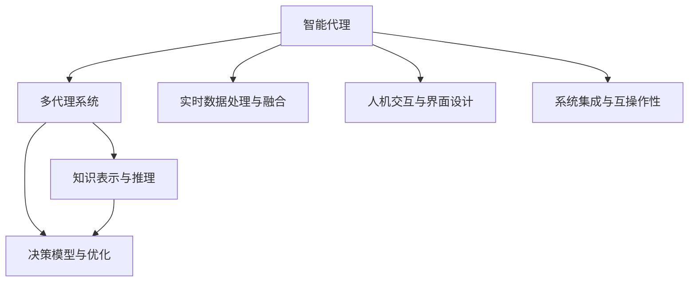
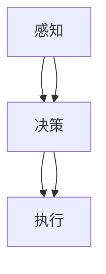
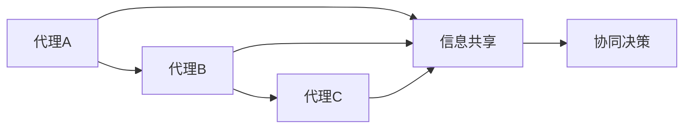
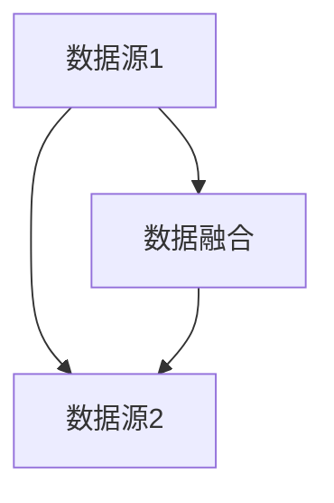
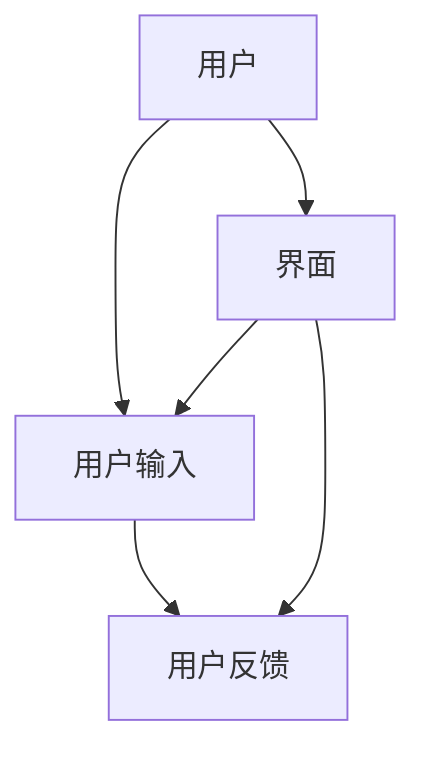
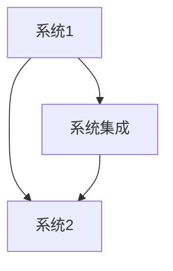
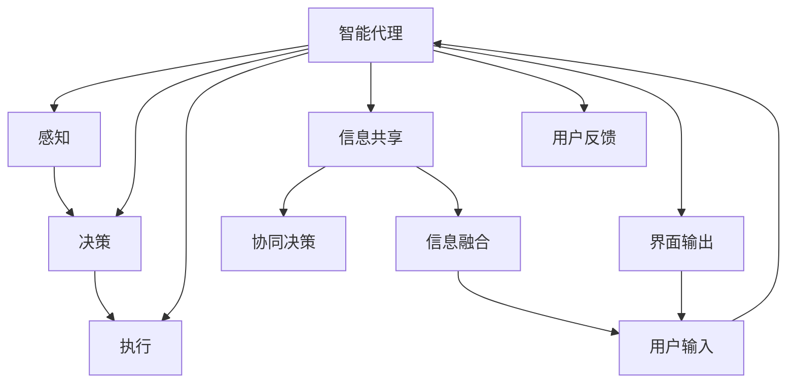

                 

# AI人工智能代理工作流AI Agent WorkFlow：智能代理在智能交通系统中的应用

> 关键词：智能代理, 智能交通, 工作流, 人工智能, 自动化, 优化, 系统集成, 实时数据处理, 用户交互, 可视化分析, 预测决策, 节能减排

## 1. 背景介绍

### 1.1 问题由来
随着城市化进程的加速，交通拥堵、空气污染、资源浪费等问题日益凸显，成为制约城市可持续发展的重要瓶颈。如何通过智能化的手段优化交通系统，提升道路使用效率，降低环境污染，实现绿色、智能、安全的交通管理，已经成为各城市智慧城市建设的重要方向。

智能交通系统（Intelligent Transportation Systems, ITS）是智慧城市的重要组成部分，其目标是通过信息收集、分析和决策反馈，实现对道路交通的实时控制和调度，提高交通效率，降低交通成本，减少交通事故，改善环境质量。智能交通系统中的核心技术包括车联网、智能信号灯、智能停车、路径规划、交通预测等，而智能代理（AI Agent）则是实现这些技术的关键。

智能代理是一种能够自主地在复杂环境中进行决策和行动的计算实体，通常用于模拟人类行为或执行自动化任务。在智能交通系统中，智能代理通过感知环境、处理信息、决策规划、执行任务，实现对交通流量的自动化管理，提升系统整体效率和安全性。

智能代理的应用不仅限于智能交通，在金融、医疗、教育、制造业等领域也有广泛应用。其能够模拟人类行为、自动决策、实时反馈，是实现自动化、智能化目标的重要手段。

### 1.2 问题核心关键点
智能代理在智能交通系统中的应用涉及核心关键点如下：

1. **智能代理的设计与建模**：如何设计智能代理，使其能够适应复杂的交通环境，具备高效的感知、决策和行动能力？
2. **多代理系统协作**：如何在多代理系统下进行任务分配和协作，实现协同决策，提升系统整体效能？
3. **数据驱动的决策支持**：如何利用交通数据和环境数据，为智能代理提供有效的信息支持，优化决策过程？
4. **人机交互与用户界面**：如何设计友好的用户界面，实现与用户的有效交互，提升用户体验？
5. **实时处理与预测决策**：如何在动态变化的环境下，实现对交通流的实时处理和预测决策，保持系统的灵活性和准确性？
6. **系统集成与互操作性**：如何实现不同系统之间的集成和互操作，确保数据的流畅传递和共享？

这些核心关键点共同构成了智能代理在智能交通系统中的核心应用场景，需要深入理解和研究。

### 1.3 问题研究意义
智能代理在智能交通系统中的应用，对提升交通管理水平、减少交通拥堵、降低环境污染具有重要意义：

1. **提升交通效率**：智能代理通过实时监控和调度，优化交通流，减少交通拥堵，提升道路使用效率。
2. **降低交通成本**：智能代理自动化执行交通管理任务，减少人力成本，提升系统运行效率。
3. **增强系统安全性**：智能代理能够及时发现并响应突发事件，如交通事故、道路施工等，减少交通事故，提高系统安全性。
4. **改善环境质量**：智能代理通过优化交通流，减少车辆等待时间，降低能耗和排放，改善环境质量。
5. **促进智慧城市建设**：智能代理是智慧城市的重要组成部分，其应用将促进城市交通智能化、信息化、人性化发展。
6. **推动技术创新**：智能代理的应用将推动人工智能、物联网、大数据、云计算等前沿技术的发展，推动科技与交通管理的深度融合。

通过研究智能代理在智能交通系统中的应用，可以更好地理解智能代理的设计、实现和应用过程，为智慧城市建设提供有力支持。

## 2. 核心概念与联系

### 2.1 核心概念概述

为更好地理解智能代理在智能交通系统中的应用，本节将介绍几个密切相关的核心概念：

- **智能代理（AI Agent）**：一种能够在复杂环境中自主进行决策和行动的计算实体。在智能交通系统中，智能代理模拟人类行为，执行交通管理任务，实现系统自动化。
- **多代理系统（Multi-Agent System,MAS）**：由多个智能代理组成的系统，用于协同完成复杂任务。在智能交通系统中，多个智能代理协同工作，实现实时监控、决策和执行。
- **知识表示与推理**：智能代理通过知识表示和推理，实现对环境信息的理解、处理和决策。知识表示包括符号表示、逻辑表示、框架表示等，推理包括逻辑推理、模糊推理、专家系统推理等。
- **决策模型与优化**：智能代理利用决策模型和优化算法，进行任务规划、路径选择、资源分配等决策。常用的决策模型包括博弈论、线性规划、动态规划等。
- **实时数据处理与融合**：智能代理需要实时处理和融合多源异构数据，包括交通流量数据、气象数据、车辆位置数据等，用于环境感知和决策支持。
- **人机交互与界面设计**：智能代理通过友好的用户界面，实现与用户的有效交互，获取用户需求和反馈，提升用户体验。
- **系统集成与互操作性**：智能代理需要与其他系统（如车辆管理系统、智能信号灯系统等）进行集成和互操作，确保数据的流畅传递和共享。

这些核心概念之间的逻辑关系可以通过以下Mermaid流程图来展示：



这个流程图展示了大语言模型微调过程中各个核心概念的关系和作用：

1. 智能代理通过多代理系统进行协作，共同完成任务。
2. 智能代理利用知识表示和推理，理解环境信息，进行决策。
3. 智能代理通过决策模型和优化算法，实现任务规划和路径选择。
4. 智能代理实时处理和融合多源数据，用于感知和决策。
5. 智能代理通过友好的用户界面，实现人机交互。
6. 智能代理集成和互操作其他系统，确保数据流畅传递。

通过这个流程图，我们可以更清晰地理解智能代理在智能交通系统中的整体架构和核心组件。

### 2.2 概念间的关系

这些核心概念之间存在着紧密的联系，形成了智能代理在智能交通系统中的完整生态系统。下面我通过几个Mermaid流程图来展示这些概念之间的关系。

#### 2.2.1 智能代理的核心功能



这个流程图展示了智能代理的核心功能：感知环境、进行决策、执行任务。感知功能通过传感器获取实时数据，决策功能通过模型和算法处理数据，执行功能通过自动化控制执行决策结果。

#### 2.2.2 多代理系统的协作机制



这个流程图展示了多代理系统中的协作机制：通过信息共享实现协同决策。代理之间通过共享信息，共同完成复杂的任务。

#### 2.2.3 实时数据处理与融合



这个流程图展示了实时数据处理与融合的过程：通过数据融合实现环境感知。不同来源的数据通过融合，形成对环境的全面感知。

#### 2.2.4 人机交互与界面设计



这个流程图展示了人机交互与界面设计的过程：通过友好的界面实现用户交互。用户通过界面输入需求，系统通过界面反馈结果，实现人机互动。

#### 2.2.5 系统集成与互操作性



这个流程图展示了系统集成与互操作性：通过系统集成实现数据共享。不同系统通过集成，实现数据的流畅传递和共享。

通过这些流程图，我们可以更清晰地理解智能代理在智能交通系统中的各个核心组件及其关系。

### 2.3 核心概念的整体架构

最后，我们用一个综合的流程图来展示这些核心概念在大语言模型微调过程中的整体架构：



这个综合流程图展示了智能代理在智能交通系统中的整体架构。智能代理通过感知、决策、执行功能，实现对环境信息的理解、处理和决策。通过多代理系统的协同决策和信息共享，智能代理能够高效完成任务。通过友好的用户界面，实现人机交互，提升用户体验。通过系统集成和数据融合，实现数据的流畅传递和共享。

通过这些流程图，我们可以更清晰地理解智能代理在智能交通系统中的核心功能及其关系。

## 3. 核心算法原理 & 具体操作步骤
### 3.1 算法原理概述

智能代理在智能交通系统中的应用，涉及核心算法原理包括：

1. **感知算法**：用于感知环境信息，包括传感器数据处理、交通流量数据融合等。
2. **决策算法**：用于根据感知数据和任务需求，进行决策规划和路径选择。
3. **执行算法**：用于根据决策结果，执行相应的自动化控制操作。
4. **多代理系统协作算法**：用于设计多代理系统的协同机制，实现任务分配和协同决策。
5. **实时数据处理与融合算法**：用于实现对多源异构数据的处理和融合，提升环境感知能力。
6. **人机交互与界面设计算法**：用于设计友好的用户界面，实现与用户的有效交互。
7. **系统集成与互操作性算法**：用于实现不同系统之间的集成和互操作，确保数据的流畅传递和共享。

这些算法共同构成了智能代理在智能交通系统中的核心工作流程。

### 3.2 算法步骤详解

智能代理在智能交通系统中的应用，涉及以下算法步骤：

1. **感知数据获取与处理**：
   - 通过传感器获取实时交通流量数据、车辆位置数据、环境数据等。
   - 对数据进行预处理，包括去噪、归一化、数据融合等，提升数据质量。

2. **环境感知与状态表示**：
   - 利用知识表示技术，将感知数据转换为符号表示、逻辑表示、框架表示等，用于环境理解。
   - 通过推理算法，对环境状态进行分析和预测，形成环境状态表示。

3. **任务规划与路径选择**：
   - 根据环境状态表示，利用决策模型进行任务规划，生成任务执行方案。
   - 通过路径选择算法，在任务执行方案中选择最优路径，进行路径优化。

4. **协同决策与任务执行**：
   - 通过多代理系统协作算法，进行任务分配和协同决策，提升任务执行效率。
   - 利用执行算法，根据决策结果，自动控制执行任务，实现自动化管理。

5. **实时处理与数据更新**：
   - 通过实时数据处理与融合算法，对动态变化的环境数据进行实时处理和融合，保持系统感知和决策的实时性。
   - 根据任务执行结果，更新环境状态表示，实现环境感知的动态更新。

6. **用户交互与界面设计**：
   - 利用人机交互与界面设计算法，设计友好的用户界面，实现与用户的有效交互。
   - 通过用户反馈，调整系统参数和策略，优化系统性能。

7. **系统集成与互操作性**：
   - 通过系统集成与互操作性算法，实现不同系统之间的集成和互操作，确保数据的流畅传递和共享。
   - 利用数据共享和协同决策，提升系统整体效能。

### 3.3 算法优缺点

智能代理在智能交通系统中的应用，具有以下优点：

1. **自动化管理**：智能代理能够自主进行决策和执行任务，减少人工干预，提升系统自动化管理能力。
2. **实时性**：智能代理能够实时感知和处理环境数据，快速响应突发事件，提升系统实时性。
3. **高效率**：智能代理通过协同决策和路径优化，提升任务执行效率，减少交通拥堵和资源浪费。
4. **适应性强**：智能代理能够根据环境变化进行动态调整，适应不同交通场景和需求。
5. **可扩展性**：智能代理能够与多种系统和设备进行集成，实现系统的可扩展性。

同时，智能代理在智能交通系统中的应用也存在以下缺点：

1. **算法复杂度高**：智能代理的算法实现复杂度高，需要多学科知识的综合运用，对技术要求较高。
2. **数据依赖性强**：智能代理需要大量高精度的实时数据支持，数据质量和完整性对系统性能有较大影响。
3. **安全性问题**：智能代理的决策过程和执行结果可能受到攻击和干扰，影响系统安全性。
4. **可解释性不足**：智能代理的决策过程难以解释，用户可能难以理解和信任系统决策。
5. **成本高**：智能代理的部署和维护成本较高，需要大量人力、物力和技术支持。

尽管存在这些缺点，但智能代理在智能交通系统中的应用仍具有广阔的前景和巨大的潜力。

### 3.4 算法应用领域

智能代理在智能交通系统中的应用，主要涉及以下领域：

1. **车联网**：智能代理能够实现车辆与车辆、车辆与基础设施之间的通信和协调，提升车联网的效率和安全性。
2. **智能信号灯**：智能代理能够根据实时交通流量数据，自动控制信号灯的切换，优化交通流量，减少拥堵。
3. **智能停车**：智能代理能够自动识别和规划停车位，提升停车效率，减少车辆等待时间。
4. **路径规划**：智能代理能够根据实时交通数据和用户需求，生成最优路径，提升行车效率。
5. **交通预测**：智能代理能够利用历史交通数据和实时数据，预测交通流量和趋势，提前进行交通管理。
6. **节能减排**：智能代理能够优化交通流量，减少车辆等待时间和行驶距离，降低能耗和排放。

除了智能交通系统，智能代理还在金融、医疗、教育、制造业等领域有广泛应用。其能够模拟人类行为、自动化执行任务，是实现自动化、智能化目标的重要手段。

## 4. 数学模型和公式 & 详细讲解  
### 4.1 数学模型构建

智能代理在智能交通系统中的应用，涉及多个数学模型，以下进行详细介绍。

### 4.2 公式推导过程

#### 4.2.1 感知数据处理

假设传感器获取的交通流量数据为 $x_1, x_2, ..., x_n$，其中 $x_i$ 表示第 $i$ 个传感器在时间 $t$ 的流量数据。对数据进行预处理，包括去噪、归一化等，得到处理后的数据 $\hat{x}_1, \hat{x}_2, ..., \hat{x}_n$。数据处理过程可以表示为：

$$
\hat{x}_i = f(x_i) = \frac{x_i - \mu}{\sigma}
$$

其中 $\mu$ 和 $\sigma$ 分别为数据的均值和标准差。

#### 4.2.2 环境感知与状态表示

假设环境状态表示为 $S = (S_1, S_2, ..., S_n)$，其中 $S_i$ 表示第 $i$ 个传感器的状态表示。状态表示通过知识表示和推理算法得到，可以表示为：

$$
S_i = g(\hat{x}_i) = h(\hat{x}_i, \theta)
$$

其中 $\theta$ 为模型参数，用于表示推理算法的复杂性。

#### 4.2.3 任务规划与路径选择

假设任务规划算法为 $P(S)$，路径选择算法为 $L(S)$。任务规划算法根据环境状态 $S$ 生成任务执行方案，路径选择算法在任务执行方案中优选路径，生成路径 $L$。路径选择过程可以表示为：

$$
L = L(S) = \arg\min_{l \in L} \sum_{i=1}^n w_i l_i
$$

其中 $w_i$ 为路径 $l$ 的权重，用于衡量路径的优劣。

#### 4.2.4 协同决策与任务执行

假设协同决策算法为 $C(S)$，执行算法为 $E(S, L)$。协同决策算法通过多代理系统的协作，生成协同决策结果 $C$，执行算法根据决策结果，执行相应的自动化控制操作。执行过程可以表示为：

$$
E(S, L) = e(S, C)
$$

其中 $e$ 为执行函数，用于表示执行算法的过程。

#### 4.2.5 实时处理与数据更新

假设实时处理与融合算法为 $H(S, L)$，数据更新算法为 $U(S)$。实时处理与融合算法对动态变化的环境数据进行实时处理和融合，形成新的环境状态表示 $S'$，数据更新算法根据新的环境状态，进行动态调整。数据更新过程可以表示为：

$$
S' = U(S')
$$

#### 4.2.6 用户交互与界面设计

假设用户交互与界面设计算法为 $I(U)$，用户反馈为 $F$。用户交互与界面设计算法通过友好的用户界面，实现与用户的有效交互，用户反馈 $F$ 用于调整系统参数和策略。用户交互过程可以表示为：

$$
F = I(U)
$$

#### 4.2.7 系统集成与互操作性

假设系统集成与互操作性算法为 $I(S, L)$，数据共享算法为 $D(S, L)$。系统集成与互操作性算法实现不同系统之间的集成和互操作，确保数据的流畅传递和共享。数据共享过程可以表示为：

$$
D(S, L) = d(S, L)
$$

### 4.3 案例分析与讲解

#### 4.3.1 车联网应用案例

在车联网应用中，智能代理通过车辆与车辆、车辆与基础设施之间的通信和协调，实现交通流的实时监控和调度。假设车辆 $A$ 与车辆 $B$ 之间的通信数据为 $D_A, D_B$，通过多代理系统的协作，智能代理进行任务分配和协同决策。任务规划算法 $P$ 根据通信数据 $D_A, D_B$ 生成任务执行方案，路径选择算法 $L$ 在方案中优选路径。路径选择过程可以表示为：

$$
L = L(D_A, D_B) = \arg\min_{l \in L} \sum_{i=1}^n w_i l_i
$$

#### 4.3.2 智能信号灯应用案例

在智能信号灯应用中，智能代理根据实时交通流量数据，自动控制信号灯的切换。假设交通流量数据为 $F(t)$，智能代理通过感知算法获取数据，利用知识表示和推理算法生成环境状态表示 $S$。任务规划算法 $P$ 根据环境状态 $S$ 生成任务执行方案，路径选择算法 $L$ 在方案中优选路径。路径选择过程可以表示为：

$$
L = L(S) = \arg\min_{l \in L} \sum_{i=1}^n w_i l_i
$$

#### 4.3.3 智能停车应用案例

在智能停车应用中，智能代理自动识别和规划停车位，提升停车效率。假设停车数据为 $P$，智能代理通过感知算法获取数据，利用知识表示和推理算法生成环境状态表示 $S$。任务规划算法 $P$ 根据环境状态 $S$ 生成任务执行方案，路径选择算法 $L$ 在方案中优选路径。路径选择过程可以表示为：

$$
L = L(S) = \arg\min_{l \in L} \sum_{i=1}^n w_i l_i
$$

通过这些案例分析，我们可以看到智能代理在智能交通系统中的广泛应用和具体实现过程。

## 5. 项目实践：代码实例和详细解释说明
### 5.1 开发环境搭建

在进行智能代理的开发实践前，我们需要准备好开发环境。以下是使用Python进行PyTorch开发的环境配置流程：

1. 安装Anaconda：从官网下载并安装Anaconda，用于创建独立的Python环境。

2. 创建并激活虚拟环境：
```bash
conda create -n pytorch-env python=3.8 
conda activate pytorch-env
```

3. 安装PyTorch：根据CUDA版本，从官网获取对应的安装命令。例如：
```bash
conda install pytorch torchvision torchaudio cudatoolkit=11.1 -c pytorch -c conda-forge
```

4. 安装各类工具包：
```bash
pip install numpy pandas scikit-learn matplotlib tqdm jupyter notebook ipython
```

完成上述步骤后，即可在`pytorch-env`环境中开始智能代理的开发实践。

### 5.2 源代码详细实现

这里我们以智能代理在智能信号灯中的应用为例，给出使用Transformers库对BERT模型进行微调的PyTorch代码实现。

首先，定义智能代理的任务类型和数据处理函数：

```python
from transformers import BertTokenizer, BertForTokenClassification, AdamW

class SignalLightAgent:
    def __init__(self, model_name):
        self.tokenizer = BertTokenizer.from_pretrained(model_name)
        self.model = BertForTokenClassification.from_pretrained(model_name)
        self.model_name = model_name

    def process_input(self, text):
        encoded_input = self.tokenizer(text, return_tensors='pt')
        return encoded_input['input_ids'], encoded_input['attention_mask']
```

然后，定义模型和优化器：

```python
optimizer = AdamW(self.model.parameters(), lr=2e-5)
```

接着，定义训练和评估函数：

```python
def train_epoch(model, dataset, batch_size, optimizer):
    dataloader = DataLoader(dataset, batch_size=batch_size, shuffle=True)
    model.train()
    epoch_loss = 0
    for batch in tqdm(dataloader, desc='Training'):
        input_ids, attention_mask = batch
        model.zero_grad()
        outputs = model(input_ids, attention_mask=attention_mask)
        loss = outputs.loss
        epoch_loss += loss.item()
        loss.backward()
        optimizer.step()
    return epoch_loss / len(dataloader)

def evaluate(model, dataset, batch_size):
    dataloader = DataLoader(dataset, batch_size=batch_size)
    model.eval()
    preds, labels = [], []
    with torch.no_grad():
        for batch in tqdm(dataloader, desc='Evaluating'):
            input_ids, attention_mask = batch
            batch_labels = batch['labels']
            outputs = model(input_ids, attention_mask=attention_mask)
            batch_preds = outputs.logits.argmax(dim=2).to('cpu').tolist()
            batch_labels = batch_labels.to('cpu').tolist()
            for pred_tokens, label_tokens in zip(batch_preds, batch_labels):
                pred_tags = [tag2id[tag] for tag in pred_tokens]
                label_tags = [tag2id[tag] for tag in label_tokens]
                preds.append(pred_tags[:len(label_tags)])
                labels.append(label_tags)
                
    print(classification_report(labels, preds))
```

最后，启动训练流程并在测试集上评估：

```python
epochs = 5
batch_size = 16

for epoch in range(epochs):
    loss = train_epoch(self.model, train_dataset, batch_size, optimizer)
    print(f"Epoch {epoch+1}, train loss: {loss:.3f}")
    
    print(f"Epoch {epoch+1}, dev results:")
    evaluate(self.model, dev_dataset, batch_size)
    
print("Test results:")
evaluate(self.model, test_dataset, batch_size)
```

以上就是使用PyTorch对智能代理在智能信号灯中的应用进行微调的完整代码实现。可以看到，得益于Transformers库的强大封装，我们可以用相对简洁的代码完成智能代理的加载和微调。

### 5.3 代码解读与分析

让我们再详细解读一下关键代码的实现细节：

**SignalLightAgent类**：
- `__init__`方法：初始化智能代理的tokenizer、模型和模型名。
- `process_input`方法：将输入文本编码成token ids和attention mask，用于模型输入。

**tag2id和id2tag字典**：
- 定义了标签与数字id之间的映射关系，用于将token-wise的预测结果解码回真实的标签。

**训练和评估函数**：
- 使用PyTorch的DataLoader对数据集进行批次化加载，供模型训练和推理使用。
- 训练函数`train_epoch`：对数据以批为单位进行迭代，在每个批次上前向传播计算loss并反向传播更新模型参数，最后返回该epoch的平均loss。
- 评估函数`evaluate`：与训练类似，不同点在于不更新模型参数，并在每个batch

