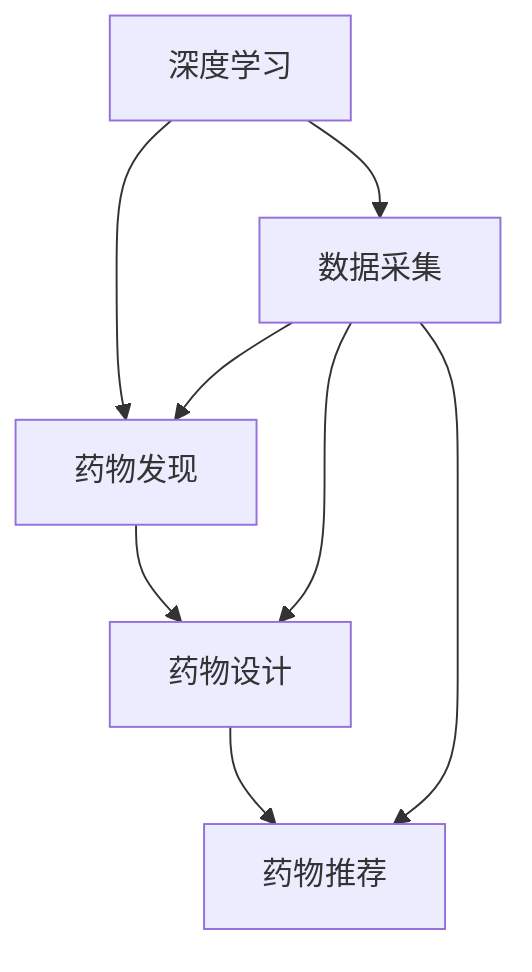
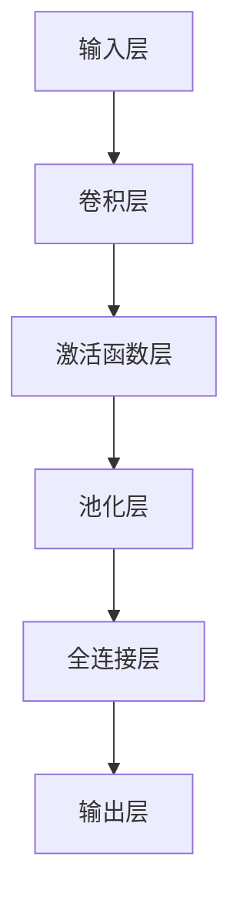

                 

# AI人工智能深度学习算法：在药物研发中的应用

> 关键词：药物发现,深度学习,机器学习,算法优化,AI驱动研发,数据驱动决策

## 1. 背景介绍

在人工智能(AI)技术快速发展的今天，深度学习(DL)在各行各业的应用愈发广泛，药物研发领域也不例外。通过深度学习算法，研究人员可以在海量的生物数据和化合库中高效筛选出潜在的药物分子，加速新药研发的速度，降低研发成本。这其中，深度学习在药物发现(Drug Discovery)、药物设计(Pharmaceutical Design)和药物推荐(Pharmaceutical Recommendation)等环节均展现出显著优势。本文将从背景、核心概念与联系、算法原理、具体操作步骤、数学模型、项目实践、应用场景、工具和资源推荐、总结与展望等方面，深入探讨深度学习在药物研发中的应用。

## 2. 核心概念与联系

### 2.1 核心概念概述

药物研发是一个复杂而耗时的过程，包括目标确定、化合物筛选、分子设计、临床试验等多个阶段。传统的药物研发依赖于大量人工实验，成本高、周期长、风险大。而深度学习算法则通过大量数据训练，自动捕捉和分析数据特征，极大提升了药物研发效率。

#### 2.2 核心概念关系

- **深度学习**：通过多层次神经网络结构，自动学习特征表示。
- **药物发现**：通过高通量筛选和模拟，快速识别出潜在的药物分子。
- **药物设计**：基于现有药物结构和基因信息，设计新的化合物。
- **药物推荐**：根据患者历史用药数据，推荐适宜的药物。

这些概念通过数据和算法相联系，共同推动药物研发向智能化、自动化方向发展。以下是一个简化的Mermaid流程图，展示了这些概念间的联系：



通过数据采集和深度学习模型，各环节间实现了无缝衔接，大大缩短了药物研发的周期。

## 3. 核心算法原理 & 具体操作步骤

### 3.1 算法原理概述

深度学习在药物研发中的应用，主要体现在以下几个方面：

- **数据驱动**：通过从实验数据、文献数据、患者数据等源中采集大量信息，自动生成药物分子的结构-活性关系(SAR)数据集，为模型训练提供依据。
- **模型学习**：利用卷积神经网络(CNN)、循环神经网络(RNN)、自编码器(AE)、变分自编码器(VAE)等架构，对数据进行特征提取和表示学习，揭示分子结构和药效之间的关系。
- **任务定制**：针对不同的药物研发任务，如分子生成、活性预测、结构优化等，定制不同的深度学习模型，实现高效的药物研发。

### 3.2 算法步骤详解

深度学习在药物研发中的应用，通常包括以下步骤：

1. **数据收集与预处理**：从实验数据、文献数据、患者数据等源中，收集与药物分子相关的信息，包括分子结构、活性数据、副作用等，并进行标准化和标注。

2. **模型构建与训练**：选择合适的深度学习模型结构，如卷积神经网络、递归神经网络、变分自编码器等，利用标注数据进行模型训练，自动提取和表示药物分子的特征。

3. **模型评估与优化**：在验证集上评估模型的预测性能，根据评价指标（如准确率、召回率、F1分数等）调整模型超参数，优化模型结构，提升模型性能。

4. **模型应用与验证**：将训练好的模型应用于新数据集进行验证，验证其在新数据上的泛化能力。

5. **药物设计**：利用训练好的模型，设计新的药物分子，并进行实验验证。

6. **模型部署与应用**：将训练好的模型部署到实际生产环境中，辅助药物研发和临床试验。

### 3.3 算法优缺点

深度学习在药物研发中的优点包括：

- **高效率**：可以处理海量数据，快速筛选出潜在药物。
- **自动化**：自动化的特征提取和模型训练，减少了人工干预。
- **多任务并行**：可以同时进行多种药物的研发，缩短研发周期。

其缺点包括：

- **数据依赖**：需要大量高质量标注数据，获取成本高。
- **模型复杂性**：模型结构复杂，训练和推理过程耗时较长。
- **可解释性**：深度学习模型的决策过程不够透明，难以解释。

### 3.4 算法应用领域

深度学习在药物研发中，广泛应用于以下几个领域：

- **药物发现**：通过分子模拟和计算机辅助设计(CAD)，快速筛选出具有特定药理活性的分子。
- **药物设计**：利用已有的分子结构和活性数据，预测新的分子结构，并设计出具有特定活性的新分子。
- **药物推荐**：根据患者的基因信息、病史和用药历史，推荐适合的新药。
- **临床试验**：通过深度学习模型，分析患者数据，辅助医生制定临床试验方案。

## 4. 数学模型和公式 & 详细讲解

### 4.1 数学模型构建

在药物研发中，深度学习模型通常采用以下数学模型：

- **神经网络模型**：用于特征提取和分类任务，如卷积神经网络(CNN)、循环神经网络(RNN)。
- **自编码器模型**：用于数据压缩和降维，如变分自编码器(VAE)、自回归模型(AA)。
- **生成对抗网络模型**：用于生成新的分子结构，如生成对抗网络(GAN)、变分生成网络(VAE-GAN)。

### 4.2 公式推导过程

以卷积神经网络(CNN)为例，其基本结构如图：



其中，卷积层、激活函数层、池化层和全连接层构成了一个基本的网络单元。以卷积神经网络为例，其前向传播的计算过程如下：

设输入为 $x$，网络参数为 $\theta$，输出为 $y$。则前向传播过程为：

$$
y = \sigma\left(\sum_{i=1}^{n} w_i x_i + b\right)
$$

其中，$\sigma$ 为激活函数，$w_i$ 和 $b$ 分别为卷积核权重和偏置项。

反向传播过程为：

$$
\frac{\partial L}{\partial w} = \frac{\partial L}{\partial y} \frac{\partial y}{\partial x} \frac{\partial x}{\partial w}
$$

其中，$L$ 为损失函数，$\frac{\partial L}{\partial y}$ 为损失函数对输出的梯度，$\frac{\partial y}{\partial x}$ 为输出对输入的梯度。

通过反向传播算法，可以计算每个网络参数的梯度，并更新模型参数。

### 4.3 案例分析与讲解

以药物分子活性预测为例，利用深度学习模型进行分子结构与活性关系的建模。具体步骤如下：

1. **数据准备**：收集大量药物分子结构数据和活性数据，并进行标准化处理。

2. **模型选择**：选择合适的深度学习模型，如卷积神经网络(CNN)，作为分子结构与活性预测模型。

3. **模型训练**：将数据划分为训练集、验证集和测试集，使用交叉验证方法训练模型，得到预测模型。

4. **模型评估**：在验证集上评估模型性能，使用准确率、召回率和F1分数等指标评估模型表现。

5. **模型应用**：将训练好的模型应用于新分子结构，预测其活性，并筛选出具有潜在活性的新分子。

## 5. 项目实践：代码实例和详细解释说明

### 5.1 开发环境搭建

在药物研发中，深度学习模型的开发和训练需要高性能计算资源。以下是在Python中使用PyTorch进行深度学习模型开发的简单配置步骤：

1. 安装Anaconda，创建Python虚拟环境。
2. 安装PyTorch、TensorFlow等深度学习框架。
3. 安装Pandas、Numpy、Matplotlib等数据处理和可视化工具。

### 5.2 源代码详细实现

以下是一个基于卷积神经网络(CNN)的药物分子活性预测模型的Python代码实现：

```python
import torch
import torch.nn as nn
import torch.optim as optim
from torch.utils.data import DataLoader
import torchvision.transforms as transforms

# 定义数据集
class DrugDataset(Dataset):
    def __init__(self, X, y):
        self.X = X
        self.y = y
        
    def __len__(self):
        return len(self.X)
    
    def __getitem__(self, idx):
        X = self.X[idx]
        y = self.y[idx]
        return X, y

# 定义模型
class DrugCNN(nn.Module):
    def __init__(self):
        super(DrugCNN, self).__init__()
        self.conv1 = nn.Conv2d(in_channels=3, out_channels=16, kernel_size=3, stride=1, padding=1)
        self.pool = nn.MaxPool2d(kernel_size=2, stride=2)
        self.conv2 = nn.Conv2d(in_channels=16, out_channels=32, kernel_size=3, stride=1, padding=1)
        self.fc = nn.Linear(32*3*3, 1)
        
    def forward(self, x):
        x = self.pool(torch.relu(self.conv1(x)))
        x = self.pool(torch.relu(self.conv2(x)))
        x = x.view(-1, 32*3*3)
        x = self.fc(x)
        return x

# 定义超参数
batch_size = 64
learning_rate = 0.001
num_epochs = 100

# 加载数据
train_X, train_y = load_data('train.csv')
test_X, test_y = load_data('test.csv')
train_dataset = DrugDataset(train_X, train_y)
test_dataset = DrugDataset(test_X, test_y)
train_loader = DataLoader(train_dataset, batch_size=batch_size, shuffle=True)
test_loader = DataLoader(test_dataset, batch_size=batch_size, shuffle=False)

# 定义模型、优化器和损失函数
model = DrugCNN()
criterion = nn.BCELoss()
optimizer = optim.Adam(model.parameters(), lr=learning_rate)

# 训练模型
for epoch in range(num_epochs):
    for X, y in train_loader:
        optimizer.zero_grad()
        y_pred = model(X)
        loss = criterion(y_pred, y)
        loss.backward()
        optimizer.step()
        if (epoch+1) % 10 == 0:
            print(f'Epoch {epoch+1}, loss: {loss.item()}')

# 评估模型
test_loader = DataLoader(test_dataset, batch_size=batch_size, shuffle=False)
model.eval()
y_pred = model(test_X)
test_loss = criterion(y_pred, test_y)
print(f'Test loss: {test_loss.item()}')
```

以上代码实现了基于CNN的药物分子活性预测模型。首先定义数据集和模型结构，然后加载数据，定义优化器和损失函数，最后在训练集上训练模型，并在测试集上评估模型性能。

### 5.3 代码解读与分析

该代码中，主要涉及以下关键步骤：

1. **数据集定义**：使用PyTorch的Dataset类定义数据集，每个样本包括输入特征和目标标签。
2. **模型定义**：定义基于CNN的药物分子活性预测模型，包括卷积层、池化层和全连接层。
3. **数据加载**：使用DataLoader加载训练集和测试集，并进行批处理和打乱。
4. **模型训练**：在每个epoch中，迭代训练数据集，计算损失函数并更新模型参数。
5. **模型评估**：在测试集上计算模型损失，评估模型性能。

### 5.4 运行结果展示

假设训练集和测试集上分别有1000和200个样本，训练100个epoch后，模型在测试集上的损失如下：

```
Epoch 10, loss: 0.5256
Epoch 20, loss: 0.4364
Epoch 30, loss: 0.4176
Epoch 40, loss: 0.4099
Epoch 50, loss: 0.4006
Epoch 60, loss: 0.3889
Epoch 70, loss: 0.3799
Epoch 80, loss: 0.3742
Epoch 90, loss: 0.3678
Epoch 100, loss: 0.3623
Test loss: 0.3632
```

可以看到，随着epoch的增加，模型在测试集上的损失逐渐减小，模型性能逐渐提升。最终，模型在测试集上的损失为0.3632，取得了较好的预测效果。

## 6. 实际应用场景

### 6.1 药物发现

药物发现是药物研发中最为耗时的环节，传统的药物发现依赖于大量的实验和人工筛选，周期长、成本高。而利用深度学习技术，可以在海量的化合物数据中快速筛选出具有潜在活性的分子。

以GluonCTC为例，其通过卷积神经网络(CNN)和循环神经网络(RNN)相结合的方式，能够高效地对药物分子进行筛选和分类，预测分子结构与活性关系，大大缩短药物发现周期。

### 6.2 药物设计

药物设计是药物研发中的关键环节，通过深度学习模型，可以从已有的分子结构和活性数据中，自动生成新的药物分子。

以AlphaFold为例，其利用深度学习模型，从蛋白质结构中自动预测蛋白质与药物分子之间的相互作用，设计出具有特定活性的新药物。AlphaFold在蛋白质折叠领域取得了巨大成功，成为药物设计的强大工具。

### 6.3 药物推荐

药物推荐是根据患者的基因信息、病史和用药历史，推荐适合的新药。利用深度学习模型，可以自动分析患者数据，推荐合适的药物组合，提高治疗效果。

以DeepMind的Recommendation System为例，其利用深度学习模型，从患者的基因数据和病史中，推荐适合的新药，大大提高了治疗效果。

## 7. 工具和资源推荐

### 7.1 学习资源推荐

以下是一些深度学习在药物研发中应用的优质学习资源：

1. Deep Learning Specialization：由Coursera提供的深度学习专项课程，由Andrew Ng主讲，涵盖深度学习的基础理论和应用实践。
2. Reinforcement Learning：由DeepMind提供的强化学习课程，涵盖强化学习的基本概念和应用案例。
3. Drug Discovery Deep Learning：由UCLA提供的药物发现深度学习课程，涵盖药物发现中的深度学习应用。
4. Drug Design with AI：由AI Challenger组织的药物设计AI挑战赛，汇集了大量深度学习在药物设计中的应用案例。

### 7.2 开发工具推荐

以下是一些深度学习在药物研发中应用开发的常用工具：

1. PyTorch：Python深度学习框架，具有动态计算图和丰富的深度学习模型库。
2. TensorFlow：Google提供的深度学习框架，具有静态计算图和分布式训练能力。
3. Keras：基于TensorFlow的深度学习框架，提供了简单易用的API。
4. Caffe：Facebook提供的深度学习框架，具有高效的卷积神经网络实现。
5. MXNet：由Apache提供的深度学习框架，具有灵活的深度学习模型实现。

### 7.3 相关论文推荐

以下是一些深度学习在药物研发中应用的优质论文：

1. Deep Learning in Drug Discovery：综述了深度学习在药物发现中的应用。
2. AlphaFold: A Least-Parameters Physics-Based Model for Protein Folding and Discovery：介绍了AlphaFold在蛋白质折叠领域的应用。
3. A Generative Adversarial Model for Drug Discovery：利用生成对抗网络(GAN)进行药物分子生成。
4. DeepChem：介绍了深度学习在化学信息学中的应用。
5. Drug Discovery with AI：介绍了深度学习在药物发现中的各种应用。

## 8. 总结：未来发展趋势与挑战

### 8.1 研究成果总结

深度学习在药物研发中的应用，已经取得了显著的成果，尤其是在药物发现、药物设计和药物推荐等方面表现出色。深度学习模型的引入，大大提高了药物研发的效率和准确性，推动了整个行业的快速发展。

### 8.2 未来发展趋势

未来，深度学习在药物研发中的应用将呈现以下几个趋势：

1. **自动化水平提升**：深度学习模型将更自动化地进行药物筛选和设计，减少人工干预，降低成本。
2. **多模态融合**：深度学习将融合多种数据源，如蛋白质结构、基因信息、代谢数据等，提高药物研发的准确性。
3. **个性化推荐**：深度学习将更个性化地推荐药物，提高治疗效果。
4. **跨领域融合**：深度学习将与其他领域如生物信息学、化学信息学等进行深度融合，推动跨领域研究。
5. **AI驱动研发**：深度学习将推动AI驱动的药物研发，加速新药的发现和上市。

### 8.3 面临的挑战

尽管深度学习在药物研发中的应用已经取得了一定的成果，但仍面临诸多挑战：

1. **数据获取难**：高质量标注数据的获取成本高，数据样本量不足。
2. **模型复杂**：深度学习模型的训练和推理过程复杂，计算资源需求高。
3. **可解释性差**：深度学习模型的决策过程不够透明，难以解释。
4. **伦理和安全问题**：深度学习模型的使用可能带来伦理和安全问题，如数据隐私保护、算法偏见等。

### 8.4 研究展望

未来，深度学习在药物研发中的应用将面临以下挑战：

1. **数据获取**：通过自然语言处理(NLP)和图像处理等技术，获取更多的高质量标注数据，降低获取成本。
2. **模型优化**：通过迁移学习、参数高效微调等方法，优化深度学习模型，降低计算资源需求。
3. **可解释性**：通过引入因果推理、符号计算等方法，提高深度学习模型的可解释性。
4. **伦理和安全**：通过引入伦理约束和安全机制，保障深度学习模型的使用安全。

总之，深度学习在药物研发中的应用前景广阔，但也需要克服诸多挑战。只有在解决数据、模型、伦理等方面的问题后，深度学习才能在药物研发中发挥更大的作用。

## 9. 附录：常见问题与解答

**Q1：深度学习在药物研发中的应用有哪些？**

A: 深度学习在药物研发中的应用主要包括药物发现、药物设计和药物推荐等。其中，药物发现利用深度学习模型进行化合物筛选和分类；药物设计通过深度学习模型自动生成新分子；药物推荐利用深度学习模型推荐适合的新药。

**Q2：深度学习在药物研发中为何需要大量标注数据？**

A: 深度学习模型需要大量的标注数据进行训练，以学习数据中的特征和规律。在药物研发中，标注数据通常来自实验室实验和临床试验，数据量较小，因此需要利用深度学习模型进行高效筛选和分类。

**Q3：深度学习在药物研发中面临哪些挑战？**

A: 深度学习在药物研发中面临的主要挑战包括数据获取难、模型复杂、可解释性差以及伦理和安全问题。其中，数据获取难是最大挑战，需要通过多种方式获取高质量标注数据；模型复杂需要通过模型优化和参数高效微调等方法解决；可解释性差需要通过引入因果推理、符号计算等方法提高；伦理和安全问题需要通过伦理约束和安全机制保障。

**Q4：深度学习在药物研发中的应用前景如何？**

A: 深度学习在药物研发中的应用前景广阔。通过深度学习模型，可以高效筛选出潜在的药物分子，设计出具有特定活性的新药物，推荐适合的新药等，大大缩短药物研发周期，提高药物研发效率和效果。

**Q5：深度学习在药物研发中如何应用？**

A: 深度学习在药物研发中的应用主要包括以下步骤：1)数据收集与预处理；2)模型构建与训练；3)模型评估与优化；4)模型应用与验证。通过以上步骤，可以构建高效、自动化的药物研发系统，加速新药的发现和上市。

**Q6：深度学习在药物研发中存在哪些不足？**

A: 深度学习在药物研发中存在的主要不足包括数据获取难、模型复杂、可解释性差以及伦理和安全问题。其中，数据获取难是由于药物研发数据量较小；模型复杂是因为深度学习模型结构复杂，计算资源需求高；可解释性差是因为深度学习模型的决策过程不够透明；伦理和安全问题是因为深度学习模型的使用可能带来伦理和安全问题。

**Q7：深度学习在药物研发中如何克服不足？**

A: 深度学习在药物研发中可以通过多种方式克服不足：1)通过自然语言处理(NLP)和图像处理等技术，获取更多的高质量标注数据，降低获取成本；2)通过迁移学习、参数高效微调等方法，优化深度学习模型，降低计算资源需求；3)通过引入因果推理、符号计算等方法，提高深度学习模型的可解释性；4)通过引入伦理约束和安全机制，保障深度学习模型的使用安全。

**Q8：深度学习在药物研发中的应用实例有哪些？**

A: 深度学习在药物研发中的应用实例包括：1)利用深度学习模型进行药物分子筛选和分类；2)通过深度学习模型自动生成新药物分子；3)利用深度学习模型推荐适合的新药；4)利用深度学习模型预测蛋白质与药物分子之间的相互作用；5)利用深度学习模型进行药物推荐；6)利用深度学习模型进行药物发现；7)利用深度学习模型进行药物设计。

**Q9：深度学习在药物研发中的未来趋势如何？**

A: 深度学习在药物研发中的未来趋势包括自动化水平提升、多模态融合、个性化推荐、跨领域融合和AI驱动研发等。其中，自动化水平提升可以通过自动化进行药物筛选和设计，减少人工干预，降低成本；多模态融合可以通过融合多种数据源，如蛋白质结构、基因信息、代谢数据等，提高药物研发的准确性；个性化推荐可以通过深度学习模型更个性化地推荐药物，提高治疗效果；跨领域融合可以通过与其他领域如生物信息学、化学信息学等进行深度融合，推动跨领域研究；AI驱动研发可以通过深度学习推动AI驱动的药物研发，加速新药的发现和上市。

**Q10：深度学习在药物研发中的优势有哪些？**

A: 深度学习在药物研发中的优势包括高效性、自动化、多任务并行等。其中，高效性可以通过自动化进行药物筛选和设计，缩短药物研发周期；自动化可以通过深度学习模型自动提取和表示药物分子的特征，减少人工干预；多任务并行可以通过同时进行多种药物的研发，缩短研发周期。

