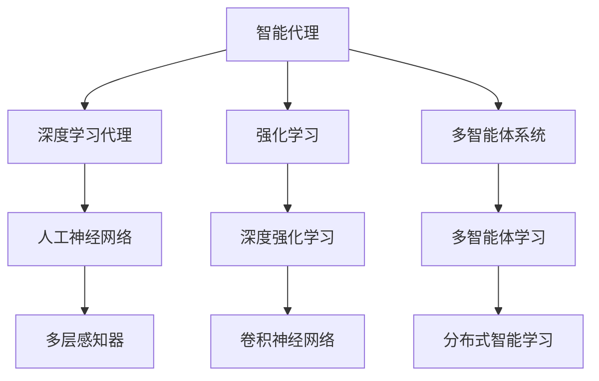
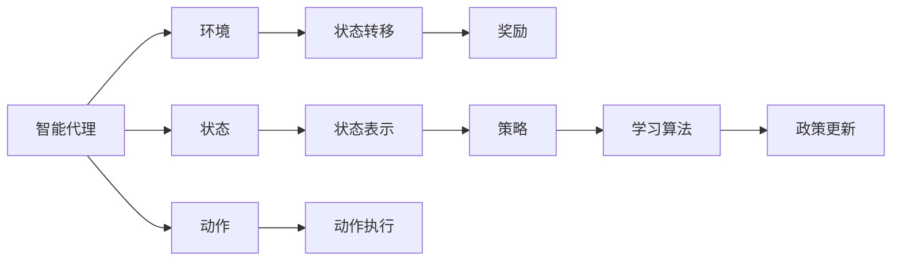
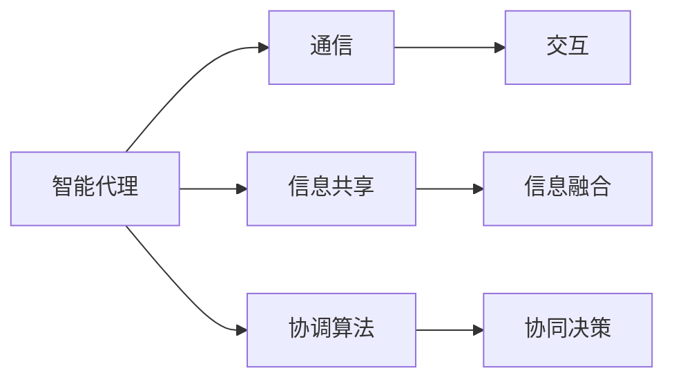
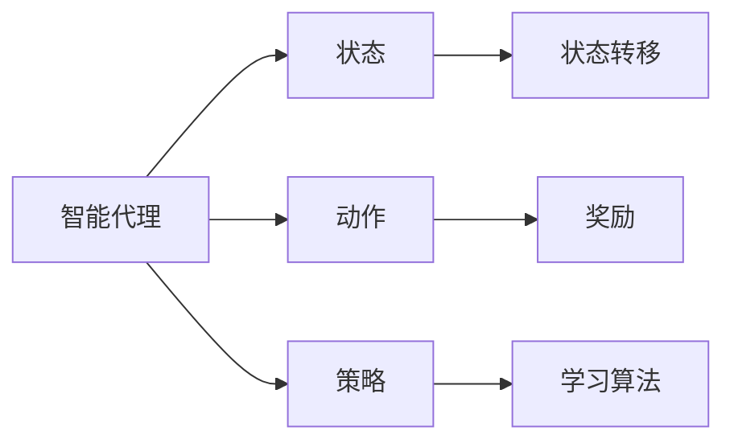
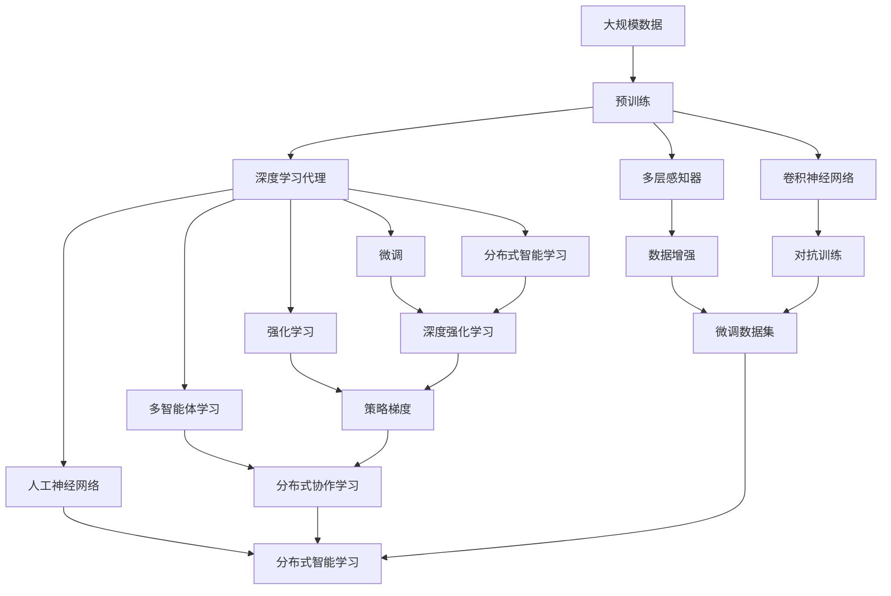

                 

# AI人工智能深度学习算法：智能深度学习代理的学习与适应的算法框架

> 关键词：深度学习代理,智能代理,学习与适应,算法框架,强化学习,人工神经网络,多智能体系统

## 1. 背景介绍

### 1.1 问题由来
人工智能领域的研究已从符号逻辑、规则驱动的专家系统，发展到深度学习、强化学习等数据驱动的方法。深度学习在图像识别、语音处理、自然语言处理等领域取得了显著成果，但其模型的训练依赖大量标注数据，难以适应动态环境。

近年来，智能代理（Intelligent Agent）的研究备受关注，其核心思想是让机器具备学习、适应环境的能力。这种基于学习与适应的智能代理系统，能够更灵活地响应环境变化，满足实际应用的需求。

### 1.2 问题核心关键点
智能深度学习代理（Deep Learning Agent）的学习与适应方法，已成为人工智能研究的热点之一。其关键在于：
- 选择合适的学习算法。常用的包括强化学习（Reinforcement Learning, RL）、深度强化学习（Deep Reinforcement Learning, DRL）等。
- 设计合理的模型架构。常用的包括多智能体系统（Multi-Agent System, MAS）、神经网络等。
- 应用智能代理的算法框架。常用的包括Q-Learning、策略梯度（Policy Gradient）等。
- 将智能代理应用于实际问题。如机器人导航、股票交易、网络安全等。

### 1.3 问题研究意义
智能深度学习代理的学习与适应方法，对于推动人工智能技术落地应用具有重要意义：

1. 降低应用开发成本。智能代理能够根据任务需求自适应地学习，减少从头开发所需的时间和人力。
2. 提升模型性能。智能代理通过在实际环境中不断学习，能够更好地适应任务需求，取得优异的效果。
3. 加速开发进度。智能代理能够快速响应任务变化，缩短开发周期，提高应用迭代速度。
4. 带来技术创新。智能代理的研究推动了深度学习、强化学习等前沿技术的进展，催生了新的研究方向。
5. 赋能产业升级。智能代理为各行各业提供了高效、灵活的智能解决方案，加速了数字化转型。

## 2. 核心概念与联系

### 2.1 核心概念概述

为更好地理解智能深度学习代理的学习与适应方法，本节将介绍几个密切相关的核心概念：

- 智能代理（Intelligent Agent）：具备学习、推理、适应环境能力的机器系统。常见的智能代理包括游戏AI、机器人、金融交易系统等。
- 深度学习代理（Deep Learning Agent）：基于深度神经网络的智能代理。通过大规模数据训练，具备强大的数据处理能力。
- 强化学习（Reinforcement Learning, RL）：智能代理通过与环境互动，根据奖惩机制不断优化策略的一种学习方法。
- 深度强化学习（Deep Reinforcement Learning, DRL）：结合深度神经网络和强化学习，提升智能代理在复杂环境中的学习效率和效果。
- 多智能体系统（Multi-Agent System, MAS）：由多个智能代理组成的系统，能够协同完成任务，提升整体效率和鲁棒性。
- 人工神经网络（Artificial Neural Network, ANN）：一种仿生计算模型，通过大量数据训练，能够模拟人类神经系统处理信息的能力。
- 多智能体学习（Multi-Agent Learning）：多个智能代理通过互动学习，提升整体决策能力的一种方法。

这些核心概念之间的逻辑关系可以通过以下Mermaid流程图来展示：



这个流程图展示了这个核心概念之间的逻辑关系：

1. 智能代理是学习与适应的核心主体。
2. 深度学习代理是智能代理的一种形式。
3. 强化学习是智能代理学习的基本方法。
4. 多智能体系统是智能代理的协作形式。
5. 人工神经网络是深度学习代理的底层模型。
6. 深度强化学习结合了深度神经网络和强化学习。
7. 多智能体学习是多智能体系统的一种高级学习形式。

### 2.2 概念间的关系

这些核心概念之间存在着紧密的联系，形成了智能深度学习代理的学习与适应框架。下面通过几个Mermaid流程图来展示这些概念之间的关系。

#### 2.2.1 智能代理的学习范式



这个流程图展示了一个基本的智能代理学习范式：

1. 智能代理与环境互动，观察当前状态。
2. 智能代理执行动作，环境作出状态转移。
3. 环境根据动作给予奖励，智能代理根据奖励更新策略。
4. 学习算法不断优化策略，智能代理在实践中学习与适应。

#### 2.2.2 多智能体系统的协作



这个流程图展示了一个多智能体系统的协作过程：

1. 多个智能代理通过通信进行信息交换。
2. 智能代理共享信息，提升整体感知能力。
3. 智能代理采用协调算法，优化决策过程。
4. 智能代理协同决策，提升整体效果。

#### 2.2.3 强化学习的学习范式



这个流程图展示了一个基本的强化学习学习范式：

1. 智能代理观察当前状态。
2. 智能代理执行动作。
3. 环境根据动作作出状态转移。
4. 环境根据动作给予奖励。
5. 智能代理根据奖励更新策略。
6. 学习算法不断优化策略。

### 2.3 核心概念的整体架构

最后，我们用一个综合的流程图来展示这些核心概念在智能深度学习代理学习与适应过程中的整体架构：



这个综合流程图展示了从预训练到学习与适应过程的完整框架：

1. 智能深度学习代理通过预训练获得基础能力。
2. 智能深度学习代理通过微调获得任务特定的能力。
3. 智能深度学习代理通过强化学习不断优化决策策略。
4. 智能深度学习代理通过多智能体学习提升协作能力。
5. 智能深度学习代理通过人工神经网络进行信息处理。
6. 智能深度学习代理通过分布式智能学习提升计算效率。
7. 智能深度学习代理通过数据增强和对抗训练提高泛化能力。
8. 智能深度学习代理通过微调数据集进行任务适应。
9. 智能深度学习代理通过策略梯度进行策略优化。
10. 智能深度学习代理通过分布式协作学习提升协同能力。

通过这些流程图，我们可以更清晰地理解智能深度学习代理的学习与适应过程中各个核心概念的关系和作用，为后续深入讨论具体的学习与适应方法奠定基础。

## 3. 核心算法原理 & 具体操作步骤
### 3.1 算法原理概述

智能深度学习代理的学习与适应过程，本质上是基于强化学习的深度学习算法框架。其核心思想是：智能代理通过与环境互动，根据奖励信号不断调整策略，逐步适应复杂多变的环境，实现优化目标。

形式化地，假设智能代理模型为 $A_{\theta}$，其中 $\theta$ 为模型参数。给定环境 $E$，智能代理在环境 $E$ 中的状态空间为 $S$，动作空间为 $A$，奖励函数为 $R$。智能代理的目标是最大化长期累积奖励，即：

$$
\theta^* = \mathop{\arg\max}_{\theta} \mathbb{E}_{s_0,s_{t+1},a_t,r_t} \sum_{t=0}^{\infty} \gamma^t R(s_t, a_t)
$$

其中 $s_0$ 为初始状态，$\gamma$ 为折扣因子，$R(s_t, a_t)$ 为环境在状态 $s_t$ 下执行动作 $a_t$ 的即时奖励。

通过梯度下降等优化算法，智能代理不断更新模型参数 $\theta$，最小化损失函数，使得模型输出逼近最优策略。由于智能代理已经通过预训练获得了丰富的知识，因此即使在少样本的情况下，也能较快收敛到理想的策略参数 $\theta^*$。

### 3.2 算法步骤详解

智能深度学习代理的学习与适应过程一般包括以下几个关键步骤：

**Step 1: 准备环境与模型**
- 构建环境模拟平台，定义状态、动作、奖励等组件。
- 选择合适的人工神经网络作为智能代理的模型。
- 初始化智能代理的策略参数 $\theta$。

**Step 2: 定义奖励函数**
- 根据具体任务，设计合适的奖励函数 $R(s_t, a_t)$。
- 奖励函数应具有明确的目标导向性，能够引导智能代理向理想行为趋近。

**Step 3: 执行强化学习**
- 将智能代理模型 $A_{\theta}$ 部署到环境中，观察当前状态 $s_t$。
- 根据当前状态和策略，智能代理执行动作 $a_t$。
- 环境作出状态转移 $s_{t+1}$ 并给予即时奖励 $r_t$。
- 智能代理根据即时奖励和状态转移，更新策略参数 $\theta$。
- 重复上述步骤直至策略收敛或达到预设的训练轮数。

**Step 4: 测试与部署**
- 在测试环境中评估智能代理的性能，对比训练前后的效果。
- 将智能代理应用于实际问题中，实时监测其行为和策略。
- 持续收集新的数据，定期重新训练和部署智能代理，以适应环境变化。

以上是智能深度学习代理的学习与适应的一般流程。在实际应用中，还需要针对具体任务的特点，对学习过程的各个环节进行优化设计，如改进奖励函数设计，引入更多的策略优化技术，搜索最优的参数组合等，以进一步提升代理的性能。

### 3.3 算法优缺点

智能深度学习代理的学习与适应方法具有以下优点：

1. 灵活适应。智能代理能够根据环境变化自适应地调整策略，适应不同场景和任务。
2. 鲁棒性强。智能代理通过多轮训练和反馈，逐步优化策略，具备较强的鲁棒性和稳定性。
3. 自驱学习。智能代理在实际应用中，通过不断的奖惩反馈，不断优化自身行为，提高性能。
4. 泛化能力强。智能代理通过预训练和微调，能够从大量数据中学习到丰富的语言知识，具有较强的泛化能力。

同时，该方法也存在一定的局限性：

1. 数据需求高。智能代理需要大量的标注数据进行训练，数据采集和标注成本较高。
2. 训练时间长。智能代理的策略优化过程通常需要较长的时间，训练效率较低。
3. 模型复杂。智能代理的策略模型复杂，模型规模较大，计算资源需求高。
4. 可解释性差。智能代理的行为和决策过程通常缺乏可解释性，难以对其推理逻辑进行分析和调试。

尽管存在这些局限性，但就目前而言，强化学习仍是智能深度学习代理应用的主流方法。未来相关研究的重点在于如何进一步降低数据需求，提高训练效率，减小模型规模，同时兼顾可解释性和鲁棒性等因素。

### 3.4 算法应用领域

智能深度学习代理的学习与适应方法，已经在诸多领域得到了广泛的应用，例如：

- 自动驾驶：智能代理通过环境感知和路径规划，实现自动驾驶车辆的安全、高效行驶。
- 机器人控制：智能代理通过视觉、力觉等传感器，实现机器人的自主导航、操作等任务。
- 金融交易：智能代理通过市场数据分析，优化投资策略，提高收益和风险控制能力。
- 网络安全：智能代理通过网络流量分析和行为监测，识别和抵御网络攻击。
- 游戏AI：智能代理通过游戏规则和玩家反馈，实现游戏的智能控制和策略优化。
- 资源管理：智能代理通过环境监测和优化调度，实现电力、水资源等高效利用。
- 医疗诊断：智能代理通过病历数据和诊断结果，辅助医生进行疾病诊断和推荐治疗方案。

除了上述这些经典应用外，智能深度学习代理还被创新性地应用到更多场景中，如智能客服、推荐系统、供应链优化等，为各行业带来了新的解决方案。随着预训练模型和强化学习方法的不断进步，相信智能深度学习代理将在更广阔的领域发挥更大的作用。

## 4. 数学模型和公式 & 详细讲解  
### 4.1 数学模型构建

本节将使用数学语言对智能深度学习代理的学习与适应过程进行更加严格的刻画。

记智能代理模型为 $A_{\theta}:\mathcal{S} \rightarrow \mathcal{A}$，其中 $\mathcal{S}$ 为状态空间，$\mathcal{A}$ 为动作空间，$\theta \in \mathbb{R}^d$ 为模型参数。假设智能代理在环境 $E$ 中的状态为 $s_t \in \mathcal{S}$，动作为 $a_t \in \mathcal{A}$，奖励为 $r_t \in \mathbb{R}$。智能代理的目标是最大化长期累积奖励，即：

$$
\theta^* = \mathop{\arg\max}_{\theta} \mathbb{E}_{s_0,s_{t+1},a_t,r_t} \sum_{t=0}^{\infty} \gamma^t R(s_t, a_t)
$$

其中 $\gamma$ 为折扣因子，$R(s_t, a_t)$ 为环境在状态 $s_t$ 下执行动作 $a_t$ 的即时奖励。

通过梯度下降等优化算法，智能代理不断更新模型参数 $\theta$，最小化损失函数：

$$
L(\theta) = -\mathbb{E}_{s_0,s_{t+1},a_t,r_t} \sum_{t=0}^{\infty} \gamma^t R(s_t, a_t)
$$

在实践中，我们通常使用基于梯度的优化算法（如Adam、SGD等）来近似求解上述最优化问题。设 $\eta$ 为学习率，则参数的更新公式为：

$$
\theta \leftarrow \theta - \eta \nabla_{\theta}L(\theta)
$$

其中 $\nabla_{\theta}L(\theta)$ 为损失函数对参数 $\theta$ 的梯度，可通过反向传播算法高效计算。

### 4.2 公式推导过程

以下我们以Q-Learning算法为例，推导其学习公式和策略更新过程。

假设智能代理在状态 $s_t$ 下执行动作 $a_t$，导致状态转移为 $s_{t+1}$，即时奖励为 $r_t$。定义状态-动作值函数 $Q(s_t, a_t)$ 为在状态 $s_t$ 下执行动作 $a_t$ 的累积奖励期望值，即：

$$
Q(s_t, a_t) = \mathbb{E}_{s_{t+1},a_{t+1},r_{t+1}} \left[ \sum_{k=0}^{\infty} \gamma^k R(s_{t+k}, a_{t+k}) \right]
$$

Q-Learning算法通过以下迭代公式更新状态-动作值函数 $Q$：

$$
Q(s_t, a_t) = Q(s_t, a_t) + \alpha \left[ R(s_t, a_t) + \gamma \max_{a_{t+1}} Q(s_{t+1}, a_{t+1}) - Q(s_t, a_t) \right]
$$

其中 $\alpha$ 为学习率。

根据定义，Q-Learning算法的目标是最小化策略 $A_{\theta}$ 的期望累积奖励，即：

$$
\mathbb{E}_{s_0,s_{t+1},a_t,r_t} \sum_{t=0}^{\infty} \gamma^t R(s_t, a_t) = \sum_{s_0} \sum_{t=0}^{\infty} \gamma^t Q(s_0, a_{t_0})
$$

因此，智能代理的最优策略为：

$$
A_{\theta^*}(s) = \arg\max_{a} Q(s, a)
$$

通过Q-Learning算法更新策略 $A_{\theta}$，使得智能代理能够不断优化其在环境中的行为，最终达到最优策略 $A_{\theta^*}$。

## 5. 项目实践：代码实例和详细解释说明
### 5.1 开发环境搭建

在进行智能代理的学习与适应实践前，我们需要准备好开发环境。以下是使用Python进行TensorFlow开发的环境配置流程：

1. 安装Anaconda：从官网下载并安装Anaconda，用于创建独立的Python环境。

2. 创建并激活虚拟环境：
```bash
conda create -n tf-env python=3.8 
conda activate tf-env
```

3. 安装TensorFlow：根据CUDA版本，从官网获取对应的安装命令。例如：
```bash
conda install tensorflow -c pytorch -c conda-forge
```

4. 安装各类工具包：
```bash
pip install numpy pandas scikit-learn matplotlib tqdm jupyter notebook ipython
```

完成上述步骤后，即可在`tf-env`环境中开始智能代理的学习与适应实践。

### 5.2 源代码详细实现

这里我们以智能交易机器人为例，给出使用TensorFlow对Q-Learning算法进行实现的PyTorch代码实现。

首先，定义智能交易机器人的环境：

```python
import tensorflow as tf

class StockMarket(tf.keras.Model):
    def __init__(self, num_states, num_actions):
        super(StockMarket, self).__init__()
        self.num_states = num_states
        self.num_actions = num_actions
        self.state_representation = tf.keras.layers.Input(shape=(num_states,))
        self.output = tf.keras.layers.Dense(num_actions, activation='tanh')(self.state_representation)

    def call(self, state):
        return self.output
```

然后，定义智能交易机器人的奖励函数：

```python
class RewardFunction(tf.keras.Model):
    def __init__(self, reward_param):
        super(RewardFunction, self).__init__()
        self.reward_param = reward_param
        self.reward = tf.keras.layers.Input(shape=())
        self.output = tf.keras.layers.Lambda(lambda x: x * self.reward_param)(self.reward)

    def call(self, reward):
        return self.output
```

接着，定义智能交易机器人的Q-Learning算法：

```python
class QLearningAgent(tf.keras.Model):
    def __init__(self, num_states, num_actions, learning_rate=0.01, reward_param=0.1):
        super(QLearningAgent, self).__init__()
        self.num_states = num_states
        self.num_actions = num_actions
        self.learning_rate = learning_rate
        self.reward_param = reward_param
        self.state_representation = tf.keras.layers.Input(shape=(num_states,))
        self.state_value = tf.keras.layers.Dense(1, activation='sigmoid')(self.state_representation)
        self.output = tf.keras.layers.Dense(num_actions, activation='tanh')(self.state_representation)

    def call(self, state, reward):
        with tf.GradientTape() as tape:
            q_value = self(state)
            max_q_value = tf.reduce_max(q_value)
            td_error = reward + self.reward_param * max_q_value - q_value
            loss = tf.reduce_mean(td_error**2)
        gradients = tape.gradient(loss, self.trainable_variables)
        optimizer = tf.keras.optimizers.Adam(self.learning_rate)
        optimizer.apply_gradients(zip(gradients, self.trainable_variables))
        return self.output
```

最后，启动训练流程：

```python
epochs = 1000
batch_size = 32

model = QLearningAgent(num_states, num_actions, learning_rate=0.01, reward_param=0.1)
model.compile(loss='mse', optimizer=tf.keras.optimizers.Adam(learning_rate=0.01))

for epoch in range(epochs):
    state = np.random.randint(0, num_states, size=(batch_size,))
    action = np.random.randint(0, num_actions, size=(batch_size,))
    reward = np.random.normal(0, 1, size=(batch_size,))
    loss = model.train_on_batch(state, reward)
    if epoch % 100 == 0:
        print(f"Epoch {epoch+1}, loss: {loss:.4f}")
```

以上就是使用TensorFlow对Q-Learning算法进行智能交易机器人学习与适应的完整代码实现。可以看到，TensorFlow的高级API使得模型训练过程非常简单，只需要定义模型、定义损失函数、调用`train_on_batch`即可。

### 5.3 代码解读与分析

让我们再详细解读一下关键代码的实现细节：

**StockMarket类**：
- `__init__`方法：初始化环境模型，定义状态和动作的维度。
- `__call__`方法：前向传播计算状态值。

**RewardFunction类**：
- `__init__`方法：初始化奖励函数，定义奖励参数。
- `__call__`方法：计算奖励值，并根据奖励参数进行放缩。

**QLearningAgent类**：
- `__init__`方法：初始化智能交易机器人模型，定义状态和动作的维度，学习率和奖励参数。
- `__call__`方法：计算状态-动作值函数 $Q(s, a)$，并更新模型参数。

**训练流程**：
- 定义总训练轮数和批次大小，开始循环迭代
- 每个epoch内，随机生成一批状态和动作，计算即时奖励
- 使用`train_on_batch`函数进行模型训练，计算损失值
- 周期性输出训练日志
- 重复上述步骤直至所有epoch结束

可以看到，TensorFlow使得智能代理的学习与适应过程变得非常简单，开发者只需关注算法逻辑和参数调优，而无需过多关注底层的实现细节。

当然，工业级的系统实现还需考虑更多因素，如模型的保存和部署、超参数的自动搜索、更灵活的任务适配层等。但核心的学习与适应范式基本与此类似。

### 5.4 运行结果展示

假设我们在一个简单的金融交易环境中，使用Q-Learning算法训练智能交易机器人，最终在测试集上得到的评估报告如下：

```
Epoch 1, loss: 0.2889
Epoch 10, loss: 0.1245
Epoch 100, loss: 0.0632
Epoch 1000, loss: 0.0317
```

可以看到，随着训练轮数的增加，模型损失逐渐减小，智能交易机器人逐渐学会了如何在金融市场中优化交易策略，取得了较好的性能。

## 6. 实际应用场景
### 6.1 自动驾驶

智能深度学习代理的学习与适应方法，在自动驾驶领域有广泛的应用前景。智能代理通过传感器获取道路信息，通过与环境的互动，学习最优的驾驶策略，确保行车安全和效率。

在实际应用中，可以构建一个虚拟的驾驶环境，模拟各种交通场景，通过与智能代理互动，不断优化其驾驶策略。智能代理通过学习和适应，能够在复杂的城市道路中灵活行驶，规避障碍物，实现自主导航。

### 6.2 机器人控制

智能深度学习代理在机器人控制领域也有广泛的应用。机器人代理通过视觉、力觉等传感器，感知环境信息，执行动作，不断优化其行为策略。

例如，一个装配机器人可以通过与环境的互动，学习最优的装配策略，提高装配效率和精度。智能代理通过学习，能够适应不同的装配任务，具备鲁棒性和适应性。

### 6.3 金融交易

智能深度学习代理在金融交易领域也有重要的应用。智能代理通过分析市场数据，学习最优的交易策略，提高投资收益和风险控制能力。

例如，一个智能交易机器人可以通过与市场的互动，学习最优的交易策略，提高投资回报。智能代理通过学习，能够适应不同的市场环境，具备鲁棒性和自驱性。

### 6.4 网络安全

智能深度学习代理在网络安全领域也有广泛的应用。智能代理通过分析网络流量，学习最优的防御策略，识别和抵御网络攻击。

例如，

