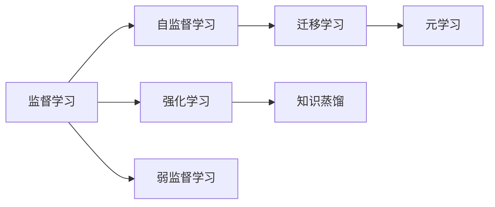
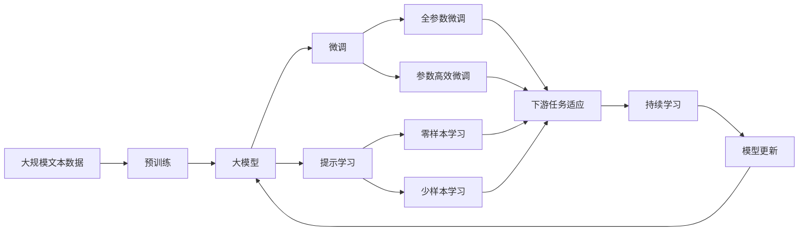

                 

# AI人工智能深度学习算法：智能深度学习代理的构建基础

> 关键词：深度学习代理,监督学习,强化学习,自监督学习,弱监督学习,迁移学习,知识蒸馏,元学习

## 1. 背景介绍

### 1.1 问题由来

人工智能（AI）技术的迅猛发展，特别是深度学习技术的突破，使得AI系统在各个领域的应用逐渐普及。然而，传统深度学习模型普遍存在数据需求高、训练时间长、泛化能力有限等缺点，难以适应实际应用场景的多样性和复杂性。为了解决这些问题，学术界和产业界提出了深度学习代理（Deep Learning Agent）的概念，旨在通过构建智能的深度学习模型，实现更加灵活、高效、可解释的AI应用。

深度学习代理通常是指能够自主学习、适应新任务、具备一定决策能力的深度学习模型。这些模型可以通过监督学习、强化学习、自监督学习等多种学习范式进行训练，适应不同的应用场景和任务需求。通过构建深度学习代理，AI系统可以在不依赖大规模人工标注数据的情况下，实现自适应和自优化，提升系统性能和应用效果。

### 1.2 问题核心关键点

构建深度学习代理的关键在于选择合适的学习范式，并结合具体的任务需求进行模型设计。目前常用的学习范式包括：

1. **监督学习**：通过有标注数据训练模型，使其能够根据输入数据预测输出结果。监督学习适合于处理结构化数据和分类任务，如文本分类、图像识别等。

2. **强化学习**：通过与环境互动，模型通过不断的试错和奖励机制，学习最优策略。强化学习适合于处理控制任务，如游戏策略、机器人控制等。

3. **自监督学习**：利用数据本身的特点，不依赖标注信息进行学习。自监督学习适合于处理大量无标注数据，如图像生成、语音识别等。

4. **弱监督学习**：使用少量标注数据和大量无标注数据进行训练，提升模型的泛化能力和鲁棒性。弱监督学习适合于数据标注成本高、数据分布不均的任务，如异常检测、半监督学习等。

5. **迁移学习**：通过将一个领域学到的知识迁移到另一个领域，提升模型在新领域上的性能。迁移学习适合于领域之间的知识迁移，如图像识别、语音识别等。

6. **知识蒸馏**：通过将复杂模型（教师模型）的知识转移到简单模型（学生模型）中，提升学生模型的性能。知识蒸馏适合于模型压缩、模型优化等场景。

7. **元学习**：学习如何快速适应新任务，提升模型的适应性和泛化能力。元学习适合于新任务学习、零样本学习等场景。

这些学习范式各有优劣，应根据具体任务需求进行选择和组合，构建合适的深度学习代理模型。

### 1.3 问题研究意义

构建深度学习代理对于推动AI技术的实际应用具有重要意义：

1. **提升模型性能**：深度学习代理可以通过多种学习范式进行训练，适应不同任务需求，提升模型的泛化能力和性能表现。

2. **降低数据需求**：自监督学习、弱监督学习等方法可以有效降低数据标注成本，使得AI系统能够在数据资源有限的情况下进行学习和优化。

3. **提高模型效率**：通过知识蒸馏、元学习等方法，可以在不影响模型性能的情况下，减少模型参数量和计算量，提高系统效率。

4. **增强系统鲁棒性**：通过强化学习、迁移学习等方法，可以使模型具备更好的鲁棒性和适应性，应对复杂多变的环境和任务。

5. **提升系统可解释性**：自监督学习、元学习等方法可以构建更加透明、可解释的模型，增强用户对系统行为的信任和理解。

6. **加速AI落地应用**：深度学习代理可以更好地适应实际应用场景，推动AI技术在各行业领域的规模化应用。

## 2. 核心概念与联系

### 2.1 核心概念概述

构建深度学习代理涉及多个核心概念，这些概念之间存在紧密的联系，共同构成深度学习代理的学习框架。以下是对这些核心概念的详细解释：

1. **监督学习**：通过有标注数据进行训练，使模型能够根据输入数据预测输出结果。监督学习适合于结构化数据和分类任务，如图像分类、文本分类等。

2. **强化学习**：通过与环境互动，模型通过不断的试错和奖励机制，学习最优策略。强化学习适合于控制任务，如游戏策略、机器人控制等。

3. **自监督学习**：利用数据本身的特点，不依赖标注信息进行学习。自监督学习适合于处理大量无标注数据，如图像生成、语音识别等。

4. **弱监督学习**：使用少量标注数据和大量无标注数据进行训练，提升模型的泛化能力和鲁棒性。弱监督学习适合于数据标注成本高、数据分布不均的任务，如异常检测、半监督学习等。

5. **迁移学习**：通过将一个领域学到的知识迁移到另一个领域，提升模型在新领域上的性能。迁移学习适合于领域之间的知识迁移，如图像识别、语音识别等。

6. **知识蒸馏**：通过将复杂模型（教师模型）的知识转移到简单模型（学生模型）中，提升学生模型的性能。知识蒸馏适合于模型压缩、模型优化等场景。

7. **元学习**：学习如何快速适应新任务，提升模型的适应性和泛化能力。元学习适合于新任务学习、零样本学习等场景。

这些概念之间相互关联，共同构成深度学习代理的学习框架。以下是一个Mermaid流程图，展示了这些核心概念之间的关系：



这个流程图展示了深度学习代理的学习范式和迁移学习的关系，以及如何通过各种学习范式构建智能深度学习代理。

### 2.2 概念间的关系

这些核心概念之间存在着紧密的联系，共同构成深度学习代理的学习框架。以下是几个关键的联系点：

1. **监督学习与自监督学习的关系**：自监督学习可以看作是监督学习的特殊形式，利用数据本身的特点进行学习，不依赖标注信息。在标注数据有限的情况下，自监督学习可以提升模型的泛化能力和鲁棒性。

2. **强化学习与监督学习的关系**：强化学习可以通过试错和奖励机制，不断优化模型策略。监督学习可以通过有标注数据训练模型，提升模型的预测准确性。两者的结合可以更好地适应复杂任务，如图像识别、自然语言处理等。

3. **迁移学习与知识蒸馏的关系**：迁移学习可以看作是一种特殊的知识蒸馏，通过将一个领域学到的知识迁移到另一个领域，提升模型在新领域上的性能。知识蒸馏则通过将复杂模型的知识转移到简单模型中，提升简单模型的性能。两者的结合可以更好地利用已有知识和数据，提升新任务的性能。

4. **元学习与迁移学习的关系**：元学习可以学习如何快速适应新任务，提升模型的适应性和泛化能力。迁移学习则通过将已有知识迁移到新任务中，提升模型在新任务上的性能。两者的结合可以更好地适应新任务，提升模型的性能和泛化能力。

### 2.3 核心概念的整体架构

最后，我们用一个综合的流程图来展示这些核心概念在大模型微调过程中的整体架构：



这个综合流程图展示了从预训练到微调，再到持续学习的完整过程。深度学习代理首先在大规模文本数据上进行预训练，然后通过微调（包括全参数微调和参数高效微调）或提示学习（包括零样本和少样本学习）来适应下游任务。最后，通过持续学习技术，模型可以不断更新和适应新的任务和数据。

## 3. 核心算法原理 & 具体操作步骤
### 3.1 算法原理概述

构建深度学习代理的过程可以分为预训练和微调两个阶段。预训练阶段通过大规模无标注数据进行学习，获得基础的语言表示能力。微调阶段则根据具体任务需求，对预训练模型进行有监督学习，提升模型在特定任务上的性能。

深度学习代理的构建通常遵循以下步骤：

1. **数据预处理**：将原始数据转化为适合模型训练的格式，如分词、编码、归一化等。

2. **模型选择**：选择合适的深度学习模型架构，如卷积神经网络（CNN）、递归神经网络（RNN）、Transformer等。

3. **模型训练**：使用预处理后的数据对模型进行训练，通过反向传播算法优化模型参数。

4. **微调策略**：根据具体任务需求，选择合适的微调策略，如监督学习、强化学习、自监督学习等。

5. **模型评估**：在验证集和测试集上对模型进行评估，使用合适的评估指标（如准确率、召回率、F1值等）衡量模型性能。

6. **模型优化**：根据评估结果，调整模型参数和训练策略，进一步提升模型性能。

7. **模型部署**：将训练好的模型部署到实际应用场景中，进行推理和预测。

### 3.2 算法步骤详解

以下是对深度学习代理构建过程的详细解释：

**Step 1: 数据预处理**

数据预处理是构建深度学习代理的基础步骤。不同的数据类型和任务需要不同的预处理方式。例如，文本数据需要进行分词、编码、归一化等操作，图像数据需要进行裁剪、缩放、归一化等操作。

在文本数据预处理方面，常用的方法包括：

- 分词：将文本数据转化为词语序列，方便模型处理。
- 编码：将词语序列转化为数字序列，方便模型训练。
- 归一化：将数据进行标准化处理，如L2归一化、区间归一化等，以提升模型训练效率和收敛速度。

**Step 2: 模型选择**

选择合适的深度学习模型架构是构建深度学习代理的关键步骤。常用的深度学习模型包括：

- 卷积神经网络（CNN）：适用于图像识别、语音识别等任务。
- 递归神经网络（RNN）：适用于自然语言处理等序列任务。
- 长短时记忆网络（LSTM）：适用于语言建模、机器翻译等任务。
- 门控循环单元（GRU）：适用于语言建模、机器翻译等任务。
- Transformer：适用于自然语言处理、语音识别等任务，具有较好的并行性和泛化能力。

**Step 3: 模型训练**

模型训练是构建深度学习代理的核心步骤。模型训练过程包括前向传播、损失函数计算、反向传播和参数更新等步骤。

- 前向传播：将输入数据输入模型，计算模型输出。
- 损失函数计算：计算模型输出与真实标签之间的差异，如交叉熵损失、均方误差损失等。
- 反向传播：根据损失函数计算梯度，更新模型参数。
- 参数更新：根据梯度更新模型参数，完成一轮训练。

**Step 4: 微调策略**

根据具体任务需求，选择合适的微调策略是构建深度学习代理的重要步骤。常用的微调策略包括：

- 监督学习：使用有标注数据进行训练，提升模型在特定任务上的性能。
- 强化学习：通过与环境互动，学习最优策略。
- 自监督学习：利用数据本身的特点进行学习，不依赖标注信息。
- 弱监督学习：使用少量标注数据和大量无标注数据进行训练，提升模型的泛化能力和鲁棒性。
- 迁移学习：通过将一个领域学到的知识迁移到另一个领域，提升模型在新领域上的性能。
- 知识蒸馏：通过将复杂模型（教师模型）的知识转移到简单模型（学生模型）中，提升学生模型的性能。
- 元学习：学习如何快速适应新任务，提升模型的适应性和泛化能力。

**Step 5: 模型评估**

模型评估是构建深度学习代理的重要步骤，用于衡量模型性能和泛化能力。常用的评估指标包括：

- 准确率：模型预测正确样本数与总样本数的比例。
- 召回率：模型预测正确正样本数与真实正样本数的比例。
- F1值：准确率和召回率的调和平均数，综合衡量模型的性能。

**Step 6: 模型优化**

模型优化是构建深度学习代理的关键步骤，用于提升模型性能和泛化能力。常用的优化方法包括：

- 正则化：通过L2正则化、Dropout等方法，防止模型过拟合。
- 超参数调优：通过网格搜索、随机搜索等方法，找到最优超参数组合。
- 集成学习：通过多个模型的投票、融合等方法，提升模型性能和鲁棒性。

**Step 7: 模型部署**

模型部署是将训练好的模型应用于实际应用场景的关键步骤。模型部署需要考虑以下因素：

- 推理速度：模型的推理速度需要满足实际应用的需求。
- 内存占用：模型内存占用需要合理，避免资源浪费。
- 部署平台：模型需要在适合的部署平台上运行，如CPU、GPU、TPU等。
- 可扩展性：模型需要具备良好的可扩展性，支持并行推理、分布式训练等。

### 3.3 算法优缺点

构建深度学习代理的算法具有以下优点：

- 泛化能力强：深度学习代理可以学习到更加复杂和多样的特征表示，提升模型的泛化能力和性能表现。
- 适应性强：深度学习代理可以通过多种学习范式进行训练，适应不同的任务需求。
- 自动化程度高：深度学习代理可以自动学习任务相关知识，减少人工干预和调参工作量。

同时，构建深度学习代理的算法也存在以下缺点：

- 数据需求高：深度学习代理需要大量的数据进行训练，数据标注成本较高。
- 计算资源要求高：深度学习代理需要大量的计算资源进行训练和推理，硬件成本较高。
- 模型复杂度高：深度学习代理的模型结构复杂，训练和推理过程较为耗时。
- 模型可解释性差：深度学习代理通常作为黑盒模型进行推理，缺乏可解释性。

### 3.4 算法应用领域

构建深度学习代理的算法在多个领域具有广泛的应用。以下是几个典型应用场景：

1. **自然语言处理**：深度学习代理可以用于文本分类、情感分析、机器翻译、对话系统等任务。通过监督学习、自监督学习等方法，提升模型在特定任务上的性能。

2. **计算机视觉**：深度学习代理可以用于图像识别、物体检测、图像生成等任务。通过监督学习、迁移学习等方法，提升模型在特定任务上的性能。

3. **语音识别**：深度学习代理可以用于语音识别、语音合成等任务。通过监督学习、自监督学习等方法，提升模型在特定任务上的性能。

4. **机器人控制**：深度学习代理可以用于机器人路径规划、运动控制等任务。通过强化学习、元学习等方法，提升机器人对复杂环境的适应能力。

5. **金融风控**：深度学习代理可以用于信用评分、欺诈检测等任务。通过监督学习、自监督学习等方法，提升模型在特定任务上的性能。

6. **医疗诊断**：深度学习代理可以用于病历分析、影像诊断等任务。通过迁移学习、知识蒸馏等方法，提升模型在特定任务上的性能。

## 4. 数学模型和公式 & 详细讲解 & 举例说明

### 4.1 数学模型构建

构建深度学习代理的过程可以通过数学模型来描述。以下是一个简化的数学模型，用于描述深度学习代理的构建过程。

假设输入数据为 $x$，模型参数为 $\theta$，模型输出为 $y$。则深度学习代理的构建过程可以表示为：

$$
y = f_\theta(x)
$$

其中 $f_\theta(x)$ 表示模型参数 $\theta$ 下的函数映射关系。

### 4.2 公式推导过程

以下是对深度学习代理构建过程的数学推导：

**Step 1: 数据预处理**

假设输入数据 $x$ 为文本序列，需要进行分词、编码、归一化等操作。假设分词后的序列为 $X = [x_1, x_2, ..., x_n]$，编码后的序列为 $X' = [x'_1, x'_2, ..., x'_n]$。

**Step 2: 模型选择**

假设选择的深度学习模型为卷积神经网络（CNN），模型参数为 $\theta$。模型的输出可以表示为：

$$
y = h_\theta(x')
$$

其中 $h_\theta(x')$ 表示卷积神经网络在模型参数 $\theta$ 下的输出。

**Step 3: 模型训练**

假设使用交叉熵损失函数，模型的损失函数可以表示为：

$$
L(\theta) = -\frac{1}{N} \sum_{i=1}^N \log p_\theta(y_i|x_i')
$$

其中 $p_\theta(y_i|x_i')$ 表示模型在输入 $x_i'$ 下预测输出 $y_i$ 的概率，$N$ 表示样本数。

**Step 4: 微调策略**

假设选择的微调策略为监督学习，使用有标注数据 $D = \{(x_i, y_i)\}_{i=1}^N$ 进行训练。模型的损失函数可以表示为：

$$
L(\theta) = -\frac{1}{N} \sum_{i=1}^N \log p_\theta(y_i|x_i')
$$

其中 $p_\theta(y_i|x_i')$ 表示模型在输入 $x_i'$ 下预测输出 $y_i$ 的概率，$N$ 表示样本数。

**Step 5: 模型评估**

假设在验证集 $D_{val}$ 上评估模型性能，使用准确率、召回率、F1值等指标进行评估。评估指标可以表示为：

$$
\text{Accuracy} = \frac{1}{N_{val}} \sum_{i=1}^{N_{val}} \mathbb{I}(y_i' = y_i)
$$

$$
\text{Recall} = \frac{1}{N_{val}} \sum_{i=1}^{N_{val}} \mathbb{I}(y_i' = 1) / \text{TP}
$$

$$
\text{F1-Score} = 2 \times \frac{\text{Precision} \times \text{Recall}}{\text{Precision} + \text{Recall}}
$$

其中 $y_i'$ 表示模型预测输出，$y_i$ 表示真实标签，$\mathbb{I}$ 表示示性函数，$N_{val}$ 表示验证集样本数，$\text{TP}$ 表示真实正样本数。

**Step 6: 模型优化**

假设通过网格搜索方法调优超参数，找到最优的超参数组合。超参数可以表示为 $\alpha = [\alpha_1, \alpha_2, ..., \alpha_k]$。模型优化过程可以表示为：

$$
\theta' = \theta_\alpha = \mathop{\arg\min}_{\theta} L_\alpha(\theta)
$$

其中 $L_\alpha(\theta)$ 表示超参数 $\alpha$ 下的损失函数，$\theta_\alpha$ 表示超参数 $\alpha$ 下的模型参数。

**Step 7: 模型部署**

假设模型在推理平台上进行部署，推理过程可以表示为：

$$
y' = f_\theta'(x')
$$

其中 $f_\theta'(x')$ 表示部署后的模型在输入 $x'$ 下的输出，$\theta'$ 表示部署后的模型参数。

### 4.3 案例分析与讲解

以下是一个深度学习代理构建的案例分析：

**案例背景**：构建一个基于深度学习代理的情感分析模型。

**Step 1: 数据预处理**

假设输入数据为一段文本，需要进行分词、编码、归一化等操作。假设分词后的序列为 $X = [x_1, x_2, ..., x_n]$，编码后的序列为 $X' = [x'_1, x'_2, ..., x'_n]$。

**Step 2: 模型选择**

假设选择的深度学习模型为卷积神经网络（CNN），模型参数为 $\theta$。模型的输出可以表示为：

$$
y = h_\theta(x')
$$

**Step 3: 模型训练**

假设使用交叉熵损失函数，模型的损失函数可以表示为：

$$
L(\theta) = -\frac{1}{N} \sum_{i=1}^N \log p_\theta(y_i|x_i')
$$

**Step 4: 微调策略**

假设选择的微调策略为监督学习，使用有标注数据 $D = \{(x_i, y_i)\}_{i=1}^N$ 进行训练。模型的损失函数可以表示为：

$$
L(\theta) = -\frac{1}{N} \sum_{i=1}^N \log p_\theta(y_i|x_i')
$$

**Step 5: 模型评估**

假设在验证集 $D_{val}$ 上评估模型性能，使用准确率、召回率、F1值等指标进行评估。评估指标可以表示为：

$$
\text{Accuracy} = \frac{1}{N_{val}} \sum_{i=1}^{N_{val}} \mathbb{I}(y_i' = y_i)
$$

$$
\text{Recall} = \frac{1}{N_{val}} \sum_{i=1}^{N_{val}} \mathbb{I}(y_i' = 1) / \text{TP}
$$

$$
\text{F1-Score} = 2 \times \frac{\text{Precision} \times \text{Recall}}{\text{Precision} + \text{Recall}}
$$

**Step 6: 模型优化**

假设通过网格搜索方法调优超参数，找到最优的超参数组合。超参数可以表示为 $\alpha = [\alpha_1, \alpha_2, ..., \alpha_k]$。模型优化过程可以表示为：

$$
\theta' = \theta_\alpha = \mathop{\arg\min}_{\theta} L_\alpha(\theta)
$$

**Step 7: 模型部署**

假设模型在推理平台上进行部署，推理过程可以表示为：

$$
y' = f_\theta'(x')
$$

其中 $f_\theta'(x')$ 表示部署后的模型在输入 $x'$ 下的输出，$\theta'$ 表示部署后的模型参数。

## 5. 项目实践：代码实例和详细解释说明

### 5.1 开发环境搭建

在进行深度学习代理构建实践前，我们需要准备好开发环境。以下是使用Python进行TensorFlow开发的环境配置流程：

1. 安装Anaconda：从官网下载并安装Anaconda，用于创建独立的Python环境。

2. 创建并激活虚拟环境：
```bash
conda create -n tf-env python=3.8 
conda activate tf-env
```

3. 安装TensorFlow：根据CUDA版本，从官网获取对应的安装命令。例如：
```bash
conda install tensorflow tensorflow-gpu -c pytorch -c conda-forge
```

4. 安装各类工具包：
```bash
pip install numpy pandas scikit-learn matplotlib tqdm jupyter notebook ipython
```

完成上述步骤后，即可在`tf-env`环境中开始深度学习代理的构建实践。

### 5.2 源代码详细实现

这里我们以情感分析任务为例，给出使用TensorFlow构建卷积神经网络（CNN）模型的代码实现。

首先，定义CNN模型的架构：

```python
import tensorflow as tf

class CNNModel(tf.keras.Model):
    def __init__(self, input_dim, num_classes):
        super(CNNModel, self).__init__()
        self.conv1 = tf.keras.layers.Conv1D(32, 3, activation='relu')
        self.pool1 = tf.keras.layers.MaxPooling1D(2)
        self.conv2 = tf.keras.layers.Conv1D(64, 3, activation='relu')
        self.pool2 = tf.keras.layers.MaxPooling1D(2)
        self.flatten = tf.keras.layers.Flatten()
        self.dense1 = tf.keras.layers.Dense(64, activation='relu')
        self.dense2 = tf.keras.layers.Dense(num_classes, activation='softmax')
    
    def call(self, x):
        x = self.conv1(x)
        x = self.pool1(x)
        x = self.conv2(x)
        x = self.pool2(x)
        x = self.flatten(x)
        x = self.dense1(x)
        x = self.dense2(x)
        return x
```

然后，定义数据加载函数：

```python
import os
import numpy as np
from tensorflow.keras.preprocessing.text import Tokenizer
from tensorflow.keras.preprocessing.sequence import pad_sequences

def load_data(path):
    texts = []
    labels = []
    for root, dirs, files in os.walk(path):
        for file in files:
            with open(os.path.join(root, file), 'r', encoding='utf-8') as f:
                text = f.read()
                texts.append(text)
                label = int(file.split('.')[0])
                labels.append(label)
    tokenizer = Tokenizer(num_words=10000)
    tokenizer.fit_on_texts(texts)
    texts = tokenizer.texts_to_sequences(texts)
    texts =

