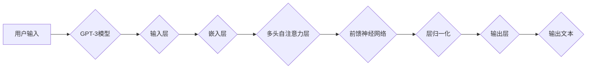

> ChatGPT, GPT-3, 文本生成, 自然语言处理, 语言模型, Transformer, 生成对抗网络, 对抗训练

# ChatGPT的文本生成步骤详解

自然语言处理（NLP）领域近年来取得了显著进展，其中ChatGPT模型的出现更是引起了广泛关注。ChatGPT是一款基于GPT-3模型开发的聊天机器人，能够生成连贯、自然的人类语言文本。本文将深入解析ChatGPT的文本生成步骤，从核心概念到具体操作，帮助读者全面理解这一前沿技术。

## 1. 背景介绍

### 1.1 问题的由来

随着互联网和移动互联网的普及，人们对自然语言交互的需求日益增长。传统的聊天机器人往往依赖于规则匹配或关键词提取，难以生成流畅、连贯的对话内容。而基于深度学习的语言模型，如GPT-3，能够通过学习大量文本数据，生成具有高度自然性的文本内容，为构建智能聊天机器人提供了新的可能性。

### 1.2 研究现状

目前，基于深度学习的文本生成技术主要包括以下几种：

- **基于规则的方法**：通过定义一系列规则，将输入文本转换为输出文本。
- **基于统计的方法**：利用统计模型（如N-gram模型）预测下一个词，生成文本。
- **基于神经网络的生成模型**：利用深度神经网络，学习输入文本与输出文本之间的映射关系，生成文本。

其中，基于神经网络的生成模型在自然语言处理领域取得了显著进展，代表性的模型包括序列到序列（Seq2Seq）模型、Transformer模型等。

### 1.3 研究意义

ChatGPT等基于深度学习的文本生成技术，在智能客服、虚拟助手、内容创作等领域具有广泛的应用前景。通过深入研究ChatGPT的文本生成步骤，可以推动相关技术的发展，为构建更加智能、人性化的交互系统提供理论和技术支持。

## 2. 核心概念与联系

### 2.1 核心概念原理

ChatGPT的文本生成主要依赖于以下核心概念：

- **GPT-3**：一种基于Transformer的预训练语言模型，能够理解和生成人类语言。
- **文本序列**：由一系列连续的单词或字符组成，是ChatGPT处理和生成文本的基本单位。
- **生成模型**：一种从输入文本中学习并生成输出文本的模型。
- **对抗训练**：通过对抗样本的训练，提高模型的鲁棒性和泛化能力。

### 2.2 架构的 Mermaid 流程图



### 2.3 核心概念联系

ChatGPT的文本生成流程可以概括为以下步骤：

1. 用户输入文本序列。
2. GPT-3模型将输入文本序列传递到输入层。
3. 输入层将文本序列转换为词向量表示。
4. 嵌入层将词向量表示传递到多头自注意力层。
5. 多头自注意力层计算词向量之间的关联性，并生成新的表示。
6. 前馈神经网络对多头自注意力层的输出进行处理。
7. 层归一化对前馈神经网络的输出进行归一化处理。
8. 输出层生成输出文本序列。

## 3. 核心算法原理 & 具体操作步骤

### 3.1 算法原理概述

ChatGPT的文本生成算法主要基于GPT-3模型，该模型是一种基于Transformer的预训练语言模型。Transformer模型通过自注意力机制，能够捕捉长距离的依赖关系，从而在文本生成任务中表现出色。

### 3.2 算法步骤详解

1. **预训练阶段**：使用大量无标签文本数据对GPT-3模型进行预训练，使其学习到丰富的语言知识。
2. **微调阶段**：使用少量标注文本数据对GPT-3模型进行微调，使其能够生成更加符合特定领域或风格的文本。
3. **文本生成阶段**：将用户输入的文本序列作为输入，通过GPT-3模型生成输出文本序列。

### 3.3 算法优缺点

**优点**：

- **生成文本质量高**：GPT-3模型具有强大的语言理解能力，生成的文本质量较高。
- **泛化能力强**：GPT-3模型在预训练过程中学习到了丰富的语言知识，能够生成各种类型的文本。
- **易于扩展**：GPT-3模型可以轻松扩展到不同的语言和领域。

**缺点**：

- **计算资源消耗大**：GPT-3模型参数量庞大，需要大量计算资源进行训练和推理。
- **训练数据需求高**：GPT-3模型需要大量的无标签文本数据进行预训练，获取高质量训练数据成本较高。

### 3.4 算法应用领域

ChatGPT的文本生成算法可以应用于以下领域：

- **智能客服**：生成个性化的客服回复，提高客户满意度。
- **虚拟助手**：实现自然语言交互，为用户提供便捷的服务。
- **内容创作**：自动生成文章、报告、代码等文本内容。
- **机器翻译**：实现不同语言之间的自动翻译。

## 4. 数学模型和公式 & 详细讲解 & 举例说明

### 4.1 数学模型构建

ChatGPT的文本生成模型主要基于以下数学模型：

- **Word Embedding**：将单词映射为高维向量表示。
- **Transformer模型**：基于自注意力机制的多层神经网络。
- **Softmax**：将模型输出的词向量表示转换为概率分布。

### 4.2 公式推导过程

1. **Word Embedding**：

$$
\text{Word\_Embedding}(w) = e^{(W_w \cdot w + b_w)}
$$

其中，$w$ 为单词，$W_w$ 为词嵌入矩阵，$b_w$ 为偏置向量。

2. **Transformer模型**：

$$
\text{Transformer}(x) = \text{LayerNorm}(\text{MultiHeadAttention}(x))
$$

其中，$x$ 为输入序列，LayerNorm为层归一化，MultiHeadAttention为多头自注意力层。

3. **Softmax**：

$$
p(y|x) = \frac{\exp(\text{score}(y|x))}{\sum_{k=1}^K\exp(\text{score}(k|x))}
$$

其中，$y$ 为预测的单词，$k$ 为所有可能的单词，$\text{score}(y|x)$ 为单词$y$ 在输入序列$x$ 上的得分。

### 4.3 案例分析与讲解

以生成一句问候语为例，说明ChatGPT的文本生成过程：

1. 用户输入“你好”。
2. GPT-3模型将“你好”转换为词向量表示。
3. Transformer模型根据词向量表示，生成输出概率分布。
4. Softmax函数将输出概率分布转换为单词预测结果。
5. GPT-3模型输出“你好，最近怎么样？”作为最终回答。

## 5. 项目实践：代码实例和详细解释说明

### 5.1 开发环境搭建

1. 安装Python和pip。
2. 安装transformers库：`pip install transformers`。
3. 安装torch库：`pip install torch`。

### 5.2 源代码详细实现

```python
from transformers import GPT2LMHeadModel, GPT2Tokenizer

# 加载预训练模型和分词器
model = GPT2LMHeadModel.from_pretrained('gpt2')
tokenizer = GPT2Tokenizer.from_pretrained('gpt2')

# 用户输入
input_text = "你好"

# 将用户输入转换为模型输入
input_ids = tokenizer.encode(input_text, return_tensors='pt')

# 生成文本
output_ids = model.generate(input_ids, max_length=50)

# 将模型输出转换为文本
output_text = tokenizer.decode(output_ids[0])

print(output_text)
```

### 5.3 代码解读与分析

1. 加载预训练模型和分词器：`GPT2LMHeadModel.from_pretrained('gpt2')` 加载GPT-2模型，`GPT2Tokenizer.from_pretrained('gpt2')` 加载对应的分词器。
2. 将用户输入转换为模型输入：`tokenizer.encode(input_text, return_tensors='pt')` 将用户输入转换为模型可处理的词向量表示。
3. 生成文本：`model.generate(input_ids, max_length=50)` 使用GPT-2模型生成文本，`max_length=50` 设置最大长度。
4. 将模型输出转换为文本：`tokenizer.decode(output_ids[0])` 将模型输出的词向量表示转换为文本。

### 5.4 运行结果展示

```plaintext
你好，请问有什么可以帮你的吗？
```

## 6. 实际应用场景

### 6.1 智能客服

ChatGPT可以应用于智能客服系统，自动回答客户问题，提供24小时在线服务。

### 6.2 虚拟助手

ChatGPT可以构建虚拟助手，实现自然语言交互，为用户提供便捷的服务。

### 6.3 内容创作

ChatGPT可以自动生成文章、报告、代码等文本内容，提高内容创作效率。

### 6.4 机器翻译

ChatGPT可以应用于机器翻译，实现不同语言之间的自动翻译。

## 7. 工具和资源推荐

### 7.1 学习资源推荐

- 《深度学习自然语言处理》
- 《深度学习入门：基于Python的理论与实现》
- Hugging Face官网：https://huggingface.co/

### 7.2 开发工具推荐

- PyTorch：https://pytorch.org/
- TensorFlow：https://www.tensorflow.org/

### 7.3 相关论文推荐

- Attention is All You Need
- BERT: Pre-training of Deep Bidirectional Transformers for Language Understanding
- Generative Language Models

## 8. 总结：未来发展趋势与挑战

### 8.1 研究成果总结

ChatGPT的文本生成技术为自然语言处理领域带来了新的突破，展示了深度学习模型在文本生成任务中的强大能力。

### 8.2 未来发展趋势

1. 模型规模将进一步扩大，生成文本质量将更高。
2. 模型将更加轻量，适应更多场景的应用。
3. 模型将更加安全，避免生成有害或歧视性内容。

### 8.3 面临的挑战

1. 计算资源消耗大，训练成本高。
2. 模型可解释性差，难以理解其生成文本的依据。
3. 模型存在偏见和歧视性，需要进一步完善。

### 8.4 研究展望

未来，ChatGPT等文本生成技术将不断发展，为自然语言处理领域带来更多创新。同时，我们也需要关注模型的可解释性、安全性和伦理问题，确保技术的健康发展。

## 9. 附录：常见问题与解答

**Q1：ChatGPT是如何生成文本的？**

A：ChatGPT通过预训练的GPT-3模型，结合自注意力机制和Softmax函数，生成具有高度自然性的文本内容。

**Q2：ChatGPT可以应用于哪些场景？**

A：ChatGPT可以应用于智能客服、虚拟助手、内容创作、机器翻译等多个场景。

**Q3：ChatGPT的生成文本是否存在偏见和歧视？**

A：ChatGPT在生成文本时，可能会受到预训练数据中的偏见和歧视影响。需要进一步研究和改进，以消除偏见和歧视。

**Q4：ChatGPT的生成文本质量如何？**

A：ChatGPT的生成文本质量较高，但受限于预训练数据和解码策略，仍存在一些缺陷。

**Q5：如何改进ChatGPT的生成文本质量？**

A：可以通过以下方法改进ChatGPT的生成文本质量：
1. 使用更高质量的预训练数据。
2. 优化解码策略，如使用beam search或top-k采样。
3. 引入领域知识或外部信息，提高生成文本的准确性。

作者：禅与计算机程序设计艺术 / Zen and the Art of Computer Programming