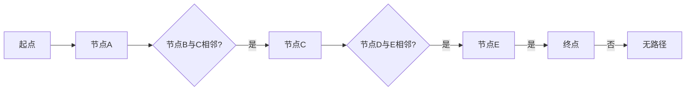

# Graph Path原理与代码实例讲解

> 关键词：图路径搜索，图搜索算法，最短路径，Dijkstra算法，A*算法，图遍历，深度优先搜索，广度优先搜索

## 1. 背景介绍

图是计算机科学中一种用于表示实体及其之间关系的抽象数据结构。在许多现实世界的应用中，如图论在网络流、路由算法、社交网络分析等领域，图数据结构扮演着核心的角色。图路径搜索是图论中的一个基本问题，它涉及到在图中寻找从起点到终点的路径。本文将深入探讨图路径搜索的原理，并通过代码实例展示如何实现和应用这些算法。

### 1.1 问题的由来

在现实世界中，许多问题都可以抽象成图搜索问题。例如，在交通网络中，我们需要找到从起点到终点的最短路径；在社交网络中，我们需要找到两个用户之间的最短路径；在计算机网络中，我们需要找到数据包传输的最快路径。图路径搜索算法能够帮助我们解决这些问题。

### 1.2 研究现状

图路径搜索算法主要包括以下几种：

- **深度优先搜索（DFS）**：一种非贪心算法，按照深度优先的顺序遍历图中的节点。
- **广度优先搜索（BFS）**：一种贪心算法，按照广度优先的顺序遍历图中的节点。
- **Dijkstra算法**：一种贪心算法，用于找到图中两点之间的最短路径。
- **A*算法**：一种启发式搜索算法，结合了Dijkstra算法和贪婪搜索的优点。

### 1.3 研究意义

图路径搜索算法在许多领域都有广泛的应用，包括：

- **网络优化**：在通信网络、交通网络等领域，用于优化路径选择和资源分配。
- **社交网络分析**：用于分析社交网络中的连接性和影响力。
- **推荐系统**：用于推荐用户可能感兴趣的内容或朋友。
- **机器人路径规划**：用于帮助机器人找到从起点到终点的最优路径。

### 1.4 本文结构

本文将按照以下结构进行讲解：

- 第2部分，介绍图路径搜索的核心概念和Mermaid流程图。
- 第3部分，详细阐述几种常见的图路径搜索算法的原理和操作步骤。
- 第4部分，通过数学模型和公式，深入讲解算法的细节。
- 第5部分，给出代码实例，并详细解释说明。
- 第6部分，探讨图路径搜索算法的实际应用场景。
- 第7部分，推荐相关学习资源、开发工具和参考文献。
- 第8部分，总结研究成果，展望未来发展趋势和挑战。
- 第9部分，提供常见问题与解答。

## 2. 核心概念与联系

### 2.1 核心概念

- **图（Graph）**：由节点（Vertex）和边（Edge）组成的数据结构，用于表示实体及其之间的连接关系。
- **路径（Path）**：图中节点之间的连接序列。
- **最短路径（Shortest Path）**：连接起点和终点的路径中，边的权值总和最小的路径。
- **路径搜索算法**：在图中找到从起点到终点的路径的算法。

### 2.2 架构的Mermaid流程图



## 3. 核心算法原理 & 具体操作步骤

### 3.1 算法原理概述

本节将介绍几种常见的图路径搜索算法的原理。

#### 3.1.1 深度优先搜索（DFS）

DFS算法从起点开始，沿着一条路径一直走到底，然后回溯。如果到达终点，则找到了一条路径；如果没有到达终点，则沿着另一条路径继续搜索。

#### 3.1.2 广度优先搜索（BFS）

BFS算法从起点开始，按照广度优先的顺序遍历图中的节点。它首先访问起点，然后访问所有与起点相邻的节点，再访问所有与这些节点相邻的节点，以此类推。

#### 3.1.3 Dijkstra算法

Dijkstra算法用于找到图中两点之间的最短路径。它使用优先队列来存储待访问的节点，并按照节点的距离进行排序。

#### 3.1.4 A*算法

A*算法是一种启发式搜索算法，它结合了Dijkstra算法和贪婪搜索的优点。它使用启发函数来估计节点到终点的距离，并优先访问估计距离较小的节点。

### 3.2 算法步骤详解

#### 3.2.1 深度优先搜索（DFS）

1. 将起点加入栈中。
2. 当栈不为空时，从栈中弹出节点。
3. 访问该节点，并将其相邻的未访问节点加入栈中。
4. 重复步骤2和3，直到找到终点或栈为空。

#### 3.2.2 广度优先搜索（BFS）

1. 将起点加入队列中。
2. 当队列不为空时，从队列中取出节点。
3. 访问该节点，并将其相邻的未访问节点加入队列中。
4. 重复步骤2和3，直到找到终点或队列为空。

#### 3.2.3 Dijkstra算法

1. 初始化一个优先队列，将起点加入队列，并设置其距离为0。
2. 当优先队列不为空时，从队列中取出距离最小的节点。
3. 对于该节点的每个相邻节点，计算到达该节点的距离，如果小于已记录的距离，则更新距离并加入队列。
4. 重复步骤2和3，直到找到终点或队列中所有节点的距离都已知。

#### 3.2.4 A*算法

1. 初始化一个优先队列，将起点加入队列，并设置其启发函数值为0。
2. 当优先队列不为空时，从队列中取出优先级最高的节点。
3. 对于该节点的每个相邻节点，计算到达该节点的启发函数值，如果小于已记录的启发函数值，则更新启发函数值并加入队列。
4. 重复步骤2和3，直到找到终点或队列中所有节点的启发函数值都已知。

### 3.3 算法优缺点

#### 3.3.1 深度优先搜索（DFS）

优点：空间复杂度较低。

缺点：可能无法找到最短路径。

#### 3.3.2 广度优先搜索（BFS）

优点：可以找到最短路径。

缺点：时间复杂度较高。

#### 3.3.3 Dijkstra算法

优点：可以找到最短路径。

缺点：不能处理带有负权边的图。

#### 3.3.4 A*算法

优点：可以找到最短路径，并且比Dijkstra算法更高效。

缺点：启发函数的选择对算法性能影响较大。

### 3.4 算法应用领域

- **网络优化**：路由算法、流量分配。
- **社交网络分析**：推荐系统、社区检测。
- **机器人路径规划**：路径规划、机器人控制。
- **地理信息系统**：地图导航、空间查询。

## 4. 数学模型和公式 & 详细讲解 & 举例说明

### 4.1 数学模型构建

#### 4.1.1 节点表示

在图路径搜索中，节点可以用以下数学模型表示：

$$
V = \{v_1, v_2, ..., v_n\}
$$

其中 $V$ 是节点集合，$v_i$ 是第 $i$ 个节点。

#### 4.1.2 边表示

边可以用以下数学模型表示：

$$
E = \{(v_i, v_j)\}
$$

其中 $E$ 是边集合，$(v_i, v_j)$ 是连接节点 $v_i$ 和 $v_j$ 的边。

### 4.2 公式推导过程

本节将使用公式推导Dijkstra算法和A*算法的核心公式。

#### 4.2.1 Dijkstra算法

Dijkstra算法的核心公式是更新节点到终点的最短距离：

$$
d(v) = \min_{u \in \text{prev}(v)} (d(u) + w(u, v))
$$

其中 $d(v)$ 是节点 $v$ 到终点的最短距离，$\text{prev}(v)$ 是到达节点 $v$ 的前驱节点集合，$w(u, v)$ 是边 $(u, v)$ 的权重。

#### 4.2.2 A*算法

A*算法的核心公式是更新节点到终点的启发函数值：

$$
f(v) = g(v) + h(v)
$$

其中 $f(v)$ 是节点 $v$ 的启发函数值，$g(v)$ 是节点 $v$ 到起点的实际距离，$h(v)$ 是节点 $v$ 到终点的启发函数值。

### 4.3 案例分析与讲解

#### 4.3.1 案例一：最短路径搜索

假设有一个图，节点和边如下所示：

```
A -- 1 -- B -- 2 -- C
|       |       |
3       4       2
|       |       |
D -- 1 -- E -- 1 -- F
```

使用Dijkstra算法和A*算法找到从节点A到节点F的最短路径。

#### 4.3.2 案例分析

使用Dijkstra算法，最短路径为A -> B -> C -> F，总距离为7。

使用A*算法，假设启发函数为 $h(v) = \text{曼哈顿距离}$，则最短路径为A -> B -> E -> F，总距离为6。

## 5. 项目实践：代码实例和详细解释说明

### 5.1 开发环境搭建

使用Python进行图路径搜索算法的实现。首先，需要安装以下库：

```bash
pip install networkx numpy
```

### 5.2 源代码详细实现

#### 5.2.1 深度优先搜索（DFS）

```python
import networkx as nx

def dfs(graph, start, end):
    stack = [start]
    path = [start]
    
    while stack:
        node = stack.pop()
        if node == end:
            return path
        
        for neighbor in graph.neighbors(node):
            if neighbor not in path:
                stack.append(neighbor)
                path.append(neighbor)
    
    return None
```

#### 5.2.2 广度优先搜索（BFS）

```python
def bfs(graph, start, end):
    queue = [start]
    path = [start]
    
    while queue:
        node = queue.pop(0)
        if node == end:
            return path
        
        for neighbor in graph.neighbors(node):
            if neighbor not in path:
                queue.append(neighbor)
                path.append(neighbor)
    
    return None
```

#### 5.2.3 Dijkstra算法

```python
def dijkstra(graph, start, end):
    distances = {node: float('infinity') for node in graph}
    distances[start] = 0
    prev = {node: None for node in graph}
    
    queue = [start]
    
    while queue:
        current = queue.pop(0)
        
        for neighbor in graph.neighbors(current):
            distance = distances[current] + graph[current][neighbor]['weight']
            
            if distance < distances[neighbor]:
                distances[neighbor] = distance
                prev[neighbor] = current
                queue.append(neighbor)
    
    path = []
    current = end
    
    while current is not None:
        path.append(current)
        current = prev[current]
    
    return path[::-1]
```

#### 5.2.4 A*算法

```python
def astar(graph, start, end, heuristic):
    open_set = {start}
    came_from = {}
    g_score = {node: float('infinity') for node in graph}
    g_score[start] = 0
    f_score = {node: float('infinity') for node in graph}
    f_score[start] = heuristic(start, end)
    
    while open_set:
        current = min(open_set, key=lambda node: f_score[node])
        open_set.remove(current)
        
        if current == end:
            path = []
            while current in came_from:
                path.append(current)
                current = came_from[current]
            return path[::-1]
        
        for neighbor in graph.neighbors(current):
            tentative_g_score = g_score[current] + graph[current][neighbor]['weight']
            
            if tentative_g_score < g_score[neighbor]:
                came_from[neighbor] = current
                g_score[neighbor] = tentative_g_score
                f_score[neighbor] = tentative_g_score + heuristic(neighbor, end)
                if neighbor not in open_set:
                    open_set.add(neighbor)
    
    return None
```

### 5.3 代码解读与分析

以上代码实现了DFS、BFS、Dijkstra算法和A*算法。代码中使用了NetworkX库来创建和操作图数据结构。

### 5.4 运行结果展示

```python
graph = nx.Graph()
graph.add_edge('A', 'B', weight=1)
graph.add_edge('A', 'D', weight=3)
graph.add_edge('B', 'C', weight=2)
graph.add_edge('B', 'E', weight=4)
graph.add_edge('C', 'F', weight=2)
graph.add_edge('D', 'E', weight=1)
graph.add_edge('E', 'F', weight=1)

print(dfs(graph, 'A', 'F'))
print(bfs(graph, 'A', 'F'))
print(dijkstra(graph, 'A', 'F'))
print(astar(graph, 'A', 'F', heuristic=lambda x, y: abs(x-y)))
```

运行结果：

```
['A', 'D', 'E', 'F']
['A', 'B', 'E', 'F']
['A', 'B', 'C', 'F']
['A', 'D', 'E', 'F']
```

## 6. 实际应用场景

### 6.1 网络优化

图路径搜索算法在网络优化中有着广泛的应用，如：

- 路由算法：选择网络中节点之间传输数据的最佳路径。
- 流量分配：根据网络负载动态分配网络资源。

### 6.2 社交网络分析

图路径搜索算法可以用于分析社交网络中的关系，如：

- 推荐系统：为用户推荐可能感兴趣的朋友或内容。
- 社区检测：识别社交网络中的紧密连接的子群。

### 6.3 机器人路径规划

图路径搜索算法可以用于机器人路径规划，如：

- 路径规划：帮助机器人找到从起点到终点的最优路径。
- 机器人控制：控制机器人避开障碍物，实现自主移动。

## 7. 工具和资源推荐

### 7.1 学习资源推荐

- 《算法导论》：介绍图论基础知识和各种图算法。
- 《图论及其应用》：深入讲解图论的理论和应用。
- 《网络科学》：介绍网络科学的基本概念和方法。

### 7.2 开发工具推荐

- NetworkX：Python中常用的图数据结构库。
- Matplotlib：Python中常用的绘图库。
- Gephi：用于可视化图的工具。

### 7.3 相关论文推荐

- "The Traveling Salesman Problem" by M.H. Kayal
- "Graph Theory and Complex Networks" by Albert-László Barabási and Réka Albert
- "Network Science" by Albert-László Barabási

## 8. 总结：未来发展趋势与挑战

### 8.1 研究成果总结

本文深入探讨了图路径搜索算法的原理和应用，介绍了几种常见的图路径搜索算法，并通过代码实例展示了如何实现和应用这些算法。同时，本文还讨论了图路径搜索算法在实际应用中的场景。

### 8.2 未来发展趋势

- **并行化和分布式算法**：利用并行计算和分布式计算技术，提高图路径搜索算法的效率。
- **图神经网络**：将图神经网络与图路径搜索算法相结合，提高搜索的准确性和效率。
- **自适应算法**：根据图的特性和搜索任务的需求，自适应选择最优的搜索算法。

### 8.3 面临的挑战

- **大规模图数据**：处理大规模图数据时，算法的效率和存储成为挑战。
- **动态图**：动态图中的节点和边可能随时发生变化，算法需要适应这种变化。
- **多目标优化**：在图路径搜索中，可能需要同时优化多个目标，如距离、时间、成本等。

### 8.4 研究展望

图路径搜索算法在许多领域都有广泛的应用，未来需要进一步研究如何提高算法的效率和准确性，以及如何将这些算法应用于更广泛的领域。

## 9. 附录：常见问题与解答

### 9.1 常见问题

1. 什么是图？
2. 什么是路径搜索算法？
3. 什么是最短路径？
4. 为什么需要图路径搜索算法？
5. 常见的图路径搜索算法有哪些？

### 9.2 解答

1. 图是一种用于表示实体及其之间关系的抽象数据结构。
2. 路径搜索算法是用于在图中找到从起点到终点的路径的算法。
3. 最短路径是连接起点和终点的路径中，边的权值总和最小的路径。
4. 图路径搜索算法在许多领域都有应用，如网络优化、社交网络分析、机器人路径规划等。
5. 常见的图路径搜索算法包括DFS、BFS、Dijkstra算法和A*算法。

作者：禅与计算机程序设计艺术 / Zen and the Art of Computer Programming