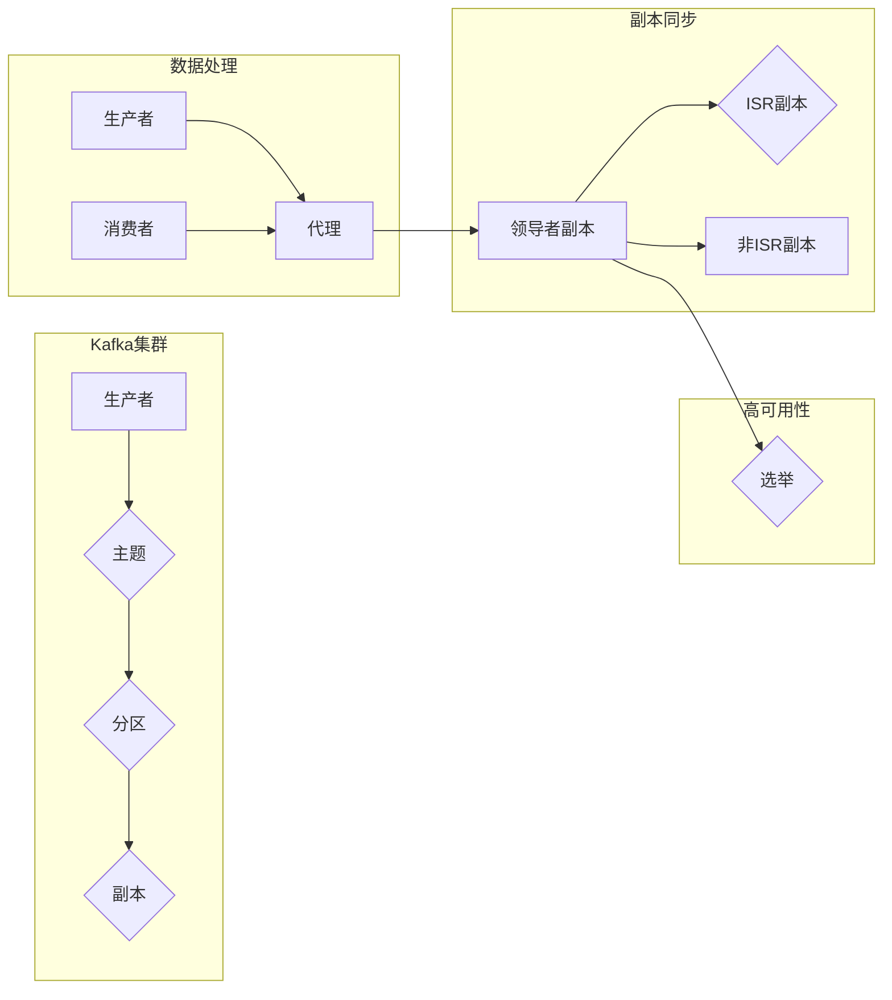

# Kafka原理与代码实例讲解

> 关键词：Apache Kafka，消息队列，分布式系统，高吞吐量，数据流，Kafka API，生产者，消费者，主题，分区

## 1. 背景介绍

随着互联网和大数据技术的快速发展，数据处理需求日益增长。传统的数据库管理系统在处理海量、高并发的数据写入和读取时，往往难以满足实际应用的需求。为了解决这一问题，消息队列系统应运而生。Apache Kafka作为一种高性能、可扩展的消息队列系统，已经成为分布式数据处理领域的佼佼者。

本文将深入解析Kafka的原理，并给出详细的代码实例讲解，帮助读者全面理解Kafka的架构、工作流程以及在实际应用中的使用方法。

## 2. 核心概念与联系

### 2.1 核心概念

- **主题（Topic）**：Kafka中消息的类别，类似于数据库中的表。
- **分区（Partition）**：每个主题可以划分为多个分区，分区可以分布在不同的Kafka节点上，提高并发写入和处理能力。
- **生产者（Producer）**：向Kafka发送消息的应用程序。
- **消费者（Consumer）**：从Kafka读取消息的应用程序。
- **代理（Broker）**：Kafka集群中的节点，负责存储和处理消息。
- **副本（Replica）**：为了保证数据的高可用性，Kafka使用副本机制，每个分区有多个副本。
- **ISR（In-Sync Replicas）**：副本集中与领导者副本同步的副本集合。
- **AR（Available Replicas）**：所有副本的集合。

### 2.2 架构流程图



### 2.3 核心概念联系

- 生产者向主题发送消息，消息被分配到对应的分区中。
- 分区可以有多个副本，分布在不同的代理上，提高系统的可扩展性和高可用性。
- 消费者从代理读取分区中的消息，进行处理。
- 代理之间通过副本机制保持数据一致性。

## 3. 核心算法原理 & 具体操作步骤

### 3.1 算法原理概述

Kafka使用分布式系统架构，通过以下核心算法实现高吞吐量和高可用性：

- **分区策略**：将消息均匀分配到不同的分区中，提高并发写入能力。
- **副本机制**：为每个分区维护多个副本，副本之间进行同步，保证数据的高可用性。
- **消息有序性**：保证同一分区内的消息顺序一致。
- **负载均衡**：自动平衡代理之间的负载，提高系统整体性能。

### 3.2 算法步骤详解

1. **生产者发送消息**：生产者将消息发送到Kafka集群，消息首先被发送到领导副本。
2. **副本同步**：领导副本将消息同步到ISR副本。
3. **消费者读取消息**：消费者从代理读取分区的消息，进行处理。
4. **副本备份**：如果领导者副本故障，系统将选举新的领导者副本。
5. **负载均衡**：Kafka集群根据代理的负载情况，动态调整分区的副本分配。

### 3.3 算法优缺点

**优点**：

- 高吞吐量：通过分区和副本机制，Kafka可以处理高并发的数据写入和读取。
- 高可用性：副本机制保证数据不丢失，即使部分代理故障，系统也能正常运行。
- 可扩展性：Kafka集群可以根据需求动态增加代理，提高系统性能。

**缺点**：

- 管理复杂：Kafka集群的管理和维护相对复杂，需要专业的运维人员。
- 顺序保证：Kafka保证同一分区内的消息顺序一致，但不同分区之间的消息顺序无法保证。

### 3.4 算法应用领域

Kafka广泛应用于以下领域：

- 日志收集：收集系统日志，进行实时监控和分析。
- 流处理：实时处理和分析数据流。
- 消息传递：实现系统之间的解耦和异步通信。
- 实时分析：实时分析用户行为、业务数据等。

## 4. 数学模型和公式 & 详细讲解 & 举例说明

### 4.1 数学模型构建

Kafka的数学模型可以简化为一个多生产者-多消费者模型，其中生产者和消费者分别对应不同的应用系统，主题和分区代表不同的数据流。

### 4.2 公式推导过程

假设有 $n$ 个生产者、$m$ 个消费者、$p$ 个分区，每个分区有 $r$ 个副本，则Kafka的数学模型可以表示为：

$$
P_i \rightarrow T_j \rightarrow C_k \rightarrow R_l
$$

其中 $P_i$ 表示第 $i$ 个生产者，$T_j$ 表示第 $j$ 个主题，$C_k$ 表示第 $k$ 个消费者，$R_l$ 表示第 $l$ 个副本。

### 4.3 案例分析与讲解

假设有3个生产者、2个消费者、4个分区、2个副本的Kafka集群，每个分区有2个副本。

- 生产者1发送消息到主题1，消息被分配到分区1，然后同步到副本1和副本2。
- 消费者1从代理1读取分区1的消息，进行处理。
- 如果代理1故障，则系统将选举代理2为新的领导者副本，消费者1从代理2读取分区1的消息。

## 5. 项目实践：代码实例和详细解释说明

### 5.1 开发环境搭建

在开始实践之前，需要搭建Kafka开发环境。以下是使用Docker快速搭建Kafka集群的步骤：

1. 安装Docker。
2. 下载Kafka Docker镜像：`docker pull confluentinc/cp-kafka:5.3.1`。
3. 启动Kafka集群：

```bash
docker run -d --name kafka1 -p 9092:9092 -e KAFKA_BROKER_ID=1 -e KAFKA_ZOOKEEPER_CONNECT=localhost:2181 -e KAFKA_ADVERTISED_LISTENERS=PLAINTEXT://localhost:9092 confluentinc/cp-kafka:5.3.1
docker run -d --name kafka2 -p 9093:9093 -e KAFKA_BROKER_ID=2 -e KAFKA_ZOOKEEPER_CONNECT=localhost:2181 -e KAFKA_ADVERTISED_LISTENERS=PLAINTEXT://localhost:9093 confluentinc/cp-kafka:5.3.1
```

### 5.2 源代码详细实现

以下是一个简单的Kafka生产者和消费者示例：

```python
from kafka import KafkaProducer, KafkaConsumer

# 生产者
producer = KafkaProducer(bootstrap_servers=['localhost:9092', 'localhost:9093'])
producer.send('test-topic', b'test-message')
producer.flush()

# 消费者
consumer = KafkaConsumer('test-topic', bootstrap_servers=['localhost:9092', 'localhost:9093'])
for message in consumer:
    print(message.value.decode('utf-8'))
```

### 5.3 代码解读与分析

- `KafkaProducer` 和 `KafkaConsumer` 分别用于创建生产者和消费者实例。
- `bootstrap_servers` 参数指定Kafka集群的地址列表。
- `send` 方法用于发送消息到指定主题。
- `flush` 方法用于刷新生产者缓冲区，确保消息被发送。
- `KafkaConsumer` 实例用于消费指定主题的消息。

### 5.4 运行结果展示

运行以上代码，将看到以下输出：

```
test-message
```

这表明生产者成功将消息发送到Kafka集群，消费者成功从集群中读取了消息。

## 6. 实际应用场景

### 6.1 日志收集

Kafka可以用于收集系统日志，实现实时监控和分析。以下是一个使用Kafka进行日志收集的示例：

1. 生产者从各个系统收集日志数据。
2. 日志数据发送到Kafka集群。
3. 消费者从Kafka集群中读取日志数据，进行分析和处理。

### 6.2 流处理

Kafka可以用于构建流处理系统，实现实时数据处理和分析。以下是一个使用Kafka进行流处理的示例：

1. 生产者将实时数据发送到Kafka集群。
2. 消费者从Kafka集群中读取实时数据，进行处理和分析。

### 6.3 消息传递

Kafka可以用于实现系统之间的解耦和异步通信。以下是一个使用Kafka进行消息传递的示例：

1. 生产者发送消息到Kafka集群。
2. 消费者从Kafka集群中读取消息，进行处理。
3. 处理结果通过Kafka集群发送给其他系统。

## 7. 工具和资源推荐

### 7.1 学习资源推荐

- 《Kafka权威指南》
- Kafka官方文档：https://kafka.apache.org/documentation/
- Apache Kafka社区：https://kafka.apache.org/community.html

### 7.2 开发工具推荐

- Kafka Manager：可视化Kafka集群管理工具
- Kafka Tools：Kafka命令行工具
- Kafka Streams：Kafka官方流处理框架

### 7.3 相关论文推荐

- Apache Kafka: A Distributed Messaging System for Log Processing
- Kafka: The Definitive Guide

## 8. 总结：未来发展趋势与挑战

### 8.1 研究成果总结

Kafka作为一种高性能、可扩展的消息队列系统，在分布式数据处理领域得到了广泛应用。其核心算法原理和架构设计为大数据处理提供了可靠的解决方案。

### 8.2 未来发展趋势

- Kafka将进一步提高性能和可扩展性，支持更大规模的数据处理。
- Kafka将与更多数据处理框架和工具集成，如Spark、Flink等。
- Kafka将更加注重安全性、可观测性和可管理性。

### 8.3 面临的挑战

- Kafka集群管理复杂，需要专业的运维人员。
- Kafka的跨集群数据迁移和分区管理仍需改进。
- Kafka的安全性和可观测性需要进一步提升。

### 8.4 研究展望

未来，Kafka将继续在分布式数据处理领域发挥重要作用，为构建高效、可靠的系统提供强有力的支持。同时，随着技术的发展，Kafka也将不断进化，迎接新的挑战和机遇。

## 9. 附录：常见问题与解答

**Q1：Kafka的吞吐量如何保证？**

A：Kafka通过分区机制和副本机制来保证高吞吐量。每个分区可以由多个副本组成，副本之间可以并行写入，从而提高系统的并发写入能力。

**Q2：Kafka如何保证消息的顺序性？**

A：Kafka保证同一分区内的消息顺序一致，但不同分区之间的消息顺序无法保证。如果需要保证全局顺序，可以将所有消息发送到同一个分区。

**Q3：Kafka如何保证数据的高可用性？**

A：Kafka使用副本机制来保证数据的高可用性。每个分区有多个副本，副本之间进行同步，即使部分副本故障，系统也能正常运行。

**Q4：Kafka如何进行负载均衡？**

A：Kafka通过动态调整分区的副本分配来实现负载均衡。系统会根据代理的负载情况，将分区的副本分配到负载较低的代理上。

作者：禅与计算机程序设计艺术 / Zen and the Art of Computer Programming