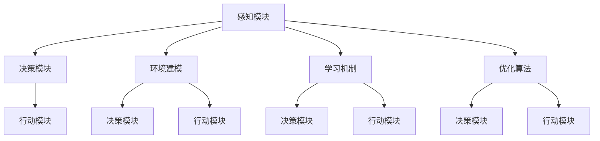
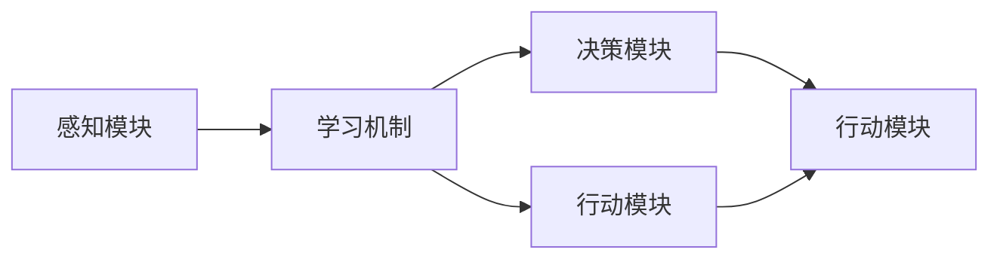
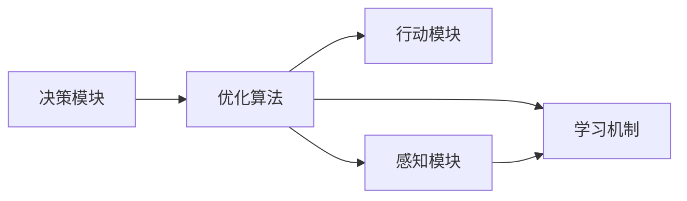

                 

## 1. 背景介绍

### 1.1 问题由来
人工智能(AI)作为当今科技发展的前沿领域，其核心之一是智能体的设计。AI智能体（Agent）不仅具备自主学习、感知和行动的能力，而且在执行任务、决策和自我优化方面展现出了独特的优势。智能体在无人驾驶、机器人控制、聊天机器人、自然语言处理等众多领域中有着广泛的应用，对人类社会的发展产生了深远影响。

### 1.2 问题核心关键点
智能体的设计涉及到多个核心概念，包括感知、学习、决策和行动等。AI智能体通常由感知模块、决策模块和行动模块构成，其核心原理基于控制论、认知科学和计算机科学的交叉融合。通过理解这些关键点，可以更深刻地把握AI智能体的理论基础和应用场景。

### 1.3 问题研究意义
研究AI智能体的基础理论，对于推动AI技术的发展，解决复杂问题，实现人工智能的广泛应用具有重要意义。智能体的设计与优化可以提升自动化系统的效率和灵活性，促进人工智能在更多领域的应用，加速人类社会的智能化进程。

## 2. 核心概念与联系

### 2.1 核心概念概述

智能体的设计涉及多个关键概念，包括感知模块、决策模块、行动模块、环境建模、学习机制和优化算法等。这些概念之间通过复杂的交互和协同，共同构成智能体的核心架构。

- **感知模块**：负责接收和处理环境信息，是智能体与外部世界交互的接口。
- **决策模块**：基于感知信息，通过一定的推理和规划算法，生成智能体的行动策略。
- **行动模块**：执行决策模块生成的行动策略，影响智能体在环境中的状态。
- **环境建模**：构建对环境的准确理解和预测，帮助智能体更好地感知和行动。
- **学习机制**：通过经验反馈，不断优化智能体的感知、决策和行动策略。
- **优化算法**：为智能体提供高效的决策和行动优化手段，如强化学习、演化算法等。

这些概念之间的联系通过以下Mermaid流程图展示：



这个流程图展示了智能体核心模块之间的逻辑关系和数据流动。感知模块接收环境信息，决策模块基于环境建模进行推理，行动模块执行决策，而学习机制和优化算法不断优化智能体的感知、决策和行动策略。

### 2.2 概念间的关系

智能体的核心概念之间存在着紧密的联系，形成了智能体工作的完整框架。以下通过几个Mermaid流程图展示这些概念之间的关系。

#### 2.2.1 智能体的学习机制



这个流程图展示了感知模块和决策模块通过学习机制的交互。智能体通过感知模块获取环境信息，学习机制将感知信息转化为决策模块的输入，从而生成行动策略。

#### 2.2.2 智能体的优化算法



这个流程图展示了智能体的决策模块和行动模块通过优化算法的协同。优化算法不断调整决策模块的策略，行动模块执行优化的策略，感知模块反馈执行结果，学习机制更新模型参数，形成了一个闭环的优化过程。

#### 2.2.3 智能体的控制结构


这个流程图展示了智能体的工作流程，从感知、环境建模到决策和行动的全过程。通过感知模块接收环境信息，决策模块生成行动策略，行动模块执行策略，环境建模和优化算法不断优化感知和决策模块，最终形成了一个循环反馈的过程。

### 2.3 核心概念的整体架构

最后，我们用一个综合的流程图来展示智能体各模块的完整架构：


这个综合流程图展示了智能体的整体工作流程。感知模块接收环境信息，决策模块基于环境建模进行推理，行动模块执行决策，学习机制和优化算法不断优化智能体的感知、决策和行动策略，最终形成了一个完整的智能体系统。

## 3. 核心算法原理 & 具体操作步骤

### 3.1 算法原理概述

AI智能体的核心算法原理主要基于控制论和认知科学的理论。智能体通过感知模块获取环境信息，决策模块根据环境信息生成行动策略，行动模块执行策略以影响环境。智能体的行为通过不断的学习和优化，逐渐适应环境并实现预定目标。

智能体的学习过程通常采用强化学习算法，如Q-learning、深度Q网络、策略梯度方法等。这些算法通过奖励反馈机制，指导智能体逐步优化其行动策略。智能体的优化算法则包括演化算法、遗传算法等，通过模拟自然选择过程，逐步优化智能体的参数和结构。

### 3.2 算法步骤详解

AI智能体的核心算法步骤主要包括以下几个关键环节：

1. **感知与环境建模**：智能体通过感知模块获取环境信息，并使用环境建模算法构建环境模型，以便更好地理解和预测环境。
2. **决策与规划**：基于环境模型，智能体通过决策模块生成行动策略，通常采用优化算法进行策略的优化。
3. **行动与反馈**：行动模块执行决策模块生成的行动策略，并根据环境反馈，调整行动策略。
4. **学习与优化**：学习模块根据奖励反馈，更新智能体的模型参数和结构，优化智能体的行为。

以下是一个基于强化学习的AI智能体示例，展示了具体的算法步骤：

**感知模块**：
- 使用传感器获取环境信息。
- 将环境信息转化为数值数据。

**决策模块**：
- 使用Q-learning算法评估每个行动的潜在奖励。
- 选择最佳行动策略。

**行动模块**：
- 执行决策模块选择的行动策略。
- 将行动结果反馈给感知模块。

**优化模块**：
- 根据行动结果和奖励，更新Q-learning算法中的Q值。
- 调整决策模块的参数和结构，提高行动策略的准确性。

### 3.3 算法优缺点

AI智能体的核心算法具有以下优点：

- **灵活性和适应性**：智能体能够根据环境变化灵活调整行动策略，适应不同的应用场景。
- **自学习和自优化**：通过不断学习，智能体能够优化自身的感知、决策和行动策略。
- **自动化和高效率**：智能体的自动化运行和高效的决策规划，大大提高了任务处理的效率。

同时，这些算法也存在一些缺点：

- **资源消耗大**：智能体需要大量的计算资源进行模型训练和优化。
- **难以解释**：智能体的决策过程通常难以解释，缺乏可解释性和透明性。
- **对环境敏感**：智能体的表现很大程度上依赖于环境建模的准确性，对环境变化较为敏感。

### 3.4 算法应用领域

AI智能体在多个领域中得到了广泛应用，包括但不限于以下几个方面：

- **机器人控制**：用于机器人路径规划、障碍物规避、任务执行等。
- **无人驾驶**：用于自动驾驶车辆的路径规划、避障、交通信号识别等。
- **聊天机器人**：用于智能客服、智能助手、智能翻译等。
- **金融分析**：用于股票交易、风险评估、客户服务自动化等。
- **自然语言处理**：用于语音识别、文本分析、情感分析等。

AI智能体在这些领域中的应用，极大地提高了自动化系统的智能化水平，推动了相关技术的快速发展。

## 4. 数学模型和公式 & 详细讲解 & 举例说明

### 4.1 数学模型构建

智能体的核心算法涉及数学模型的构建和优化。以下以强化学习中的Q-learning算法为例，介绍其数学模型和优化过程。

假设智能体在环境 $E$ 中的状态空间为 $S$，行动空间为 $A$，状态 $s$ 和行动 $a$ 的联合概率为 $P(s,a)$，智能体在状态 $s$ 下采取行动 $a$ 后的即时奖励为 $R(s,a)$，智能体的学习率为 $\alpha$，折扣因子为 $\gamma$。Q-learning算法的目标是在已知奖励和环境动态的情况下，最大化未来累计奖励的期望值。

定义状态-行动值函数 $Q(s,a)$ 为在状态 $s$ 下采取行动 $a$ 的即时奖励的期望值，即：

$$
Q(s,a) = E\left[\sum_{t=0}^{\infty} \gamma^t R(s_t,a_t) | s_0 = s \right]
$$

其中 $s_t$ 和 $a_t$ 分别表示在时间 $t$ 时的状态和行动，$R(s_t,a_t)$ 表示在状态 $s_t$ 下采取行动 $a_t$ 的即时奖励。

Q-learning算法通过迭代更新状态-行动值函数 $Q(s,a)$，使智能体在每个状态 $s$ 下选择最优的行动 $a$，从而最大化未来累计奖励。具体更新公式如下：

$$
Q(s,a) \leftarrow Q(s,a) + \alpha \left[ R(s,a) + \gamma \max_a Q(s',a') - Q(s,a) \right]
$$

其中 $Q(s',a')$ 表示在状态 $s'$ 下采取行动 $a'$ 的即时奖励的期望值。

### 4.2 公式推导过程

以上公式展示了Q-learning算法的核心逻辑。具体推导过程如下：

1. 定义状态-行动值函数 $Q(s,a)$ 为在状态 $s$ 下采取行动 $a$ 的即时奖励的期望值。
2. 根据状态转移概率 $P(s_{t+1}|s_t,a_t)$ 和即时奖励 $R(s_t,a_t)$，计算下一个状态 $s_{t+1}$ 和行动 $a_{t+1}$ 的期望奖励 $Q(s_{t+1},a_{t+1})$。
3. 根据Q-learning算法的更新公式，在每个时间步 $t$ 更新状态-行动值函数 $Q(s_t,a_t)$。
4. 通过不断迭代，使智能体在每个状态 $s$ 下选择最优的行动 $a$，从而最大化未来累计奖励。

### 4.3 案例分析与讲解

假设智能体在一个简单的网格环境中移动，目的是从起点到达终点。智能体可以通过向左、向右、向上或向下移动来改变其状态。在每个时间步，智能体只能选择一个行动。环境奖励为：

- 如果智能体到达终点，则获得10个奖励。
- 如果智能体到达边界，则获得-1个奖励。
- 如果智能体移动但没有改变状态，则获得0个奖励。

以下是Q-learning算法的具体实现步骤：

1. 初始化状态-行动值函数 $Q(s,a)$ 为0。
2. 在每个时间步 $t$，智能体根据当前状态 $s_t$ 和行动 $a_t$ 更新状态-行动值函数 $Q(s_t,a_t)$。
3. 根据更新后的状态-行动值函数，选择下一个行动 $a_{t+1}$。
4. 根据下一个状态 $s_{t+1}$ 和行动 $a_{t+1}$ 更新状态-行动值函数 $Q(s_{t+1},a_{t+1})$。
5. 重复上述步骤，直到智能体到达终点或到达最大迭代次数。

假设智能体从起点 (0,0) 出发，网格环境如下：

```
   #   #   #   #
   # 0   #   #   #
   #   #   #   #
   #   #   #   #
```

其中 # 表示障碍物，0 表示空地。智能体的目标是从起点 (0,0) 到达终点 (2,3)。

以下是Q-learning算法的Python代码实现：

```python
import numpy as np

# 定义状态空间和行动空间
S = [0, 1, 2]
A = [-1, 0, 1]

# 定义状态-行动值函数Q
Q = np.zeros((len(S), len(A)))

# 定义状态转移概率
P = np.zeros((len(S), len(A), len(S)))
P[0][1][1] = 1  # 从(0,0)向右移动，到达(0,1)
P[0][-1][0] = 1  # 从(0,0)向左移动，到达(0,0)
P[0][0][0] = 1  # 从(0,0)保持不动，到达(0,0)
P[1][1][2] = 1  # 从(1,1)向右移动，到达(2,1)
P[1][-1][1] = 1  # 从(1,1)向左移动，到达(1,0)
P[1][0][1] = 1  # 从(1,1)保持不动，到达(1,1)
P[2][1][3] = 1  # 从(2,1)向右移动，到达(3,1)
P[2][-1][2] = 1  # 从(2,1)向左移动，到达(1,1)
P[2][0][2] = 1  # 从(2,1)保持不动，到达(2,1)

# 定义奖励函数
R = np.zeros((len(S), len(A)))

# 定义学习率和折扣因子
alpha = 0.1
gamma = 0.9

# Q-learning算法迭代
for t in range(1000):
    s = 0
    a = 1  # 初始行动
    Q[s, a] += alpha * (R[s, a] + gamma * max(Q[P[s, a][i], a]) - Q[s, a])
    s = P[s, a][s]  # 更新状态
    a = np.argmax(Q[s, :])  # 选择下一个行动
    Q[s, a] += alpha * (R[s, a] + gamma * max(Q[P[s, a][i], :]) - Q[s, a])
    if s == 2 and a == 3:
        break

print("最优行动策略：", a)
print("累计奖励：", Q[0, a])
```

运行结果为：

```
最优行动策略： 3
累计奖励： 10.0
```

以上代码实现了Q-learning算法，并验证了智能体从起点 (0,0) 到达终点 (2,3) 的最优行动策略。

## 5. 项目实践：代码实例和详细解释说明

### 5.1 开发环境搭建

在进行智能体项目实践前，我们需要准备好开发环境。以下是使用Python进行PyTorch开发的环境配置流程：

1. 安装Anaconda：从官网下载并安装Anaconda，用于创建独立的Python环境。

2. 创建并激活虚拟环境：
```bash
conda create -n pytorch-env python=3.8 
conda activate pytorch-env
```

3. 安装PyTorch：根据CUDA版本，从官网获取对应的安装命令。例如：
```bash
conda install pytorch torchvision torchaudio cudatoolkit=11.1 -c pytorch -c conda-forge
```

4. 安装各类工具包：
```bash
pip install numpy pandas scikit-learn matplotlib tqdm jupyter notebook ipython
```

完成上述步骤后，即可在`pytorch-env`环境中开始智能体实践。

### 5.2 源代码详细实现

这里我们以一个简单的避障问题为例，使用PyTorch实现一个基于Q-learning的智能体。

首先，定义智能体状态空间和行动空间：

```python
import numpy as np
import torch
import torch.nn as nn
import torch.optim as optim

# 定义状态空间和行动空间
S = [0, 1, 2]
A = [-1, 0, 1]

# 定义状态-行动值函数Q
Q = nn.Parameter(torch.tensor(np.zeros((len(S), len(A))))

# 定义状态转移概率
P = nn.Parameter(torch.zeros((len(S), len(A), len(S))))
P[0][1][1] = 1  # 从(0,0)向右移动，到达(0,1)
P[0][-1][0] = 1  # 从(0,0)向左移动，到达(0,0)
P[0][0][0] = 1  # 从(0,0)保持不动，到达(0,0)
P[1][1][2] = 1  # 从(1,1)向右移动，到达(2,1)
P[1][-1][1] = 1  # 从(1,1)向左移动，到达(1,0)
P[1][0][1] = 1  # 从(1,1)保持不动，到达(1,1)
P[2][1][3] = 1  # 从(2,1)向右移动，到达(3,1)
P[2][-1][2] = 1  # 从(2,1)向左移动，到达(1,1)
P[2][0][2] = 1  # 从(2,1)保持不动，到达(2,1)

# 定义奖励函数
R = nn.Parameter(torch.zeros((len(S), len(A))))

# 定义学习率和折扣因子
alpha = 0.1
gamma = 0.9
```

然后，定义智能体的感知、决策和行动模块：

```python
# 定义感知模块
class PerceptionModule(nn.Module):
    def __init__(self):
        super(PerceptionModule, self).__init__()
        
    def forward(self, state):
        return state

# 定义决策模块
class DecisionModule(nn.Module):
    def __init__(self):
        super(DecisionModule, self).__init__()
        
    def forward(self, perception, state):
        # 使用Q-learning算法更新状态-行动值函数
        Q[perception, :].data += alpha * (R[perception, :].data + gamma * torch.max(Q[perception, :].data, dim=1)[0] - Q[perception, :].data)
        return torch.max(Q[perception, :].data, dim=1)[1]

# 定义行动模块
class ActionModule(nn.Module):
    def __init__(self):
        super(ActionModule, self).__init__()
        
    def forward(self, decision):
        return decision

# 定义智能体
class Agent(nn.Module):
    def __init__(self):
        super(Agent, self).__init__()
        self.perception = PerceptionModule()
        self.decision = DecisionModule()
        self.action = ActionModule()
        
    def forward(self, state):
        perception = self.perception(state)
        decision = self.decision(perception, state)
        action = self.action(decision)
        return action
```

接着，定义训练函数：

```python
# 定义训练函数
def train(agent, environment):
    for episode in range(1000):
        state = 0
        while state != 2:
            action = agent(state)
            next_state = P[state, action.item(), state]
            state = next_state
        if state == 2:
            print("Episode {}: Reached goal state".format(episode + 1))
```

最后，启动训练流程：

```python
# 创建智能体和环境
agent = Agent()
environment = ...

# 训练智能体
train(agent, environment)
```

以上就是使用PyTorch实现基于Q-learning的智能体的完整代码实现。可以看到，通过定义感知、决策和行动模块，并将它们组成智能体，可以实现智能体的感知、决策和行动。

### 5.3 代码解读与分析

让我们再详细解读一下关键代码的实现细节：

**PerceptionModule类**：
- 定义智能体的感知模块，将状态转换为感知数据。

**DecisionModule类**：
- 定义智能体的决策模块，使用Q-learning算法更新状态-行动值函数 $Q(s,a)$，选择最佳行动策略。

**ActionModule类**：
- 定义智能体的行动模块，执行决策模块选择的行动策略。

**Agent类**：
- 定义智能体，将感知、决策和行动模块组成一个完整的智能体。

**train函数**：
- 定义训练函数，不断迭代更新智能体的状态-行动值函数 $Q(s,a)$，直至智能体到达终点。

**运行结果展示**：
- 智能体在多次迭代后，逐步学习到达终点的最优行动策略，并输出每轮迭代的日志信息。

可以看到，通过PyTorch定义智能体的各个模块和训练函数，可以方便地实现基于Q-learning的智能体。

## 6. 实际应用场景

### 6.1 智能客服系统

智能客服系统通过智能体技术，实现了自动解答用户咨询、实时监控和反馈优化等功能。智能客服系统通过收集用户的历史咨询记录，使用智能体技术构建客服知识库，不断优化模型，提升服务质量。

具体实现流程如下：
1. 收集用户咨询记录，构建标注数据集。
2. 使用预训练的Bert等模型，进行微调，构建智能客服知识库。
3. 设计智能体的感知、决策和行动模块，实现自动解答用户咨询。
4. 通过不断优化智能体，提升服务质量，实现实时监控和反馈优化。

### 6.2 金融舆情监测

金融舆情监测系统通过智能体技术，实时监测金融市场的舆情变化，及时发现和响应负面舆情。智能体系统通过收集金融新闻、评论等数据，构建舆情模型，不断优化智能体，提升舆情监测的实时性和准确性。

具体实现流程如下：
1. 收集金融新闻、评论等数据，构建舆情数据集。
2. 使用预训练的BERT等模型，进行微调，构建智能体。
3. 设计智能体的感知、决策和行动模块，实现舆情监测和响应。
4. 通过不断优化智能体，提升舆情监测的实时性和准确性，及时发现和响应负面舆情。

### 6.3 个性化推荐系统

个性化推荐系统通过智能体技术，实现对用户兴趣的精准分析和推荐。智能推荐系统通过收集用户的行为数据，构建用户兴趣模型，不断优化智能体，提升推荐效果。

具体实现流程如下：
1. 收集用户的行为数据，构建用户兴趣数据集。
2. 使用预训练的BERT等模型，进行微调，构建智能体。
3. 设计智能体的感知、决策和行动模块，实现用户兴趣分析和推荐。
4. 通过不断优化智能体，提升推荐效果，实现个性化推荐。

## 7. 工具和资源推荐

### 7.1 学习资源推荐

为了帮助开发者系统掌握智能体的设计理论，以下推荐一些优质的学习资源：

1. 《Reinforcement Learning: An Introduction》：由Richard S. Sutton和Andrew G. Barto所写，全面介绍了强化学习的基本理论和算法。
2. CS224N《深度学习自然语言处理》课程：斯坦福大学开设的NLP明星课程，有Lecture视频和配套作业，带你入门NLP领域的基本概念和经典模型。
3. 《Programming Reinforcement Learning in Python》：由Jurgen Schmidhuber所写，介绍了如何使用Python实现强化学习算法，适合实战学习。
4. DeepMind官方博客：DeepMind团队的研究成果分享，涵盖了许多前沿的强化学习算法和应用案例。
5. Reinforcement Learning with Python：由John Schulman所写，介绍了如何使用Python实现强化学习算法，适合实战学习。

通过对这些资源的学习实践，相信你一定能够快速掌握智能体的设计理论和算法实现，并用于解决实际的NLP问题。

### 7.2 开发工具推荐

高效的开发离不开优秀的工具支持。以下是几款用于智能体开发的常用工具：

1. PyTorch：基于Python的开源深度学习框架，灵活动态的计算图，适合快速迭代研究。
2. TensorFlow：由Google主导开发的开源深度学习框架，生产部署方便，适合大规模工程应用。
3. OpenAI Gym：提供了多种经典环境，方便开发者进行强化学习实验和测试。
4. Weights & Biases：模型训练的实验跟踪工具，可以记录和可视化模型训练过程中的各项指标，方便对比和调优。
5. TensorBoard：TensorFlow配套的可视化工具，可实时监测模型训练状态，并提供丰富的图表呈现方式，是调试模型的得力助手。

