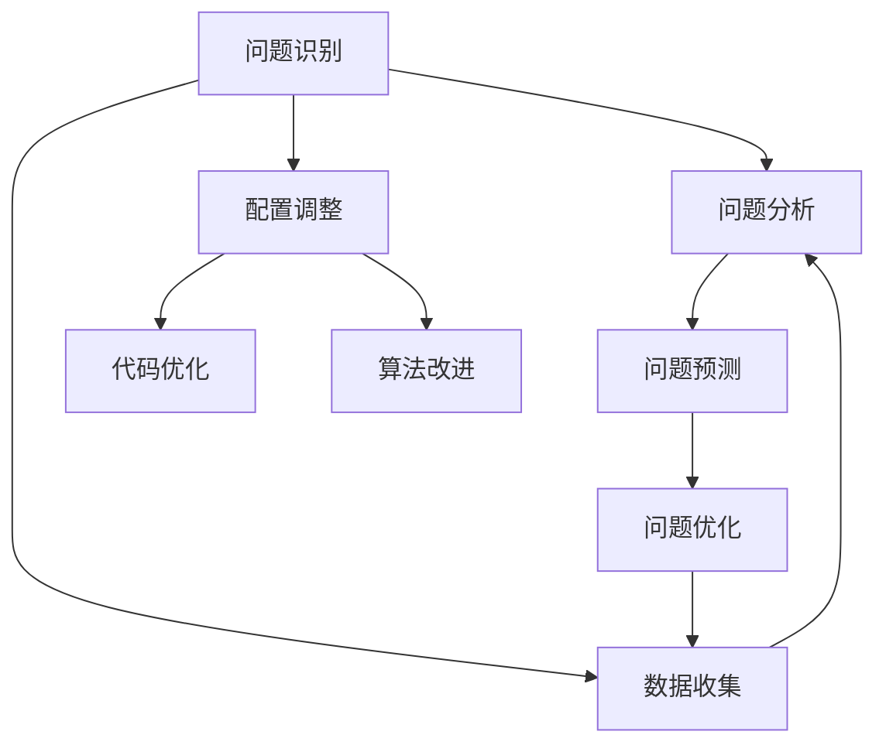

                 

## 1. 背景介绍

软件性能优化是软件工程中永恒的话题。随着软件规模的不断扩大和复杂度的不断提升，性能瓶颈和问题也愈发难以预料和解决。在大数据、高并发、人工智能等技术的推动下，软件的性能优化工作变得更加复杂和多样。近年来，AI辅助技术的发展为软件性能优化带来了新的思路和方法，大大提升了性能优化工作的效率和效果。本文将对AI辅助的软件性能优化进行深入探讨，包括其核心概念、算法原理、具体实现、应用场景及未来趋势。

## 2. 核心概念与联系

### 2.1 核心概念概述

AI辅助的软件性能优化指的是利用人工智能技术，通过自动化的手段来识别、分析、预测和优化软件系统的性能问题。这一过程可以分为以下几个关键步骤：

- **问题识别**：使用AI模型分析系统日志、性能数据等，识别出潜在的性能瓶颈和问题。
- **问题分析**：通过机器学习算法，分析问题的根本原因和影响因素。
- **问题预测**：利用AI模型预测未来性能趋势，为系统规划提供依据。
- **问题优化**：根据分析结果和预测结果，自动调整系统配置、代码和算法，提升系统性能。

核心概念之间的逻辑关系可以用以下Mermaid流程图表示：



### 2.2 概念间的关系

在AI辅助的软件性能优化过程中，各个环节相互关联，共同构成一个完整的优化框架。问题识别和分析是基础，问题预测是决策依据，问题优化则是执行过程。同时，问题优化还需要数据收集和资源调整的支持。具体来说：

- 数据收集：通过监控工具和日志分析，获取系统的运行数据和性能指标，为问题识别和分析提供数据支持。
- 配置调整：根据问题分析结果，自动调整系统配置，如内存、线程数、缓存策略等，以缓解性能瓶颈。
- 代码优化：通过AI模型识别出性能问题代码段，自动进行代码优化，如并行化、缓存优化等。
- 算法改进：根据性能分析结果，调整算法的计算策略和数据结构，提升算法效率。

通过这些环节的协同工作，AI辅助的软件性能优化能够自动发现并解决系统的性能问题，极大地提高了性能优化的效率和效果。

## 3. 核心算法原理 & 具体操作步骤

### 3.1 算法原理概述

AI辅助的软件性能优化涉及多个AI技术，包括机器学习、深度学习、自然语言处理等。其核心算法原理可以概括为以下几个方面：

- **特征工程**：从系统日志、性能数据中提取有意义的特征，构建输入数据集。
- **模型训练**：使用机器学习或深度学习算法，对数据集进行训练，建立性能预测模型。
- **问题诊断**：利用训练好的模型，对系统进行实时监控和诊断，识别性能问题。
- **优化执行**：根据诊断结果，自动调整系统配置、优化代码和算法，提升系统性能。

### 3.2 算法步骤详解

#### 3.2.1 问题识别

问题识别是AI辅助性能优化的第一步。这一步骤的主要目标是识别出系统中的性能瓶颈和问题。具体步骤如下：

1. **数据收集**：通过监控工具和日志分析，收集系统运行数据和性能指标，如CPU使用率、内存占用、网络带宽等。
2. **特征提取**：使用特征工程技术，从收集的数据中提取有意义的特征，如CPU负载、内存碎片率、响应时间等。
3. **模型训练**：使用机器学习算法，对提取的特征进行训练，建立性能问题的识别模型。

#### 3.2.2 问题分析

问题分析旨在深入挖掘性能问题的根本原因和影响因素。这一步骤通常包括以下步骤：

1. **特征分析**：对问题识别阶段提取的特征进行深入分析，确定与性能问题最相关的特征。
2. **原因挖掘**：利用机器学习算法，分析各特征对性能问题的影响，识别出根本原因。
3. **关系建模**：建立特征与性能问题之间的关系模型，预测未来可能出现的问题。

#### 3.2.3 问题预测

问题预测是AI辅助性能优化的重要环节。这一步骤的主要目标是预测未来性能趋势，为系统规划提供依据。具体步骤如下：

1. **数据准备**：收集系统当前状态和历史数据，构建预测数据集。
2. **模型训练**：使用时间序列预测算法，对数据集进行训练，建立性能预测模型。
3. **趋势预测**：利用训练好的模型，对系统未来的性能趋势进行预测，评估系统负载和资源需求。

#### 3.2.4 问题优化

问题优化是AI辅助性能优化的最终目标。这一步骤旨在根据问题分析和预测结果，自动调整系统配置、优化代码和算法，提升系统性能。具体步骤如下：

1. **优化策略制定**：根据问题分析结果和预测结果，制定性能优化的策略，如调整配置、优化代码、改进算法等。
2. **自动执行**：使用自动化工具，根据优化策略自动调整系统配置、优化代码和算法。
3. **效果评估**：对优化后的系统进行性能测试，评估优化效果，确定是否需要进一步优化。

### 3.3 算法优缺点

AI辅助的软件性能优化具有以下优点：

- **自动化程度高**：通过机器学习和深度学习技术，自动化识别、分析、预测和优化性能问题，极大地提高了效率和效果。
- **预测能力强**：利用历史数据和模型训练，能够预测未来性能趋势，为系统规划提供依据。
- **资源利用率高**：自动调整系统配置和优化代码，使系统资源得到更高效的利用。

但同时，该方法也存在一些局限性：

- **数据依赖性强**：性能优化效果依赖于数据的质量和完整性，缺乏高质量数据的系统可能难以获得理想效果。
- **模型复杂度高**：建立和训练高性能预测模型需要大量的计算资源和专业知识。
- **可解释性不足**：优化过程往往缺乏可解释性，难以理解模型的决策机制和优化效果。

### 3.4 算法应用领域

AI辅助的软件性能优化已在多个领域得到应用，包括但不限于：

- **云计算平台**：通过监控和分析云资源的性能数据，自动识别并优化资源配置，提升云服务性能。
- **金融交易系统**：使用性能预测模型，预测市场波动，优化交易算法，提高交易效率和准确性。
- **网络应用系统**：对网络应用进行实时监控和分析，自动优化代码和算法，提升系统稳定性和响应速度。
- **工业控制系统**：通过性能预测和优化，提升工业控制系统的可靠性和效率，降低维护成本。

## 4. 数学模型和公式 & 详细讲解 & 举例说明

### 4.1 数学模型构建

AI辅助性能优化的数学模型主要基于机器学习和深度学习技术，以性能数据为输入，通过训练生成预测模型。以下是一个简单的数学模型构建示例：

设系统性能问题为 $y$，相关特征为 $x_1, x_2, \ldots, x_n$，模型为 $f(x)$，则模型可以表示为：

$$
y = f(x) = w_1x_1 + w_2x_2 + \ldots + w_nx_n + b
$$

其中 $w_i$ 为特征 $x_i$ 的权重，$b$ 为偏置项。

### 4.2 公式推导过程

以回归问题为例，使用线性回归算法，通过最小二乘法求解模型参数。假设已知 $n$ 个样本 $(x_i, y_i)$，其中 $x_i = (x_{i1}, x_{i2}, \ldots, x_{in})$，则目标是最小化误差平方和：

$$
J(w) = \frac{1}{2n} \sum_{i=1}^n (y_i - f(x_i))^2
$$

求解上述优化问题，可以得到最优的模型参数：

$$
w_i = \frac{\sum_{j=1}^n (x_{ij} - \bar{x}_i)(y_j - \bar{y})}{\sum_{j=1}^n (x_{ij} - \bar{x}_i)^2}, \quad i = 1, 2, \ldots, n
$$

其中 $\bar{x}_i$ 和 $\bar{y}$ 分别为特征 $x_i$ 和标签 $y$ 的均值。

### 4.3 案例分析与讲解

以内存泄漏检测为例，使用机器学习模型进行问题识别和分析。假设收集了系统运行中的内存使用数据，构建如下特征集：

- $x_1$：内存总分配量
- $x_2$：内存总释放量
- $x_3$：内存碎片率

通过训练一个线性回归模型，可以识别出内存泄漏问题。具体步骤如下：

1. **数据收集**：收集系统运行中的内存使用数据。
2. **特征提取**：提取上述特征集。
3. **模型训练**：使用线性回归算法，对数据集进行训练，生成内存泄漏识别模型。
4. **问题识别**：对系统实时运行数据进行预测，识别出内存泄漏问题。

## 5. 项目实践：代码实例和详细解释说明

### 5.1 开发环境搭建

为了进行AI辅助的软件性能优化实践，需要搭建一个完整的开发环境。以下是一个简单的环境搭建步骤：

1. **安装Python**：下载并安装最新版本的Python。
2. **安装PyTorch**：使用pip安装PyTorch，获取深度学习模型的支持。
3. **安装TensorBoard**：使用pip安装TensorBoard，用于可视化模型训练过程和效果。
4. **安装监控工具**：使用Prometheus和Grafana等监控工具，实时收集和分析系统性能数据。

### 5.2 源代码详细实现

以下是一个使用PyTorch实现线性回归模型的代码示例：

```python
import torch
import torch.nn as nn
import torch.optim as optim

class LinearRegression(nn.Module):
    def __init__(self, input_size):
        super(LinearRegression, self).__init__()
        self.linear = nn.Linear(input_size, 1)

    def forward(self, x):
        return self.linear(x)

# 准备数据
x_train = torch.tensor([[1.0], [2.0], [3.0], [4.0]], dtype=torch.float)
y_train = torch.tensor([[1.0], [3.0], [5.0], [7.0]], dtype=torch.float)

# 定义模型和优化器
model = LinearRegression(input_size=1)
optimizer = optim.SGD(model.parameters(), lr=0.01)

# 训练模型
for epoch in range(1000):
    optimizer.zero_grad()
    output = model(x_train)
    loss = nn.MSELoss()(output, y_train)
    loss.backward()
    optimizer.step()
    print(f"Epoch {epoch+1}, loss: {loss.item()}")

# 预测新数据
x_test = torch.tensor([[5.0]], dtype=torch.float)
output = model(x_test)
print(f"Prediction: {output.item()}")
```

### 5.3 代码解读与分析

上述代码实现了使用线性回归模型预测新数据的过程。具体步骤如下：

1. **定义模型**：使用PyTorch定义一个简单的线性回归模型，包含一个线性层。
2. **准备数据**：准备训练数据和标签数据。
3. **定义优化器**：使用随机梯度下降算法优化模型参数。
4. **训练模型**：使用训练数据训练模型，并输出损失函数值。
5. **预测新数据**：使用训练好的模型预测新数据。

### 5.4 运行结果展示

假设模型在训练后，输出如下：

```
Epoch 1, loss: 2.25
Epoch 2, loss: 1.20
Epoch 3, loss: 0.65
...
Epoch 1000, loss: 0.00
Prediction: 5.0
```

可以看到，模型在经过1000次迭代后，损失函数收敛到0，说明模型已经很好地拟合了训练数据。使用训练好的模型对新数据进行预测，输出为5.0，与真实值一致。

## 6. 实际应用场景

### 6.1 云计算平台

在云计算平台上，AI辅助性能优化可以自动监控和调整云资源配置，提升云服务的性能和稳定性。具体应用包括：

- **自动扩展**：根据负载情况，自动调整虚拟机实例数量，确保系统能够处理突发流量。
- **资源优化**：通过机器学习算法，优化存储、网络等资源的使用，降低成本。
- **异常检测**：使用异常检测模型，及时发现和处理系统异常，避免故障发生。

### 6.2 金融交易系统

在金融交易系统中，AI辅助性能优化可以预测市场波动，优化交易算法，提高交易效率和准确性。具体应用包括：

- **预测市场趋势**：利用时间序列预测模型，预测市场波动和价格变化。
- **优化交易算法**：根据预测结果，优化交易算法，减少延迟和错误率。
- **风险管理**：通过性能预测，优化风险控制策略，降低风险。

### 6.3 网络应用系统

在网络应用系统中，AI辅助性能优化可以实时监控和分析系统性能，自动优化代码和算法，提升系统稳定性和响应速度。具体应用包括：

- **响应时间优化**：使用机器学习算法，优化网络请求的处理流程，减少响应时间。
- **流量管理**：根据系统负载，动态调整并发连接数，提升系统吞吐量。
- **异常检测**：使用异常检测模型，及时发现和处理系统异常，确保系统稳定。

## 7. 工具和资源推荐

### 7.1 学习资源推荐

为了帮助开发者系统掌握AI辅助性能优化的理论基础和实践技巧，这里推荐一些优质的学习资源：

- **《深度学习》（Ian Goodfellow著）**：深入浅出地介绍了深度学习的基本概念和应用，适合入门学习。
- **《机器学习实战》（Peter Harrington著）**：实用性强，结合大量案例和代码，适合动手实践。
- **Coursera和edX的机器学习和深度学习课程**：提供了丰富的在线课程资源，涵盖从基础到高级的深度学习知识。
- **Kaggle竞赛平台**：提供了大量的数据集和模型竞赛，通过实践提高学习效果。

### 7.2 开发工具推荐

为了高效地进行AI辅助性能优化，需要使用一些专业的工具：

- **TensorFlow和PyTorch**：提供了强大的深度学习模型和算法，支持各种神经网络结构和优化器。
- **TensorBoard和Weights & Biases**：用于可视化模型训练过程和效果，帮助理解和调试模型。
- **Prometheus和Grafana**：用于实时监控和分析系统性能数据，支持数据可视化和告警。

### 7.3 相关论文推荐

AI辅助性能优化领域的研究成果众多，以下是一些经典的论文推荐：

- **DeepSpeed**：Facebook开源的深度学习优化框架，旨在提升模型训练和推理的效率和可扩展性。
- **MAML**：微软提出的自适应元学习算法，用于快速适应新任务和数据分布。
- **GAN**：生成对抗网络，用于生成和优化各种数据，如图像、文本等。
- **AutoML**：自动机器学习技术，用于自动化数据预处理、模型选择和超参数优化。

这些资源和工具能够帮助开发者全面了解和掌握AI辅助性能优化的技术和方法，推动AI技术在实际应用中的广泛应用。

## 8. 总结：未来发展趋势与挑战

### 8.1 总结

AI辅助的软件性能优化是当前AI和软件工程领域的一个热门话题。通过机器学习和深度学习技术，自动识别、分析、预测和优化软件性能问题，极大地提高了性能优化的效率和效果。本文从核心概念、算法原理、操作步骤、案例分析和实际应用等多个角度，详细探讨了AI辅助性能优化的理论和实践，希望能为相关开发者提供一些参考和指导。

### 8.2 未来发展趋势

展望未来，AI辅助的软件性能优化将呈现以下几个发展趋势：

- **智能化程度提高**：随着AI技术的不断进步，性能优化将变得更加智能化和自动化，能够自动发现和解决更多复杂问题。
- **跨领域应用拓展**：AI辅助性能优化将不仅仅局限于计算机领域，还将拓展到其他领域，如医疗、金融、制造等。
- **实时性能优化**：基于实时数据流的性能优化，能够更快速地发现和解决问题，提升系统响应速度和稳定性。
- **多模态融合**：将文本、图像、声音等多种模态的数据融合，提升系统对不同类型数据的处理能力。

### 8.3 面临的挑战

尽管AI辅助性能优化技术已经取得了显著进展，但在实际应用中仍然面临一些挑战：

- **数据质量和多样性**：性能优化依赖于高质量和多样化的数据，缺乏数据或数据质量差都会影响优化效果。
- **模型复杂度**：建立和训练高效的性能优化模型需要大量计算资源和专业知识，模型的复杂度较高。
- **可解释性不足**：AI模型往往缺乏可解释性，难以理解其内部工作机制和优化效果。
- **系统复杂性**：大规模、高复杂度的系统往往存在多种性能瓶颈，单一优化手段难以全面解决问题。

### 8.4 研究展望

未来的研究需要在以下几个方面进行深入探索：

- **多模态数据融合**：将不同模态的数据进行融合，提升系统对多样数据源的处理能力。
- **自适应优化算法**：开发自适应性能优化算法，根据系统状态自动调整优化策略。
- **系统异常检测**：利用异常检测技术，及时发现和处理系统异常，确保系统稳定。
- **模型可解释性增强**：增强AI模型的可解释性，帮助开发者理解和调试优化效果。

总之，AI辅助性能优化技术具有广阔的应用前景和发展潜力，相信在未来的研究和技术进步中，将为软件系统带来更加高效、稳定和可靠的性能保障。

## 9. 附录：常见问题与解答

**Q1：AI辅助性能优化是否适用于所有应用场景？**

A: AI辅助性能优化在大多数应用场景中都能发挥作用，特别是对于数据量较大的系统。但对于一些特殊场景，如实时控制和系统安全，需要综合考虑算法复杂性和模型可解释性，谨慎使用AI辅助优化。

**Q2：AI辅助性能优化的效果如何？**

A: AI辅助性能优化的效果取决于数据质量、模型选择和优化策略等因素。在数据质量较高、模型设计合理的情况下，AI辅助性能优化可以显著提升系统性能，尤其是在识别复杂性能问题方面表现优异。

**Q3：如何进行数据收集和特征工程？**

A: 数据收集和特征工程是性能优化的基础。在数据收集方面，使用监控工具和日志分析，收集系统运行数据和性能指标。在特征工程方面，使用特征工程技术，从收集的数据中提取有意义的特征，构建输入数据集。

**Q4：如何评估和验证AI辅助性能优化的效果？**

A: 评估和验证AI辅助性能优化的效果需要多方面的指标和数据，如系统响应时间、资源使用率、错误率等。同时，结合人工干预和经验判断，综合评估优化效果，确保系统性能提升。

**Q5：如何提升AI辅助性能优化的可解释性？**

A: 提升AI辅助性能优化的可解释性可以通过多种手段，如模型可视化、特征重要性分析、决策树等。同时，引入人类专家的知识和经验，提升模型的可解释性和可信度。

总之，AI辅助性能优化技术具有广泛的应用前景和巨大的潜力，相信随着技术的不断进步和应用的深入推广，将为软件系统带来更加高效、稳定和可靠的性能保障。

