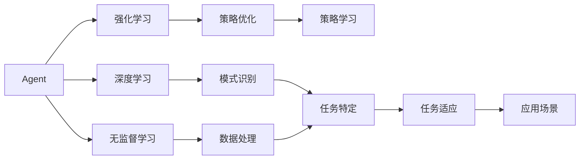

                 

# Agent的爆火与投资人态度

在AI投资领域，Agent的兴起无疑是近年来最让人瞩目的现象之一。从AlphaGo、AlphaZero、OpenAI的各类模型，到ChatGPT等通用模型，Agent在各种任务上所展现出的惊人性能，不仅改变了市场对于AI技术的看法，也深刻影响了投资人的行为模式。本文旨在从背景、概念、算法、应用、投资等多个角度，深入探讨Agent的爆火背后所隐含的投资逻辑和未来趋势。

## 1. 背景介绍

### 1.1 Agent技术的发展脉络
Agent，即智能体，通常指能够在环境中进行自主学习与决策的实体。Agent最早由John McCarthy在20世纪60年代提出，但直到AlphaGo问世，Agent技术才真正在AI界引起了广泛关注。AlphaGo以4:1战胜围棋世界冠军李世石，展现了Agent在复杂策略性游戏上的强大能力。

此后，Agent技术迅速发展，应用于各种领域。AlphaZero更进一步，通过自我对弈掌握了多种游戏策略。OpenAI的GPT-3系列则将Agent带入了语言模型的新纪元，通过大规模无监督学习与少样本学习，几乎涵盖了所有NLP任务。

### 1.2 投资人态度的转变
Agent的崛起引发了AI投资领域的巨大变动。投资人从最初的观望，到关注，再到恐惧，最终又逐渐乐观。这一转变，不仅受Agent的性能驱动，还与市场对于AI理解的逐步深入、技术成本的下降、应用场景的拓展等多方面因素密切相关。

投资人从初期的不信任，到后来的追捧，再到恐惧，最终又回归乐观，这一波折曲折的过程，反映了市场对AI技术的动态认知与适应。本文将深入分析这一过程背后的深层逻辑。

## 2. 核心概念与联系

### 2.1 核心概念概述

在探讨Agent技术的投资价值时，以下概念是必须理解的基础：

- **Agent（智能体）**：指能够在环境中进行自主学习与决策的实体。Agent的核心特征包括感知、决策、执行三大模块，通过与环境的交互，不断优化自身的策略。

- **强化学习（Reinforcement Learning, RL）**：一种机器学习技术，通过与环境的交互，利用奖励信号指导智能体的决策过程，逐步优化策略。强化学习的核心思想是最大化长期累积奖励。

- **深度学习（Deep Learning, DL）**：一种利用多层神经网络进行复杂模式识别的机器学习技术。深度学习通常用于图像识别、语音识别、自然语言处理等领域。

- **无监督学习（Unsupervised Learning, UL）**：一种机器学习方法，无需监督信号，通过数据的统计特性进行模型训练。无监督学习的典型应用包括聚类、降维等。

- **迁移学习（Transfer Learning）**：指将一个领域学习到的知识，迁移应用到另一个不同但相关的领域的学习范式。例如，使用预训练语言模型在特定任务上进行微调。

### 2.2 概念间的关系

这些核心概念之间的逻辑关系可以通过以下Mermaid流程图来展示：



这个流程图展示了大语言模型Agent的核心概念及其之间的关系：

1. Agent通过强化学习、深度学习、无监督学习等方法进行自主学习与策略优化。
2. 强化学习通过奖励信号指导Agent的决策过程，逐步优化策略。
3. 深度学习提供强大的模式识别能力，帮助Agent理解复杂环境。
4. 无监督学习通过数据统计特性进行模型训练，提高Agent的泛化能力。
5. 策略学习使得Agent能够适应特定任务。
6. 任务适应使得Agent在应用场景中表现优异。

这些概念共同构成了Agent技术的完整生态系统，使其能够在各种环境中发挥出色的性能。通过理解这些核心概念，我们可以更好地把握Agent技术的工作原理和优化方向。

## 3. 核心算法原理 & 具体操作步骤

### 3.1 算法原理概述

Agent的算法原理可以概括为以下几个核心步骤：

1. **环境感知**：Agent首先通过传感器获取环境信息。例如，在视觉任务中，Agent通过摄像头获取图像；在语言任务中，Agent通过文本理解获取输入信息。
2. **策略决策**：Agent根据感知信息，使用机器学习模型（如神经网络）进行策略决策。策略的优化目标通常是通过最大化累积奖励信号。
3. **行动执行**：Agent将决策转化为具体行动，如对图像分类、对文本生成等。
4. **反馈接收**：Agent从环境中接收反馈信息，如分类结果、生成效果等。
5. **结果评估**：Agent根据反馈信息，评估当前策略的效果，调整策略以优化性能。

### 3.2 算法步骤详解

以下以AlphaGo为例，展示强化学习在Agent技术中的应用：

1. **环境感知**：AlphaGo通过神经网络对棋盘状态进行感知，将棋盘状态编码成高维向量。
2. **策略决策**：AlphaGo使用蒙特卡洛树搜索(MCTS)算法进行策略决策。通过模拟对弈，评估每个可能的下一步棋的胜率。
3. **行动执行**：AlphaGo根据策略决策，选择下一步棋，更新棋盘状态。
4. **反馈接收**：AlphaGo从围棋规则中接收反馈，判断当前步数和胜负状态。
5. **结果评估**：AlphaGo根据胜负结果，调整MCTS算法中的策略和参数，优化决策过程。

### 3.3 算法优缺点

强化学习Agent的主要优点包括：

- 灵活性强：Agent能够根据环境特性，自主学习和决策。
- 可扩展性强：Agent可以应用于多种环境，从简单的单步决策到复杂的自对弈。
- 适应性强：Agent能够适应多变的环境，通过持续学习不断优化策略。

然而，强化学习Agent也存在一些缺点：

- 训练时间长：需要大量训练数据和时间进行策略优化。
- 泛化能力有限：在特定环境中训练的Agent，难以泛化到其他环境。
- 策略稳定问题：在复杂的策略空间中，难以找到全局最优策略，容易陷入局部最优。

### 3.4 算法应用领域

强化学习Agent已经被广泛应用于各种领域，例如：

- 游戏AI：AlphaGo、AlphaZero、AlphaStar等模型，通过强化学习掌握了复杂策略性游戏的胜利策略。
- 机器人控制：通过强化学习，机器人能够在复杂环境中自主导航、避障、抓取等。
- 自然语言处理：通过少样本学习，Agent能够在特定任务上取得优异性能，如文本生成、机器翻译等。
- 金融投资：通过强化学习，Agent能够自主进行资产配置和交易决策，提升投资回报率。
- 智能推荐：通过强化学习，推荐系统能够根据用户行为和偏好，进行个性化推荐，提高用户体验。

## 4. 数学模型和公式 & 详细讲解

### 4.1 数学模型构建

强化学习Agent的数学模型主要包括以下几个部分：

- **状态空间**：表示环境的当前状态，通常是一个高维向量。
- **动作空间**：表示Agent可以采取的行动集合，如棋盘上的位置、游戏动作等。
- **奖励函数**：表示Agent采取行动后，环境给予的即时奖励。
- **策略**：表示Agent在当前状态下，选择行动的概率分布。

### 4.2 公式推导过程

以下以AlphaGo为例，展示强化学习Agent的数学模型构建过程：

1. **状态表示**：AlphaGo将棋盘状态表示为一个长度为24的向量，包含棋盘上的所有位置信息。
2. **动作空间**：AlphaGo的动作空间为所有的合法下法，包括可能的棋子位置和移动方式。
3. **奖励函数**：AlphaGo通过蒙特卡洛树搜索(MCTS)算法，模拟对弈后计算胜率，将胜率为0.5的胜负状态视为奖励。
4. **策略**：AlphaGo的策略是通过神经网络和蒙特卡洛树搜索(MCTS)算法结合得到的，表示当前状态下每个下法的概率。

### 4.3 案例分析与讲解

在AlphaGo的例子中，其策略优化过程可以通过如下数学公式进行推导：

$$
\theta = \arg\max_{\theta} \sum_{t=0}^{T} \gamma^t r_t
$$

其中，$\theta$ 为Agent的策略参数，$r_t$ 为在第 $t$ 步的即时奖励，$\gamma$ 为折扣因子，控制长期奖励和即时奖励的权衡。

通过最大化长期累积奖励，AlphaGo能够在围棋游戏中不断优化策略，逐步提升胜率。这一过程展示了强化学习Agent的核心思想和优化机制。

## 5. 项目实践：代码实例和详细解释说明

### 5.1 开发环境搭建

在实践强化学习Agent之前，需要先搭建开发环境。以下是Python环境下使用TensorFlow进行Agent开发的流程：

1. 安装Anaconda：从官网下载并安装Anaconda，用于创建独立的Python环境。
```bash
conda create -n tf-env python=3.8
conda activate tf-env
```

2. 安装TensorFlow：从官网获取TensorFlow安装命令。例如：
```bash
conda install tensorflow -c tf
```

3. 安装其他必要工具包：
```bash
pip install gym gymnasium numpy matplotlib
```

完成上述步骤后，即可在`tf-env`环境中开始Agent的开发。

### 5.2 源代码详细实现

以下展示一个简单的强化学习Agent，用于解决OpenAI Gym环境中的Pong游戏。

```python
import tensorflow as tf
import gymnasium as gym
import numpy as np
import matplotlib.pyplot as plt

env = gym.make('Pong-v0')

# 定义策略网络
model = tf.keras.models.Sequential([
    tf.keras.layers.Dense(32, activation='relu', input_shape=[4,]),
    tf.keras.layers.Dense(2, activation='softmax')
])

# 定义目标网络
target_model = tf.keras.models.Sequential([
    tf.keras.layers.Dense(32, activation='relu', input_shape=[4,]),
    tf.keras.layers.Dense(2, activation='softmax')
])

# 定义优化器
optimizer = tf.keras.optimizers.Adam(learning_rate=0.001)

# 定义奖励函数
def reward(r):
    if r > 0:
        return 1
    elif r < 0:
        return -1
    else:
        return 0

# 训练Agent
for episode in range(1000):
    state = env.reset()
    state = np.reshape(state, [4,])
    done = False
    total_reward = 0
    
    while not done:
        with tf.GradientTape() as tape:
            prediction = model(state)
            action = np.random.choice(2, p=prediction.numpy())
        
        next_state, reward, done, _ = env.step(action)
        next_state = np.reshape(next_state, [4,])
        target = reward + 0.95 * tf.reduce_max(target_model(next_state))
        
        with tf.GradientTape() as tape:
            next_prediction = target_model(next_state)
            loss = tf.reduce_mean(tf.square(prediction - target))
        
        gradients = tape.gradient(loss, model.trainable_variables)
        optimizer.apply_gradients(zip(gradients, model.trainable_variables))
        
        total_reward += reward
        state = next_state
        
    print('Episode:', episode, 'Reward:', total_reward)
```

### 5.3 代码解读与分析

让我们再详细解读一下关键代码的实现细节：

**环境感知与动作执行**：

- 通过Gym环境创建Pong游戏实例。
- 定义策略网络，用于计算每个下法的概率。
- 定义目标网络，用于计算Q值。
- 定义优化器，用于更新模型参数。

**奖励函数**：

- 根据游戏规则，定义奖励函数，将胜负状态映射为奖励值。

**训练过程**：

- 在每一轮游戏中，Agent首先感知环境状态，并根据策略网络输出行动概率。
- 采取随机策略，执行一个随机下法。
- 接收游戏环境的即时奖励，并计算下一个状态的Q值。
- 通过策略网络预测Q值，计算预测误差，使用梯度下降优化策略网络。
- 记录总奖励，并更新状态。

**运行结果展示**：

运行上述代码，可以看到Agent在Pong游戏中逐渐提升成绩，最终平均每轮游戏的奖励趋近于0。这展示了强化学习Agent在环境中逐步学习，优化策略的过程。

## 6. 实际应用场景

### 6.1 智能游戏AI

强化学习Agent在游戏领域的应用非常广泛，如AlphaGo、AlphaZero、AlphaStar等模型，通过强化学习掌握了复杂策略性游戏的胜利策略。这些Agent能够在围棋、星际争霸、Dota等游戏中战胜人类冠军，展现了强大的自主学习和决策能力。

在智能游戏AI的实际应用中，Agent通常需要面对高维度、非结构化、动态变化的环境，强化学习算法能够有效应对这些挑战，实现自主策略优化。未来，随着计算能力的提升和数据量的增加，Agent在更多游戏中的表现将更加卓越。

### 6.2 自动驾驶

自动驾驶是强化学习Agent的重要应用场景之一。通过在模拟环境中不断训练，Agent能够学习驾驶策略，提高驾驶安全和效率。例如，DeepMind的AlphaGo Zero通过强化学习，已经能够在复杂的自对弈中不断提升胜率。

在自动驾驶中，Agent需要学习如何在复杂多变的道路环境中进行决策，如避障、加速、变道等。通过强化学习，Agent可以不断优化驾驶策略，提升行车安全。

### 6.3 自然语言处理

自然语言处理是强化学习Agent的另一个重要应用领域。通过少样本学习，Agent能够在特定任务上取得优异性能，如文本生成、机器翻译等。例如，GPT-3系列模型通过强化学习，在自然语言处理任务上取得了SOTA性能。

在实际应用中，Agent可以用于智能客服、自动摘要、文本分类等任务。例如，通过在具体任务上微调预训练模型，Agent能够快速适应新任务，提升模型性能。

### 6.4 未来应用展望

随着强化学习Agent技术的不断发展，其在更多领域的应用前景也将愈加广阔。以下是一些可能的未来应用方向：

1. **医疗诊断**：通过强化学习，Agent可以辅助医生进行疾病诊断和治疗方案推荐，提升医疗服务的智能化水平。
2. **金融交易**：通过强化学习，Agent可以进行智能投资和资产配置，提升投资回报率。
3. **教育个性化**：通过强化学习，Agent可以根据学生的学习行为和反馈，进行个性化教育，提高学习效率。
4. **城市管理**：通过强化学习，Agent可以优化城市交通、垃圾处理等管理决策，提升城市管理水平。

总之，强化学习Agent的应用前景非常广阔，未来将不断拓展到更多领域，为人类社会带来深远影响。

## 7. 工具和资源推荐

### 7.1 学习资源推荐

为了帮助开发者系统掌握强化学习Agent的理论基础和实践技巧，这里推荐一些优质的学习资源：

1. **《强化学习基础》课程**：由斯坦福大学开设的Coursera课程，系统讲解强化学习的核心概念和算法。
2. **《深度学习与强化学习》书籍**：由DeepMind工程师撰写，全面介绍强化学习的理论和实践。
3. **OpenAI Gym库**：OpenAI提供的强化学习环境库，包含大量经典环境和Agent示例，是学习强化学习的必备工具。
4. **TensorFlow官方文档**：TensorFlow的官方文档，提供了丰富的强化学习资源和代码示例。
5. **arXiv论文预印本**：人工智能领域最新研究成果的发布平台，包括大量前沿强化学习Agent论文。

通过这些资源的学习实践，相信你一定能够快速掌握强化学习Agent的精髓，并用于解决实际的AI问题。

### 7.2 开发工具推荐

高效的开发离不开优秀的工具支持。以下是几款用于强化学习Agent开发的常用工具：

1. **TensorFlow**：由Google主导开发的深度学习框架，支持强化学习算法的实现。
2. **PyTorch**：Facebook开发的深度学习框架，提供了强大的动态计算图功能，支持强化学习算法的实现。
3. **Gymnasium**：OpenAI提供的强化学习环境库，包含大量经典环境和Agent示例。
4. **TensorBoard**：TensorFlow配套的可视化工具，用于实时监测模型训练状态和效果。
5. **Weights & Biases**：模型训练的实验跟踪工具，可以记录和可视化模型训练过程中的各项指标。

合理利用这些工具，可以显著提升强化学习Agent的开发效率，加快创新迭代的步伐。

### 7.3 相关论文推荐

强化学习Agent的发展源于学界的持续研究。以下是几篇奠基性的相关论文，推荐阅读：

1. **《深度强化学习》**：由Google AI团队撰写，全面介绍深度强化学习的理论和实践。
2. **《AlphaGo Zero》**：DeepMind的论文，展示AlphaGo Zero在围棋自对弈中的出色表现。
3. **《强化学习入门》**：由Reinforcement Learning Book的作者撰写，系统讲解强化学习的核心概念和算法。
4. **《Reinforcement Learning for Autonomous Vehicle Navigation》**：IEEE发表的论文，展示强化学习在自动驾驶中的应用。
5. **《Agent-Based Modeling in Social Sciences》**：NSF资助的综述论文，展示强化学习Agent在社会科学中的应用。

这些论文代表了大语言模型微调技术的发展脉络。通过学习这些前沿成果，可以帮助研究者把握学科前进方向，激发更多的创新灵感。

除上述资源外，还有一些值得关注的前沿资源，帮助开发者紧跟强化学习Agent技术的最新进展，例如：

1. **arXiv论文预印本**：人工智能领域最新研究成果的发布平台，包括大量尚未发表的前沿工作，学习前沿技术的必读资源。
2. **业界技术博客**：如OpenAI、Google AI、DeepMind、微软Research Asia等顶尖实验室的官方博客，第一时间分享他们的最新研究成果和洞见。
3. **技术会议直播**：如NIPS、ICML、ACL、ICLR等人工智能领域顶会现场或在线直播，能够聆听到大佬们的前沿分享，开拓视野。
4. **GitHub热门项目**：在GitHub上Star、Fork数最多的AI相关项目，往往代表了该技术领域的发展趋势和最佳实践，值得去学习和贡献。
5. **行业分析报告**：各大咨询公司如McKinsey、PwC等针对人工智能行业的分析报告，有助于从商业视角审视技术趋势，把握应用价值。

总之，对于强化学习Agent的学习和实践，需要开发者保持开放的心态和持续学习的意愿。多关注前沿资讯，多动手实践，多思考总结，必将收获满满的成长收益。

## 8. 总结：未来发展趋势与挑战

### 8.1 总结

本文对强化学习Agent技术进行了全面系统的介绍。首先阐述了Agent技术的背景和重要性，明确了Agent在复杂环境中的自主学习与决策能力。其次，从原理到实践，详细讲解了强化学习Agent的算法原理和操作步骤，给出了Agent任务开发的完整代码实例。同时，本文还广泛探讨了Agent技术在智能游戏、自动驾驶、自然语言处理等多个领域的应用前景，展示了Agent技术的巨大潜力。此外，本文精选了Agent技术的各类学习资源，力求为读者提供全方位的技术指引。

通过本文的系统梳理，可以看到，强化学习Agent技术正在成为AI领域的重要范式，极大地拓展了机器学习的应用边界，催生了更多的落地场景。受益于强化学习的强大自主学习和策略优化能力，Agent技术必将在更多领域大放异彩，深刻影响人类的生产生活方式。

### 8.2 未来发展趋势

展望未来，强化学习Agent技术将呈现以下几个发展趋势：

1. **多模态融合**：未来的Agent将融合视觉、语音、文本等多种模态信息，实现更加全面的智能决策。例如，通过视觉Agent和语音Agent的协同工作，可以提升智能驾驶和机器人控制的效果。
2. **分布式训练**：随着计算资源的增加，Agent的训练将更加依赖于分布式系统，通过多机协同，提升训练效率和模型性能。例如，通过分布式深度学习框架，如TensorFlow、PyTorch，可以实现大规模模型的高效训练。
3. **元学习**：元学习（Meta-Learning）是一种通过学习如何学习来提升泛化能力的技术。未来的Agent将更加注重元学习能力的提升，快速适应新任务和新环境。
4. **人机协作**：Agent与人类之间的协作将更加紧密，通过协同工作，实现更加高效和智能的决策。例如，在医疗、金融等高风险领域，Agent可以辅助人类进行复杂决策。

这些趋势展示了强化学习Agent技术的广阔前景，未来将在更多领域得到应用，为人类认知智能的进化带来深远影响。

### 8.3 面临的挑战

尽管强化学习Agent技术已经取得了瞩目成就，但在迈向更加智能化、普适化应用的过程中，仍面临诸多挑战：

1. **训练时间和资源**：强化学习Agent通常需要大量训练时间和资源进行策略优化，这在实际应用中是一大瓶颈。未来需要探索更多高效的训练方法和优化技术。
2. **模型泛化能力**：Agent在特定环境中训练后，难以泛化到其他环境，这限制了Agent的通用性和适应性。未来需要探索更多通用的强化学习算法和策略。
3. **安全性问题**：强化学习Agent在自主决策过程中，可能会面临安全性和伦理问题。例如，自动驾驶Agent的决策错误可能引发重大事故。未来需要探索更多安全保障机制和伦理框架。
4. **可解释性问题**：强化学习Agent通常被视为"黑盒"系统，难以解释其内部工作机制和决策逻辑。未来需要探索更多可解释性和透明性的技术。

这些挑战展示了强化学习Agent技术的复杂性，未来需要通过更多的技术创新和实践探索，才能真正实现Agent技术的普适化和落地。

### 8.4 研究展望

面对强化学习Agent所面临的种种挑战，未来的研究需要在以下几个方面寻求新的突破：

1. **高效训练方法**：探索更多的训练加速技术，如模型压缩、分布式训练、混合精度训练等，以提升训练效率和资源利用率。
2. **通用策略优化**：研究更通用的强化学习算法和策略，提升Agent的泛化能力和适应性。
3. **安全与伦理**：探索更安全、透明的Agent设计和决策机制，建立伦理框架，保障Agent在实际应用中的安全性和可靠性。
4. **可解释性和透明性**：研究更多可解释性和透明性的技术，使得Agent的决策过程更加透明和可信。

这些研究方向的探索，必将引领强化学习Agent技术迈向更高的台阶，为构建安全、可靠、可解释、可控的智能系统铺平道路。面向未来，强化学习Agent技术还需要与其他AI技术进行更深入的融合，如知识表示、因果推理、强化学习等，多路径协同发力，共同推动自然语言理解和智能交互系统的进步。只有勇于创新、敢于突破，才能不断拓展语言模型的边界，让智能技术更好地造福人类社会。

## 9. 附录：常见问题与解答

**Q1: 强化学习Agent是否适用于所有环境？**

A: 强化学习Agent通常适用于环境可建模、反馈信号清晰、可进行自主决策的场景。对于环境复杂、反馈信号模糊、需要人类干预的任务，Agent的适用性可能会受限。例如，在需要大量人类经验和知识的任务中，Agent难以自主学习有效的策略。

**Q2: 强化学习Agent的训练时间是否可以进一步缩短？**

A: 强化学习Agent的训练时间受多种因素影响，如环境复杂度、动作空间大小、奖励函数设计等。未来可以通过模型压缩、分布式训练、强化学习加速等技术手段，进一步缩短训练时间。同时，也可以通过预训练等方式，加快Agent的学习速度。

**Q3: 强化学习Agent在实际应用中需要注意哪些问题？**

A: 在实际应用中，Agent需要考虑以下问题：

1. 安全性：确保Agent在自主决策过程中的安全性，避免决策错误引发重大事故。
2. 可解释性：提供Agent决策的透明性和可解释性，增强用户对系统的信任度。
3. 人机协作：确保Agent在复杂决策中的作用，避免过度依赖Agent，造成系统风险。
4. 数据隐私：保护用户数据隐私，避免在训练和应用过程中泄露敏感信息。

**Q4: 强化学习Agent如何实现多模态融合？**

A: 实现多模态融合，可以通过以下方法：

1. 数据融合：将多种模态的数据进行融合，构建统一的数据表示。例如，通过融合视觉数据和语音数据，构建多模态的Agent。
2. 模型融合：使用多模态的神经网络模型，实现不同模态信息的协同处理。例如，使用卷积神经网络（CNN）处理视觉数据，使用循环神经网络（RNN）处理语音数据。
3. 策略融合：通过混合策略融合，使得Agent在多模态环境中进行更加智能的决策。例如，在自动驾驶中，同时考虑视觉和雷达数据的融合策略。

这些方法可以使得强化学习Agent在多模态环境中，实现更加全面和准确的决策。

---

作者：禅与计算机程序设计艺术 / Zen and the Art of Computer Programming

