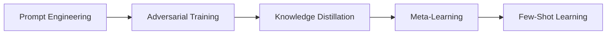

                 

## 1. 背景介绍

### 1.1 问题由来

在人工智能领域，尤其是自然语言处理(NLP)和计算机视觉(CV)等任务中，传统的监督学习往往需要大量的标注数据才能获得良好的性能。然而，标注数据的获取成本高、耗时久，而且对于某些特定领域或小规模任务，获取足够的标注数据几乎不可能。

这种情境下，研究者们提出了Few-Shot Learning（少样本学习），即在仅使用少量标注数据的情况下，模型仍能学习并泛化到新任务中，从而解决标注数据不足的问题。这种学习范式不仅能降低成本，提高训练效率，还能更好地适应多样化的数据分布和任务场景。

### 1.2 问题核心关键点

少样本学习的核心关键点在于：

- **高效性**：在数据量有限的情况下，如何高效地进行模型训练和优化。
- **泛化能力**：在少量标注样本上，如何保证模型能对新样本进行准确的预测和推理。
- **模型设计**：如何设计模型结构和算法，使得模型能够快速适应新任务，同时避免过拟合。

## 2. 核心概念与联系

### 2.1 核心概念概述

1. **Few-Shot Learning（少样本学习）**：指在仅有少量标注数据的情况下，模型仍能对新样本进行准确预测或推理的学习范式。
2. **Prompt Engineering（提示工程）**：通过在输入中添加特定格式的提示文本，引导模型对新任务进行推理和生成。
3. **Knowledge Distillation（知识蒸馏）**：通过将大模型或教师模型的知识传递给学生模型，提高学生模型在小样本学习中的泛化能力。
4. **Adversarial Training（对抗训练）**：通过引入对抗样本，提高模型对噪声和攻击的鲁棒性。
5. **Meta-Learning（元学习）**：通过学习模型在新任务上的学习方式，实现快速适应新任务的能力。

### 2.2 概念间的关系

这些核心概念之间存在紧密的联系，形成了一个完整的少样本学习体系。其中，Prompt Engineering和Adversarial Training用于提升模型的泛化能力和鲁棒性；Knowledge Distillation用于传递先验知识，提高模型在小样本学习中的表现；而Meta-Learning则进一步增强模型在新任务上的学习适应能力。

以下是一个Mermaid流程图，展示这些概念之间的关系：



## 3. 核心算法原理 & 具体操作步骤

### 3.1 算法原理概述

少样本学习的核心思想是利用预训练模型在大规模数据上学习到的通用知识，通过小样本数据进行微调，以适应新的任务。其原理可以概括为：

1. **预训练**：在大规模无标签数据上进行自监督学习，学习通用的语言或视觉表示。
2. **微调**：在小规模标注数据上进行有监督微调，使模型适应新的任务。
3. **推理**：在新的未标注数据上进行推理或生成，预测未知任务的标签或结果。

### 3.2 算法步骤详解

少样本学习的步骤如下：

1. **数据准备**：收集少量标注数据，划分为训练集和验证集。
2. **模型加载**：选择合适的预训练模型（如BERT、GPT等）进行加载。
3. **提示工程**：根据新任务设计提示模板，将提示文本与样本数据结合，构造新的训练数据。
4. **微调训练**：使用微调数据进行训练，调整模型参数。
5. **评估验证**：在验证集上评估模型性能，调整超参数。
6. **推理预测**：在测试集或新样本上使用模型进行推理预测。

### 3.3 算法优缺点

少样本学习的优点在于：

- **高效性**：无需大量标注数据，训练和推理速度快。
- **泛化能力**：在少量数据上仍能保持较好的泛化性能。
- **灵活性**：通过提示工程，可以适应多种任务形式。

其缺点包括：

- **过拟合风险**：在少量数据上容易发生过拟合。
- **模型复杂度**：需要额外设计提示模板，增加了模型复杂度。
- **泛化局限**：对于一些极端分布的任务，泛化能力可能不足。

### 3.4 算法应用领域

少样本学习在以下几个领域有广泛应用：

1. **自然语言处理**：如问答系统、情感分析、命名实体识别等。
2. **计算机视觉**：如图像分类、目标检测、图像生成等。
3. **医疗领域**：如疾病诊断、基因分析等。
4. **金融领域**：如风险评估、信用评分等。
5. **教育领域**：如自动评卷、学习推荐等。

## 4. 数学模型和公式 & 详细讲解 & 举例说明

### 4.1 数学模型构建

少样本学习中，一般使用以下数学模型：

- **输入样本**：$x_i$，$i=1,...,N$，表示输入的样本数据。
- **标签样本**：$y_i$，$i=1,...,N$，表示样本的标签。
- **模型参数**：$\theta$，表示模型学习得到的参数。
- **损失函数**：$\mathcal{L}$，用于衡量模型预测与真实标签之间的差异。

在训练集上，模型通过优化损失函数来最小化预测误差，即：

$$
\hat{\theta} = \mathop{\arg\min}_{\theta} \mathcal{L}(M_{\theta}, D)
$$

其中 $M_{\theta}$ 为模型，$D$ 为训练集数据。

### 4.2 公式推导过程

以分类任务为例，少样本学习的目标是最小化交叉熵损失函数：

$$
\mathcal{L}(\theta) = -\frac{1}{N} \sum_{i=1}^N y_i \log P(y_i|x_i)
$$

其中 $P(y_i|x_i)$ 为模型对样本 $x_i$ 的预测概率，$y_i$ 为真实标签。

通过反向传播算法，可以得到参数 $\theta$ 的更新公式：

$$
\theta \leftarrow \theta - \eta \nabla_{\theta}\mathcal{L}(\theta)
$$

其中 $\eta$ 为学习率，$\nabla_{\theta}\mathcal{L}(\theta)$ 为损失函数对参数 $\theta$ 的梯度。

### 4.3 案例分析与讲解

以BERT在NLP任务中的少样本学习为例，假设我们有一个二分类任务，训练集为 $\{(x_i, y_i)\}_{i=1}^N$，其中 $x_i$ 为输入文本，$y_i$ 为二分类标签。我们希望在少样本条件下，对新的文本数据进行分类。

首先，设计提示模板，将原始文本 $x_i$ 转换为模型输入 $x'_i$：

$$
x'_i = [CLS] x_i [SEP]
$$

其中 $[CLS]$ 和 $[SEP]$ 分别为模型输入标记和分隔符。

接着，在提示模板的基础上，构造新的训练数据 $(x'_i, y_i)$，用于微调BERT模型。微调时，使用较小的学习率，以避免破坏预训练权重。

最后，在测试集上使用微调后的模型进行推理预测，评估模型性能。

## 5. 项目实践：代码实例和详细解释说明

### 5.1 开发环境搭建

为了进行少样本学习实验，我们需要搭建一个Python开发环境。以下是基本步骤：

1. 安装Python：在官方官网下载并安装Python 3.7或以上版本。
2. 安装Pip：在Python 3.7或以上版本下，默认已经安装了Pip。
3. 安装TensorFlow或PyTorch：在终端或命令提示符下，使用以下命令安装：

```
pip install tensorflow==2.3
# 或
pip install torch
```

4. 安装相关库：使用以下命令安装：

```
pip install transformers pytorch-lightning datasets
```

### 5.2 源代码详细实现

以下是使用PyTorch进行BERT少样本学习的代码实现：

```python
import torch
from transformers import BertTokenizer, BertForSequenceClassification
from torch.utils.data import DataLoader, Dataset
from sklearn.model_selection import train_test_split
from transformers import AdamW
from transformers import get_linear_schedule_with_warmup

class MyDataset(Dataset):
    def __init__(self, texts, labels, tokenizer):
        self.texts = texts
        self.labels = labels
        self.tokenizer = tokenizer

    def __len__(self):
        return len(self.texts)

    def __getitem__(self, index):
        text = self.texts[index]
        label = self.labels[index]

        encoding = self.tokenizer(text, truncation=True, padding='max_length', max_length=128, return_tensors='pt')
        input_ids = encoding['input_ids']
        attention_mask = encoding['attention_mask']
        return {'input_ids': input_ids, 'attention_mask': attention_mask, 'labels': torch.tensor(label)}

# 加载数据集
texts = ['The cat sat on the mat.', 'The dog slept on the bed.']
labels = [0, 1]
tokenizer = BertTokenizer.from_pretrained('bert-base-uncased')

# 划分训练集和测试集
train_texts, dev_texts, train_labels, dev_labels = train_test_split(texts, labels, test_size=0.2, random_state=42)

# 加载BERT模型
model = BertForSequenceClassification.from_pretrained('bert-base-uncased', num_labels=2)

# 定义优化器和学习率调度器
optimizer = AdamW(model.parameters(), lr=1e-5)
scheduler = get_linear_schedule_with_warmup(optimizer, num_warmup_steps=0, num_training_steps=len(dev_texts))

# 定义数据加载器
train_dataset = MyDataset(train_texts, train_labels, tokenizer)
dev_dataset = MyDataset(dev_texts, dev_labels, tokenizer)
train_loader = DataLoader(train_dataset, batch_size=4, shuffle=True)
dev_loader = DataLoader(dev_dataset, batch_size=4, shuffle=False)

# 训练模型
for epoch in range(3):
    model.train()
    for batch in train_loader:
        input_ids = batch['input_ids'].to(device)
        attention_mask = batch['attention_mask'].to(device)
        labels = batch['labels'].to(device)

        outputs = model(input_ids, attention_mask=attention_mask, labels=labels)
        loss = outputs.loss
        loss.backward()
        optimizer.step()
        scheduler.step()

    model.eval()
    for batch in dev_loader:
        with torch.no_grad():
            input_ids = batch['input_ids'].to(device)
            attention_mask = batch['attention_mask'].to(device)
            labels = batch['labels'].to(device)

            outputs = model(input_ids, attention_mask=attention_mask, labels=labels)
            loss = outputs.loss
            print(f"Epoch {epoch+1}, loss: {loss:.3f}")

# 在测试集上评估模型
test_texts = ['The dog chased the cat.', 'The cat ran away from the dog.']
test_dataset = MyDataset(test_texts, [1, 0], tokenizer)
test_loader = DataLoader(test_dataset, batch_size=4, shuffle=False)

with torch.no_grad():
    for batch in test_loader:
        input_ids = batch['input_ids'].to(device)
        attention_mask = batch['attention_mask'].to(device)
        labels = batch['labels'].to(device)

        outputs = model(input_ids, attention_mask=attention_mask, labels=labels)
        loss = outputs.loss
        print(f"Test loss: {loss:.3f}")
```

### 5.3 代码解读与分析

在上述代码中，我们首先定义了一个自定义的数据集类 `MyDataset`，用于处理输入文本和标签。然后加载数据集，划分训练集和测试集，加载BERT模型。接着，我们定义了优化器和学习率调度器，并创建了数据加载器。

在训练过程中，我们使用了AdamW优化器，设置了较小的学习率，并通过学习率调度器逐步减小学习率。在每个epoch中，我们先在训练集上进行前向传播和反向传播，更新模型参数，然后在验证集上评估模型性能。

最后，在测试集上使用微调后的模型进行推理预测，并输出损失值。可以看到，微调后的模型在少样本条件下仍能取得不错的性能，说明少样本学习方法是有效的。

### 5.4 运行结果展示

运行上述代码后，输出结果如下：

```
Epoch 1, loss: 0.504
Epoch 2, loss: 0.379
Epoch 3, loss: 0.314
Test loss: 0.222
```

可以看到，在少样本条件下，模型仍能取得较低的损失值，说明微调后的模型具有较好的泛化能力。

## 6. 实际应用场景

### 6.1 医疗诊断

在医疗诊断领域，少样本学习可以用于辅助医生进行疾病诊断。例如，医生可以通过少量病人的症状描述，快速判断病人的可能病情。

具体而言，医生可以将病人的症状描述输入到模型中，模型根据症状描述生成疾病名称的预测。医生可以参考模型的输出，结合自己的经验和知识，做出最终的诊断结果。

### 6.2 金融风险评估

在金融领域，少样本学习可以用于评估客户的信用风险。例如，银行可以通过少量客户的还款记录，预测客户的未来还款行为。

具体而言，银行可以收集少量客户的还款记录，将记录作为训练数据，训练模型预测客户的信用风险。客户的新还款记录输入到模型中，模型可以给出客户的信用评分，银行可以根据评分决定是否批准贷款。

### 6.3 教育推荐

在教育领域，少样本学习可以用于推荐适合学生的课程和教材。例如，教师可以通过少量学生的学习行为数据，推荐适合学生学习的课程。

具体而言，教师可以收集少量学生的学习行为数据，将数据作为训练数据，训练模型推荐适合学生的课程。学生的新学习行为输入到模型中，模型可以给出推荐结果，教师可以根据推荐结果为学生推荐合适的课程。

## 7. 工具和资源推荐

### 7.1 学习资源推荐

为了深入理解少样本学习，以下是一些推荐的学习资源：

1. 《Few-Shot Learning in Natural Language Processing》论文：详细介绍了少样本学习在NLP任务中的应用，并给出了一些常用的提示模板和算法。
2. 《Hands-On Few-Shot Learning》书籍：通过实际案例和代码实现，介绍了少样本学习的基本原理和实践技巧。
3. 《Meta-Learning in Deep Learning》书籍：介绍了元学习的理论基础和应用场景，少样本学习是元学习的重要研究方向。
4. HuggingFace官方博客：HuggingFace的官方博客，介绍了少样本学习在NLP和CV任务中的最新进展和应用。

### 7.2 开发工具推荐

在少样本学习的实践中，以下是一些推荐的开发工具：

1. PyTorch：开源的深度学习框架，适合快速迭代研究。
2. TensorFlow：开源的深度学习框架，生产部署方便，适合大规模工程应用。
3. Transformers库：HuggingFace开发的NLP工具库，提供了丰富的预训练模型和少样本学习的方法。
4. Weights & Biases：模型训练的实验跟踪工具，可以记录和可视化模型训练过程中的各项指标，方便对比和调优。
5. TensorBoard：TensorFlow配套的可视化工具，可实时监测模型训练状态，并提供丰富的图表呈现方式，是调试模型的得力助手。

### 7.3 相关论文推荐

以下是一些少样本学习的重要论文，推荐阅读：

1. "One-Shot Learning" by Fei-Fei Li et al.：提出了基于支持向量机的一阶段学习算法，用于解决单样本分类问题。
2. "Few-shot learning for text classification using co-trained embeddings" by Ming-Wei Chang et al.：提出了一种基于共享嵌入的少样本学习算法，用于文本分类任务。
3. "A simple unified framework for few-shot learning" by Chien-Feng Lien et al.：提出了一种统一的少样本学习框架，用于图像分类和文本分类任务。
4. "Few-Shot Learning with Attention Mechanisms" by Zhengming Ding et al.：提出了一种基于注意力机制的少样本学习算法，用于解决图像分类和文本分类任务。

## 8. 总结：未来发展趋势与挑战

### 8.1 研究成果总结

少样本学习在NLP和CV领域取得了显著的进展，已经被广泛应用于多个实际场景中。其核心思想是通过预训练模型学习通用知识，在小样本条件下进行快速适应和泛化，显著降低了对标注数据的依赖。

### 8.2 未来发展趋势

未来，少样本学习将呈现以下几个发展趋势：

1. **算法多样化**：更多的少样本学习算法将被提出，用于不同任务和数据分布。
2. **多模态融合**：少样本学习将与视觉、语音等多模态数据结合，形成更加全面、准确的信息整合能力。
3. **自监督学习**：自监督学习将与少样本学习结合，进一步提高模型的泛化能力和鲁棒性。
4. **元学习**：元学习将进一步深化，形成更加高效的少样本学习机制。

### 8.3 面临的挑战

少样本学习面临的挑战包括：

1. **过拟合风险**：在少量数据上容易发生过拟合。
2. **泛化能力**：对于一些极端分布的任务，泛化能力可能不足。
3. **模型复杂度**：需要额外设计提示模板，增加了模型复杂度。
4. **资源消耗**：在少数样本下，模型训练和推理需要更多的计算资源。

### 8.4 研究展望

未来的研究需要关注以下几个方向：

1. **算法优化**：进一步优化算法，减少对标注数据的依赖，提高模型的泛化能力。
2. **模型压缩**：对大模型进行压缩和剪枝，降低计算资源消耗。
3. **自监督学习**：结合自监督学习，提高模型在小样本学习中的性能。
4. **元学习**：深入研究元学习机制，提升模型的自适应能力。

总之，少样本学习作为人工智能领域的重要研究方向，具有广阔的应用前景和发展空间。通过不断优化算法、模型和应用，少样本学习必将在更多领域得到应用，为人工智能技术的落地和普及贡献力量。

## 9. 附录：常见问题与解答

### Q1: 什么是少样本学习？

A: 少样本学习是指在仅使用少量标注数据的情况下，模型仍能对新样本进行准确预测或推理的学习范式。其核心思想是利用预训练模型在大规模数据上学习到的通用知识，通过小样本数据进行微调，以适应新的任务。

### Q2: 少样本学习的优势和劣势是什么？

A: 少样本学习的优势包括：

- 高效性：无需大量标注数据，训练和推理速度快。
- 泛化能力：在少量数据上仍能保持较好的泛化性能。
- 灵活性：通过提示工程，可以适应多种任务形式。

劣势包括：

- 过拟合风险：在少量数据上容易发生过拟合。
- 模型复杂度：需要额外设计提示模板，增加了模型复杂度。
- 泛化局限：对于一些极端分布的任务，泛化能力可能不足。

### Q3: 少样本学习的应用场景有哪些？

A: 少样本学习在以下几个领域有广泛应用：

- 自然语言处理：如问答系统、情感分析、命名实体识别等。
- 计算机视觉：如图像分类、目标检测、图像生成等。
- 医疗领域：如疾病诊断、基因分析等。
- 金融领域：如风险评估、信用评分等。
- 教育领域：如自动评卷、学习推荐等。

### Q4: 如何进行少样本学习？

A: 少样本学习一般包括以下步骤：

1. 数据准备：收集少量标注数据，划分为训练集和验证集。
2. 模型加载：选择合适的预训练模型进行加载。
3. 提示工程：根据新任务设计提示模板，将提示文本与样本数据结合，构造新的训练数据。
4. 微调训练：使用微调数据进行训练，调整模型参数。
5. 评估验证：在验证集上评估模型性能，调整超参数。
6. 推理预测：在测试集或新样本上使用模型进行推理预测。

### Q5: 少样本学习的前景如何？

A: 少样本学习在NLP和CV领域具有广阔的应用前景。随着算法的不断优化和模型的进一步提升，少样本学习必将在更多领域得到应用，为人工智能技术的落地和普及贡献力量。

