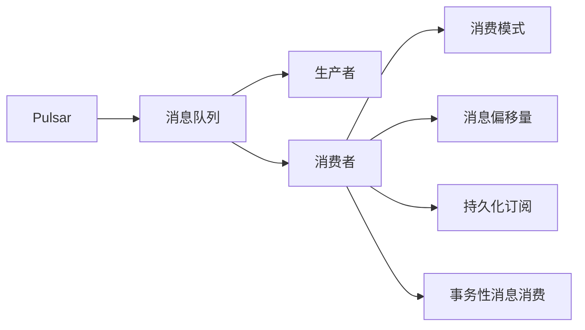

# Pulsar Consumer原理与代码实例讲解

作者：禅与计算机程序设计艺术 / Zen and the Art of Computer Programming

## 1. 背景介绍
### 1.1 问题的由来

随着大数据和实时计算技术的快速发展，分布式消息队列系统在数据处理和流式计算领域扮演着越来越重要的角色。Apache Pulsar 是一个开源的分布式发布-订阅消息传递系统，它具有高吞吐量、低延迟、高可用性、可扩展性等优点，被广泛应用于各种场景，如大数据处理、实时计算、微服务架构等。

在Pulsar中，生产者和消费者是消息队列系统的核心组件。生产者负责将消息发送到消息队列，而消费者则负责从消息队列中读取消息进行处理。Pulsar Consumer是Pulsar中用于消息消费的组件，它提供了丰富的API和灵活的消费模式，可以满足不同场景下的消息消费需求。

### 1.2 研究现状

目前，Pulsar Consumer已经成为分布式消息队列系统中非常重要的一个组件。随着Pulsar社区的不断发展，Pulsar Consumer的API和功能也在不断丰富和完善。以下是一些Pulsar Consumer的研究现状：

- **多种消费模式**：Pulsar Consumer支持多种消费模式，包括拉取模式（Pull）、推送模式（Push）和直接模式（Direct）。
- **持久化订阅**：Pulsar Consumer支持持久化订阅，确保消息消费的可靠性和一致性。
- **事务性消息消费**：Pulsar Consumer支持事务性消息消费，保证消息消费的原子性。
- **灵活的消息过滤**：Pulsar Consumer支持多种消息过滤方式，如键值过滤、函数过滤等。
- **消息偏移量管理**：Pulsar Consumer可以精确控制消息的消费偏移量，支持精确重试和消息回溯。

### 1.3 研究意义

深入研究Pulsar Consumer的原理和用法，对于开发者和架构师来说具有重要的意义：

- **提高消息消费效率**：通过合理配置Pulsar Consumer，可以提高消息消费的效率和吞吐量。
- **保证消息消费的一致性**：通过事务性消息消费和持久化订阅，可以保证消息消费的一致性和可靠性。
- **降低系统复杂度**：Pulsar Consumer提供的丰富API和灵活的消费模式，可以降低系统开发难度。
- **提高系统可扩展性**：Pulsar Consumer可以方便地集成到各种分布式系统中，提高系统的可扩展性。

### 1.4 本文结构

本文将围绕Pulsar Consumer展开，详细介绍其原理、用法和最佳实践。具体内容如下：

- 第2章将介绍Pulsar Consumer的核心概念和联系。
- 第3章将阐述Pulsar Consumer的原理和具体操作步骤。
- 第4章将分析Pulsar Consumer的数学模型和公式，并结合实例进行讲解。
- 第5章将给出Pulsar Consumer的代码实例和详细解释说明。
- 第6章将探讨Pulsar Consumer的实际应用场景和未来应用展望。
- 第7章将推荐Pulsar Consumer相关的学习资源、开发工具和参考文献。
- 第8章将总结Pulsar Consumer的未来发展趋势与挑战。
- 第9章将列出常见问题与解答。

## 2. 核心概念与联系

为了更好地理解Pulsar Consumer，本节将介绍几个核心概念：

- **Pulsar**：Apache Pulsar是一个开源的分布式发布-订阅消息传递系统，具备高吞吐量、低延迟、高可用性、可扩展性等优点。
- **消息队列**：消息队列是一种实现异步通信的中间件，用于在分布式系统中隔离消息的生产者和消费者，实现解耦。
- **生产者**：生产者负责将消息发送到消息队列。
- **消费者**：消费者负责从消息队列中读取消息进行处理。
- **消费模式**：消费者从消息队列中读取消息的方式，包括拉取模式、推送模式和直接模式。
- **消息偏移量**：消息在消息队列中的位置，用于记录消息消费的进度。
- **持久化订阅**：消费者订阅的消息持久化存储在Pulsar中，即使消费者断开连接，也不会丢失订阅信息。
- **事务性消息消费**：消费者在消费消息时，可以发起事务，保证消息消费的原子性。

以下为这些概念之间的逻辑关系：



可以看出，Pulsar是一个消息队列系统，生产者和消费者通过消息队列进行异步通信。消费者可以选择不同的消费模式，并可以设置消息偏移量和持久化订阅。此外，消费者还可以发起事务性消息消费，保证消息消费的原子性。

## 3. 核心算法原理 & 具体操作步骤
### 3.1 算法原理概述

Pulsar Consumer的核心算法原理是通过订阅消息队列中的消息，并按照消费模式进行消息的消费。以下是Pulsar Consumer的主要工作流程：

1. 创建消费者实例。
2. 订阅消息队列。
3. 消费消息。
4. 处理消息。
5. 确认消息消费。

### 3.2 算法步骤详解

以下是Pulsar Consumer的具体操作步骤：

1. **创建消费者实例**：首先需要创建一个消费者实例，指定主题名称和订阅名称。主题名称是消息队列的名称，订阅名称是消费者订阅的主题分支。

2. **订阅消息队列**：创建消费者实例后，需要调用`subscribe`方法订阅消息队列。在订阅时，可以选择不同的消费模式。

3. **消费消息**：订阅消息队列后，消费者会不断拉取或接收消息。消费者可以选择拉取模式、推送模式或直接模式进行消息消费。

4. **处理消息**：消费者从消息队列中拉取或接收消息后，需要对消息进行处理。

5. **确认消息消费**：消息处理完成后，需要调用`acknowledge`方法确认消息消费。确认消息消费后，Pulsar会从消息队列中移除该消息，并允许新的消息被消费。

### 3.3 算法优缺点

Pulsar Consumer的算法具有以下优点：

- **高吞吐量**：Pulsar Consumer支持高吞吐量的消息消费，可以满足大规模数据处理需求。
- **低延迟**：Pulsar Consumer具有低延迟的消息消费能力，可以满足实时计算需求。
- **高可用性**：Pulsar Consumer支持高可用性消费，即使消费者断开连接，也不会丢失订阅信息。
- **可扩展性**：Pulsar Consumer可以方便地集成到各种分布式系统中，提高系统的可扩展性。

Pulsar Consumer的算法也具有一定的缺点：

- **资源消耗**：Pulsar Consumer需要一定的系统资源，如CPU、内存等。
- **复杂度**：Pulsar Consumer的API相对复杂，需要一定的学习成本。

### 3.4 算法应用领域

Pulsar Consumer在以下领域有着广泛的应用：

- **大数据处理**：Pulsar Consumer可以用于大数据处理场景，如日志收集、数据传输、数据聚合等。
- **实时计算**：Pulsar Consumer可以用于实时计算场景，如实时分析、实时监控、实时推荐等。
- **微服务架构**：Pulsar Consumer可以用于微服务架构场景，如服务解耦、服务通信、服务监控等。

## 4. 数学模型和公式 & 详细讲解 & 举例说明
### 4.1 数学模型构建

Pulsar Consumer的数学模型主要涉及消息的拉取和确认过程。以下是Pulsar Consumer的数学模型：

- **消息拉取**：假设消息队列中有 $N$ 条消息，消费者每次拉取 $M$ 条消息，则消费者需要拉取 $ \lceil \frac{N}{M} \rceil $ 次消息才能消费完所有消息。
- **消息确认**：假设消费者消费了 $K$ 条消息，则消费者需要确认 $K$ 条消息。

### 4.2 公式推导过程

以下是消息拉取和确认过程的公式推导：

**消息拉取**：

消费者需要拉取的消息次数为：

$$
L = \lceil \frac{N}{M} \rceil
$$

其中 $N$ 为消息队列中的消息总数，$M$ 为消费者每次拉取的消息数。

**消息确认**：

消费者需要确认的消息数为：

$$
K = K
$$

其中 $K$ 为消费者消费的消息数。

### 4.3 案例分析与讲解

以下是一个Pulsar Consumer的案例分析：

假设有一个消息队列中有1000条消息，消费者每次拉取10条消息。根据公式，消费者需要拉取10次才能消费完所有消息。

消费者在第一次拉取了10条消息后，将其处理并确认消费。随后，消费者再次拉取10条消息，并重复上述过程，直至消费完所有消息。

### 4.4 常见问题解答

**Q1：Pulsar Consumer如何保证消息消费的一致性？**

A：Pulsar Consumer通过持久化订阅和事务性消息消费来保证消息消费的一致性。持久化订阅确保消费者断开连接后不会丢失订阅信息，而事务性消息消费保证消息消费的原子性。

**Q2：Pulsar Consumer如何处理消息丢失问题？**

A：Pulsar Consumer通过消息偏移量管理来处理消息丢失问题。消费者可以设置消息偏移量，确保消息消费的进度。如果消费者在处理消息时发生异常，可以重新从指定偏移量开始消费。

**Q3：Pulsar Consumer如何处理消息重复消费问题？**

A：Pulsar Consumer通过消息确认机制来处理消息重复消费问题。消费者在处理完消息后，需要调用`acknowledge`方法确认消息消费，确保消息不会被重复消费。

## 5. 项目实践：代码实例和详细解释说明
### 5.1 开发环境搭建

在进行Pulsar Consumer项目实践之前，需要搭建开发环境。以下是使用Java进行Pulsar Consumer开发的环境配置流程：

1. 安装JDK：从Oracle官网下载并安装JDK。

2. 安装Maven：从Apache官网下载并安装Maven。

3. 创建Maven项目：创建一个新的Maven项目，并添加以下依赖：

```xml
<dependencies>
    <dependency>
        <groupId>org.apache.pulsar</groupId>
        <artifactId>pulsar-client</artifactId>
        <version>2.9.0</version>
    </dependency>
</dependencies>
```

4. 编写代码：在Maven项目中编写Pulsar Consumer代码。

5. 运行代码：运行Maven项目，执行Pulsar Consumer代码。

### 5.2 源代码详细实现

以下是一个使用Java编写的Pulsar Consumer代码示例：

```java
import org.apache.pulsar.client.api.Consumer;
import org.apache.pulsar.client.api.Message;
import org.apache.pulsar.client.api.PulsarClient;
import org.apache.pulsar.client.api.SubscriptionType;

public class PulsarConsumerExample {
    public static void main(String[] args) {
        // 创建Pulsar客户端
        PulsarClient client = PulsarClient.builder()
                .serviceUrl("pulsar://localhost:6650")
                .build();

        // 创建消费者
        Consumer<String> consumer = client.newConsumer(String.class)
                .topic("my-topic")
                .subscriptionName("my-subscription")
                .subscriptionType(SubscriptionType.Exclusive)
                .subscribe();

        // 消费消息
        while (true) {
            Message<String> message = consumer.receive();
            System.out.println("Received message: " + message.getValue());
            consumer.acknowledge(message);
        }
    }
}
```

### 5.3 代码解读与分析

以上代码展示了如何使用Java和Pulsar客户端库创建Pulsar Consumer并消费消息。

- 首先，创建Pulsar客户端，并指定服务地址。
- 然后，创建消费者，指定主题名称、订阅名称和订阅类型。
- 接下来，调用`subscribe`方法订阅主题，并进入消费循环。
- 在消费循环中，调用`receive`方法接收消息，并打印消息内容。
- 最后，调用`acknowledge`方法确认消息消费。

以上代码展示了Pulsar Consumer的基本用法。在实际应用中，可以根据需要修改代码，实现更复杂的消息处理逻辑。

### 5.4 运行结果展示

假设Pulsar服务端已经启动，并有一个名为`my-topic`的主题，以下是运行代码的示例输出：

```
Received message: Hello, Pulsar!
Received message: Pulsar is great!
...
```

## 6. 实际应用场景
### 6.1 日志收集

Pulsar Consumer可以用于日志收集场景，如收集服务器日志、应用程序日志等。通过Pulsar Consumer，可以将来自不同源的数据汇总到Pulsar消息队列中，然后进行实时分析、监控或存储。

### 6.2 实时计算

Pulsar Consumer可以用于实时计算场景，如实时分析、实时监控、实时推荐等。通过Pulsar Consumer，可以将实时数据汇总到Pulsar消息队列中，然后进行实时处理和分析。

### 6.3 微服务架构

Pulsar Consumer可以用于微服务架构场景，如服务解耦、服务通信、服务监控等。通过Pulsar Consumer，可以将不同微服务之间的数据传递到Pulsar消息队列中，实现服务解耦和通信。

### 6.4 未来应用展望

随着Pulsar和Pulsar Consumer的不断发展和完善，未来Pulsar Consumer将在以下领域得到更广泛的应用：

- **物联网**：Pulsar Consumer可以用于收集和传输物联网设备的数据，实现设备之间的协同工作。
- **区块链**：Pulsar Consumer可以用于收集和存储区块链数据，实现区块链的实时监控和分析。
- **人工智能**：Pulsar Consumer可以用于收集和传输人工智能训练数据，实现人工智能的实时学习和推理。

## 7. 工具和资源推荐
### 7.1 学习资源推荐

为了更好地学习和使用Pulsar Consumer，以下是一些学习资源推荐：

- **Apache Pulsar官方文档**：Apache Pulsar的官方文档提供了丰富的学习资源，包括Pulsar的原理、API和示例代码。
- **Apache Pulsar社区论坛**：Apache Pulsar的社区论坛是学习和交流Pulsar的好去处，可以在这里找到各种问题和解决方案。
- **Pulsar中文社区**：Pulsar中文社区提供了Pulsar的中文文档和教程，方便中文用户学习和使用Pulsar。
- **Pulsar技术博客**：Pulsar技术博客提供了Pulsar的最新动态和技术文章，可以了解Pulsar的最新技术和应用场景。

### 7.2 开发工具推荐

以下是Pulsar Consumer开发工具推荐：

- **IntelliJ IDEA**：IntelliJ IDEA是一款功能强大的Java集成开发环境，可以方便地开发Java应用程序。
- **Maven**：Maven是一款项目管理工具，可以方便地管理和构建Java项目。
- **Pulsar Client for Java**：Pulsar Client for Java是Pulsar的Java客户端库，可以方便地使用Java语言开发Pulsar应用程序。

### 7.3 相关论文推荐

以下是Pulsar和Pulsar Consumer相关的论文推荐：

- **Pulsar: Distributed pub/sub messaging system**: Apache Pulsar的官方论文，介绍了Pulsar的设计和实现。
- **Event-Driven Microservices with Apache Pulsar**: 介绍了如何使用Pulsar实现事件驱动的微服务架构。
- **Apache Pulsar 2.0: Next Generation distributed messaging system**: 介绍了Apache Pulsar 2.0的设计和特点。

### 7.4 其他资源推荐

以下是Pulsar和Pulsar Consumer的其他资源推荐：

- **Apache Pulsar GitHub**: Apache Pulsar的GitHub仓库，可以找到Pulsar的源代码和文档。
- **Apache Pulsar博客**: Apache Pulsar的博客，可以找到Pulsar的最新动态和技术文章。
- **Apache Pulsar社区**: Apache Pulsar的社区，可以找到Pulsar的用户和开发者。

## 8. 总结：未来发展趋势与挑战
### 8.1 研究成果总结

本文详细介绍了Pulsar Consumer的原理、用法和最佳实践。通过本文的学习，读者可以了解Pulsar Consumer的核心概念、算法原理、操作步骤、数学模型和公式、代码实例、实际应用场景以及未来发展趋势。

Pulsar Consumer作为一种高性能、高可用的消息队列消费组件，在分布式系统、实时计算、微服务架构等领域具有广泛的应用前景。随着Pulsar和Pulsar Consumer的不断发展和完善，相信Pulsar Consumer将在更多领域发挥重要作用。

### 8.2 未来发展趋势

以下是Pulsar Consumer的未来发展趋势：

- **多语言支持**：Pulsar Consumer将支持更多编程语言，如Python、Go等，方便更多开发者使用。
- **更丰富的API**：Pulsar Consumer将提供更丰富的API，支持更灵活的消费模式和处理方式。
- **更强大的功能**：Pulsar Consumer将提供更强大的功能，如消息过滤、事务性消息消费、消息回溯等。
- **更高的性能**：Pulsar Consumer将提供更高的性能，如更高的吞吐量、更低的延迟等。

### 8.3 面临的挑战

以下是Pulsar Consumer面临的挑战：

- **多语言支持**：支持更多编程语言需要投入更多开发资源，并保持API的一致性。
- **更丰富的API**：提供更丰富的API会增加代码的复杂度，并可能引入新的bug。
- **更强大的功能**：实现更强大的功能需要更多的性能优化和稳定性保证。
- **更高的性能**：提高性能需要不断优化算法和架构，并考虑资源消耗。

### 8.4 研究展望

为了应对Pulsar Consumer面临的挑战，未来的研究可以从以下方面进行：

- **跨语言支持**：开发跨语言桥接库，方便不同语言的开发者使用Pulsar Consumer。
- **API设计**：设计简洁、易用的API，降低开发者学习成本。
- **功能增强**：根据用户需求，开发更丰富的功能，如消息过滤、事务性消息消费、消息回溯等。
- **性能优化**：持续优化算法和架构，提高Pulsar Consumer的性能。

相信通过不断的研究和实践，Pulsar Consumer将克服挑战，为分布式系统和实时计算领域带来更多价值。

## 9. 附录：常见问题与解答

**Q1：Pulsar Consumer如何保证消息消费的顺序性？**

A：Pulsar Consumer保证消息消费的顺序性主要通过以下方式：

- **有序分区**：Pulsar支持有序分区，即消息在同一个分区内的消费顺序与发送顺序一致。
- **消息分区键**：消费者可以根据消息的分区键进行消费，保证同一分区键的消息消费顺序。

**Q2：Pulsar Consumer如何处理消息积压问题？**

A：Pulsar Consumer处理消息积压问题可以通过以下方式：

- **增加消费者数量**：增加消费者数量可以提高消息消费的吞吐量，减少消息积压。
- **优化消息处理逻辑**：优化消息处理逻辑，减少消息处理时间，减少消息积压。

**Q3：Pulsar Consumer如何处理消息丢失问题？**

A：Pulsar Consumer处理消息丢失问题可以通过以下方式：

- **消息确认**：消费者在处理完消息后，需要调用`acknowledge`方法确认消息消费，确保消息不会被重复消费。
- **消息重试**：消费者可以设置消息重试策略，在消息处理失败时自动重试。

**Q4：Pulsar Consumer如何处理消息乱序问题？**

A：Pulsar Consumer处理消息乱序问题可以通过以下方式：

- **有序分区**：Pulsar支持有序分区，即消息在同一个分区内的消费顺序与发送顺序一致。
- **消息时间戳**：消费者可以根据消息的时间戳进行消费，保证消息的相对顺序。

**Q5：Pulsar Consumer如何处理消息分区键冲突问题？**

A：Pulsar Consumer处理消息分区键冲突问题可以通过以下方式：

- **消息重分区**：消费者可以调用`rebalance`方法，将消息重分区到其他消费者。
- **消息分区键转换**：消费者可以对消息分区键进行转换，避免冲突。

**Q6：Pulsar Consumer如何处理消息回溯问题？**

A：Pulsar Consumer处理消息回溯问题可以通过以下方式：

- **消息偏移量**：消费者可以设置消息偏移量，确保消息消费的进度。
- **消息回溯**：消费者可以调用`seek`方法，将消息回溯到指定偏移量。

以上是Pulsar Consumer的常见问题与解答，希望能对读者有所帮助。