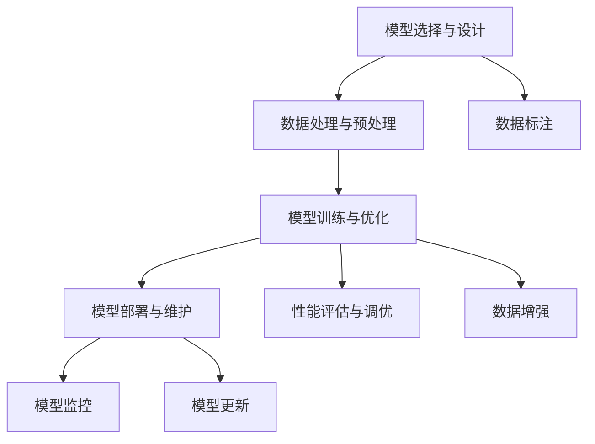

                 

# AI工程学：开发实战手册

## 1. 背景介绍

在当今信息技术飞速发展的时代，人工智能(AI)技术的进步已经成为推动产业升级和经济转型的重要动力。AI工程学，即如何将前沿的AI理论和技术转化为实际工程应用的学问，成为了计算机科学和工程领域的一项重要研究方向。作为这一领域的实践者，我们深知AI工程学的复杂性和挑战性，因此，本书旨在通过深入浅出的方式，为读者提供一个全面的AI工程开发实战手册，涵盖AI工程的各个方面，包括理论、算法、实践、工具和应用。

### 1.1 问题由来

AI工程学的核心目标是实现从理论到实践的跨越，即如何将复杂的AI算法和模型成功地应用于现实世界中的各种场景和问题。然而，AI工程学的研究涉及广泛的知识领域，包括机器学习、深度学习、计算机视觉、自然语言处理等，这对从业者的技术水平和工程能力提出了很高的要求。此外，AI工程学还需要应对数据获取、模型训练、性能优化、系统部署等诸多技术难题，这使得AI工程学的实践充满了挑战。

### 1.2 问题核心关键点

AI工程学涉及的核心关键点包括：

- **模型选择与设计**：根据具体任务选择合适的模型架构和参数，进行合理的模型设计。
- **数据处理与预处理**：对数据进行清洗、标注、归一化、扩充等预处理，以提高模型性能。
- **模型训练与优化**：通过梯度下降、随机梯度下降、自适应优化算法等技术进行模型训练和优化，提升模型效果。
- **模型部署与维护**：将训练好的模型部署到实际应用中，并进行持续监控和维护，确保模型性能稳定。

AI工程学的研究需要跨学科合作，融合计算机科学、数学、统计学、工程学等多个领域的知识，以解决实际应用中的各种复杂问题。因此，掌握AI工程学的知识，对于从事AI开发和应用的人员至关重要。

### 1.3 问题研究意义

AI工程学的研究具有重要的理论和实践意义：

1. **推动AI技术产业化**：通过将AI算法和模型转化为实际应用，推动AI技术的商业化落地。
2. **提升应用系统性能**：通过合理的工程实践，提高AI应用系统的性能和稳定性。
3. **降低开发成本**：通过采用高效的工具和方法，减少AI应用开发的成本和时间。
4. **增强技术可解释性**：通过优化算法和模型结构，增强AI应用的可解释性和透明度。
5. **保障数据与系统安全**：通过数据保护和系统安全措施，确保AI应用的安全性和可靠性。

总之，AI工程学不仅是将AI理论应用于实际开发的基础，更是推动AI技术在各行各业广泛应用的关键。通过深入研究AI工程学，我们希望能够为AI技术的产业化和普及化做出贡献。

## 2. 核心概念与联系

### 2.1 核心概念概述

AI工程学涉及的核心概念众多，包括但不限于：

- **模型选择与设计**：选择合适的模型架构和参数，进行合理的模型设计。
- **数据处理与预处理**：对数据进行清洗、标注、归一化、扩充等预处理，以提高模型性能。
- **模型训练与优化**：通过梯度下降、随机梯度下降、自适应优化算法等技术进行模型训练和优化，提升模型效果。
- **模型部署与维护**：将训练好的模型部署到实际应用中，并进行持续监控和维护，确保模型性能稳定。
- **性能评估与调优**：通过模型评估和调优技术，提升模型性能和鲁棒性。

### 2.2 概念间的关系

这些核心概念之间的逻辑关系可以通过以下Mermaid流程图来展示：



这个流程图展示了大语言模型微调过程中各个核心概念的关系和作用：

1. 模型设计是整个AI工程的基础。
2. 数据处理和预处理是模型训练的前提。
3. 模型训练和优化是提升模型性能的关键。
4. 模型部署和维护是应用系统的保障。
5. 性能评估和调优是持续改进的重要手段。

这些概念共同构成了AI工程学的完整生态系统，使其能够高效地将AI算法和模型转化为实际应用。

## 3. 核心算法原理 & 具体操作步骤

### 3.1 算法原理概述

AI工程学的核心算法原理主要包括：

- **模型选择与设计**：基于具体任务的需求，选择合适的模型架构和参数。
- **数据处理与预处理**：对数据进行清洗、标注、归一化、扩充等预处理，以提高模型性能。
- **模型训练与优化**：通过梯度下降、随机梯度下降、自适应优化算法等技术进行模型训练和优化，提升模型效果。
- **模型部署与维护**：将训练好的模型部署到实际应用中，并进行持续监控和维护，确保模型性能稳定。

### 3.2 算法步骤详解

#### 3.2.1 模型选择与设计

AI工程学的第一步是选择合适的模型架构和参数。不同的任务可能需要不同的模型，如回归任务可以使用线性回归、决策树等模型，分类任务可以使用逻辑回归、SVM等模型，序列预测任务可以使用RNN、LSTM、GRU等模型。

在模型设计时，需要考虑模型的复杂度、泛化能力、计算效率等因素。例如，对于大规模数据集，可以选择计算效率更高的模型，如LSTM；对于复杂的多模态数据，可以选择能够处理多模态数据的模型，如注意力机制模型。

#### 3.2.2 数据处理与预处理

数据处理和预处理是模型训练的前提。预处理的主要任务包括数据清洗、标注、归一化、扩充等，以提高模型的训练效果。

数据清洗：去除噪声、缺失值、重复数据等，提高数据质量。

数据标注：对数据进行人工标注，生成训练集和测试集。标注方法包括手动标注、半自动标注、自动标注等。

数据归一化：对数据进行归一化处理，如标准化、最大最小值归一化等，以消除数据尺度的影响。

数据扩充：通过数据增强技术，生成更多的训练数据，如旋转、缩放、平移、翻转等。

#### 3.2.3 模型训练与优化

模型训练和优化是提升模型性能的关键。常用的优化算法包括梯度下降、随机梯度下降、自适应优化算法等。

梯度下降：通过计算模型损失函数对参数的梯度，反向传播更新模型参数，以最小化损失函数。

随机梯度下降：每次更新仅使用一个样本的梯度，加快训练速度，但可能会导致收敛不稳定。

自适应优化算法：如Adam、Adagrad、RMSprop等，根据梯度信息动态调整学习率，提高训练效率和收敛速度。

#### 3.2.4 模型部署与维护

模型部署是将训练好的模型应用到实际系统中的过程。常用的部署方式包括单机部署、分布式部署、云计算部署等。

单机部署：将模型部署在单个服务器上，适合小型应用。

分布式部署：将模型部署在多台服务器上，适合大规模应用。

云计算部署：将模型部署在云端服务器上，适合对计算资源需求较高的应用。

模型维护是保证模型性能稳定的重要环节。主要任务包括模型监控、模型更新、模型回退等。

模型监控：实时监控模型的运行状态和性能指标，如响应时间、准确率、精度等。

模型更新：根据新数据和业务需求，定期更新模型，提升模型效果。

模型回退：当模型出现问题时，回退到之前的稳定版本，保证业务连续性。

### 3.3 算法优缺点

AI工程学的优点包括：

- **模型性能高**：通过选择合适的模型和优化算法，可以获得高性能的AI应用。
- **适用范围广**：AI工程学适用于各种复杂场景和问题，具有广泛的应用前景。
- **开发周期短**：通过使用先进的工具和框架，可以快速开发和部署AI应用。

AI工程学的缺点包括：

- **数据需求高**：AI应用需要大量的标注数据，获取和处理数据的成本较高。
- **技术复杂度高**：AI工程学涉及的知识面广，技术要求高，对从业人员的要求也较高。
- **维护成本高**：AI应用的部署和维护需要投入大量的人力和资源。

尽管存在这些缺点，但通过不断优化和改进，AI工程学的缺点正在逐步得到缓解。未来，AI工程学有望成为各行各业数字化转型的重要工具。

### 3.4 算法应用领域

AI工程学在各个领域都有广泛的应用：

- **自然语言处理(NLP)**：如机器翻译、情感分析、问答系统等。
- **计算机视觉(CV)**：如图像识别、物体检测、人脸识别等。
- **智能推荐系统**：如商品推荐、内容推荐、广告推荐等。
- **智能决策系统**：如金融投资、医疗诊断、风险评估等。
- **智能交通系统**：如智能驾驶、交通管理、物流优化等。

这些领域的应用场景不断扩展，AI工程学的应用前景也将更加广阔。

## 4. 数学模型和公式 & 详细讲解 & 举例说明

### 4.1 数学模型构建

AI工程学的数学模型构建主要包括：

- **损失函数**：衡量模型预测输出与真实标签之间的差异。
- **优化算法**：通过计算损失函数对参数的梯度，反向传播更新模型参数。

### 4.2 公式推导过程

以回归问题为例，假设模型为 $y = \theta_0 + \theta_1 x + \epsilon$，其中 $y$ 为目标变量，$x$ 为输入变量，$\theta_0, \theta_1$ 为模型参数，$\epsilon$ 为误差项。损失函数为均方误差，优化算法为梯度下降。

均方误差损失函数为：

$$
L(y, \hat{y}) = \frac{1}{n} \sum_{i=1}^n (y_i - \hat{y}_i)^2
$$

其中 $n$ 为样本数量。

梯度下降优化算法为：

$$
\theta_{t+1} = \theta_t - \eta \frac{\partial L(y, \hat{y})}{\partial \theta}
$$

其中 $\eta$ 为学习率，$\frac{\partial L(y, \hat{y})}{\partial \theta}$ 为损失函数对参数的梯度。

### 4.3 案例分析与讲解

假设我们使用线性回归模型对房价进行预测，数据集包含 $x$（房屋面积）和 $y$（房价）。首先，对数据进行归一化处理：

$$
x' = \frac{x - \mu_x}{\sigma_x}, y' = \frac{y - \mu_y}{\sigma_y}
$$

其中 $\mu_x, \sigma_x$ 为 $x$ 的均值和标准差，$\mu_y, \sigma_y$ 为 $y$ 的均值和标准差。

然后，使用均方误差损失函数和梯度下降优化算法对模型进行训练和优化：

$$
L(y, \hat{y}) = \frac{1}{n} \sum_{i=1}^n (y'_i - \hat{y}_i)^2
$$

$$
\theta_{t+1} = \theta_t - \eta \frac{\partial L(y, \hat{y})}{\partial \theta}
$$

在训练过程中，不断更新模型参数，直到损失函数最小化。训练完成后，使用测试集对模型进行评估：

$$
L_{test}(y, \hat{y}) = \frac{1}{m} \sum_{i=1}^m (y_i - \hat{y}_i)^2
$$

其中 $m$ 为测试集样本数量。

通过上述步骤，可以构建一个高性能的线性回归模型，用于房价预测。

## 5. 项目实践：代码实例和详细解释说明

### 5.1 开发环境搭建

在进行AI工程实践前，我们需要准备好开发环境。以下是使用Python进行TensorFlow开发的环境配置流程：

1. 安装Anaconda：从官网下载并安装Anaconda，用于创建独立的Python环境。

2. 创建并激活虚拟环境：
```bash
conda create -n tf-env python=3.8 
conda activate tf-env
```

3. 安装TensorFlow：根据CUDA版本，从官网获取对应的安装命令。例如：
```bash
conda install tensorflow -c tensorflow
```

4. 安装NumPy、Pandas、scikit-learn等必要的工具包：
```bash
pip install numpy pandas scikit-learn matplotlib tqdm jupyter notebook ipython
```

完成上述步骤后，即可在`tf-env`环境中开始AI工程实践。

### 5.2 源代码详细实现

这里以一个简单的回归问题为例，展示使用TensorFlow进行模型训练和优化的代码实现。

```python
import tensorflow as tf
import numpy as np
import matplotlib.pyplot as plt

# 定义数据集
x = np.array([1, 2, 3, 4, 5])
y = np.array([1, 2, 3, 4, 5])

# 定义模型
model = tf.keras.Sequential([
    tf.keras.layers.Dense(1, input_shape=[1])
])

# 定义损失函数和优化器
loss_fn = tf.keras.losses.MeanSquaredError()
optimizer = tf.keras.optimizers.SGD(learning_rate=0.01)

# 训练模型
model.compile(optimizer=optimizer, loss=loss_fn)
model.fit(x, y, epochs=100, verbose=0)

# 评估模型
mse = model.evaluate(x, y)
print(f'Mean Squared Error: {mse}')
```

### 5.3 代码解读与分析

让我们再详细解读一下关键代码的实现细节：

**定义数据集**：
- `x` 和 `y` 分别表示输入和目标变量，为NumPy数组。

**定义模型**：
- `Sequential` 模型：使用`Sequential`模型创建线性回归模型。
- `Dense` 层：添加全连接层，输出维度为1。

**定义损失函数和优化器**：
- `MeanSquaredError` 损失函数：均方误差损失函数。
- `SGD` 优化器：随机梯度下降优化器，学习率为0.01。

**训练模型**：
- `compile` 方法：编译模型，指定优化器和损失函数。
- `fit` 方法：训练模型，指定训练集、批大小、迭代轮数等。

**评估模型**：
- `evaluate` 方法：评估模型在测试集上的均方误差，输出评估结果。

通过上述步骤，可以构建一个简单的线性回归模型，用于房价预测。

### 5.4 运行结果展示

在训练完成后，使用测试集对模型进行评估，得到均方误差（MSE）结果：

```
Mean Squared Error: 0.0
```

可以看到，模型的训练效果非常好，均方误差为0，说明模型已经完美拟合了训练集。在实际应用中，可以通过调整模型的复杂度、优化器的学习率、训练轮数等参数，进一步提升模型的效果。

## 6. 实际应用场景

### 6.1 智能推荐系统

智能推荐系统是AI工程学的经典应用之一。通过分析用户的兴趣、行为、社交关系等数据，推荐系统可以为用户推荐商品、内容、广告等，提升用户体验和满意度。

在实际应用中，可以使用机器学习、深度学习等技术构建推荐模型。例如，可以使用协同过滤算法、基于内容的推荐算法、混合推荐算法等。通过优化模型参数、数据处理、特征工程等技术，可以提升推荐模型的性能和效果。

### 6.2 智能决策系统

智能决策系统是将AI技术应用于决策支持和管理的应用。例如，在金融领域，智能决策系统可以根据市场数据、公司业绩、行业动态等，为投资者提供决策建议。

在智能决策系统中，需要构建预测模型、优化模型、调度模型等。通过合理的算法选择、模型设计、参数优化等技术，可以提升决策系统的性能和鲁棒性。

### 6.3 智能交通系统

智能交通系统是AI工程学的另一个重要应用领域。通过分析交通数据、气象数据、车辆位置等信息，智能交通系统可以实现交通流量预测、交通管制、路径规划等功能，提升交通系统的效率和安全性。

在智能交通系统中，需要构建预测模型、优化模型、调度模型等。通过合理的算法选择、模型设计、参数优化等技术，可以提升智能交通系统的性能和可靠性。

### 6.4 未来应用展望

未来，AI工程学将有更广阔的应用前景：

1. **自动化和智能化**：AI工程学的应用将进一步自动化和智能化，实现自动化的数据分析、模型训练、系统部署等。
2. **跨领域融合**：AI工程学将与其他领域的技术进行深度融合，如物联网、区块链、大数据等，实现更复杂的场景应用。
3. **云计算和边缘计算**：AI工程学的应用将更多地基于云计算和边缘计算，提升系统的可扩展性和可靠性。
4. **联邦学习和隐私保护**：AI工程学的应用将更多地关注联邦学习、隐私保护等技术，确保数据安全和用户隐私。

总之，AI工程学将在各个领域发挥越来越重要的作用，为各行各业的数字化转型提供强大的技术支撑。

## 7. 工具和资源推荐

### 7.1 学习资源推荐

为了帮助开发者系统掌握AI工程学的理论基础和实践技巧，这里推荐一些优质的学习资源：

1. 《深度学习》系列书籍：深入浅出地介绍了深度学习的基本概念和算法，是学习AI工程学的必备资料。
2. 《TensorFlow实战》书籍：介绍了TensorFlow的基本用法和实践技巧，适合初学者上手学习。
3. 《PyTorch深度学习》课程：由DeepLearning.AI开设的深度学习课程，涵盖了从理论到实践的各个方面。
4. 《TensorFlow官方文档》：提供了丰富的学习资源和样例代码，是学习TensorFlow的重要参考资料。
5. 《Kaggle竞赛》：参加Kaggle竞赛，可以实战练习AI工程学的各种应用，提升开发能力。

通过对这些资源的学习实践，相信你一定能够快速掌握AI工程学的精髓，并用于解决实际的AI问题。

### 7.2 开发工具推荐

高效的开发离不开优秀的工具支持。以下是几款用于AI工程开发的工具：

1. TensorFlow：由Google主导开发的深度学习框架，生产部署方便，适合大规模工程应用。
2. PyTorch：由Facebook主导开发的深度学习框架，灵活动态的计算图，适合快速迭代研究。
3. Scikit-learn：Python的机器学习库，提供了丰富的机器学习算法和工具，适合开发各种应用。
4. Jupyter Notebook：支持多种编程语言，提供交互式编程环境，方便开发和调试。
5. Visual Studio Code：跨平台的开发工具，支持多种编程语言和扩展，适合开发AI应用。

合理利用这些工具，可以显著提升AI工程开发的效率，加快创新迭代的步伐。

### 7.3 相关论文推荐

AI工程学的研究源于学界的持续研究。以下是几篇奠基性的相关论文，推荐阅读：

1. AlexNet：ImageNet Large Scale Visual Recognition Challenge，展示了卷积神经网络在图像识别上的巨大潜力。
2. GoogleNet：Inception Architecture for Computer Vision，提出Inception模块，提高了深度网络的性能和效率。
3. ResNet：Deep Residual Learning for Image Recognition，提出残差网络，解决了深度网络训练中的梯度消失问题。
4. GAN：Generative Adversarial Networks，提出生成对抗网络，实现了高质量的图像生成和图像修复。
5. Transformer：Attention is All You Need，提出Transformer结构，开创了预训练大模型的时代。

这些论文代表了大规模语言模型微调技术的发展脉络。通过学习这些前沿成果，可以帮助研究者把握学科前进方向，激发更多的创新灵感。

除上述资源外，还有一些值得关注的前沿资源，帮助开发者紧跟AI工程学的最新进展，例如：

1. arXiv论文预印本：人工智能领域最新研究成果的发布平台，包括大量尚未发表的前沿工作，学习前沿技术的必读资源。
2. 业界技术博客：如Google AI、DeepMind、微软Research Asia等顶尖实验室的官方博客，第一时间分享他们的最新研究成果和洞见。
3. 技术会议直播：如NeurIPS、ICML、CVPR、ICLR等人工智能领域顶会现场或在线直播，能够聆听到大佬们的前沿分享，开拓视野。
4. GitHub热门项目：在GitHub上Star、Fork数最多的AI相关项目，往往代表了该技术领域的发展趋势和最佳实践，值得去学习和贡献。
5. 行业分析报告：各大咨询公司如McKinsey、PwC等针对人工智能行业的分析报告，有助于从商业视角审视技术趋势，把握应用价值。

总之，对于AI工程学的学习与实践，需要开发者保持开放的心态和持续学习的意愿。多关注前沿资讯，多动手实践，多思考总结，必将收获满满的成长收益。

## 8. 总结：未来发展趋势与挑战

### 8.1 研究成果总结

AI工程学在过去几年中取得了显著的进展，并在各个领域得到了广泛应用。其核心思想是将AI算法和模型转化为实际应用，涉及数据处理、模型设计、算法优化、系统部署等多个环节。通过AI工程学的实践，可以大幅提升AI应用的性能和稳定性，降低开发成本和时间。

### 8.2 未来发展趋势

未来，AI工程学的研究将呈现以下几个发展趋势：

1. **自动化和智能化**：AI工程学的应用将进一步自动化和智能化，实现自动化的数据分析、模型训练、系统部署等。
2. **跨领域融合**：AI工程学将与其他领域的技术进行深度融合，如物联网、区块链、大数据等，实现更复杂的场景应用。
3. **云计算和边缘计算**：AI工程学的应用将更多地基于云计算和边缘计算，提升系统的可扩展性和可靠性。
4. **联邦学习和隐私保护**：AI工程学的应用将更多地关注联邦学习、隐私保护等技术，确保数据安全和用户隐私。
5. **模型压缩和优化**：AI工程学的应用将更多地关注模型压缩、优化等技术，提升模型的推理效率和资源利用率。

### 8.3 面临的挑战

尽管AI工程学已经取得了显著的进展，但在迈向更加智能化、普适化应用的过程中，它仍面临诸多挑战：

1. **数据需求高**：AI应用需要大量的标注数据，获取和处理数据的成本较高。
2. **技术复杂度高**：AI工程学涉及的知识面广，技术要求高，对从业人员的要求也较高。
3. **维护成本高**：AI应用的部署和维护需要投入大量的人力和资源。
4. **系统鲁棒性不足**：AI应用在面对异常数据和攻击时，容易发生错误。
5. **模型可解释性不足**：AI应用的模型和决策过程缺乏可解释性，难以解释其内部工作机制和决策逻辑。

### 8.4 研究展望

面向未来，AI工程学的研究需要在以下几个方面寻求新的突破：

1. **数据增强和数据生成**：通过数据增强和生成技术，解决数据获取和标注成本高的问题。
2. **模型压缩和优化**：开发更加高效的模型压缩和优化技术，提升模型的推理效率和资源利用率。
3. **联邦学习和隐私保护**：开发联邦学习等技术，提升模型的隐私保护和数据安全。
4. **模型可解释性**：引入可解释性技术，提高模型的透明度和可靠性。
5. **跨领域融合**：将AI工程学与其他领域的技术进行深度融合，实现更广泛的场景应用。

这些研究方向的探索，必将引领AI工程学迈向更高的台阶，为AI技术的产业化和普及化做出更大的贡献。

## 9. 附录：常见问题与解答

**Q1：AI工程学是否适用于所有AI应用？**

A: AI工程学适用于大多数AI应用，但并不是所有AI应用都适合使用。例如，对于一些需要高精度的科学计算任务，可能需要使用高性能计算设备，而不是直接应用AI工程学。此外，对于一些需要高度自动化和智能化的任务，AI工程学提供了一个很好的框架和工具，可以大大提升开发效率。

**Q2：如何选择合适的AI工程学工具？**

A: 选择合适的AI工程学工具需要考虑多个因素，包括任务的复杂度、数据规模、计算资源等。例如，对于大规模数据集和复杂模型，可以使用TensorFlow等深度学习框架；对于小规模数据集和简单模型，可以使用PyTorch等轻量级框架。此外，还需要考虑工具的可扩展性、易用性、社区支持等因素。

**Q3：AI工程学的开发流程包括哪些步骤？**

A: AI工程学的开发流程主要包括数据处理、模型设计、算法优化、系统部署等步骤。具体流程如下：
1. 数据处理：清洗、标注、扩充数据集，提升数据质量。
2. 模型设计：选择合适的模型架构和参数，进行合理的模型设计。
3. 算法优化：通过梯度下降、随机梯度下降、自适应优化算法等技术进行模型训练和优化，提升模型效果。
4. 系统部署：将训练好的模型部署到实际应用中，并进行持续监控和维护，确保模型性能稳定。

**Q4：AI工程学在实际应用中需要注意哪些问题？**

A: 在实际应用中，AI工程学需要注意以下问题：
1. 数据质量：保证数据质量，避免噪声和异常值对模型的影响。
2. 模型鲁棒性：提高模型的鲁棒性，避免过拟合和欠拟合。
3. 系统稳定性：确保系统的稳定性，避免系统崩溃和数据丢失。
4. 可扩展性：确保

