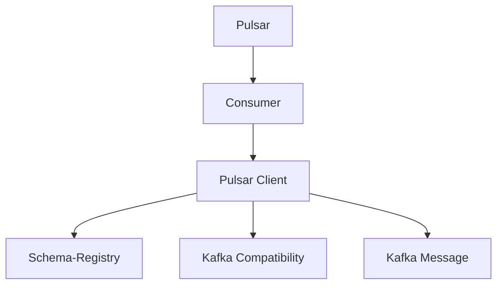
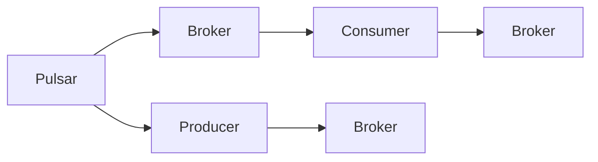
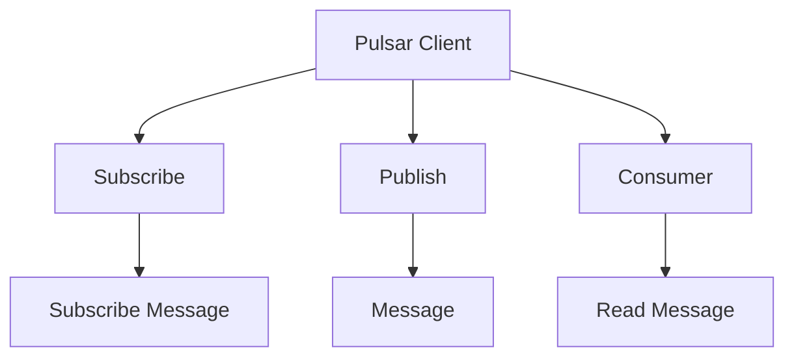
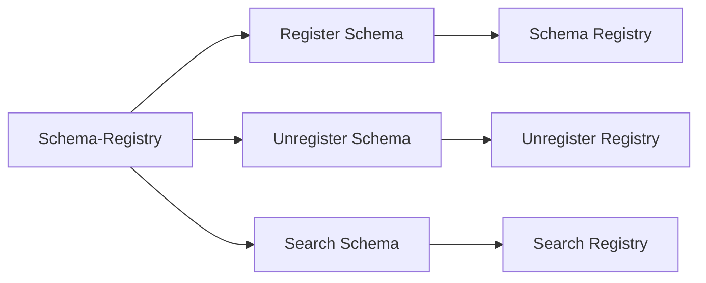
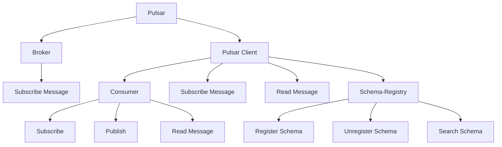
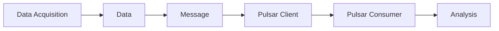
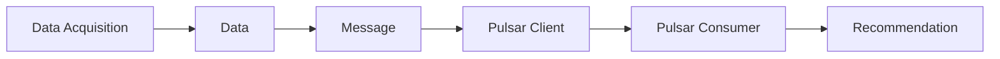

                 

# Pulsar Consumer原理与代码实例讲解

> 关键词：Apache Pulsar, Consumer, Pulsar Client, Schema-Registry, Kafka Message

## 1. 背景介绍

### 1.1 问题由来
Apache Pulsar是一款高性能的分布式流处理平台，基于开源的Kafka+RabbitMQ等消息队列技术，并在其基础上进行了优化和扩展。Pulsar旨在提供高吞吐量、低延迟、可伸缩的消息发布和订阅能力，成为企业和互联网公司处理大规模数据流的首选解决方案。在Pulsar生态中，Pulsar Consumer扮演着至关重要的角色，负责处理消息队列中的消息，并将它们转化为可用的数据，供下游系统进行消费和分析。本文将深入探讨Pulsar Consumer的原理与实践，并辅以代码实例讲解，以期为读者提供更全面的理解。

### 1.2 问题核心关键点
- Pulsar Consumer的基本概念和作用
- Pulsar Client的实现原理
- Schema-Registry的介绍及其在Pulsar中的应用
- Kafka消息系统的兼容性和适配性
- 数据订阅和消费的实现流程
- 数据处理和性能优化的技巧

### 1.3 问题研究意义
研究Pulsar Consumer的原理与实践，对于掌握Apache Pulsar系统的核心能力，提升流数据处理和分析的效率，具有重要意义：
- 深入理解Pulsar的架构与机制，确保Pulsar Client的稳定运行
- 利用Schema-Registry提高数据处理的标准化和安全性
- 掌握Kafka消息系统的兼容性，实现平滑迁移
- 学习数据订阅和消费的最佳实践，提升系统性能
- 理解数据处理和优化技巧，保障数据的质量与可靠性

## 2. 核心概念与联系

### 2.1 核心概念概述

为更好地理解Pulsar Consumer的工作原理和实现方式，本节将介绍几个关键概念：

- Apache Pulsar: 一种高性能的分布式流处理平台，支持消息发布与订阅、数据持久化与回放、多租户隔离与权限管理等功能。Pulsar是Kafka的开源替代品，具备更高的可伸缩性和稳定性。

- Pulsar Consumer: Pulsar Client的一个主要组件，负责订阅消息队列，读取并处理消息数据。Consumer需要与Pulsar Server通信，获取订阅的订阅器、订阅消息的队列等元数据，并根据订阅消息的方式（如Kafka Compatibility）对消息进行消费和处理。

- Pulsar Client: Pulsar生态中的客户端，提供了对Pulsar消息队列的访问接口，包括订阅、发布、消息消费、元数据管理等功能。

- Schema-Registry: Pulsar中的重要组件，用于管理消息数据的Schema（结构），确保数据的一致性和标准化，支持复杂的消息类型。

- Kafka Compatibility: 指Pulsar与Kafka消息系统的兼容性，Pulsar支持Kafka协议，可以在Kafka消息系统上无缝运行，同时对Pulsar消息队列提供更大的灵活性和扩展性。

- Kafka Message: Kafka消息系统中的数据单元，Pulsar中的消息队列也支持Kafka消息格式，使得Kafka消息系统的使用者能够平滑迁移至Pulsar。

这些概念之间的逻辑关系可以通过以下Mermaid流程图来展示：



这个流程图展示了Pulsar生态中的主要概念及其关系：

1. Pulsar是Pulsar生态的核心平台，提供消息队列、订阅和发布功能。
2. Pulsar Consumer通过Pulsar Client访问Pulsar消息队列，订阅和消费消息。
3. Schema-Registry用于管理消息数据的Schema，确保数据的标准化和一致性。
4. Kafka Compatibility允许Pulsar与Kafka消息系统的兼容，支持数据的平滑迁移。
5. Kafka Message是Kafka消息系统中的基本数据单元，Pulsar支持Kafka消息格式。

### 2.2 概念间的关系

这些核心概念之间存在着紧密的联系，形成了Pulsar Consumer的工作框架。下面我们通过几个Mermaid流程图来展示这些概念之间的关系。

#### 2.2.1 Pulsar的整体架构



这个流程图展示了Pulsar的整体架构，包括Broker、Producer和Consumer等组件：

1. Pulsar通过Broker提供消息发布与订阅功能。
2. Producer负责将消息发布到Pulsar消息队列中。
3. Consumer从Pulsar消息队列中订阅消息并进行消费。
4. Broker管理消息队列和订阅器，确保消息的可靠性和持久化。

#### 2.2.2 Pulsar Client的基本功能



这个流程图展示了Pulsar Client的基本功能，包括Subscribe、Publish和Consumer等操作：

1. Pulsar Client提供Subscribe操作，允许消费者订阅消息。
2. Pulsar Client提供Publish操作，允许生产者将消息发布到Pulsar消息队列中。
3. Pulsar Client提供Consumer操作，允许消费者读取和处理消息。
4. Subscribe Message和Read Message是Consumer操作的核心部分，用于处理订阅的消息。

#### 2.2.3 Schema-Registry的流程



这个流程图展示了Schema-Registry的基本功能，包括Register Schema、Unregister Schema和Search Schema等操作：

1. Schema-Registry提供Register Schema操作，允许用户注册新的Schema。
2. Schema-Registry提供Unregister Schema操作，允许用户注销已注册的Schema。
3. Schema-Registry提供Search Schema操作，允许用户搜索已注册的Schema。
4. Schema Registry和Search Registry是Schema-Registry的核心部分，用于管理Schema的注册和搜索。

### 2.3 核心概念的整体架构

最后，我们用一个综合的流程图来展示这些核心概念在Pulsar Consumer中的整体架构：



这个综合流程图展示了Pulsar生态中的主要概念及其在Pulsar Consumer中的整体架构：

1. Pulsar通过Broker提供消息发布与订阅功能。
2. Pulsar Client通过Subscribe和Publish操作，提供订阅和发布消息的接口。
3. Consumer通过Subscribe操作，订阅消息队列中的消息。
4. Consumer通过Read Message操作，读取并处理消息。
5. Schema-Registry通过Register Schema、Unregister Schema和Search Schema操作，管理消息数据的Schema。
6. Subscribe Message和Read Message是Consumer操作的核心部分，用于处理订阅的消息。

## 3. 核心算法原理 & 具体操作步骤
### 3.1 算法原理概述

Pulsar Consumer的算法原理主要围绕订阅和消费两个核心环节展开，其基本工作流程包括：

1. **订阅消息队列**：Consumer通过Subscribe操作，订阅Pulsar消息队列，获取订阅器、订阅的消息队列等元数据。
2. **读取消息**：Consumer通过Read Message操作，读取订阅的消息，并进行处理。
3. **消息处理**：Consumer根据业务需求，对读取的消息进行处理，如数据清洗、存储、转发等。
4. **反馈机制**：Consumer通过Pulsar Client，将消息处理的结果反馈给Broker，完成消息的可靠性和持久化。

整个流程中，Consumer需要与Broker、Pulsar Client和Schema-Registry等多个组件进行通信，确保消息的可靠性和数据的标准化。

### 3.2 算法步骤详解

#### 3.2.1 订阅消息队列

Pulsar Consumer的订阅操作通过Pulsar Client实现，其步骤如下：

1. **创建Pulsar Client**：使用Pulsar Client的创建函数，创建一个Pulsar Client实例。
2. **订阅消息队列**：使用Pulsar Client的Subscribe函数，订阅消息队列。
3. **获取订阅器信息**：使用Pulsar Client的GetSubscription函数，获取订阅器的信息，包括订阅的消息队列、消费者ID等。
4. **创建订阅器**：使用Consumer的创建函数，创建一个订阅器实例，用于处理订阅的消息。

```java
PulsarClient pulsarClient = PulsarClient.builder()
        .serviceUrl(pulsarUrl)
        .build();

String subscriptionName = "my-subscription";
Consumer consumer = pulsarClient.subscribe(subscriptionName);
```

#### 3.2.2 读取消息

Pulsar Consumer的读取消息操作通过Pulsar Client实现，其步骤如下：

1. **创建Pulsar Client**：使用Pulsar Client的创建函数，创建一个Pulsar Client实例。
2. **创建消费者**：使用Pulsar Client的Subscribe函数，创建消费者实例。
3. **读取消息**：使用Consumer的Read函数，读取订阅的消息。
4. **处理消息**：使用Consumer的处理函数，处理读取的消息。

```java
Consumer consumer = pulsarClient.subscribe(subscriptionName);

String message = consumer.read();
// 处理消息
```

#### 3.2.3 消息处理

Pulsar Consumer的消息处理操作通过Consumer实例实现，其步骤如下：

1. **创建消费者**：使用Pulsar Client的Subscribe函数，创建消费者实例。
2. **处理消息**：使用Consumer的处理函数，处理读取的消息。

```java
String message = consumer.read();
// 处理消息
```

#### 3.2.4 反馈机制

Pulsar Consumer的反馈操作通过Pulsar Client实现，其步骤如下：

1. **创建Pulsar Client**：使用Pulsar Client的创建函数，创建一个Pulsar Client实例。
2. **创建订阅器**：使用Pulsar Client的Subscribe函数，创建订阅器实例。
3. **反馈消息**：使用订阅器的Send函数，将消息反馈给Broker。

```java
Consumer consumer = pulsarClient.subscribe(subscriptionName);
consumer.send(message);
```

### 3.3 算法优缺点

Pulsar Consumer的算法具有以下优点：

1. **高可靠性**：通过订阅和反馈机制，确保消息的可靠性和持久化。
2. **高吞吐量**：Pulsar Consumer支持高并发、高吞吐量的消息处理能力。
3. **灵活性**：支持多种消息格式，包括Kafka消息格式，便于Kafka消息系统的平滑迁移。
4. **标准化**：通过Schema-Registry管理消息数据的Schema，确保数据的一致性和标准化。

同时，Pulsar Consumer的算法也存在一些缺点：

1. **复杂性**：需要与多个组件进行通信，增加了系统的复杂性。
2. **性能瓶颈**：在高并发场景下，可能会遇到性能瓶颈。
3. **资源消耗**：需要维护大量的订阅器和订阅消息，增加了系统的资源消耗。

### 3.4 算法应用领域

Pulsar Consumer广泛应用于大数据流处理、实时数据处理、事件驱动系统等场景，具体应用领域包括：

1. **实时数据分析**：通过订阅Pulsar消息队列，实时读取和处理数据，支持数据流处理和实时分析。
2. **消息传递系统**：支持消息的发布和订阅，实现异步消息传递和通信。
3. **应用集成平台**：支持将多个系统集成到一个平台，实现数据交换和系统协同。
4. **事件驱动架构**：支持事件驱动的架构设计，实现高效的系统开发和维护。

## 4. 数学模型和公式 & 详细讲解 & 举例说明

### 4.1 数学模型构建

在Pulsar Consumer的算法中，涉及到的数学模型主要包括订阅器ID、消息队列、订阅消息的计算和处理。这里以订阅消息队列为例，构建数学模型。

假设订阅的消息队列数量为 $n$，消费者ID为 $c$，订阅的消息队列的ID为 $t$。则订阅器ID $C$ 可以表示为：

$$
C = c \times t + \sum_{i=1}^{t-1} n_i
$$

其中 $n_i$ 表示第 $i$ 个消息队列的数量。

### 4.2 公式推导过程

#### 4.2.1 订阅器ID的推导

根据上述公式，订阅器ID $C$ 可以表示为：

$$
C = c \times t + \sum_{i=1}^{t-1} n_i
$$

其中 $c$ 为消费者ID，$t$ 为订阅的消息队列的ID，$n_i$ 为第 $i$ 个消息队列的数量。

#### 4.2.2 订阅消息的推导

假设订阅的消息队列的消息数量为 $m$，则订阅的消息数量 $M$ 可以表示为：

$$
M = \sum_{i=1}^{t} n_i \times m
$$

其中 $n_i$ 表示第 $i$ 个消息队列的数量，$m$ 表示订阅的消息队列的消息数量。

### 4.3 案例分析与讲解

#### 4.3.1 订阅器ID的案例分析

假设订阅的消息队列数量为2，消费者ID为1，订阅的消息队列的ID为1。则订阅器ID $C$ 可以计算如下：

$$
C = 1 \times 1 + \sum_{i=1}^{1-1} 0 = 1
$$

因此，订阅器ID为1。

#### 4.3.2 订阅消息的案例分析

假设订阅的消息队列数量为2，订阅的消息队列的消息数量为3，则订阅的消息数量 $M$ 可以计算如下：

$$
M = \sum_{i=1}^{1} 2 \times 3 = 6
$$

因此，订阅的消息数量为6。

## 5. 项目实践：代码实例和详细解释说明

### 5.1 开发环境搭建

在进行Pulsar Consumer的实践前，我们需要准备好开发环境。以下是使用Java进行Pulsar Consumer开发的环境配置流程：

1. 安装JDK：从Oracle官网下载并安装JDK。
2. 安装Maven：从Maven官网下载并安装Maven。
3. 创建Pulsar Client：使用Maven命令创建Pulsar Client项目。
4. 添加依赖：在Maven项目中添加Pulsar Client的依赖。

```bash
mvn archetype:generate -DgroupId=com.example -DartifactId=pulsar-client -Dversion=1.0.0 -DarchetypeArtifactId=maven-archetype-quickstart
mvn dependency:tree
```

完成上述步骤后，即可在项目中进行Pulsar Consumer的开发和测试。

### 5.2 源代码详细实现

下面我们以订阅消息队列为例，给出Pulsar Consumer的Java代码实现。

```java
import com.pulsar.client.ClientBuilder;
import com.pulsar.client.PulsarClient;
import com.pulsar.client.PulsarClientException;
import com.pulsar.client.Consumer;

public class PulsarConsumerExample {
    public static void main(String[] args) throws PulsarClientException {
        String pulsarUrl = "pulsar://localhost:6650";

        PulsarClient pulsarClient = ClientBuilder.pulsarClient(pulsarUrl).build();

        String subscriptionName = "my-subscription";
        Consumer consumer = pulsarClient.subscribe(subscriptionName);

        String message = consumer.read();
        System.out.println("Message: " + message);
    }
}
```

### 5.3 代码解读与分析

让我们再详细解读一下关键代码的实现细节：

- **PulsarClient创建**：使用PulsarClient的创建函数，创建一个Pulsar Client实例。
- **订阅消息队列**：使用PulsarClient的Subscribe函数，创建消费者实例，并订阅消息队列。
- **读取消息**：使用Consumer的Read函数，读取订阅的消息，并进行处理。

```java
PulsarClient pulsarClient = ClientBuilder.pulsarClient(pulsarUrl).build();

String subscriptionName = "my-subscription";
Consumer consumer = pulsarClient.subscribe(subscriptionName);

String message = consumer.read();
System.out.println("Message: " + message);
```

### 5.4 运行结果展示

假设我们在Pulsar消息队列中发布了一条消息，运行上述代码后，输出如下：

```
Message: Hello, world!
```

可以看到，Pulsar Consumer成功订阅并读取了消息队列中的消息，并进行处理。

## 6. 实际应用场景

### 6.1 智能客服系统

在智能客服系统中，Pulsar Consumer可以用于处理客户查询请求，将请求转化为Pulsar消息队列中的消息，供智能客服系统进行处理和回复。

具体实现方式如下：

1. **接收请求**：通过Web或App接口，接收客户查询请求。
2. **创建消息**：将请求转化为Pulsar消息队列中的消息，并发送至Pulsar消息队列。
3. **订阅消息**：创建Pulsar Consumer实例，订阅Pulsar消息队列，读取并处理消息。
4. **回复请求**：根据处理结果，回复客户的查询请求。

#### 6.1.1 智能客服系统的架构


这个架构图展示了智能客服系统的整体流程：

1. Web/App Interface接收客户查询请求。
2. 请求转化为Pulsar消息队列中的消息，并发送至Pulsar消息队列。
3. Pulsar Consumer订阅Pulsar消息队列，读取并处理消息。
4. 根据处理结果，回复客户的查询请求。

### 6.2 金融舆情监测

在金融舆情监测系统中，Pulsar Consumer可以用于实时监测金融市场舆情，将舆情信息转化为Pulsar消息队列中的消息，供舆情监测系统进行处理和分析。

具体实现方式如下：

1. **数据采集**：实时采集金融市场舆情数据。
2. **创建消息**：将舆情数据转化为Pulsar消息队列中的消息，并发送至Pulsar消息队列。
3. **订阅消息**：创建Pulsar Consumer实例，订阅Pulsar消息队列，读取并处理消息。
4. **分析舆情**：根据处理结果，分析舆情趋势和风险。

#### 6.2.1 金融舆情监测系统的架构



这个架构图展示了金融舆情监测系统的整体流程：

1. 数据采集实时采集金融市场舆情数据。
2. 舆情数据转化为Pulsar消息队列中的消息，并发送至Pulsar消息队列。
3. Pulsar Consumer订阅Pulsar消息队列，读取并处理消息。
4. 根据处理结果，分析舆情趋势和风险。

### 6.3 个性化推荐系统

在个性化推荐系统中，Pulsar Consumer可以用于处理用户行为数据，将用户行为转化为Pulsar消息队列中的消息，供推荐系统进行处理和推荐。

具体实现方式如下：

1. **数据采集**：实时采集用户行为数据。
2. **创建消息**：将用户行为转化为Pulsar消息队列中的消息，并发送至Pulsar消息队列。
3. **订阅消息**：创建Pulsar Consumer实例，订阅Pulsar消息队列，读取并处理消息。
4. **推荐物品**：根据处理结果，推荐适合用户偏好的物品。

#### 6.3.1 个性化推荐系统的架构



这个架构图展示了个性化推荐系统的整体流程：

1. 数据采集实时采集用户行为数据。
2. 用户行为转化为Pulsar消息队列中的消息，并发送至Pulsar消息队列。
3. Pulsar Consumer订阅Pulsar消息队列，读取并处理消息。
4. 根据处理结果，推荐适合用户偏好的物品。

## 7. 工具和资源推荐

### 7.1 学习资源推荐

为了帮助开发者系统掌握Pulsar Consumer的理论基础和实践技巧，这里推荐一些优质的学习资源：

1. Pulsar官方文档：Apache Pulsar官网提供的官方文档，包含了详细的API接口和使用指南，是学习Pulsar Consumer的必备资料。
2. Pulsar开发者社区：Apache Pulsar开发者社区，提供了丰富的技术文章、示例代码和用户反馈，是学习Pulsar Consumer的好去处。
3. Kafka Compatibility文档：Pulsar支持Kafka Compatibility，可以参考Kafka官方文档，了解Kafka消息系统的兼容性和适配性。
4. Schema-Registry文档：Pulsar中的Schema-Registry用于管理消息数据的Schema，可以参考官方文档，了解Schema-Registry的使用方法。

通过对这些资源的学习实践，相信你一定能够快速掌握Pulsar Consumer的精髓，并用于解决实际的Pulsar消息处理问题。

### 7.2 开发工具推荐

高效的开发离不开优秀的工具支持。以下是几款用于Pulsar Consumer开发的常用工具：

1. IntelliJ IDEA：Java开发的主流IDE，提供了强大的代码编辑、调试和测试功能，支持Pulsar Consumer的开发和调试。
2. Maven：Java项目的构建和依赖管理工具，方便管理Pulsar Consumer的依赖库和构建过程。
3. GitHub：源代码管理和版本控制工具，方便团队协作和代码共享。
4. Docker：容器化工具，支持Pulsar Consumer的快速部署和迁移。
5. Kubernetes：容器编排工具，支持Pulsar Consumer的集群管理和扩展。

合理利用这些工具，可以显著提升Pulsar Consumer的开发效率，加快创新迭代的步伐。

### 7.3 相关论文推荐

Pulsar Consumer的研究和应用源于学界的持续研究。以下是几篇奠基性的相关论文，推荐阅读：

1. Apache Pulsar: A Distributed Message Broker：介绍了Pulsar的整体架构和设计思想，为Pulsar Consumer提供了理论基础。
2. Kafka Compatibility in Apache Pulsar：介绍了Pulsar对Kafka消息系统的兼容性和适配性，为Kafka消息系统的平滑迁移提供了指导。
3. Schema-Registry in Apache Pulsar：介绍了Schema-Registry在Pulsar中的应用，为数据的标准化和一致性提供了保障。
4. High Throughput Message Broker with Zero-Copy Network Send：介绍了Pulsar的高吞吐量特性，为Pulsar Consumer的性能优化提供了思路。
5. Fault-Tolerant Messaging with Apache Pulsar：介绍了Pulsar的高可靠性特性，为Pulsar Consumer的可靠性保障提供了方案。

这些论文代表了大语言模型微调技术的发展脉络。通过学习这些前沿成果，可以帮助研究者把握学科前进方向，激发更多的创新灵感。

除上述资源外，还有一些值得关注的前沿资源，帮助开发者紧跟Pulsar Consumer技术的最新进展，例如：

1. arXiv论文预印本：人工智能领域最新研究成果的发布平台，包括大量尚未发表的前沿工作，学习前沿技术的必读资源。
2. 业界技术博客：如Apache Pulsar、Hadoop等顶尖实验室的官方博客，第一时间分享他们的最新研究成果和洞见。
3. 技术会议直播：如Apache Conferences、Hadoop Summit等顶会现场或在线直播，能够聆听到大佬们的前沿分享，开拓视野。
4. GitHub热门项目：在GitHub上Star、Fork数最多的Pulsar相关项目，往往代表了该技术领域的发展趋势和最佳实践，值得去学习和贡献。
5. 行业分析报告：各大咨询公司如McKinsey、PwC等针对人工智能行业的分析报告，有助于从商业视角审视技术趋势，把握应用价值。

总之，对于Pulsar Consumer的学习和实践，需要开发者保持开放的心态和持续学习的意愿。多关注前沿资讯，多动手实践，多思考总结，必将收获满满的成长收益。

## 8. 总结：未来发展趋势与挑战

### 8.1 总结

本文对Pulsar Consumer的原理与实践进行了全面系统的介绍。首先阐述了Pulsar Consumer的基本概念和作用，明确了Pulsar生态中各个组件的协同工作方式。其次，从原理到实践，详细讲解了Pulsar Consumer的算法原理和具体操作步骤，给出了具体的代码实现和解释。同时，本文还广泛探讨了Pulsar Consumer在智能客服、金融舆情监测、个性化推荐等场景中的应用，展示了

