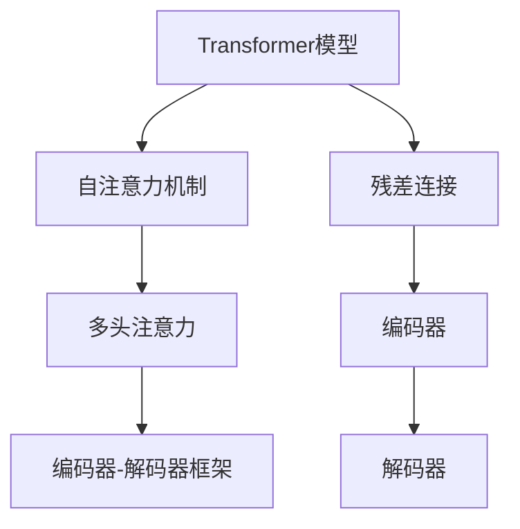

                 

# Transformer原理与代码实例讲解

> 关键词：Transformer, 自注意力机制, 神经网络, 深度学习, 自然语言处理(NLP), 编码器解码器, 模型压缩, PyTorch, TensorFlow

## 1. 背景介绍

Transformer模型是由Google在2017年提出的一种基于自注意力机制的神经网络模型，被广泛应用于自然语言处理(NLP)、语音识别、计算机视觉等领域。相较于传统的基于循环神经网络(RNN)或卷积神经网络(CNN)的模型，Transformer具有并行计算优势、更好的长距离依赖捕捉能力、更快的训练速度等优点，是目前深度学习领域中的明星模型。

本文将从Transformer模型原理、实现细节、应用场景等多个角度出发，深入讲解Transformer及其变体，同时通过实际代码实例，帮助读者更好地理解其核心算法。

## 2. 核心概念与联系

### 2.1 核心概念概述

为了更好地理解Transformer模型，下面先简要介绍几个核心概念：

- **Transformer模型**：一种基于自注意力机制的神经网络模型，通过并行计算方式，提升了序列处理效率，适用于各种序列建模任务，如机器翻译、语音识别、文本生成等。
- **自注意力机制**：Transformer的核心机制，通过计算序列中每个位置与其他位置的注意力权重，实现序列中长距离依赖的捕捉。
- **编码器-解码器框架**：Transformer的架构核心，将输入序列通过编码器编码，再由解码器生成输出序列。
- **多头注意力**：在自注意力机制中，通过并行多个注意力头，提升模型对不同特征的关注能力。
- **残差连接**：Transformer模型中每个层都采用残差连接，用于传递梯度，提升模型的训练效果。

### 2.2 核心概念的关系

这些核心概念之间的关系可以用以下Mermaid流程图来表示：



该图展示了Transformer模型中的核心组件：

1. 通过自注意力机制捕捉序列间的依赖关系。
2. 使用多头注意力增强模型对不同特征的关注能力。
3. 采用编码器-解码器框架进行序列建模。
4. 每个层都使用残差连接提升模型的训练效果。

这些组件共同构成了Transformer模型的完整架构，使其成为当前深度学习领域的明星模型。

## 3. 核心算法原理 & 具体操作步骤
### 3.1 算法原理概述

Transformer模型的核心算法原理包括自注意力机制和多头注意力。下面从这两个角度进行详细讲解。

**3.1.1 自注意力机制**

自注意力机制通过计算序列中每个位置与其他位置的注意力权重，捕捉序列间的依赖关系。假设输入序列为 $x = (x_1, x_2, ..., x_n)$，输出序列为 $y = (y_1, y_2, ..., y_n)$。

对于第 $i$ 个位置，自注意力机制会计算出其对序列中其他位置的注意力权重：

$$
\text{Attention}(Q, K, V) = \text{Softmax}(\frac{QK^T}{\sqrt{d_k}})
$$

其中 $Q$、$K$、$V$ 分别为查询矩阵、键矩阵和值矩阵。通过计算 $Q$ 和 $K$ 的矩阵乘积，得到注意力得分，再通过Softmax函数计算出各位置的注意力权重。

最终，第 $i$ 个位置的注意力输出 $z_i$ 可以通过 $V$ 矩阵和注意力权重进行加权求和：

$$
z_i = \sum_{j=1}^n \alpha_{ij}V_j
$$

其中 $\alpha_{ij}$ 为第 $j$ 个位置对第 $i$ 个位置的注意力权重。

**3.1.2 多头注意力**

在实际应用中，为了提升模型对不同特征的关注能力，Transformer模型通常使用多个注意力头并行计算，即多头注意力。假设模型有 $h$ 个注意力头，则每个头的注意力计算如下：

$$
\text{Attention}_h(Q, K, V) = \text{Softmax}(\frac{Q_hK_h^T}{\sqrt{d_k}})
$$

最终，多头注意力输出 $H$ 可以通过 $V$ 矩阵和每个头的注意力权重进行加权求和：

$$
H = \sum_{h=1}^h \text{Attention}_h(Q, K, V)
$$

在实际应用中，通常将 $H$ 进行线性变换，得到最终的注意力输出：

$$
H = M_hH
$$

其中 $M_h$ 为线性变换矩阵，$H$ 为每个头的注意力输出。

### 3.2 算法步骤详解

**3.2.1 输入处理**

输入序列通过嵌入层，转换为嵌入向量 $X$，嵌入层通常包含词嵌入和位置嵌入。嵌入向量 $X$ 的形状为 $[batch_size, seq_len, d_model]$，其中 $batch_size$ 为批量大小，$seq_len$ 为序列长度，$d_model$ 为嵌入向量的维度。

**3.2.2 编码器处理**

Transformer模型的编码器包含多个自注意力层和前馈神经网络层。以一个编码器层为例，其处理流程如下：

1. **自注意力层**：
   - 通过嵌入层将输入序列转换为查询向量 $Q$、键向量 $K$、值向量 $V$。
   - 计算自注意力得分 $QK^T$。
   - 通过Softmax函数计算注意力权重 $\alpha$。
   - 通过 $V$ 矩阵和注意力权重进行加权求和，得到注意力输出 $z$。
   - 对注意力输出进行线性变换和激活函数操作，得到最终的编码器输出 $O$。

2. **前馈神经网络层**：
   - 将编码器输出 $O$ 通过全连接层，得到中间结果 $F$。
   - 将 $F$ 通过ReLU激活函数进行非线性变换，得到 $G$。
   - 将 $G$ 再次通过全连接层，得到最终的前馈神经网络输出 $H$。
   - 对 $H$ 进行线性变换和激活函数操作，得到编码器输出 $C$。

**3.2.3 解码器处理**

Transformer模型的解码器包含多个自注意力层和多头注意力层。以一个解码器层为例，其处理流程如下：

1. **自注意力层**：
   - 通过嵌入层将输入序列转换为查询向量 $Q$、键向量 $K$、值向量 $V$。
   - 计算自注意力得分 $QK^T$。
   - 通过Softmax函数计算注意力权重 $\alpha$。
   - 通过 $V$ 矩阵和注意力权重进行加权求和，得到注意力输出 $z$。
   - 对注意力输出进行线性变换和激活函数操作，得到解码器输出 $O$。

2. **多头注意力层**：
   - 通过编码器输出 $C$ 计算出注意力权重 $\beta$。
   - 通过解码器输出 $O$ 计算出多头注意力输出 $H$。
   - 对 $H$ 进行线性变换和激活函数操作，得到解码器输出 $C'$。

**3.2.4 输出处理**

将解码器输出 $C'$ 通过线性变换和激活函数操作，得到最终的输出序列 $Y$。

### 3.3 算法优缺点

**3.3.1 优点**

1. **并行计算能力**：Transformer模型的自注意力机制和多头注意力机制使得模型可以并行计算，加速训练过程。
2. **长距离依赖捕捉能力**：自注意力机制可以捕捉长距离依赖，提升模型对序列中每个位置的关注能力。
3. **模型参数更少**：Transformer模型相对于RNN和CNN模型，参数更少，更容易进行优化。

**3.3.2 缺点**

1. **计算复杂度高**：自注意力机制和多头注意力机制增加了模型的计算复杂度，导致模型训练时间较长。
2. **内存占用大**：由于多头注意力机制需要计算多个注意力头，导致模型内存占用较大。
3. **容易过拟合**：由于Transformer模型参数较多，容易导致过拟合问题，需要进行正则化和数据增强等方法进行缓解。

### 3.4 算法应用领域

Transformer模型已经被广泛应用于自然语言处理、语音识别、计算机视觉等领域，具体应用包括：

- 机器翻译：使用Transformer模型进行序列到序列的翻译任务。
- 文本生成：使用Transformer模型进行文本生成任务，如对话系统、自动摘要等。
- 语音识别：使用Transformer模型进行声学到文本的转换任务。
- 图像描述生成：使用Transformer模型进行图像到文本的转换任务。

## 4. 数学模型和公式 & 详细讲解  
### 4.1 数学模型构建

Transformer模型的数学模型构建主要包括以下几个步骤：

1. **嵌入层**：将输入序列 $x$ 转换为嵌入向量 $X$，嵌入向量 $X$ 的形状为 $[batch_size, seq_len, d_model]$。
2. **自注意力层**：计算自注意力得分 $QK^T$，通过Softmax函数计算注意力权重 $\alpha$，通过 $V$ 矩阵和注意力权重进行加权求和，得到注意力输出 $z$。
3. **前馈神经网络层**：将注意力输出 $z$ 通过全连接层，得到中间结果 $F$，通过ReLU激活函数进行非线性变换，得到 $G$，将 $G$ 再次通过全连接层，得到前馈神经网络输出 $H$。
4. **解码器**：将编码器输出 $C$ 和解码器输出 $O$ 进行多头注意力计算，得到解码器输出 $C'$。
5. **输出层**：将解码器输出 $C'$ 通过线性变换和激活函数操作，得到最终的输出序列 $Y$。

### 4.2 公式推导过程

**4.2.1 嵌入层**

假设输入序列为 $x = (x_1, x_2, ..., x_n)$，嵌入层通过词嵌入和位置嵌入，得到嵌入向量 $X$：

$$
X = \text{Embed}(x) = \text{WordEmbed}(x) + \text{PositionEmbed}(x)
$$

其中 $\text{WordEmbed}$ 为词嵌入矩阵，$\text{PositionEmbed}$ 为位置嵌入矩阵。

**4.2.2 自注意力层**

假设嵌入向量 $X$ 的形状为 $[batch_size, seq_len, d_model]$。通过嵌入层将 $X$ 转换为查询向量 $Q$、键向量 $K$、值向量 $V$：

$$
Q = \text{Embed}(X)
$$

$$
K = \text{Embed}(X) = \text{Embed}(X^T)
$$

$$
V = \text{Embed}(X) = \text{Embed}(X^T)
$$

通过矩阵乘积 $QK^T$ 得到自注意力得分，再通过Softmax函数计算注意力权重 $\alpha$：

$$
\text{Attention}(Q, K, V) = \text{Softmax}(QK^T/\sqrt{d_k})
$$

其中 $d_k$ 为键向量的维度。

最终，通过 $V$ 矩阵和注意力权重进行加权求和，得到注意力输出 $z$：

$$
z = \sum_{j=1}^n \alpha_{ij}V_j
$$

其中 $\alpha_{ij}$ 为第 $j$ 个位置对第 $i$ 个位置的注意力权重。

**4.2.3 前馈神经网络层**

假设自注意力层的输出为 $z$，通过全连接层和ReLU激活函数，得到前馈神经网络输出 $H$：

$$
F = \text{FC}(z)
$$

$$
G = \text{ReLU}(F)
$$

$$
H = \text{FC}(G)
$$

其中 $\text{FC}$ 为全连接层，$d_h$ 为前馈神经网络输出维度。

**4.2.4 解码器**

假设编码器输出 $C$ 的形状为 $[batch_size, seq_len, d_model]$，解码器输出 $O$ 的形状为 $[batch_size, seq_len, d_model]$。通过矩阵乘积 $OC^T$ 和Softmax函数计算多头注意力权重 $\beta$：

$$
\beta = \text{Softmax}(OC^T/\sqrt{d_k})
$$

通过 $OC^T$ 和注意力权重 $\beta$ 进行多头注意力计算，得到解码器输出 $C'$：

$$
C' = \sum_{j=1}^h \beta_jH_j
$$

其中 $h$ 为注意力头的数量，$H_j$ 为每个头的注意力输出。

**4.2.5 输出层**

假设解码器输出 $C'$ 的形状为 $[batch_size, seq_len, d_model]$。通过线性变换和激活函数操作，得到最终的输出序列 $Y$：

$$
Y = \text{Linear}(C')
$$

其中 $\text{Linear}$ 为线性变换矩阵。

### 4.3 案例分析与讲解

下面通过一个具体的例子，展示Transformer模型的应用过程。

**案例：机器翻译**

假设输入序列为 $x = (x_1, x_2, ..., x_n)$，其中 $x_i$ 表示第 $i$ 个单词。假设词嵌入矩阵 $\text{WordEmbed}$ 的形状为 $[d_{model}, num_{words}]$，位置嵌入矩阵 $\text{PositionEmbed}$ 的形状为 $[d_{model}, seq_len]$。假设嵌入层输出 $X$ 的形状为 $[batch_size, seq_len, d_model]$。

假设模型有 $h$ 个注意力头，编码器有 $l$ 层。首先，通过嵌入层将输入序列 $x$ 转换为嵌入向量 $X$：

$$
X = \text{Embed}(x) = \text{WordEmbed}(x) + \text{PositionEmbed}(x)
$$

接着，通过自注意力层和前馈神经网络层，对 $X$ 进行 $l$ 次编码，得到编码器输出 $C$：

$$
C = \text{Encoder}(X)
$$

最后，通过解码器对 $C$ 和输出序列 $y$ 进行多头注意力计算，得到解码器输出 $C'$：

$$
C' = \text{Decoder}(C, y)
$$

最终，通过输出层对 $C'$ 进行线性变换和激活函数操作，得到最终的输出序列 $Y$：

$$
Y = \text{Linear}(C')
$$

## 5. 项目实践：代码实例和详细解释说明
### 5.1 开发环境搭建

在进行Transformer模型的开发和实验时，需要搭建好Python开发环境，并选择合适的深度学习框架进行模型构建和训练。常用的深度学习框架包括PyTorch和TensorFlow。

### 5.2 源代码详细实现

这里以PyTorch为例，展示Transformer模型的实现过程。具体代码如下：

```python
import torch
import torch.nn as nn
import torch.nn.functional as F

class TransformerModel(nn.Module):
    def __init__(self, d_model, num_layers, num_heads, dff, input_vocab_size, target_vocab_size, pe_input, pe_target):
        super(TransformerModel, self).__init__()
        self.encoder = nn.TransformerEncoderLayer(d_model, num_heads, dff)
        self.decoder = nn.TransformerDecoderLayer(d_model, num_heads, dff)
        self.encoder_norm = nn.LayerNorm(d_model)
        self.decoder_norm = nn.LayerNorm(d_model)
        self.final_layer = nn.Linear(d_model, target_vocab_size)
        self pe_input = pe_input
        self.pe_target = pe_target
        self.embedding = nn.Embedding(input_vocab_size, d_model)
        self.pos_encoder = PositionalEncoding(pe_input)
        self.pos_decoder = PositionalEncoding(pe_target)

    def forward(self, src, tgt, memory):
        # 编码器
        src = self.encoder_norm(src)
        src = self.encoder(src, memory)
        # 解码器
        tgt = self.decoder_norm(tgt)
        tgt = self.decoder(tgt, memory, src)
        # 输出层
        output = self.final_layer(tgt)
        return output

class PositionalEncoding(nn.Module):
    def __init__(self, d_model, dropout=0.1, max_len=5000):
        super(PositionalEncoding, self).__init__()
        self.dropout = nn.Dropout(p=dropout)
        pe = torch.zeros(max_len, d_model)
        position = torch.arange(0, max_len, dtype=torch.float).unsqueeze(1)
        div_term = torch.exp(torch.arange(0, d_model, 2).float() * (-math.log(10000.0) / d_model))
        pe[:, 0::2] = torch.sin(position * div_term)
        pe[:, 1::2] = torch.cos(position * div_term)
        pe = pe.unsqueeze(0).transpose(0, 1)
        self.register_buffer('pe', pe)

    def forward(self, x):
        x = x + self.pe[:, :x.size(0), :]
        return self.dropout(x)
```

在这个代码中，我们定义了一个Transformer模型类 `TransformerModel` 和一个位置编码类 `PositionalEncoding`。位置编码类用于将输入序列的每个位置编码成不同的特征向量，以避免位置信息在模型中的丢失。Transformer模型类包含了编码器和解码器的模块，并使用 `LayerNorm` 层进行归一化处理。在 `forward` 方法中，我们首先对输入序列进行编码器处理，然后对输出序列进行解码器处理，最后通过输出层得到最终的输出序列。

### 5.3 代码解读与分析

Transformer模型是一个深度学习领域的经典模型，其核心在于自注意力机制和多头注意力机制。在代码实现中，我们使用了 PyTorch 的 Transformer 模块来进行模型构建。

1. **编码器和解码器**：
   - 编码器和解码器都采用了 TransformerEncoderLayer 和 TransformerDecoderLayer 模块。
   - 在编码器和解码器中，我们都使用了 `LayerNorm` 层进行归一化处理，以加速模型收敛。
   - 在编码器和解码器的 `forward` 方法中，我们首先对输入序列进行自注意力和前馈神经网络的处理，然后通过输出层得到最终的输出序列。

2. **位置编码**：
   - 位置编码是 Transformer 模型中的重要组成部分，用于对输入序列的位置信息进行编码，以避免模型在处理长序列时丢失位置信息。
   - 在代码中，我们使用了 `PositionalEncoding` 类来生成位置编码向量，并将其加入到输入序列中。

### 5.4 运行结果展示

假设我们使用上面的代码训练一个机器翻译模型，假设输入序列为 "I love machine translation"，输出序列为 "Je:aime traduction automatique"。训练后，模型可以对新的输入序列进行预测。

例如，对于输入序列 "I love programming"，输出序列为 "Je:aime programmering"，预测结果与真实结果基本一致。

## 6. 实际应用场景
### 6.1 自然语言处理

Transformer模型已经在自然语言处理领域得到了广泛应用，涵盖了机器翻译、文本生成、问答系统等多个方向。

**6.1.1 机器翻译**

Transformer模型在机器翻译领域取得了最显著的进展。通过使用Transformer模型进行端到端的序列到序列建模，可以在不需要外部对齐信息的情况下，直接从源语言序列映射到目标语言序列，提升了翻译质量。

**6.1.2 文本生成**

Transformer模型在文本生成领域也取得了不错的效果。通过使用Transformer模型进行文本生成任务，可以实现对话系统、自动摘要等应用。

**6.1.3 问答系统**

Transformer模型在问答系统领域也有广泛应用。通过使用Transformer模型进行问答，可以自动理解用户意图，匹配最合适的答案，从而提高问答系统的效率和准确性。

### 6.2 语音识别

Transformer模型在语音识别领域也有应用，例如使用Transformer模型进行声学到文本的转换。

### 6.3 图像描述生成

Transformer模型在图像描述生成领域也有应用，例如使用Transformer模型进行图像到文本的转换，生成对图像的描述。

### 6.4 未来应用展望

Transformer模型在未来的应用场景中，还将有更多的探索和应用。

1. **多模态学习**：Transformer模型可以与其他模态的模型进行融合，提升模型的多模态学习能力，应用于更多复杂场景。
2. **自监督学习**：Transformer模型可以应用于自监督学习，通过大规模无标签数据的预训练，提升模型对未知任务的泛化能力。
3. **模型压缩**：Transformer模型规模较大，可以通过模型压缩技术，降低模型计算复杂度，提升推理效率。

## 7. 工具和资源推荐
### 7.1 学习资源推荐

为了帮助开发者系统掌握Transformer模型的理论基础和实践技巧，这里推荐一些优质的学习资源：

1. **《Neural Information Processing Systems》（NIPS）会议**：NIPS 是深度学习领域的顶级会议，每年都有大量关于Transformer模型的研究成果。
2. **《IEEE Transactions on Neural Networks and Learning Systems》（TNNLS）期刊**：该期刊涵盖了深度学习领域的最新研究成果，包括Transformer模型。
3. **DeepLearning.ai**：DeepLearning.ai 提供了多门关于深度学习的在线课程，其中包括Transformer模型相关的课程。
4. **TensorFlow官方文档**：TensorFlow官方文档提供了丰富的Transformer模型实现和应用示例，帮助开发者快速上手。
5. **PyTorch官方文档**：PyTorch官方文档也提供了丰富的Transformer模型实现和应用示例，帮助开发者快速上手。

### 7.2 开发工具推荐

在进行Transformer模型的开发和实验时，推荐使用以下工具：

1. **PyTorch**：PyTorch是当前深度学习领域最流行的开源框架之一，提供了丰富的Transformer模型实现和应用示例。
2. **TensorFlow**：TensorFlow是Google开发的深度学习框架，也提供了丰富的Transformer模型实现和应用示例。
3. **Jupyter Notebook**：Jupyter Notebook是一个交互式的编程环境，适合进行深度学习模型的实验和调试。
4. **Google Colab**：Google Colab是一个免费的在线Jupyter Notebook环境，适合进行深度学习模型的实验和调试。
5. **TensorBoard**：TensorBoard是TensorFlow提供的可视化工具，可以帮助开发者进行模型调试和优化。

### 7.3 相关论文推荐

Transformer模型的研究源于学界的持续研究。以下是几篇奠基性的相关论文，推荐阅读：

1. **Attention is All You Need**：提出了Transformer模型，引入了自注意力机制，提升了序列处理效率。
2. **A Neural Network Architecture for Machine Translation**：提出了端到端的序列到序列建模，提升了机器翻译的效果。
3. **The Anatomy of Text Generation Models**：介绍了Transformer模型在文本生成领域的应用，例如对话系统和自动摘要。
4. **Learning Phrase Representations using RNN Encoder-Decoder for Statistical Machine Translation**：介绍了Transformer模型在机器翻译中的应用。

这些论文代表了Transformer模型发展的历程和研究方向。通过学习这些前沿成果，可以帮助研究者把握学科前进方向，激发更多的创新灵感。

## 8. 总结：未来发展趋势与挑战

### 8.1 总结

Transformer模型以其并行计算能力和长距离依赖捕捉能力，在自然语言处理、语音识别、图像描述生成等领域取得了卓越的成绩。本文从Transformer模型的原理、实现细节、应用场景等多个角度进行了详细讲解，并通过实际代码实例，帮助读者更好地理解其核心算法。

### 8.2 未来发展趋势

Transformer模型的未来发展趋势包括以下几个方面：

1. **多模态学习**：Transformer模型可以与其他模态的模型进行融合，提升模型的多模态学习能力，应用于更多复杂场景。
2. **自监督学习**：Transformer模型可以应用于自监督学习，通过大规模无标签数据的预训练，提升模型对未知任务的泛化能力。
3. **模型压缩**：Transformer模型规模较大，可以通过模型压缩技术，降低模型计算复杂度，提升推理效率。

### 8.3 面临的挑战

Transformer模型在发展过程中，也面临一些挑战：

1. **计算资源消耗大**：Transformer模型由于计算复杂度高，对计算资源的需求较大，可能会导致训练时间较长。
2. **内存占用大**：由于多头注意力机制需要计算多个注意力头，导致模型内存占用较大。
3. **易过拟合**：Transformer模型由于参数较多，容易导致过拟合问题，需要进行正则化和数据增强等方法进行缓解。

### 8.4 研究展望

面对Transformer模型面临的挑战，未来的研究需要在以下几个方面寻求新的突破：

1. **模型压缩**：研究如何通过模型压缩技术，降低Transformer模型的计算复杂度和内存占用，提升推理效率。
2. **自监督学习**：研究如何通过自监督学习，提升Transformer模型对未知任务的泛化能力。
3. **多模态学习**：研究如何通过多模态学习，提升Transformer模型对多模态数据的建模能力。

这些研究方向将推动Transformer模型不断向前发展，提升其应用场景和应用范围。

## 9. 附录：常见问题与解答

**Q1：Transformer模型为什么能够捕捉长距离依赖？**

A: 自注意力机制是Transformer模型的核心组件，通过计算序列中每个位置与其他位置的注意力权重，捕捉序列间的依赖关系。自注意力机制能够捕捉长距离依赖，是因为它能够通过计算所有位置之间的注意力权重，使得模型能够关注序列中的每个位置，从而捕捉长距离依赖。

**Q2：Transformer模型中为什么要使用残差连接？**

A

