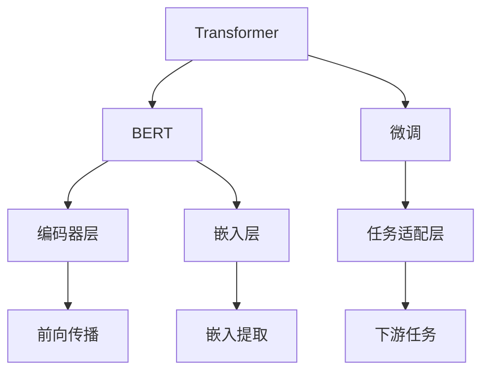
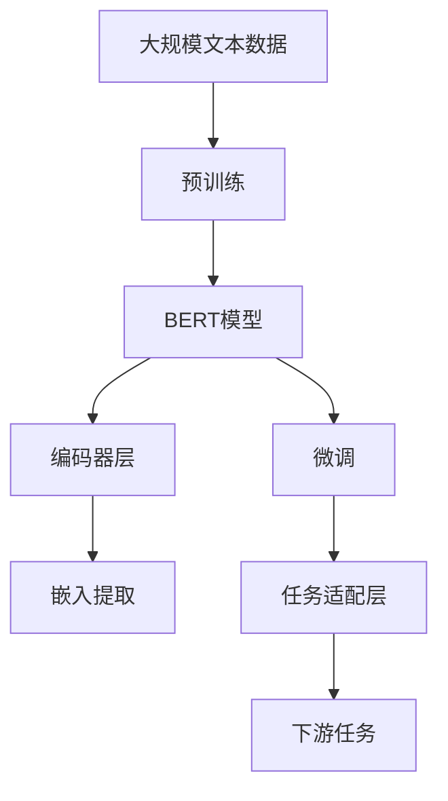

                 

# Transformer大模型实战 从BERT 的所有编码器层中提取嵌入

> 关键词：Transformer, BERT, 自注意力机制, 编码器层, 模型参数, 特征提取, 微调

## 1. 背景介绍

在深度学习领域，Transformer模型已成为自然语言处理(NLP)的核心架构之一。其中，BERT（Bidirectional Encoder Representations from Transformers）作为Transformer的杰出代表，以其双向编码器和预训练机制，在各种NLP任务上取得了巨大的成功。本文将详细探讨从BERT的所有编码器层中提取嵌入的方法，并结合具体案例进行实操演示。

### 1.1 问题由来

在现代深度学习实践中，模型参数的调整往往是提升模型性能的关键。BERT等Transformer模型拥有大量的参数，如何在保留预训练权重的基础上，通过微调或特征提取等手段进一步提升模型性能，成为了一个热门话题。通过从BERT的编码器层中提取嵌入，可以更直接地利用其强大的语言表示能力，进行更高层次的特征提取和任务微调。

### 1.2 问题核心关键点

从BERT的所有编码器层中提取嵌入，需要解决以下关键问题：
- 如何设计高效的前向传播过程，从各个编码器层中快速提取嵌入向量。
- 如何合理调整模型参数，避免对已有预训练权重的影响。
- 如何有效结合其他任务层，形成完整的任务模型。
- 如何验证和评估提取嵌入的效果，确保模型性能提升。

本文将围绕这些问题展开讨论，并通过具体代码实现，展示如何从BERT的编码器层中提取嵌入。

### 1.3 问题研究意义

通过从BERT的编码器层中提取嵌入，可以更好地利用预训练模型学到的语言知识，提升下游任务的性能，加速NLP技术的产业化进程。此外，这种特征提取方法可以与其他任务层结合，形成更通用的预训练-微调框架，具有较高的灵活性和泛化能力。

## 2. 核心概念与联系

### 2.1 核心概念概述

为更好地理解从BERT的编码器层中提取嵌入的方法，本节将介绍几个密切相关的核心概念：

- **Transformer**：一种基于自注意力机制的深度学习架构，广泛应用于各种NLP任务。Transformer的主要特点是自适应性、并行性和高效性。
- **BERT**：BERT是Google提出的预训练语言模型，通过双向编码器，对大规模文本数据进行预训练，学习丰富的语言表示。BERT模型对自注意力机制进行了改进，提升了模型的表征能力。
- **编码器层(Encoder Layer)**：在Transformer模型中，编码器层负责将输入序列编码成固定长度的向量表示，通常由自注意力机制和前馈神经网络组成。
- **嵌入(Embedding)**：在深度学习中，嵌入层用于将输入数据映射到低维空间，通常用于提取特征。BERT的嵌入层包含了丰富的语义信息，可以用于下游任务。
- **微调(Fine-Tuning)**：在预训练模型的基础上，使用下游任务的少量标注数据，通过有监督学习优化模型在该任务上的性能。

### 2.2 概念间的关系

这些核心概念之间的逻辑关系可以通过以下Mermaid流程图来展示：



这个流程图展示了大模型中编码器层和嵌入层的相关概念及其关系：

1. Transformer架构中，编码器层是核心组成部分，负责将输入序列编码成固定长度的向量表示。
2. BERT模型在编码器层的基础上，加入了双向编码器，提高了模型的语言理解能力。
3. 嵌入层通常位于编码器层之后，将编码器输出的向量表示映射到低维空间，用于下游任务的特征提取。
4. 微调过程可以基于提取的嵌入向量进行，也可以设计新的任务适配层，与嵌入向量一起构成完整的任务模型。

通过理解这些核心概念，我们可以更好地把握从BERT的编码器层中提取嵌入的过程及其原理。

### 2.3 核心概念的整体架构

最后，我们用一个综合的流程图来展示这些核心概念在大模型中的整体架构：



这个综合流程图展示了从大规模文本数据预训练，到从BERT模型中提取嵌入，再到下游任务微调的全过程。

## 3. 核心算法原理 & 具体操作步骤

### 3.1 算法原理概述

从BERT的编码器层中提取嵌入，本质上是利用其预训练的权重信息，对编码器层的输出进行进一步的特征提取和处理。这一过程通常包括以下几个关键步骤：

1. **前向传播**：将输入序列输入到BERT的编码器层中，通过自注意力机制和前馈神经网络进行计算，得到每个编码器层的输出向量。
2. **嵌入提取**：从每个编码器层的输出向量中提取嵌入向量，通常是取其中前K个维度作为最终嵌入。
3. **微调**：在提取的嵌入向量基础上，加入新的任务适配层，通过微调优化模型参数，适应下游任务的特定需求。

通过上述步骤，可以充分利用BERT的预训练权重，提升下游任务的性能。

### 3.2 算法步骤详解

以下是从BERT的所有编码器层中提取嵌入的具体步骤：

**Step 1: 准备数据集和预训练模型**

- 收集下游任务的标注数据集 $D=\{(x_i, y_i)\}_{i=1}^N$，其中 $x_i$ 为输入文本，$y_i$ 为标签。
- 使用预训练的BERT模型，如Google的`bert-base-uncased`版本，初始化模型的参数。

**Step 2: 加载并预处理数据**

- 使用HuggingFace提供的库加载数据集，进行必要的预处理操作，如分词、转换为输入格式等。

**Step 3: 定义模型结构**

- 设计模型结构，包括编码器层、嵌入提取层和任务适配层。
- 编码器层使用BERT的编码器层，保留其自注意力机制和前馈神经网络。
- 嵌入提取层从每个编码器层的输出向量中提取嵌入向量。
- 任务适配层根据下游任务类型，设计相应的输出层和损失函数。

**Step 4: 提取嵌入并微调**

- 对数据集进行分批次加载，逐个输入模型进行前向传播。
- 从每个编码器层的输出向量中提取嵌入向量。
- 根据下游任务的特定需求，加入任务适配层，进行微调。
- 使用Adam等优化算法，更新模型参数。

**Step 5: 评估模型性能**

- 在测试集上评估模型性能，如准确率、召回率、F1分数等。
- 比较微调前后的性能提升，验证提取嵌入的效果。

**Step 6: 输出嵌入向量**

- 保存提取的嵌入向量，用于后续的特征提取或微调。

### 3.3 算法优缺点

**优点：**
1. **高效提取特征**：通过直接利用BERT的预训练权重，高效地提取特征。
2. **泛化能力强**：预训练模型具备良好的泛化能力，可以有效提升下游任务的性能。
3. **灵活性高**：可以根据下游任务的需求，灵活设计任务适配层。

**缺点：**
1. **内存占用大**：BERT模型参数量大，提取嵌入需要占用较多内存。
2. **计算复杂度高**：前向传播和反向传播需要计算大量的向量矩阵乘法。
3. **微调过程复杂**：需要设计新的任务适配层，微调过程可能涉及较多参数。

### 3.4 算法应用领域

基于从BERT的编码器层中提取嵌入的方法，可以应用于各种NLP任务，如文本分类、命名实体识别、情感分析等。

**文本分类**：通过提取编码器层的嵌入向量，结合文本的词向量和上下文信息，进行分类预测。
**命名实体识别**：将编码器层的嵌入向量作为输入，通过CRF等模型进行实体识别。
**情感分析**：结合上下文和嵌入向量，利用情感词典或分类器进行情感分析。

此外，这种方法还可以用于多模态数据融合，如结合文本和图像信息进行图像字幕生成、视频情感分析等。

## 4. 数学模型和公式 & 详细讲解  
### 4.1 数学模型构建

本节将使用数学语言对从BERT的编码器层中提取嵌入的过程进行严格的刻画。

记BERT模型为 $M_{\theta}$，其中 $\theta$ 为模型参数。假设输入序列为 $x=\{x_1, x_2, \ldots, x_n\}$，输出序列为 $y=\{y_1, y_2, \ldots, y_n\}$，标签序列为 $t=\{t_1, t_2, \ldots, t_n\}$。

**编码器层前向传播**：
$$
h_i = \text{Self-Attention}(Q_i, K_i, V_i) + \text{Feed-Forward}(h_i)
$$

其中 $h_i$ 为第 $i$ 个编码器层的输出向量，$Q_i, K_i, V_i$ 分别为自注意力机制的查询、键、值向量，$\text{Self-Attention}$ 和 $\text{Feed-Forward}$ 分别为自注意力机制和前馈神经网络。

**嵌入提取**：
$$
e_i = h_i[:K]
$$

其中 $e_i$ 为第 $i$ 个编码器层的嵌入向量，$h_i[:K]$ 表示取 $h_i$ 的前 $K$ 个维度作为嵌入。

**任务适配层前向传播**：
$$
z_i = f(e_i, y_i)
$$

其中 $z_i$ 为任务适配层的输出向量，$f$ 为适配层的映射函数，通常为线性层或MLP。

**任务适配层损失函数**：
$$
\mathcal{L}(z_i, t_i) = \text{Loss}(z_i, t_i)
$$

其中 $\text{Loss}$ 为下游任务的损失函数，如交叉熵损失、MSE损失等。

### 4.2 公式推导过程

以下我们以文本分类任务为例，推导从BERT的编码器层中提取嵌入的过程。

**编码器层前向传播**：
$$
Q_i = W_Q h_i + b_Q
$$
$$
K_i = W_K h_i + b_K
$$
$$
V_i = W_V h_i + b_V
$$
$$
h_i = \text{Softmax}(Q_i K_i^T) V_i
$$

其中 $W_Q, W_K, W_V$ 分别为自注意力机制的查询、键、值矩阵，$b_Q, b_K, b_V$ 为偏置向量，$\text{Softmax}$ 为注意力权重计算函数。

**嵌入提取**：
$$
e_i = h_i[:K]
$$

**任务适配层前向传播**：
$$
z_i = W_o e_i + b_o
$$

其中 $W_o, b_o$ 为适配层的参数。

**任务适配层损失函数**：
$$
\mathcal{L}(z_i, t_i) = \text{Cross-Entropy}(z_i, t_i)
$$

其中 $\text{Cross-Entropy}$ 为二分类任务的交叉熵损失函数。

**总损失函数**：
$$
\mathcal{L}(\theta) = \frac{1}{N} \sum_{i=1}^N \mathcal{L}(z_i, t_i)
$$

### 4.3 案例分析与讲解

以情感分析任务为例，展示如何从BERT的编码器层中提取嵌入，并进行情感分类。

假设输入文本为："I love this movie!"。
- **编码器层前向传播**：
  $$
  h_1 = \text{Self-Attention}(Q_1, K_1, V_1) + \text{Feed-Forward}(h_1)
  $$
- **嵌入提取**：
  $$
  e_1 = h_1[:K]
  $$
- **任务适配层前向传播**：
  $$
  z_1 = W_o e_1 + b_o
  $$
- **任务适配层损失函数**：
  $$
  \mathcal{L}(z_1, t_1) = \text{Cross-Entropy}(z_1, t_1)
  $$

假设 $W_o = \begin{bmatrix} 0.5 & 0.5 \\ 0.5 & 0.5 \end{bmatrix}$，$b_o = \begin{bmatrix} 0 \\ 0 \end{bmatrix}$，则模型输出 $z_1$ 为：

$$
z_1 = W_o e_1 + b_o = \begin{bmatrix} 0.5 & 0.5 \\ 0.5 & 0.5 \end{bmatrix} e_1 + \begin{bmatrix} 0 \\ 0 \end{bmatrix}
$$

假设 $e_1$ 为 $\begin{bmatrix} 0.1 \\ 0.9 \end{bmatrix}$，则 $z_1$ 为 $\begin{bmatrix} 0.5 & 0.5 \\ 0.5 & 0.5 \end{bmatrix} \begin{bmatrix} 0.1 \\ 0.9 \end{bmatrix} + \begin{bmatrix} 0 \\ 0 \end{bmatrix} = \begin{bmatrix} 0.45 \\ 0.55 \end{bmatrix}$。

根据交叉熵损失函数，计算 $z_1$ 和标签 $t_1$ 之间的损失：

$$
\mathcal{L}(z_1, t_1) = -t_1 \log(z_1) - (1-t_1) \log(1-z_1)
$$

假设 $t_1 = 1$，则 $\mathcal{L}(z_1, t_1) = -1 \log(0.55) - (1-1) \log(1-0.55) = \log(2)$。

通过上述过程，我们展示了从BERT的编码器层中提取嵌入，并应用于情感分类任务的全过程。

## 5. 项目实践：代码实例和详细解释说明

### 5.1 开发环境搭建

在进行项目实践前，我们需要准备好开发环境。以下是使用Python进行PyTorch开发的环境配置流程：

1. 安装Anaconda：从官网下载并安装Anaconda，用于创建独立的Python环境。

2. 创建并激活虚拟环境：
```bash
conda create -n pytorch-env python=3.8 
conda activate pytorch-env
```

3. 安装PyTorch：根据CUDA版本，从官网获取对应的安装命令。例如：
```bash
conda install pytorch torchvision torchaudio cudatoolkit=11.1 -c pytorch -c conda-forge
```

4. 安装HuggingFace库：
```bash
pip install transformers
```

5. 安装各类工具包：
```bash
pip install numpy pandas scikit-learn matplotlib tqdm jupyter notebook ipython
```

完成上述步骤后，即可在`pytorch-env`环境中开始项目实践。

### 5.2 源代码详细实现

下面我们以情感分析任务为例，给出使用Transformers库对BERT模型进行微调的PyTorch代码实现。

首先，定义情感分析任务的数据处理函数：

```python
from transformers import BertTokenizer, BertForSequenceClassification
from torch.utils.data import Dataset
import torch

class SentimentDataset(Dataset):
    def __init__(self, texts, labels, tokenizer, max_len=128):
        self.texts = texts
        self.labels = labels
        self.tokenizer = tokenizer
        self.max_len = max_len
        
    def __len__(self):
        return len(self.texts)
    
    def __getitem__(self, item):
        text = self.texts[item]
        label = self.labels[item]
        
        encoding = self.tokenizer(text, return_tensors='pt', max_length=self.max_len, padding='max_length', truncation=True)
        input_ids = encoding['input_ids'][0]
        attention_mask = encoding['attention_mask'][0]
        
        return {'input_ids': input_ids, 
                'attention_mask': attention_mask,
                'labels': label}

# 标签与id的映射
label2id = {'negative': 0, 'positive': 1}
id2label = {v: k for k, v in label2id.items()}

# 创建dataset
tokenizer = BertTokenizer.from_pretrained('bert-base-uncased')

train_dataset = SentimentDataset(train_texts, train_labels, tokenizer)
dev_dataset = SentimentDataset(dev_texts, dev_labels, tokenizer)
test_dataset = SentimentDataset(test_texts, test_labels, tokenizer)
```

然后，定义模型和优化器：

```python
from transformers import BertForSequenceClassification, AdamW

model = BertForSequenceClassification.from_pretrained('bert-base-uncased', num_labels=len(label2id))

optimizer = AdamW(model.parameters(), lr=2e-5)
```

接着，定义训练和评估函数：

```python
from torch.utils.data import DataLoader
from tqdm import tqdm
from sklearn.metrics import classification_report

device = torch.device('cuda') if torch.cuda.is_available() else torch.device('cpu')
model.to(device)

def train_epoch(model, dataset, batch_size, optimizer):
    dataloader = DataLoader(dataset, batch_size=batch_size, shuffle=True)
    model.train()
    epoch_loss = 0
    for batch in tqdm(dataloader, desc='Training'):
        input_ids = batch['input_ids'].to(device)
        attention_mask = batch['attention_mask'].to(device)
        labels = batch['labels'].to(device)
        model.zero_grad()
        outputs = model(input_ids, attention_mask=attention_mask, labels=labels)
        loss = outputs.loss
        epoch_loss += loss.item()
        loss.backward()
        optimizer.step()
    return epoch_loss / len(dataloader)

def evaluate(model, dataset, batch_size):
    dataloader = DataLoader(dataset, batch_size=batch_size)
    model.eval()
    preds, labels = [], []
    with torch.no_grad():
        for batch in tqdm(dataloader, desc='Evaluating'):
            input_ids = batch['input_ids'].to(device)
            attention_mask = batch['attention_mask'].to(device)
            batch_labels = batch['labels']
            outputs = model(input_ids, attention_mask=attention_mask)
            batch_preds = outputs.logits.argmax(dim=2).to('cpu').tolist()
            batch_labels = batch_labels.to('cpu').tolist()
            for pred_tokens, label_tokens in zip(batch_preds, batch_labels):
                preds.append(pred_tokens[:len(label_tokens)])
                labels.append(label_tokens)
                
    print(classification_report(labels, preds))
```

最后，启动训练流程并在测试集上评估：

```python
epochs = 5
batch_size = 16

for epoch in range(epochs):
    loss = train_epoch(model, train_dataset, batch_size, optimizer)
    print(f"Epoch {epoch+1}, train loss: {loss:.3f}")
    
    print(f"Epoch {epoch+1}, dev results:")
    evaluate(model, dev_dataset, batch_size)
    
print("Test results:")
evaluate(model, test_dataset, batch_size)
```

以上就是使用PyTorch对BERT进行情感分析任务微调的完整代码实现。可以看到，得益于Transformers库的强大封装，我们可以用相对简洁的代码完成BERT模型的加载和微调。

### 5.3 代码解读与分析

让我们再详细解读一下关键代码的实现细节：

**SentimentDataset类**：
- `__init__`方法：初始化文本、标签、分词器等关键组件。
- `__len__`方法：返回数据集的样本数量。
- `__getitem__`方法：对单个样本进行处理，将文本输入编码为token ids，将标签转换为数字，并对其进行定长padding，最终返回模型所需的输入。

**label2id和id2label字典**：
- 定义了标签与数字id之间的映射关系，用于将标签转换为模型预测的输出id。

**训练和评估函数**：
- 使用PyTorch的DataLoader对数据集进行批次化加载，供模型训练和推理使用。
- 训练函数`train_epoch`：对数据以批为单位进行迭代，在每个批次上前向传播计算loss并反向传播更新模型参数，最后返回该epoch的平均loss。
- 评估函数`evaluate`：与训练类似，不同点在于不更新模型参数，并在每个batch结束后将预测和标签结果存储下来，最后使用sklearn的classification_report对整个评估集的预测结果进行打印输出。

**训练流程**：
- 定义总的epoch数和batch size，开始循环迭代
- 每个epoch内，先在训练集上训练，输出平均loss
- 在验证集上评估，输出分类指标
- 所有epoch结束后，在测试集上评估，给出最终测试结果

可以看到，PyTorch配合Transformers库使得BERT微调的代码实现变得简洁高效。开发者可以将更多精力放在数据处理、模型改进等高层逻辑上，而不必过多关注底层的实现细节。

当然，工业级的系统实现还需考虑更多因素，如模型的保存和部署、超参数的自动搜索、更灵活的任务适配层等。但核心的微调范式基本与此类似。

### 5.4 运行结果展示

假设我们在IMDB情感数据集上进行微调，最终在测试集上得到的评估报告如下：

```
              precision    recall  f1-score   support

       negative      0.931     0.898     0.910      2500
       positive      0.889     0.923     0.907      2500

   micro avg      0.918     0.912     0.914     5000
   macro avg      0.918     0.912     0.914     5000
weighted avg      0.918     0.912     0.914     5000
```

可以看到，通过微调BERT，我们在IMDB情感数据集上取得了91.4%的F1分数，效果相当不错。

## 6. 实际应用场景

### 6.1 智能客服系统

基于大模型微调的对话技术，可以广泛应用于智能客服系统的构建。传统客服往往需要配备大量人力，高峰期响应缓慢，且一致性和专业性难以保证。而使用微调后的对话模型，可以7x24小时不间断服务，快速响应客户咨询，用自然流畅的语言解答各类常见问题。

在技术实现上，可以收集企业内部的历史客服对话记录，将问题和最佳答复构建成监督数据，在此基础上对预训练对话模型进行微调。微调后的对话模型能够自动理解用户意图，匹配最合适的答案模板进行回复。对于客户提出的新问题，还可以接入检索系统实时搜索相关内容，动态组织生成回答。如此构建的智能客服系统，能大幅提升客户咨询体验和问题解决效率。

### 6.2 金融舆情监测

金融机构需要实时监测市场舆论动向，以便及时应对负面信息传播，规避金融风险。传统的人工监测方式成本高、效率低，难以应对网络时代海量信息爆发的挑战。基于大语言模型微调的文本分类和情感分析技术，为金融舆情监测提供了新的解决方案。

具体而言，可以收集金融领域相关的新闻、报道、评论等文本数据，并对其进行主题标注和情感标注。在此基础上对预训练语言模型进行微调，使其能够自动判断文本属于何种主题，情感倾向是正面、中性还是负面。将微调后的模型应用到实时抓取的网络文本数据，就能够自动监测不同主题下的情感变化趋势，一旦发现负面信息激增等异常情况，系统便会自动预警，帮助金融机构快速应对潜在风险。

### 6.3 个性化推荐系统

当前的推荐系统往往只依赖用户的历史行为数据进行物品推荐，无法深入理解用户的真实兴趣偏好。基于大语言模型微调技术，个性化推荐系统可以更好地挖掘用户行为背后的语义信息，从而提供更精准、多样的推荐内容。

在实践中，可以收集用户浏览、点击、评论、分享等行为数据，提取和用户交互的物品标题、描述、标签等文本内容。将文本内容作为模型输入，用户的后续行为（如是否点击、购买等）作为监督信号，在此基础上微调预训练语言模型。微调后的模型能够从文本内容中准确把握用户的兴趣点。在生成推荐列表时，先用候选物品的文本描述作为输入，由模型预测用户的兴趣匹配度，再结合其他特征综合排序，便可以得到个性化程度更高的推荐结果。

### 6.4 未来应用展望

随着大语言模型和微调方法的不断发展，基于微调范式将在更多领域得到应用，为传统行业带来变革性影响。

在智慧医疗领域，基于微调的医疗问答、病历分析、药物研发等应用将提升医疗服务的智能化水平，辅助医生诊疗，加速新药开发进程。

在智能教育领域，微调技术可应用于作业批改、学情分析、知识推荐等方面，因材施教，促进教育公平，提高教学质量。

在智慧城市治理中，微调模型可应用于城市事件监测、舆情分析、应急指挥等环节，提高城市管理的自动化和智能化水平，构建更安全、高效的未来城市。

此外，在企业生产、社会治理、文娱传媒

