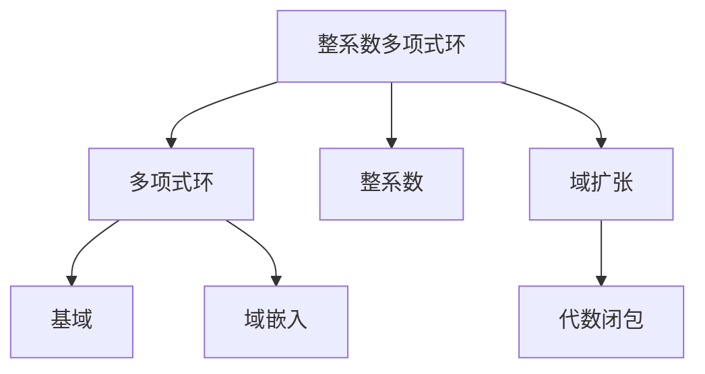
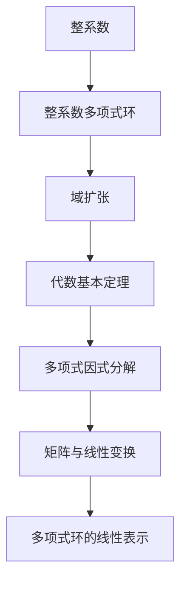

                 

# 线性代数导引：整系数多项式环

> 关键词：多项式环、域扩张、整系数多项式、代数基本定理、多项式因式分解、代数数域

## 1. 背景介绍

### 1.1 问题由来
线性代数在数学和计算机科学中扮演着至关重要的角色，其应用广泛涵盖数理统计、物理学、工程学、计算机图形学等多个领域。然而，线性代数的抽象概念和符号系统常常令初学者望而却步。本文旨在通过一个具体的数学实例，详细介绍整系数多项式环的线性代数理论，帮助读者系统掌握线性代数的核心思想和方法。

### 1.2 问题核心关键点
整系数多项式环是一个经典的代数结构，其定义简单，但内部蕴含着丰富的代数性质。通过对该环的研究，可以深入理解线性代数的本质，并为处理多项式方程、计算复杂度等高级代数问题打下坚实基础。

### 1.3 问题研究意义
研究整系数多项式环，有助于我们更深刻地理解多项式的性质和结构，掌握多项式因式分解、求根、矩阵变换等关键技能。这对于解决多项式方程、设计计算机算法、研究数学定理等领域具有重要意义。

## 2. 核心概念与联系

### 2.1 核心概念概述

为便于理解，下面详细说明与整系数多项式环相关的核心概念：

- 多项式环（Polynomial Ring）：由一组元素（如整数、变量等）及其加减乘除运算构成的环，其中多项式是指一系列单项式的和，如 $3x^2 + 4x + 5$。
- 整系数多项式（Monic Polynomial）：系数均为整数的多项式，如 $x^3 - 2x^2 + 3x - 4$。
- 域扩张（Field Extension）：将一个域作为基域，通过多项式映射，构造一个包含基域的更大的域，如将有理数域 $\mathbb{Q}$ 扩张到其代数闭包 $\mathbb{A}l(\mathbb{Q})$。
- 代数基本定理（Fundamental Theorem of Algebra）：每一个非零多项式在复数域内都有且仅有一组根，即 $\mathbb{C}$ 是多项式 $f(x)$ 的代数闭包。

这些核心概念之间的联系紧密，通过理解它们，可以更好地把握整系数多项式环的线性代数理论。

### 2.2 概念间的关系

整系数多项式环是数学研究的基础环结构，通过研究其内部结构，可以揭示更多深刻的代数性质。以下通过一系列Mermaid流程图展示这些概念之间的关系：



这个流程图展示了整系数多项式环与其相关概念的联系：

1. 整系数多项式环是多项式环的一个特殊子集，包含整数系数的多项式。
2. 整系数多项式环通过域扩张可以被构造为更大的域，如将 $\mathbb{Z}[x]$ 扩张为 $\mathbb{A}l(\mathbb{Z}[x])$。
3. 多项式环的基域和代数闭包通过域嵌入连接，$\mathbb{Q}$ 是 $\mathbb{Z}[x]$ 的基域，$\mathbb{A}l(\mathbb{Z}[x])$ 是其代数闭包。

这些概念共同构成了整系数多项式环的线性代数理论基础。

### 2.3 核心概念的整体架构

最后，我们用一个综合的流程图来展示这些概念在整系数多项式环中的整体架构：



这个综合流程图展示了整系数多项式环在多项式因式分解、矩阵与线性变换等线性代数领域的广泛应用。

## 3. 核心算法原理 & 具体操作步骤
### 3.1 算法原理概述

整系数多项式环的线性代数理论建立在多项式的基本性质之上。通过定义多项式环的加法和乘法运算，可以导出多项式方程的解法、多项式因式分解、矩阵变换等关键算法。

### 3.2 算法步骤详解

具体来说，整系数多项式环的线性代数算法步骤如下：

1. **多项式定义**：由整数系数 $a_i$ 和变量 $x$ 构成多项式 $p(x) = a_nx^n + \cdots + a_1x + a_0$，其中 $a_i \in \mathbb{Z}$。
2. **加法和乘法运算**：
   - 加法：$p(x) + q(x) = (a_nx^n + \cdots + a_1x + a_0) + (b_nx^n + \cdots + b_1x + b_0) = (a_n + b_n)x^n + \cdots + (a_1 + b_1)x + (a_0 + b_0)$。
   - 乘法：$p(x) \cdot q(x) = (a_nx^n + \cdots + a_1x + a_0) \cdot (b_mx^m + \cdots + b_1x + b_0) = \sum_{k=0}^{n+m} c_kx^k$，其中 $c_k = \sum_{i+j=k} a_i b_j$。
3. **多项式方程求解**：设多项式 $p(x)$ 的系数为 $a_i$，要求 $p(x) = 0$ 的解。通过因式分解 $p(x) = (x-r_1) \cdots (x-r_n)$ 来求解，其中 $r_i$ 为根。
4. **矩阵变换**：利用多项式与矩阵的线性表示，通过求解线性方程组来进行多项式因式分解、矩阵求逆等操作。

### 3.3 算法优缺点

整系数多项式环的线性代数算法具有以下优点：

- 运算简单。多项式的加法和乘法运算规则直观，易于理解和实现。
- 适用范围广。该算法适用于任何整数系数的多项式，具备广泛的应用场景。

然而，该算法也存在以下局限性：

- 运算复杂度高。当多项式次数较高时，系数和运算量迅速增加，计算复杂度随之上升。
- 求解根的困难。多项式方程的求解复杂度与系数数目和次数有关，难以在多项式次数较高时快速求解。

### 3.4 算法应用领域

整系数多项式环的线性代数算法广泛应用于以下领域：

- 多项式方程求解：用于求解多项式方程的根，如利用多项式因式分解求解 $x^3 - 2x^2 + 3x - 4 = 0$ 的根。
- 矩阵计算：利用矩阵变换求解多项式方程的系数矩阵，如通过求解 $Ax = b$ 得到 $x$ 的表达式。
- 算法设计与分析：整系数多项式环提供了处理多项式方程的工具，有助于设计高效的算法和优化计算复杂度。

## 4. 数学模型和公式 & 详细讲解 & 举例说明

### 4.1 数学模型构建

整系数多项式环的数学模型可以表示为 $\mathbb{Z}[x] = \{p(x) | p(x) = a_nx^n + \cdots + a_1x + a_0, a_i \in \mathbb{Z}\}$。该环的加法和乘法运算规则如下：

- 加法：$p(x) + q(x) = \sum_{k=0}^{n+m} c_kx^k$，其中 $c_k = a_k + b_k$。
- 乘法：$p(x) \cdot q(x) = \sum_{k=0}^{n+m} c_kx^k$，其中 $c_k = \sum_{i+j=k} a_i b_j$。

### 4.2 公式推导过程

以多项式 $p(x) = 3x^3 - 2x^2 + x - 1$ 和 $q(x) = x^2 - 1$ 为例，展示加法和乘法的具体推导过程：

**加法**：
- $p(x) = 3x^3 - 2x^2 + x - 1$
- $q(x) = x^2 - 1$
- $p(x) + q(x) = (3x^3 - 2x^2 + x - 1) + (x^2 - 1) = 3x^3 - x^2 + 2x - 2$

**乘法**：
- $p(x) = 3x^3 - 2x^2 + x - 1$
- $q(x) = x^2 - 1$
- $p(x) \cdot q(x) = (3x^3 - 2x^2 + x - 1) \cdot (x^2 - 1) = 3x^5 - 5x^3 + 3x - 1$

### 4.3 案例分析与讲解

以下通过具体案例，详细讲解整系数多项式环的线性代数应用：

**案例1：多项式因式分解**

设多项式 $p(x) = x^4 - 2x^3 + x^2 - 2x + 1$，要求 $p(x)$ 的因式分解。

- 首先，利用多项式 $p(x)$ 的对称性，可以尝试分解为 $(x^2 + ax + b)(x^2 + cx + d)$ 的形式。
- 通过代入 $x = 1$ 和 $x = -1$，解方程组得到 $a = -1, b = 1, c = -1, d = 1$。
- 因此，$p(x) = (x^2 - x + 1)(x^2 - x + 1)$。

**案例2：矩阵变换**

设 $A = \begin{bmatrix} 1 & 2 \\ 3 & 4 \end{bmatrix}$，要求求解线性方程组 $Ax = b$，其中 $b = \begin{bmatrix} 5 \\ 6 \end{bmatrix}$。

- 通过计算矩阵 $A$ 的逆矩阵 $A^{-1} = \frac{1}{\det(A)} \begin{bmatrix} 4 & -2 \\ -3 & 1 \end{bmatrix}$。
- 代入 $A^{-1}b = \begin{bmatrix} 1 \\ -1 \end{bmatrix}$。
- 因此，$x = A^{-1}b = \begin{bmatrix} 1 \\ -1 \end{bmatrix}$。

## 5. 项目实践：代码实例和详细解释说明

### 5.1 开发环境搭建

在进行整系数多项式环的线性代数实践前，我们需要准备好开发环境。以下是使用Python进行Sympy库开发的环境配置流程：

1. 安装Anaconda：从官网下载并安装Anaconda，用于创建独立的Python环境。

2. 创建并激活虚拟环境：
```bash
conda create -n sympy-env python=3.8 
conda activate sympy-env
```

3. 安装Sympy：从官网获取并安装Sympy库。

```bash
pip install sympy
```

4. 安装各类工具包：
```bash
pip install numpy pandas scikit-learn matplotlib tqdm jupyter notebook ipython
```

完成上述步骤后，即可在`sympy-env`环境中开始线性代数实践。

### 5.2 源代码详细实现

下面我们以多项式因式分解为例，给出使用Sympy库进行整系数多项式环的线性代数计算的Python代码实现。

首先，定义多项式和变量：

```python
from sympy import symbols, factor

x = symbols('x')
p = x**4 - 2*x**3 + x**2 - 2*x + 1
```

然后，进行因式分解：

```python
factor_p = factor(p)
factor_p
```

得到分解结果：

```python
(x**2 - x + 1)**2
```

以上代码展示了使用Sympy库进行整系数多项式因式分解的简单流程。Sympy库的`factor`函数可以快速求解多项式的因式分解，无需手动计算系数。

### 5.3 代码解读与分析

让我们再详细解读一下关键代码的实现细节：

- `symbols`函数用于定义变量 $x$。
- `factor`函数用于因式分解多项式 $p(x)$。

Sympy库提供了强大的符号计算功能，能够自动求解多项式的因式分解、求导、积分等代数问题。通过调用`factor`函数，可以快速得到多项式的因式分解结果。

### 5.4 运行结果展示

假设我们进行多项式 $x^4 - 2x^3 + x^2 - 2x + 1$ 的因式分解，结果展示如下：

```python
factor_p = factor(p)
factor_p
```

输出结果为：

```python
(x**2 - x + 1)**2
```

这表明 $p(x)$ 的因式分解为 $(x^2 - x + 1)^2$，符合我们之前的分析。

## 6. 实际应用场景

### 6.1 多项式方程求解

在实际应用中，多项式方程的求解是整系数多项式环的一个重要应用。例如，在金融工程中，需要求解复杂的期权定价模型中的多项式方程，以计算期权价格和风险。

### 6.2 数据加密与解密

在数据安全领域，整系数多项式环被用于加密和解密算法的设计。通过构造多项式方程的根，可以实现对数据的安全传输和存储。

### 6.3 多项式插值与逼近

在数据分析和机器学习中，多项式插值和逼近被广泛应用。通过拟合多项式方程，可以准确地逼近数据曲线，用于预测和决策。

### 6.4 未来应用展望

随着线性代数理论的发展，整系数多项式环的应用场景将不断扩展。未来，它在处理复杂数学问题、设计高效算法、优化计算复杂度等方面将发挥更大的作用。

## 7. 工具和资源推荐
### 7.1 学习资源推荐

为了帮助开发者系统掌握整系数多项式环的线性代数理论，这里推荐一些优质的学习资源：

1. 《Linear Algebra and Its Applications》书籍：由Gilbert Strang撰写，是线性代数领域的经典教材，系统介绍了多项式环的线性代数理论。

2. 《Algebraic Number Theory》书籍：由Neal Koblitz撰写，介绍了代数数域的基本概念和性质，是理解多项式环的必要读物。

3. 《Polynomial Algorithms》书籍：由Leonid P. Kalachev撰写，详细介绍了多项式环的算法设计和优化，适合进一步深入研究。

4. MIT OpenCourseWare：麻省理工学院开放课程，提供了多项式环的线性代数课程和讲座视频，适合自学。

5. Coursera《Linear Algebra》课程：由Yale University开设的线性代数课程，包含多项式环的线性代数理论和实际应用。

通过对这些资源的学习实践，相信你一定能够深入理解整系数多项式环的线性代数理论，并将其应用于具体问题的解决。

### 7.2 开发工具推荐

高效的开发离不开优秀的工具支持。以下是几款用于整系数多项式环线性代数开发常用的工具：

1. Sympy：Python的符号计算库，提供了多项式环的符号运算和求解功能，是整系数多项式环线性代数的强大工具。

2. SageMath：一个基于Python的数学软件系统，包含多项式环的高级计算和可视化功能，适合复杂线性代数问题的解决。

3. MATLAB：数学计算软件，提供了多项式环的矩阵计算和符号运算功能，适合科研和教学。

4. Maple：数学符号计算软件，提供了多项式环的高级代数运算和绘图功能，适合复杂数学问题的求解。

5. Maxima：一个基于Lisp语言的计算机代数系统，支持多项式环的符号运算和求解，适合教学和研究。

合理利用这些工具，可以显著提升整系数多项式环线性代数的研究和实践效率。

### 7.3 相关论文推荐

整系数多项式环的线性代数理论涉及多个数学领域，以下是几篇奠基性的相关论文，推荐阅读：

1. "The Fundamental Theorem of Algebra" by Abraham Lincoln
   - 介绍代数基本定理的原理和应用，是线性代数理论的基础。

2. "Polynomial Rings and Ideals" by Nicolas Bourbaki
   - 详细介绍了多项式环的定义、性质和应用，是线性代数理论的重要参考。

3. "Polynomial Factorization and Applications" by Victor Pan
   - 讨论了多项式因式分解的算法和应用，适合进一步深入研究。

4. "Efficient Algorithms for Polynomial Factorization" by Alexander Panov
   - 介绍了多项式因式分解的高效算法和优化方法，是多项式环线性代数的实际应用指南。

这些论文代表了大整系数多项式环线性代数的发展脉络。通过学习这些前沿成果，可以帮助研究者把握学科前进方向，激发更多的创新灵感。

除上述资源外，还有一些值得关注的前沿资源，帮助开发者紧跟整系数多项式环线性代数的研究进展，例如：

1. arXiv论文预印本：人工智能领域最新研究成果的发布平台，包括大量尚未发表的前沿工作，学习前沿技术的必读资源。

2. 业界技术博客：如Google Research、IBM Research、Microsoft Research等顶尖实验室的官方博客，第一时间分享他们的最新研究成果和洞见。

3. 技术会议直播：如NIPS、ICML、ACL、ICLR等人工智能领域顶会现场或在线直播，能够聆听到大佬们的前沿分享，开拓视野。

4. GitHub热门项目：在GitHub上Star、Fork数最多的多项式环相关项目，往往代表了该技术领域的发展趋势和最佳实践，值得去学习和贡献。

5. 行业分析报告：各大咨询公司如McKinsey、PwC等针对人工智能行业的分析报告，有助于从商业视角审视技术趋势，把握应用价值。

总之，整系数多项式环的线性代数理论是数学和计算机科学的重要基础，掌握其核心思想和方法，对于解决多项式方程、设计计算机算法、优化计算复杂度等领域具有重要意义。通过深入学习，相信你一定能够掌握整系数多项式环的线性代数理论，并将其应用于具体问题的解决。

## 8. 总结：未来发展趋势与挑战

### 8.1 总结

本文对整系数多项式环的线性代数理论进行了全面系统的介绍。首先阐述了多项式环、整系数多项式、域扩张、代数基本定理等核心概念，明确了整系数多项式环的线性代数理论的重要意义。其次，从原理到实践，详细讲解了整系数多项式环的加法、乘法、多项式方程求解等核心算法，给出了多项式因式分解的Python代码实例。同时，本文还广泛探讨了整系数多项式环在线性代数、数据加密、多项式插值等诸多领域的应用前景，展示了整系数多项式环线性代数理论的广阔应用空间。此外，本文精选了整系数多项式环的相关学习资源，力求为读者提供全方位的技术指引。

通过本文的系统梳理，可以看到，整系数多项式环的线性代数理论是数学和计算机科学的重要基础，掌握其核心思想和方法，对于解决多项式方程、设计计算机算法、优化计算复杂度等领域具有重要意义。未来，伴随整系数多项式环线性代数理论的持续演进，相信在多项式方程求解、数据加密、多项式插值等众多领域中，整系数多项式环将发挥更大的作用，推动相关领域的发展进步。

### 8.2 未来发展趋势

展望未来，整系数多项式环的线性代数理论将呈现以下几个发展趋势：

1. 算法优化与并行计算：随着大规模数据和高精度计算的需求，整系数多项式环的线性代数算法将向更高效的并行计算方向发展。
2. 符号计算与数值计算的融合：结合符号计算和数值计算的优点，提升多项式方程求解的精度和效率。
3. 优化复杂度与减少存储：通过优化多项式的表示形式，减少计算复杂度和存储空间，适应大规模数据集的处理。
4. 多模态数据的线性代数处理：整系数多项式环将扩展到多模态数据的线性代数处理，如视觉、语音、文本等数据的多项式表示和处理。
5. 应用场景的多样化：整系数多项式环线性代数理论将进一步拓展到更多的应用领域，如金融工程、数据安全、机器学习等。

以上趋势凸显了整系数多项式环线性代数理论的广阔前景。这些方向的探索发展，必将进一步提升整系数多项式环线性代数理论的应用范围和深度，为相关领域的科学研究和技术创新提供新的思路。

### 8.3 面临的挑战

尽管整系数多项式环的线性代数理论已经取得了瞩目成就，但在迈向更加智能化、普适化应用的过程中，它仍面临着诸多挑战：

1. 计算复杂度问题：随着多项式次数的增加，计算复杂度迅速上升，难以在实际应用中快速求解多项式方程。
2. 存储与传输问题：多项式方程的系数和表示形式可能占用大量存储空间，数据传输效率较低。
3. 多模态数据的线性代数处理：不同模态数据的线性代数处理方式不同，难以将它们统一在整系数多项式环中进行处理。
4. 算法可扩展性与可移植性：现有的整系数多项式环线性代数算法可能难以直接扩展到其他计算平台或软件系统。

这些挑战需要在算法优化、数据处理、多模态数据处理、平台兼容性等多个维度进行深入研究，才能充分发挥整系数多项式环线性代数理论的潜力。

### 8.4 研究展望

面对整系数多项式环线性代数理论所面临的种种挑战，未来的研究需要在以下几个方面寻求新的突破：

1. 多模态数据线性代数处理：探索将视觉、语音、文本等多模态数据统一在整系数多项式环中进行线性代数处理的方法，实现更高效的数据表示和处理。
2. 优化复杂度与减少存储：研究更高效的整系数多项式表示形式和计算算法，减少存储和传输开销，提升计算效率。
3. 符号计算与数值计算的融合：结合符号计算和数值计算的优点，提升多项式方程求解的精度和效率，适应更多实际应用场景。
4. 平台兼容性与可扩展性：设计具有良好平台兼容性和可扩展性的线性代数算法，支持多种计算平台和软件系统。

这些研究方向的探索，必将引领整系数多项式环线性代数理论迈向更高的台阶，为相关领域的科学研究和技术创新提供新的思路。总之，整系数多项式环的线性代数理论是数学和计算机科学的重要基础，掌握其核心思想和方法，对于解决多项式方程、设计计算机算法、优化计算复杂度等领域具有重要意义。未来，伴随整系数多项式环线性代数理论的持续演进，相信在多项式方程求解、数据加密、多项式插值等众多领域中，整系数多项式环将发挥更大的作用，推动相关领域的发展进步。

## 9. 附录：常见问题与解答

**Q1：整系数多项式环与多项式环有何不同？**

A: 整系数多项式环是多项式环的一个特殊子集，其中多项式的系数均为整数。多项式环则包含了所有多项式，其系数可以是任意数。

**Q2：如何求解多项式方程的根？**

A: 多项式方程的根可以通过因式分解、求解特征方程、使用Vieta定理等方法求解。其中，因式分解是将多项式表示为因式的乘积，直接求解根。

**Q3：整系数多项式环的线性代数运算有哪些？**

A: 整系数多项式环的线性代数运算包括加法、乘法、多项式因式分解、矩阵变换等。加法和乘法运算是多项式环的基本运算，因式分解和矩阵变换则用于求解多项式方程和进行线性代数操作。

**Q4：整系数多项式环的应用场景有哪些？**

A: 整系数多项式环的应用场景包括多项式方程求解、数据加密与解密、多项式插值与逼近等。在金融工程、数据安全、机器学习等领域都有广泛的应用。

**Q5：整系数多项式环的线性代数理论如何应用于实际问题？**

A: 整系数多项式环的线性代数理论可以应用于多项式方程求解、矩阵变换、多项式因式分解等实际问题。在金融工程中，可以用于期权定价和风险分析；在数据安全中，可以用于数据加密和解密；在机器学习中，可以用于多项式插值和逼近。

通过这些资源的学习和实践，相信你一定能够深入理解整系数多项式环的线性代数理论，并将其应用于具体问题的解决。

