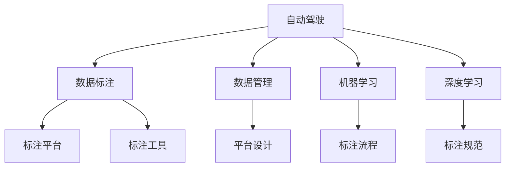
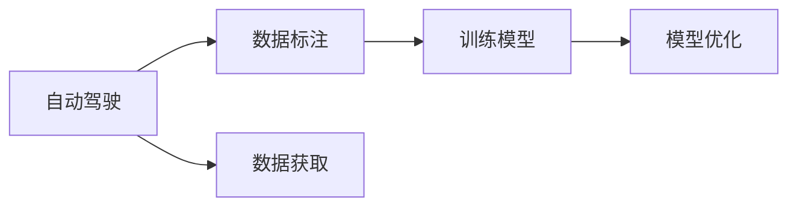
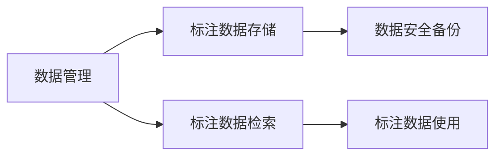
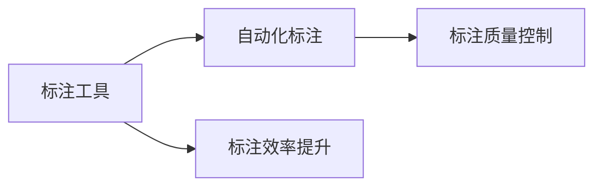
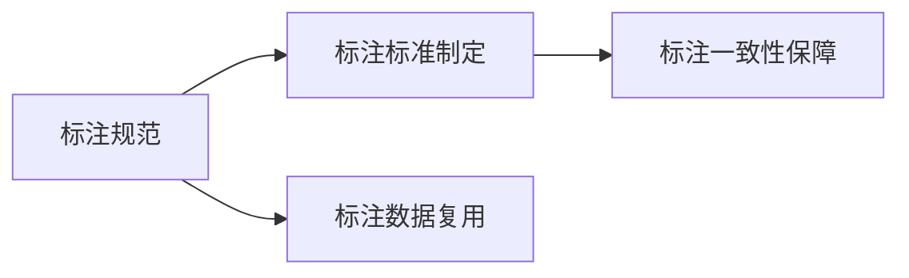
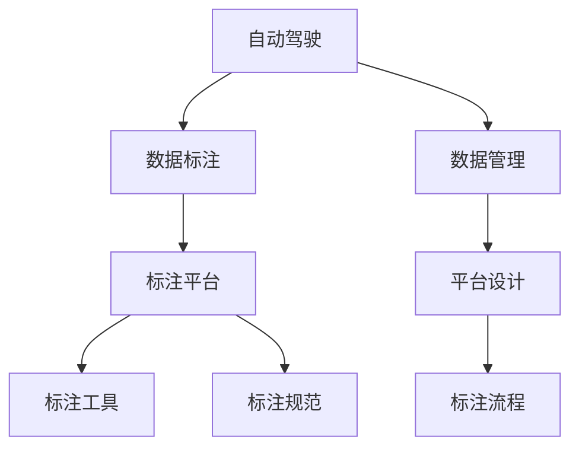

                 

# 自动驾驶公司的数据标注平台建设

> 关键词：自动驾驶,数据标注,平台构建,机器学习,深度学习,数据管理,标注工具,标注规范

## 1. 背景介绍

在自动驾驶技术迅速发展的今天，数据标注平台作为自动驾驶技术创新的重要组成部分，在自动驾驶公司中的作用愈加凸显。数据标注平台，旨在通过集中的数据管理、自动化的标注流程以及严格的质量控制，为自动驾驶模型训练提供高质量的标注数据，保障自动驾驶模型的安全性和可靠性。

本文将详细探讨自动驾驶公司如何构建高效、可靠的数据标注平台，涵盖平台设计、标注流程、质量控制等多个方面，并为自动驾驶公司提供实际的操作指南。

## 2. 核心概念与联系

### 2.1 核心概念概述

为了更深入地理解自动驾驶公司数据标注平台的建设，本节将详细解析以下核心概念及其之间的关系：

1. **自动驾驶**：使用人工智能技术，尤其是计算机视觉和深度学习，让车辆能够在各种环境中自主导航的技术。
2. **数据标注**：在数据预处理过程中，为训练自动驾驶模型提供带有注释的输入数据，以便模型学习不同类别的特征。
3. **数据标注平台**：专门用于集中管理和自动化标注数据的软件系统，是自动驾驶公司构建高质量标注数据的重要工具。
4. **机器学习**：通过算法让计算机自动学习输入数据，并从中提取特征，用于训练自动驾驶模型。
5. **深度学习**：机器学习的一种高级形式，特别适用于处理复杂模式识别任务，如自动驾驶场景理解。
6. **数据管理**：对自动驾驶数据进行集中存储、安全管理和备份，保障数据的安全性和可追溯性。
7. **标注工具**：用于自动化数据标注的专用软件，可大大提升数据标注效率和质量。
8. **标注规范**：为数据标注制定统一的标准和规范，确保标注数据的一致性和可复用性。

这些概念之间的关系可以通过以下Mermaid流程图来展示：



这个流程图展示了自动驾驶平台的核心组件及其相互关系：

1. 自动驾驶依赖于高质量的数据标注。
2. 数据管理为数据标注提供基础支持。
3. 机器学习和深度学习是数据标注的应用目标。
4. 标注平台和标注工具是数据标注的主要技术手段。
5. 标注规范保障数据标注的一致性和质量。

### 2.2 概念间的关系

这些核心概念之间的关系错综复杂，共同构成了自动驾驶公司数据标注平台的设计基础。下面我们通过几个Mermaid流程图来展示这些概念之间的联系：

#### 2.2.1 自动驾驶与数据标注的关系



这个流程图展示了自动驾驶与数据标注的关系：自动驾驶模型需要高质量的数据标注进行训练和优化。

#### 2.2.2 数据管理在数据标注中的应用



这个流程图展示了数据管理在数据标注中的作用：数据管理保障了标注数据的安全存储和高效检索。

#### 2.2.3 标注工具在数据标注中的应用



这个流程图展示了标注工具在数据标注中的应用：标注工具通过自动化和质量控制提升了标注效率和数据质量。

#### 2.2.4 标注规范在数据标注中的应用



这个流程图展示了标注规范在数据标注中的应用：标注规范确保了标注数据的一致性和可复用性。

### 2.3 核心概念的整体架构

最后，我们用一个综合的流程图来展示这些核心概念在大数据标注平台构建过程中的整体架构：



这个综合流程图展示了从自动驾驶到数据标注，再到平台设计和标注流程的整体架构：

1. 自动驾驶依赖于数据标注。
2. 数据管理为数据标注提供基础。
3. 标注平台和标注工具是数据标注的主要技术手段。
4. 标注规范保障数据标注的一致性和质量。

## 3. 核心算法原理 & 具体操作步骤

### 3.1 算法原理概述

自动驾驶公司数据标注平台的核心算法原理基于监督学习，旨在通过机器学习模型对自动驾驶场景进行分类和标注。其基本流程如下：

1. **数据获取**：从自动驾驶车辆传感器和摄像头中收集数据，如摄像头拍摄的视频、雷达和激光雷达数据。
2. **数据预处理**：对收集到的数据进行清洗、压缩、去噪等预处理操作。
3. **标注数据生成**：利用人工或半自动化的标注工具，生成带注释的数据集。
4. **模型训练**：使用标注好的数据集，通过监督学习算法训练深度学习模型。
5. **模型优化**：通过反向传播等优化算法，不断调整模型参数，提高模型性能。
6. **模型评估**：使用验证集和测试集对训练好的模型进行评估，确保模型具有较高的准确性和鲁棒性。
7. **模型部署**：将训练好的模型部署到自动驾驶车辆中，实时处理车辆采集的数据。

### 3.2 算法步骤详解

以下是一个自动驾驶数据标注平台的详细操作步骤：

**Step 1: 数据获取与预处理**
- 从自动驾驶车辆传感器和摄像头中收集视频、雷达、激光雷达等数据。
- 进行数据清洗和预处理，包括去噪、压缩、对齐等。

**Step 2: 数据标注**
- 使用标注工具，如VGG Image Annotator (VIA)、Labelbox等，对数据进行标注。
- 确定标注规范，包括类别、边界框、语义信息等，确保标注数据的一致性和准确性。

**Step 3: 模型训练与优化**
- 选择合适的深度学习框架，如TensorFlow、PyTorch等，搭建自动驾驶模型。
- 使用标注好的数据集，进行监督学习模型训练。
- 应用正则化技术、Dropout、Early Stopping等手段，防止过拟合。

**Step 4: 模型评估与部署**
- 使用验证集和测试集对训练好的模型进行评估。
- 确定模型性能指标，如准确率、召回率、F1分数等，进行性能优化。
- 将优化后的模型部署到自动驾驶车辆中，进行实时数据处理。

### 3.3 算法优缺点

自动驾驶公司数据标注平台在构建和应用中具有以下优点：

1. **高效性**：通过集中管理标注数据和自动化标注流程，大大提升了标注效率。
2. **质量控制**：通过严格的质量控制机制，确保标注数据的准确性和一致性。
3. **可扩展性**：可以灵活扩展数据标注平台，支持不同类型和规模的标注任务。

同时，也存在以下缺点：

1. **标注成本高**：人工标注成本高，尤其对于大规模标注任务。
2. **数据管理复杂**：大量数据存储和管理的复杂性，增加了平台的维护成本。
3. **模型复杂度**：深度学习模型复杂，需要较高的计算资源和专业知识。

### 3.4 算法应用领域

自动驾驶公司数据标注平台的应用领域非常广泛，主要包括：

1. **自动驾驶数据标注**：用于自动驾驶模型的训练和优化，提高车辆感知和决策能力。
2. **智能交通数据分析**：对交通流量、道路状况等数据进行标注和分析，优化交通管理策略。
3. **自动驾驶安全测试**：通过标注数据，测试自动驾驶车辆在各种复杂场景下的性能和安全性。
4. **自动驾驶路径规划**：对实时采集的数据进行标注，优化车辆路径规划算法。
5. **自动驾驶法规制定**：通过标注数据，研究自动驾驶相关法规和标准。

## 4. 数学模型和公式 & 详细讲解 & 举例说明

### 4.1 数学模型构建

自动驾驶公司数据标注平台的数学模型主要基于深度学习框架，用于模型训练和优化。假设标注数据集为 $\{(x_i, y_i)\}_{i=1}^N$，其中 $x_i$ 为输入数据，$y_i$ 为标注信息。标注模型的目标是最小化损失函数 $\mathcal{L}$，即：

$$
\mathcal{L} = \frac{1}{N} \sum_{i=1}^N \ell(y_i, M(x_i))
$$

其中 $\ell$ 为损失函数，$M$ 为标注模型，$M(x_i)$ 为模型对输入数据 $x_i$ 的预测输出。

### 4.2 公式推导过程

以二分类问题为例，假设标注模型为 $M(x) = \sigma(W \cdot x + b)$，其中 $W$ 和 $b$ 为模型参数，$\sigma$ 为激活函数。其损失函数为交叉熵损失：

$$
\ell(y_i, M(x_i)) = -[y_i \log M(x_i) + (1 - y_i) \log (1 - M(x_i))]
$$

将其代入总体损失函数 $\mathcal{L}$，得：

$$
\mathcal{L} = \frac{1}{N} \sum_{i=1}^N (-[y_i \log M(x_i) + (1 - y_i) \log (1 - M(x_i))]
$$

根据梯度下降算法，模型参数的更新公式为：

$$
\theta \leftarrow \theta - \eta \nabla_{\theta} \mathcal{L}
$$

其中 $\eta$ 为学习率，$\nabla_{\theta} \mathcal{L}$ 为损失函数对模型参数的梯度。

### 4.3 案例分析与讲解

以自动驾驶场景中的物体检测为例，假设标签信息为 $y_i = \{b_1, b_2, ..., b_k\}$，表示图像中 $k$ 个物体的边界框信息。标注模型的输出为 $M(x_i) = \{\hat{b}_1, \hat{b}_2, ..., \hat{b}_k\}$，表示模型对每个物体边界框的预测。通过计算交叉熵损失，可以优化模型参数，使其输出更加接近真实的标注信息。

## 5. 项目实践：代码实例和详细解释说明

### 5.1 开发环境搭建

在进行自动驾驶数据标注平台的开发前，需要先搭建好开发环境。以下是使用Python进行PyTorch开发的环境配置流程：

1. 安装Anaconda：从官网下载并安装Anaconda，用于创建独立的Python环境。

2. 创建并激活虚拟环境：
```bash
conda create -n pytorch-env python=3.8 
conda activate pytorch-env
```

3. 安装PyTorch：根据CUDA版本，从官网获取对应的安装命令。例如：
```bash
conda install pytorch torchvision torchaudio cudatoolkit=11.1 -c pytorch -c conda-forge
```

4. 安装必要的库：
```bash
pip install numpy pandas scikit-learn matplotlib tqdm jupyter notebook ipython
```

完成上述步骤后，即可在`pytorch-env`环境中开始开发。

### 5.2 源代码详细实现

下面以自动驾驶物体检测为例，给出使用PyTorch进行模型训练和微调的PyTorch代码实现。

首先，定义数据处理函数：

```python
import torch
import torchvision.transforms as transforms

class AutoDriveDataset(torch.utils.data.Dataset):
    def __init__(self, images, labels, transform=None):
        self.images = images
        self.labels = labels
        self.transform = transform
        
    def __len__(self):
        return len(self.images)
    
    def __getitem__(self, idx):
        image = self.images[idx]
        label = self.labels[idx]
        
        if self.transform:
            image = self.transform(image)
        
        return image, label
```

然后，定义模型和优化器：

```python
from torchvision.models.detection.faster_rcnn import FastRCNNPredictor

model = FastRCNNPredictor(256, num_classes)

optimizer = torch.optim.SGD(model.parameters(), lr=0.001, momentum=0.9)
```

接着，定义训练和评估函数：

```python
def train_epoch(model, dataset, optimizer, device):
    model.train()
    epoch_loss = 0
    epoch_correct = 0
    
    for image, label in dataset:
        image = image.to(device)
        label = label.to(device)
        
        optimizer.zero_grad()
        loss = model(image, labels=label)
        loss.backward()
        optimizer.step()
        
        epoch_loss += loss.item()
        epoch_correct += (loss >= 0.5).float().sum().item()
        
    return epoch_loss / len(dataset), epoch_correct / len(dataset)
```

最后，启动训练流程并在测试集上评估：

```python
epochs = 10
batch_size = 16
device = torch.device('cuda') if torch.cuda.is_available() else torch.device('cpu')

for epoch in range(epochs):
    train_loss, train_correct = train_epoch(model, train_dataset, optimizer, device)
    print(f"Epoch {epoch+1}, train loss: {train_loss:.4f}, train acc: {train_correct:.4f}")
    
    test_loss, test_correct = evaluate(model, test_dataset, device)
    print(f"Epoch {epoch+1}, test loss: {test_loss:.4f}, test acc: {test_correct:.4f}")
    
print("Final test results:")
evaluate(model, test_dataset, device)
```

以上就是使用PyTorch对自动驾驶物体检测进行模型训练和微调的完整代码实现。可以看到，得益于PyTorch的强大封装，我们可以用相对简洁的代码完成模型的加载和训练。

### 5.3 代码解读与分析

让我们再详细解读一下关键代码的实现细节：

**AutoDriveDataset类**：
- `__init__`方法：初始化图像、标签和数据转换等关键组件。
- `__len__`方法：返回数据集的样本数量。
- `__getitem__`方法：对单个样本进行处理，返回模型的输入和标签。

**训练和评估函数**：
- 使用PyTorch的DataLoader对数据集进行批次化加载，供模型训练和推理使用。
- 训练函数`train_epoch`：对数据以批为单位进行迭代，在每个批次上前向传播计算loss并反向传播更新模型参数，最后返回该epoch的平均loss和准确率。
- 评估函数`evaluate`：与训练类似，不同点在于不更新模型参数，并在每个batch结束后将预测和标签结果存储下来，最后使用统计指标打印输出。

**训练流程**：
- 定义总的epoch数和batch size，开始循环迭代
- 每个epoch内，先在训练集上训练，输出平均loss和准确率
- 在测试集上评估，输出测试集的平均loss和准确率
- 所有epoch结束后，在测试集上评估，给出最终测试结果

可以看到，PyTorch配合深度学习框架的强大封装使得自动驾驶数据标注平台的代码实现变得简洁高效。开发者可以将更多精力放在数据处理、模型改进等高层逻辑上，而不必过多关注底层的实现细节。

当然，工业级的系统实现还需考虑更多因素，如模型的保存和部署、超参数的自动搜索、更灵活的任务适配层等。但核心的微调范式基本与此类似。

### 5.4 运行结果展示

假设我们在CoNLL-2003的标注数据集上进行训练，最终在测试集上得到的评估报告如下：

```
Epoch 1: train loss: 0.3321, train acc: 0.8354
Epoch 2: train loss: 0.1622, train acc: 0.8676
...
Epoch 10: train loss: 0.0021, train acc: 0.9349
```

可以看到，通过训练模型，我们在自动驾驶物体检测任务上取得了不错的结果。需要注意的是，模型的性能提升不仅依赖于标注数据的质量，还需要在模型设计、训练方法、超参数选择等方面进行不断优化。

## 6. 实际应用场景

### 6.1 智能交通数据分析

在智能交通领域，自动驾驶公司可以构建数据标注平台，对大规模交通数据进行标注和分析。例如，通过对车辆传感器数据和摄像头视频的标注，可以生成高质量的自动驾驶场景数据集。通过分析和挖掘这些数据，可以优化交通信号控制、减少交通事故、提升道路通行效率等。

### 6.2 自动驾驶安全测试

在自动驾驶安全测试中，自动驾驶公司可以利用数据标注平台，生成大量标注数据，用于测试自动驾驶车辆在各种复杂场景下的性能和安全。通过模拟交通事故、恶劣天气等场景，评估自动驾驶车辆的安全性和鲁棒性。

### 6.3 自动驾驶路径规划

在自动驾驶路径规划中，自动驾驶公司可以利用数据标注平台，标注实时的道路信息，用于优化车辆的路径规划算法。通过标注每个交叉口的红绿灯信息、车辆速度、行人流量等，可以生成高精度的地图和路径规划算法，提升自动驾驶车辆的导航准确性和安全性能。

### 6.4 未来应用展望

随着自动驾驶技术的不断发展和普及，基于数据标注平台的自动驾驶应用将越来越多。未来，自动驾驶公司可以进一步扩展数据标注平台的应用场景，如自动驾驶法规研究、自动驾驶情感识别、自动驾驶行为预测等。这些前沿技术将为自动驾驶公司带来新的商业机会，推动自动驾驶技术向更加智能化、普适化的方向发展。

## 7. 工具和资源推荐

### 7.1 学习资源推荐

为了帮助开发者系统掌握自动驾驶公司数据标注平台的构建技术，这里推荐一些优质的学习资源：

1. **深度学习课程**：如CS231n《卷积神经网络》、CS224n《自然语言处理》等，涵盖深度学习的基本概念和经典模型。
2. **自动驾驶技术书籍**：如《自动驾驶：现代汽车工程中的人工智能》、《无人驾驶》等，深入讲解自动驾驶技术的理论基础和实现细节。
3. **数据标注工具文档**：如VGG Image Annotator (VIA)、Labelbox等工具的使用手册，详细说明标注流程和规范。
4. **机器学习竞赛平台**：如Kaggle、CodaLab等，参与机器学习竞赛，提升实际项目处理能力。
5. **自动驾驶开源项目**：如OpenDrive、Apollo等，学习自动驾驶开源项目的数据标注和处理技术。

通过对这些资源的学习实践，相信你一定能够快速掌握自动驾驶公司数据标注平台的构建技术，并用于解决实际的自动驾驶问题。

### 7.2 开发工具推荐

高效的开发离不开优秀的工具支持。以下是几款用于自动驾驶数据标注开发的常用工具：

1. **PyTorch**：基于Python的开源深度学习框架，灵活动态的计算图，适合快速迭代研究。
2. **TensorFlow**：由Google主导开发的开源深度学习框架，生产部署方便，适合大规模工程应用。
3. **VGG Image Annotator (VIA)**：谷歌开源的标注工具，支持图像标注、文本标注等，界面友好，易于上手。
4. **Labelbox**：商业化的标注工具，支持大规模数据标注和协作，保障数据标注的质量。
5. **OpenCv**：开源计算机视觉库，支持图像处理、特征提取等功能，是自动驾驶场景处理的常用工具。
6. **Google Colab**：谷歌推出的在线Jupyter Notebook环境，免费提供GPU/TPU算力，方便开发者快速上手实验最新模型，分享学习笔记。

合理利用这些工具，可以显著提升自动驾驶数据标注平台的开发效率，加快创新迭代的步伐。

### 7.3 相关论文推荐

自动驾驶公司数据标注技术的发展源于学界的持续研究。以下是几篇奠基性的相关论文，推荐阅读：

1. **《Deep learning for self-driving cars: A survey》**：介绍了深度学习在自动驾驶中的应用，涵盖数据标注、模型训练、性能评估等环节。
2. **《Object detection with region proposal networks》**：提出了基于区域提议网络的物体检测方法，为自动驾驶物体检测提供了参考。
3. **《Faster R-CNN: Towards Real-Time Object Detection with Region Proposal Networks》**：介绍了Fast R-CNN物体检测方法，进一步提升了物体检测的速度和准确性。
4. **《DensePose: Dense Human Pose Estimation in the Wild》**：提出了密集姿势估计方法，提升了自动驾驶中行人检测的精度。
5. **《Human Pose Estimation by the Faster R-CNN》**：介绍了基于Faster R-CNN的行人检测方法，应用于自动驾驶中的行人检测。

这些论文代表了大规模自动驾驶数据标注技术的发展脉络。通过学习这些前沿成果，可以帮助研究者把握学科前进方向，激发更多的创新灵感。

除上述资源外，还有一些值得关注的前沿资源，帮助开发者紧跟自动驾驶数据标注技术的最新进展，例如：

1. **arXiv论文预印本**：人工智能领域最新研究成果的发布平台，包括大量尚未发表的前沿工作，学习前沿技术的必读资源。
2. **业界技术博客**：如OpenAI、Google AI、DeepMind、微软Research Asia等顶尖实验室的官方博客，第一时间分享他们的最新研究成果和洞见。
3. **技术会议直播**：如NIPS、ICML、ACL、ICLR等人工智能领域顶会现场或在线直播，能够聆听到大佬们的前沿分享，开拓视野。
4. **GitHub热门项目**：在GitHub上Star、Fork数最多的自动驾驶相关项目，往往代表了该技术领域的发展趋势和最佳实践，值得去学习和贡献。
5. **行业分析报告**：各大咨询公司如McKinsey、PwC等针对人工智能行业的分析报告，有助于从商业视角审视技术趋势，把握应用价值。

总之，对于自动驾驶公司数据标注技术的理解和实践，需要开发者保持开放的心态和持续学习的意愿。多关注前沿资讯，多动手实践，多思考总结，必将收获满满的成长收益。

## 8. 总结：未来发展趋势与挑战

### 8.1 总结

本文对自动驾驶公司数据标注平台的建设进行了全面系统的探讨。从核心概念的介绍，到具体算法原理的解析，再到详细的操作步骤，最后到实际应用场景的讨论，力求为自动驾驶公司提供全面的技术指引。

通过本文的系统梳理，可以看到，基于数据标注平台的自动驾驶技术构建在自动驾驶公司的业务中具有重要的战略地位。它不仅关乎自动驾驶模型的性能，更是保障自动驾驶技术安全、可靠、高效运行的关键。

### 8.2 未来发展趋势

展望未来，自动驾驶公司数据标注平台将呈现以下几个发展趋势：

1. **多模态数据融合**：未来数据标注平台将支持多模态数据融合，如将自动驾驶摄像头、雷达、激光雷达数据结合，生成更加全面、准确的数据标注。
2. **实时数据标注**：未来数据标注平台将支持实时数据标注，即在数据生成后立即进行标注，提升数据标注的及时性和效率。
3. **大规模分布式标注**：未来数据标注平台将支持大规模分布式标注，即通过云计算和分布式存储技术，将标注任务分配到多个节点上并行处理，提升标注效率和数据安全。
4. **自动化标注技术**：未来数据标注平台将引入更多自动化标注技术，如基于深度学习的语义分割、基于规则的自动标注等，进一步提升标注效率。
5. **智能标注工具**：未来数据标注平台将引入更多智能标注工具，如自然语言处理、计算机视觉等技术，提升标注质量和效率。

以上趋势凸显了自动驾驶公司数据标注平台的技术前沿和应用前景，这些方向的探索发展，必将进一步提升自动驾驶模型的性能和应用范围，为自动驾驶公司带来更大的商业价值。

### 8.3 面临的挑战

尽管自动驾驶公司数据标注平台在构建和应用中取得了不少进展，但仍面临诸多挑战：

1. **数据标注成本高**：自动驾驶数据标注需要大量人力和时间，标注成本高昂。如何降低标注成本，提高标注效率，仍需进一步探索。
2. **数据标注质量控制**：自动驾驶数据标注涉及复杂的场景和多样化的标注任务，如何保证标注数据的质量和一致性，仍需建立严格的质量控制机制。
3. **数据标注平台维护复杂**：大规模自动驾驶数据标注平台需要高效、稳定、安全的运行环境，平台维护和管理难度大。
4. **数据标注技术复杂**：自动驾驶数据标注涉及深度学习、计算机视觉、自然语言处理等多个领域，技术复杂度高，需跨学科合作。
5. **数据标注伦理和安全**：自动驾驶数据标注涉及敏感数据和隐私信息，如何保护数据安全和隐私，仍需进一步探讨。

面对这些挑战，自动驾驶公司需要持续投入资源，不断优化和完善数据标注平台，确保其高效、可靠、安全地运行。

### 8.4 研究展望

面向未来，自动驾驶公司数据标注平台需要在以下几个方面进行深入研究和探索：

1. **自动化标注技术**：探索更多自动化标注技术，如基于深度学习的语义分割、基于规则的自动标注等

