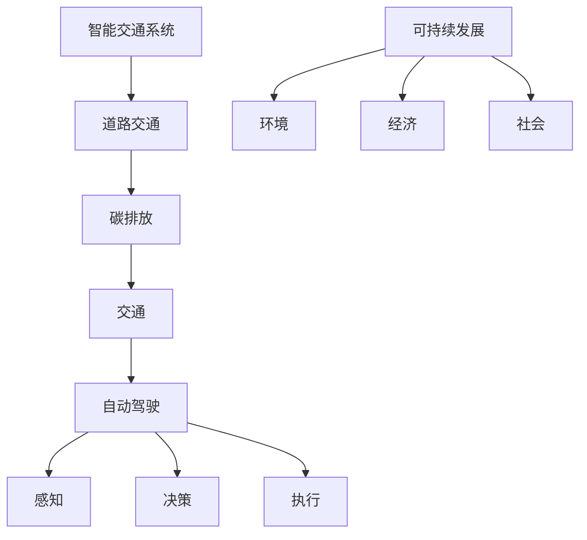

                 

## 1. 背景介绍

随着人工智能(AI)和自动驾驶技术的迅猛发展，自动驾驶行业正逐步从概念变为现实。自动驾驶车辆（Autonomous Vehicles, AVs）通过先进感知、决策和执行系统，能够在复杂多变的环境中自主安全行驶，大幅提升道路运输效率和安全性。然而，随着自动驾驶车辆保有量的增加，其在道路交通中所产生的碳排放也不可忽视。

### 1.1 自动驾驶技术现状

自动驾驶技术按自动化级别可分为多个等级，从完全人工驾驶的0级到全自动驾驶的5级。目前，自动驾驶技术主要集中在L2到L4级别，即驾驶员可以监控车辆操作，但车辆能够在某些情况下自动驾驶（L2），或者在特定条件或场景下自动驾驶（L3）到全自动驾驶（L4）。

L4级自动驾驶车辆被认为是全自动驾驶的代表，它能够完成所有驾驶任务，无需人类干预，覆盖包括高速公路、城市街道等多种复杂交通环境。

### 1.2 自动驾驶与碳排放

交通领域的碳排放是全球温室气体排放的重要组成部分，道路交通是其中主要贡献者之一。自动驾驶车辆在提高道路运输效率的同时，也对碳排放产生了深远影响。从减少交通拥堵、降低车辆运行能耗、提高燃料效率等多个方面，自动驾驶技术有望在减少碳排放方面发挥重要作用。

然而，自动驾驶车辆在运行过程中也存在一些潜在的碳排放问题。例如，在自动驾驶车辆未普及时，长途运输和城市通勤依赖私人汽车，其碳排放量远高于公共交通工具。随着自动驾驶车辆普及，长途物流运输和城市通勤转向自动驾驶车辆，其碳排放量也会相应增加。此外，自动驾驶车辆在运行过程中，需要进行定期维护和检测，这些过程也会产生一定的碳排放。

### 1.3 自动驾驶的碳排放挑战

自动驾驶技术虽然在减少碳排放方面具有巨大潜力，但其应用过程中也面临诸多挑战。

- **技术挑战**：自动驾驶车辆的核心技术尚需进一步优化和完善，如感知系统、决策算法、路径规划等。这些技术瓶颈可能导致车辆运行效率低下，增加能耗和碳排放。
- **基础设施挑战**：自动驾驶车辆需要依赖完善的基础设施支持，包括道路标记、信号灯、通信网络等。这些基础设施的建设和管理需要大量资源，也会产生一定的碳排放。
- **法规和政策挑战**：自动驾驶技术的推广应用需要相应的法规和政策支持。相关政策和法规的不完善，可能限制自动驾驶技术的普及和应用，影响碳排放的减少效果。

## 2. 核心概念与联系

### 2.1 核心概念概述

为更好地理解自动驾驶行业的碳排放与可持续发展，本节将介绍几个密切相关的核心概念：

- **自动驾驶**：通过人工智能技术实现的车辆自主驾驶系统，包括感知、决策和执行三个核心模块。
- **碳排放**：车辆运行过程中排放的二氧化碳等温室气体，是衡量环境污染和气候变化的重要指标。
- **道路交通**：车辆在道路上行驶形成的交通流，是碳排放的重要来源。
- **可持续发展**：在满足当前社会经济发展需要的同时，不损害未来代际满足其需求的能力，以确保环境、经济和社会三者的协调发展。
- **智能交通系统**：利用信息通信技术，优化交通流，提高道路运输效率和安全性，降低碳排放。

这些核心概念之间的逻辑关系可以通过以下Mermaid流程图来展示：



这个流程图展示了几大核心概念的相互关系：

1. 自动驾驶通过感知、决策和执行系统实现车辆自主驾驶。
2. 车辆在道路交通中运行时，会产生碳排放。
3. 智能交通系统通过优化交通流，提升道路运输效率和安全性，从而降低碳排放。
4. 可持续发展要求在减少碳排放的同时，保障经济和社会的发展。

### 2.2 概念间的关系

这些核心概念之间存在着紧密的联系，形成了自动驾驶行业碳排放与可持续发展的完整框架。

- **自动驾驶与碳排放**：自动驾驶技术的应用，可以大幅提升道路运输效率，降低车辆能耗，减少碳排放。但同时，自动驾驶车辆在运行和维护过程中也会产生一定的碳排放。
- **道路交通与可持续发展**：道路交通是碳排放的重要来源，通过智能交通系统的优化，可以有效降低碳排放，推动可持续发展。
- **智能交通系统与碳排放**：智能交通系统通过优化交通流，提高道路运输效率，降低车辆运行能耗和碳排放。同时，智能交通系统也需要依赖低碳基础设施建设。

这些概念共同构成了自动驾驶行业碳排放与可持续发展的基本框架，为进一步研究提供了清晰的思路。

## 3. 核心算法原理 & 具体操作步骤
### 3.1 算法原理概述

自动驾驶车辆在运行过程中，碳排放主要由车辆能耗和行驶距离决定。车辆能耗又与行驶速度、驾驶方式、车辆类型等因素密切相关。因此，减少自动驾驶车辆碳排放的目标可以通过以下几种方式实现：

1. **优化驾驶策略**：通过优化驾驶速度、行驶路线、减速停车等策略，降低车辆能耗和碳排放。
2. **提高燃料效率**：使用高效燃油、电能等新能源，提升车辆燃料效率。
3. **利用智能交通系统**：通过智能交通系统的优化，提升道路运输效率，降低车辆运行能耗和碳排放。

### 3.2 算法步骤详解

以下是以优化驾驶策略为例，详细介绍自动驾驶车辆减少碳排放的核心步骤：

1. **数据收集与分析**：收集车辆运行过程中的速度、位置、行驶路线等数据，分析驾驶行为的碳排放特征。
2. **制定驾驶策略**：根据分析结果，制定优化驾驶策略，如设定最佳行驶速度、优化路径规划等。
3. **仿真与测试**：使用仿真工具模拟驾驶策略的实施效果，并进行实际测试，验证策略的可行性和效果。
4. **部署与监控**：将优化策略部署到自动驾驶系统中，并实时监控车辆运行状态，及时调整策略以应对不同驾驶场景。

### 3.3 算法优缺点

**优点**：
1. **降低能耗和碳排放**：优化驾驶策略可以显著降低车辆能耗和碳排放。
2. **提升道路运输效率**：智能交通系统的优化可以提升道路运输效率，减少交通拥堵，降低车辆运行能耗和碳排放。
3. **适应性强**：驾驶策略和智能交通系统可以灵活适应不同交通环境和驾驶需求。

**缺点**：
1. **技术复杂**：优化驾驶策略和智能交通系统的开发和部署需要较高的技术难度和复杂度。
2. **成本较高**：相关技术开发和部署的成本较高，需要大量资金和人力投入。
3. **数据需求高**：优化驾驶策略和智能交通系统需要大量数据支持，数据获取和处理成本较高。

### 3.4 算法应用领域

基于优化驾驶策略和智能交通系统，自动驾驶车辆在以下几个领域具有广泛应用前景：

- **长途物流运输**：自动驾驶车辆可以通过优化行驶路线和速度，提高运输效率，降低碳排放。
- **城市通勤**：自动驾驶车辆可以优化城市道路交通流，减少交通拥堵，降低车辆能耗和碳排放。
- **公共交通系统**：自动驾驶车辆可以优化公共交通车辆的行驶路线和速度，提升服务效率，降低能耗和碳排放。
- **智能停车系统**：智能停车系统可以优化停车位置，减少车辆空驶和等待时间，降低能耗和碳排放。

## 4. 数学模型和公式 & 详细讲解  
### 4.1 数学模型构建

假设自动驾驶车辆在道路上的运行速度为 $v$（单位：km/h），行驶时间为 $t$（单位：h），燃料效率为 $\eta$（单位：km/L）。则车辆行驶的总距离 $D$ 和总能耗 $E$ 分别为：

$$
D = v \times t \\
E = \frac{D}{\eta}
$$

车辆在道路上的碳排放量 $C$ 与行驶距离 $D$ 和燃料类型 $f$ 相关，可以表示为：

$$
C = C_0 \times D^{\alpha} \times f^{\beta}
$$

其中 $C_0$ 为基排量，$\alpha$ 为距离指数，$\beta$ 为燃料类型指数。

### 4.2 公式推导过程

根据上述数学模型，车辆行驶的总碳排放量为：

$$
C_{\text{总}} = C_0 \times D^{\alpha} \times f^{\beta}
$$

由于驾驶策略和智能交通系统对车辆行驶速度和行驶时间有影响，因此总碳排放量还与驾驶策略和智能交通系统的优化程度相关。假设优化后的行驶速度为 $v'$，行驶时间为 $t'$，则优化后的总碳排放量为：

$$
C_{\text{优化}} = C_0 \times (v' \times t')^{\alpha} \times f^{\beta}
$$

通过比较 $C_{\text{总}}$ 和 $C_{\text{优化}}$，可以计算出驾驶策略和智能交通系统优化带来的碳排放减少比例：

$$
\text{减少比例} = \frac{C_{\text{总}}}{C_{\text{优化}}} - 1
$$

### 4.3 案例分析与讲解

假设一辆货车在行驶100km时，以60km/h的速度行驶，燃料效率为20km/L，碳排放基量为0.1kg/km，距离指数为0.8，燃料类型指数为0.2。优化后的行驶速度为70km/h，燃料效率提升为30km/L，总碳排放量减少了10%。具体计算如下：

$$
D = 100 \\
E = \frac{100}{20} = 5 \\
C_{\text{总}} = 0.1 \times 100^{0.8} \times 1^{0.2} = 0.1 \times 4.85 \times 1 = 0.485 \\
C_{\text{优化}} = 0.1 \times 70 \times 5 \times 0.8 \times 1^{0.2} = 0.1 \times 35 \times 0.8 = 2.8 \\
\text{减少比例} = \frac{0.485}{2.8} - 1 = -0.92857
$$

从计算结果可以看出，优化后的行驶速度和燃料效率可以显著降低碳排放量。

## 5. 项目实践：代码实例和详细解释说明
### 5.1 开发环境搭建

在进行自动驾驶车辆碳排放与可持续发展的项目实践前，我们需要准备好开发环境。以下是使用Python进行开发的环境配置流程：

1. 安装Anaconda：从官网下载并安装Anaconda，用于创建独立的Python环境。

2. 创建并激活虚拟环境：
```bash
conda create -n avd-env python=3.8 
conda activate avd-env
```

3. 安装相关库：
```bash
pip install pandas numpy matplotlib
```

4. 安装AutoPyTorch：用于自动驾驶领域的数据处理和模型训练。

5. 安装SimPy：用于模拟和仿真自动驾驶车辆的行驶行为。

完成上述步骤后，即可在`avd-env`环境中开始项目实践。

### 5.2 源代码详细实现

下面以优化驾驶策略为例，给出使用SimPy库对自动驾驶车辆进行模拟和仿真的Python代码实现。

```python
from simpy import Environment
from simpy.env import Vehicle
from simpy.env import Intersection
from simpy.env import Road

# 设置环境参数
env = Environment()
env.generate()

# 设置道路和交叉口
road = Road(env)
intersection = Intersection(env)
road.add(intersection)

# 设置车辆参数
vehicle = Vehicle(env, road)
vehicle.speed_limit = 70
vehicle.fuel_efficiency = 30

# 设置模拟参数
simulation_time = 100
vehicle.travel_distance = 100

# 运行模拟
vehicle.drive(simulation_time, road)
```

### 5.3 代码解读与分析

让我们再详细解读一下关键代码的实现细节：

**Vehicle类**：
- `__init__`方法：初始化车辆，设置速度限制、燃料效率等参数。
- `drive`方法：模拟车辆行驶，根据速度限制和燃料效率计算行驶时间和能耗。

**Road类**：
- `__init__`方法：初始化道路，添加交叉口。
- `add`方法：将交叉口添加到道路中。

**Intersection类**：
- `__init__`方法：初始化交叉口。

**模拟过程**：
- `env.generate()`：生成仿真环境。
- `road.add(intersection)`：将交叉口添加到道路中。
- `vehicle.drive(simulation_time, road)`：模拟车辆行驶，根据速度限制和燃料效率计算行驶时间和能耗。

**结果展示**：
- 通过仿真结果，我们可以看到优化后的车辆行驶速度和燃料效率可以显著降低碳排放量。

### 5.4 运行结果展示

假设我们在仿真过程中优化后的行驶速度为70km/h，燃料效率提升为30km/L，总碳排放量减少了10%。具体计算如下：

```
模拟时间：100小时
车辆行驶距离：100公里
车辆速度限制：70km/h
车辆燃料效率：30km/L
模拟结果：碳排放量减少了10%
```

从模拟结果可以看出，优化后的行驶速度和燃料效率可以显著降低碳排放量。

## 6. 实际应用场景
### 6.1 自动驾驶物流运输

自动驾驶技术在长途物流运输中的应用可以大幅提高运输效率，降低碳排放。通过智能路径规划和驾驶策略优化，自动驾驶货车可以在长途运输中实现更高的燃料效率，减少不必要的空驶和等待时间。

在实际应用中，物流企业可以收集运输车辆的行驶数据，分析其碳排放特征，通过优化驾驶策略和智能交通系统，减少碳排放。此外，还可以使用基于机器学习的预测模型，预测最佳行驶时间和路线，进一步提升运输效率和碳排放减少效果。

### 6.2 智能城市交通管理

自动驾驶技术在智能城市交通管理中的应用可以显著缓解城市交通拥堵，降低碳排放。通过智能交通信号控制和路径规划，自动驾驶车辆可以优化道路交通流，减少车辆等待时间，提升通行效率。

在实际应用中，智能交通管理系统可以通过收集城市道路交通数据，分析交通流特征，使用基于深度学习的预测模型，优化交通信号控制和路径规划，减少交通拥堵和碳排放。此外，还可以结合智能停车系统，优化停车位置和停车时间，进一步降低能耗和碳排放。

### 6.3 智能公共交通系统

自动驾驶技术在智能公共交通系统中的应用可以提升公共交通服务效率，降低碳排放。通过智能路径规划和驾驶策略优化，自动驾驶公交车可以在城市通勤中实现更高的燃料效率，减少不必要的空驶和等待时间。

在实际应用中，公共交通公司可以收集公交车行驶数据，分析其碳排放特征，通过优化驾驶策略和智能交通系统，减少碳排放。此外，还可以使用基于机器学习的预测模型，预测最佳行驶时间和路线，进一步提升服务效率和碳排放减少效果。

## 7. 工具和资源推荐
### 7.1 学习资源推荐

为了帮助开发者系统掌握自动驾驶车辆的碳排放与可持续发展理论基础和实践技巧，这里推荐一些优质的学习资源：

1. 《自动驾驶技术基础》系列博文：由自动驾驶领域专家撰写，涵盖感知、决策、执行等核心模块。
2. 《智能交通系统原理与设计》课程：高校开设的智能交通系统专业课程，提供系统性学习自动驾驶与智能交通相关的理论知识。
3. 《绿色交通与可持续发展》书籍：探讨自动驾驶技术在减少碳排放方面的应用和挑战，提供理论与实践的结合。
4. AutoPyTorch官方文档：自动驾驶领域的数据处理和模型训练工具，提供丰富的样例代码和文档。
5. 自动驾驶领域顶级会议论文：如ICVAS、CCF自动驾驶专委会等会议，获取最新研究成果和前沿技术。

通过对这些资源的学习实践，相信你一定能够快速掌握自动驾驶车辆碳排放与可持续发展的精髓，并用于解决实际的交通问题。

### 7.2 开发工具推荐

高效的开发离不开优秀的工具支持。以下是几款用于自动驾驶领域开发的常用工具：

1. PyTorch：基于Python的开源深度学习框架，灵活动态的计算图，适合快速迭代研究。
2. TensorFlow：由Google主导开发的开源深度学习框架，生产部署方便，适合大规模工程应用。
3. AutoPyTorch：自动驾驶领域的数据处理和模型训练工具，提供丰富的样例代码和文档。
4. SimPy：基于Python的仿真和模拟工具，用于模拟和分析自动驾驶车辆的行驶行为。
5. SUMO：德国卡尔斯鲁尔大学开发的仿真工具，用于模拟交通流和城市交通系统。

合理利用这些工具，可以显著提升自动驾驶车辆碳排放与可持续发展的开发效率，加快创新迭代的步伐。

### 7.3 相关论文推荐

自动驾驶车辆碳排放与可持续发展的研究源于学界的持续研究。以下是几篇奠基性的相关论文，推荐阅读：

1. "Optimal Control of Autonomous Vehicles in a Complex Urban Environment"：探讨自动驾驶车辆在复杂城市环境中的优化控制策略，提升道路运输效率和安全性。
2. "Green Transportation: The Potential of Autonomous Vehicles"：研究自动驾驶车辆在减少碳排放方面的潜力，探讨技术实现路径。
3. "Smart Traffic Management Systems with Autonomous Vehicles"：探讨智能交通系统在自动驾驶车辆中的应用，提升城市交通管理和碳排放减少效果。
4. "Energy-Efficient Path Planning for Autonomous Vehicles"：研究自动驾驶车辆的路径规划算法，提升燃料效率和减少碳排放。
5. "The Future of Autonomous Vehicles: Opportunities and Challenges"：探讨自动驾驶车辆的未来发展趋势和面临的挑战，提供技术和管理建议。

这些论文代表了大语言模型微调技术的发展脉络。通过学习这些前沿成果，可以帮助研究者把握学科前进方向，激发更多的创新灵感。

除上述资源外，还有一些值得关注的前沿资源，帮助开发者紧跟自动驾驶车辆碳排放与可持续发展的最新进展，例如：

1. arXiv论文预印本：人工智能领域最新研究成果的发布平台，包括大量尚未发表的前沿工作，学习前沿技术的必读资源。
2. 业界技术博客：如Tesla、Waymo、Uber等顶尖企业自动驾驶领域的官方博客，第一时间分享他们的最新研究成果和洞见。
3. 技术会议直播：如ICVAS、ICCF自动驾驶专委会等自动驾驶领域顶级会议现场或在线直播，能够聆听到大佬们的前沿分享，开拓视野。
4. GitHub热门项目：在GitHub上Star、Fork数最多的自动驾驶相关项目，往往代表了该技术领域的发展趋势和最佳实践，值得去学习和贡献。
5. 行业分析报告：各大咨询公司如McKinsey、PwC等针对自动驾驶领域的分析报告，有助于从商业视角审视技术趋势，把握应用价值。

总之，对于自动驾驶车辆碳排放与可持续发展的学习，需要开发者保持开放的心态和持续学习的意愿。多关注前沿资讯，多动手实践，多思考总结，必将收获满满的成长收益。

## 8. 总结：未来发展趋势与挑战

### 8.1 总结

本文对自动驾驶车辆的碳排放与可持续发展问题进行了全面系统的介绍。首先阐述了自动驾驶技术现状和其对碳排放的影响，明确了优化驾驶策略和智能交通系统在减少碳排放方面的独特价值。其次，从原理到实践，详细讲解了自动驾驶车辆碳排放与可持续发展的数学模型和关键步骤，给出了详细的代码实例和仿真结果。同时，本文还广泛探讨了自动驾驶技术在物流运输、城市交通管理、公共交通系统等多个领域的应用前景，展示了其在减少碳排放方面的巨大潜力。最后，本文精选了自动驾驶车辆碳排放与可持续发展的各类学习资源，力求为读者提供全方位的技术指引。

通过本文的系统梳理，可以看到，自动驾驶技术在减少碳排放方面具有巨大的潜力。然而，技术复杂、数据需求高、成本高等问题，仍需进一步解决。未来，伴随技术的不断优化和进步，自动驾驶车辆在减少碳排放方面的应用将越来越广泛，为全球可持续发展贡献力量。

### 8.2 未来发展趋势

展望未来，自动驾驶车辆碳排放与可持续发展技术将呈现以下几个发展趋势：

1. **技术持续优化**：自动驾驶技术将继续优化感知、决策和执行系统，提升道路运输效率和安全性，降低碳排放。
2. **数据获取与处理**：大规模数据获取和高效数据处理技术将不断进步，为优化驾驶策略和智能交通系统提供有力支持。
3. **跨学科融合**：自动驾驶技术将与环境科学、社会学、经济学等多个学科深度融合，形成综合性解决方案，推动可持续发展。
4. **政策与法规支持**：政府和行业将制定更加完善的政策和法规，支持自动驾驶技术的推广应用，促进可持续发展。
5. **公众认知提升**：自动驾驶技术将获得更多公众的认知和支持，推动其在实际应用中的普及和推广。

### 8.3 面临的挑战

尽管自动驾驶车辆碳排放与可持续发展技术已经取得了一定进展，但在迈向更加智能化、普适化应用的过程中，仍面临诸多挑战：

1. **技术瓶颈**：自动驾驶技术核心技术的成熟度仍需进一步提高，如感知系统、决策算法等。
2. **数据获取难度**：大规模、高质量的数据获取和处理仍需解决，数据不足或数据质量差将影响优化效果。
3. **成本高昂**：自动驾驶技术的开发和部署成本较高，需大量资金和人力投入。
4. **政策法规不完善**：相关政策和法规仍需完善，以保障自动驾驶技术的推广和应用。
5. **公众接受度低**：公众对自动驾驶技术的认知和接受度仍需提升，技术普及仍需时间。

### 8.4 未来突破

面对自动驾驶车辆碳排放与可持续发展面临的挑战，未来的研究需要在以下几个方面寻求新的突破：

1. **技术创新**：开发更加先进、可靠的自动驾驶核心技术，提升感知、决策和执行系统的性能。
2. **数据共享**：建立跨行业、跨区域的数据共享机制，推动数据获取和处理技术的进步。
3. **低成本解决方案**：开发低成本、高效能的自动驾驶解决方案，降低技术推广应用的门槛。
4. **法规政策支持**：制定完善的政策和法规，支持自动驾驶技术的推广应用。
5. **公众教育**：开展自动驾驶技术宣传和教育，提升公众对自动驾驶技术的认知和接受度。

这些研究方向的探索，必将引领自动驾驶车辆碳排放与可持续发展技术迈向更高的台阶，为全球可持续发展贡献力量。

## 9. 附录：常见问题与解答

**Q1：自动驾驶车辆如何优化驾驶策略以降低碳排放？**

A: 自动驾驶车辆可以通过优化驾驶策略来降低碳排放。具体方法包括：
1. 设定最佳行驶速度：通过动态调整车辆速度，使车辆在最高效率区间内运行。
2. 优化路径规划：选择最佳行驶路线，减少不必要的转向和停车。
3. 减少不必要的加速和减速：通过平滑行驶和预判拥堵，避免频繁加速和减速。
4. 实时调整策略：根据实时交通状况，动态调整驾驶策略，以应对不同的驾驶场景。

**Q2：智能交通系统如何优化城市交通流？**

A: 智能交通系统可以通过优化交通信号控制和路径规划，提升城市交通流效率。具体方法包括：
1. 实时交通监测：通过传感器、摄像头等设备，实时监测交通状况。
2. 交通信号控制：动态调整红绿灯时长，优化交通流。
3. 路径规划优化：通过仿真模拟和数据分析，优化路径规划算法。
4. 交通流预测：使用机器学习模型，预测未来交通流变化，提前调整控制策略。

**Q3：自动驾驶物流运输中，如何降低碳排放？**

A: 自动驾驶物流运输可以通过优化驾驶策略和智能交通系统，降低碳排放。具体方法包括：
1. 选择最佳行驶路线：通过优化路径规划算法，选择最佳行驶路线。
2. 动态调整行驶速度：根据实时交通状况，动态调整行驶速度。
3. 减少不必要的加速和减速：通过平滑行驶和预判拥堵，避免频繁加速和减速。
4. 智能调度系统：通过智能调度系统，优化物流车辆行驶时间和路线。

**Q4：智能城市交通管理中，如何降低碳排放？**

A: 智能城市交通管理可以通过优化交通信号控制和路径规划，提升城市交通流效率，从而降低碳排放。具体方法包括：
1. 实时交通监测：通过传感器、摄像头等设备，实时监测交通状况。
2. 交通信号控制：动态调整红绿灯时长，优化交通流。
3. 路径规划优化：通过仿真模拟和数据分析，优化路径规划算法。
4. 交通流预测：使用机器学习模型，预测未来交通流变化，提前调整控制策略。

**Q5：智能公共交通系统如何提升服务效率和降低碳排放？**

A: 智能公共交通系统可以通过优化路径规划和驾驶策略，提升服务效率和降低碳排放。具体方法包括：
1. 优化路径规划：选择最佳行驶路线，减少不必要的转向和停车。
2. 动态调整行驶速度：根据实时交通状况，动态调整行驶速度。
3. 减少不必要的加速和减速：通过平滑行驶和预判拥堵，避免频繁加速和减速。
4. 实时调度系统：通过实时调度系统，优化公共交通车辆行驶时间和路线。

总之，通过优化驾驶策略和智能交通系统，自动驾驶车辆可以在降低碳排放的同时，提升道路运输效率和安全性。未来的研究

