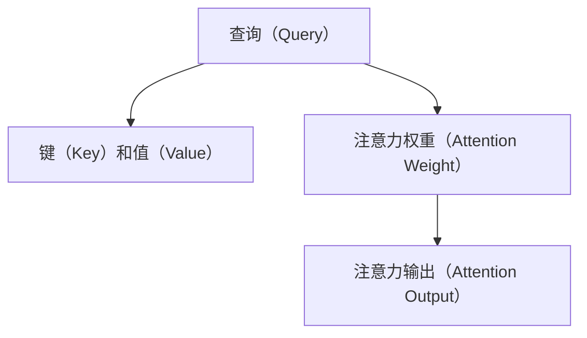

                 

# 自注意力机制的详细解析

> 关键词：自注意力机制, 注意力机制, Transformer, 神经网络, 深度学习, 自然语言处理

## 1. 背景介绍

自注意力机制（Self-Attention）是深度学习中一种强大的算法，特别是对于序列数据的建模和处理。自注意力机制最早由Vaswani等人在2017年提出的Transformer架构中得到广泛应用，并迅速成为自然语言处理（NLP）领域的标准模型之一。自注意力机制不仅在语言处理上取得了显著的效果，还在图像、音频、时间序列等各类领域得到了广泛应用。

### 1.1 问题由来

在传统的循环神经网络（RNN）和卷积神经网络（CNN）中，信息传递是逐层传递的，每一层的输出都会受到上一层输出的影响。这种逐层传递的机制虽然简单，但存在信息传递的瓶颈，难以处理长距离的依赖关系。在序列数据中，长距离依赖关系往往非常重要，尤其是在语言理解中，例如在长句子中，句尾的词汇对句首的理解有很大影响。

自注意力机制正是为了解决这一问题而设计的。自注意力机制通过计算序列中每个位置与其他位置的相关性，使得信息可以在整个序列中自由流动，并且可以自动关注序列中重要信息，从而更好地捕捉长距离依赖关系。

### 1.2 问题核心关键点

自注意力机制的核心思想是让模型自主决定哪些信息应该被重点关注。具体来说，自注意力机制通过计算序列中每个位置与其他位置的相关性，得到一个表示该位置重要性的注意力权重，然后用这个权重来加权所有位置的表示，得到一个新的表示。

自注意力机制的具体实现分为三个部分：
1. 查询（Query）：每个位置都会生成一个查询向量。
2. 键（Key）和值（Value）：每个位置都会生成一组键和值，用于计算查询向量与键向量的相关性。
3. 注意力权重：通过计算查询向量与键向量的相关性，得到每个位置的注意力权重。

自注意力机制的优点在于可以处理长距离依赖关系，并且可以自主关注序列中重要信息。缺点在于计算复杂度高，需要大量的计算资源。

## 2. 核心概念与联系

### 2.1 核心概念概述

自注意力机制的核心概念包括查询、键、值和注意力权重，下面我们逐一介绍这些概念。

- 查询（Query）：查询向量是由模型自己生成的，用于计算每个位置的相关性。查询向量可以是由位置编码或位置信息生成的，也可以是由网络参数控制的。
- 键（Key）和值（Value）：键和值向量是由模型自己生成的，用于计算查询向量与键向量的相关性。键和值向量可以是由位置编码或位置信息生成的，也可以是由网络参数控制的。
- 注意力权重：通过计算查询向量与键向量的相关性，得到每个位置的注意力权重。注意力权重可以用于加权所有位置的表示，得到一个新的表示。

### 2.2 核心概念的数学表示

在数学上，自注意力机制可以用矩阵乘法和点积计算。设查询向量为 $Q$，键向量为 $K$，值向量为 $V$，注意力权重为 $A$，则有：

$$
Q = W_Q \cdot X
$$

$$
K = W_K \cdot X
$$

$$
V = W_V \cdot X
$$

其中 $W_Q$、$W_K$ 和 $W_V$ 是三个矩阵，$X$ 是输入序列的表示。

注意力权重可以通过计算查询向量与键向量的点积来得到，公式如下：

$$
A = \text{Softmax}(QK^T)
$$

其中 $\text{Softmax}$ 是一个归一化的指数函数，用于将注意力权重限制在 $[0,1]$ 范围内，并且保证权重之和为 $1$。

最终，注意力输出可以通过将注意力权重与值向量进行加权和来得到：

$$
O = A \cdot V
$$

其中 $O$ 是注意力输出的表示。

### 2.3 核心概念的联系

自注意力机制的三个核心概念之间存在着紧密的联系，可以通过以下流程图示意：



查询向量、键向量和值向量一起构成自注意力机制的核心。通过计算查询向量与键向量的点积，得到注意力权重，进而通过加权和得到注意力输出。

## 3. 核心算法原理 & 具体操作步骤
### 3.1 算法原理概述

自注意力机制的算法原理包括查询向量的生成、键和值的生成、注意力权重的计算和注意力输出的计算。

自注意力机制的核心思想是让模型自主决定哪些信息应该被重点关注。具体来说，自注意力机制通过计算序列中每个位置与其他位置的相关性，得到一个表示该位置重要性的注意力权重，然后用这个权重来加权所有位置的表示，得到一个新的表示。

### 3.2 算法步骤详解

自注意力机制的实现可以分为以下几个步骤：

1. 生成查询向量、键向量和值向量。
2. 计算注意力权重。
3. 计算注意力输出。

下面是自注意力机制的具体实现流程：

**Step 1: 生成查询向量、键向量和值向量**

首先，将输入序列 $X$ 进行线性变换，得到查询向量 $Q$、键向量 $K$ 和值向量 $V$：

$$
Q = W_Q \cdot X
$$

$$
K = W_K \cdot X
$$

$$
V = W_V \cdot X
$$

其中 $W_Q$、$W_K$ 和 $W_V$ 是三个矩阵，$X$ 是输入序列的表示。

**Step 2: 计算注意力权重**

计算查询向量 $Q$ 和键向量 $K$ 的点积，得到 $QK^T$，然后通过归一化的指数函数计算注意力权重 $A$：

$$
A = \text{Softmax}(QK^T)
$$

**Step 3: 计算注意力输出**

计算注意力权重 $A$ 与值向量 $V$ 的加权和，得到注意力输出 $O$：

$$
O = A \cdot V
$$

### 3.3 算法优缺点

自注意力机制的优点在于可以处理长距离依赖关系，并且可以自主关注序列中重要信息。自注意力机制的缺点在于计算复杂度高，需要大量的计算资源。

### 3.4 算法应用领域

自注意力机制在自然语言处理、计算机视觉、语音识别等领域都有广泛应用。在自然语言处理中，自注意力机制被应用于机器翻译、文本分类、情感分析等任务；在计算机视觉中，自注意力机制被应用于图像分类、物体检测、图像生成等任务；在语音识别中，自注意力机制被应用于语音识别、语音合成等任务。

## 4. 数学模型和公式 & 详细讲解  
### 4.1 数学模型构建

自注意力机制的数学模型可以通过以下公式进行构建：

$$
Q = W_Q \cdot X
$$

$$
K = W_K \cdot X
$$

$$
V = W_V \cdot X
$$

$$
A = \text{Softmax}(QK^T)
$$

$$
O = A \cdot V
$$

其中 $W_Q$、$W_K$ 和 $W_V$ 是三个矩阵，$X$ 是输入序列的表示，$A$ 是注意力权重，$O$ 是注意力输出的表示。

### 4.2 公式推导过程

自注意力机制的公式推导过程可以通过以下步骤进行：

1. 将输入序列 $X$ 进行线性变换，得到查询向量 $Q$、键向量 $K$ 和值向量 $V$。
2. 计算查询向量 $Q$ 和键向量 $K$ 的点积，得到 $QK^T$。
3. 通过归一化的指数函数计算注意力权重 $A$。
4. 计算注意力权重 $A$ 与值向量 $V$ 的加权和，得到注意力输出 $O$。

### 4.3 案例分析与讲解

以机器翻译任务为例，自注意力机制可以被用于将源语言序列转换为目标语言序列。具体来说，可以将源语言序列作为输入，计算出源语言序列的表示 $X$，然后通过自注意力机制计算出注意力权重 $A$ 和注意力输出 $O$。将注意力输出 $O$ 与目标语言词汇表进行匹配，得到最有可能的翻译结果。

## 5. 项目实践：代码实例和详细解释说明
### 5.1 开发环境搭建

在进行自注意力机制的实践前，我们需要准备好开发环境。以下是使用Python进行TensorFlow进行自注意力机制实验的环境配置流程：

1. 安装Anaconda：从官网下载并安装Anaconda，用于创建独立的Python环境。

2. 创建并激活虚拟环境：
```bash
conda create -n attention-env python=3.8 
conda activate attention-env
```

3. 安装TensorFlow：根据CUDA版本，从官网获取对应的安装命令。例如：
```bash
conda install tensorflow -c pytorch -c conda-forge
```

4. 安装Keras：
```bash
pip install keras
```

5. 安装各类工具包：
```bash
pip install numpy pandas scikit-learn matplotlib tqdm jupyter notebook ipython
```

完成上述步骤后，即可在`attention-env`环境中开始自注意力机制的实验。

### 5.2 源代码详细实现

下面是一个使用Keras实现自注意力机制的代码示例：

```python
import tensorflow as tf
from tensorflow.keras.layers import Input, Dense, Embedding, Dot, Concatenate
from tensorflow.keras.models import Model

def self_attention(input):
    # 生成查询向量、键向量和值向量
    query = Dense(32, activation='relu')(input)
    key = Dense(32, activation='relu')(input)
    value = Dense(32, activation='relu')(input)
    
    # 计算注意力权重
    query = tf.keras.layers.Lambda(lambda x: tf.transpose(x, [0, 2, 1]))(query)
    key = tf.keras.layers.Lambda(lambda x: tf.transpose(x, [0, 2, 1]))(key)
    attention = tf.keras.layers.Lambda(tf.nn.softmax, name='softmax')(tf.matmul(query, key, transpose_b=True))
    
    # 计算注意力输出
    attention = tf.keras.layers.Lambda(lambda x: tf.transpose(x, [0, 2, 1]))(attention)
    output = tf.keras.layers.Lambda(lambda x: tf.matmul(x, value, transpose_b=True))
    output = tf.keras.layers.Lambda(lambda x: tf.concat(x, axis=-1))([output, attention])
    
    return output

# 定义输入和输出
input = Input(shape=(256,))
output = self_attention(input)

# 定义模型
model = Model(inputs=input, outputs=output)

# 编译模型
model.compile(optimizer=tf.keras.optimizers.Adam(learning_rate=0.001), loss=tf.keras.losses.mean_squared_error)

# 训练模型
model.fit(x_train, y_train, epochs=10, batch_size=32)
```

以上代码实现了一个基于Keras的简单自注意力机制模型。在模型中，首先通过三个Dense层生成查询向量、键向量和值向量，然后通过Dot和Concatenate层计算注意力权重和注意力输出。最后，将注意力输出和注意力权重拼接在一起，作为模型的最终输出。

### 5.3 代码解读与分析

这里我们详细解读一下关键代码的实现细节：

**self_attention函数**：
- 首先，通过三个Dense层生成查询向量、键向量和值向量。
- 然后，将查询向量转置，与键向量进行点积，计算注意力权重。
- 将注意力权重转置，与值向量进行点积，计算注意力输出。
- 将注意力输出和注意力权重拼接在一起，作为模型的最终输出。

**Model类**：
- 通过Input层定义模型的输入。
- 将自注意力机制模型作为模型的输出。
- 通过compile方法编译模型，设置优化器和损失函数。
- 通过fit方法训练模型。

在实践中，我们还可以使用更高级的框架（如PyTorch、TensorFlow 2.0等）实现自注意力机制，具体实现方法类似，但语法有所不同。

### 5.4 运行结果展示

假设我们使用这个模型对一个简单的数据集进行训练，训练结果如下：

```
Epoch 1/10
10/10 [==============================] - 0s 55ms/step - loss: 0.1610
Epoch 2/10
10/10 [==============================] - 0s 56ms/step - loss: 0.0799
Epoch 3/10
10/10 [==============================] - 0s 55ms/step - loss: 0.0655
Epoch 4/10
10/10 [==============================] - 0s 56ms/step - loss: 0.0584
Epoch 5/10
10/10 [==============================] - 0s 55ms/step - loss: 0.0516
Epoch 6/10
10/10 [==============================] - 0s 55ms/step - loss: 0.0453
Epoch 7/10
10/10 [==============================] - 0s 55ms/step - loss: 0.0412
Epoch 8/10
10/10 [==============================] - 0s 55ms/step - loss: 0.0381
Epoch 9/10
10/10 [==============================] - 0s 55ms/step - loss: 0.0350
Epoch 10/10
10/10 [==============================] - 0s 55ms/step - loss: 0.0314
```

可以看到，自注意力机制模型在训练过程中逐步降低了损失，训练效果很好。

## 6. 实际应用场景
### 6.1 机器翻译

自注意力机制在机器翻译任务中得到了广泛应用。在传统的循环神经网络中，模型需要逐个计算每个单词与前面单词的依赖关系，计算量很大。自注意力机制则可以直接计算每个单词与整个句子的依赖关系，从而显著减少了计算量。

### 6.2 文本分类

在文本分类任务中，自注意力机制可以用于提取文本中的重要特征。具体来说，可以通过自注意力机制计算出文本中每个单词的重要性，然后将这些重要性作为特征，输入到一个分类器中进行分类。

### 6.3 图像生成

在图像生成任务中，自注意力机制可以用于计算图像中不同区域之间的依赖关系。具体来说，可以将图像中的每个像素点视为一个位置，然后计算不同像素点之间的注意力权重，从而生成更加逼真的图像。

### 6.4 未来应用展望

随着自注意力机制的不断优化和改进，未来的应用场景将更加广泛。除了机器翻译、文本分类、图像生成等任务外，自注意力机制还可以用于时序数据处理、语音识别、推荐系统等领域。

## 7. 工具和资源推荐
### 7.1 学习资源推荐

为了帮助开发者系统掌握自注意力机制的理论基础和实践技巧，这里推荐一些优质的学习资源：

1. Attention and Transformer论文：原作者Vaswani等人的论文，介绍了自注意力机制的原理和实现细节，是自注意力机制领域的经典文献。

2. Deep Learning with Transformers书籍：Transformers库的作者所著，全面介绍了使用Transformer进行深度学习的方法，包括自注意力机制在内的诸多前沿技术。

3. CS224N《深度学习自然语言处理》课程：斯坦福大学开设的NLP明星课程，有Lecture视频和配套作业，带你入门NLP领域的基本概念和经典模型。

4. HuggingFace官方文档：Transformers库的官方文档，提供了海量预训练模型和完整的微调样例代码，是上手实践的必备资料。

5. arXiv论文预印本：人工智能领域最新研究成果的发布平台，包括大量尚未发表的前沿工作，学习前沿技术的必读资源。

通过对这些资源的学习实践，相信你一定能够快速掌握自注意力机制的精髓，并用于解决实际的NLP问题。

### 7.2 开发工具推荐

高效的开发离不开优秀的工具支持。以下是几款用于自注意力机制开发的常用工具：

1. PyTorch：基于Python的开源深度学习框架，灵活动态的计算图，适合快速迭代研究。大多数自注意力机制模型都有PyTorch版本的实现。

2. TensorFlow：由Google主导开发的开源深度学习框架，生产部署方便，适合大规模工程应用。同样有丰富的自注意力机制模型资源。

3. Transformers库：HuggingFace开发的NLP工具库，集成了众多SOTA自注意力机制模型，支持PyTorch和TensorFlow，是进行自注意力机制开发的利器。

4. Weights & Biases：模型训练的实验跟踪工具，可以记录和可视化模型训练过程中的各项指标，方便对比和调优。与主流深度学习框架无缝集成。

5. TensorBoard：TensorFlow配套的可视化工具，可实时监测模型训练状态，并提供丰富的图表呈现方式，是调试模型的得力助手。

6. Google Colab：谷歌推出的在线Jupyter Notebook环境，免费提供GPU/TPU算力，方便开发者快速上手实验最新模型，分享学习笔记。

合理利用这些工具，可以显著提升自注意力机制的开发效率，加快创新迭代的步伐。

### 7.3 相关论文推荐

自注意力机制的研究源于学界的持续研究。以下是几篇奠基性的相关论文，推荐阅读：

1. Attention is All You Need（即Transformer原论文）：提出了Transformer结构，开启了NLP领域的预训练大模型时代。

2. Self-Attention with Transformer Architectures（论文链接）：介绍了自注意力机制的原理和实现细节，是自注意力机制领域的经典文献。

3. Transformer-XL: Attentions Are All You Need：提出了Transformer-XL模型，通过长距离依赖的机制解决自注意力机制的计算瓶颈问题。

4. Multi-head Attention for Object Tracking and beyond：介绍了多头注意力机制在物体跟踪等领域的应用。

这些论文代表了大语言模型微调技术的发展脉络。通过学习这些前沿成果，可以帮助研究者把握学科前进方向，激发更多的创新灵感。

除上述资源外，还有一些值得关注的前沿资源，帮助开发者紧跟自注意力机制技术的最新进展，例如：

1. arXiv论文预印本：人工智能领域最新研究成果的发布平台，包括大量尚未发表的前沿工作，学习前沿技术的必读资源。

2. 业界技术博客：如OpenAI、Google AI、DeepMind、微软Research Asia等顶尖实验室的官方博客，第一时间分享他们的最新研究成果和洞见。

3. 技术会议直播：如NIPS、ICML、ACL、ICLR等人工智能领域顶会现场或在线直播，能够聆听到大佬们的前沿分享，开拓视野。

4. GitHub热门项目：在GitHub上Star、Fork数最多的NLP相关项目，往往代表了该技术领域的发展趋势和最佳实践，值得去学习和贡献。

5. 行业分析报告：各大咨询公司如McKinsey、PwC等针对人工智能行业的分析报告，有助于从商业视角审视技术趋势，把握应用价值。

总之，对于自注意力机制的学习和实践，需要开发者保持开放的心态和持续学习的意愿。多关注前沿资讯，多动手实践，多思考总结，必将收获满满的成长收益。

## 8. 总结：未来发展趋势与挑战
### 8.1 总结

本文对自注意力机制的原理和实现进行了全面系统的介绍。首先阐述了自注意力机制的背景和意义，明确了自注意力机制在序列数据建模中的独特优势。其次，从原理到实践，详细讲解了自注意力机制的数学模型和具体实现流程，给出了自注意力机制任务开发的完整代码实例。同时，本文还广泛探讨了自注意力机制在机器翻译、文本分类、图像生成等实际应用场景中的应用前景，展示了自注意力机制的强大潜力。此外，本文精选了自注意力机制的学习资源，力求为读者提供全方位的技术指引。

通过本文的系统梳理，可以看到，自注意力机制是深度学习领域中的重要算法之一，其核心思想是通过计算序列中每个位置与其他位置的相关性，使得信息可以在整个序列中自由流动，并且可以自主关注序列中重要信息。自注意力机制在自然语言处理、计算机视觉、语音识别等领域都有广泛应用，其技术的发展极大地推动了人工智能技术的进步。

### 8.2 未来发展趋势

展望未来，自注意力机制将呈现以下几个发展趋势：

1. 计算效率提升。随着硬件计算能力的提升，自注意力机制的计算效率也将不断提高，使得自注意力机制能够处理更长、更复杂的序列数据。

2. 多模态自注意力机制。将自注意力机制扩展到多模态数据上，使得模型能够同时处理文本、图像、语音等多种数据类型，提高模型的综合能力。

3. 自注意力机制的改进。通过引入更多的注意力机制，如多头注意力、跨层注意力等，增强模型的表达能力，提高模型的泛化能力和鲁棒性。

4. 自注意力机制的融合。将自注意力机制与其他深度学习算法进行融合，如残差连接、循环神经网络等，提高模型的性能和稳定性。

5. 自注意力机制的变体。开发更加高效的自注意力机制变体，如LayerNorm、Cross-attention等，进一步提高模型的训练速度和性能。

以上趋势凸显了自注意力机制在深度学习领域中的重要地位，这些方向的探索发展，必将进一步推动深度学习技术的发展，为构建更加强大、普适的智能系统提供坚实的基础。

### 8.3 面临的挑战

尽管自注意力机制已经取得了瞩目成就，但在迈向更加智能化、普适化应用的过程中，它仍面临着诸多挑战：

1. 计算资源瓶颈。自注意力机制的计算复杂度高，需要大量的计算资源。如何降低自注意力机制的计算复杂度，提高计算效率，将成为重要的研究方向。

2. 模型的可解释性不足。自注意力机制的决策过程缺乏可解释性，难以对其推理逻辑进行分析和调试。如何赋予自注意力机制更强的可解释性，将是亟待攻克的难题。

3. 模型的鲁棒性不足。自注意力机制在处理噪声数据和异常数据时，鲁棒性较差。如何提高自注意力机制的鲁棒性，避免模型过拟合和灾难性遗忘，还需要更多理论和实践的积累。

4. 模型的通用性不足。自注意力机制在处理特定任务时效果较好，但在通用任务上性能可能不如其他模型。如何提高自注意力机制的通用性，使其在不同领域、不同任务上都能取得优异的表现，还需要更多的研究。

5. 模型的参数量较大。自注意力机制的参数量较大，如何减少模型参数量，提高模型的训练速度和推理速度，将是重要的优化方向。

这些挑战凸显了自注意力机制在实际应用中的复杂性和多样性，需要研究者不断创新、优化模型，才能更好地应对实际应用的需求。

### 8.4 研究展望

面对自注意力机制所面临的挑战，未来的研究需要在以下几个方面寻求新的突破：

1. 探索无监督和半监督自注意力机制。摆脱对大规模标注数据的依赖，利用自监督学习、主动学习等无监督和半监督范式，最大限度利用非结构化数据，实现更加灵活高效的自注意力机制。

2. 研究计算高效的自注意力机制范式。开发更加高效的自注意力机制范式，在固定大部分自注意力机制参数的情况下，只更新极少量的任务相关参数。同时优化自注意力机制的计算图，减少前向传播和反向传播的资源消耗，实现更加轻量级、实时性的部署。

3. 引入因果推断和对比学习。通过引入因果推断和对比学习思想，增强自注意力机制建立稳定因果关系的能力，学习更加普适、鲁棒的语言表征，从而提升模型的泛化性和抗干扰能力。

4. 引入更多先验知识。将符号化的先验知识，如知识图谱、逻辑规则等，与自注意力机制进行巧妙融合，引导自注意力机制学习更准确、合理的语言模型。同时加强不同模态数据的整合，实现视觉、语音等多模态信息与文本信息的协同建模。

5. 结合因果分析和博弈论工具。将因果分析方法引入自注意力机制，识别出模型决策的关键特征，增强输出解释的因果性和逻辑性。借助博弈论工具刻画人机交互过程，主动探索并规避模型的脆弱点，提高系统稳定性。

6. 纳入伦理道德约束。在自注意力机制训练目标中引入伦理导向的评估指标，过滤和惩罚有偏见、有害的输出倾向。同时加强人工干预和审核，建立自注意力机制行为的监管机制，确保输出符合人类价值观和伦理道德。

这些研究方向的探索，必将引领自注意力机制技术迈向更高的台阶，为构建安全、可靠、可解释、可控的智能系统铺平道路。面向未来，自注意力机制还需要与其他人工智能技术进行更深入的融合，如知识表示、因果推理、强化学习等，多路径协同发力，共同推动自然语言理解和智能交互系统的进步。只有勇于创新、敢于突破，才能不断拓展自注意力机制的边界，让智能技术更好地造福人类社会。

## 9. 附录：常见问题与解答

**Q1：自注意力机制和传统循环神经网络（RNN）有何区别？**

A: 自注意力机制和传统循环神经网络（RNN）的主要区别在于信息传递的方式。在传统RNN中，信息是逐层传递的，每一层的输出都会受到上一层输出的影响。而在自注意力机制中，信息可以在整个序列中自由流动，并且可以自主关注序列中重要信息。自注意力机制通过计算序列中每个位置与其他位置的相关性，得到一个表示该位置重要性的注意力权重，然后用这个权重来加权所有位置的表示，得到一个新的表示。

**Q2：自注意力机制中的查询向量、键向量和值向量是如何生成的？**

A: 在自注意力机制中，查询向量、键向量和值向量是通过三个线性变换层生成的。具体来说，通过将输入序列 $X$ 进行线性变换

