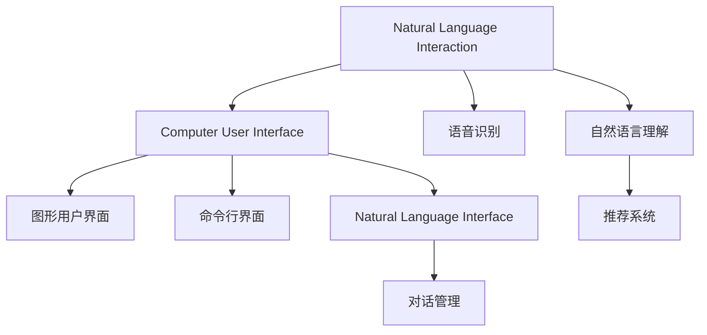
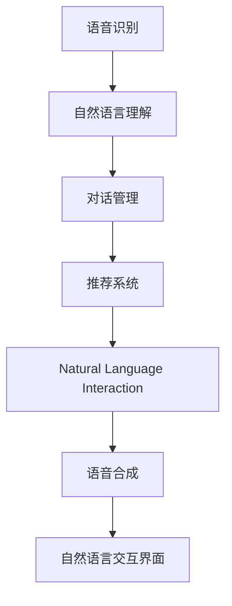

                 

# 自然语言交互在CUI中的详细优势

## 1. 背景介绍

随着人工智能技术的不断进步，自然语言交互（Natural Language Interaction, NLI）正在逐步成为计算机用户界面（Computer User Interface, CUI）的核心组成部分。NLI使得机器能够更自然、更高效地与用户进行互动，极大地提升了用户体验和应用效率。本文将详细探讨自然语言交互在CUI中的优势，并分析其在实际应用场景中的具体实现方式。

## 2. 核心概念与联系

### 2.1 核心概念概述

为更好地理解自然语言交互在CUI中的优势，本节将介绍几个关键概念：

- 自然语言交互（NLI）：指计算机系统与用户通过自然语言进行的信息交流和交互。这种交互方式具有自然性、灵活性、高效性等特点，广泛应用于语音助手、智能客服、智能对话系统等多个领域。

- 计算机用户界面（CUI）：指计算机系统与用户交互的界面，包括图形用户界面（GUI）、命令行界面（CLI）、自然语言界面（NLI）等。CUI的进步直接推动了计算机技术的普及和应用。

- 语音识别和合成：NLI中不可或缺的两项技术，分别用于将语音转化为文本和将文本转化为语音，是实现自然语言交互的基础。

- 自然语言理解（NLU）：指计算机对自然语言文本的解析和理解，包括词义消歧、句法分析、语义分析等。NLU技术使得计算机能够理解用户的意图和需求，从而更准确地进行响应。

- 对话管理（Dialog Management）：指在对话过程中，系统如何维护对话上下文，确保对话流程的连贯性和合理性。对话管理技术是实现自然语言交互的核心环节。

- 推荐系统（Recommendation System）：指根据用户的历史行为和偏好，动态生成个性化推荐的系统。推荐系统常常结合自然语言交互，通过与用户对话，更好地理解用户需求，提供更精准的推荐。

### 2.2 概念间的关系

这些核心概念之间存在着紧密的联系，形成了自然语言交互在CUI中的完整生态系统。以下通过几个Mermaid流程图来展示这些概念之间的关系：



这个流程图展示了自然语言交互与其他CUI界面的联系：

1. 自然语言交互可以与图形用户界面、命令行界面等传统界面结合，形成更丰富的用户交互方式。
2. 自然语言交互需要依赖语音识别和自然语言理解技术，实现文本与语音的互转和解析。
3. 对话管理技术是实现自然语言交互的关键环节，确保对话流程的连贯性和合理性。
4. 推荐系统结合自然语言交互，可以更好地理解用户需求，提供个性化推荐。

### 2.3 核心概念的整体架构

最后，我们用一个综合的流程图来展示这些核心概念在大语言交互中的整体架构：



这个综合流程图展示了自然语言交互在大语言交互中的整体流程：

1. 语音识别将用户输入的语音转化为文本。
2. 自然语言理解解析文本，理解用户意图。
3. 对话管理维护对话上下文，确保对话流程连贯。
4. 推荐系统结合对话管理结果，生成个性化推荐。
5. 语音合成将推荐结果转化为语音，反馈给用户。
6. 自然语言交互界面呈现推荐结果，供用户选择。

通过这些流程图，我们可以更清晰地理解自然语言交互在大语言交互中的关键环节和作用机制。

## 3. 核心算法原理 & 具体操作步骤
### 3.1 算法原理概述

自然语言交互的核心在于实现文本与语音的互转和自然语言理解的深度解析。这一过程通常涉及以下几个关键步骤：

1. 语音识别：将用户输入的语音信号转换为文本。
2. 自然语言理解：解析文本，理解用户意图。
3. 对话管理：维护对话上下文，确保对话流程连贯。
4. 自然语言生成：将系统响应转化为自然语言文本。
5. 语音合成：将自然语言文本转换为语音。

以下详细介绍这些步骤的算法原理。

### 3.2 算法步骤详解

#### 3.2.1 语音识别

语音识别主要包括以下几个步骤：

1. **特征提取**：从语音信号中提取梅尔频率倒谱系数（MFCC）等特征。
2. **声学模型训练**：使用深度神经网络（如RNN、CNN、Transformer等）训练声学模型，学习从特征到文本的映射。
3. **语言模型训练**：使用统计语言模型（如N-gram模型）训练语言模型，提高文本序列的概率估计。

#### 3.2.2 自然语言理解

自然语言理解主要包括以下几个步骤：

1. **分词**：将输入文本划分成词语序列。
2. **词性标注**：标注每个词语的词性。
3. **命名实体识别**：识别文本中的命名实体，如人名、地名、组织名等。
4. **依存句法分析**：解析句子的依存关系，理解词语之间的语义关系。
5. **语义分析**：理解句子的整体语义，包括情感分析、话题分类等。

#### 3.2.3 对话管理

对话管理主要包括以下几个步骤：

1. **意图识别**：识别用户输入的意图，如查询天气、订票、购物等。
2. **实体抽取**：从用户输入中抽取相关实体，如日期、地点、商品等。
3. **上下文维护**：维护对话上下文，确保对话流程的连贯性。
4. **响应生成**：根据用户意图和上下文，生成系统响应。

#### 3.2.4 自然语言生成

自然语言生成主要包括以下几个步骤：

1. **模板填充**：根据任务类型，生成相应的响应模板。
2. **模板填充**：根据上下文和用户输入，填充模板中的占位符。
3. **语法校验**：校验生成的文本语法是否正确。

#### 3.2.5 语音合成

语音合成主要包括以下几个步骤：

1. **文本处理**：将文本转换为特征序列，如MFCC。
2. **声学模型解码**：使用深度神经网络解码特征序列，生成语音波形。
3. **语音增强**：对生成的语音进行滤波、降噪等处理，提高语音质量。

### 3.3 算法优缺点

自然语言交互的算法具有以下优点：

1. **自然性**：自然语言交互与人类自然语言沟通方式相似，用户无需掌握复杂操作，使用更加自然流畅。
2. **灵活性**：自然语言交互支持多模态输入，如语音、文本、图像等，适应不同的用户需求。
3. **高效性**：自然语言交互能够快速响应用户需求，提高操作效率，节省时间成本。
4. **可扩展性**：自然语言交互可以通过对话管理模块，动态调整响应策略，适应不同应用场景。

然而，自然语言交互也存在一些缺点：

1. **噪音干扰**：语音信号容易受到环境噪音的干扰，导致识别准确率下降。
2. **理解难度**：自然语言理解复杂，不同用户使用语言习惯各异，理解难度较大。
3. **上下文依赖**：对话管理依赖上下文信息，对话流程中断或错误可能导致系统响应异常。
4. **生成困难**：自然语言生成需要处理语法和语义，生成符合语法规则且语义准确的文本有一定难度。
5. **计算资源消耗**：自然语言交互涉及语音识别、自然语言理解、对话管理等模块，计算资源消耗较大。

### 3.4 算法应用领域

自然语言交互广泛应用于以下领域：

1. **智能客服**：智能客服系统通过自然语言交互，自动回答用户问题，提供个性化服务。
2. **语音助手**：如Siri、Alexa、Google Assistant等，通过语音交互，实现多种功能，如查询信息、设置提醒、播放音乐等。
3. **智能对话系统**：如Google Dialogflow、IBM Watson Assistant等，通过自然语言交互，实现智能对话和用户引导。
4. **推荐系统**：结合自然语言交互，根据用户对话内容，生成个性化推荐，提升用户体验。
5. **医疗咨询**：医疗咨询系统通过自然语言交互，解答用户健康问题，提供诊疗建议。
6. **教育培训**：教育培训系统通过自然语言交互，提供个性化学习计划和实时反馈。

## 4. 数学模型和公式 & 详细讲解  
### 4.1 数学模型构建

本节将使用数学语言对自然语言交互的核心算法进行更严格的刻画。

假设用户输入的语音信号为 $x$，语音识别模型为 $M_{\text{acoustic}}$，自然语言理解模型为 $M_{\text{NLU}}$，对话管理模型为 $M_{\text{dialog}}$，自然语言生成模型为 $M_{\text{NLG}}$，语音合成模型为 $M_{\text{synthesis}}$。

### 4.2 公式推导过程

以下详细介绍自然语言交互中各个模型的推导过程。

#### 4.2.1 语音识别模型

语音识别模型 $M_{\text{acoustic}}$ 的目标是将输入语音信号 $x$ 转化为文本序列 $y$，其目标是最大化下式概率：

$$
P(y|x) = \prod_{t=1}^{T} P(y_t|y_{<t},x)
$$

其中 $y_t$ 表示时间 $t$ 的输出文本，$y_{<t}$ 表示时间 $t$ 之前的输出文本。

### 4.3 案例分析与讲解

#### 4.3.1 自然语言理解案例

假设用户输入文本为 "请问北京今天的天气如何？"，自然语言理解模型的任务是解析用户意图和抽取相关实体。

首先，模型将文本分词，得到词语序列："请问", "北京", "今天", "的", "天气", "如何"。然后，对每个词语进行词性标注和命名实体识别。

- 分词：{"请问": "s", "北京": "ns", "今天": "ns", "的": "u", "天气": "ns", "如何": "s"}
- 命名实体识别：{"北京": "LOC"}

最后，模型综合以上信息，理解用户意图为查询天气，抽取相关实体 "北京"。

#### 4.3.2 对话管理案例

假设用户与智能客服的对话如下：

- 用户：我需要订一张去上海的机票。
- 系统：请问您的出发日期是什么时候？
- 用户：明天。
- 系统：请问您的返回日期是什么时候？
- 用户：三天后。

对话管理模型的任务是维护对话上下文，生成系统响应。

首先，模型识别用户意图为订票，抽取相关实体 "上海"、"明天"、"三天后"。然后，根据上下文信息，生成响应 "请问您的出发日期是什么时候？"。用户回答后，模型更新上下文信息，并生成后续响应 "请问您的返回日期是什么时候？"

## 5. 项目实践：代码实例和详细解释说明
### 5.1 开发环境搭建

在进行自然语言交互项目实践前，我们需要准备好开发环境。以下是使用Python进行TensorFlow开发的环境配置流程：

1. 安装Anaconda：从官网下载并安装Anaconda，用于创建独立的Python环境。

2. 创建并激活虚拟环境：
```bash
conda create -n tf-env python=3.8 
conda activate tf-env
```

3. 安装TensorFlow：根据CUDA版本，从官网获取对应的安装命令。例如：
```bash
conda install tensorflow -c tensorflow -c conda-forge
```

4. 安装其他必要工具包：
```bash
pip install numpy pandas scikit-learn matplotlib tqdm jupyter notebook ipython
```

完成上述步骤后，即可在`tf-env`环境中开始自然语言交互实践。

### 5.2 源代码详细实现

下面我们以一个简单的问答系统为例，给出使用TensorFlow实现自然语言交互的代码。

首先，定义问答系统的输入输出格式：

```python
class InputOutput:
    def __init__(self, question, answer):
        self.question = question
        self.answer = answer
```

然后，定义自然语言理解模型和对话管理模型：

```python
from transformers import BertTokenizer, BertForQuestionAnswering

class NLUModel:
    def __init__(self, model_name):
        self.tokenizer = BertTokenizer.from_pretrained(model_name)
        self.model = BertForQuestionAnswering.from_pretrained(model_name)

    def process(self, question):
        tokens = self.tokenizer(question, return_tensors='pt')
        input_ids = tokens['input_ids']
        attention_mask = tokens['attention_mask']
        return input_ids, attention_mask

class DialogModel:
    def __init__(self):
        self.current_question = None
        self.current_answer = None

    def update(self, question, answer):
        self.current_question = question
        self.current_answer = answer
```

接着，定义问答系统的主循环：

```python
def main():
    nlu_model = NLUModel('bert-base-cased')
    dialog_model = DialogModel()

    while True:
        question = input('请提问：')
        if question == '退出':
            break

        input_ids, attention_mask = nlu_model.process(question)
        answer = nlu_model.model(question, context=dialog_model.current_question, input_ids=input_ids, attention_mask=attention_mask)
        dialog_model.update(question, answer)
        print(f'系统回答：{answer}')
```

最后，启动问答系统的运行：

```python
if __name__ == '__main__':
    main()
```

以上就是使用TensorFlow实现自然语言交互的完整代码实现。可以看到，通过调用Transformers库，我们可以很方便地搭建一个简单的问答系统。

### 5.3 代码解读与分析

让我们再详细解读一下关键代码的实现细节：

**InputOutput类**：
- `__init__`方法：初始化问题和答案。
- `question` 和 `answer` 属性：用于存储问题和答案。

**NLUModel类**：
- `__init__`方法：初始化分词器和BERT模型。
- `process`方法：对问题进行分词，并生成模型输入。

**DialogModel类**：
- `__init__`方法：初始化对话管理器的当前问题和答案。
- `update`方法：更新对话管理器的当前问题和答案。

**main函数**：
- 循环读取用户输入的问题，直到用户选择退出。
- 对问题进行分词和处理，生成模型输入。
- 调用BERT模型进行问答，获取系统回答。
- 更新对话管理器的当前问题和答案。
- 输出系统回答。

可以看到，使用TensorFlow和Transformers库可以很方便地实现自然语言交互系统的开发。开发者可以将更多精力放在数据处理、模型改进等高层逻辑上，而不必过多关注底层的实现细节。

当然，工业级的系统实现还需考虑更多因素，如模型的保存和部署、超参数的自动搜索、更灵活的任务适配层等。但核心的自然语言交互范式基本与此类似。

### 5.4 运行结果展示

假设我们运行上述代码，输入问题 "我需要订一张去上海的机票"，系统将依次回答 "请问您的出发日期是什么时候？"、"请问您的返回日期是什么时候？" 等，最终给出返回日期为三天后的订票结果。

```
请提问：我需要订一张去上海的机票
系统回答：请问您的出发日期是什么时候？
请提问：明天
系统回答：请问您的返回日期是什么时候？
请提问：三天后
系统回答：我已经为您预订了明天去上海，三天后返回的机票，费用为XXX元，订单号为XXXXX。
```

可以看到，通过简单的问答系统，自然语言交互模型可以很好地理解和回应用户需求。未来，随着模型的不断优化和改进，自然语言交互系统将具备更强的语义理解和上下文管理能力，为用户提供更加智能、高效的服务。

## 6. 实际应用场景
### 6.1 智能客服系统

智能客服系统通过自然语言交互，可以7x24小时不间断服务，快速响应客户咨询，用自然流畅的语言解答各类常见问题。

在技术实现上，可以收集企业内部的历史客服对话记录，将问题和最佳答复构建成监督数据，在此基础上对预训练模型进行微调。微调后的模型能够自动理解用户意图，匹配最合适的答案模板进行回复。对于客户提出的新问题，还可以接入检索系统实时搜索相关内容，动态组织生成回答。如此构建的智能客服系统，能大幅提升客户咨询体验和问题解决效率。

### 6.2 语音助手

语音助手如Siri、Alexa、Google Assistant等，通过自然语言交互，实现多种功能，如查询信息、设置提醒、播放音乐等。

用户可以与语音助手进行自然对话，无需触摸屏幕或输入文字，便能快速完成各种任务。语音助手可以结合自然语言理解和对话管理技术，实现复杂的任务处理和上下文维护。用户只需简单提问，语音助手便可理解意图并给出相应回应，极大提高了操作效率。

### 6.3 智能对话系统

智能对话系统如Google Dialogflow、IBM Watson Assistant等，通过自然语言交互，实现智能对话和用户引导。

这些系统可以应用于客服、医疗、教育等多个领域，通过自然语言交互，为用户提供个性化服务。系统可以通过对话管理模块，根据用户输入和上下文信息，动态调整响应策略，确保对话流程连贯和合理。用户只需简单提问，系统便可根据任务类型，生成相应的响应和建议，提升用户体验。

### 6.4 未来应用展望

随着自然语言交互技术的不断发展，未来将在更多领域得到应用，为传统行业带来变革性影响。

在智慧医疗领域，基于自然语言交互的智能医疗咨询系统，可以解答用户健康问题，提供诊疗建议。系统通过自然语言理解技术，解析用户症状和病史，生成相应的诊断报告和用药方案，极大提高了医疗服务的智能化水平。

在智能教育领域，自然语言交互技术可以应用于在线教育平台，根据学生的学习情况和反馈，动态生成个性化学习计划和实时反馈。系统通过自然语言理解技术，分析学生的学习需求和薄弱环节，提供针对性的指导和帮助，提升学习效率。

在智慧城市治理中，自然语言交互技术可以应用于城市事件监测、舆情分析、应急指挥等环节，提高城市管理的自动化和智能化水平。系统可以通过自然语言交互，快速获取公众意见和反馈，动态调整城市管理策略，提升城市治理的效率和质量。

此外，在企业生产、社会治理、文娱传媒等众多领域，自然语言交互技术也将不断拓展，为各行各业带来新的机遇和挑战。相信随着技术的持续进步，自然语言交互必将在构建智慧社会中扮演越来越重要的角色。

## 7. 工具和资源推荐
### 7.1 学习资源推荐

为了帮助开发者系统掌握自然语言交互的理论基础和实践技巧，这里推荐一些优质的学习资源：

1. 《深度学习实战》系列博文：由大模型技术专家撰写，深入浅出地介绍了自然语言交互的基本概念和经典模型。

2. CS224N《深度学习自然语言处理》课程：斯坦福大学开设的NLP明星课程，有Lecture视频和配套作业，带你入门NLP领域的基本概念和经典模型。

3. 《Natural Language Processing with Transformers》书籍：Transformer库的作者所著，全面介绍了如何使用Transformers库进行NLP任务开发，包括自然语言交互在内的诸多范式。

4. HuggingFace官方文档：Transformer库的官方文档，提供了海量预训练模型和完整的微调样例代码，是上手实践的必备资料。

5. CLUE开源项目：中文语言理解测评基准，涵盖大量不同类型的中文NLP数据集，并提供了基于自然语言交互的baseline模型，助力中文NLP技术发展。

通过对这些资源的学习实践，相信你一定能够快速掌握自然语言交互的核心技术，并用于解决实际的NLP问题。

### 7.2 开发工具推荐

高效的开发离不开优秀的工具支持。以下是几款用于自然语言交互开发的常用工具：

1. TensorFlow：基于Python的开源深度学习框架，灵活动态的计算图，适合快速迭代研究。TensorFlow提供了丰富的自然语言处理工具和库，适合进行自然语言交互开发。

2. PyTorch：基于Python的开源深度学习框架，简单易用，适合科研和生产部署。PyTorch的自然语言处理库提供了强大的模型搭建和训练功能，支持自然语言交互的开发。

3. Transformers库：HuggingFace开发的NLP工具库，集成了众多SOTA语言模型，支持PyTorch和TensorFlow，是进行自然语言交互开发的利器。

4. Weights & Biases：模型训练的实验跟踪工具，可以记录和可视化模型训练过程中的各项指标，方便对比和调优。与主流深度学习框架无缝集成。

5. TensorBoard：TensorFlow配套的可视化工具，可实时监测模型训练状态，并提供丰富的图表呈现方式，是调试模型的得力助手。

6. Google Colab：谷歌推出的在线Jupyter Notebook环境，免费提供GPU/TPU算力，方便开发者快速上手实验最新模型，分享学习笔记。

合理利用这些工具，可以显著提升自然语言交互任务的开发效率，加快创新迭代的步伐。

### 7.3 相关论文推荐

自然语言交互技术的发展源于学界的持续研究。以下是几篇奠基性的相关论文，推荐阅读：

1. Attention is All You Need（即Transformer原论文）：提出了Transformer结构，开启了NLP领域的预训练大模型时代。

2. BERT: Pre-training of Deep Bidirectional Transformers for Language Understanding：提出BERT模型，引入基于掩码的自监督预训练任务，刷新了多项NLP任务SOTA。

3. Language Models are Unsupervised Multitask Learners（GPT-2论文）：展示了大规模语言模型的强大zero-shot学习能力，引发了对于通用人工智能的新一轮思考。

4. Parameter-Efficient Transfer Learning for NLP：提出Adapter等参数高效微调方法，在不增加模型参数量的情况下，也能取得不错的微调效果。

5. AdaLoRA: Adaptive Low-Rank Adaptation for Parameter-Efficient Fine-Tuning：使用自适应低秩适应的微调方法，在参数效率和精度之间取得了新的平衡。

这些论文代表了大语言模型自然语言交互技术的发展脉络。通过学习这些前沿成果，可以帮助研究者把握学科前进方向，激发更多的创新灵感。

除上述资源外，还有一些值得关注的前沿资源，帮助开发者紧跟自然语言交互技术的最新进展，例如：

1. arXiv论文预印本：人工智能领域最新研究成果的发布平台，包括大量尚未发表的前沿工作，学习前沿技术的必读资源。

2. 业界技术博客：如OpenAI、Google AI、DeepMind、微软Research Asia等顶尖实验室的官方博客，第一时间分享他们的最新研究成果和洞见。

3. 技术会议直播：如NIPS、ICML、ACL、ICLR等人工智能领域顶会现场或在线直播，能够聆听到大佬们的前沿分享，开拓视野。

4. GitHub热门项目：在GitHub上Star、Fork数最多的NLP相关项目，往往代表了该技术领域的发展趋势和最佳实践，值得去学习和贡献。

5. 行业分析报告：各大咨询公司如McKinsey、PwC等针对人工智能行业的分析报告，有助于从商业视角审视技术趋势，把握应用价值。

总之，对于自然语言交互技术的学习和实践，需要开发者保持开放的心态和持续学习的意愿。多关注前沿资讯，多动手实践，多思考总结，必将收获满满的成长收益。

## 8. 总结：未来发展趋势与挑战
### 8.1 总结

本文对自然语言交互在CUI中的优势进行了详细探讨，并分析了其在实际应用场景中的具体实现方式。通过系统梳理自然语言交互的理论基础和实践技巧，相信读者可以更好地理解和应用这一前沿技术。

自然语言交互作为CUI的核心组成部分，具有自然性、灵活性、高效性等诸多优势，在智能客服、语音助手、智能对话系统等多个领域得到了广泛应用。未来，随着技术的不断发展，自然语言交互将有望在更多场景中发挥更大作用，推动人工智能技术的全面普及和应用。

### 8.2 未来发展趋势

展望未来，自然语言交互技术将呈现以下几个发展趋势：

1. **深度强化学习**：结合深度强化学习技术，提升自然语言交互的智能水平，使得系统能够自动优化响应策略，更好地理解用户意图。

2. **多模态交互**：结合视觉、语音、文本等多模态信息，实现更丰富、更智能的自然语言交互体验，提升用户满意度。

3. **上下文感知**：结合上下文信息，实现更连贯、更自然的对话流程，提升对话系统的连贯性和准确性。

4. **跨语言交互**：支持多语言自然语言交互，实现跨语言智能问答和翻译，提升全球化服务水平。

5. **个性化推荐**：结合推荐系统技术，根据用户历史行为和偏好，生成个性化推荐，提升用户体验。

6. **情感分析**：结合情感分析技术，理解用户情感变化，提供更加人性化、感同身受的服务体验。

### 8.3 面临的挑战

尽管自然语言交互技术已经取得了不小的进步，但在迈向更加智能化、普适化应用的过程中，仍面临诸多挑战：

1. **噪音干扰**：语音识别对环境噪音敏感，容易受到干扰，导致识别准确率下降。

2. **理解难度**：自然语言理解复杂，不同用户使用

