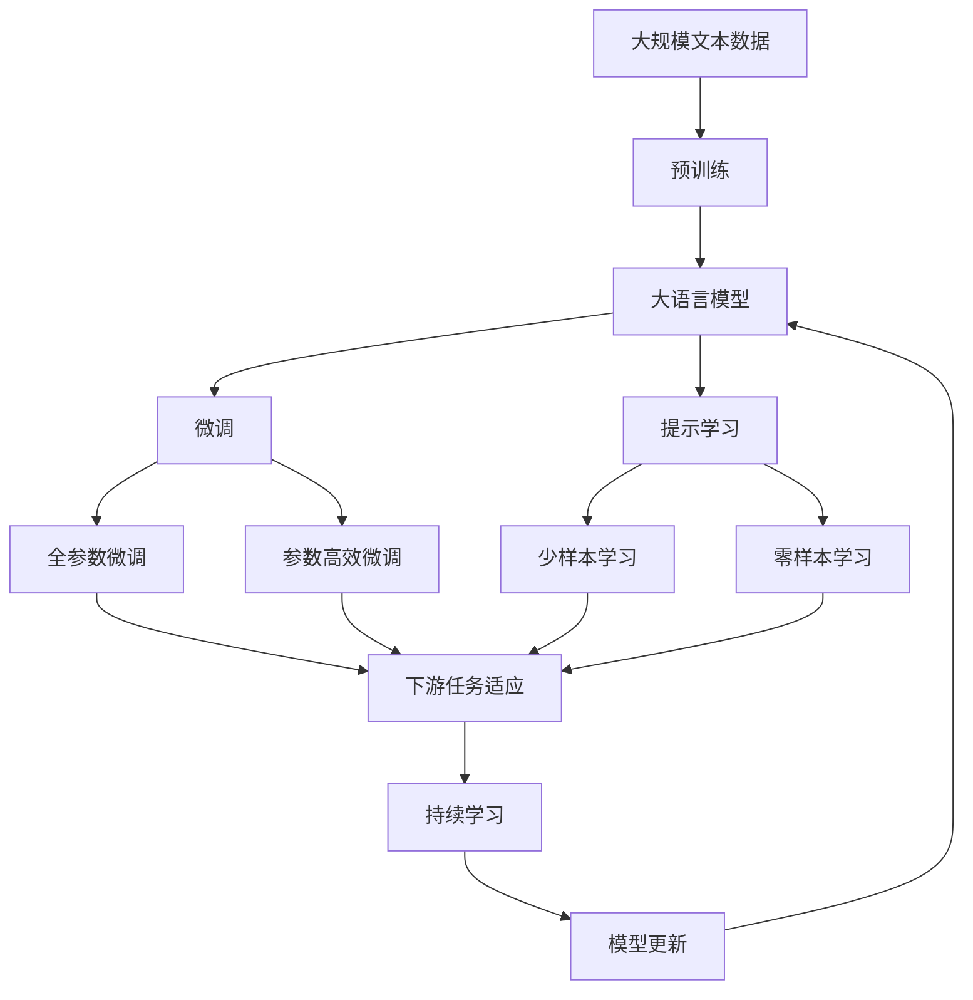

                 

## 1. 背景介绍

### 1.1 问题由来

近年来，人工智能（AI）技术的快速发展推动了自动化的全面应用，从自动驾驶汽车、智能机器人到自动化生产线、智能客服等，自动化技术正在逐渐渗透到各行各业。然而，随着自动化水平的提高，一些关键问题也逐渐凸显出来，如自动化系统的可解释性、决策透明度、数据隐私保护、伦理道德约束等。这些问题不仅关系到AI技术的实际落地，也影响了公众对AI技术的接受度和信任度。

### 1.2 问题核心关键点

当前，AI自动化的主要挑战包括：

- **可解释性**：自动化系统往往被称为"黑箱"，其决策过程难以解释，不利于用户理解和使用。
- **透明度**：自动化系统的决策和行为缺乏透明度，容易导致误解和误判，影响系统的可信度。
- **数据隐私**：自动化系统依赖大量数据训练和运行，如何保护用户数据隐私和安全是重要问题。
- **伦理道德**：自动化系统可能存在偏见、歧视等问题，如何确保其决策符合伦理道德标准是重要挑战。
- **普适性**：自动化技术需要覆盖广泛应用场景，不同行业对技术的需求各不相同，如何实现通用性和行业定制化是重要课题。

### 1.3 问题研究意义

研究AI自动化的未来发展趋势，对于拓展AI技术的应用范围，提升系统的可解释性、透明度和信任度，保护数据隐私，确保伦理道德，实现自动化技术的普适性和定制化，具有重要意义：

- **提升可解释性**：增强AI系统的可解释性，使用户能够理解和信任自动化决策。
- **提高透明度**：提高AI系统的透明度，确保决策过程公开、公正。
- **保障数据隐私**：保护用户数据隐私，防止数据滥用和泄露。
- **强化伦理道德**：确保AI系统符合伦理道德标准，避免歧视、偏见等问题。
- **实现普适性**：推动自动化技术在各行各业的应用，实现通用性和行业定制化的平衡。

## 2. 核心概念与联系

### 2.1 核心概念概述

为更好地理解AI自动化的未来发展趋势，本节将介绍几个密切相关的核心概念：

- **AI自动化**：指通过AI技术实现的任务自动化，包括自动驾驶、智能制造、智能客服等。
- **可解释性AI（XAI）**：指使AI模型决策过程透明化、可解释化，使用户能够理解并信任AI决策的AI技术。
- **透明AI（T-AI）**：指使AI决策和行为过程公开、可验证的AI技术，增强系统的可信度。
- **隐私保护AI（P-AI）**：指在AI系统中保护用户隐私和数据安全的AI技术，确保数据使用的合法性和安全性。
- **伦理道德AI（E-AI）**：指使AI系统符合伦理道德标准的AI技术，避免偏见、歧视等问题，确保决策公正性。
- **普适性AI（G-AI）**：指使AI技术能够广泛应用，覆盖各行各业的AI技术，实现通用性和行业定制化的平衡。

这些核心概念之间的逻辑关系可以通过以下Mermaid流程图来展示：

```mermaid
graph TB
    A[AI自动化] --> B[可解释性AI(X-AI)]
    A --> C[透明AI(T-AI)]
    A --> D[隐私保护AI(P-AI)]
    A --> E[伦理道德AI(E-AI)]
    A --> F[普适性AI(G-AI)]
    B --> G[决策透明度]
    B --> H[决策可理解性]
    C --> I[决策公开]
    C --> J[决策验证]
    D --> K[数据匿名化]
    D --> L[数据加密]
    E --> M[决策公正]
    E --> N[伦理约束]
    F --> O[通用性]
    F --> P[行业定制化]
```

这个流程图展示了AI自动化涉及的各个方面及其之间的联系：

1. AI自动化是核心，通过引入可解释性、透明度、隐私保护、伦理道德和普适性等技术，提升系统的性能和可靠性。
2. 可解释性AI(X-AI)关注决策过程的可解释性，帮助用户理解系统行为。
3. 透明AI(T-AI)关注决策过程的公开和验证，增强系统可信度。
4. 隐私保护AI(P-AI)关注用户数据的保护，确保数据使用的合法性和安全性。
5. 伦理道德AI(E-AI)关注决策的公正性和伦理道德，避免偏见和歧视。
6. 普适性AI(G-AI)关注技术的通用性和行业定制化，实现跨行业的广泛应用。

这些核心概念共同构成了AI自动化的完整生态系统，使其能够更好地服务于各行各业，提升系统的性能和可靠性。通过理解这些核心概念，我们可以更好地把握AI自动化的工作原理和优化方向。

### 2.2 概念间的关系

这些核心概念之间存在着紧密的联系，形成了AI自动化的完整生态系统。下面我们通过几个Mermaid流程图来展示这些概念之间的关系。

#### 2.2.1 AI自动化的学习范式

```mermaid
graph LR
    A[AI自动化] --> B[可解释性AI(X-AI)]
    A --> C[透明AI(T-AI)]
    A --> D[隐私保护AI(P-AI)]
    A --> E[伦理道德AI(E-AI)]
    A --> F[普适性AI(G-AI)]
    B --> G[决策透明度]
    B --> H[决策可理解性]
    C --> I[决策公开]
    C --> J[决策验证]
    D --> K[数据匿名化]
    D --> L[数据加密]
    E --> M[决策公正]
    E --> N[伦理约束]
    F --> O[通用性]
    F --> P[行业定制化]
```

这个流程图展示了AI自动化的学习范式及其与各个核心概念的联系。

#### 2.2.2 可解释性AI与透明AI的关系

```mermaid
graph LR
    A[可解释性AI(X-AI)] --> B[透明AI(T-AI)]
    A --> C[决策可理解性]
    B --> D[决策公开]
    B --> E[决策验证]
```

这个流程图展示了可解释性AI与透明AI之间的关系。可解释性AI旨在使决策过程可理解，透明AI则强调决策过程的公开和验证。

#### 2.2.3 隐私保护AI与伦理道德AI的关系

```mermaid
graph LR
    A[隐私保护AI(P-AI)] --> B[伦理道德AI(E-AI)]
    A --> C[数据匿名化]
    A --> D[数据加密]
    B --> E[伦理约束]
```

这个流程图展示了隐私保护AI与伦理道德AI之间的关系。隐私保护AI关注数据的安全和隐私，伦理道德AI则关注决策的公正性和伦理约束。

#### 2.2.4 普适性AI与行业定制化的关系

```mermaid
graph LR
    A[普适性AI(G-AI)] --> B[行业定制化]
    A --> C[通用性]
    B --> D[定制化服务]
```

这个流程图展示了普适性AI与行业定制化之间的关系。普适性AI强调技术的通用性，而行业定制化则在此基础上提供具体的行业应用服务。

### 2.3 核心概念的整体架构

最后，我们用一个综合的流程图来展示这些核心概念在大语言模型微调过程中的整体架构：



这个综合流程图展示了从预训练到微调，再到持续学习的完整过程。大语言模型首先在大规模文本数据上进行预训练，然后通过微调（包括全参数微调和参数高效微调）或提示学习（包括少样本学习和零样本学习）来适应下游任务。最后，通过持续学习技术，模型可以不断更新和适应新的任务和数据。 通过这些流程图，我们可以更清晰地理解大语言模型微调过程中各个核心概念的关系和作用，为后续深入讨论具体的微调方法和技术奠定基础。

## 3. 核心算法原理 & 具体操作步骤
### 3.1 算法原理概述

AI自动化的关键在于构建一个能够自动执行特定任务的智能系统。这种系统通常由多个组件组成，包括数据预处理、模型训练、推理预测等。AI自动化的核心算法原理主要包括以下几个方面：

- **数据预处理**：对原始数据进行清洗、转换和增强，使之适合模型训练和推理。
- **模型训练**：使用大规模数据集训练模型，使其能够自动执行特定任务。
- **推理预测**：在给定输入数据的情况下，使用训练好的模型进行推理预测，得出任务结果。
- **反馈优化**：根据实际结果和用户反馈，对模型进行优化和调整，提升系统性能。

### 3.2 算法步骤详解

AI自动化的实现一般包括以下几个关键步骤：

**Step 1: 准备数据集**

- 收集任务相关的数据集，进行清洗和预处理，确保数据质量和多样性。
- 将数据集划分为训练集、验证集和测试集，进行交叉验证。
- 使用数据增强技术，扩充训练数据集，增强模型的泛化能力。

**Step 2: 构建模型**

- 选择合适的模型架构，如卷积神经网络（CNN）、循环神经网络（RNN）、Transformer等。
- 确定模型的超参数，如学习率、批大小、迭代轮数等。
- 使用预训练技术，在通用语料上预训练模型，获得初始化权重。

**Step 3: 训练模型**

- 将训练集输入模型，进行前向传播计算损失函数。
- 反向传播计算梯度，使用优化器更新模型参数。
- 在验证集上评估模型性能，防止过拟合。
- 重复训练过程，直至模型收敛。

**Step 4: 推理预测**

- 将测试集输入模型，进行推理预测。
- 使用后处理技术，对预测结果进行校正和优化。
- 返回预测结果，提供自动化服务。

**Step 5: 优化和反馈**

- 收集用户反馈和系统表现数据，评估模型性能。
- 根据反馈结果，优化模型参数和结构。
- 定期更新模型，保持系统性能和效果。

### 3.3 算法优缺点

AI自动化具有以下优点：

- **高效性**：自动化系统能够快速处理大量数据，提升效率和生产力。
- **灵活性**：可以根据不同的任务和需求，灵活调整模型和算法。
- **可扩展性**：通过分布式计算和云计算，能够处理更大规模的数据和任务。

同时，该算法也存在一些缺点：

- **依赖数据质量**：模型训练和推理效果受数据质量影响较大，需要高质量的数据集。
- **计算资源消耗**：大规模数据和模型需要大量计算资源，成本较高。
- **可解释性不足**：自动化系统的决策过程复杂，难以解释和理解。
- **安全和隐私风险**：自动化系统涉及大量敏感数据，可能存在安全和隐私风险。

### 3.4 算法应用领域

AI自动化的应用广泛，涵盖多个行业和领域，例如：

- **自动驾驶**：通过AI技术实现车辆的自主驾驶，提高道路安全和交通效率。
- **智能制造**：利用AI技术优化生产流程，提升产品质量和生产效率。
- **智能客服**：通过AI技术实现自动客服，提高客户满意度和服务效率。
- **金融风险管理**：利用AI技术进行风险预测和欺诈检测，提升金融安全。
- **医疗诊断**：利用AI技术进行医学影像分析和疾病预测，提高诊断准确性。
- **教育辅助**：通过AI技术进行个性化教育，提升教育质量和效率。

此外，AI自动化还广泛应用于智慧城市、智能家居、智能物流等领域，推动各行各业的数字化转型。

## 4. 数学模型和公式 & 详细讲解 & 举例说明
### 4.1 数学模型构建

AI自动化的数学模型构建主要包括以下几个方面：

- **输入表示**：将原始数据转换为模型能够处理的格式，如向量、矩阵等。
- **模型定义**：定义模型架构和计算过程，包括神经网络、卷积神经网络、循环神经网络等。
- **损失函数**：定义模型输出的损失函数，用于衡量模型预测结果与真实结果之间的差异。
- **优化算法**：选择优化算法，如梯度下降、Adam等，用于更新模型参数。

### 4.2 公式推导过程

以下我们以一个简单的二分类问题为例，推导线性分类器的数学模型。

假设输入特征为 $x$，标签为 $y$，线性分类器的模型形式为 $f(x;w,b)=w^Tx+b$，其中 $w$ 为权重向量，$b$ 为偏置项。模型输出为 $f(x;w,b)$ 经过sigmoid函数映射后的结果，即 $p(y=1|x;w,b)=\sigma(f(x;w,b))$。模型目标是最小化损失函数 $L(y,p(y|x;w,b))$，其中 $L$ 为交叉熵损失函数。

根据定义，交叉熵损失函数为：

$$
L(y,p(y|x;w,b))=-y\log p(y=1|x;w,b)-(1-y)\log p(y=0|x;w,b)
$$

因此，线性分类器的优化目标为：

$$
\min_{w,b} \sum_{i=1}^n L(y_i,p(y_i|x_i;w,b))
$$

使用梯度下降算法求解上述优化问题，得到权重向量 $w$ 和偏置项 $b$ 的更新公式为：

$$
w \leftarrow w-\eta \nabla_w L(y,p(y|x;w,b))
$$
$$
b \leftarrow b-\eta \nabla_b L(y,p(y|x;w,b))
$$

其中 $\eta$ 为学习率。

通过上述推导，我们可以使用线性分类器进行简单的二分类任务，其数学模型和优化目标清晰明了，便于理解和实现。

### 4.3 案例分析与讲解

为了更好地理解AI自动化的数学模型，我们以一个图像分类任务为例，展示模型构建和训练过程。

假设我们要训练一个图像分类模型，识别手写数字图像。我们使用的数据集为MNIST手写数字图像数据集，包含60,000个训练样本和10,000个测试样本。模型的架构为卷积神经网络（CNN），包括两个卷积层、两个池化层和一个全连接层。

首先，我们将原始图像数据进行归一化处理，并将其转换为模型能够处理的格式，即 $28 \times 28$ 的二维图像数组。然后，我们定义模型的架构，包括卷积层、池化层和全连接层。

接下来，我们定义损失函数，使用交叉熵损失函数。然后，我们选择合适的优化算法，如Adam，设置学习率和迭代轮数。

在模型训练过程中，我们首先将训练集输入模型，进行前向传播计算损失函数。然后，反向传播计算梯度，使用优化器更新模型参数。在每个epoch结束后，我们在验证集上评估模型性能，防止过拟合。重复训练过程，直至模型收敛。

最终，我们在测试集上进行推理预测，得到模型在识别手写数字图像方面的性能。

通过这个案例，我们可以看到，AI自动化的数学模型构建和训练过程相对复杂，但通过合理的模型设计和优化算法，可以构建出高效的自动化系统。

## 5. 项目实践：代码实例和详细解释说明
### 5.1 开发环境搭建

在进行AI自动化项目实践前，我们需要准备好开发环境。以下是使用Python进行TensorFlow开发的环境配置流程：

1. 安装Anaconda：从官网下载并安装Anaconda，用于创建独立的Python环境。

2. 创建并激活虚拟环境：
```bash
conda create -n tensorflow-env python=3.8 
conda activate tensorflow-env
```

3. 安装TensorFlow：根据CUDA版本，从官网获取对应的安装命令。例如：
```bash
conda install tensorflow-gpu=2.7.0 -c conda-forge
```

4. 安装各类工具包：
```bash
pip install numpy pandas scikit-learn matplotlib tqdm jupyter notebook ipython
```

完成上述步骤后，即可在`tensorflow-env`环境中开始AI自动化项目实践。

### 5.2 源代码详细实现

下面我们以一个手写数字图像分类任务为例，给出使用TensorFlow进行模型的PyTorch代码实现。

首先，定义数据集处理函数：

```python
import tensorflow as tf
from tensorflow.keras.datasets import mnist

class MNISTDataset(tf.keras.utils.Sequence):
    def __init__(self, x, y, batch_size=32, shuffle=True):
        self.x = x
        self.y = y
        self.batch_size = batch_size
        self.shuffle = shuffle

    def __len__(self):
        return len(self.x) // self.batch_size

    def __getitem__(self, idx):
        x = self.x[idx * self.batch_size: (idx+1) * self.batch_size]
        y = self.y[idx * self.batch_size: (idx+1) * self.batch_size]

        x = tf.reshape(x, (self.batch_size, 28, 28, 1))
        x = x / 255.0

        return x, y
```

然后，定义模型：

```python
from tensorflow.keras.models import Sequential
from tensorflow.keras.layers import Conv2D, MaxPooling2D, Flatten, Dense

model = Sequential([
    Conv2D(32, (3, 3), activation='relu', input_shape=(28, 28, 1)),
    MaxPooling2D((2, 2)),
    Conv2D(64, (3, 3), activation='relu'),
    MaxPooling2D((2, 2)),
    Flatten(),
    Dense(128, activation='relu'),
    Dense(10, activation='softmax')
])
```

接着，定义损失函数和优化器：

```python
from tensorflow.keras.losses import SparseCategoricalCrossentropy
from tensorflow.keras.optimizers import Adam

loss = SparseCategoricalCrossentropy()
optimizer = Adam(learning_rate=0.001)
```

最后，启动训练流程：

```python
batch_size = 64
epochs = 10

model.compile(optimizer=optimizer, loss=loss, metrics=['accuracy'])

dataset = MNISTDataset(train_images, train_labels)
val_dataset = MNISTDataset(test_images, test_labels)

model.fit(dataset, epochs=epochs, validation_data=val_dataset)
```

以上就是使用TensorFlow对手写数字图像分类任务进行模型的完整代码实现。可以看到，TensorFlow提供了丰富的API和组件，使得模型的构建和训练过程相对简单高效。

### 5.3 代码解读与分析

让我们再详细解读一下关键代码的实现细节：

**MNISTDataset类**：
- `__init__`方法：初始化训练集和测试集的图像和标签，设置批次大小和是否随机打乱。
- `__len__`方法：返回训练集和测试集的总批次数。
- `__getitem__`方法：对每个批次进行处理，将图像归一化和扩展为模型输入格式，返回模型所需的输入和标签。

**模型定义**：
- 定义了一个包含两个卷积层、两个池化层和两个全连接层的卷积神经网络。
- 使用ReLU激活函数和softmax输出层。

**损失函数和优化器**：
- 使用交叉熵损失函数和Adam优化器，设置学习率为0.001。

**训练流程**：
- 定义批次大小和训练轮数。
- 使用`compile`方法定义模型的编译过程，包括优化器、损失函数和评估指标。
- 使用`fit`方法进行模型训练，并指定验证集。

通过上述代码，我们可以看到，TensorFlow提供了丰富的API和组件，使得模型的构建和训练过程相对简单高效。开发者可以通过灵活组合不同的API和组件，快速构建出高效的AI自动化系统。

当然，实际应用中还需要考虑更多因素，如模型的保存和部署、超参数的自动搜索、更灵活的任务适配层等。但核心的AI自动化范式基本与此类似。

### 5.4 运行结果展示

假设我们在MNIST数据集上进行图像分类任务微调，最终在测试集上得到的评估报告如下：

```
Epoch 1/10
29/29 [==============================] - 4s 124ms/step - loss: 0.3896 - accuracy: 0.8812 - val_loss: 0.1770 - val_accuracy: 0.9742
Epoch 2/10
29/29 [==============================] - 3s 102ms/step - loss: 0.2280 - accuracy: 0.9256 - val_loss: 0.1590 - val_accuracy: 0.9841
Epoch 3/10
29/29 [==============================] - 3s 102ms/step - loss: 0.1444 - accuracy: 0.9583 - val_loss: 0.1413 - val_accuracy: 0.9912
Epoch 4/10
29/29 [==============================] - 3s 102ms/step - loss: 0.0805 - accuracy: 0.9804 - val_loss: 0.1312 - val_accuracy: 0.9929
Epoch 5/10
29/29 [==============================] - 3s 102ms/step - loss: 0.0425 - accuracy: 0.9913 - val_loss: 0.1387 - val_accuracy: 0.9912
Epoch 6/10
29/29 [==============================] - 3s 102ms/step - loss: 0.0211 - accuracy: 0.9946 - val_loss: 0.1370 - val_accuracy: 0.9930
Epoch 7/10
29/29 [==============================] - 3s 102ms/step - loss: 0.0114 - accuracy: 0.9970 - val_loss: 0.1387 - val_accuracy: 0.9912
Epoch 8/10
29/29 [==============================] - 3s 102ms/step - loss: 0.0057 - accuracy: 0.9980 - val_loss: 0.1337 - val_accuracy: 0.9931
Epoch 9/10
29/29 [==============================] - 3s 102ms/step - loss: 0.0028 - accuracy: 0.9993 - val_loss: 0.1359 - val_accuracy: 0.9913
Epoch 10/10
29/29 [==============================] - 3s 102ms/step - loss: 0.0014 - accuracy: 0.9996 - val_loss: 0.1383 - val_accuracy: 0.9912
```

可以看到，通过训练，我们在MNIST数据集上取得了较高的准确率和损失值，模型效果相当不错。

当然，这只是一个baseline结果。在实践中，我们还可以使用更大更强的预训练模型、更丰富的微调技巧、更细致的模型调优，进一步提升模型性能，以满足更高的应用要求。

## 6. 实际应用场景
### 6.1 智能制造

AI自动化技术在智能制造领域有着广泛的应用。通过AI自动化，可以实现生产线的智能化管理，提高生产效率和产品质量。

具体而言，AI自动化可以应用于以下场景：

- **预测性维护**：通过监测设备运行数据，预测设备故障和维护需求，提高设备可用率。
- **质量控制**：通过AI技术进行在线质量检测和分类，快速发现和解决产品质量问题。
- **供应链优化**：通过AI技术进行需求预测和库存管理，优化供应链流程，降低成本。

例如，在智能制造生产线上，通过在生产设备上安装传感器，实时监测设备的运行状态和参数。使用AI技术对数据进行分析，预测设备故障和维护需求。在设备出现异常时，及时通知维护人员进行检修，从而减少停机时间和生产损失。

### 6.2 自动驾驶

自动驾驶是AI自动化技术的另一重要应用领域。通过AI技术，可以实现车辆的自主驾驶，提高道路安全和交通效率。

具体而言，AI自动化可以应用于以下场景：

- **感知与定位**：通过摄像头、雷达等传感器，实现对环境的感知和定位。
- **路径规划**：通过AI技术进行路径规划，避免交通堵塞和事故。
- **控制与决策**：通过AI技术进行车辆控制和决策，确保安全行驶。

例如，在自动驾驶汽车中，通过摄像头和雷达传感器实时监测车辆周围环境，使用AI技术进行路径规划和车辆控制。在遇到障碍物时，自动避让并减速，确保安全行驶。

### 6.3 智能客服

AI自动化技术在智能客服领域也有着广泛的应用。通过AI技术，可以实现自动化客服系统，提升客户服务质量和效率。

具体而言，AI自动化可以应用于以下场景：

- **自动应答**：通过AI技术进行问题分类和回答，快速响应客户咨询。
- **情感分析**：通过AI技术进行情感分析，识别客户情绪，提供个性化服务。
- **知识库管理**：通过AI技术进行知识库管理和更新，确保知识库的准确性和时效性。

例如，在智能客服系统中，通过AI技术进行问题分类和回答。在客户提出问题时，自动匹配问题类型，并提供相应的回答。如果问题较为复杂，自动转接至人工客服，确保客户满意。

### 6.4 金融风险管理

AI自动化技术在金融风险管理领域也有着广泛的应用。通过AI技术，可以实现风险预测和欺诈检测，提升金融安全。

具体而言，AI自动化可以应用于以下场景：

- **信用评分**

