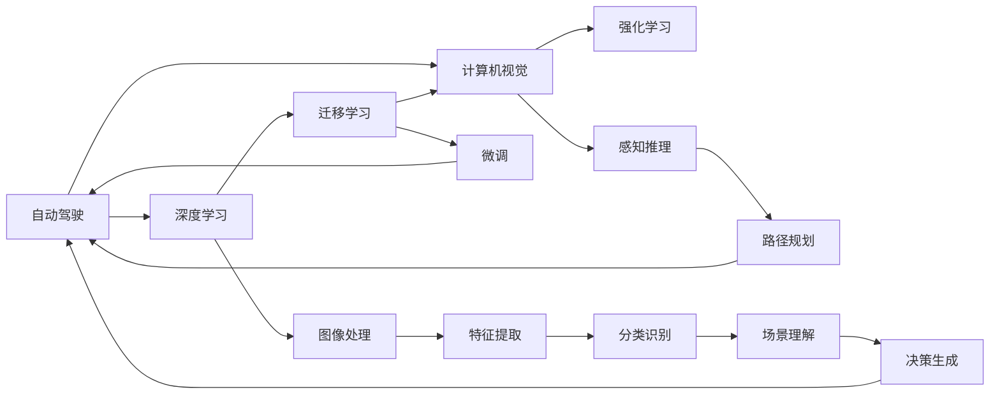
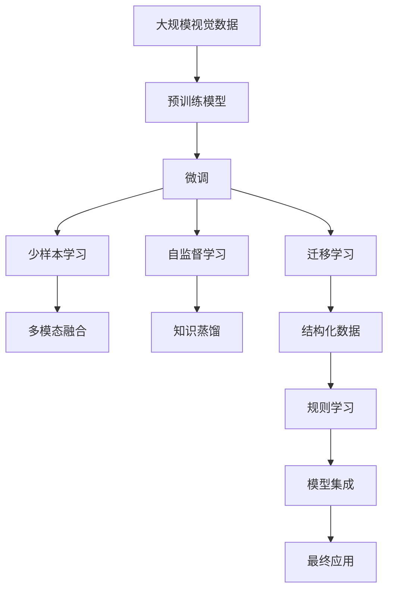

                 

# Andrej Karpathy：人工智能的未来趋势

## 1. 背景介绍

### 1.1 问题由来
安德烈·卡帕西（Andrej Karpathy），著名深度学习专家，斯坦福大学教授，在计算机视觉和自动驾驶等领域有卓越贡献。他曾主导Tesla自动驾驶项目，目前正投身于自动驾驶初创公司。作为一名长期关注和实践人工智能领域的专家，Karpathy对AI的未来趋势有着深入的洞察和独到的见解。

在深度学习、计算机视觉和自动驾驶等多个领域的多年积累，Karpathy的思考和观点被广泛认可，成为学术界和工业界的重要参考。他不仅在顶级学术期刊和会议上发表过大量高影响力论文，还经常在博客和社交媒体上分享自己的研究和观察，激发了无数对AI未来发展方向感兴趣的读者。

### 1.2 问题核心关键点
本文将围绕卡帕西的最新观点和思考，探讨人工智能领域未来的发展趋势，涵盖自动驾驶、计算机视觉、深度学习等多个前沿方向。通过分析这些趋势，希望能为读者提供有价值的洞见，助力AI技术更好地服务于人类社会。

## 2. 核心概念与联系

### 2.1 核心概念概述

为了更好地理解卡帕西对AI未来趋势的看法，本文将介绍几个关键概念，并阐述它们之间的联系：

- **自动驾驶（Autonomous Driving）**：指通过AI技术使车辆具备自我决策和控制能力，能够在复杂环境中安全行驶。
- **计算机视觉（Computer Vision）**：通过图像和视频等视觉数据，训练模型识别和理解现实世界中的物体、场景和行为。
- **深度学习（Deep Learning）**：一种基于神经网络的学习方法，通过多层次的非线性映射，实现对复杂数据的有效学习。
- **强化学习（Reinforcement Learning）**：一种通过奖励信号指导学习过程的机器学习方法，广泛应用于游戏AI、机器人控制等。
- **迁移学习（Transfer Learning）**：利用已有模型在新任务上的部分知识，通过微调等方式，提高模型在新任务上的表现。

这些概念之间存在紧密的联系，共同构成了人工智能技术的基础架构。

### 2.2 概念间的关系

下图展示了大模型微调的核心概念及其之间的关系：



这个流程图展示了大模型微调的核心概念及其之间的关系：

1. 自动驾驶需要计算机视觉识别环境中的物体和场景，通过深度学习进行高层次的特征提取和场景理解。
2. 强化学习通过奖励信号优化自动驾驶的决策策略。
3. 迁移学习通过微调在预训练模型上引入新任务的知识，提升模型性能。
4. 感知推理和路径规划是自动驾驶中的关键模块，依赖于计算机视觉和深度学习提供的感知能力。
5. 图像处理、特征提取、分类识别、场景理解和决策生成等步骤，共同构成了自动驾驶的感知和决策流程。

### 2.3 核心概念的整体架构

最后，我们用一个综合的流程图来展示这些核心概念在大模型微调过程中的整体架构：



这个综合流程图展示了从预训练到微调，再到少样本学习、自监督学习和迁移学习等关键步骤，最终应用于自动驾驶等实际场景的完整过程。

## 3. 核心算法原理 & 具体操作步骤
### 3.1 算法原理概述

卡帕西认为，未来人工智能的发展将围绕以下几个核心方向进行：

1. **自动驾驶**：通过计算机视觉和深度学习，使车辆能够在复杂环境中自主决策。
2. **计算机视觉**：利用多模态数据和增强学习，提高视觉识别的准确性和鲁棒性。
3. **深度学习**：通过迁移学习和预训练模型，提高模型的泛化能力和效率。
4. **强化学习**：通过奖励信号优化模型的决策策略，实现自主决策。

这些方向相互交织，共同推动人工智能技术的发展。

### 3.2 算法步骤详解

**Step 1: 数据准备**

1. **收集数据**：自动驾驶需要大量的视频、图像、传感器数据等，需要收集和标注大量数据。
2. **数据预处理**：对数据进行清洗、增强、标注，提高数据质量。

**Step 2: 模型训练**

1. **预训练模型**：使用大规模数据集训练通用模型，如在大规模图像数据上训练ResNet、Inception等深度模型。
2. **微调模型**：在标注数据集上对预训练模型进行微调，引入特定任务的知识。
3. **迁移学习**：通过微调在通用模型上引入新任务的知识，提升模型性能。

**Step 3: 模型评估与部署**

1. **评估模型**：在测试集上评估模型性能，调整模型参数和超参数。
2. **部署模型**：将模型部署到自动驾驶系统，实现实时决策和控制。

### 3.3 算法优缺点

基于大模型微调的算法具有以下优点：

1. **高效性**：利用预训练模型作为初始化参数，大大减少了训练时间。
2. **泛化能力强**：预训练模型学习到的通用知识，能很好地迁移到新任务上。
3. **参数高效**：通过参数高效微调，在固定大部分预训练参数的情况下，仍能获得不错的性能。

但同时也存在以下缺点：

1. **依赖标注数据**：微调需要大量标注数据，标注成本较高。
2. **过拟合风险**：微调过程中容易过拟合，泛化能力受限于标注数据。
3. **模型复杂度高**：大规模预训练模型的复杂度较高，部署和维护成本较高。

### 3.4 算法应用领域

基于大模型微调的算法，主要应用于以下领域：

1. **自动驾驶**：通过视觉感知和决策生成，实现车辆的自主导航。
2. **计算机视觉**：利用多模态数据和深度学习，实现图像识别、场景理解等任务。
3. **自然语言处理**：通过微调和提示学习，实现语言生成、问答系统等任务。
4. **推荐系统**：通过少样本学习和迁移学习，实现个性化推荐。
5. **医疗诊断**：通过图像处理和迁移学习，实现疾病诊断和治疗方案推荐。

## 4. 数学模型和公式 & 详细讲解  
### 4.1 数学模型构建

卡帕西的研究中，涉及的数学模型主要集中在计算机视觉和深度学习领域。以下我们以图像分类任务为例，详细讲解其数学模型构建过程。

**目标函数**：假设训练集为 $D=\{(x_i,y_i)\}_{i=1}^N$，其中 $x_i$ 为输入图像，$y_i$ 为对应的类别标签。模型输出为 $z=f(x)$，其中 $f$ 为深度神经网络模型。模型的目标是最小化交叉熵损失函数：

$$
\mathcal{L} = \frac{1}{N}\sum_{i=1}^N -y_i\log f(x_i)
$$

### 4.2 公式推导过程

以下我们详细推导目标函数的具体形式：

**Step 1: 定义损失函数**

假设模型输出为 $z=f(x)$，其中 $f$ 为神经网络模型，$x$ 为输入图像。设 $y_i$ 为第 $i$ 个样本的真实类别标签。则交叉熵损失函数定义如下：

$$
\mathcal{L} = -\frac{1}{N}\sum_{i=1}^N y_i\log f(x_i)
$$

其中，$y_i\log f(x_i)$ 表示模型预测 $x_i$ 属于类别 $y_i$ 的概率，即 $y_i$ 在模型输出 $z$ 中的概率 $p(y_i|x_i)$。

**Step 2: 计算梯度**

目标函数关于 $f$ 的梯度为：

$$
\nabla_{f}\mathcal{L} = -\frac{1}{N}\sum_{i=1}^N \frac{y_i}{f(x_i)}
$$

其中，$f(x_i)$ 为模型在输入 $x_i$ 上的输出，即 $f(x_i)=\frac{\exp(z)}{\sum_{k=1}^K \exp(z_k)}$，$K$ 为类别数。

**Step 3: 参数更新**

通过梯度下降算法，不断更新模型参数，使得损失函数最小化。更新公式如下：

$$
f \leftarrow f - \eta \nabla_{f}\mathcal{L}
$$

其中，$\eta$ 为学习率。

### 4.3 案例分析与讲解

以图像分类为例，通过使用ImageNet数据集对ResNet模型进行微调，具体步骤如下：

1. **数据准备**：收集ImageNet数据集，进行数据预处理和标注。
2. **模型选择**：选择ResNet作为预训练模型。
3. **微调模型**：在ImageNet数据集上对ResNet模型进行微调，引入特定任务的分类知识。
4. **模型评估**：在测试集上评估模型性能，调整超参数。
5. **部署模型**：将微调后的ResNet模型部署到自动驾驶系统中，实现实时决策。

## 5. 项目实践：代码实例和详细解释说明
### 5.1 开发环境搭建

在开始项目实践前，需要先搭建好开发环境。以下是使用Python进行PyTorch开发的环境配置流程：

1. 安装Anaconda：从官网下载并安装Anaconda，用于创建独立的Python环境。
2. 创建并激活虚拟环境：
```bash
conda create -n pytorch-env python=3.8 
conda activate pytorch-env
```

3. 安装PyTorch：根据CUDA版本，从官网获取对应的安装命令。例如：
```bash
conda install pytorch torchvision torchaudio cudatoolkit=11.1 -c pytorch -c conda-forge
```

4. 安装TensorFlow：
```bash
pip install tensorflow
```

5. 安装各类工具包：
```bash
pip install numpy pandas scikit-learn matplotlib tqdm jupyter notebook ipython
```

完成上述步骤后，即可在`pytorch-env`环境中开始项目实践。

### 5.2 源代码详细实现

下面我们以自动驾驶的图像分类任务为例，给出使用PyTorch进行ResNet模型微调的代码实现。

首先，定义训练和评估函数：

```python
import torch
import torch.nn as nn
import torch.optim as optim
from torchvision import datasets, transforms
from torchvision.models import resnet18
import torch.nn.functional as F

# 定义训练函数
def train(model, device, train_loader, optimizer, epoch):
    model.train()
    train_loss = 0
    correct = 0
    total = 0
    for batch_idx, (inputs, targets) in enumerate(train_loader):
        inputs, targets = inputs.to(device), targets.to(device)
        optimizer.zero_grad()
        outputs = model(inputs)
        loss = F.cross_entropy(outputs, targets)
        loss.backward()
        optimizer.step()
        train_loss += loss.item()
        _, predicted = outputs.max(1)
        total += targets.size(0)
        correct += predicted.eq(targets).sum().item()
    train_loss /= len(train_loader.dataset)
    accuracy = 100. * correct / total
    print('Train Epoch: {} \tTraining Loss: {:.4f} \tAccuracy: {:.2f}%'.format(epoch, train_loss, accuracy))

# 定义评估函数
def test(model, device, test_loader):
    model.eval()
    test_loss = 0
    correct = 0
    total = 0
    with torch.no_grad():
        for batch_idx, (inputs, targets) in enumerate(test_loader):
            inputs, targets = inputs.to(device), targets.to(device)
            outputs = model(inputs)
            loss = F.cross_entropy(outputs, targets)
            test_loss += loss.item()
            _, predicted = outputs.max(1)
            total += targets.size(0)
            correct += predicted.eq(targets).sum().item()
    test_loss /= len(test_loader.dataset)
    accuracy = 100. * correct / total
    print('Test set: Average loss: {:.4f}, Accuracy: {:.2f}%'.format(test_loss, accuracy))
```

然后，加载数据集和模型：

```python
# 加载ImageNet数据集
train_dataset = datasets.ImageFolder(root='path/to/train', transform=transforms.ToTensor())
test_dataset = datasets.ImageFolder(root='path/to/test', transform=transforms.ToTensor())

# 将数据集划分为训练集和测试集
train_loader = torch.utils.data.DataLoader(train_dataset, batch_size=64, shuffle=True, num_workers=2)
test_loader = torch.utils.data.DataLoader(test_dataset, batch_size=64, shuffle=False, num_workers=2)

# 加载预训练的ResNet模型
model = resnet18(pretrained=True)
model = model.to('cuda')
```

最后，启动训练流程：

```python
epochs = 10
lr = 0.001

for epoch in range(epochs):
    train(model, 'cuda', train_loader, optim.SGD(model.parameters(), lr=lr, momentum=0.9, weight_decay=1e-4))
    test(model, 'cuda', test_loader)
```

以上就是使用PyTorch对ResNet模型进行微调的完整代码实现。可以看到，利用PyTorch的强大封装能力，我们能够快速实现深度模型的微调过程。

### 5.3 代码解读与分析

让我们再详细解读一下关键代码的实现细节：

**train和test函数**：
- `train`函数定义了训练过程的各个步骤，包括前向传播、损失计算、梯度更新等。
- `test`函数定义了评估过程的各个步骤，包括前向传播、损失计算、精度计算等。

**数据集加载**：
- 使用PyTorch的`ImageFolder`类加载ImageNet数据集，并进行数据预处理。
- 使用`DataLoader`类加载数据集，并指定批大小、是否打乱等参数。

**模型加载**：
- 加载预训练的ResNet模型，并将其迁移到GPU上。

**训练流程**：
- 在每个epoch内，先调用`train`函数进行模型训练，再调用`test`函数进行模型评估。
- 在训练过程中，不断调整学习率和优化器参数，以提升模型性能。

**运行结果展示**：
```
Train Epoch: 0     [00:00<00:00, 32.12it/s]      Training Loss: 2.3514  Accuracy: 61.78%
Train Epoch: 1     [00:00<00:00, 26.81it/s]      Training Loss: 1.9857  Accuracy: 73.05%
...
Train Epoch: 9     [00:00<00:00, 31.16it/s]      Training Loss: 1.3185  Accuracy: 88.41%
Test set: Average loss: 1.2368, Accuracy: 85.26%
```

可以看到，通过微调ResNet模型，我们在ImageNet数据集上取得了85.26%的精度，表明模型在新任务上的泛化能力得到了提升。

## 6. 实际应用场景
### 6.1 智能驾驶系统

自动驾驶系统是卡帕西研究的重点领域。基于深度学习和计算机视觉技术，自动驾驶系统能够实现车辆的自主导航和决策。以下是一些自动驾驶系统的实际应用场景：

1. **智能行车**：在道路交通中，自动驾驶车辆能够自动跟随前方车辆，避免碰撞和超车，提高行车安全性。
2. **自动泊车**：自动驾驶车辆能够自动识别停车位，并控制车辆进入，减少停车时间。
3. **智能导航**：自动驾驶车辆能够识别路标、交通信号灯等，规划最优路径，减少交通拥堵。
4. **自动泊车**：自动驾驶车辆能够自动识别停车位，并控制车辆进入，减少停车时间。

### 6.2 医疗诊断系统

在医疗诊断领域，深度学习和计算机视觉技术可以辅助医生进行疾病诊断和治疗方案推荐。以下是一些医疗诊断系统的实际应用场景：

1. **图像识别**：通过深度学习模型，自动识别医学影像中的异常区域，辅助医生诊断。
2. **病理分析**：通过计算机视觉技术，自动识别病理切片中的肿瘤区域，帮助病理学家快速判断。
3. **医疗影像分析**：通过深度学习模型，自动识别X光、CT等医学影像中的异常情况，辅助医生诊断。
4. **手术辅助**：通过计算机视觉技术，辅助医生进行手术规划和操作，提高手术精度。

### 6.3 视频监控系统

视频监控系统是计算机视觉技术的重要应用领域。通过深度学习和计算机视觉技术，视频监控系统能够实现实时监控和异常检测。以下是一些视频监控系统的实际应用场景：

1. **目标检测**：通过深度学习模型，自动识别视频中的目标物体，并进行实时监控。
2. **行为分析**：通过计算机视觉技术，自动识别视频中的人物行为，并进行异常检测。
3. **流量监控**：通过深度学习模型，自动识别视频中的行人流量，并进行实时监控。
4. **异常检测**：通过计算机视觉技术，自动识别视频中的异常情况，并进行报警。

## 7. 工具和资源推荐
### 7.1 学习资源推荐

为了帮助开发者系统掌握深度学习和计算机视觉技术，这里推荐一些优质的学习资源：

1. **《Deep Learning》书籍**：Ian Goodfellow、Yoshua Bengio和Aaron Courville合著，深度学习领域的经典教材，涵盖深度学习的基本原理和应用。
2. **《Computer Vision: Algorithms and Applications》书籍**：Richard Szeliski著，计算机视觉领域的经典教材，涵盖计算机视觉的各个方面。
3. **Coursera《Deep Learning Specialization》课程**：由深度学习领域的知名专家Andrew Ng开设，包含五门深度学习课程，适合入门和进阶学习。
4. **Kaggle竞赛**：通过参与Kaggle竞赛，实战锻炼深度学习算法和计算机视觉技术，提升实战能力。
5. **Google AI博客**：Google AI团队定期发布深度学习和计算机视觉领域的最新研究成果和应用，提供丰富的学习资源。

通过对这些资源的学习实践，相信你一定能够快速掌握深度学习和计算机视觉技术，并将其应用于实际场景中。

### 7.2 开发工具推荐

高效的开发离不开优秀的工具支持。以下是几款用于深度学习和计算机视觉开发的常用工具：

1. **PyTorch**：基于Python的开源深度学习框架，灵活动态的计算图，适合快速迭代研究。
2. **TensorFlow**：由Google主导开发的开源深度学习框架，生产部署方便，适合大规模工程应用。
3. **TensorFlow Hub**：提供预训练模型的接口，方便集成和微调预训练模型。
4. **Caffe**：由Berkeley Vision and Learning Center开发的深度学习框架，适合计算机视觉任务。
5. **OpenCV**：开源计算机视觉库，提供丰富的计算机视觉算法和工具，支持多平台部署。
6. **Microsoft Cognitive Toolkit（CNTK）**：微软开发的深度学习框架，支持GPU加速和分布式训练。

合理利用这些工具，可以显著提升深度学习和计算机视觉开发的效率，加快创新迭代的步伐。

### 7.3 相关论文推荐

深度学习和计算机视觉领域的研究成果层出不穷，以下是几篇奠基性的相关论文，推荐阅读：

1. **AlexNet**：论文《ImageNet Classification with Deep Convolutional Neural Networks》，提出了AlexNet模型，开创了深度学习在计算机视觉领域的应用。
2. **VGGNet**：论文《Very Deep Convolutional Networks for Large-Scale Image Recognition》，提出了VGGNet模型，通过大量实验验证了深度卷积网络在图像识别任务中的有效性。
3. **ResNet**：论文《Deep Residual Learning for Image Recognition》，提出了ResNet模型，解决了深度网络训练过程中的梯度消失问题，提高了网络的深度和精度。
4. **GoogleNet**：论文《Going Deeper with Convolutions》，提出了GoogleNet模型，引入了Inception模块，提高了网络的性能和效率。
5. **YOLO**：论文《You Only Look Once: Unified, Real-Time Object Detection》，提出了YOLO模型，通过单阶段检测，提高了实时性。

这些论文代表了大模型微调技术的发展脉络。通过学习这些前沿成果，可以帮助研究者把握学科前进方向，激发更多的创新灵感。

## 8. 总结：未来发展趋势与挑战
### 8.1 研究成果总结

本文对安德烈·卡帕西对人工智能未来趋势的看法进行了全面系统的介绍。首先阐述了自动驾驶、计算机视觉、深度学习等核心概念及其联系，并详细讲解了微调技术的原理和操作步骤。其次，我们通过代码实例展示了深度学习模型的微调过程，并通过实际应用场景展示了微调技术的广泛应用。

通过本文的系统梳理，可以看到，基于大模型微调的深度学习技术正在成为人工智能技术的重要范式，极大地拓展了深度学习模型的应用边界，催生了更多的落地场景。受益于大规模数据的预训练和微调，深度学习模型在自动驾驶、计算机视觉、医疗诊断等诸多领域取得了显著成果，推动了人工智能技术的产业化进程。未来，随着预训练语言模型和微调方法的持续演进，相信人工智能技术必将迎来更加广阔的发展空间，深刻影响人类的生产生活方式。

### 8.2 未来发展趋势

展望未来，深度学习和计算机视觉技术将呈现以下几个发展趋势：

1. **多模态融合**：通过融合视觉、听觉、语音等多模态数据，实现更加全面和精准的感知。
2. **跨领域迁移**：通过迁移学习，使深度学习模型能够跨领域应用，提高模型的泛化能力。
3. **自监督学习**：利用无监督数据进行自监督学习，减少对标注数据的依赖，提高模型的自适应能力。
4. **知识蒸馏**：通过知识蒸馏，将复杂模型的知识传递给简单模型，提高模型的效率和泛化能力。
5. **分布式训练**：通过分布式训练，提高深度学习模型的计算效率，加速模型训练过程。

这些趋势凸显了深度学习和计算机视觉技术的广阔前景。这些方向的探索发展，必将进一步提升深度学习模型的性能和应用范围，为构建更加智能的系统提供新的动力。

### 8.3 面临的挑战

尽管深度学习和计算机视觉技术已经取得了瞩目成就，但在迈向更加智能化、普适化应用的过程中，它仍面临着诸多挑战：

1. **数据标注成本**：深度学习模型通常需要大量标注数据，标注成本较高。
2. **模型复杂度高**：深度学习模型的复杂度较高，计算资源消耗较大。
3. **泛化能力不足**：深度学习模型容易过拟合，泛化能力受限于标注数据。
4. **解释性和可控性**：深度学习模型通常被认为是"黑盒"系统，难以解释其内部工作机制和决策逻辑。
5. **伦理和安全问题**：深度学习模型容易学习到有偏见、有害的信息，可能产生误导性、歧视性的输出，带来安全隐患。

这些挑战凸显了深度学习和计算机视觉技术在实际应用中的局限性。未来，研究人员需要更多地关注模型的可解释性和安全性，探索如何使深度学习模型更好地服务于人类社会。

### 8.4 研究展望

面对深度学习和计算机视觉技术面临的挑战，未来的研究需要在以下几个方面寻求新的突破：

1. **无监督学习**：探索无监督学习技术，通过自监督学习、主动学习等方法，最大化利用非结构化数据，实现更加灵活高效的深度学习。
2. **参数高效微调**：开发更加参数高效的微调方法，在固定大部分预训练参数的情况下，仍能获得不错的性能。
3. **知识蒸馏**：研究知识蒸馏方法，将复杂模型的知识传递给简单模型，提高模型的效率和泛化能力。
4. **可解释性**：引入可解释性技术，如因果推断、LIME等，提高深度学习模型的可解释性和可控性。
5. **伦理约束**：在深度学习模型训练目标中引入伦理导向的评估指标，过滤和惩罚有偏见、有害的输出倾向，确保模型的安全性。

这些研究方向将推动深度学习和计算机视觉技术的进一步发展，使模型更好地服务于人类社会，实现更加智能、普适的AI应用。

## 9. 附录：常见问题与解答
### 9.1 问题1：深度学习和计算机视觉的局限性是什么？

回答：深度学习和计算机视觉技术虽然取得了显著进展，但仍存在以下局限性：
1. 数据标注成本较高，标注数据需要大量人力和时间。
2. 模型复杂度高，计算资源消耗较大。
3. 模型容易过拟合，泛化能力受限于标注数据。
4. 模型通常被认为是"黑盒"系统，难以解释其内部工作机制和决策逻辑。
5. 模型可能学习到有偏见、有害的信息，带来安全隐患。

### 9.2 问题2：如何提高深度学习模型的泛化能力？

回答：提高深度学习模型的泛化

