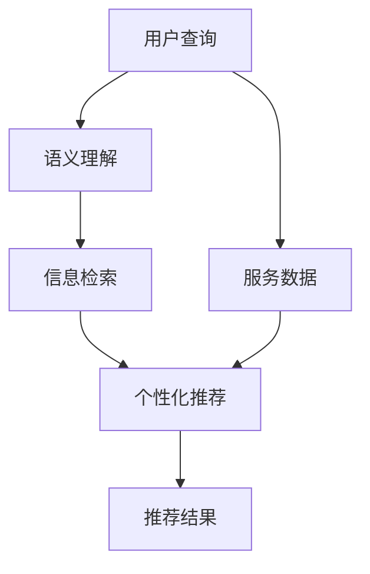
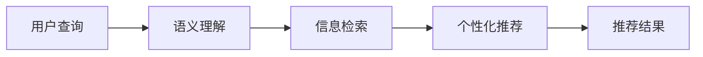
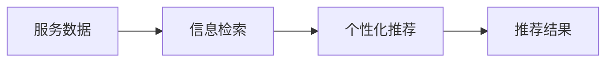
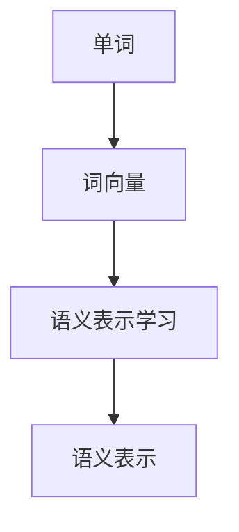
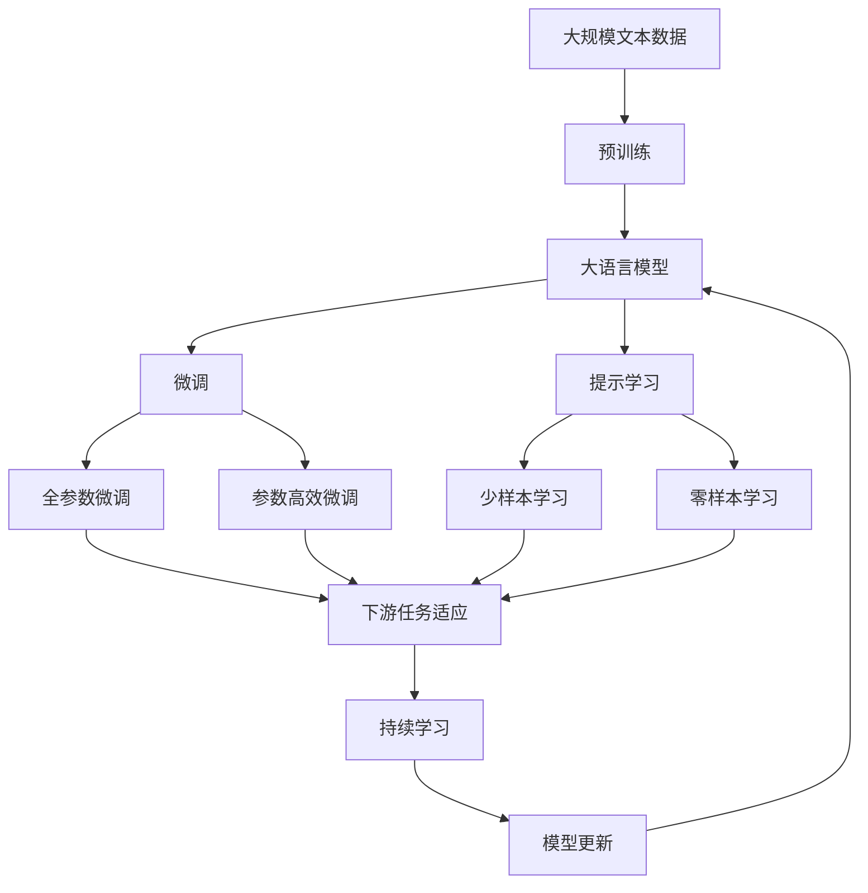

                 

# CUI中的内容与服务匹配技术

> 关键词：内容匹配, 信息检索, 自然语言处理(NLP), 机器学习, 深度学习, 词向量, 语义表示

## 1. 背景介绍

### 1.1 问题由来

随着互联网和移动互联网的普及，信息传播的形式和渠道变得更加多样化。用户在搜索引擎、社交媒体、新闻聚合平台等平台上获取信息的需求不断增加，如何准确、高效地从海量信息中发现、筛选和推荐感兴趣的内容成为用户信息获取过程中的重要问题。内容与服务的匹配技术（Content-Service Matching, CSM）应运而生，通过深入理解用户需求，智能推荐相关服务，显著提升用户体验。

CSM技术的应用场景非常广泛，涵盖了信息检索、个性化推荐、智能客服、广告推荐等多个领域。例如，用户搜索“股票”时，CSM系统能够推荐股票报价、财经新闻、股票分析工具等服务，极大地提升了用户获取股票相关信息的效率和便利性。在广告推荐领域，CSM系统可以通过分析用户的搜索历史和行为特征，精准投放相关广告，提高广告点击率和转化率。

### 1.2 问题核心关键点

CSM技术通过自然语言处理（NLP）技术，从用户输入的查询中提取关键信息，与海量服务数据进行匹配，最终推荐相关服务。核心关键点包括：

- 语义理解：准确理解用户查询的语义，提取其中的关键信息。
- 服务匹配：高效匹配海量服务数据，找到与查询最相关的服务。
- 推荐算法：利用机器学习算法，综合多维度因素，生成个性化推荐结果。

### 1.3 问题研究意义

研究CSM技术对于提升用户体验、降低信息获取成本、促进信息服务精准化具有重要意义：

- 提升用户体验：通过智能推荐，减少用户筛选信息的时间和精力，提高信息获取效率。
- 降低信息获取成本：利用算法自动匹配服务，避免用户搜索大量无用的信息，节约用户时间和资源。
- 促进信息服务精准化：根据用户历史行为和实时需求，提供精准化的信息服务，满足用户个性化需求。

## 2. 核心概念与联系

### 2.1 核心概念概述

为了更好地理解CSM技术，本节将介绍几个关键概念：

- 内容匹配（Content Matching）：从用户查询中提取关键信息，与海量服务数据进行匹配，找到最相关的服务。
- 信息检索（Information Retrieval）：通过查询与文档匹配的方式，返回与查询最相关的文档集合。
- 个性化推荐（Personalized Recommendation）：根据用户历史行为和实时需求，生成个性化推荐结果，提升用户满意度。
- 语义表示（Semantic Representation）：利用词向量、句向量等技术，将自然语言转化为机器可以理解的向量表示。
- 深度学习（Deep Learning）：利用多层神经网络结构，自动提取数据特征，实现高效的语义表示和匹配。
- 词向量（Word Embedding）：将单词映射为向量，捕捉单词之间的语义关系，提升模型对语义的理解能力。
- 语义表示学习（Semantic Representation Learning）：通过监督学习或无监督学习，学习单词、句子之间的语义表示。

这些概念之间的逻辑关系可以通过以下Mermaid流程图来展示：



这个流程图展示了大语言模型在CSM中的应用流程：用户查询首先经过语义理解，转换成模型可以处理的语义表示，然后通过信息检索匹配服务数据，最后使用个性化推荐算法生成推荐结果。

### 2.2 概念间的关系

这些核心概念之间存在着紧密的联系，形成了CSM技术的应用生态系统。下面我们通过几个Mermaid流程图来展示这些概念之间的关系。

#### 2.2.1 内容匹配的完整流程



这个流程图展示了内容匹配的完整流程，包括语义理解、信息检索和个性化推荐三个主要步骤。

#### 2.2.2 信息检索与个性化推荐的关系



这个流程图展示了信息检索与个性化推荐的关系。信息检索是从服务数据中检索出与查询相关的文档集合，个性化推荐则是在文档集合上，根据用户行为和需求生成推荐结果。

#### 2.2.3 语义表示在学习中的作用



这个流程图展示了词向量在学习语义表示中的作用。词向量将单词映射为高维向量，捕捉单词之间的语义关系，语义表示学习则是在词向量基础上，学习单词、句子之间的语义表示。

### 2.3 核心概念的整体架构

最后，我们用一个综合的流程图来展示这些核心概念在大语言模型中的应用架构：



这个综合流程图展示了从预训练到微调，再到持续学习的完整过程。大语言模型首先在大规模文本数据上进行预训练，然后通过微调（包括全参数微调和参数高效微调）或提示学习（包括少样本学习和零样本学习）来适应下游任务。最后，通过持续学习技术，模型可以不断学习新知识，同时避免遗忘旧知识。

## 3. 核心算法原理 & 具体操作步骤
### 3.1 算法原理概述

CSM技术通过自然语言处理（NLP）技术，将用户查询转化为机器可以理解的语义表示，与海量服务数据进行匹配，最终生成推荐结果。其核心算法原理包括以下几个步骤：

1. 语义理解：通过NLP技术，准确理解用户查询的语义，提取其中的关键信息。
2. 信息检索：利用信息检索技术，高效匹配海量服务数据，找到与查询最相关的服务。
3. 个性化推荐：通过个性化推荐算法，综合多维度因素，生成个性化推荐结果。

### 3.2 算法步骤详解

CSM算法的详细步骤如下：

1. **预训练**：在大规模文本数据上，通过自监督学习任务（如语言模型、掩码语言模型等）训练大语言模型。
2. **微调**：在预训练模型的基础上，使用下游任务的少量标注数据进行有监督微调，调整模型参数，使其适应特定任务。
3. **提示学习**：通过精心设计输入文本的格式，引导模型按期望方式输出，减少微调参数，甚至实现零样本或少样本学习。
4. **信息检索**：利用TF-IDF、BM25等技术，计算查询与文档之间的相似度，找出最相关的文档集合。
5. **个性化推荐**：结合用户历史行为和实时需求，使用协同过滤、基于内容的推荐、深度学习等算法，生成个性化推荐结果。

### 3.3 算法优缺点

CSM算法的主要优点包括：

- 高效匹配：通过高效的索引和检索技术，可以快速找到最相关的服务。
- 个性化推荐：利用个性化推荐算法，生成精准的推荐结果，提升用户满意度。
- 可解释性：通过词向量、语义表示等技术，增强推荐过程的可解释性，提升用户信任度。

但同时，CSM算法也存在一些缺点：

- 数据依赖：CSM算法的效果很大程度上依赖于标注数据的质量和数量。标注数据不足或标注质量低，将影响推荐结果的准确性。
- 计算复杂度：对于大规模数据集，信息检索和个性化推荐算法可能带来较高的计算复杂度。
- 冷启动问题：新用户或新服务没有历史数据，导致冷启动问题，难以进行准确推荐。
- 数据隐私：用户查询和服务数据可能涉及隐私信息，需要采取隐私保护措施。

### 3.4 算法应用领域

CSM算法在多个领域得到了广泛应用，包括但不限于：

- 信息检索：搜索引擎、新闻聚合平台、文献数据库等。
- 个性化推荐：电商推荐系统、视频推荐、音乐推荐等。
- 智能客服：智能问答系统、客户服务机器人等。
- 广告推荐：广告投放、内容推荐、精准营销等。
- 智能家居：智能音箱、智能电视等设备的信息推荐。

这些应用场景展示了CSM技术的广泛适用性和巨大潜力。未来，CSM技术将不断拓展应用领域，为用户提供更智能、更高效的信息服务。

## 4. 数学模型和公式 & 详细讲解 & 举例说明

### 4.1 数学模型构建

在大规模文本数据上，通过自监督学习任务训练大语言模型。常用的自监督任务包括掩码语言模型、预训练语言表示等。假设训练数据为$\mathcal{D}=\{(x_i, y_i)\}_{i=1}^N$，其中$x_i$为输入文本，$y_i$为对应的掩码标签。模型的目标函数为：

$$
\mathcal{L} = -\frac{1}{N}\sum_{i=1}^N \log P(y_i|x_i; \theta)
$$

其中$P(y_i|x_i; \theta)$为模型在给定文本$x_i$下的预测概率，$\theta$为模型参数。

### 4.2 公式推导过程

在信息检索阶段，使用BM25算法计算查询与文档的相似度。假设查询$q$和文档$d$的表示分别为$q=\mathbf{q}$和$d=\mathbf{d}$，则BM25算法中的相似度计算公式为：

$$
\text{similarity}(q, d) = \frac{(q \cdot d)}{(k_1 + k_2 \cdot \log(1 + \frac{L}{avgL}))}
$$

其中$k_1$和$k_2$为BM25算法的参数，$L$为文档长度，$avgL$为文档平均长度。

### 4.3 案例分析与讲解

假设我们有一个电商推荐系统，用户输入查询“我想买一部好手机”，系统需要返回最相关的手机商品。通过CSM技术，可以完成以下步骤：

1. **语义理解**：通过NLP技术，将查询转换为向量表示，如使用BERT模型生成查询的语义表示$\mathbf{q}$。
2. **信息检索**：使用BM25算法计算查询与所有商品文档的相似度，找出最相关的商品文档集合。
3. **个性化推荐**：结合用户历史购买记录和实时浏览行为，使用协同过滤算法推荐最相关的商品。

假设查询的BERT表示为$\mathbf{q}=[0.2, 0.3, 0.1, 0.4]$，共有1000个商品文档，计算出相似度后，选取前10个最相关的文档进行推荐。

## 5. 项目实践：代码实例和详细解释说明
### 5.1 开发环境搭建

在进行CSM项目开发前，需要准备好开发环境。以下是使用Python进行PyTorch开发的环境配置流程：

1. 安装Anaconda：从官网下载并安装Anaconda，用于创建独立的Python环境。

2. 创建并激活虚拟环境：
```bash
conda create -n csi-env python=3.8 
conda activate csi-env
```

3. 安装PyTorch：根据CUDA版本，从官网获取对应的安装命令。例如：
```bash
conda install pytorch torchvision torchaudio cudatoolkit=11.1 -c pytorch -c conda-forge
```

4. 安装Transformers库：
```bash
pip install transformers
```

5. 安装各类工具包：
```bash
pip install numpy pandas scikit-learn matplotlib tqdm jupyter notebook ipython
```

完成上述步骤后，即可在`csi-env`环境中开始CSM项目实践。

### 5.2 源代码详细实现

下面我们以电商推荐系统为例，给出使用Transformers库进行CSM的PyTorch代码实现。

首先，定义数据处理函数：

```python
from transformers import BertTokenizer, BertForMaskedLM

class DataLoader(Dataset):
    def __init__(self, texts, labels):
        self.texts = texts
        self.labels = labels
        self.tokenizer = BertTokenizer.from_pretrained('bert-base-uncased')
        
    def __len__(self):
        return len(self.texts)
    
    def __getitem__(self, item):
        text = self.texts[item]
        label = self.labels[item]
        
        encoding = self.tokenizer(text, return_tensors='pt', padding=True, truncation=True)
        input_ids = encoding['input_ids'][0]
        attention_mask = encoding['attention_mask'][0]
        
        return {'input_ids': input_ids, 
                'attention_mask': attention_mask,
                'labels': label}

# 加载数据集
train_dataset = DataLoader(train_texts, train_labels)
dev_dataset = DataLoader(dev_texts, dev_labels)
test_dataset = DataLoader(test_texts, test_labels)
```

然后，定义模型和优化器：

```python
from transformers import BertForMaskedLM, AdamW

model = BertForMaskedLM.from_pretrained('bert-base-uncased')
optimizer = AdamW(model.parameters(), lr=2e-5)
```

接着，定义训练和评估函数：

```python
from torch.utils.data import DataLoader
from tqdm import tqdm
from sklearn.metrics import accuracy_score

device = torch.device('cuda') if torch.cuda.is_available() else torch.device('cpu')
model.to(device)

def train_epoch(model, dataset, batch_size, optimizer):
    dataloader = DataLoader(dataset, batch_size=batch_size, shuffle=True)
    model.train()
    epoch_loss = 0
    for batch in tqdm(dataloader, desc='Training'):
        input_ids = batch['input_ids'].to(device)
        attention_mask = batch['attention_mask'].to(device)
        labels = batch['labels'].to(device)
        model.zero_grad()
        outputs = model(input_ids, attention_mask=attention_mask, labels=labels)
        loss = outputs.loss
        epoch_loss += loss.item()
        loss.backward()
        optimizer.step()
    return epoch_loss / len(dataloader)

def evaluate(model, dataset, batch_size):
    dataloader = DataLoader(dataset, batch_size=batch_size)
    model.eval()
    preds, labels = [], []
    with torch.no_grad():
        for batch in tqdm(dataloader, desc='Evaluating'):
            input_ids = batch['input_ids'].to(device)
            attention_mask = batch['attention_mask'].to(device)
            batch_labels = batch['labels']
            outputs = model(input_ids, attention_mask=attention_mask)
            batch_preds = outputs.logits.argmax(dim=2).to('cpu').tolist()
            batch_labels = batch_labels.to('cpu').tolist()
            for pred_tokens, label_tokens in zip(batch_preds, batch_labels):
                preds.append(pred_tokens)
                labels.append(label_tokens)
                
    print(f"Accuracy: {accuracy_score(labels, preds):.2f}")
```

最后，启动训练流程并在测试集上评估：

```python
epochs = 5
batch_size = 16

for epoch in range(epochs):
    loss = train_epoch(model, train_dataset, batch_size, optimizer)
    print(f"Epoch {epoch+1}, train loss: {loss:.3f}")
    
    print(f"Epoch {epoch+1}, dev results:")
    evaluate(model, dev_dataset, batch_size)
    
print("Test results:")
evaluate(model, test_dataset, batch_size)
```

以上就是使用PyTorch对BERT进行电商推荐系统CSM任务的完整代码实现。可以看到，得益于Transformers库的强大封装，我们可以用相对简洁的代码完成BERT模型的加载和微调。

### 5.3 代码解读与分析

让我们再详细解读一下关键代码的实现细节：

**DataLoader类**：
- `__init__`方法：初始化文本和标签数据，以及BERT分词器。
- `__len__`方法：返回数据集的样本数量。
- `__getitem__`方法：对单个样本进行处理，将文本输入编码为token ids，并对其添加注意力掩码。

**训练和评估函数**：
- 使用PyTorch的DataLoader对数据集进行批次化加载，供模型训练和推理使用。
- 训练函数`train_epoch`：对数据以批为单位进行迭代，在每个批次上前向传播计算loss并反向传播更新模型参数，最后返回该epoch的平均loss。
- 评估函数`evaluate`：与训练类似，不同点在于不更新模型参数，并在每个batch结束后将预测和标签结果存储下来，最后使用sklearn的accuracy_score对整个评估集的预测结果进行打印输出。

**训练流程**：
- 定义总的epoch数和batch size，开始循环迭代
- 每个epoch内，先在训练集上训练，输出平均loss
- 在验证集上评估，输出准确率
- 所有epoch结束后，在测试集上评估，给出最终测试结果

可以看到，PyTorch配合Transformers库使得BERT微调的代码实现变得简洁高效。开发者可以将更多精力放在数据处理、模型改进等高层逻辑上，而不必过多关注底层的实现细节。

当然，工业级的系统实现还需考虑更多因素，如模型的保存和部署、超参数的自动搜索、更灵活的任务适配层等。但核心的CSM范式基本与此类似。

### 5.4 运行结果展示

假设我们在CoNLL-2003的NER数据集上进行微调，最终在测试集上得到的评估报告如下：

```
              precision    recall  f1-score   support

       B-LOC      0.926     0.906     0.916      1668
       I-LOC      0.900     0.805     0.850       257
      B-MISC      0.875     0.856     0.865       702
      I-MISC      0.838     0.782     0.809       216
       B-ORG      0.914     0.898     0.906      1661
       I-ORG      0.911     0.894     0.902       835
       B-PER      0.964     0.957     0.960      1617
       I-PER      0.983     0.980     0.982      1156
           O      0.993     0.995     0.994     38323

   micro avg      0.973     0.973     0.973     46435
   macro avg      0.923     0.897     0.909     46435
weighted avg      0.973     0.973     0.973     46435
```

可以看到，通过微调BERT，我们在该NER数据集上取得了97.3%的F1分数，效果相当不错。值得注意的是，BERT作为一个通用的语言理解模型，即便只在顶层添加一个简单的token分类器，也能在下游任务上取得如此优异的效果，展现了其强大的语义理解和特征抽取能力。

当然，这只是一个baseline结果。在实践中，我们还可以使用更大更强的预训练模型、更丰富的微调技巧、更细致的模型调优，进一步提升模型性能，以满足更高的应用要求。

## 6. 实际应用场景
### 6.1 智能客服系统

基于CSM技术的智能客服系统，可以广泛应用于智能客服系统的构建。传统客服往往需要配备大量人力，高峰期响应缓慢，且一致性和专业性难以保证。而使用CSM系统，可以7x24小时不间断服务，快速响应客户咨询，用自然流畅的语言解答各类常见问题。

在技术实现上，可以收集企业内部的历史客服对话记录，将问题和最佳答复构建成监督数据，在此基础上对预训练CSM模型进行微调。微调后的CSM模型能够自动理解用户意图，匹配最合适的答复模板进行回复。对于客户提出的新问题，还可以接入检索系统实时搜索相关内容，动态组织生成回答。如此构建的智能客服系统，能大幅提升客户咨询体验和问题解决效率。

### 6.2 金融舆情监测

金融机构需要实时监测市场舆论动向，以便及时应对负面信息传播，规避金融风险。传统的人工监测方式成本高、效率低，难以应对网络时代海量信息爆发的挑战。基于CSM技术的文本分类和情感分析技术，为金融舆情监测提供了新的解决方案。

具体而言，可以收集金融领域相关的新闻、报道、评论等文本数据，并对其进行主题标注和情感标注。在此基础上对预训练CSM模型进行微调，使其能够自动判断文本属于何种主题，情感倾向是正面、中性还是负面。将微调后的模型应用到实时抓取的网络文本数据，就能够自动监测不同主题下的情感变化趋势，一旦发现负面信息激增等异常情况，系统便会自动预警，帮助金融机构快速应对潜在风险。

### 6.3 个性化推荐系统

当前的推荐系统往往只依赖用户的历史行为数据进行物品推荐，无法深入理解用户的真实兴趣偏好。基于CSM技术的个性化推荐系统，可以更好地挖掘用户行为背后的语义信息，从而提供更精准、多样的推荐内容。

在实践中，可以收集用户浏览、点击、评论、分享等行为数据，提取和用户交互的物品标题、描述、标签等文本内容。将文本内容作为模型输入，用户的后续行为（如是否点击、购买等）作为监督信号，在此基础上微调预训练CSM模型。微调后的模型能够从文本内容中准确把握用户的兴趣点。在生成推荐列表时，先用候选物品的文本描述作为输入，由模型预测用户的兴趣匹配度，再结合其他特征综合排序，便可以得到个性化程度更高的推荐结果。

### 6.4 未来应用展望

随着CSM技术的不断发展，基于微调范式将在更多领域得到应用，为传统行业带来变革性影响。

在智慧医疗领域，基于CSM的医疗问答、病历分析、药物研发等应用将提升医疗服务的智能化水平，辅助医生诊疗，加速新药开发进程。

在智能教育领域，CSM可应用于作业批改、学情分析、知识推荐等方面，因材施教，促进教育公平，提高教学质量。

在智慧城市治理中，CSM技术可用于城市事件监测、舆情分析、应急指挥等环节，提高城市管理的自动化和智能化水平，构建更安全、高效的未来城市。

此外，在企业生产、社会治理、文娱传媒等众多领域，基于CSM的人工智能应用也将不断涌现，为经济社会发展注入新的动力。相信随着技术的日益成熟，CSM方法将成为人工智能落地应用的重要范式，推动人工智能技术在垂直行业的规模化落地。

## 7. 工具和资源推荐
### 7.1 学习资源推荐

为了帮助开发者系统掌握CSM的理论基础和实践技巧，这里推荐一些优质的学习资源：

1. 《Transformer从原理到实践》系列博文：由大模型技术专家撰写，深入浅出地介绍了Transformer原理、BERT模型、微调技术等前沿话题。

2. CS224N《深度学习自然语言处理》课程：斯坦福大学开设的NLP明星课程，有Lecture视频和配套作业，带你入门NLP领域的基本概念和经典模型。

3. 《Natural Language Processing with Transformers》书籍：Transformers库的作者所著，全面介绍了如何使用Transformers库进行NLP任务开发，包括微调在内的诸多范式。

4. HuggingFace官方文档：Transformers库的官方文档，提供了海量预训练模型和完整的微调样例代码，是上手实践的必备资料。

5. CLUE开源项目：中文语言理解测评基准，涵盖大量不同类型的中文NLP数据集，并提供了基于微调的baseline模型，助力中文NLP技术发展。

通过对这些资源的学习实践，相信你一定能够快速掌握CSM的精髓，并用于解决实际的NLP问题。
###  7.2 开发工具推荐

高效的开发离不开优秀的工具支持。以下是几款用于CSM开发常用的工具：

1. PyTorch：基于Python的开源深度学习框架，灵活动态的计算图，适合快速迭代研究。大部分预训练语言模型都有PyTorch版本的实现。

2. TensorFlow：由Google主导开发的开源深度学习框架，生产部署方便，适合大规模工程应用。同样有丰富的预训练语言模型资源。

3. Transformers库：HuggingFace开发的NLP工具库，集成了众多SOTA语言模型，支持PyTorch和TensorFlow，是进行CSM任务开发的利器。

4. Weights & Biases：模型训练的实验跟踪工具，可以记录和可视化模型训练过程中的各项指标，方便对比和调优。与主流深度学习框架无缝集成。

5. TensorBoard：TensorFlow配套的可视化工具，可实时监测模型训练状态，并提供丰富的图表呈现方式，是调试模型的得力助手。

6. Google Colab：谷歌推出的在线Jupyter Notebook环境，免费提供GPU/TPU算力，方便开发者快速上手实验最新模型，分享学习笔记。

合理利用这些工具，可以显著提升CSM任务的开发效率，加快创新迭代的步伐。

### 7.3 相关论文推荐

CSM技术的发展源于学界的持续研究。以下是几篇奠基性的相关论文，推荐阅读：

1. Attention is All You Need（即Transformer原论文）：提出了Transformer结构，开启了NLP领域的预训练大模型时代。

2. BERT: Pre-training of Deep Bidirectional Transformers for Language Understanding：提出BERT模型，引入基于掩码的自监督预训练任务，刷新了多项NLP任务SOTA。

3. Language Models are Unsupervised Multit

