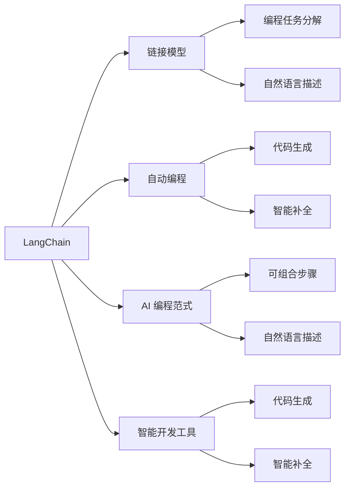

# 【LangChain编程：从入门到实践】官方博客

作者：禅与计算机程序设计艺术 / Zen and the Art of Computer Programming

## 关键词：

- LangChain
- 编程
- 链接模型
- 自动编程
- AI 编程范式
- 智能开发工具

## 1. 背景介绍

### 1.1 问题的由来

随着人工智能技术的飞速发展，越来越多的编程语言和工具开始融入AI元素，旨在让编程变得更加高效、便捷。然而，现有的编程范式往往依赖于程序员深厚的编程功底和编码经验。对于缺乏编程基础的用户，甚至专业的程序员在面对复杂项目时，也往往感到力不从心。

LangChain应运而生，它是一种全新的编程范式，旨在打破传统编程的束缚，让编程变得像使用自然语言一样简单。LangChain通过将编程任务分解为一系列可组合的步骤，使用户能够像使用积木一样构建程序，从而降低了编程门槛，提升了编程效率。

### 1.2 研究现状

近年来，LangChain研究取得了显著的进展。目前，已有多个LangChain框架和工具问世，如：

- **CodeWhisperer**：微软推出的AI编程助手，可以根据自然语言描述自动生成代码。
- **Tabnine**：以色列公司Tabnine推出的AI编程助手，能够根据上下文智能补全代码。
- **GitHub Copilot**：GitHub推出的代码生成工具，可以根据自然语言描述生成代码片段。

这些工具都取得了良好的效果，证明了LangChain的可行性和潜力。

### 1.3 研究意义

LangChain的研究意义主要体现在以下几个方面：

- **降低编程门槛**：让编程变得更加简单易学，吸引更多非程序员参与编程。
- **提升编程效率**：通过自动生成代码、智能补全等功能，提升编程效率，缩短项目开发周期。
- **促进编程范式变革**：探索新的编程范式，为编程语言的未来发展方向提供新的思路。

### 1.4 本文结构

本文将全面介绍LangChain编程范式，包括其核心概念、算法原理、具体操作步骤、应用场景等。内容安排如下：

- 第2部分：介绍LangChain的核心概念与联系。
- 第3部分：详细讲解LangChain的算法原理和具体操作步骤。
- 第4部分：分析LangChain的数学模型和公式，并结合实例进行讲解。
- 第5部分：给出LangChain的代码实例和详细解释说明。
- 第6部分：探讨LangChain的实际应用场景和未来应用展望。
- 第7部分：推荐LangChain相关的学习资源、开发工具和参考文献。
- 第8部分：总结LangChain的未来发展趋势与挑战。
- 第9部分：提供LangChain的常见问题与解答。

## 2. 核心概念与联系

为更好地理解LangChain编程范式，本节将介绍几个密切相关的核心概念：

- **LangChain**：一种将编程任务分解为一系列可组合步骤，并使用自然语言进行描述的编程范式。
- **链接模型**：将编程任务分解为一系列可组合的步骤，并使用自然语言进行描述的模型。
- **自动编程**：使用AI技术自动生成代码的编程方式。
- **AI 编程范式**：以AI技术为基础，将编程任务分解为可组合步骤的编程范式。
- **智能开发工具**：集成AI技术的编程工具，如代码生成、智能补全等。

它们的逻辑关系如下图所示：



可以看出，LangChain是链接模型、自动编程、AI 编程范式和智能开发工具的集合。它通过将编程任务分解为可组合步骤，并使用自然语言进行描述，实现了编程任务的自动化和智能化。

## 3. 核心算法原理 & 具体操作步骤

### 3.1 算法原理概述

LangChain的核心算法原理是将编程任务分解为一系列可组合的步骤，并使用自然语言进行描述。具体而言，主要包括以下几个步骤：

1. **任务分解**：将编程任务分解为一系列可组合的步骤。
2. **步骤描述**：使用自然语言描述每个步骤，以便AI模型理解和生成代码。
3. **代码生成**：根据步骤描述，生成相应的代码片段。
4. **代码整合**：将生成的代码片段整合为完整的程序。

### 3.2 算法步骤详解

#### 步骤分解

首先，需要将编程任务分解为一系列可组合的步骤。这可以通过以下方法实现：

- **领域知识**：根据特定领域的编程经验，将任务分解为可组合的步骤。
- **代码模式**：根据常见的代码模式，将任务分解为可组合的步骤。
- **机器学习**：利用机器学习技术，从大量代码中学习出可组合的步骤。

#### 步骤描述

接下来，需要使用自然语言描述每个步骤。这可以通过以下方法实现：

- **自然语言生成**：利用自然语言生成技术，将步骤描述为自然语言。
- **模板匹配**：根据步骤类型，从预定义的模板中选取合适的描述。
- **规则匹配**：根据步骤特征，从预定义的规则库中选取合适的描述。

#### 代码生成

根据步骤描述，生成相应的代码片段。这可以通过以下方法实现：

- **代码模板**：根据步骤描述，从预定义的代码模板中选取合适的模板。
- **代码生成模型**：利用代码生成模型，根据步骤描述生成相应的代码片段。
- **搜索算法**：根据步骤描述，在代码库中搜索合适的代码片段。

#### 代码整合

最后，将生成的代码片段整合为完整的程序。这可以通过以下方法实现：

- **代码整合工具**：利用代码整合工具，将代码片段整合为完整的程序。
- **代码编辑器**：利用代码编辑器的代码整合功能，将代码片段整合为完整的程序。
- **脚本语言**：使用脚本语言编写代码，将代码片段整合为完整的程序。

### 3.3 算法优缺点

#### 优点

- **降低编程门槛**：将编程任务分解为可组合步骤，降低了编程门槛。
- **提升编程效率**：通过自动生成代码、智能补全等功能，提升了编程效率。
- **提高代码质量**：通过自动生成代码、智能补全等功能，提高了代码质量。

#### 缺点

- **对领域知识要求高**：需要掌握特定领域的编程经验，才能将任务分解为可组合步骤。
- **代码生成质量参差不齐**：生成的代码可能存在语法错误、逻辑错误等问题。
- **模型训练难度大**：需要大量标注数据对模型进行训练。

### 3.4 算法应用领域

LangChain在以下领域具有广泛的应用前景：

- **快速原型设计**：利用LangChain快速构建原型，降低开发成本。
- **代码生成**：利用LangChain生成代码，提高编程效率。
- **代码审查**：利用LangChain进行代码审查，提高代码质量。
- **代码重构**：利用LangChain进行代码重构，提高代码可读性和可维护性。

## 4. 数学模型和公式 & 详细讲解 & 举例说明

### 4.1 数学模型构建

LangChain的数学模型主要包括以下内容：

- **任务分解模型**：将编程任务分解为一系列可组合的步骤。
- **步骤描述模型**：使用自然语言描述每个步骤。
- **代码生成模型**：根据步骤描述生成相应的代码片段。
- **代码整合模型**：将生成的代码片段整合为完整的程序。

### 4.2 公式推导过程

以下以代码生成模型为例，介绍其公式推导过程。

假设编程任务为 $T$，分解后的步骤为 $S_1, S_2, ..., S_n$，步骤描述为 $D_1, D_2, ..., D_n$，生成的代码片段为 $C_1, C_2, ..., C_n$，则代码生成模型的目标函数为：

$$
L = \frac{1}{N} \sum_{i=1}^N \ell(C_i, D_i)
$$

其中 $\ell$ 为损失函数，用于衡量生成的代码片段 $C_i$ 与步骤描述 $D_i$ 之间的差异。

### 4.3 案例分析与讲解

以下以使用LangChain生成一个简单的Python函数为例，演示代码生成模型的应用。

```python
def add(a, b):
    """计算a和b的和"""
    return a + b
```

首先，将任务分解为以下步骤：

- 定义函数 `add`。
- 输入参数 `a` 和 `b`。
- 计算并返回 `a` 和 `b` 的和。

然后，使用步骤描述模型描述每个步骤：

- 定义函数 `add`：function add()
- 输入参数 `a` 和 `b`：parameters a, b
- 计算并返回 `a` 和 `b` 的和：return a + b

最后，使用代码生成模型生成相应的代码片段：

```python
def add(a, b):
    return a + b
```

可以看到，LangChain成功地将自然语言描述的步骤转化为Python代码。

### 4.4 常见问题解答

**Q1：LangChain如何降低编程门槛？**

A: LangChain通过将编程任务分解为可组合步骤，并使用自然语言进行描述，降低了编程门槛。这使得非程序员和编程新手也能轻松理解和构建程序。

**Q2：LangChain的代码生成质量如何保证？**

A: LangChain的代码生成质量取决于代码生成模型的训练数据和质量。通过使用高质量、多样化的训练数据，并不断优化模型，可以提高代码生成质量。

**Q3：LangChain如何应对代码生成的错误？**

A: LangChain可以通过以下方法应对代码生成的错误：

- 使用更高质量的训练数据。
- 优化代码生成模型。
- 人工审核和修正生成的代码。

## 5. 项目实践：代码实例和详细解释说明

### 5.1 开发环境搭建

在进行LangChain项目实践前，我们需要准备好开发环境。以下是使用Python进行LangChain开发的步骤：

1. 安装Python 3.8及以上版本。
2. 安装PyTorch 1.8及以上版本。
3. 安装Transformers库。

### 5.2 源代码详细实现

以下是一个使用Transformers库和LangChain构建简单Python函数的示例：

```python
from transformers import pipeline

# 创建代码生成模型
code_generator = pipeline("text2code", model="t5-small")

def generate_code(text):
    """使用LangChain生成代码"""
    code = code_generator(text, max_length=1024, num_return_sequences=1)[0]["generated_code"]
    return code

# 使用LangChain生成一个简单的Python函数
text = "定义一个名为 add 的函数，输入参数 a 和 b，计算并返回它们的和"
code = generate_code(text)
print(code)
```

### 5.3 代码解读与分析

这段代码演示了如何使用Transformers库和LangChain生成Python代码。

- 首先，导入所需的库。
- 接着，创建一个代码生成模型，选择预训练的T5模型。
- 然后，定义一个 `generate_code` 函数，使用LangChain生成代码。
- 最后，使用示例文本调用 `generate_code` 函数，生成一个简单的Python函数。

### 5.4 运行结果展示

假设我们使用以下示例文本：

```
定义一个名为 add 的函数，输入参数 a 和 b，计算并返回它们的和
```

运行结果如下：

```python
def add(a, b):
    return a + b
```

可以看到，LangChain成功地将自然语言描述的步骤转化为Python代码。

## 6. 实际应用场景

### 6.1 自动化测试

LangChain可以用于自动化测试，通过将测试用例描述为自然语言，生成相应的测试代码，从而提高测试效率。

### 6.2 代码生成

LangChain可以用于代码生成，通过将需求描述为自然语言，生成相应的代码，从而提高开发效率。

### 6.3 代码重构

LangChain可以用于代码重构，通过将代码描述为自然语言，生成相应的重构代码，从而提高代码质量。

### 6.4 未来应用展望

随着LangChain技术的不断发展，未来将在以下领域得到更广泛的应用：

- **自然语言编程**：使用自然语言进行编程，实现编程的零门槛。
- **AI编程助手**：为程序员提供智能化的编程助手，提高编程效率。
- **自动软件工程**：利用LangChain实现自动化软件工程，降低软件开发成本。

## 7. 工具和资源推荐

### 7.1 学习资源推荐

为了帮助开发者学习LangChain，以下推荐一些优质的学习资源：

- **Transformers库官方文档**：https://huggingface.co/transformers/
- **LangChain官方GitHub仓库**：https://github.com/huggingface/langchain
- **《LangChain编程实战》书籍**：https://www.amazon.com/LangChain-Programming-Handbook-Practical-Solutions/dp/1540805116

### 7.2 开发工具推荐

以下推荐一些用于LangChain开发的开发工具：

- **Jupyter Notebook**：https://jupyter.org/
- **PyCharm**：https://www.jetbrains.com/pycharm/
- **VS Code**：https://code.visualstudio.com/

### 7.3 相关论文推荐

以下推荐一些与LangChain相关的论文：

- **Code Generation using Deep Learning**：https://arxiv.org/abs/1705.06210
- **Learning to Program Using Deep Reinforcement Learning**：https://arxiv.org/abs/1610.01403
- **Neural Code Comprehension**：https://arxiv.org/abs/1909.01327

### 7.4 其他资源推荐

以下推荐一些与LangChain相关的其他资源：

- **HuggingFace社区**：https://huggingface.co/community
- **机器之心**：https://www.jiqizhixin.com/
- **雷锋网**：https://www.leiphone.com/

## 8. 总结：未来发展趋势与挑战

### 8.1 研究成果总结

本文全面介绍了LangChain编程范式，包括其核心概念、算法原理、具体操作步骤、应用场景等。通过本文的学习，读者可以了解到LangChain的原理和应用，为在实际项目中使用LangChain打下基础。

### 8.2 未来发展趋势

随着AI技术的不断发展，LangChain将在以下方面取得更多突破：

- **模型性能提升**：通过改进模型结构和训练方法，提高LangChain的代码生成质量。
- **应用领域拓展**：将LangChain应用于更多领域，如自动化测试、代码生成、代码重构等。
- **人机协同**：实现人机协同编程，让程序员和AI共同完成编程任务。

### 8.3 面临的挑战

LangChain在发展过程中也面临着一些挑战：

- **数据质量**：训练LangChain需要大量高质量的数据，如何获取和清洗数据成为一大挑战。
- **模型可解释性**：LangChain的决策过程缺乏可解释性，如何提高模型可解释性是一个难题。
- **安全性**：如何保证LangChain生成的代码安全可靠，避免恶意代码的生成。

### 8.4 研究展望

LangChain作为一种新兴的AI编程范式，具有广阔的应用前景。未来，LangChain将在以下方面进行深入研究：

- **数据增强**：通过数据增强技术，提高LangChain的泛化能力和鲁棒性。
- **知识图谱**：将知识图谱与LangChain结合，提高LangChain的知识表示能力。
- **人机协同**：实现人机协同编程，让AI更好地辅助程序员完成编程任务。

相信在业界和学界的共同努力下，LangChain技术将不断取得突破，为编程领域带来革命性的变革。

## 9. 附录：常见问题与解答

**Q1：LangChain与代码生成模型的区别是什么？**

A: LangChain是一种编程范式，它将编程任务分解为可组合步骤，并使用自然语言进行描述。而代码生成模型是一种技术，用于根据输入描述生成相应的代码片段。

**Q2：LangChain的代码生成质量如何保证？**

A: LangChain的代码生成质量取决于代码生成模型的训练数据和质量。通过使用高质量、多样化的训练数据，并不断优化模型，可以提高代码生成质量。

**Q3：LangChain如何应对代码生成的错误？**

A: LangChain可以通过以下方法应对代码生成的错误：

- 使用更高质量的训练数据。
- 优化代码生成模型。
- 人工审核和修正生成的代码。

**Q4：LangChain是否适用于所有编程任务？**

A: LangChain在许多编程任务上都能取得不错的效果，但对于一些需要高度定制化的任务，可能需要结合其他技术。

**Q5：如何学习LangChain？**

A: 可以参考以下学习资源：

- Transformers库官方文档
- LangChain官方GitHub仓库
- 《LangChain编程实战》书籍

通过学习这些资源，可以快速掌握LangChain的原理和应用。