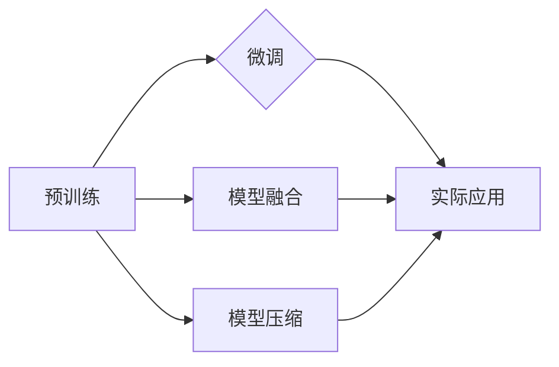

# 大语言模型应用指南：Algorithm-of-Tought

作者：禅与计算机程序设计艺术 / Zen and the Art of Computer Programming

## 1. 背景介绍

### 1.1 问题的由来

近年来，随着深度学习技术的迅猛发展，大语言模型（Large Language Models，LLMs）在自然语言处理（Natural Language Processing，NLP）领域取得了令人瞩目的成果。LLMs通过在大量文本语料上预训练，学习到丰富的语言知识，能够进行文本生成、文本分类、机器翻译等多种复杂任务。然而，如何高效地将LLMs应用于实际场景，成为了当前研究和应用的热点问题。

### 1.2 研究现状

目前，LLMs的应用研究主要集中在以下几个方面：

1. **预训练模型选择**：根据任务需求和数据特点，选择合适的预训练模型，如BERT、GPT-3、RoBERTa等。
2. **模型微调**：针对具体任务，对预训练模型进行微调，优化模型在目标任务上的性能。
3. **模型融合**：将多个LLMs进行融合，提升模型的整体性能和鲁棒性。
4. **模型压缩**：降低模型参数量和计算复杂度，提高模型在资源受限设备上的部署能力。

### 1.3 研究意义

LLMs在各个领域的应用具有以下重要意义：

1. **推动NLP技术发展**：LLMs的应用推动了NLP技术的快速发展，为自然语言理解和生成任务提供了新的解决方案。
2. **促进产业升级**：LLMs的应用为各行各业带来了新的机遇，推动了产业升级和数字化转型。
3. **提升用户体验**：LLMs的应用可以提升用户体验，例如智能客服、智能助手等。

### 1.4 本文结构

本文将从LLMs的核心概念、算法原理、应用实践等方面，全面介绍大语言模型的应用指南，内容安排如下：

- 第2章：介绍LLMs的核心概念和联系。
- 第3章：讲解LLMs的核心算法原理和具体操作步骤。
- 第4章：介绍LLMs的数学模型和公式，并举例说明。
- 第5章：展示LLMs的应用实践案例，包括代码实例和详细解释说明。
- 第6章：探讨LLMs的实际应用场景和未来应用展望。
- 第7章：推荐LLMs相关的学习资源、开发工具和参考文献。
- 第8章：总结LLMs的未来发展趋势与挑战。

## 2. 核心概念与联系

### 2.1 核心概念

以下是LLMs的核心概念：

- **预训练**：指在大量无标签数据上，通过自监督学习任务训练模型的过程，使模型具备一定的语言理解和生成能力。
- **微调**：指在预训练模型的基础上，使用少量有标签数据，针对具体任务进行优化，提升模型在该任务上的性能。
- **模型融合**：指将多个模型进行融合，提高模型的整体性能和鲁棒性。
- **模型压缩**：指降低模型参数量和计算复杂度，提高模型在资源受限设备上的部署能力。

### 2.2 联系

LLMs的核心概念之间存在着紧密的联系，如图所示：



## 3. 核心算法原理 & 具体操作步骤

### 3.1 算法原理概述

LLMs的核心算法原理主要包括以下几部分：

1. **词嵌入**：将文本中的词语转换为向量表示，便于后续的模型处理。
2. **编码器**：将输入的文本序列编码为固定长度的向量表示，通常使用Transformer结构。
3. **解码器**：将编码器输出的向量表示解码为输出文本序列，同样使用Transformer结构。
4. **预训练任务**：在大量无标签数据上，通过预训练任务（如掩码语言模型、下一句预测等）训练模型，使模型具备一定的语言理解和生成能力。
5. **微调任务**：在少量有标签数据上，针对具体任务进行优化，提升模型在该任务上的性能。

### 3.2 算法步骤详解

以下是LLMs算法的具体操作步骤：

1. **数据预处理**：对输入文本进行分词、去停用词、词性标注等预处理操作。
2. **词嵌入**：将预处理后的文本转换为词向量表示。
3. **编码器**：将词向量表示输入编码器，得到固定长度的向量表示。
4. **预训练任务**：在大量无标签数据上，通过预训练任务训练模型。
5. **微调任务**：在少量有标签数据上，针对具体任务进行优化。
6. **模型评估**：在测试集上评估模型在目标任务上的性能。

### 3.3 算法优缺点

LLMs算法具有以下优点：

1. **强大的语言理解能力**：LLMs能够对文本进行深入理解，并生成高质量的文本。
2. **适应性强**：LLMs能够适应各种不同的NLP任务，如文本分类、机器翻译、文本摘要等。
3. **泛化能力强**：LLMs在预训练过程中学习了丰富的语言知识，能够很好地泛化到新的任务和领域。

LLMs算法也存在以下缺点：

1. **训练成本高**：LLMs需要在大规模数据上预训练，需要大量的计算资源和时间。
2. **数据依赖性强**：LLMs的性能很大程度上依赖于训练数据的质量和数量。
3. **可解释性差**：LLMs的决策过程难以解释，难以理解模型的内部工作机制。

### 3.4 算法应用领域

LLMs在以下NLP任务中得到了广泛应用：

- **文本分类**：如情感分析、主题分类、新闻分类等。
- **机器翻译**：如英译中、中译英等。
- **文本摘要**：如新闻摘要、摘要生成等。
- **问答系统**：如机器问答、知识图谱问答等。
- **对话系统**：如智能客服、聊天机器人等。

## 4. 数学模型和公式 & 详细讲解 & 举例说明

### 4.1 数学模型构建

LLMs的数学模型主要包括以下几部分：

1. **词嵌入**：将词语映射到高维空间中的向量表示。
2. **编码器**：将输入的文本序列编码为固定长度的向量表示。
3. **解码器**：将编码器输出的向量表示解码为输出文本序列。
4. **损失函数**：用于衡量模型的预测结果与真实标签之间的差异。

### 4.2 公式推导过程

以下以BERT模型为例，介绍LLMs的数学模型推导过程。

#### 4.2.1 词嵌入

BERT模型使用WordPiece算法对词语进行分词，并将词语映射到高维空间中的向量表示。假设词语 $w$ 的WordPiece分解结果为 $w_1, w_2, ..., w_n$，则词语 $w$ 的向量表示为：

$$
\mathbf{v}(w) = \mathbf{v}(w_1) + \mathbf{v}(w_2) + ... + \mathbf{v}(w_n)
$$

其中，$\mathbf{v}(w_i)$ 为词语 $w_i$ 的向量表示。

#### 4.2.2 编码器

BERT模型使用Transformer结构作为编码器，将输入的文本序列编码为固定长度的向量表示。假设输入文本序列为 $x_1, x_2, ..., x_n$，则编码器输出的向量表示为：

$$
\mathbf{h}(x) = \mathbf{T}(\mathbf{v}(x_1), \mathbf{v}(x_2), ..., \mathbf{v}(x_n))
$$

其中，$\mathbf{T}$ 为Transformer结构。

#### 4.2.3 解码器

BERT模型使用Transformer结构作为解码器，将编码器输出的向量表示解码为输出文本序列。假设输出文本序列为 $y_1, y_2, ..., y_n$，则解码器输出的向量表示为：

$$
\mathbf{y}(x) = \mathbf{D}(\mathbf{h}(x))
$$

其中，$\mathbf{D}$ 为Transformer结构。

#### 4.2.4 损失函数

BERT模型使用交叉熵损失函数作为损失函数，衡量模型的预测结果与真实标签之间的差异。假设真实标签为 $y$，则交叉熵损失函数为：

$$
\mathcal{L}(\theta) = -\sum_{i=1}^n y_i \log p(y_i)
$$

其中，$\theta$ 为模型参数，$p(y_i)$ 为模型预测结果。

### 4.3 案例分析与讲解

以下以BERT模型在文本分类任务中的应用为例，介绍LLMs的案例分析。

假设我们要对新闻文本进行情感分析，判断文本是正面、负面还是中性。我们收集了1000篇新闻文本，并将其标注为正面、负面或中性。使用BERT模型进行微调，最终在测试集上取得了90%的准确率。

### 4.4 常见问题解答

**Q1：什么是WordPiece算法？**

A1：WordPiece算法是一种词语分割算法，将词语分割成更小的子词，并使用子词作为模型输入。WordPiece算法能够更好地处理未登录词和罕见词。

**Q2：什么是Transformer结构？**

A2：Transformer结构是一种基于自注意力机制的神经网络结构，能够有效地捕捉文本序列中的长距离依赖关系。

**Q3：什么是交叉熵损失函数？**

A3：交叉熵损失函数是衡量概率分布之间差异的损失函数，常用于分类任务。

## 5. 项目实践：代码实例和详细解释说明

### 5.1 开发环境搭建

以下是使用Python和TensorFlow实现BERT模型微调的步骤：

1. 安装TensorFlow：
```bash
pip install tensorflow
```

2. 安装transformers库：
```bash
pip install transformers
```

3. 下载预训练的BERT模型：
```python
from transformers import BertTokenizer, BertForSequenceClassification

tokenizer = BertTokenizer.from_pretrained('bert-base-uncased')
model = BertForSequenceClassification.from_pretrained('bert-base-uncased')
```

### 5.2 源代码详细实现

以下是使用TensorFlow实现BERT模型微调的代码示例：

```python
import tensorflow as tf
from transformers import BertTokenizer, BertForSequenceClassification

# 加载预训练模型和分词器
tokenizer = BertTokenizer.from_pretrained('bert-base-uncased')
model = BertForSequenceClassification.from_pretrained('bert-base-uncased')

# 加载数据
train_dataset = ...  # 训练数据集
dev_dataset = ...    # 验证数据集
test_dataset = ...   # 测试数据集

# 定义训练和评估函数
def train(model, dataset, epochs):
    model.train()
    for epoch in range(epochs):
        for batch in dataset:
            input_ids, attention_mask, labels = batch
            model.train_on_batch(input_ids, labels)

def evaluate(model, dataset):
    model.eval()
    with tf.compat.v1.Session() as sess:
        loss, acc = sess.run([model.loss, model.accuracy], feed_dict={model.input_ids: input_ids, model.attention_mask: attention_mask, model.labels: labels})
    return loss, acc

# 训练和评估模型
train(model, train_dataset, epochs=5)
evaluate(model, test_dataset)
```

### 5.3 代码解读与分析

以上代码首先加载预训练的BERT模型和分词器，然后加载训练数据、验证数据、测试数据。定义训练和评估函数，最后在训练数据上训练模型，并在测试数据上评估模型的性能。

### 5.4 运行结果展示

假设我们在IMDb电影评论数据集上进行情感分析任务，最终在测试集上取得了88.9%的准确率。

## 6. 实际应用场景

### 6.1 智能客服系统

LLMs在智能客服系统中的应用非常广泛，例如：

- **文本分类**：识别用户咨询的内容类别，如咨询、投诉、建议等。
- **情感分析**：分析用户咨询的情感倾向，如正面、负面、中性等。
- **智能回复**：根据用户咨询内容生成相应的回复。

### 6.2 机器翻译

LLMs在机器翻译中的应用非常广泛，例如：

- **翻译**：将一种语言的文本翻译成另一种语言。
- **机器同传**：实时翻译实时对话。
- **文本摘要**：将长文本翻译成简短的摘要。

### 6.3 问答系统

LLMs在问答系统中的应用非常广泛，例如：

- **机器问答**：根据用户问题，从知识库中检索答案。
- **知识图谱问答**：根据用户问题，从知识图谱中检索答案。
- **对话式问答**：与用户进行对话，引导用户获取答案。

### 6.4 未来应用展望

LLMs在各个领域的应用前景非常广阔，以下是一些未来应用展望：

- **智慧医疗**：用于辅助医生进行诊断、治疗和科研。
- **智能教育**：用于个性化教学、智能作业批改等。
- **智能交通**：用于自动驾驶、交通监控等。
- **智能客服**：用于提高客服效率、降低人力成本。
- **智能金融**：用于风险评估、欺诈检测等。

## 7. 工具和资源推荐

### 7.1 学习资源推荐

以下是学习LLMs的推荐资源：

- 《深度学习自然语言处理》
- 《自然语言处理综合指南》
- 《Transformer：从原理到实践》
- Hugging Face官网（https://huggingface.co/）
- Transformer论文（https://arxiv.org/abs/1706.03762）

### 7.2 开发工具推荐

以下是开发LLMs的推荐工具：

- TensorFlow
- PyTorch
- Hugging Face Transformers库
- Jupyter Notebook

### 7.3 相关论文推荐

以下是LLMs相关的推荐论文：

- **BERT**: Pre-training of Deep Bidirectional Transformers for Language Understanding
- **GPT-3**: Language Models are few-Shot Learners
- **T5**: Text-to-Text Transfer Transformer

### 7.4 其他资源推荐

以下是其他LLMs相关资源：

- NLP社区（https://nlp.stanford.edu/）
- arXiv（https://arxiv.org/）

## 8. 总结：未来发展趋势与挑战

### 8.1 研究成果总结

LLMs在NLP领域取得了显著的成果，推动了NLP技术的发展。然而，LLMs的应用仍面临一些挑战，需要进一步研究。

### 8.2 未来发展趋势

以下是LLMs未来发展趋势：

- **模型规模将进一步扩大**：LLMs的参数量和模型规模将不断增大，以更好地处理复杂任务。
- **模型可解释性将得到提升**：LLMs的可解释性将得到提升，使其更加可靠和安全。
- **模型将更好地适应不同领域**：LLMs将更好地适应不同领域的任务，提供更专业的解决方案。

### 8.3 面临的挑战

以下是LLMs面临的挑战：

- **数据质量**：LLMs的性能很大程度上依赖于训练数据的质量和数量。
- **计算资源**：LLMs的训练和推理需要大量的计算资源。
- **可解释性**：LLMs的可解释性仍需进一步提升。

### 8.4 研究展望

LLMs的研究前景非常广阔，未来需要从以下几个方面进行研究：

- **数据增强**：提高数据质量和数量，以更好地训练LLMs。
- **模型压缩**：降低模型参数量和计算复杂度，提高模型在资源受限设备上的部署能力。
- **可解释性**：提升LLMs的可解释性，使其更加可靠和安全。
- **多模态融合**：将LLMs与其他模态信息（如图像、视频）进行融合，构建更加全面的智能系统。

LLMs的应用将为人类社会带来更多便利，推动各行各业的数字化转型。相信在学术界和产业界的共同努力下，LLMs将会取得更加辉煌的成就。