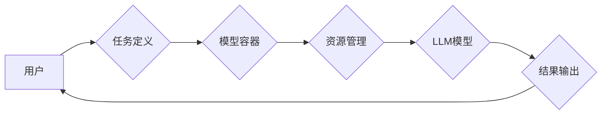

## 大语言模型操作系统LLM OS

> 关键词：大语言模型、操作系统、人工智能、软件架构、LLM应用

## 1. 背景介绍

近年来，大语言模型（LLM）的快速发展，为人工智能领域带来了革命性的变革。从文本生成、翻译到代码编写、问答系统，LLM展现出强大的能力，并逐渐渗透到各个领域。然而，现有的LLM应用大多局限于特定的任务和场景，缺乏灵活性和可扩展性。为了更好地利用LLM的潜力，并将其应用于更广泛的领域，我们需要构建一个专门针对LLM的运行环境——大语言模型操作系统（LLM OS）。

LLM OS的目标是提供一个统一的平台，用于管理、部署和执行各种LLM应用。它将提供以下关键功能：

* **模型管理:**  LLM OS将支持多种LLM模型的加载、存储和管理，并提供模型版本控制、权限管理等功能。
* **任务调度:**  LLM OS将提供任务调度机制，根据任务类型、优先级和资源需求，高效地分配LLM资源。
* **数据处理:**  LLM OS将提供数据预处理、清洗和转换等功能，方便用户将数据输入LLM模型进行处理。
* **结果输出:**  LLM OS将提供结果输出和可视化功能，帮助用户理解和分析LLM模型的输出结果。
* **扩展性:**  LLM OS将支持插件机制，方便用户扩展其功能，并集成其他人工智能工具和服务。

## 2. 核心概念与联系

LLM OS的核心概念包括：

* **模型容器:**  用于封装LLM模型及其依赖的运行环境，确保模型在不同平台和环境下都能正常运行。
* **任务定义:**  用于描述LLM应用的任务类型、输入数据、输出格式和执行策略。
* **资源管理:**  用于分配和管理LLM运行所需的计算资源、内存和存储空间。
* **通信机制:**  用于实现LLM模型与其他组件之间的通信，例如数据输入、结果输出和状态更新。

**Mermaid 流程图:**

## 3. 核心算法原理 & 具体操作步骤

### 3.1  算法原理概述

LLM OS的核心算法原理基于以下几个方面：

* **模型推理:**  LLM OS将采用高效的模型推理算法，例如量化、剪枝和并行计算，以提高LLM模型的运行速度和效率。
* **任务调度:**  LLM OS将采用先进的任务调度算法，例如优先级调度、轮询调度和动态资源分配，以优化LLM资源的利用率。
* **数据处理:**  LLM OS将采用数据流处理技术，将数据预处理、清洗和转换等操作进行流水线化处理，提高数据处理效率。

### 3.2  算法步骤详解

1. **用户提交任务:** 用户通过LLM OS的API或界面提交一个任务定义，包括任务类型、输入数据、输出格式和执行策略。
2. **任务调度:** LLM OS根据任务定义和资源可用情况，选择合适的模型容器和资源分配方案，并调度任务执行。
3. **模型推理:**  LLM OS加载模型容器，并启动LLM模型进行推理计算。
4. **数据处理:**  LLM OS将输入数据进行预处理、清洗和转换，并将其传递给LLM模型进行处理。
5. **结果输出:**  LLM OS接收模型输出结果，并将其转换为用户可理解的格式，并将其返回给用户。

### 3.3  算法优缺点

**优点:**

* **高效性:**  LLM OS采用高效的算法和技术，可以提高LLM模型的运行速度和效率。
* **可扩展性:**  LLM OS支持插件机制，可以方便地扩展其功能，并集成其他人工智能工具和服务。
* **灵活性:**  LLM OS支持多种LLM模型和任务类型，可以满足不同用户的需求。

**缺点:**

* **复杂性:**  LLM OS是一个复杂的系统，需要专业的技术人员进行开发和维护。
* **资源消耗:**  LLM模型的运行需要大量的计算资源，LLM OS需要高效地管理和分配这些资源。

### 3.4  算法应用领域

LLM OS可以应用于以下领域：

* **自然语言处理:**  文本生成、翻译、摘要、问答系统等。
* **代码生成:**  自动生成代码、代码修复、代码注释等。
* **数据分析:**  文本数据分析、情感分析、主题提取等。
* **个性化推荐:**  根据用户的兴趣和行为，推荐相关内容。

## 4. 数学模型和公式 & 详细讲解 & 举例说明

### 4.1  数学模型构建

LLM OS的核心算法可以抽象为一个数学模型，其中包括以下几个关键变量：

* **模型参数:**  LLM模型的参数向量，表示模型的知识和能力。
* **输入数据:**  用户提交的任务数据，例如文本、代码或其他格式的数据。
* **输出结果:**  LLM模型的预测结果，例如文本、代码或其他格式的数据。
* **损失函数:**  用于衡量模型预测结果与真实结果之间的差异。
* **优化算法:**  用于更新模型参数，使其能够更好地预测结果。

### 4.2  公式推导过程

LLM OS的训练过程可以概括为以下公式：

$$
\theta = \arg \min_{\theta} L(\theta, X, Y)
$$

其中：

* $\theta$ 表示模型参数向量。
* $L(\theta, X, Y)$ 表示损失函数，其中 $X$ 表示输入数据，$Y$ 表示真实结果。
* $\arg \min_{\theta}$ 表示寻找使损失函数最小化的模型参数向量。

### 4.3  案例分析与讲解

例如，在文本生成任务中，LLM OS可以采用交叉熵损失函数来衡量模型预测结果与真实文本之间的差异。

$$
L(p, y) = - \sum_{i=1}^{n} y_i \log p_i
$$

其中：

* $p$ 表示模型预测的文本概率分布。
* $y$ 表示真实文本的one-hot编码。
* $n$ 表示文本长度。

通过优化这个损失函数，LLM OS可以训练出一个能够生成高质量文本的LLM模型。

## 5. 项目实践：代码实例和详细解释说明

### 5.1  开发环境搭建

LLM OS的开发环境需要包含以下软件：

* **操作系统:**  Linux或macOS
* **编程语言:**  Python
* **深度学习框架:**  TensorFlow或PyTorch
* **容器技术:**  Docker

### 5.2  源代码详细实现

LLM OS的源代码实现可以参考以下开源项目：

* **Kubernetes:**  用于容器编排和管理。
* **TensorFlow Serving:**  用于部署和管理TensorFlow模型。
* **MLflow:**  用于机器学习模型管理和追踪。

### 5.3  代码解读与分析

LLM OS的源代码主要包含以下几个模块：

* **模型管理模块:**  负责加载、存储和管理LLM模型。
* **任务调度模块:**  负责调度LLM任务的执行。
* **数据处理模块:**  负责处理LLM模型的输入数据和输出结果。
* **通信模块:**  负责LLM模型与其他组件之间的通信。

### 5.4  运行结果展示

LLM OS的运行结果可以展示在以下几个方面：

* **任务执行时间:**  LLM OS可以记录和展示每个任务的执行时间。
* **资源利用率:**  LLM OS可以记录和展示LLM模型的资源利用率，例如CPU、内存和GPU的使用情况。
* **模型精度:**  LLM OS可以记录和展示LLM模型的预测精度。

## 6. 实际应用场景

LLM OS可以应用于以下实际场景：

* **智能客服:**  LLM OS可以训练一个能够理解用户问题并提供解决方案的智能客服机器人。
* **内容创作:**  LLM OS可以帮助作家、记者和营销人员生成高质量的文本内容。
* **代码自动完成:**  LLM OS可以帮助程序员自动完成代码编写，提高开发效率。
* **数据分析:**  LLM OS可以帮助分析师从海量文本数据中提取有价值的信息。

### 6.4  未来应用展望

随着LLM技术的不断发展，LLM OS的应用场景将更加广泛，例如：

* **个性化教育:**  LLM OS可以根据学生的学习情况提供个性化的学习内容和辅导。
* **医疗诊断:**  LLM OS可以帮助医生分析患者的病历和检查结果，提高诊断准确率。
* **科学研究:**  LLM OS可以帮助科学家分析实验数据，加速科研成果的产生。

## 7. 工具和资源推荐

### 7.1  学习资源推荐

* **OpenAI API:**  https://beta.openai.com/docs/api-reference/introduction
* **Hugging Face:**  https://huggingface.co/
* **TensorFlow Tutorials:**  https://www.tensorflow.org/tutorials

### 7.2  开发工具推荐

* **Docker:**  https://www.docker.com/
* **Kubernetes:**  https://kubernetes.io/
* **MLflow:**  https://mlflow.org/

### 7.3  相关论文推荐

* **BERT: Pre-training of Deep Bidirectional Transformers for Language Understanding**
* **GPT-3: Language Models are Few-Shot Learners**
* **T5: Text-to-Text Transfer Transformer**

## 8. 总结：未来发展趋势与挑战

### 8.1  研究成果总结

LLM OS是一个具有巨大潜力的技术，它可以帮助我们更好地利用LLM的潜力，并将其应用于更广泛的领域。

### 8.2  未来发展趋势

LLM OS的未来发展趋势包括：

* **模型效率提升:**  研究更有效的模型推理算法，降低LLM模型的计算成本。
* **安全性和隐私性增强:**  研究LLM模型的安全性和隐私性保护机制，防止模型被恶意利用。
* **多模态融合:**  将LLM与其他模态数据（例如图像、音频）融合，构建更强大的多模态模型。

### 8.3  面临的挑战

LLM OS的发展也面临着一些挑战：

* **模型规模和复杂性:**  LLM模型的规模和复杂性不断增加，这给模型训练、部署和管理带来了挑战。
* **数据获取和标注:**  LLM模型的训练需要大量的标注数据，数据获取和标注成本较高。
* **伦理和社会影响:**  LLM模型的应用可能带来一些伦理和社会问题，例如信息误导、偏见和就业问题。

### 8.4  研究展望

未来，我们将继续致力于LLM OS的研究和开发，努力解决上述挑战，并推动LLM技术在各个领域的应用。

## 9. 附录：常见问题与解答

**常见问题:**

* **LLM OS与现有操作系统有何区别？**

LLM OS专门针对LLM模型设计，提供模型管理、任务调度、数据处理等功能，而现有操作系统则更侧重于通用应用程序的运行。

* **LLM OS是否支持多种LLM模型？**

是的，LLM OS支持多种LLM模型的加载和管理。

* **LLM OS的安全性如何保证？**

LLM OS将采用多种安全机制，例如模型沙盒、权限控制和数据加密，保障模型和数据的安全。

**作者：禅与计算机程序设计艺术 / Zen and the Art of Computer Programming**