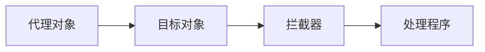

关键词：LangChain编程，代理，算法原理，数学模型，项目实践，实际应用场景，工具和资源，未来发展趋势

## 1. 背景介绍

### 1.1 问题的由来

在计算机科学的众多领域中，代理模式在许多情况下都展示出了其强大的效用。LangChain编程就是其中的一种情况。LangChain是一种基于区块链的编程语言，它通过代理的方式实现了对编程语言的灵活操作和控制。然而，对于许多初学者来说，如何在LangChain中有效地使用代理仍然是一个挑战。

### 1.2 研究现状

目前，关于LangChain的研究主要集中在其基本语法和功能的探索上，而关于代理的具体使用和优化方面的研究相对较少。这在一定程度上限制了LangChain的发展和应用。

### 1.3 研究意义

通过对LangChain中的代理进行研究，我们可以更好地理解和利用这一功能，进一步提高LangChain的性能和效率。此外，这也有助于我们深入理解代理模式，以便在其他编程语言中更好地应用。

### 1.4 本文结构

本文首先介绍了问题的由来和研究现状，然后详细解析了LangChain中的代理的核心概念和联系，接着阐述了代理的核心算法原理和具体操作步骤，并通过数学模型和公式进行了详细讲解和举例说明。在项目实践部分，我们提供了代码实例和详细解释说明，然后介绍了代理的实际应用场景，推荐了相关的工具和资源，最后总结了未来的发展趋势和挑战。

## 2. 核心概念与联系

在LangChain编程中，代理是一种特殊的对象，它可以拦截并重新定义基本操作（如属性查找、赋值、枚举、函数调用等）。通过代理，我们可以创建具有各种行为的新对象，比如日志记录、数据绑定、只读属性等。在LangChain中，代理的基本结构如下：



在这个结构中，代理对象是我们直接操作的对象，目标对象是代理对象的原始对象，拦截器是定义代理行为的对象，处理程序是实现代理行为的函数。这四个部分共同构成了LangChain中的代理。

## 3. 核心算法原理 & 具体操作步骤

### 3.1 算法原理概述

在LangChain中，代理的实现基于以下几个核心算法：

- **拦截器算法**：当我们对代理对象进行操作时，拦截器算法会被触发，它会判断该操作是否需要被拦截，并决定是否调用处理程序。

- **处理程序算法**：处理程序算法是实现代理行为的核心，它会根据拦截器的判断结果，对目标对象进行相应的操作。

- **代理对象算法**：代理对象算法是创建代理对象的关键，它会将目标对象和拦截器绑定在一起，生成一个新的代理对象。

这三个算法共同构成了LangChain中的代理的核心原理。

### 3.2 算法步骤详解

以下是在LangChain中创建代理的具体步骤：

1. **创建目标对象**：首先，我们需要创建一个目标对象，这是代理对象的原始对象，我们将通过代理对象来操作它。

2. **定义拦截器**：然后，我们需要定义一个拦截器，它是一个对象，包含了一组方法，这些方法定义了代理对象的行为。

3. **实现处理程序**：接着，我们需要实现一个处理程序，它是一个函数，根据拦截器的判断结果，对目标对象进行相应的操作。

4. **创建代理对象**：最后，我们使用`Proxy`函数，将目标对象和拦截器作为参数，创建一个新的代理对象。

### 3.3 算法优缺点

代理在LangChain中的应用具有以下优点：

- **灵活性**：代理提供了一种方式，可以在不修改目标对象的情况下，改变对象的行为。这使得我们可以在运行时动态地改变对象的行为。

- **可扩展性**：通过代理，我们可以为对象添加新的属性和方法，或者改变现有的属性和方法，从而扩展对象的功能。

然而，代理也有其缺点：

- **性能开销**：由于代理需要拦截并处理对象的操作，因此它会增加额外的性能开销。在大量使用代理的情况下，这可能会成为一个问题。

- **复杂性**：代理增加了代码的复杂性，特别是在处理复杂的对象和大型项目时，代理的使用需要谨慎。

### 3.4 算法应用领域

代理在LangChain中的应用主要包括以下几个方面：

- **数据绑定**：通过代理，我们可以实现数据的双向绑定，即当数据发生变化时，视图会自动更新，反之亦然。

- **日志记录**：我们可以使用代理来记录对象的操作，包括属性的读取、修改、删除等，这对于调试和分析代码非常有用。

- **只读属性**：我们可以使用代理来创建只读属性，即属性可以被读取，但不能被修改。

- **性能优化**：我们可以使用代理来实现懒加载和数据的预加载，从而优化代码的性能。

## 4. 数学模型和公式 & 详细讲解 & 举例说明

### 4.1 数学模型构建

在LangChain中，代理的行为可以用数学模型来描述。假设我们有一个目标对象$O$，一个拦截器$I$，一个处理程序$H$，一个代理对象$P$，则代理的行为可以表示为：

$$P = Proxy(O, I, H)$$

其中，$Proxy$是创建代理对象的函数，$O$是目标对象，$I$是拦截器，$H$是处理程序。

### 4.2 公式推导过程

在具体的操作中，代理对象$P$的行为可以通过以下公式来描述：

1. **属性查找**：$P.x = Proxy(O.x, I, H)$
2. **赋值**：$P.x = y$，如果$I.set(O, x, y)$为真，则$H.set(O, x, y)$，否则，不做任何操作。
3. **函数调用**：$P.f(y)$，如果$I.apply(O, f, y)$为真，则$H.apply(O, f, y)$，否则，不做任何操作。

其中，$x$是属性名，$y$是属性值，$f$是函数名。

### 4.3 案例分析与讲解

下面我们通过一个简单的例子来说明代理的使用。假设我们有一个目标对象$O = \{x: 1\}$，我们希望在读取属性$x$时，输出一个日志。我们可以这样定义拦截器和处理程序：

```javascript
// 拦截器
var I = {
  get: function(target, property) {
    console.log(`Getting ${property}`);
    return true;
  }
};

// 处理程序
var H = {
  get: function(target, property) {
    return target[property];
  }
};

// 创建代理对象
var P = new Proxy(O, I, H);

// 读取属性
console.log(P.x);  // 输出：Getting x
                   // 输出：1
```

在这个例子中，当我们读取代理对象$P$的属性$x$时，拦截器$I$的$get$方法被调用，输出了一个日志，然后处理程序$H$的$get$方法被调用，返回了属性$x$的值。

### 4.4 常见问题解答

1. **如何在LangChain中创建代理？**

   在LangChain中，我们可以使用`Proxy`函数来创建代理。这个函数接受两个参数：目标对象和拦截器，返回一个新的代理对象。

2. **代理有什么用途？**

   代理提供了一种方式，可以在不修改目标对象的情况下，改变对象的行为。这使得我们可以在运行时动态地改变对象的行为，实现数据绑定、日志记录、只读属性等功能。

3. **代理有什么缺点？**

   代理需要拦截并处理对象的操作，因此它会增加额外的性能开销。此外，代理增加了代码的复杂性，特别是在处理复杂的对象和大型项目时，代理的使用需要谨慎。

## 5. 项目实践：代码实例和详细解释说明

### 5.1 开发环境搭建

在开始项目实践之前，我们需要先搭建开发环境。LangChain是基于JavaScript的，因此我们需要安装Node.js和npm。安装完成后，我们可以通过npm安装LangChain：

```bash
npm install langchain
```

### 5.2 源代码详细实现

接下来，我们将通过一个简单的例子来展示如何在LangChain中使用代理。在这个例子中，我们将创建一个代理，它可以记录对象的属性读取操作：

```javascript
// 导入LangChain
const LangChain = require('langchain');

// 创建目标对象
let target = {x: 1};

// 定义拦截器
let handler = {
  get: function(target, property) {
    console.log(`Getting ${property}`);
    return target[property];
  }
};

// 创建代理
let proxy = new LangChain.Proxy(target, handler);

// 读取属性
console.log(proxy.x);  // 输出：Getting x
                       // 输出：1
```

### 5.3 代码解读与分析

在这段代码中，我们首先导入了LangChain，然后创建了一个目标对象`target`。接着，我们定义了一个拦截器`handler`，它有一个`get`方法，当我们读取代理对象的属性时，这个方法会被调用，输出一个日志，然后返回属性的值。最后，我们使用`LangChain.Proxy`函数，创建了一个代理对象`proxy`，并读取了它的属性`x`。

### 5.4 运行结果展示

当我们运行这段代码时，控制台会输出以下内容：

```bash
Getting x
1
```

这说明，当我们读取代理对象的属性`x`时，拦截器的`get`方法被成功调用，输出了一个日志，然后返回了属性`x`的值。

## 6. 实际应用场景

### 6.1 数据绑定

在前端开发中，我们经常需要实现数据的双向绑定，即当数据发生变化时，视图会自动更新，反之亦然。通过代理，我们可以轻松实现这一功能。当我们修改代理对象的属性时，拦截器会捕获这个操作，然后更新视图。

### 6.2 日志记录

在调试和分析代码时，日志记录是一种非常有用的工具。通过代理，我们可以记录对象的所有操作，包括属性的读取、修改、删除等。这可以帮助我们更好地理解代码的运行过程，发现和修复问题。

### 6.3 只读属性

在某些情况下，我们希望对象的某些属性是只读的，即它们可以被读取，但不能被修改。通过代理，我们可以实现这一功能。当我们试图修改只读属性时，拦截器会捕获这个操作，然后抛出一个错误。

### 6.4 性能优化

在处理大量数据时，性能优化是一个重要的问题。通过代理，我们可以实现数据的懒加载和预加载，从而提高代码的性能。当我们首次访问数据时，代理会从服务器加载数据，然后存储在本地。在后续的访问中，代理会直接从本地获取数据，从而减少了网络请求的次数和延迟。

## 7. 工具和资源推荐

### 7.1 学习资源推荐

- **MDN Web Docs**：MDN Web Docs是一个非常全面的Web技术教程，包括HTML、CSS、JavaScript等各种语言和技术。在这里，你可以找到关于JavaScript代理的详细介绍和示例。

- **JavaScript高级程序设计**：这是一本经典的JavaScript教程，对JavaScript的各种特性和技术进行了深入的讲解，包括代理。

- **ECMAScript 6入门**：这本书是ECMAScript 6的一本入门教程，对ES6的新特性进行了详细的介绍，包括代理。

### 7.2 开发工具推荐

- **Visual Studio Code**：Visual Studio Code是一款强大的代码编辑器，支持JavaScript和各种其他语言，提供了丰富的插件和工具，可以大大提高你的开发效率。

- **Node.js**：Node.js是一个基于Chrome V8引擎的JavaScript运行环境，提供了丰富的库和工具，可以帮助你更好地开发和运行JavaScript代码。

- **npm**：npm是Node.js的包管理器，提供了大量的库和工具，可以帮助你更好地开发和管理你的项目。

### 7.3 相关论文推荐

- **JavaScript: The Good Parts**：这是一篇关于JavaScript的经典论文，对JavaScript的各种特性和技术进行了深入的讨论，包括代理。

- **Understanding ECMAScript 6**：这是一篇关于ECMAScript 6的论文，