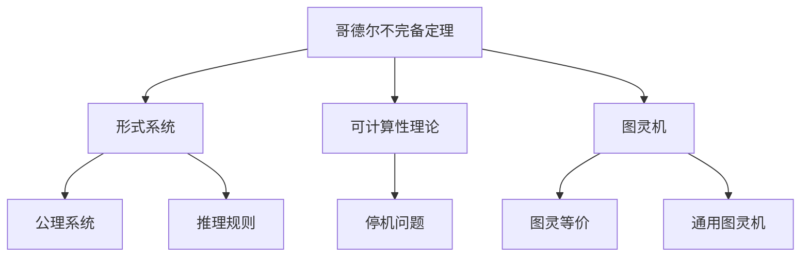
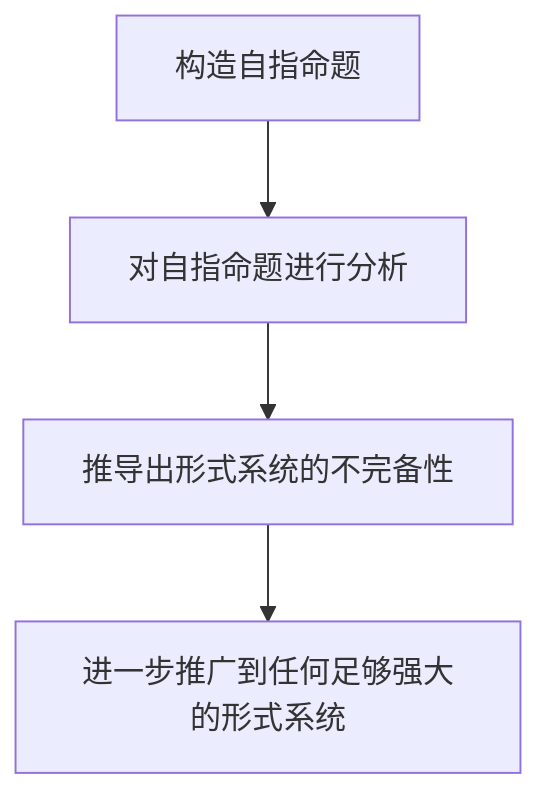

# 计算：第三部分 计算理论的形成 第 7 章 计算不能做什么：终结者哥德尔

## 1. 背景介绍

### 1.1 问题的由来

在计算理论的发展历程中,一个根本性的问题一直困扰着数学家和计算机科学家:计算机或任何形式的计算系统是否存在某些无法解决的问题?换句话说,是否存在某些问题超出了计算机的能力范围?这个看似简单的问题,实际上揭示了计算理论的一个核心悖论。

在20世纪初,数学家和逻辑学家们致力于将数学形式化,试图用一套公理和推理规则来构建一个完备的形式系统,使得所有的数学命题都可以在该系统中被证明或被否证。然而,这一努力遇到了一个重大障碍——哥德尔不完备定理(Gödel's Incompleteness Theorems)。

### 1.2 研究现状

哥德尔不完备定理由著名逻辑学家库尔特·哥德尔(Kurt Gödel)在1931年提出,它震惊了整个数学界。这一定理表明,在任何足够强大的形式系统中,都会存在某些命题无法被证明或被否证。换言之,形式系统中总会存在一些"真理",但这些真理无法在系统内被推导出来。

哥德尔不完备定理不仅影响了数学基础理论的发展,也对计算理论产生了深远的影响。它暗示了计算机或任何计算系统都存在某些无法解决的问题,即使这些问题看起来非常简单。这一发现被视为计算理论的一个里程碑,也被称为"终结者哥德尔"(Gödel the Terminator)。

### 1.3 研究意义

哥德尔不完备定理的意义在于,它揭示了计算的内在局限性。尽管计算机的计算能力日益强大,但总会存在一些问题超出了它们的能力范围。这一发现不仅具有理论意义,也对实际应用产生了影响。

在软件开发、人工智能、密码学等领域,我们需要了解计算的局限性,以避免追求不可能实现的目标。同时,哥德尔不完备定理也为我们提供了一种新的思考角度,促使我们重新审视计算的本质和边界。

### 1.4 本文结构

本文将从以下几个方面深入探讨哥德尔不完备定理及其对计算理论的影响:

1. 核心概念与联系
2. 核心算法原理与具体操作步骤
3. 数学模型和公式详细讲解与举例说明
4. 项目实践:代码实例和详细解释说明
5. 实际应用场景
6. 工具和资源推荐
7. 总结:未来发展趋势与挑战
8. 附录:常见问题与解答

## 2. 核心概念与联系

哥德尔不完备定理是计算理论的核心概念,它与形式系统、可计算性理论和图灵机等概念密切相关。

1. **形式系统**:形式系统是一种由公理系统和推理规则构成的数学体系,旨在用形式化的方式来描述和推理数学对象。哥德尔不完备定理揭示了形式系统的局限性,即在任何足够强大的形式系统中,都会存在无法被证明或被否证的命题。

2. **可计算性理论**:可计算性理论研究计算机能够解决哪些问题,以及计算问题的复杂性。哥德尔不完备定理表明,存在一些问题是不可计算的,即无法通过任何算法来解决。这为可计算性理论奠定了基础。

3. **图灵机**:图灵机是一种抽象的计算模型,被认为是最基本的计算机模型。哥德尔不完备定理与图灵机的概念密切相关,因为它揭示了图灵机的计算能力的局限性。同时,图灵机的概念也被用于证明哥德尔不完备定理。

4. **停机问题**:停机问题是一个著名的不可判定问题,它问题是否存在一个算法可以判断任意程序在任意输入下是否会终止。哥德尔不完备定理暗示了停机问题是不可判定的,这对于理解计算机程序的局限性具有重要意义。

5. **图灵等价**:图灵等价是指两个计算模型具有相同的计算能力,即它们可以计算的函数集合相同。哥德尔不完备定理表明,所有图灵等价的计算模型都存在相同的计算局限性。

6. **通用图灵机**:通用图灵机是一种可以模拟任何其他图灵机的图灵机。它体现了计算机的通用性,但同时也继承了图灵机的计算局限性,因此也受到哥德尔不完备定理的约束。

总的来说,哥德尔不完备定理是计算理论的核心概念,它与形式系统、可计算性理论、图灵机等概念密切相关,揭示了计算的内在局限性,对整个计算理论产生了深远的影响。

## 3. 核心算法原理与具体操作步骤

### 3.1 算法原理概述

哥德尔不完备定理的核心算法原理是基于对角线论证(Diagonalization Argument)和自指命题(Self-Referential Statements)的巧妙运用。

1. **对角线论证**:对角线论证是一种数学证明技巧,它通过构造一个对角线元素来证明集合的不可数性或者某些函数的不存在性。哥德尔借助对角线论证来证明形式系统中存在不可判定的命题。

2. **自指命题**:自指命题是一种特殊的语句,它描述了自身的某些属性。哥德尔巧妙地构造了一个自指命题,这个命题描述了它自身在形式系统中是不可证明的。通过对这个自指命题进行分析,哥德尔得出了形式系统的不完备性。

### 3.2 算法步骤详解

哥德尔不完备定理的证明过程可以概括为以下几个步骤:

1. **构造自指命题**:哥德尔首先构造了一个自指命题,这个命题描述了它自身在形式系统中是不可证明的。具体来说,他将形式系统中的每个语句编码为一个数字,然后构造一个语句,它的含义是"这个语句在形式系统中是不可证明的"。

2. **对自指命题进行分析**:接下来,哥德尔对这个自指命题进行了分析。如果这个自指命题在形式系统中是可证明的,那么它就描述了一个错误的事实,因为它声称自己是不可证明的。反之,如果这个自指命题在形式系统中是不可证明的,那么它就描述了一个正确的事实,但这个正确的事实无法在形式系统中被证明。

3. **推导出形式系统的不完备性**:通过上述分析,哥德尔得出了形式系统的不完备性。无论这个自指命题是真是假,都会导致形式系统存在一个命题无法被证明或被否证。

4. **进一步推广**:最后,哥德尔进一步推广了这一结论,证明了任何足够强大的形式系统都存在不可判定的命题,从而得出了著名的哥德尔不完备定理。

### 3.3 算法优缺点

哥德尔不完备定理的证明算法具有以下优点:

1. **巧妙性**:算法利用了对角线论证和自指命题这两种巧妙的技巧,展现了哥德尔的数学天赋和创造力。

2. **简洁性**:尽管证明过程涉及了一些技术细节,但整体算法思路非常简洁,易于理解和推广。

3. **普适性**:算法的结论不仅适用于特定的形式系统,而是适用于任何足够强大的形式系统,具有广泛的适用性。

然而,该算法也存在一些缺点:

1. **抽象性**:算法涉及了一些抽象的数学概念,如形式系统、编码等,对于非数学背景的读者可能难以完全理解。

2. **局限性**:算法只能证明形式系统的不完备性,但无法提供解决方案或者构造出所有不可判定的命题。

3. **技术性**:算法的证明过程涉及一些技术细节,如对角线论证的具体构造方法等,需要一定的数学基础才能完全掌握。

### 3.4 算法应用领域

哥德尔不完备定理的证明算法虽然是一种纯数学算法,但它的影响却远远超出了数学领域。该算法的结论对以下领域产生了深远的影响:

1. **计算机科学**:哥德尔不完备定理揭示了计算机程序的内在局限性,为可计算性理论奠定了基础。它也影响了编程语言的设计和程序验证等领域。

2. **人工智能**:哥德尔不完备定理表明,存在一些问题是不可计算的,这对于人工智能系统的能力设置了一个理论上的限制。

3. **密码学**:哥德尔不完备定理的思想被应用于密码学中,用于证明某些密码系统的安全性。

4. **逻辑学**:哥德尔不完备定理对逻辑学的发展产生了深远的影响,促进了非经典逻辑等新领域的兴起。

5. **数学基础理论**:哥德尔不完备定理彻底改变了数学家对于数学基础的看法,促进了新的数学基础理论的发展。

总的来说,哥德尔不完备定理的证明算法虽然源于纯数学,但它的影响已经远远超出了数学领域,对计算机科学、人工智能、密码学等多个领域产生了深远的影响。

## 4. 数学模型和公式详细讲解与举例说明

### 4.1 数学模型构建

为了证明哥德尔不完备定理,我们需要构建一个数学模型来形式化描述形式系统和自指命题。这个数学模型包括以下几个关键部分:

1. **形式语言**:我们需要定义一种形式语言,用于表示形式系统中的语句。通常使用一阶逻辑语言或者算术语言。

2. **公理系统**:定义形式系统的公理系统,即一组被视为真理的基本语句。

3. **推理规则**:定义形式系统的推理规则,用于从已知的真理推导出新的真理。

4. **编码函数**:为了构造自指命题,我们需要一种编码函数,将形式语言中的语句映射为自然数。

5. **自指命题**:利用编码函数,构造一个自指命题,描述它自身在形式系统中是不可证明的。

通过这个数学模型,我们可以将形式系统和自指命题形式化描述,为证明哥德尔不完备定理奠定基础。

### 4.2 公式推导过程

在构建了数学模型之后,我们可以通过一系列的公式推导来证明哥德尔不完备定理。这个推导过程可以概括为以下几个步骤:

1. **定义编码函数**:

   设 $\varphi$ 是一个将形式语言中的语句映射为自然数的编码函数,即 $\varphi: \text{Statements} \rightarrow \mathbb{N}$。

2. **构造自指命题**:

   定义一个谓词 $\text{Prov}(x)$,表示语句 $x$ 在形式系统中是可证明的。我们可以构造一个自指命题 $G$,它的含义是"$G$ 在形式系统中是不可证明的"。用公式表示为:

   $$G \equiv \neg\text{Prov}(\varphi(G))$$

3. **分析自指命题**:

   对自指命题 $G$