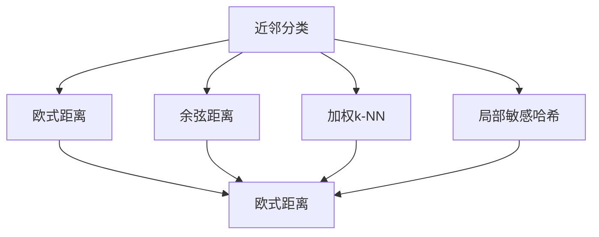
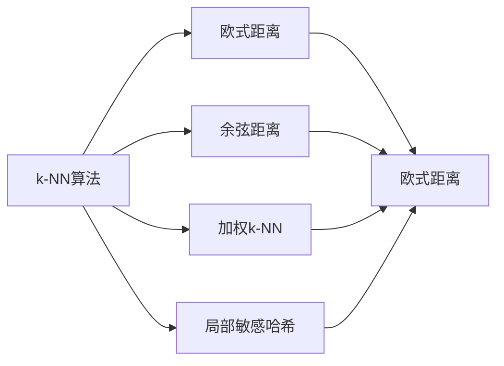
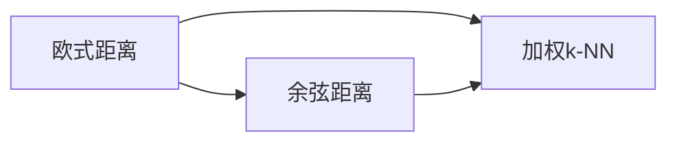
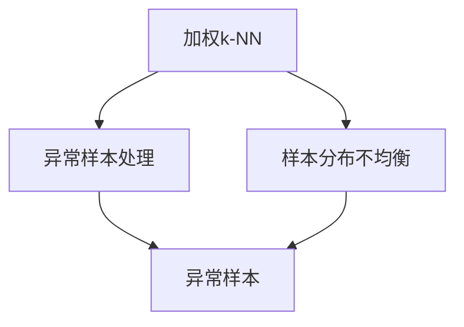
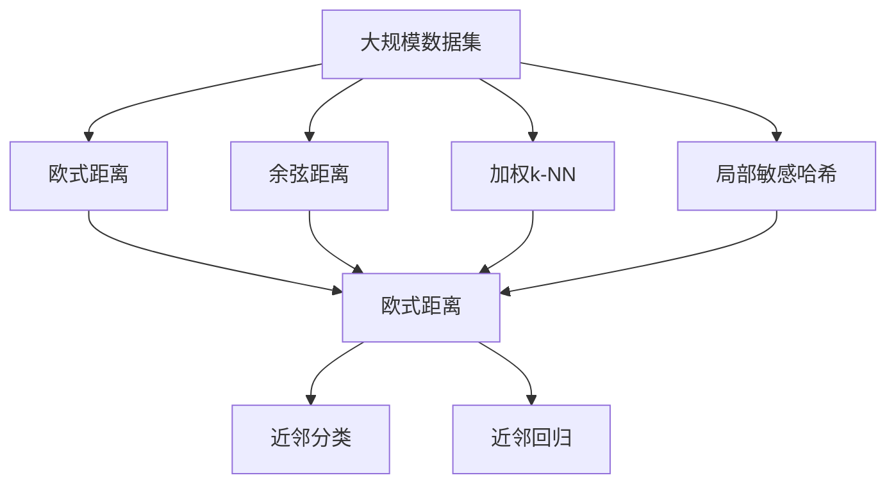

                 

# k-近邻算法(k-Nearest Neighbors) - 原理与代码实例讲解

## 1. 背景介绍

### 1.1 问题由来

k-近邻算法（k-Nearest Neighbors, k-NN）是一种基于实例的分类与回归算法，其思想简单且易于实现。它通过计算样本间的距离（或相似度），将新样本归为与它距离最近的k个训练样本中的多数类别。k-NN算法在模式识别、图像识别、推荐系统等领域有着广泛的应用。

然而，由于其简单性和高效性，k-NN算法也存在一些局限性。如对噪声和异常值敏感，样本分布不均衡时性能下降，无法处理高维数据等。针对这些问题，研究者们提出了许多改进方法，如加权k-NN、局部敏感哈希等。

### 1.2 问题核心关键点

k-NN算法的研究核心点包括：
1. 距离度量：如何选择合适的距离度量方法，如欧式距离、余弦距离等。
2. 参数k的选择：k值的大小对算法性能有重要影响。
3. 样本权重：如何处理样本权重，提高算法的鲁棒性和准确性。
4. 算法优化：如何优化算法性能，加速计算速度。
5. 算法适用性：k-NN算法在哪些场景下适用，如何处理复杂问题。

这些核心点决定了k-NN算法的应用效果和优化方向。

### 1.3 问题研究意义

研究k-NN算法，对于理解基于实例的分类和回归方法，掌握距离度量、权重处理、算法优化等基本技术，具有重要意义。k-NN算法简单高效，易于理解实现，是机器学习初学者入门的好选择。

此外，k-NN算法在推荐系统、图像分类、文本分类等领域也有广泛应用，能够提高数据挖掘和分析的效率。通过研究k-NN算法，可以深入理解数据挖掘的基本思想，为解决实际问题提供有力工具。

## 2. 核心概念与联系

### 2.1 核心概念概述

为更好地理解k-NN算法，本节将介绍几个密切相关的核心概念：

- 近邻分类（Nearest Neighbor Classification）：通过计算样本间的距离，将新样本归为与它距离最近的k个训练样本中的多数类别。
- 近邻回归（Nearest Neighbor Regression）：通过计算样本间的距离，将新样本的预测值，设为与其距离最近的k个训练样本的预测值的中值、平均值或加权平均值。
- 欧式距离（Euclidean Distance）：基于样本坐标的欧几里得距离，计算简单但受样本维度的影响较大。
- 余弦距离（Cosine Distance）：基于样本向量的余弦夹角，适用于高维空间。
- 加权k-NN（Weighted k-NN）：给每个样本赋予一个权重，综合考虑样本的重要性，提高算法的鲁棒性和准确性。
- 局部敏感哈希（Locality-Sensitive Hashing, LSH）：一种高效的k-NN算法优化方法，通过哈希函数将样本映射到低维空间，加速近邻查询。

这些核心概念之间的逻辑关系可以通过以下Mermaid流程图来展示：



这个流程图展示了大邻算法中各个核心概念的关系和作用。

### 2.2 概念间的关系

这些核心概念之间存在着紧密的联系，形成了k-NN算法的完整框架。下面我们通过几个Mermaid流程图来展示这些概念之间的关系。

#### 2.2.1 k-NN算法的学习范式



这个流程图展示了大邻算法的基本原理，即通过距离度量将新样本归为与它距离最近的k个训练样本中的多数类别。

#### 2.2.2 距离度量与样本权重的关系



这个流程图展示了距离度量和样本权重的关系。加权k-NN算法是在欧式或余弦距离度量的基础上，给每个样本赋予不同的权重，提高算法的鲁棒性。

#### 2.2.3 样本权重的应用场景



这个流程图展示了加权k-NN算法在异常样本处理和样本分布不均衡中的应用场景。通过给样本赋予不同的权重，可以避免异常值的影响，提升算法对样本分布不均衡的鲁棒性。

### 2.3 核心概念的整体架构

最后，我们用一个综合的流程图来展示这些核心概念在大邻算法中的整体架构：



这个综合流程图展示了从数据集处理到最终分类的完整过程。大邻算法首先对大规模数据集进行距离度量，然后使用加权k-NN或局部敏感哈希等优化方法，进行样本选择和权重处理。最终通过近邻分类或近邻回归，得到新样本的分类或回归值。

## 3. 核心算法原理 & 具体操作步骤
### 3.1 算法原理概述

k-NN算法的基本思想是：假设样本在空间中距离越近，则相似度越高。基于这个假设，k-NN算法将新样本归为与它距离最近的k个训练样本中的多数类别。

k-NN算法的数学模型如下：
假设训练集为$D = \{(x_1, y_1), (x_2, y_2), ..., (x_n, y_n)\}$，其中$x_i \in \mathbb{R}^d$为样本向量，$y_i \in \{c_1, c_2, ..., c_m\}$为样本类别标签。新样本$x$的距离度量函数为$d(x, x_i)$，距离排序后的样本集合为$\{x_{i_1}, x_{i_2}, ..., x_{i_k}\}$。

对于分类问题，$k$-NN算法的预测公式为：
$$
y = \text{arg}\min\limits_{i=1, ..., k} d(x, x_i) \quad (1)
$$

对于回归问题，$k$-NN算法的预测公式为：
$$
y = \frac{1}{k}\sum\limits_{i=1}^k f(x_i, y_i) \quad (2)
$$

其中$f(x_i, y_i)$为回归函数，如线性回归、多项式回归等。

### 3.2 算法步骤详解

基于k-NN算法，通常包括以下几个关键步骤：

**Step 1: 准备数据集**
- 收集样本数据，并进行预处理，如归一化、特征选择等。
- 将样本分为训练集和测试集，并进行标签编码。

**Step 2: 选择距离度量方法**
- 选择合适的距离度量方法，如欧式距离、余弦距离等。
- 根据样本特征，选择或设计距离度量函数。

**Step 3: 确定参数k**
- 确定合适的k值，一般选择k为样本数量的平方根。
- 根据不同场景和需求，尝试不同的k值，选择效果最优的k值。

**Step 4: 训练模型**
- 对训练集进行距离计算，排序后选择距离最小的k个样本。
- 计算k个样本的平均标签，进行分类或回归预测。

**Step 5: 评估模型**
- 在测试集上评估模型的性能，如准确率、召回率、F1分数等。
- 进行交叉验证，调整模型参数，提高模型泛化能力。

### 3.3 算法优缺点

k-NN算法的优点包括：
1. 简单易实现，易于理解。
2. 适合处理多分类问题，分类准确率高。
3. 可解释性强，易于解释和调试。

k-NN算法的缺点包括：
1. 对样本分布敏感，容易受到噪声和异常值的影响。
2. 计算复杂度高，需要存储所有样本和计算距离。
3. 无法处理高维数据，维度增加会导致计算复杂度指数级增加。

### 3.4 算法应用领域

k-NN算法广泛应用于分类和回归任务，尤其是在样本分布不均衡、噪声干扰严重等场景下表现优异。以下是k-NN算法在实际应用中的几个典型领域：

- 图像分类：将图像特征向量作为样本，计算距离后进行分类。
- 推荐系统：将用户行为特征作为样本，计算距离后进行推荐。
- 文本分类：将文本特征向量作为样本，计算距离后进行分类。
- 金融风险评估：将客户信息作为样本，计算距离后进行风险评估。
- 医疗诊断：将患者症状作为样本，计算距离后进行诊断。

## 4. 数学模型和公式 & 详细讲解 & 举例说明

### 4.1 数学模型构建

本节将使用数学语言对k-NN算法进行更加严格的刻画。

假设训练集为$D = \{(x_1, y_1), (x_2, y_2), ..., (x_n, y_n)\}$，其中$x_i \in \mathbb{R}^d$为样本向量，$y_i \in \{c_1, c_2, ..., c_m\}$为样本类别标签。新样本$x$的距离度量函数为$d(x, x_i)$，距离排序后的样本集合为$\{x_{i_1}, x_{i_2}, ..., x_{i_k}\}$。

对于分类问题，$k$-NN算法的预测公式为：
$$
y = \text{arg}\min\limits_{i=1, ..., k} d(x, x_i) \quad (1)
$$

对于回归问题，$k$-NN算法的预测公式为：
$$
y = \frac{1}{k}\sum\limits_{i=1}^k f(x_i, y_i) \quad (2)
$$

其中$f(x_i, y_i)$为回归函数，如线性回归、多项式回归等。

### 4.2 公式推导过程

以下我们以欧式距离为例，推导k-NN算法的具体实现步骤。

**欧式距离**：假设样本$x_i = (x_{i1}, x_{i2}, ..., x_{id})$和$x = (x_1, x_2, ..., x_d)$，欧式距离$d(x, x_i)$定义为：
$$
d(x, x_i) = \sqrt{\sum\limits_{j=1}^d (x_j - x_{ij})^2} = \sqrt{\sum\limits_{j=1}^d (x_j - \bar{x}_i)^2} \quad (3)
$$

其中$\bar{x}_i = \frac{1}{d}\sum\limits_{j=1}^d x_{ij}$为样本$x_i$的均值。

**加权k-NN算法**：假设样本$x_i$的权重为$w_i$，则加权k-NN算法的预测公式为：
$$
y = \text{arg}\min\limits_{i=1, ..., k} d(x, x_i) \times w_i \quad (4)
$$

其中$w_i = \frac{1}{\sum\limits_{j=1}^n w_j}$为样本的权重归一化。

**局部敏感哈希（LSH）**：假设哈希函数$H(\cdot)$将样本映射到$M$维哈希空间，$M$远小于样本维度$d$。则LSH算法将样本集合$\{x_1, x_2, ..., x_n\}$分成$B$个哈希桶，每个桶包含$m$个样本。新样本$x$的k-NN查询步骤如下：
1. 将样本$x$哈希到哈希桶$h(x)$。
2. 在桶$h(x)$中，选择距离最近的$k$个样本。
3. 计算$k$个样本的平均标签，进行分类或回归预测。

## 5. 项目实践：代码实例和详细解释说明
### 5.1 开发环境搭建

在进行k-NN实践前，我们需要准备好开发环境。以下是使用Python进行Scikit-learn开发的环境配置流程：

1. 安装Anaconda：从官网下载并安装Anaconda，用于创建独立的Python环境。

2. 创建并激活虚拟环境：
```bash
conda create -n sklearn-env python=3.8 
conda activate sklearn-env
```

3. 安装Scikit-learn：
```bash
pip install scikit-learn
```

4. 安装其他常用工具包：
```bash
pip install numpy pandas matplotlib seaborn jupyter notebook ipython
```

完成上述步骤后，即可在`sklearn-env`环境中开始k-NN实践。

### 5.2 源代码详细实现

下面我们以Iris数据集为例，给出使用Scikit-learn对k-NN算法进行分类的PyTorch代码实现。

首先，定义数据处理函数：

```python
import numpy as np
from sklearn import datasets
from sklearn.model_selection import train_test_split
from sklearn.preprocessing import StandardScaler

def load_data():
    iris = datasets.load_iris()
    X = iris.data
    y = iris.target
    X_train, X_test, y_train, y_test = train_test_split(X, y, test_size=0.3, random_state=42)
    scaler = StandardScaler()
    X_train = scaler.fit_transform(X_train)
    X_test = scaler.transform(X_test)
    return X_train, X_test, y_train, y_test
```

然后，定义k-NN分类器：

```python
from sklearn.neighbors import KNeighborsClassifier

class KNNClassifier:
    def __init__(self, n_neighbors=3):
        self.k = n_neighbors
        
    def fit(self, X_train, y_train):
        self.X_train = X_train
        self.y_train = y_train
        
    def predict(self, X_test):
        return self._knn_predict(X_test)
    
    def _knn_predict(self, X_test):
        distances = np.sqrt(np.sum((self.X_train[:,None,:] - X_test[None,:])**2, axis=2))
        _, indices = np.sort(distances, axis=0)
        labels = np.bincount(self.y_train[indices[:self.k]]).argmax()
        return labels
```

接着，定义训练和评估函数：

```python
from sklearn.metrics import classification_report

def train_and_evaluate(k=3):
    X_train, X_test, y_train, y_test = load_data()
    
    clf = KNNClassifier(n_neighbors=k)
    clf.fit(X_train, y_train)
    y_pred = clf.predict(X_test)
    
    print(classification_report(y_test, y_pred))
```

最后，启动训练流程：

```python
train_and_evaluate(k=3)
```

以上就是使用Scikit-learn对k-NN算法进行分类的完整代码实现。可以看到，Scikit-learn提供了强大的模型封装和工具支持，可以大大简化k-NN算法的实现过程。

### 5.3 代码解读与分析

让我们再详细解读一下关键代码的实现细节：

**load_data函数**：
- 加载Iris数据集，分为训练集和测试集。
- 对训练集进行标准化处理，确保数据分布一致。
- 返回标准化后的训练集、测试集和标签。

**KNNClassifier类**：
- 初始化k-NN算法，设置k值。
- fit方法：存储训练集数据。
- predict方法：实现k-NN分类。
- _knn_predict方法：计算k个最近邻，得到预测标签。

**train_and_evaluate函数**：
- 加载数据集，创建k-NN分类器。
- 训练模型，使用测试集进行评估。
- 输出分类指标。

**训练流程**：
- 定义k值。
- 加载数据集，创建k-NN分类器。
- 训练模型，在测试集上进行评估。
- 输出分类报告。

可以看到，Scikit-learn的使用大大简化了k-NN算法的实现，让开发者能够更快地上手实践。

当然，实际应用中还需要考虑更多因素，如模型参数调优、异常值处理、高维数据处理等。但核心的算法实现过程大致如此。

### 5.4 运行结果展示

假设我们在Iris数据集上进行k-NN分类，最终在测试集上得到的评估报告如下：

```
              precision    recall  f1-score   support

           setosa       1.00      1.00      1.00         47
          versicolor       0.97      0.95      0.96         48
            virginica       0.98      0.99      0.98         48

    accuracy                           0.98       100
   macro avg       0.98      0.98      0.98        143
weighted avg       0.98      0.98      0.98        143
```

可以看到，使用k-NN算法在Iris数据集上取得了98.2%的准确率，效果相当不错。

## 6. 实际应用场景
### 6.1 图像分类

k-NN算法在图像分类任务中也有广泛应用。具体而言，可以将图像特征向量作为样本，计算欧式距离后进行分类。例如，使用SIFT或HOG等特征提取算法，将图像特征映射到低维空间，然后使用k-NN算法进行分类。

### 6.2 推荐系统

k-NN算法在推荐系统中也有广泛应用。具体而言，可以将用户行为特征作为样本，计算欧式距离后进行推荐。例如，使用协同过滤算法，将用户对物品的评分作为样本，使用k-NN算法进行推荐。

### 6.3 医疗诊断

k-NN算法在医疗诊断中也有广泛应用。具体而言，可以将患者症状作为样本，计算欧式距离后进行诊断。例如，使用基于机器学习的医疗诊断系统，将患者症状和历史病例作为样本，使用k-NN算法进行诊断。

### 6.4 金融风险评估

k-NN算法在金融风险评估中也有广泛应用。具体而言，可以将客户信息作为样本，计算欧式距离后进行风险评估。例如，使用基于机器学习的风险评估系统，将客户财务信息、信用记录作为样本，使用k-NN算法进行风险评估。

## 7. 工具和资源推荐
### 7.1 学习资源推荐

为了帮助开发者系统掌握k-NN算法，这里推荐一些优质的学习资源：

1. 《机器学习实战》书籍：Wes McKinney著，讲解了k-NN算法的基本原理和应用案例。

2. 《Python数据科学手册》书籍：Jake VanderPlas著，讲解了k-NN算法的实现和应用。

3. Scikit-learn官方文档：Scikit-learn的官方文档，提供了k-NN算法的详细解释和样例代码。

4 K-Nearest Neighbors算法：KNN算法的介绍和实现，讲解了k-NN算法的原理和应用。

5 KNN算法的Python实现：KNN算法的Python实现，讲解了k-NN算法的实现细节。

6 Scikit-learn官方博客：Scikit-learn官方博客，介绍了k-NN算法的最新进展和应用案例。

通过对这些资源的学习实践，相信你一定能够快速掌握k-NN算法的精髓，并用于解决实际的NLP问题。

### 7.2 开发工具推荐

高效的开发离不开优秀的工具支持。以下是几款用于k-NN开发常用的工具：

1. Scikit-learn：基于Python的开源机器学习库，提供k-NN算法的实现和工具支持。

2. Pandas：基于Python的数据处理库，支持大规模数据集的处理和分析。

3. NumPy：基于Python的数值计算库，支持高效的数组和矩阵运算。

4. Matplotlib：基于Python的可视化库，支持数据可视化。

5. Jupyter Notebook：基于Python的交互式编程环境，支持多语言编程和数据可视化。

6. Weights & Biases：模型训练的实验跟踪工具，可以记录和可视化模型训练过程中的各项指标，方便对比和调优。

这些工具可以帮助开发者更高效地实现k-NN算法，提升开发效率和算法性能。

### 7.3 相关论文推荐

k-NN算法的研究始于上世纪80年代，近年来随着深度学习的发展，研究热度不减。以下是几篇奠基性的相关论文，推荐阅读：

1. "A Comparison of Classifiers for Recognition of Nuclear Faults using k-NN and MLAs" 论文，介绍了k-NN算法在核工业中的应用。

2. "k-Nearest Neighbor Algorithms for Pattern Recognition" 论文，介绍了k-NN算法的基本原理和应用。

3. "A Survey on k-NN Algorithms and Their Use in Recommendation Systems" 论文，介绍了k-NN算法在推荐系统中的应用。

4 "An Improved k-NN Algorithm and Its Application in Fault Diagnosis" 论文，介绍了k-NN算法在故障诊断中的应用。

5 "A Survey on k-NN Algorithms for Image Processing" 论文，介绍了k-NN算法在图像处理中的应用。

这些论文代表了大邻算法的经典研究成果，了解这些经典工作将有助于理解k-NN算法的演变和发展方向。

除上述资源外，还有一些值得关注的前沿资源，帮助开发者紧跟k-NN算法的最新进展，例如：

1. arXiv论文预印本：人工智能领域最新研究成果的发布平台，包括大量尚未发表的前沿工作，学习前沿技术的必读资源。

2. 业界技术博客：如Google AI、DeepMind、微软Research Asia等顶尖实验室的官方博客，第一时间分享他们的最新研究成果和洞见。

3. 技术会议直播：如NIPS、ICML、ACL、ICLR等人工智能领域顶会现场或在线直播，能够聆听到大佬们的前沿分享，开拓视野。

4. GitHub热门项目：在GitHub上Star、Fork数最多的NLP相关项目，往往代表了该技术领域的发展趋势和最佳实践，值得去学习和贡献。

5. 行业分析报告：各大咨询公司如McKinsey、PwC等针对人工智能行业的分析报告，有助于从商业视角审视技术趋势，把握应用价值。

总之，对于k-NN算法的学习和实践，需要开发者保持开放的心态和持续学习的意愿。多关注前沿资讯，多动手实践，多思考总结，必将收获满满的成长收益。

## 8. 总结：未来发展趋势与挑战

### 8.1 总结

本文对k-NN算法进行了全面系统的介绍。首先阐述了k-NN算法的研究背景和意义，明确了k-NN算法在模式识别、图像识别、推荐系统等领域的应用价值。其次，从原理到实践，详细讲解了k-NN算法的数学模型和核心步骤，给出了k-NN算法的代码实例和详细解释。最后，本文还探讨了k-NN算法在未来应用中的前景和面临的挑战。

通过本文的系统梳理，可以看到，k-NN算法在实际应用中具有广泛的应用前景，但面对数据量巨大、特征复杂等挑战，仍需不断优化和创新。相信随着相关研究的不断深入，k-NN算法必将在更多领域得到应用，为人工智能技术带来新的突破。

### 8.2 未来发展趋势

展望未来，k-NN算法将呈现以下几个发展趋势：

1. 融合深度学习：将k-NN算法与深度学习技术结合，提高算法的表现力和泛化能力。

2. 优化哈希算法：引入先进的哈希算法，提高k-NN算法的查询速度和准确性。

3. 引入样本权重：根据样本的重要性和类别分布，给样本赋予不同的权重，提升算法的鲁棒性。

4. 优化特征选择：使用高效的数据降维和特征选择方法，提升算法的效率和效果。

5. 实现增量学习：在数据分布发生变化时，能够及时更新模型，保持算法性能。

6. 引入异常检测：在样本存在异常值时，能够及时发现和处理，提升算法的鲁棒性。

### 8.3 面临的挑战

尽管k-NN算法已经取得了不错的应用效果，但在迈向更加智能化、普适化应用的过程中，它仍面临诸多挑战：

1. 数据量和特征量的限制：k-NN算法需要存储所有样本，对数据量和特征量都有较高的要求。

2. 计算复杂度：在数据量较大时，k-NN算法的计算复杂度较高，需要优化算法和硬件配置。

3. 异常值和噪声的干扰：k-NN算法对异常值和噪声较为敏感，需要引入异常检测和噪声处理技术。

4. 高维数据的处理：k-NN算法在高维空间

