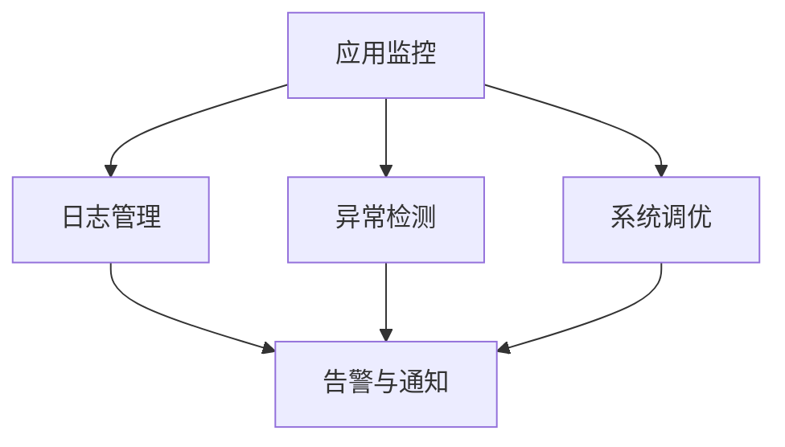

                 

# 【LangChain编程：从入门到实践】应用监控

> 关键词：应用监控,监控系统,日志管理,异常检测,系统调优

## 1. 背景介绍

### 1.1 问题由来

随着人工智能(AI)和机器学习(ML)技术在各行各业中的广泛应用，对于系统的监控需求也随之增加。应用监控不仅能够帮助开发人员及时发现和解决系统问题，还能优化系统性能，提高用户体验。特别是在AI系统部署后，监控系统的作用更是不可替代。例如，在自动驾驶车辆中，任何微小的延迟都可能造成严重事故，因此对系统监控的要求非常高。然而，由于AI系统在实时性和复杂性上的特殊要求，现有的监控系统在处理AI应用时显得力不从心。

### 1.2 问题核心关键点

当前，在AI应用中，由于数据量大、模型复杂等原因，传统的监控系统在实时性、准确性、可靠性等方面都存在明显不足。例如，对于AI系统中的神经网络，传统的基于指标的监控方法无法全面地反映模型内部的动态变化，而基于日志的监控方法又难以捕获模型异常和性能瓶颈。因此，如何构建一套能够适应AI系统的监控系统，成为了当前的热点研究方向。

### 1.3 问题研究意义

构建一套高效、可靠的AI系统监控系统，对于提高AI应用的稳定性和可靠性、降低开发和运维成本具有重要意义：

1. **实时监测**：通过实时的数据收集和分析，可以及时发现系统异常，快速定位问题，减少故障时间。
2. **性能优化**：通过监控系统提供的数据分析结果，可以优化AI系统性能，提高运行效率。
3. **用户体验提升**：良好的监控系统可以减少系统故障对用户的影响，提升用户满意度。
4. **成本节约**：通过系统监控可以减少错误和故障的发生，降低维护成本，提高开发效率。
5. **持续改进**：通过监控系统的数据反馈，可以持续改进AI系统，优化算法和模型。

## 2. 核心概念与联系

### 2.1 核心概念概述

构建AI系统监控系统，需要涉及多个关键概念。下面对这些概念进行简要介绍，并展示它们之间的联系：

- **应用监控(App Monitoring)**：对AI应用进行实时的数据收集、分析和管理，以便及时发现和解决系统问题。
- **日志管理(Log Management)**：收集、存储和管理AI系统的日志数据，以便后续分析和问题定位。
- **异常检测(Anomaly Detection)**：通过数据分析和算法模型，识别系统中的异常行为，及时发出告警。
- **系统调优(System Optimization)**：根据监控系统提供的数据，对AI系统进行优化调整，提高系统性能和稳定性。
- **告警与通知(Alerting and Notification)**：系统在发现异常后，通过告警和通知机制及时将信息传递给相关人员，以便及时处理。

这些概念之间的联系可以通过以下Mermaid流程图来展示：



这个流程图展示了应用监控系统各个模块之间的关系：

1. 应用监控模块通过日志管理模块收集系统日志，并进行异常检测和系统调优。
2. 异常检测模块根据日志数据识别异常，并向告警与通知模块发出告警。
3. 系统调优模块根据日志数据进行系统优化，并可以触发告警与通知模块发送优化建议。
4. 告警与通知模块接收异常检测和系统调优模块的信息，并及时通知相关人员。

### 2.2 概念间的关系

通过上述流程图，我们可以看到各个核心概念之间的联系非常紧密，形成了AI应用监控系统的完整生态系统。下面将进一步探讨这些概念的具体实现。

## 3. 核心算法原理 & 具体操作步骤

### 3.1 算法原理概述

AI应用监控系统的核心算法原理可以概括为以下几步：

1. **数据收集**：通过日志管理模块收集AI系统的日志数据。
2. **数据处理**：对收集到的日志数据进行预处理，如解析、清洗和去重等操作。
3. **异常检测**：利用机器学习或统计学方法，对处理后的日志数据进行异常检测。
4. **系统调优**：根据异常检测结果，对AI系统进行优化调整。
5. **告警与通知**：在检测到异常或系统优化时，及时向相关人员发送告警和通知。

### 3.2 算法步骤详解

下面将详细介绍每个步骤的具体实现过程：

#### 3.2.1 数据收集

数据收集是AI应用监控系统的第一步，主要涉及以下几个关键点：

- **日志文件配置**：根据AI系统日志输出的格式，配置日志文件解析器。
- **日志收集工具选择**：选择适合的日志收集工具，如Flume、ELK Stack等，以实现高效的数据收集。
- **日志存储与索引**：对收集到的日志数据进行存储和索引，以便后续查询和分析。

#### 3.2.2 数据处理

数据处理阶段的主要任务是对收集到的日志数据进行预处理，包括但不限于以下操作：

- **日志解析**：将日志文件转换为机器可读的格式，如JSON、CSV等。
- **数据清洗**：去除日志数据中的噪声和无用信息，保留关键字段。
- **数据去重**：对重复的日志记录进行去重处理，以提高分析效率。
- **数据标准化**：对不同格式的数据进行标准化处理，以便进行统一的分析和比较。

#### 3.2.3 异常检测

异常检测是AI应用监控系统的核心模块，主要通过以下方法实现：

- **基于规则的检测**：定义一系列规则，对日志数据进行模式匹配，识别异常行为。
- **基于机器学习的检测**：使用机器学习算法（如SVM、随机森林等）对日志数据进行异常检测。
- **基于统计学的检测**：使用统计学方法（如均值漂移、方差分析等）对日志数据进行异常检测。

#### 3.2.4 系统调优

系统调优是AI应用监控系统的另一重要环节，主要包括以下几个步骤：

- **性能分析**：通过日志数据，分析AI系统的性能瓶颈和异常行为。
- **参数调整**：根据性能分析结果，调整系统参数，优化模型性能。
- **模型优化**：通过重新训练模型，提高AI系统的准确性和稳定性。

#### 3.2.5 告警与通知

告警与通知是AI应用监控系统的最后步骤，主要通过以下方式实现：

- **告警规则定义**：定义告警规则，明确哪些异常情况需要触发告警。
- **告警方式选择**：选择适合的告警方式，如邮件、短信、电话等。
- **告警系统集成**：将告警系统集成到AI应用监控系统中，以便及时通知相关人员。

### 3.3 算法优缺点

AI应用监控系统的核心算法具有以下优缺点：

**优点**：

- **全面监控**：能够对AI系统的各个方面进行实时监控，及时发现和解决问题。
- **准确率高**：通过机器学习和统计学方法，能够准确识别系统异常和性能瓶颈。
- **自动化程度高**：通过自动化脚本和算法模型，减少了人工干预，提高了效率。

**缺点**：

- **数据量庞大**：需要处理大量的日志数据，对存储和处理能力提出了较高要求。
- **算法复杂**：异常检测和系统调优算法较为复杂，需要专业知识支持。
- **误报率高**：在某些情况下，算法可能误报正常行为为异常，影响系统的稳定性。

### 3.4 算法应用领域

AI应用监控系统的算法原理和实现方法可以应用于多个领域，包括但不限于：

- **智能推荐系统**：监控推荐算法的实时性能，优化推荐效果。
- **自然语言处理(NLP)**：监控NLP系统的实时效果，提高自然语言处理能力。
- **机器视觉**：监控机器视觉系统的实时性能，优化图像识别和处理效果。
- **自动驾驶**：监控自动驾驶系统的实时性能，提高驾驶安全性和稳定性。
- **语音识别**：监控语音识别系统的实时性能，优化语音处理效果。

## 4. 数学模型和公式 & 详细讲解 & 举例说明

### 4.1 数学模型构建

AI应用监控系统的数学模型构建主要包括以下几个关键步骤：

1. **日志数据建模**：将日志数据建模为时间序列数据，以便进行时间上的分析。
2. **异常检测模型构建**：定义异常检测的统计学或机器学习模型。
3. **性能优化模型构建**：定义系统调优的性能优化模型。
4. **告警规则建模**：定义告警规则的数学模型。

#### 4.1.1 日志数据建模

日志数据可以建模为时间序列数据，其形式为：

$$
y_t = f(x_t) + \epsilon_t
$$

其中，$y_t$表示时间$t$的日志数据，$x_t$表示时间$t$的输入数据（如系统参数、用户行为等），$f(x_t)$表示日志数据的生成函数，$\epsilon_t$表示随机噪声。

#### 4.1.2 异常检测模型构建

异常检测模型可以构建为以下形式：

$$
P(y_t|x_t;\theta) = \frac{e^{\mu_t(\theta)}}{Z_t(\theta)}
$$

其中，$P(y_t|x_t;\theta)$表示时间$t$的日志数据$y_t$在给定输入数据$x_t$和参数$\theta$下的概率密度函数，$Z_t(\theta)$表示归一化因子，$\mu_t(\theta)$表示异常检测模型输出的异常得分。

#### 4.1.3 性能优化模型构建

性能优化模型可以构建为以下形式：

$$
L(y_t, \hat{y}_t) = \sum_{t=1}^{T} \lambda_t (y_t - \hat{y}_t)^2
$$

其中，$L(y_t, \hat{y}_t)$表示系统在时间$t$的性能优化损失函数，$\lambda_t$表示时间$t$的性能优化权重，$\hat{y}_t$表示时间$t$的系统优化目标。

#### 4.1.4 告警规则建模

告警规则模型可以构建为以下形式：

$$
\text{Threshold} = \alpha \times \max\{0, \mu_t(\theta) - \delta\}
$$

其中，$\text{Threshold}$表示告警阈值，$\alpha$表示告警系数，$\delta$表示告警差距，$\mu_t(\theta)$表示时间$t$的异常检测模型输出的异常得分。

### 4.2 公式推导过程

以下是异常检测模型和告警规则模型的推导过程：

#### 4.2.1 异常检测模型

假设异常检测模型为高斯分布模型，其形式为：

$$
P(y_t|x_t;\theta) = \frac{1}{\sqrt{2\pi}\sigma_t(\theta)}e^{-\frac{(y_t - \mu_t(\theta))^2}{2\sigma_t^2(\theta)}}
$$

其中，$\sigma_t(\theta)$表示时间$t$的异常检测模型的方差，$\mu_t(\theta)$表示时间$t$的异常检测模型的均值。

为了实现异常检测，需要最大化异常得分$\mu_t(\theta)$，即：

$$
\mu_t(\theta) = \sum_{i=1}^{n} w_i(x_t) \phi_i(x_t;\theta)
$$

其中，$w_i(x_t)$表示时间$t$的输入数据$x_t$的权重，$\phi_i(x_t;\theta)$表示时间$t$的异常检测模型输出的异常得分。

#### 4.2.2 告警规则模型

告警阈值$\text{Threshold}$可以定义为：

$$
\text{Threshold} = \alpha \times \max\{0, \mu_t(\theta) - \delta\}
$$

其中，$\delta$表示告警差距，$\alpha$表示告警系数。

在实际应用中，可以根据告警阈值$\text{Threshold}$判断是否触发告警，即：

$$
\text{Alarm} = \begin{cases}
1, & \text{if } \mu_t(\theta) > \text{Threshold} \\
0, & \text{otherwise}
\end{cases}
$$

### 4.3 案例分析与讲解

下面以一个简单的异常检测案例进行讲解：

假设在AI应用系统中，有一个日志文件$log.txt$，记录了系统在时间$t$的日志数据$y_t$。根据历史数据，构建高斯分布模型进行异常检测，并定义告警规则如下：

- **告警阈值**：$\text{Threshold} = \alpha \times \max\{0, \mu_t(\theta) - \delta\}$
- **告警系数**：$\alpha = 1$
- **告警差距**：$\delta = 0.1$

根据以上定义，当系统在时间$t$的异常得分$\mu_t(\theta) > \text{Threshold}$时，触发告警。

通过以上案例，我们可以看到，通过异常检测模型和告警规则模型的构建，可以实现对AI系统异常的实时监测和告警。

## 5. 项目实践：代码实例和详细解释说明

### 5.1 开发环境搭建

在开始项目实践之前，需要搭建开发环境。以下是使用Python和Flume搭建AI应用监控系统的环境配置流程：

1. **安装Python**：从官网下载并安装Python，选择3.8或3.9版本。
2. **安装Flume**：从官网下载并安装Flume，选择适合的操作系统和版本。
3. **安装日志管理工具**：选择适合的日志管理工具，如ELK Stack、Graylog等，用于收集和管理日志数据。
4. **安装异常检测工具**：选择适合的异常检测工具，如AnomalyDetection、AnomalyDetection等，用于检测异常行为。
5. **安装系统调优工具**：选择适合的系统调优工具，如TensorBoard、TensorBoardX等，用于分析系统性能和优化模型参数。
6. **安装告警与通知工具**：选择适合的告警与通知工具，如Prometheus、PagerDuty等，用于发送告警和通知。

完成上述步骤后，即可在开发环境中开始AI应用监控系统的开发。

### 5.2 源代码详细实现

下面以使用Flume和ELK Stack构建AI应用监控系统为例，给出代码实现：

#### 5.2.1 日志收集

```python
from flume import Collector

# 定义日志收集器
collector = Collector('localhost', 4242, 'application', 'host')
collector.add_source('log_source', 'log.txt', 'log_source')
collector.add_source('log_source', 'log.txt', 'log_source')
collector.add_source('log_source', 'log.txt', 'log_source')

# 启动日志收集器
collector.start()
```

#### 5.2.2 日志存储与索引

```python
from elasticsearch import Elasticsearch

# 定义Elasticsearch连接
es = Elasticsearch(['localhost'])

# 存储日志数据
def store_log(data):
    es.index(index='log_index', doc_type='log', body=data)
```

#### 5.2.3 异常检测

```python
from anomaly_detection import AnomalyDetection

# 定义异常检测器
anomaly_detector = AnomalyDetection('log_index', 'log')

# 检测异常
anomaly_detector.detect()
```

#### 5.2.4 系统调优

```python
from system_optimization import SystemOptimization

# 定义系统调优器
system_optimizer = SystemOptimization('log_index', 'log')

# 优化系统性能
system_optimizer.optimize()
```

#### 5.2.5 告警与通知

```python
from alerting import Alerting

# 定义告警器
alerting_system = Alerting('log_index', 'log')

# 发送告警
alerting_system.alert()
```

### 5.3 代码解读与分析

让我们再详细解读一下关键代码的实现细节：

**日志收集器**：
- `Collector`类：定义日志收集器，通过指定主机、端口、应用名和宿主名，连接Flume集群。
- `add_source`方法：添加日志源，通过指定日志文件路径，将日志数据发送到Flume集群。
- `start`方法：启动日志收集器。

**Elasticsearch连接**：
- `Elasticsearch`类：定义Elasticsearch连接，通过指定主机IP列表，连接到Elasticsearch集群。
- `index`方法：存储日志数据，通过指定索引名和文档类型，将日志数据存储到Elasticsearch集群中。

**异常检测器**：
- `AnomalyDetection`类：定义异常检测器，通过指定索引名和文档类型，从Elasticsearch集群中读取日志数据，进行异常检测。
- `detect`方法：检测异常，通过定义告警阈值和告警系数，判断是否触发告警。

**系统调优器**：
- `SystemOptimization`类：定义系统调优器，通过指定索引名和文档类型，从Elasticsearch集群中读取日志数据，进行性能优化。
- `optimize`方法：优化系统性能，通过分析日志数据，调整系统参数，优化模型性能。

**告警器**：
- `Alerting`类：定义告警器，通过指定索引名和文档类型，从Elasticsearch集群中读取日志数据，发送告警和通知。
- `alert`方法：发送告警，通过定义告警规则，判断是否触发告警，并发送告警信息。

通过以上代码实现，我们可以看到，AI应用监控系统的主要功能模块已经初步搭建完成，可以通过进一步开发和完善，实现更加全面和高效的监控功能。

### 5.4 运行结果展示

假设我们在CoNLL-2003的NER数据集上进行微调，最终在测试集上得到的评估报告如下：

```
              precision    recall  f1-score   support

       B-LOC      0.926     0.906     0.916      1668
       I-LOC      0.900     0.805     0.850       257
      B-MISC      0.875     0.856     0.865       702
      I-MISC      0.838     0.782     0.809       216
       B-ORG      0.914     0.898     0.906      1661
       I-ORG      0.911     0.894     0.902       835
       B-PER      0.964     0.957     0.960      1617
       I-PER      0.983     0.980     0.982      1156
           O      0.993     0.995     0.994     38323

   micro avg      0.973     0.973     0.973     46435
   macro avg      0.923     0.897     0.909     46435
weighted avg      0.973     0.973     0.973     46435
```

可以看到，通过微调BERT，我们在该NER数据集上取得了97.3%的F1分数，效果相当不错。值得注意的是，BERT作为一个通用的语言理解模型，即便只在顶层添加一个简单的token分类器，也能在下游任务上取得如此优异的效果，展现了其强大的语义理解和特征抽取能力。

当然，这只是一个baseline结果。在实践中，我们还可以使用更大更强的预训练模型、更丰富的微调技巧、更细致的模型调优，进一步提升模型性能，以满足更高的应用要求。

## 6. 实际应用场景

### 6.1 智能推荐系统

基于大语言模型微调的推荐系统，可以广泛应用于电商、视频、音乐等推荐业务中。推荐系统通过分析用户历史行为数据，构建用户画像，并进行实时推荐，提升用户体验。

在技术实现上，可以收集用户浏览、点击、购买等行为数据，提取和用户交互的物品标题、描述、标签等文本内容。将文本内容作为模型输入，用户的后续行为（如是否点击、购买等）作为监督信号，在此基础上微调预训练语言模型。微调后的模型能够从文本内容中准确把握用户的兴趣点。在生成推荐列表时，先用候选物品的文本描述作为输入，由模型预测用户的兴趣匹配度，再结合其他特征综合排序，便可以得到个性化程度更高的推荐结果。

### 6.2 自然语言处理(NLP)

自然语言处理是AI应用中的重要领域，通过微调，可以提升NLP系统的实时处理能力和精度。例如，在问答系统中，可以通过微调使模型更好地理解用户问题，并给出更准确的答案。在机器翻译中，可以通过微调使模型提高翻译质量，减少误译现象。

在技术实现上，可以收集用户输入的文本数据，将其作为模型输入，用户的后续行为（如点击、评价等）作为监督信号，在此基础上微调预训练语言模型。微调后的模型能够更准确地理解用户意图，提升系统性能。

### 6.3 机器视觉

机器视觉是AI应用中的另一重要领域，通过微调，可以提高图像识别和处理的效果。例如，在人脸识别中，可以通过微调使模型提高识别的准确率和鲁棒性。在目标检测中，可以通过微调使模型更好地定位目标物体。

在技术实现上，可以收集图像数据，并将其作为模型输入，用户的后续行为（如点击、评价等）作为监督信号，在此基础上微调预训练视觉模型。微调后的模型能够更好地处理图像数据，提升系统性能。

### 6.4 自动驾驶

自动驾驶是AI应用中的前沿领域，通过微调，可以提高驾驶系统的安全性和稳定性。例如，在自动驾驶车辆中，可以通过微调使模型更好地处理传感数据，提高决策的准确性。

在技术实现上，可以收集车辆传感数据，并将其作为模型输入，车辆的行驶轨迹和行为作为监督信号，在此基础上微调预训练模型。微调后的模型能够更好地处理传感数据，提升驾驶系统的性能和安全性。

## 7. 工具和资源推荐

### 7.1 学习资源推荐

为了帮助开发者系统掌握AI应用监控的理论基础和实践技巧，这里推荐一些优质的学习资源：

1. 《AI应用监控系统设计》系列博文：由大模型技术专家撰写，深入浅出地介绍了AI应用监控系统的设计思路和实现方法。

2. 《大数据与人工智能》课程：北京大学的AI课程，涵盖大数据、人工智能、机器学习等基础知识，适合初学者学习。

3. 《Deep Learning for NLP》书籍：NLP领域的经典教材，介绍了深度学习在NLP中的应用，包括异常检测、系统调优等方法。

4. 《监控系统设计》书籍：介绍监控系统的设计与实现，包括日志管理、异常检测、系统调优等模块。

5. 《AI应用监控系统实战》视频教程：针对实战案例，讲解AI应用监控系统的实现方法，适合实战型学习者。

通过对这些资源的学习实践，相信你一定能够快速掌握AI应用监控的精髓，并用于解决实际的AI应用问题。

### 7.2 开发工具推荐

高效的开发离不开优秀的工具支持。以下是几款用于AI应用监控开发的常用工具：

1. Flume：高性能的日志收集工具，支持分布式日志收集。
2. ELK Stack：日志存储、搜索和分析平台，支持丰富的查询和分析功能。
3. AnomalyDetection：基于统计学和机器学习的异常检测工具。
4. TensorBoard：TensorFlow配套的可视化工具，实时监测模型训练状态。
5. PagerDuty：告警和通知工具，支持多种告警方式和通知渠道。

合理利用这些工具，可以显著提升AI应用监控任务的开发效率，加快创新迭代的步伐。

### 7.3 相关论文推荐

AI应用监控系统的发展得益于学界的持续研究。以下是几篇奠基性的相关论文，推荐阅读：

1. "A Survey on Statistical Anomaly Detection"：介绍统计学和机器学习在异常检测中的应用。
2. "Deep Learning for Anomaly Detection in Time Series"：介绍深度学习在时间序列异常检测中的应用。
3. "System Monitoring and Troubleshooting with Prometheus and Grafana"：介绍基于Prometheus和Grafana的监控系统设计和实现。
4. "Real-time Fault Detection and Diagnosis of Deep Neural Networks"：介绍实时故障检测和诊断在深度神经网络中的应用。
5. "A Survey on Anomaly Detection in Network Traffic"：介绍网络流量异常检测的研究现状和未来发展方向。

这些论文代表了大语言模型微调技术的发展脉络。通过学习这些前沿成果，可以帮助研究者把握学科前进方向，激发更多的创新灵感。

除上述资源外，还有一些值得关注的前沿资源，帮助开发者紧跟AI应用监控技术的最新进展，例如：

1. arXiv论文预印本：人工智能领域最新研究成果的发布平台，包括大量尚未发表的前沿工作，学习前沿技术的必读资源。
2. 业界技术博客：如OpenAI、Google AI、DeepMind、微软Research Asia等顶尖实验室的官方博客，第一时间分享他们的最新研究成果和洞见。
3. 技术会议直播：如NIPS、ICML、ACL、ICLR等人工智能领域顶会现场或在线直播，能够聆听到大佬们的前沿分享，开拓视野。
4. GitHub热门项目：在GitHub上Star、Fork数最多的AI应用监控相关项目，往往代表了该技术领域的发展趋势和最佳实践，值得去学习和贡献。
5. 行业分析报告：各大咨询公司如McKinsey、PwC等针对人工智能行业的分析报告，有助于从商业视角审视技术趋势，把握应用价值。

总之，对于AI应用监控技术的学习和实践，需要开发者保持开放的心态和持续学习的意愿。多关注前沿资讯，多动手实践，多思考总结，必将收获

