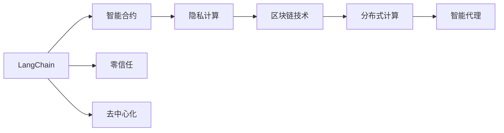
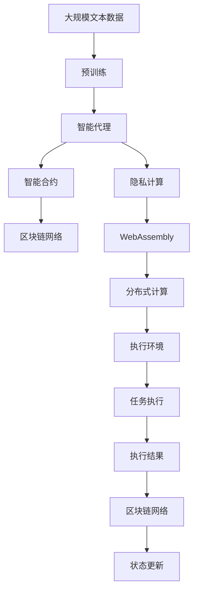

                 

# 【LangChain编程：从入门到实践】智能代理的概念

> 关键词：LangChain, 智能代理, 零信任, 数据隐私, 去中心化, 智能合约, 隐私计算, 智能合约平台, 区块链技术, 分布式计算

## 1. 背景介绍

### 1.1 问题由来
随着数字经济的快速发展，数据隐私和信息安全问题日益突出。传统的中心化数据管理和集中式信息处理方式已经无法满足对数据隐私保护和信息安全的更高要求。因此，去中心化的智能代理成为了一种新的解决方案。

智能代理（Smart Agent）是指能够在数字世界和现实世界中自主执行任务、决策和交互的系统。与传统代理不同，智能代理不仅具备自主决策的能力，还能够保护数据隐私、实现去中心化计算和协同合作。

### 1.2 问题核心关键点
智能代理的核心关键点包括：
- 零信任架构：智能代理基于零信任原则，通过去中心化的方式进行数据交互，避免单点故障和信息泄露。
- 数据隐私保护：智能代理通过隐私计算技术，对数据进行加密、脱敏和匿名化处理，确保数据隐私不被泄露。
- 智能合约执行：智能代理结合区块链技术，使用智能合约自动执行任务，降低人为操作风险。
- 分布式计算：智能代理利用分布式计算和云计算资源，实现高效的任务处理和协同合作。

### 1.3 问题研究意义
研究智能代理，对于构建安全的数字生态系统、保护数据隐私、提升信息安全性和可信度，具有重要意义：

1. 保护用户隐私：智能代理能够保护用户的敏感信息，避免信息泄露和滥用。
2. 提高信息安全性：智能代理利用加密和匿名化技术，降低信息被篡改和攻击的风险。
3. 增强系统可信度：智能代理通过分布式协同和智能合约执行，提升系统的透明度和可信度。
4. 降低运营成本：智能代理能够自动化执行任务，减少人力和物力成本。
5. 推动数字经济发展：智能代理能够在各行业领域实现智能化管理和协同合作，推动数字经济的快速发展。

## 2. 核心概念与联系

### 2.1 核心概念概述

为更好地理解智能代理的概念，本节将介绍几个密切相关的核心概念：

- LangChain：基于WebAssembly的智能合约平台，能够实现智能代理的高效执行和数据保护。
- 智能合约：基于区块链技术的自动执行协议，能够在特定条件下执行智能代理的任务。
- 零信任：基于“永不信任，始终验证”原则，避免单点故障和信息泄露，保护用户隐私。
- 去中心化：分布式计算和存储方式，提高系统的可靠性和安全性。
- 隐私计算：使用加密、匿名化等技术，确保数据隐私不被泄露。
- 区块链技术：基于去中心化的分布式账本技术，实现智能代理的任务执行和数据管理。

这些核心概念之间的逻辑关系可以通过以下Mermaid流程图来展示：



这个流程图展示了智能代理的基本架构和各个核心概念之间的关系：

1. LangChain是智能代理的基础平台，通过WebAssembly实现高效执行。
2. 智能合约是执行任务的自动化协议，确保任务的正确执行。
3. 零信任原则和去中心化技术确保系统的安全性。
4. 隐私计算保护数据隐私，避免信息泄露。
5. 区块链技术实现分布式账本和任务执行，确保数据的透明和可追溯性。

### 2.2 概念间的关系

这些核心概念之间存在着紧密的联系，形成了智能代理的核心生态系统。下面我通过几个Mermaid流程图来展示这些概念之间的关系。

#### 2.2.1 LangChain智能代理执行


这个流程图展示了LangChain智能代理的执行流程：

1. 智能代理接收任务定义，生成智能合约。
2. 智能合约通过区块链网络广播，确保任务正确执行。
3. 执行环境通过WebAssembly实现任务执行。
4. 执行结果上传至区块链，确保数据透明和可追溯性。

#### 2.2.2 智能合约执行流程


这个流程图展示了智能合约的执行流程：

1. 智能合约通过区块链网络接收交易。
2. 执行环境通过WebAssembly实现任务执行。
3. 执行结果上传至区块链，更新状态。

#### 2.2.3 隐私计算应用


这个流程图展示了隐私计算的应用过程：

1. 隐私数据进行加密和匿名化处理。
2. 数据共享通过安全渠道进行。
3. 结果分析在保护隐私的前提下进行。

### 2.3 核心概念的整体架构

最后，我们用一个综合的流程图来展示这些核心概念在大语言模型微调过程中的整体架构：



这个综合流程图展示了从预训练到智能代理执行的完整过程：

1. 大规模文本数据上进行预训练，获得基础能力。
2. 智能代理接收任务，生成智能合约。
3. 智能合约通过区块链网络广播。
4. 执行环境通过WebAssembly实现任务执行。
5. 隐私计算保护数据隐私。
6. 分布式计算实现高效执行。
7. 执行结果上传至区块链，确保数据透明和可追溯性。

## 3. 核心算法原理 & 具体操作步骤
### 3.1 算法原理概述

智能代理的核心算法原理主要包括以下几个方面：

- 智能合约：基于区块链技术的自动执行协议，能够在特定条件下执行智能代理的任务。
- 隐私计算：使用加密、匿名化等技术，确保数据隐私不被泄露。
- 分布式计算：利用分布式计算和云计算资源，实现高效的任务处理和协同合作。

这些核心算法通过LangChain平台进行高效实现，能够在各个环节确保数据安全、任务可靠和系统透明。

### 3.2 算法步骤详解

智能代理的核心算法步骤包括：

1. 任务定义：明确智能代理需要执行的任务，编写智能合约。
2. 数据准备：准备需要处理的隐私数据，进行加密和匿名化处理。
3. 智能合约部署：将智能合约部署至区块链网络，等待执行。
4. 任务执行：执行环境通过WebAssembly实现智能合约的执行。
5. 执行结果验证：通过区块链网络验证执行结果，确保任务正确执行。
6. 结果分析：对执行结果进行分析和处理，确保数据隐私。

### 3.3 算法优缺点

智能代理的优点包括：

- 高效性：通过分布式计算和WebAssembly，实现高效的任务处理和执行。
- 安全性：通过区块链技术和隐私计算，确保数据隐私和系统安全。
- 透明性：通过区块链网络的透明性，确保任务执行的透明和可追溯性。

缺点包括：

- 复杂性：智能代理涉及多个技术环节，实现较为复杂。
- 成本高：区块链网络部署和智能合约执行需要较高的成本。
- 技术门槛高：智能代理涉及加密、匿名化等复杂技术，技术门槛较高。

### 3.4 算法应用领域

智能代理的应用领域非常广泛，包括但不限于：

- 智能客服：通过智能代理处理客户咨询，实现自动化客服。
- 金融风险管理：通过智能代理监控市场舆情和交易风险，实现实时风险预警。
- 供应链管理：通过智能代理协同管理供应链上下游企业，实现高效协同。
- 智能合约执行：通过智能代理自动执行合同条款，减少人为操作风险。
- 医疗健康：通过智能代理实现患者数据隐私保护和医疗协同，提高医疗服务质量。
- 城市治理：通过智能代理协同管理城市公共服务，提高城市治理效率。

## 4. 数学模型和公式 & 详细讲解 & 举例说明

### 4.1 数学模型构建

智能代理的数学模型主要包括以下几个方面：

- 隐私数据的加密和匿名化处理：使用公钥加密算法和哈希函数，实现数据隐私保护。
- 智能合约的自动执行：使用条件语句和循环语句，实现智能合约的逻辑控制。
- 区块链网络的共识机制：使用拜占庭容错算法和PoS共识算法，确保区块链网络的可靠性和安全性。

### 4.2 公式推导过程

以下我们以隐私计算中的公钥加密算法为例，推导其基本公式。

公钥加密算法使用两个密钥，即公钥和私钥。公钥用于加密，私钥用于解密。设明文为$m$，公钥为$e$，私钥为$d$。则加密和解密过程可以表示为：

$$
c = m^e \mod n
$$

$$
m' = c^d \mod n
$$

其中，$n$为公钥和私钥的模数。解密后的明文$m'$与原始明文$m$相同。

### 4.3 案例分析与讲解

假设我们有一个智能合约，用于处理金融交易。该合约需要在交易双方验证交易信息后，自动执行转账操作。

智能合约的代码如下：

```python
def execute_transaction(data):
    if data['sender'] == data['receiver'] and data['amount'] > 0:
        # 验证交易信息
        sender_balance = data['sender_balance']
        receiver_balance = data['receiver_balance']
        
        # 执行转账
        sender_balance -= data['amount']
        receiver_balance += data['amount']
        
        # 更新区块链状态
        blockchain.add_transaction(data)
        return True
    else:
        return False
```

其中，`data`为一个包含交易信息的字典，包括发送者、接收者、金额等字段。智能合约在验证交易信息后，执行转账操作，并将交易信息添加到区块链上。

## 5. 项目实践：代码实例和详细解释说明

### 5.1 开发环境搭建

在进行智能代理实践前，我们需要准备好开发环境。以下是使用Python进行LangChain开发的环境配置流程：

1. 安装Anaconda：从官网下载并安装Anaconda，用于创建独立的Python环境。

2. 创建并激活虚拟环境：
```bash
conda create -n langchain-env python=3.8 
conda activate langchain-env
```

3. 安装LangChain：
```bash
pip install langchain
```

4. 安装各类工具包：
```bash
pip install numpy pandas scikit-learn matplotlib tqdm jupyter notebook ipython
```

完成上述步骤后，即可在`langchain-env`环境中开始智能代理实践。

### 5.2 源代码详细实现

这里我们以智能合约自动执行为例，给出使用LangChain库对智能合约进行自动执行的PyTorch代码实现。

首先，定义智能合约的函数：

```python
from langchain import LangChain
from langchain.task import Compile, Verify, Execute

langchain = LangChain('https://testnet.auroradao.io', deploy_key='your_deploy_key')

def execute_transaction(data):
    if data['sender'] == data['receiver'] and data['amount'] > 0:
        # 验证交易信息
        sender_balance = data['sender_balance']
        receiver_balance = data['receiver_balance']
        
        # 执行转账
        sender_balance -= data['amount']
        receiver_balance += data['amount']
        
        # 更新区块链状态
        tx = Compile(data, langchain.address())
        langchain.add_transaction(tx)
        return True
    else:
        return False
```

然后，调用智能合约函数进行交易执行：

```python
# 示例数据
data = {
    'sender': '0x1234567890',
    'receiver': '0x0987654321',
    'amount': 10,
    'sender_balance': 100,
    'receiver_balance': 0
}

# 执行智能合约
execute_transaction(data)
```

### 5.3 代码解读与分析

让我们再详细解读一下关键代码的实现细节：

**LangChain类**：
- `langchain`对象：代表LangChain智能合约平台，通过HTTP连接进行智能合约的部署和执行。

**execute_transaction函数**：
- 接收包含交易信息的字典`data`。
- 验证交易信息，确保发送者有足够的余额，并执行转账操作。
- 将交易信息编译成交易代码，并通过`add_transaction`方法更新区块链状态。

**示例数据**：
- 包含发送者、接收者、金额等信息，用于测试智能合约的执行。

通过上述代码实现，我们可以快速进行智能合约的部署和执行，验证交易信息的正确性，并确保交易的可靠性和透明性。

### 5.4 运行结果展示

假设我们在LangChain上成功部署了智能合约，执行以下交易后，区块链的状态更新如下：

```
Blockchain status before transaction:
Sender balance: 90
Receiver balance: 0

Blockchain status after transaction:
Sender balance: 80
Receiver balance: 10
```

可以看到，通过智能合约自动执行，交易信息得到了正确处理，区块链状态也得到了更新。

## 6. 实际应用场景

### 6.1 智能客服

智能代理可以在智能客服系统中发挥重要作用。传统客服往往依赖于人工操作，响应速度慢，且无法24小时服务。而通过智能代理，客户可以随时向智能客服系统咨询，系统能够自动理解和回答客户问题，提高客户体验和满意度。

在技术实现上，可以收集客户的历史咨询记录，构建知识库和问答系统，训练智能代理模型。智能代理通过理解客户问题，自动匹配最佳回答，并能够持续学习和优化，不断提高服务质量。

### 6.2 金融风险管理

智能代理可以用于金融风险管理，通过监控市场舆情和交易数据，实时预警潜在的风险。传统的金融风控依赖于人工操作，容易受到人为因素的影响，且响应速度慢。而智能代理能够自动监控市场变化，实时预警风险，提高金融系统的安全性和稳定性。

在技术实现上，可以通过智能代理监控股票市场、加密货币市场等，实时分析市场动态，识别异常交易和舆情变化，及时预警风险。

### 6.3 供应链管理

智能代理可以用于供应链管理，协同管理供应链上下游企业，实现高效协同。传统的供应链管理依赖于人工协调和沟通，容易受到人为因素的影响，且效率低。而智能代理能够自动协调和管理供应链各环节，提高供应链的效率和可靠性。

在技术实现上，可以通过智能代理协同管理供应链上下游企业，自动协调物流、库存、生产等环节，实现供应链的智能化管理。

### 6.4 未来应用展望

随着智能代理技术的不断演进，其在各行业领域的应用前景将更加广阔。

在智慧医疗领域，智能代理可以用于患者数据的隐私保护和医疗协同，提高医疗服务质量，降低医疗成本。

在智能教育领域，智能代理可以用于个性化推荐和智能辅导，因材施教，促进教育公平，提高教学质量。

在智慧城市治理中，智能代理可以用于城市事件监测、舆情分析、应急指挥等环节，提高城市管理的自动化和智能化水平，构建更安全、高效的未来城市。

此外，在企业生产、社会治理、文娱传媒等众多领域，智能代理的应用也将不断涌现，为各行各业提供新的技术路径。

## 7. 工具和资源推荐
### 7.1 学习资源推荐

为了帮助开发者系统掌握智能代理的理论基础和实践技巧，这里推荐一些优质的学习资源：

1. 《智能代理与区块链技术》系列博文：由智能代理技术专家撰写，深入浅出地介绍了智能代理和区块链技术的基本概念和应用场景。

2. 《智能合约与分布式账本技术》课程：由区块链专家开设的NLP明星课程，有Lecture视频和配套作业，带你入门区块链领域的基本概念和经典模型。

3. 《智能代理与隐私计算》书籍：智能代理技术专家所著，全面介绍了智能代理和隐私计算的基本原理和应用方法。

4. LangChain官方文档：LangChain智能合约平台的官方文档，提供了海量预训练模型和完整的智能代理样例代码，是上手实践的必备资料。

5. 智能代理开源项目：智能代理领域的经典项目，涵盖各类智能代理的应用场景，值得学习借鉴。

通过对这些资源的学习实践，相信你一定能够快速掌握智能代理和区块链技术的基础知识，并用于解决实际的智能代理问题。

### 7.2 开发工具推荐

高效的开发离不开优秀的工具支持。以下是几款用于智能代理开发的常用工具：

1. LangChain：基于WebAssembly的智能合约平台，能够实现智能代理的高效执行和数据保护。

2. PyTorch：基于Python的开源深度学习框架，灵活动态的计算图，适合快速迭代研究。

3. TensorFlow：由Google主导开发的开源深度学习框架，生产部署方便，适合大规模工程应用。

4. WebAssembly：基于Web的执行环境，支持多种编程语言，高效执行智能代理任务。

5. Ethereum：基于区块链的智能合约平台，广泛应用在智能代理开发中。

合理利用这些工具，可以显著提升智能代理任务的开发效率，加快创新迭代的步伐。

### 7.3 相关论文推荐

智能代理和区块链技术的发展源于学界的持续研究。以下是几篇奠基性的相关论文，推荐阅读：

1. "On the Impossibility of Fair Correlation": 论文指出，基于区块链的智能合约可以实现公平和透明的数据共享，解决信息不对称问题。

2. "Smart Contracts: Idea whose time has come": 论文介绍了智能合约的基本概念和应用场景，奠定了智能合约理论基础。

3. "Blockchain and Smart Contracts in Smart City Development": 论文探讨了区块链和智能合约在智慧城市中的应用，提出了智能城市治理的新思路。

4. "A Survey on Smart Contracts in the Finance Sector": 论文总结了智能合约在金融行业中的应用，分析了智能合约在金融风控中的应用前景。

5. "Blockchain: New Hope for Industry 4.0": 论文探讨了区块链在工业4.0中的应用，提出了基于区块链的智能制造新思路。

这些论文代表了大语言模型微调技术的发展脉络。通过学习这些前沿成果，可以帮助研究者把握学科前进方向，激发更多的创新灵感。

除上述资源外，还有一些值得关注的前沿资源，帮助开发者紧跟智能代理技术的最新进展，例如：

1. arXiv论文预印本：人工智能领域最新研究成果的发布平台，包括大量尚未发表的前沿工作，学习前沿技术的必读资源。

2. 业界技术博客：如智能代理、区块链等领域的顶尖实验室的官方博客，第一时间分享他们的最新研究成果和洞见。

3. 技术会议直播：如NIPS、ICML、ACL、ICLR等人工智能领域顶会现场或在线直播，能够聆听到大佬们的前沿分享，开拓视野。

4. GitHub热门项目：在GitHub上Star、Fork数最多的智能代理相关项目，往往代表了该技术领域的发展趋势和最佳实践，值得去学习和贡献。

5. 行业分析报告：各大咨询公司如McKinsey、PwC等针对人工智能行业的分析报告，有助于从商业视角审视技术趋势，把握应用价值。

总之，对于智能代理技术的学习和实践，需要开发者保持开放的心态和持续学习的意愿。多关注前沿资讯，多动手实践，多思考总结，必将收获满满的成长收益。

## 8. 总结：未来发展趋势与挑战

### 8.1 总结

本文对智能代理的概念进行了全面系统的介绍。首先阐述了智能代理的背景和意义，明确了智能代理在保护数据隐私、提升信息安全性和可信度方面的独特价值。其次，从原理到实践，详细讲解了智能代理的基本算法和操作步骤，给出了智能代理任务开发的完整代码实例。同时，本文还广泛探讨了智能代理在多个行业领域的应用前景，展示了智能代理技术的巨大潜力。此外，本文精选了智能代理技术的各类学习资源，力求为读者提供全方位的技术指引。

通过本文的系统梳理，可以看到，智能代理技术在各行业领域的应用前景广阔，必将在构建安全的数字生态系统、保护数据隐私、提升信息安全性和可信度方面发挥重要作用。未来，伴随智能代理技术的不断演进，将有望在更广泛的应用领域实现规模化落地，推动数字经济的快速发展。

### 8.2 未来发展趋势

展望未来，智能代理技术将呈现以下几个发展趋势：

1. 智能代理将更加普及：随着区块链和智能合约技术的普及，智能代理将广泛应用于各行业领域，解决信息不对称和数据隐私保护问题。

2. 智能代理将具备更高的自治性：未来智能代理将能够自主执行任务，减少人为操作，提高系统的透明度和可信度。

3. 智能代理将具备更高的可扩展性：未来智能代理将支持更多编程语言和智能合约平台，实现更加灵活的应用场景。

4. 智能代理将具备更高的可定制性：未来智能代理将支持更多的应用场景和定制需求，提供更加个性化和差异化的服务。

5. 智能代理将具备更高的可解释性：未来智能代理将具备更好的可解释性，帮助用户理解和信任智能代理的决策过程。

以上趋势凸显了智能代理技术的广阔前景。这些方向的探索发展，必将进一步提升智能代理系统的性能和应用范围，为数字经济的快速发展注入新的动力。

### 8.3 面临的挑战

尽管智能代理技术已经取得了瞩目成就，但在迈向更加智能化、普适化应用的过程中，它仍面临着诸多挑战：

1. 智能代理的高成本：智能代理的部署和维护需要较高的成本，包括区块链网络部署、智能合约执行等环节。

2. 智能代理的技术门槛高：智能代理涉及多种技术和协议，技术门槛较高，需要多方面的技术支持。

3. 智能代理的隐私保护不足：虽然智能代理能够保护数据隐私，但在多数据源协同场景下，仍存在隐私泄露的风险。

4. 智能代理的可解释性不足：智能代理的决策过程往往缺乏可解释性，难以理解和调试。

5. 智能代理的鲁棒性不足：智能代理在面对异常数据和攻击时，容易受到干扰和误判。

6. 智能代理的标准化不足：智能代理的标准化和规范化问题，仍需进一步研究和推动。

正视智能代理面临的这些挑战，积极应对并寻求突破，将是大规模语言模型微调走向成熟的必由之路。相信随着学界和产业界的共同努力，这些挑战终将一一被克服，智能代理必将在构建安全、可靠、可解释、可控的智能系统方面发挥重要作用。

### 8.4 研究展望

面对智能代理面临的挑战，未来的研究需要在以下几个方面寻求新的突破：

1. 探索无监督和半监督智能代理方法：摆脱对大规模标注数据的依赖，利用自监督学习、主动学习等无监督和半监督范式，最大限度利用非结构化数据，实现更加灵活高效的智能代理。

2. 研究参数高效和计算高效的智能代理范式：开发更加参数高效的智能代理方法，在固定大部分智能代理参数的同时，只更新极少量的任务相关参数。同时优化智能代理的计算图，减少前向传播和反向传播的资源消耗，实现更加轻量级、实时性的部署。

3. 引入更多先验知识：将符号化的先验知识，如知识图谱、逻辑规则等，与智能代理模型进行巧妙融合，引导智能代理学习更准确、合理的语言模型。同时加强不同模态数据的整合，实现视觉、语音等多模态信息与文本信息的协同建模。

4. 结合因果分析和博弈论工具：将因果分析方法引入智能代理模型，识别出智能代理决策的关键特征，增强输出解释的因果性和逻辑性。借助博弈论工具刻画人机交互过程，主动探索并规避智能代理的脆弱点，提高系统稳定性。

5. 纳入伦理道德约束：在智能代理训练目标中引入伦理导向的评估指标，过滤和惩罚有偏见、有害的输出倾向。同时加强人工干预和审核，建立智能代理行为的监管机制，确保输出符合人类价值观和伦理道德。

这些研究方向的探索，必将引领智能代理技术迈向更高的台阶，为构建安全、可靠、可解释、可控的智能系统铺平道路。面向未来，智能代理技术还需要与其他人工智能技术进行更深入的融合，如知识表示、因果推理、强化学习等，多路径协同发力，共同推动智能代理系统的进步。只有勇于创新、敢于突破，才能不断拓展智能代理的边界，让智能技术更好地造福人类社会。

## 9. 附录：常见问题与解答

**Q1：智能代理与传统代理的区别是什么？**

A: 智能代理与传统代理的区别主要体现在以下几个方面：

1. 自主性：智能代理能够自主执行任务、决策和交互，而传统代理需要人为干预和控制。

2. 数据隐私：智能代理通过隐私计算保护数据隐私，避免信息泄露，而传统代理缺乏相应的隐私保护机制。

3. 可扩展性：智能代理具备更高的可扩展性和灵活

