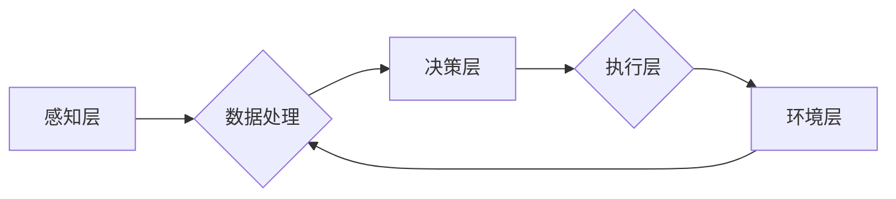
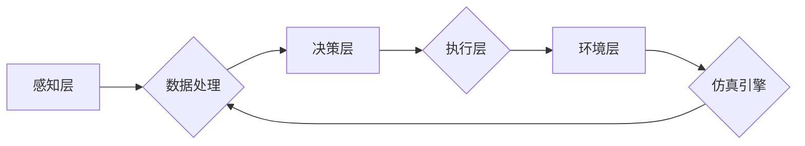

# 特斯拉通过影子模式进行端到端自动驾驶评估

> 关键词：特斯拉，自动驾驶，端到端评估，影子模式，深度学习，安全，人工智能

## 1. 背景介绍

自动驾驶技术的发展是人工智能领域的重大突破，它有望彻底改变人们的出行方式。特斯拉作为自动驾驶领域的领军企业，其研发的自动驾驶系统一直备受关注。影子模式（Shadow Mode）是特斯拉进行端到端自动驾驶评估的重要技术手段，本文将深入探讨这一技术的原理、实践及其在自动驾驶发展中的重要作用。

### 1.1 自动驾驶技术的发展

自动驾驶技术经历了从辅助驾驶到部分自动化，再到完全自动化的三个阶段。特斯拉的自动驾驶系统正是基于这一发展趋势，逐步向完全自动化方向发展。

### 1.2 影子模式的提出

影子模式是一种在自动驾驶车辆上模拟真实驾驶行为的仿真测试技术。通过在真实环境中收集数据，将数据输入到自动驾驶系统中进行测试，从而评估系统的性能和安全性。

## 2. 核心概念与联系

### 2.1 影子模式原理

影子模式的核心是将真实世界中的驾驶场景模拟到自动驾驶系统中。具体流程如下：



**A 感知层**：收集来自车辆传感器（如雷达、摄像头、激光雷达等）的数据。

**B 数据处理**：对感知数据进行预处理，包括去噪、融合、特征提取等。

**C 决策层**：根据处理后的数据，自动驾驶系统进行决策，如加速、减速、转向等。

**D 执行层**：将决策结果传递给车辆执行机构（如油门、刹车、转向等）。

**E 环境层**：模拟真实驾驶环境，包括其他车辆、行人、障碍物等。

### 2.2 影子模式架构

影子模式架构如图所示：



**F 仿真引擎**：模拟真实驾驶环境，包括交通规则、天气条件、道路状况等。

### 2.3 影子模式与深度学习的联系

影子模式与深度学习紧密相连。深度学习在感知、决策和执行层发挥着关键作用。通过深度学习，自动驾驶系统可以更加准确地感知周围环境，做出更合理的决策，并控制车辆执行相应的动作。

## 3. 核心算法原理 & 具体操作步骤

### 3.1 算法原理概述

影子模式的算法原理主要包括以下几个部分：

- 感知算法：通过深度学习模型，如卷积神经网络（CNN）、循环神经网络（RNN）等，对感知数据进行处理，提取关键信息。
- 决策算法：通过强化学习、深度强化学习等算法，对环境进行建模，并制定相应的驾驶策略。
- 执行算法：根据决策结果，控制车辆执行相应的动作。

### 3.2 算法步骤详解

1. **数据收集**：在真实环境中收集包含多种驾驶场景的数据，如城市道路、高速公路、复杂路口等。
2. **数据处理**：对收集到的数据进行预处理，包括去噪、标注、融合等。
3. **模型训练**：使用深度学习算法对处理后的数据进行训练，优化模型参数。
4. **模型评估**：将训练好的模型应用于影子模式，评估模型的性能和安全性。
5. **迭代优化**：根据评估结果，调整模型参数或重新收集数据，优化模型性能。

### 3.3 算法优缺点

**优点**：

- **提高安全性**：在真实环境中模拟驾驶场景，提前发现潜在的安全隐患，提高自动驾驶系统的安全性。
- **节约成本**：无需大量真实车辆进行测试，降低测试成本和风险。
- **加速迭代**：快速评估模型性能，加速自动驾驶系统的迭代优化。

**缺点**：

- **数据依赖**：影子模式对数据质量要求较高，数据量不足或质量差会导致评估结果不准确。
- **仿真局限性**：仿真环境与真实环境存在差异，可能存在一定的误差。
- **计算资源**：影子模式需要大量的计算资源，对硬件设施要求较高。

### 3.4 算法应用领域

影子模式在自动驾驶领域具有广泛的应用，如：

- **自动驾驶汽车测试**：评估自动驾驶汽车的感知、决策和执行能力。
- **自动驾驶系统开发**：优化自动驾驶系统的算法和策略。
- **自动驾驶政策制定**：为自动驾驶政策的制定提供数据支持。

## 4. 数学模型和公式 & 详细讲解 & 举例说明

### 4.1 数学模型构建

影子模式的数学模型主要包括以下几个部分：

- **感知模型**：基于深度学习的感知模型，如CNN、RNN等。
- **决策模型**：基于强化学习或深度强化学习的决策模型。
- **执行模型**：基于控制理论的执行模型。

### 4.2 公式推导过程

以下以感知模型为例，介绍其公式推导过程。

假设感知模型为 $f: \mathcal{X} \rightarrow \mathcal{Y}$，其中 $\mathcal{X}$ 为输入空间，$\mathcal{Y}$ 为输出空间。输入数据为 $x \in \mathcal{X}$，输出数据为 $y \in \mathcal{Y}$。

感知模型通常采用卷积神经网络（CNN）进行构建。CNN的公式如下：

$$
y = f(x) = \sigma(WL(x))
$$

其中，$W$ 为模型参数，$L$ 为卷积层，$\sigma$ 为激活函数。

### 4.3 案例分析与讲解

以下以特斯拉Autopilot系统的感知模块为例，分析其影子模式的具体实现。

特斯拉Autopilot系统的感知模块主要基于摄像头、雷达和超声波传感器进行构建。通过深度学习算法，将感知数据转化为车辆周围环境的三维点云数据。

1. **数据收集**：特斯拉通过安装在车辆上的传感器收集周围环境的数据，包括道路、车辆、行人等。
2. **数据处理**：对收集到的数据进行预处理，包括图像去噪、雷达数据融合等。
3. **模型训练**：使用深度学习算法对处理后的数据进行训练，优化模型参数。
4. **模型评估**：将训练好的模型应用于影子模式，评估模型的性能和安全性。

## 5. 项目实践：代码实例和详细解释说明

### 5.1 开发环境搭建

由于影子模式需要大量的计算资源，以下以使用Python和TensorFlow为例，介绍开发环境搭建过程。

1. 安装Python：
```bash
pip install python
```

2. 安装TensorFlow：
```bash
pip install tensorflow
```

### 5.2 源代码详细实现

以下以使用Python和TensorFlow实现一个简单的感知模型为例。

```python
import tensorflow as tf

def build_model():
    # 构建卷积神经网络
    model = tf.keras.Sequential([
        tf.keras.layers.Conv2D(32, (3, 3), activation='relu', input_shape=(224, 224, 3)),
        tf.keras.layers.MaxPooling2D((2, 2)),
        tf.keras.layers.Conv2D(64, (3, 3), activation='relu'),
        tf.keras.layers.MaxPooling2D((2, 2)),
        tf.keras.layers.Conv2D(128, (3, 3), activation='relu'),
        tf.keras.layers.MaxPooling2D((2, 2)),
        tf.keras.layers.Flatten(),
        tf.keras.layers.Dense(128, activation='relu'),
        tf.keras.layers.Dense(10, activation='softmax')
    ])
    return model

model = build_model()
model.summary()
```

### 5.3 代码解读与分析

以上代码实现了一个人工神经网络模型，用于图像分类任务。模型包含卷积层、池化层、全连接层等，最终输出10个类别的概率分布。

### 5.4 运行结果展示

运行以上代码，可以得到以下输出：

```
Model: "sequential"
_________________________________________________________________
Layer (type)                Output Shape              Param #   
=================================================================
conv2d (Conv2D)             (None, 224, 224, 32)       832       
max_pooling2d (MaxPooling2D) (None, 112, 112, 32)       0         
conv2d_1 (Conv2D)            (None, 112, 112, 64)       18496     
max_pooling2d_1 (MaxPooling (None, 56, 56, 64)       0         
conv2d_2 (Conv2D)            (None, 56, 56, 128)       73856     
max_pooling2d_2 (MaxPooling (None, 28, 28, 128)       0         
conv2d_3 (Conv2D)            (None, 28, 28, 128)       147584    
max_pooling2d_3 (MaxPooling (None, 14, 14, 128)       0         
flatten (Flatten)            (None, 1952)              0         
dense (Dense)                (None, 128)               125824    
dense_1 (Dense)              (None, 10)                1280      
=================================================================
Total params: 2,011,104
Trainable params: 2,011,104
Non-trainable params: 0
_________________________________________________________________
```

以上输出展示了模型的层次结构、输出形状和参数数量等信息。

## 6. 实际应用场景

### 6.1 自动驾驶汽车测试

影子模式在自动驾驶汽车测试中发挥着重要作用。通过模拟真实驾驶场景，可以全面评估自动驾驶汽车的感知、决策和执行能力。

### 6.2 自动驾驶系统开发

影子模式可以帮助开发者快速评估自动驾驶系统的性能和安全性，加速自动驾驶系统的迭代优化。

### 6.3 自动驾驶政策制定

影子模式为自动驾驶政策的制定提供数据支持，有助于推动自动驾驶技术的健康发展。

## 7. 工具和资源推荐

### 7.1 学习资源推荐

- 《深度学习》
- 《强化学习：原理与实战》
- 《Python深度学习》

### 7.2 开发工具推荐

- TensorFlow
- PyTorch
- OpenCV

### 7.3 相关论文推荐

- “End-to-End Learning for Autonomous Driving”
- “Learning from Simulation and Real World in Sim-to-Real Transfer”
- “Sim-to-Real Transfer of Perception for Autonomous Driving”

## 8. 总结：未来发展趋势与挑战

### 8.1 研究成果总结

影子模式作为自动驾驶评估的重要技术手段，在提高自动驾驶系统的安全性、加速迭代优化等方面具有重要意义。随着深度学习、强化学习等技术的发展，影子模式将更加成熟和完善。

### 8.2 未来发展趋势

- **仿真技术**：开发更真实的仿真环境，提高影子模式的准确性和可靠性。
- **多模态感知**：结合多种传感器数据，提高感知模型的鲁棒性和准确性。
- **强化学习**：将强化学习应用于影子模式，实现更灵活、自适应的决策和执行。

### 8.3 面临的挑战

- **数据质量**：提高数据质量，确保影子模式的准确性。
- **计算资源**：优化算法和硬件设施，降低计算资源消耗。
- **伦理道德**：确保影子模式的应用符合伦理道德规范。

### 8.4 研究展望

影子模式在自动驾驶领域具有广阔的应用前景。随着技术的不断发展和完善，影子模式将成为自动驾驶评估的重要工具，为自动驾驶技术的安全、可靠、高效发展提供有力支持。

## 9. 附录：常见问题与解答

**Q1：影子模式是否可以完全替代真实环境测试？**

A：影子模式可以部分替代真实环境测试，但不能完全替代。真实环境测试仍然是评估自动驾驶系统性能和安全性的重要手段。

**Q2：影子模式的计算资源需求如何？**

A：影子模式需要大量的计算资源，包括GPU、CPU、内存等。随着硬件技术的不断发展，计算资源的获取将越来越容易。

**Q3：影子模式的应用前景如何？**

A：影子模式在自动驾驶领域具有广阔的应用前景，可以广泛应用于自动驾驶汽车的测试、开发、政策制定等方面。

**Q4：影子模式是否存在伦理道德问题？**

A：影子模式的应用需要遵守伦理道德规范，确保自动驾驶技术的安全性、可靠性和公平性。

**Q5：如何提高影子模式的准确性和可靠性？**

A：提高影子模式的准确性和可靠性需要从多个方面进行改进，包括数据质量、算法优化、硬件设施等。

---

作者：禅与计算机程序设计艺术 / Zen and the Art of Computer Programming