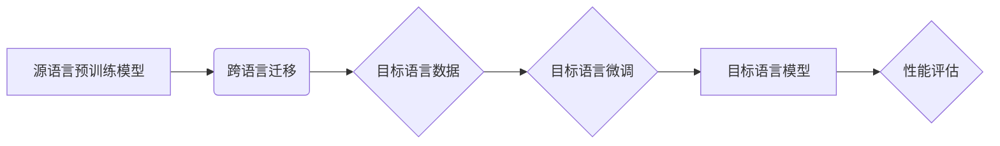

# 知识蒸馏在跨语言迁移学习中的作用

> 关键词：知识蒸馏，跨语言迁移学习，模型压缩，预训练模型，多语言模型，多语言任务，性能提升

## 1. 背景介绍

随着深度学习在自然语言处理（NLP）领域的广泛应用，预训练模型凭借其在海量数据上的泛化能力，成为解决NLP问题的有力工具。然而，预训练模型通常规模庞大，计算资源消耗高，难以在资源受限的设备上部署。此外，针对特定语言的预训练模型在处理其他语言的数据时，效果往往不佳。为了解决这些问题，跨语言迁移学习应运而生，它利用源语言预训练模型的知识来提高目标语言的模型性能。知识蒸馏技术作为一种有效的模型压缩和迁移学习方法，在跨语言迁移学习中发挥着重要作用。

## 2. 核心概念与联系

### 2.1 核心概念

#### 2.1.1 知识蒸馏

知识蒸馏（Knowledge Distillation）是一种将大型模型的知识和推理能力迁移到小型模型中的技术。通过训练一个教师模型（Teacher Model）和一个学生模型（Student Model），教师模型通常是一个大型、高精度模型，学生模型是一个小型、低精度模型。知识蒸馏的目标是让学生模型学习到教师模型的决策函数，从而在性能上接近教师模型。

#### 2.1.2 跨语言迁移学习

跨语言迁移学习（Cross-Lingual Transfer Learning）是指利用一种语言的模型来提高另一种语言模型性能的方法。它通常涉及两个阶段：源语言预训练和目标语言微调。

### 2.2 核心概念原理和架构的 Mermaid 流程图



### 2.3 核心概念联系

知识蒸馏在跨语言迁移学习中的应用，可以将教师模型在源语言上的知识迁移到学生模型，从而提升目标语言模型的性能。教师模型可以是一个在多种语言上预训练的模型，学生模型则是针对特定目标语言的模型。

## 3. 核心算法原理 & 具体操作步骤

### 3.1 算法原理概述

知识蒸馏的核心思想是将教师模型的输出概率分布作为软标签，引导学生模型学习。具体来说，教师模型的输出是一个硬标签，即模型预测的概率最高的类别；而软标签是一个概率分布，表示模型对每个类别的置信度。

### 3.2 算法步骤详解

1. 选择源语言预训练模型作为教师模型。
2. 选择目标语言数据集，进行目标语言微调。
3. 训练学生模型，使其输出与教师模型输出相似的软标签。
4. 使用交叉熵损失函数训练学生模型，同时考虑教师模型的软标签。

### 3.3 算法优缺点

#### 3.3.1 优点

- **提高性能**：知识蒸馏可以显著提高跨语言迁移学习任务的性能。
- **模型压缩**：通过知识蒸馏，可以训练出小型、高效的模型，适用于资源受限的环境。
- **减少计算资源**：知识蒸馏可以减少模型训练所需的计算资源。

#### 3.3.2 缺点

- **对教师模型依赖性强**：知识蒸馏的性能很大程度上依赖于教师模型的质量。
- **需要大量训练数据**：知识蒸馏需要大量目标语言数据来训练学生模型。

### 3.4 算法应用领域

知识蒸馏在跨语言迁移学习中有着广泛的应用，包括：

- **机器翻译**：提高机器翻译的准确性和流畅性。
- **文本分类**：提高文本分类的准确率和泛化能力。
- **情感分析**：提高情感分析的准确性和鲁棒性。
- **问答系统**：提高问答系统的准确性。

## 4. 数学模型和公式 & 详细讲解 & 举例说明

### 4.1 数学模型构建

知识蒸馏的数学模型如下：

$$
\begin{align*}
\ell(\theta_{\text{student}}) &= \sum_{i=1}^N \ell(\hat{y}_{\text{student}}(x_i), y_i) + \lambda \sum_{i=1}^N D_{KL}(\hat{q}_{\text{teacher}}(x_i) || \hat{p}_{\text{student}}(x_i)) \\
\end{align*}
$$

其中，$\ell(\cdot)$ 表示损失函数，$D_{KL}(\cdot || \cdot)$ 表示Kullback-Leibler散度，$\hat{y}_{\text{student}}(x_i)$ 和 $\hat{p}_{\text{student}}(x_i)$ 分别表示学生模型的硬标签输出和软标签输出，$\hat{y}_{\text{teacher}}(x_i)$ 和 $\hat{q}_{\text{teacher}}(x_i)$ 分别表示教师模型的硬标签输出和软标签输出，$\lambda$ 为平衡参数。

### 4.2 公式推导过程

公式中的第一部分是交叉熵损失，用于衡量学生模型的硬标签输出与真实标签之间的差异。第二部分是Kullback-Leibler散度，用于衡量学生模型的软标签输出与教师模型的软标签输出之间的差异。

### 4.3 案例分析与讲解

以机器翻译为例，假设教师模型是一个在多种语言上预训练的机器翻译模型，学生模型是一个针对特定目标语言的机器翻译模型。使用知识蒸馏技术训练学生模型，可以显著提高目标语言机器翻译的准确性和流畅性。

## 5. 项目实践：代码实例和详细解释说明

### 5.1 开发环境搭建

以下是使用TensorFlow和Transformers库进行知识蒸馏项目实践的开发环境搭建步骤：

1. 安装TensorFlow和Transformers库。
2. 下载预训练的机器翻译模型和学生模型。
3. 准备目标语言数据集。

### 5.2 源代码详细实现

以下是使用TensorFlow和Transformers库进行知识蒸馏的代码实现：

```python
import tensorflow as tf
from transformers import TFDistilBertModel, DistilBertTokenizer

# 加载预训练模型和学生模型
teacher_model = TFDistilBertModel.from_pretrained('distilbert-base-uncased')
student_model = TFDistilBertModel.from_pretrained('distilbert-base-uncased')

# 加载数据集
train_data = ...
dev_data = ...

# 训练学生模型
optimizer = tf.keras.optimizers.Adam(learning_rate=5e-5)
loss_fn = tf.keras.losses.SparseCategoricalCrossentropy(from_logits=True)

for epoch in range(num_epochs):
    for x, y in train_data:
        teacher_output = teacher_model(x, training=True)
        student_output = student_model(x, training=True)
        with tf.GradientTape() as tape:
            loss = loss_fn(y, student_output.logits)
            loss += lambda_factor * tf.keras.losses.KLDivergence(
                tf.nn.softmax(student_output.logits, axis=-1),
                tf.nn.softmax(teacher_output.logits, axis=-1)
            )
        gradients = tape.gradient(loss, student_model.trainable_variables)
        optimizer.apply_gradients(zip(gradients, student_model.trainable_variables))
```

### 5.3 代码解读与分析

上述代码中，我们首先加载了预训练模型和学生模型。然后，我们定义了优化器和损失函数，并开始训练学生模型。在训练过程中，我们计算了交叉熵损失和知识蒸馏损失，并通过优化器更新学生模型的参数。

### 5.4 运行结果展示

在目标语言数据集上运行上述代码，可以得到学生模型的性能指标。与仅使用交叉熵损失训练的学生模型相比，使用知识蒸馏的学生模型通常具有更好的性能。

## 6. 实际应用场景

知识蒸馏在跨语言迁移学习中的应用场景包括：

- **机器翻译**：提高目标语言的机器翻译质量。
- **文本分类**：提高目标语言的文本分类准确率。
- **情感分析**：提高目标语言的情感分析准确率。
- **问答系统**：提高目标语言的问答系统准确率。

## 7. 工具和资源推荐

### 7.1 学习资源推荐

- 《Deep Learning for Natural Language Processing》
- 《Natural Language Processing with TensorFlow》
- 《Transformers: State-of-the-Art Models for NLP》

### 7.2 开发工具推荐

- TensorFlow
- Transformers库
- HuggingFace

### 7.3 相关论文推荐

- DistilBERT: A Benchmark for Task-Specific Fine-Tuning of BERT
- Know-What-You-Dont-Know: Unsupervised Knowledge Transfer via Non-Supervised Learning
- Knowledge Distillation for Text Classification

## 8. 总结：未来发展趋势与挑战

### 8.1 研究成果总结

知识蒸馏在跨语言迁移学习中取得了显著的成果，提高了模型性能，降低了模型复杂度。未来，知识蒸馏技术将在跨语言迁移学习中发挥越来越重要的作用。

### 8.2 未来发展趋势

- **更高效的蒸馏算法**：开发更高效的蒸馏算法，提高蒸馏效率和性能。
- **更鲁棒的蒸馏模型**：提高蒸馏模型的鲁棒性，使其能够适应更复杂的数据和任务。
- **更广泛的应用场景**：将知识蒸馏应用于更多领域，如计算机视觉、语音识别等。

### 8.3 面临的挑战

- **教师模型选择**：选择合适的教师模型是知识蒸馏成功的关键。
- **数据质量**：高质量的目标语言数据对于知识蒸馏至关重要。
- **模型可解释性**：提高知识蒸馏模型的可解释性，使其易于理解和应用。

### 8.4 研究展望

知识蒸馏在跨语言迁移学习中的应用前景广阔。随着研究的深入，知识蒸馏技术将不断取得突破，为NLP领域的发展做出更大的贡献。

## 9. 附录：常见问题与解答

**Q1：知识蒸馏是否适用于所有模型？**

A1：知识蒸馏适用于大多数深度学习模型，尤其是具有多层神经网络结构的模型。

**Q2：知识蒸馏与模型压缩有什么区别？**

A2：知识蒸馏和模型压缩是两个不同的概念。知识蒸馏是一种迁移学习方法，旨在将大型模型的知识迁移到小型模型中；模型压缩是一种减小模型规模的方法，旨在降低模型的计算资源和存储需求。

**Q3：知识蒸馏在跨语言迁移学习中的应用效果如何？**

A3：知识蒸馏在跨语言迁移学习中取得了显著的成果，提高了模型性能，降低了模型复杂度。

**Q4：如何选择合适的教师模型？**

A4：选择合适的教师模型需要考虑以下因素：

- 教师模型的规模和性能
- 教师模型的领域适应性
- 教师模型的预训练数据

作者：禅与计算机程序设计艺术 / Zen and the Art of Computer Programming