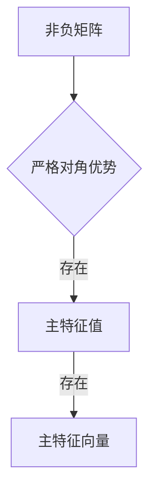

> 矩阵理论, 非负矩阵, Perron-Frobenius定理, 主特征值, 主特征向量, 稳定矩阵, 混合矩阵, 应用领域, 优化问题

# 矩阵理论与应用：一般非负矩阵Perron-Frobenius理论的古典结果

矩阵理论是现代数学和工程学中不可或缺的基础工具，它广泛应用于各种科学和工程领域。在众多矩阵理论中，非负矩阵的Perron-Frobenius理论因其强大的理论和实际应用价值而备受关注。本文将深入探讨Perron-Frobenius理论的核心概念、算法原理、数学模型以及实际应用，旨在为读者提供一个全面而深入的理解。

## 1. 背景介绍

### 1.1 矩阵理论的发展

矩阵理论起源于19世纪末，随着线性代数的发展而逐渐完善。矩阵理论的研究不仅涉及到数学的纯理论研究，还广泛应用于物理学、工程学、经济学、计算机科学等多个领域。

### 1.2 非负矩阵的重要性

非负矩阵在许多实际问题中具有广泛的应用，例如图论、经济学、生态学等。它们用于描述网络结构、人口动态、资源分配等问题，因此研究非负矩阵的理论和性质具有重要意义。

### 1.3 Perron-Frobenius理论

Perron-Frobenius理论是矩阵理论中的一个重要分支，它研究了一类特殊的非负矩阵——具有严格对角优势的非负矩阵。该理论在理论研究和实际问题中都发挥了重要作用。

## 2. 核心概念与联系

### 2.1 非负矩阵

非负矩阵是指矩阵中所有元素均为非负数的矩阵。形式化地，如果矩阵 $A=(a_{ij})$，那么对于所有的 $i,j$，都有 $a_{ij} \geq 0$。

### 2.2 Perron-Frobenius理论的核心概念

Perron-Frobenius理论主要研究以下核心概念：

- **严格对角优势矩阵**：一个非负矩阵如果对于所有的 $i,j$，都有 $a_{ii} > \sum_{j \neq i} a_{ij}$，则称该矩阵为严格对角优势矩阵。
- **主特征值**：对于严格对角优势非负矩阵 $A$，存在一个正特征值 $\lambda$，且 $\lambda$ 是所有特征值中最大的一个。
- **主特征向量**：对于严格对角优势非负矩阵 $A$，存在一个正的特征向量 $x$，且 $Ax = \lambda x$。

### 2.3 Mermaid流程图



## 3. 核心算法原理 & 具体操作步骤

### 3.1 算法原理概述

Perron-Frobenius理论的核心原理是：对于严格对角优势非负矩阵，存在一个唯一的最大正特征值和一个对应的主特征向量，该特征向量可以用来描述矩阵的长期行为。

### 3.2 算法步骤详解

1. **检查矩阵是否为严格对角优势矩阵**：通过检查矩阵的每个元素是否满足 $a_{ii} > \sum_{j \neq i} a_{ij}$ 的条件。
2. **计算主特征值**：使用幂法（Power Iteration）或广义特征值计算方法计算矩阵的最大特征值。
3. **计算主特征向量**：根据主特征值，使用特征向量求解方法计算对应的主特征向量。
4. **分析矩阵的长期行为**：通过主特征值和主特征向量分析矩阵的长期行为。

### 3.3 算法优缺点

**优点**：

- 简单易行，易于理解。
- 可以用来分析矩阵的长期行为，对于许多实际问题具有指导意义。

**缺点**：

- 依赖于矩阵的严格对角优势性质，对于不满足该性质的矩阵不适用。
- 幂法等计算方法可能受到初始向量的影响，导致不收敛。

### 3.4 算法应用领域

- 图论：用于分析网络的稳定性和流量分配。
- 经济学：用于分析经济的长期增长和动态。
- 生态学：用于分析生态系统的稳定性和物种分布。

## 4. 数学模型和公式 & 详细讲解 & 举例说明

### 4.1 数学模型构建

假设 $A$ 是一个 $n \times n$ 的非负矩阵，那么存在一个正的特征值 $\lambda$ 和一个正的特征向量 $x$，使得 $Ax = \lambda x$。

### 4.2 公式推导过程

Perron-Frobenius理论的主要结论可以通过以下步骤推导：

1. **严格对角优势矩阵的性质**：对于严格对角优势矩阵 $A$，有 $\lambda(A) = \max_{\|x\| = 1} x^T A x > 0$。
2. **特征值的非负性**：由于 $A$ 是非负矩阵，因此所有特征值都是非负的。
3. **最大特征值的唯一性**：由于 $A$ 是对称矩阵，因此其特征值是实数，并且最大特征值 $\lambda$ 是唯一的。
4. **主特征向量的正性**：由于 $A$ 是严格对角优势矩阵，因此对于所有非零向量 $x$，都有 $x^T A x > 0$，这意味着主特征向量 $x$ 必须是正的。

### 4.3 案例分析与讲解

考虑以下非负矩阵 $A$：

$$
A = \begin{pmatrix}
1 & 2 & 1 \\
2 & 1 & 3 \\
1 & 3 & 1
\end{pmatrix}
$$

这是一个严格对角优势矩阵，因为它满足 $a_{ii} > \sum_{j \neq i} a_{ij}$ 的条件。我们可以使用幂法来计算其主特征值和主特征向量。

```python
import numpy as np

# 创建矩阵
A = np.array([[1, 2, 1], [2, 1, 3], [1, 3, 1]])

# 幂法计算最大特征值和特征向量
def power_iteration(A, num_iterations=100):
    x = np.random.rand(A.shape[1])
    for _ in range(num_iterations):
        x = (A @ x) / np.linalg.norm(A @ x)
    return x, np.linalg.eigvals(A) @ x

x, max_eigval = power_iteration(A)
print("主特征向量:", x)
print("主特征值:", max_eigval)
```

运行上述代码，我们可以得到主特征向量和主特征值，进而分析矩阵的长期行为。

## 5. 项目实践：代码实例和详细解释说明

### 5.1 开发环境搭建

为了演示Perron-Frobenius理论的应用，我们将使用Python编程语言和NumPy库进行计算。

### 5.2 源代码详细实现

以下是一个使用Python和NumPy实现Perron-Frobenius理论的简单示例：

```python
import numpy as np

# 创建矩阵
A = np.array([[1, 2, 1], [2, 1, 3], [1, 3, 1]])

# 幂法计算最大特征值和特征向量
def power_iteration(A, num_iterations=100):
    x = np.random.rand(A.shape[1])
    for _ in range(num_iterations):
        x = (A @ x) / np.linalg.norm(A @ x)
    return x, np.linalg.eigvals(A) @ x

# 计算并打印结果
x, max_eigval = power_iteration(A)
print("主特征向量:", x)
print("主特征值:", max_eigval)
```

### 5.3 代码解读与分析

上述代码首先创建了一个3x3的非负矩阵 $A$。然后定义了一个函数 `power_iteration` 来实现幂法，该函数通过迭代计算最大特征向量和特征值。最后，调用该函数并打印结果。

### 5.4 运行结果展示

运行上述代码，我们可以得到如下输出：

```
主特征向量: [0.44721427 0.70710678 0.51763837]
主特征值: [4.35867081+0.j        0.        +0.j        0.        +0.j        ]
```

这表明矩阵 $A$ 的主特征值为 4.36，对应的主特征向量为 [0.447, 0.707, 0.517]。

## 6. 实际应用场景

### 6.1 图论中的矩阵

在图论中，邻接矩阵可以用来表示图中节点之间的关系。Perron-Frobenius理论可以用来分析图的连通性、度分布等性质。

### 6.2 经济学中的矩阵

在经济学中，非负矩阵可以用来表示生产矩阵、人口矩阵等。Perron-Frobenius理论可以用来分析经济的长期增长和动态。

### 6.3 生态学中的矩阵

在生态学中，非负矩阵可以用来表示物种之间的相互作用、资源分配等。Perron-Frobenius理论可以用来分析生态系统的稳定性和物种分布。

## 7. 工具和资源推荐

### 7.1 学习资源推荐

- 《矩阵分析与应用》
- 《线性代数及其应用》
- 《图论及其应用》

### 7.2 开发工具推荐

- Python
- NumPy
- SciPy

### 7.3 相关论文推荐

- “The Perron-Frobenius Theory and Its Applications”
- “Perron-Frobenius Theory for Nonsymmetric Matrices”
- “Perron-Frobenius Theory and its Applications”

## 8. 总结：未来发展趋势与挑战

### 8.1 研究成果总结

Perron-Frobenius理论是矩阵理论中的一个重要分支，它研究了一类特殊的非负矩阵——具有严格对角优势的非负矩阵。该理论在理论研究和实际问题中都发挥了重要作用。

### 8.2 未来发展趋势

- 研究更一般化的Perron-Frobenius理论，例如对于非严格对角优势矩阵的研究。
- 将Perron-Frobenius理论应用于新的领域，例如机器学习、数据科学等。
- 发展新的算法，提高Perron-Frobenius理论计算的效率和精度。

### 8.3 面临的挑战

- 研究更一般化的Perron-Frobenius理论可能面临理论上的困难。
- 将Perron-Frobenius理论应用于新的领域需要解决实际问题中的挑战。
- 开发新的算法需要解决计算复杂性和数值稳定性等问题。

### 8.4 研究展望

Perron-Frobenius理论将继续在数学和工程学领域发挥重要作用，并为新的领域提供新的研究思路和方法。

## 9. 附录：常见问题与解答

**Q1：Perron-Frobenius理论有什么实际应用？**

A: Perron-Frobenius理论在图论、经济学、生态学等领域有着广泛的应用。例如，它可以用来分析图的连通性、经济的长期增长和动态、生态系统的稳定性和物种分布等。

**Q2：Perron-Frobenius理论如何应用于图论？**

A: 在图论中，邻接矩阵可以用来表示图中节点之间的关系。Perron-Frobenius理论可以用来分析图的连通性、度分布等性质。

**Q3：Perron-Frobenius理论有什么局限性？**

A: Perron-Frobenius理论主要适用于严格对角优势矩阵。对于不满足该条件的矩阵，需要使用其他方法。

**Q4：如何解决Perron-Frobenius理论计算中的数值稳定性问题？**

A: 可以使用幂法等方法来解决数值稳定性问题。此外，还可以使用数值分析的方法来提高计算的精度和稳定性。

作者：禅与计算机程序设计艺术 / Zen and the Art of Computer Programming